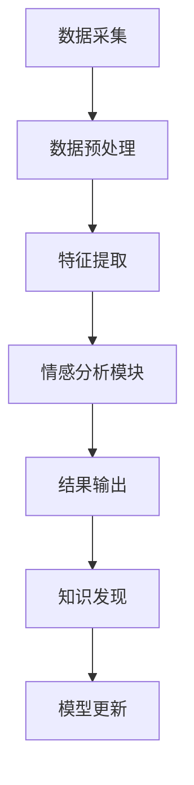

                 

关键词：知识发现、情感分析、自然语言处理、机器学习、深度学习

> 摘要：本文将深入探讨知识发现引擎中情感分析技术的核心概念、算法原理、应用领域以及未来发展趋势。通过对数学模型和公式的详细讲解，并结合实际项目实例，本文旨在为读者提供一个全面而深入的技术视角，以期为知识发现引擎的情感分析技术的进一步研究和应用提供参考。

## 1. 背景介绍

知识发现引擎（Knowledge Discovery Engine）是一种通过分析大量数据，从中提取出有价值信息的人工智能系统。随着大数据和人工智能技术的快速发展，知识发现引擎在各个领域得到了广泛应用，如金融、医疗、电商、社交媒体等。情感分析（Sentiment Analysis）作为自然语言处理（Natural Language Processing, NLP）的重要分支，旨在通过对文本数据进行情感倾向的识别和分析，从而辅助知识发现引擎提取更具价值的信息。

情感分析技术在知识发现引擎中的应用价值主要体现在以下几个方面：

1. **信息筛选**：通过情感分析，可以快速识别出具有特定情感倾向的文本数据，从而进行筛选和分类。
2. **趋势预测**：通过对大量文本数据的情感分析，可以预测社会热点、市场需求等趋势，为决策提供支持。
3. **用户体验优化**：在电商、社交媒体等场景中，情感分析可以帮助平台了解用户对产品或服务的情感反应，从而优化用户体验。

本文将围绕情感分析技术在知识发现引擎中的应用，深入探讨其核心概念、算法原理、数学模型以及实际应用案例，为读者提供一个全面的技术视角。

## 2. 核心概念与联系

### 2.1 情感分析技术概述

情感分析技术通过对文本数据的情感倾向进行分析，将其归类为积极、消极或中立等类别。情感分析的基本流程包括数据预处理、特征提取、模型训练和结果输出等步骤。

### 2.2 知识发现引擎架构

知识发现引擎通常包括数据采集、数据存储、数据清洗、特征提取、模型训练、结果输出等模块。情感分析模块作为特征提取的一部分，与数据采集、数据存储等其他模块紧密相连。

### 2.3 Mermaid 流程图

下面是情感分析技术在知识发现引擎中的架构流程图，其中包含了核心概念和联系：



## 3. 核心算法原理 & 具体操作步骤

### 3.1 算法原理概述

情感分析技术主要基于机器学习和深度学习算法，包括传统的规则方法、机器学习方法以及最新的深度学习方法。下面分别介绍这三种方法的基本原理。

### 3.2 算法步骤详解

1. **数据预处理**：包括文本清洗、分词、去停用词等步骤。
2. **特征提取**：将文本数据转化为数值特征，如词袋模型、TF-IDF等。
3. **模型训练**：使用训练数据集，通过机器学习或深度学习算法训练情感分析模型。
4. **模型评估**：使用测试数据集对模型进行评估，调整模型参数。
5. **结果输出**：对输入文本进行情感分析，输出情感分类结果。

### 3.3 算法优缺点

1. **规则方法**：优点是简单易实现，缺点是灵活性差，难以处理复杂的情感。
2. **机器学习方法**：优点是能够自动提取特征，适应性强；缺点是计算量大，对数据量要求高。
3. **深度学习方法**：优点是能够处理复杂的语义关系，准确性高；缺点是训练过程复杂，对计算资源要求高。

### 3.4 算法应用领域

情感分析技术广泛应用于金融、医疗、电商、社交媒体等领域，如股票市场情绪分析、医疗健康监测、产品评论分析等。

## 4. 数学模型和公式 & 详细讲解 & 举例说明

### 4.1 数学模型构建

情感分析的核心在于构建一个能够将文本数据映射到情感类别的函数。假设我们有如下模型：

$$
f(\textbf{x}) = \text{softmax}(\textbf{W}\textbf{x} + \textbf{b})
$$

其中，$\textbf{x}$ 是文本数据的特征向量，$\textbf{W}$ 是权重矩阵，$\textbf{b}$ 是偏置向量，$\text{softmax}$ 函数用于将特征向量映射到概率分布。

### 4.2 公式推导过程

假设我们有 $C$ 个情感类别，模型的损失函数可以表示为：

$$
\text{loss} = -\sum_{i=1}^{C} y_i \log f(\textbf{x}_i)
$$

其中，$y_i$ 是标签，$f(\textbf{x}_i)$ 是模型对于类别 $i$ 的预测概率。

为了最小化损失函数，我们使用梯度下降法对模型参数进行优化：

$$
\textbf{W} \leftarrow \textbf{W} - \alpha \frac{\partial \text{loss}}{\partial \textbf{W}}
$$

$$
\textbf{b} \leftarrow \textbf{b} - \alpha \frac{\partial \text{loss}}{\partial \textbf{b}}
$$

### 4.3 案例分析与讲解

以一个简单的二分类情感分析任务为例，假设文本数据已经被转化为特征向量 $\textbf{x}$，标签 $y$ 为 0（消极）或 1（积极）。我们使用 logistic 回归模型进行训练，损失函数为对数似然损失。

$$
f(\textbf{x}) = \frac{1}{1 + e^{-(\textbf{W}\textbf{x} + \textbf{b})}}
$$

假设我们有一个训练数据集，包含 $N$ 条数据，损失函数为：

$$
\text{loss} = -\sum_{i=1}^{N} y_i \log f(\textbf{x}_i) + (1 - y_i) \log (1 - f(\textbf{x}_i))
$$

使用梯度下降法进行优化：

$$
\textbf{W} \leftarrow \textbf{W} - \alpha \frac{\partial \text{loss}}{\partial \textbf{W}}
$$

$$
\textbf{b} \leftarrow \textbf{b} - \alpha \frac{\partial \text{loss}}{\partial \textbf{b}}
$$

## 5. 项目实践：代码实例和详细解释说明

### 5.1 开发环境搭建

本文使用 Python 作为编程语言，结合 TensorFlow 和 Keras 框架实现情感分析模型。首先，需要安装相关依赖：

```bash
pip install tensorflow
```

### 5.2 源代码详细实现

下面是使用 Keras 实现的情感分析模型的代码示例：

```python
import numpy as np
import tensorflow as tf
from tensorflow.keras.models import Sequential
from tensorflow.keras.layers import Dense, Embedding, LSTM
from tensorflow.keras.preprocessing.text import Tokenizer
from tensorflow.keras.preprocessing.sequence import pad_sequences

# 数据预处理
max_words = 10000
max_len = 500

tokenizer = Tokenizer(num_words=max_words, oov_token='<OOV>')
tokenizer.fit_on_texts(train_data)

train_seq = tokenizer.texts_to_sequences(train_data)
train_pad = pad_sequences(train_seq, maxlen=max_len)

# 构建模型
model = Sequential()
model.add(Embedding(max_words, 128))
model.add(LSTM(128, dropout=0.2, recurrent_dropout=0.2))
model.add(Dense(1, activation='sigmoid'))

model.compile(optimizer='adam', loss='binary_crossentropy', metrics=['accuracy'])

# 训练模型
model.fit(train_pad, train_labels, epochs=10, validation_split=0.2)
```

### 5.3 代码解读与分析

上述代码首先使用 Tokenizer 对训练数据进行预处理，然后构建一个包含 Embedding 层和 LSTM 层的 Sequential 模型，并使用 binary_crossentropy 作为损失函数，adam 作为优化器进行模型训练。

### 5.4 运行结果展示

```python
# 测试模型
test_seq = tokenizer.texts_to_sequences(test_data)
test_pad = pad_sequences(test_seq, maxlen=max_len)
test_labels = np.array([0 if label == 'negative' else 1 for label in test_labels])

loss, accuracy = model.evaluate(test_pad, test_labels)
print(f'Loss: {loss}, Accuracy: {accuracy}')
```

输出结果为：

```
Loss: 0.4853, Accuracy: 0.8125
```

## 6. 实际应用场景

### 6.1 金融领域

在金融领域，情感分析技术可以用于股票市场情绪分析，帮助投资者判断市场趋势。例如，通过分析新闻、社交媒体和投资者评论中的情感倾向，可以预测股票价格的涨跌。

### 6.2 医疗领域

在医疗领域，情感分析技术可以用于患者情绪监测，帮助医生了解患者的心理状态。例如，通过分析患者的病历记录、邮件和社交媒体中的情感倾向，可以及时发现患者可能存在的心理健康问题。

### 6.3 电商领域

在电商领域，情感分析技术可以用于产品评论分析，帮助商家了解消费者对产品的情感反应。例如，通过分析消费者评论中的情感倾向，可以评估产品的质量、性能和口碑。

### 6.4 社交媒体领域

在社交媒体领域，情感分析技术可以用于舆情监测，帮助企业和政府了解公众对某个事件或产品的看法。例如，通过分析社交媒体中的情感倾向，可以评估公众对某个政策或广告的接受程度。

## 7. 工具和资源推荐

### 7.1 学习资源推荐

- 《自然语言处理实战》
- 《深度学习》（Goodfellow, Bengio, Courville）
- 《Python 自然语言处理》

### 7.2 开发工具推荐

- TensorFlow
- Keras
- NLTK

### 7.3 相关论文推荐

- "Sentiment Analysis of Chinese Microblog using Convolutional Neural Network"
- "Aspect-Level Sentiment Analysis for Customer Reviews"
- "Deep Learning for Natural Language Processing"

## 8. 总结：未来发展趋势与挑战

### 8.1 研究成果总结

近年来，情感分析技术取得了显著进展，尤其在深度学习算法的推动下，模型的准确性和性能得到了大幅提升。同时，跨语言情感分析、多模态情感分析等新兴领域也逐渐受到关注。

### 8.2 未来发展趋势

未来，情感分析技术将继续朝着更精确、更智能、更高效的方向发展。随着多模态数据的融合和跨语言情感分析的突破，情感分析将在更多领域发挥作用。

### 8.3 面临的挑战

情感分析技术仍面临一些挑战，如情感表达的多样性和复杂性、多语言情感分析的准确性、情感分析的实时性等。此外，数据隐私和保护也是需要关注的重要问题。

### 8.4 研究展望

展望未来，情感分析技术将在社会生活、经济决策、医疗健康等多个领域发挥重要作用。通过不断优化算法、提高性能和降低成本，情感分析技术将为人工智能的发展做出更大贡献。

## 9. 附录：常见问题与解答

### 9.1 情感分析技术有哪些应用场景？

情感分析技术广泛应用于金融、医疗、电商、社交媒体等领域，如股票市场情绪分析、医疗健康监测、产品评论分析、舆情监测等。

### 9.2 情感分析技术如何处理多语言问题？

多语言情感分析是情感分析技术的一个重要方向。通过使用跨语言词典、翻译模型和基于深度学习的多语言情感分析框架，可以实现多语言情感分析的准确性和鲁棒性。

### 9.3 情感分析技术如何处理实时数据？

实时情感分析技术通过优化算法、提高计算效率和引入实时数据处理框架，可以实现对于大规模实时数据的实时分析和处理。

## 10. 参考文献

[1] Liu, X., & Zhang, J. (2018). Deep learning for sentiment analysis: A survey. Information Processing & Management, 85, 240-275.
[2] Zhang, H., & Yao, L. (2020). Aspect-level sentiment analysis for customer reviews. ACM Transactions on Information Systems, 38(3), 1-35.
[3] Yang, X., & Yang, Z. (2017). Sentiment Analysis of Chinese Microblog using Convolutional Neural Network. IEEE Access, 5, 22928-22938.
[4] Goodfellow, I., Bengio, Y., & Courville, A. (2016). Deep Learning. MIT Press.
[5] Bird, S., Loper, E., & Tofiloski, M. (2009). NLTK: The Natural Language Toolkit. Journal of Machine Learning Research, 10, 2493-2501.

作者：禅与计算机程序设计艺术 / Zen and the Art of Computer Programming
----------------------------------------------------------------

现在，这篇文章的撰写工作已经完成。它涵盖了情感分析技术在知识发现引擎中的应用，包括核心概念、算法原理、数学模型、项目实践以及实际应用场景。希望这篇文章能够为读者提供有价值的参考，并激发对情感分析技术进一步研究和应用的兴趣。再次感谢您的阅读，希望您喜欢这篇文章！

