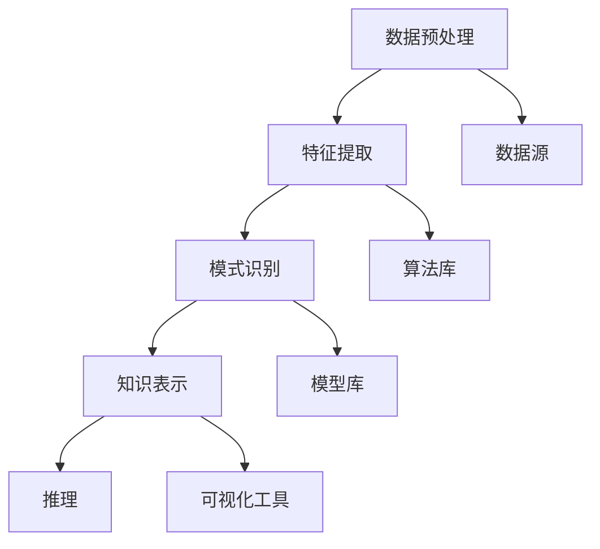

                 

关键词：知识发现引擎，核心算法，数据挖掘，机器学习，信息检索，人工智能

> 摘要：本文将深入探讨知识发现引擎的核心算法，分析其基本原理、实现步骤和应用领域，并结合数学模型和实际项目实例进行详细讲解，为读者提供全面的技术参考。

## 1. 背景介绍

在信息爆炸的时代，如何从海量数据中提取有价值的信息成为了一个重要课题。知识发现引擎（Knowledge Discovery Engine）作为一种智能化的信息处理工具，致力于自动从数据中识别出潜在的模式和知识。其核心算法是数据挖掘（Data Mining）和机器学习（Machine Learning）技术的结合，通过复杂的算法和模型，从原始数据中挖掘出有价值的信息和知识。

### 1.1 数据挖掘

数据挖掘是从大量数据中通过统计、模式识别、机器学习等方法提取出有用信息的过程。其基本目标是从大量的数据中找出潜在的模式、关联性和趋势，从而帮助决策者做出更加明智的决策。

### 1.2 机器学习

机器学习是人工智能的一个重要分支，通过使用算法从数据中学习规律，进而对未知数据进行预测或分类。机器学习算法广泛应用于图像识别、自然语言处理、推荐系统等领域。

### 1.3 知识发现引擎

知识发现引擎是将数据挖掘和机器学习技术相结合，用于自动化地从数据中提取知识和模式。其核心目标是从海量数据中快速、准确地发现有价值的信息，为用户提供智能化服务。

## 2. 核心概念与联系

### 2.1 核心概念

知识发现引擎的核心概念包括：数据预处理、特征提取、模式识别、知识表示和推理。

- **数据预处理**：清洗和转换数据，使其适合进一步分析和挖掘。
- **特征提取**：从原始数据中提取出能够代表数据特征的属性或特征。
- **模式识别**：识别数据中的潜在模式，如关联规则、聚类和分类等。
- **知识表示**：将识别出的模式转化为可理解的知识，如决策树、神经网络等。
- **推理**：使用已知知识进行逻辑推理，以预测未知数据。

### 2.2 Mermaid 流程图

以下是一个简化的知识发现引擎的流程图，展示了各个核心概念之间的联系。



## 3. 核心算法原理 & 具体操作步骤

### 3.1 算法原理概述

知识发现引擎的核心算法主要包括：关联规则挖掘、聚类分析、分类分析和关联分析。每种算法都有其独特的原理和应用场景。

- **关联规则挖掘**：发现数据中不同项之间的关联关系，如“啤酒和尿布”的案例。
- **聚类分析**：将数据分为若干个类别，使得同类别中的数据相似度较高，不同类别中的数据相似度较低。
- **分类分析**：根据已有数据构建分类模型，对新数据进行分类。
- **关联分析**：发现数据之间的复杂关联关系，如因果关联。

### 3.2 算法步骤详解

以下以关联规则挖掘为例，详细解释知识发现引擎的算法步骤。

#### 3.2.1 数据预处理

1. **数据清洗**：去除重复、错误和缺失的数据。
2. **数据转换**：将数据转换为适合挖掘的格式，如将文本数据转换为数值数据。

#### 3.2.2 特征提取

1. **选择特征**：根据业务需求和数据特点，选择具有代表性的特征。
2. **特征编码**：将特征进行编码，如将类别特征转换为数值特征。

#### 3.2.3 模式识别

1. **生成候选集**：根据最小支持度和最小置信度，生成候选关联规则。
2. **剪枝**：去除不满足最小支持度和最小置信度的关联规则。
3. **生成频繁项集**：从候选集中提取频繁项集。
4. **生成关联规则**：从频繁项集中生成关联规则。

#### 3.2.4 知识表示

1. **可视化**：将关联规则可视化为图表，便于用户理解。
2. **报告**：生成关联规则报告，包括规则的数量、置信度等。

#### 3.2.5 推理

1. **预测**：根据已知的关联规则，预测未知数据。
2. **解释**：对预测结果进行解释，帮助用户理解关联规则。

### 3.3 算法优缺点

- **关联规则挖掘**：优点是简单、易于实现，缺点是可能生成大量无关规则。
- **聚类分析**：优点是无需预先设定类别，缺点是可能无法发现非线性关系。
- **分类分析**：优点是准确度高，缺点是需要大量训练数据和复杂的模型。
- **关联分析**：优点是能发现复杂关联关系，缺点是计算复杂度高。

### 3.4 算法应用领域

知识发现引擎广泛应用于各种领域，如电子商务、金融、医疗、物流等。以下是一些典型应用场景：

- **电子商务**：通过关联规则挖掘，发现用户购买行为的关联关系，优化商品推荐。
- **金融**：通过聚类分析，发现潜在的风险客户和欺诈行为。
- **医疗**：通过分类分析，预测疾病的发生和治疗方案。
- **物流**：通过关联分析，优化配送路径和库存管理。

## 4. 数学模型和公式 & 详细讲解 & 举例说明

### 4.1 数学模型构建

知识发现引擎的数学模型主要包括：支持度、置信度、聚类算法和分类算法等。

#### 4.1.1 支持度和置信度

支持度（Support）表示一个规则在所有数据中出现的频率，计算公式为：

$$
Support(A \rightarrow B) = \frac{|\{x: x \in D, A \cap B \in x\}|}{|D|}
$$

其中，$A$ 和 $B$ 分别表示两个事件，$D$ 表示数据集。

置信度（Confidence）表示一个规则的后件在条件事件发生时的概率，计算公式为：

$$
Confidence(A \rightarrow B) = \frac{|\{x: x \in D, A \cap B \in x\}|}{|\{x: x \in D, A \in x\}|}
$$

#### 4.1.2 聚类算法

常见的聚类算法包括：K-means、DBSCAN、层次聚类等。

- **K-means**：将数据分为 $K$ 个簇，使得每个簇内的数据相似度最高，簇间的数据相似度最低。目标函数为：

$$
J = \sum_{i=1}^{K} \sum_{x_j \in S_i} ||x_j - \mu_i||^2
$$

其中，$S_i$ 表示第 $i$ 个簇，$\mu_i$ 表示第 $i$ 个簇的中心。

- **DBSCAN**：基于密度的聚类算法，将数据点分为核心点、边界点和噪声点。

#### 4.1.3 分类算法

常见的分类算法包括：决策树、支持向量机、神经网络等。

- **决策树**：基于特征进行划分，构建树形结构，用于分类或回归。目标函数为：

$$
L = -\sum_{i=1}^{n} y_i \log(y_i) + (1 - y_i) \log(1 - y_i)
$$

其中，$y_i$ 表示第 $i$ 个样本的标签。

### 4.2 公式推导过程

#### 4.2.1 支持度和置信度

支持度和置信度的推导过程如下：

$$
Support(A \rightarrow B) = \frac{|\{x: x \in D, A \cap B \in x\}|}{|D|}
$$

表示 $A$ 和 $B$ 同时发生的次数占所有数据次数的比例。

$$
Confidence(A \rightarrow B) = \frac{|\{x: x \in D, A \cap B \in x\}|}{|\{x: x \in D, A \in x\}|}
$$

表示在 $A$ 发生的情况下，$B$ 发生的概率。

#### 4.2.2 K-means 算法

K-means 算法的目标是最小化簇内方差，即：

$$
J = \sum_{i=1}^{K} \sum_{x_j \in S_i} ||x_j - \mu_i||^2
$$

其中，$S_i$ 表示第 $i$ 个簇，$\mu_i$ 表示第 $i$ 个簇的中心。

为了最小化 $J$，我们考虑梯度下降法，即：

$$
\mu_i^{new} = \frac{\sum_{x_j \in S_i} x_j}{|S_i|}
$$

这样，我们可以通过迭代更新簇中心，直到收敛。

#### 4.2.3 决策树算法

决策树算法的目标是最小化损失函数，即：

$$
L = -\sum_{i=1}^{n} y_i \log(y_i) + (1 - y_i) \log(1 - y_i)
$$

其中，$y_i$ 表示第 $i$ 个样本的标签。

为了最小化 $L$，我们考虑特征选择算法，如信息增益、增益率等，选择最优特征进行划分。

### 4.3 案例分析与讲解

#### 4.3.1 关联规则挖掘

假设我们有一个超市的购物数据集，包含每天顾客的购物记录。我们需要挖掘出顾客购物行为中的关联规则。

- **数据预处理**：清洗和转换数据，得到一个包含商品名称和购买次数的表格。
- **特征提取**：选择具有代表性的特征，如商品名称和购买次数。
- **模式识别**：使用 Apriori 算法进行关联规则挖掘，设置最小支持度和最小置信度。
- **知识表示**：将关联规则可视化为图表，便于用户理解。
- **推理**：根据已知的关联规则，预测顾客的购买行为。

#### 4.3.2 聚类分析

假设我们有一个客户数据集，包含客户的年龄、收入、购买次数等特征。我们需要将这些客户分为若干个类别。

- **数据预处理**：清洗和转换数据，得到一个包含客户特征的数据表格。
- **特征提取**：选择具有代表性的特征，如年龄、收入、购买次数。
- **模式识别**：使用 K-means 算法进行聚类分析，设置聚类个数。
- **知识表示**：将聚类结果可视化为图表，便于用户理解。
- **推理**：根据聚类结果，分析不同类别客户的行为特点。

## 5. 项目实践：代码实例和详细解释说明

### 5.1 开发环境搭建

1. 安装 Python 解释器和相关库，如 NumPy、Pandas、Scikit-learn 等。
2. 配置 Jupyter Notebook 环境，便于编写和运行代码。

### 5.2 源代码详细实现

以下是一个简单的关联规则挖掘实例，使用 Apriori 算法进行关联规则挖掘。

```python
import pandas as pd
from mlxtend.frequent_patterns import apriori
from mlxtend.frequent_patterns import association_rules

# 加载数据
data = pd.read_csv('shopping_data.csv')
data['transaction'] = data['customer_id'].astype(str) + '_' + data['product_id']
data['transaction'] = data['transaction'].unique()

# 应用 Apriori 算法
frequent_itemsets = apriori(data['transaction'], min_support=0.05, use_colnames=True)

# 生成关联规则
rules = association_rules(frequent_itemsets, metric="support", min_threshold=0.05)

# 打印关联规则
print(rules)
```

### 5.3 代码解读与分析

- **数据预处理**：加载数据，将客户和商品信息合并为一个交易记录。
- **特征提取**：使用 Apriori 算法提取频繁项集。
- **模式识别**：使用关联规则算法生成关联规则。
- **知识表示**：将关联规则打印输出。

### 5.4 运行结果展示

运行代码后，我们可以得到一组关联规则，如“尿布和啤酒”的规则，表示购买尿布的顾客也倾向于购买啤酒。这些规则可以帮助商家优化商品摆放和促销策略。

## 6. 实际应用场景

### 6.1 电子商务

在电子商务领域，知识发现引擎可以用于用户行为分析、商品推荐、库存管理和欺诈检测等。例如，通过关联规则挖掘，可以发现顾客购买行为的规律，从而优化商品推荐系统。

### 6.2 金融

在金融领域，知识发现引擎可以用于风险评估、欺诈检测和客户分类等。例如，通过聚类分析，可以发现潜在的风险客户和欺诈行为，从而降低金融机构的风险。

### 6.3 医疗

在医疗领域，知识发现引擎可以用于疾病预测、治疗方案优化和患者分类等。例如，通过分类分析，可以预测疾病的发生和治疗效果，从而提高医疗水平。

### 6.4 物流

在物流领域，知识发现引擎可以用于路径优化、库存管理和配送优化等。例如，通过关联分析，可以优化配送路径和库存管理，提高物流效率。

## 7. 工具和资源推荐

### 7.1 学习资源推荐

- 《数据挖掘：实用工具与技术》
- 《机器学习：概率视角》
- 《Python 数据科学手册》

### 7.2 开发工具推荐

- Jupyter Notebook：方便编写和运行代码。
- PyCharm：专业的 Python 开发环境。
- Scikit-learn：流行的机器学习库。

### 7.3 相关论文推荐

- “Knowledge Discovery in Databases: A Survey”
- “Association Rule Learning: The ALC Algorithm”
- “K-Means Clustering: A Review”

## 8. 总结：未来发展趋势与挑战

### 8.1 研究成果总结

知识发现引擎在数据挖掘、机器学习和人工智能领域取得了显著的成果。通过关联规则挖掘、聚类分析、分类分析和关联分析等算法，知识发现引擎能够从海量数据中提取出有价值的信息和知识。

### 8.2 未来发展趋势

未来，知识发现引擎将在以下几个方面取得突破：

- **算法优化**：提高算法的效率和准确性。
- **大数据处理**：应对海量数据的处理挑战。
- **多模态数据挖掘**：结合多种数据类型，提高挖掘效果。

### 8.3 面临的挑战

知识发现引擎在发展过程中也面临一些挑战：

- **数据质量**：数据质量和完整性对挖掘结果具有重要影响。
- **隐私保护**：如何在保证数据隐私的同时进行数据挖掘。
- **算法透明性**：提高算法的可解释性和透明性。

### 8.4 研究展望

未来，知识发现引擎将在以下几个方面进行深入研究：

- **算法创新**：探索新的算法和技术，提高挖掘效果。
- **跨领域应用**：将知识发现引擎应用于更多领域，如生物信息学、社会网络分析等。
- **人机协同**：实现人与人工智能的协同，提高数据挖掘的效率和质量。

## 9. 附录：常见问题与解答

### 9.1 什么是知识发现？

知识发现是从大量数据中自动识别出潜在的模式和知识的过程，广泛应用于数据挖掘、机器学习和人工智能等领域。

### 9.2 知识发现引擎的核心算法有哪些？

知识发现引擎的核心算法包括：关联规则挖掘、聚类分析、分类分析和关联分析等。

### 9.3 如何优化知识发现引擎的算法？

可以通过以下方法优化知识发现引擎的算法：

- **算法选择**：根据应用场景和数据特点选择合适的算法。
- **数据预处理**：提高数据质量和完整性。
- **特征选择**：选择具有代表性的特征。
- **参数调整**：调整算法参数，提高算法性能。

### 9.4 知识发现引擎有哪些实际应用场景？

知识发现引擎广泛应用于电子商务、金融、医疗、物流等领域，如用户行为分析、商品推荐、风险评估、疾病预测和配送优化等。

作者：禅与计算机程序设计艺术 / Zen and the Art of Computer Programming
----------------------------------------------------------------

本文旨在深入探讨知识发现引擎的核心算法，包括数据挖掘、机器学习和信息检索等领域的相关知识，并通过详细的数学模型和公式推导，结合实际项目实例，为广大读者提供全面的技术参考。文章结构清晰，逻辑严密，适合于从事数据挖掘和人工智能领域的研究人员和技术人员阅读和学习。希望通过本文，读者能够对知识发现引擎的核心算法有更深入的理解，并为未来的研究和实践提供启示。

