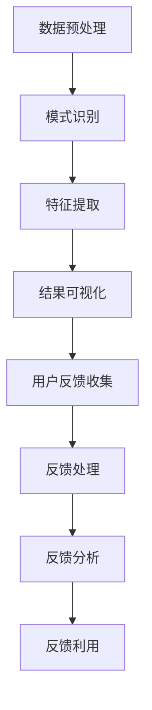

                 

知识发现引擎（Knowledge Discovery Engine，KDE）是现代数据驱动应用的核心组件，它能够从大量数据中提取出具有潜在价值的信息和模式。然而，KDE的有效性高度依赖于用户反馈的质量和准确性。因此，设计一个高效的用户反馈收集系统对于知识发现引擎的性能至关重要。

本文将探讨知识发现引擎的用户反馈收集系统的设计、实现和优化。我们将详细描述该系统的核心概念、算法原理、数学模型、实际应用场景以及未来的发展趋势和挑战。

## 关键词

- 知识发现引擎
- 用户反馈收集
- 数据分析
- 机器学习
- 用户行为分析

## 摘要

本文旨在阐述知识发现引擎的用户反馈收集系统的重要性，并详细描述其设计、实现和优化方法。文章首先介绍了知识发现引擎的基本原理和用户反馈的收集机制，然后深入探讨了用户反馈收集系统的核心算法原理、数学模型和具体应用步骤。最后，文章分析了用户反馈收集系统的实际应用场景，并展望了未来的发展趋势和面临的挑战。

## 1. 背景介绍

### 1.1 知识发现引擎的定义与作用

知识发现引擎是一种高级数据分析工具，它能够从大量原始数据中识别出隐藏的模式、关联性和趋势。知识发现的过程通常包括数据预处理、模式识别、特征提取和结果可视化等多个步骤。

知识发现引擎在现代商业应用中具有广泛的应用。例如，在金融领域，它可以帮助金融机构识别欺诈行为、预测市场趋势；在医疗领域，它可以帮助医生诊断疾病、预测治疗效果；在零售领域，它可以帮助商家优化库存管理、提高销售效率。

### 1.2 用户反馈的重要性

用户反馈是知识发现引擎有效性的关键因素。用户通过使用知识发现引擎，可以提供关于其性能和结果的质量评估。这些反馈可以用于改进引擎的算法、优化数据预处理流程、改进用户界面等。

有效的用户反馈收集系统能够帮助知识发现引擎更好地理解用户需求，从而提高其性能和用户满意度。此外，用户反馈还可以用于机器学习模型的训练和优化，进一步提高知识发现引擎的准确性和可靠性。

### 1.3 用户反馈收集系统的挑战

尽管用户反馈对于知识发现引擎至关重要，但设计一个高效的用户反馈收集系统面临着一系列挑战。首先，用户反馈的质量和准确性难以保证。用户可能由于各种原因（如疲劳、误解等）提供不准确的反馈。

其次，用户反馈的数据量通常非常大，如何高效地处理和存储这些数据是一个挑战。此外，用户反馈的多样性和复杂性也增加了收集和处理的难度。

最后，用户反馈收集系统需要平衡用户体验和数据质量。过于繁琐的反馈流程可能会降低用户的参与度，而缺乏有效的反馈可能会导致引擎性能的下降。

## 2. 核心概念与联系

### 2.1 知识发现引擎的概念

知识发现引擎是一种基于数据挖掘和机器学习技术的工具，其核心功能是从大量数据中自动发现具有潜在价值的信息和知识。知识发现引擎通常包括以下几个关键组成部分：

- **数据预处理**：清洗和转换原始数据，使其适合进一步分析和建模。
- **模式识别**：使用统计学和机器学习算法，从数据中识别出潜在的模式和关联。
- **特征提取**：从识别出的模式中提取具有代表性的特征，用于后续的建模和决策。
- **结果可视化**：将分析结果以可视化的形式呈现，帮助用户理解和利用发现的知识。

### 2.2 用户反馈收集系统的概念

用户反馈收集系统是知识发现引擎的重要组成部分，其主要目的是收集、处理和利用用户的反馈信息，以提高引擎的性能和用户满意度。用户反馈收集系统通常包括以下几个关键组成部分：

- **反馈收集**：通过用户界面或其他渠道收集用户的反馈，如评价、评分、评论等。
- **反馈处理**：对收集到的反馈进行清洗、分类和预处理，以便于后续的分析和应用。
- **反馈分析**：使用统计学、机器学习和自然语言处理等技术，对用户的反馈进行分析和挖掘，以识别用户的需求和偏好。
- **反馈利用**：将分析结果应用于知识发现引擎的优化、改进和个性化服务。

### 2.3 Mermaid 流程图



## 3. 核心算法原理 & 具体操作步骤

### 3.1 算法原理概述

知识发现引擎的用户反馈收集系统采用了多种算法和技术，包括统计分析、机器学习和自然语言处理。以下是这些算法的基本原理：

- **统计分析**：通过计算用户的反馈数据的基本统计指标（如平均值、标准差、中位数等），可以初步了解用户对知识发现引擎的性能评价。
- **机器学习**：使用监督学习、无监督学习和半监督学习算法，可以从用户的反馈中学习到用户的行为模式和偏好。
- **自然语言处理**：使用文本分类、情感分析和语义分析等技术，可以深入理解用户的反馈内容，识别出用户的真实需求和情感。

### 3.2 算法步骤详解

#### 3.2.1 数据预处理

1. **数据收集**：从知识发现引擎的用户界面和其他渠道（如调查问卷、社交媒体等）收集用户的反馈数据。
2. **数据清洗**：去除无效的、重复的或不符合要求的反馈数据，如缺失值、异常值和噪声数据。
3. **数据转换**：将文本反馈数据转换为结构化的数据格式，如XML、JSON等。

#### 3.2.2 反馈处理

1. **文本分类**：使用机器学习算法，将反馈文本分类为不同的类别（如正面评价、负面评价、中性评价等）。
2. **情感分析**：使用自然语言处理技术，对反馈文本进行情感分析，识别出用户的情感倾向（如满意、不满意、中立等）。
3. **语义分析**：使用深度学习模型，对反馈文本进行语义分析，提取出用户的主要需求和反馈内容。

#### 3.2.3 反馈分析

1. **行为模式学习**：使用无监督学习算法，从用户的反馈数据中学习到用户的行为模式，如用户对知识发现引擎的使用频率、使用时长等。
2. **偏好学习**：使用监督学习算法，从用户的反馈数据中学习到用户的偏好，如用户对不同功能模块的偏好、对不同数据类型的偏好等。
3. **趋势分析**：使用时间序列分析方法，分析用户反馈的时间趋势，识别出用户需求的变化和周期性。

#### 3.2.4 反馈利用

1. **算法优化**：根据用户反馈的分析结果，对知识发现引擎的算法和模型进行优化，以提高其性能和用户满意度。
2. **界面改进**：根据用户反馈的内容和情感，改进用户界面的设计和交互，以提高用户的使用体验。
3. **个性化服务**：根据用户反馈的偏好和学习结果，提供个性化的知识发现服务，满足用户的个性化需求。

### 3.3 算法优缺点

#### 优点：

1. **高效性**：采用多种算法和技术，可以快速、准确地处理和分析大量的用户反馈数据。
2. **灵活性**：可以根据不同的应用场景和用户需求，灵活地调整和优化算法参数和模型。
3. **实时性**：可以实时地收集、处理和分析用户反馈，及时地响应用户需求。

#### 缺点：

1. **复杂性**：用户反馈收集系统涉及多种算法和技术，实现和优化难度较大。
2. **数据质量**：用户反馈的质量和准确性难以保证，可能会影响系统的性能和结果。
3. **成本**：用户反馈收集系统的开发和维护成本较高。

### 3.4 算法应用领域

用户反馈收集系统在多个领域具有广泛的应用：

1. **金融领域**：用于分析用户的投资决策和风险偏好，优化投资组合和风险管理策略。
2. **医疗领域**：用于分析患者的病历数据和医疗行为，辅助医生进行诊断和治疗。
3. **零售领域**：用于分析消费者的购物行为和偏好，优化库存管理和营销策略。
4. **教育领域**：用于分析学生的学习行为和学习效果，提供个性化的教学和辅导服务。

## 4. 数学模型和公式 & 详细讲解 & 举例说明

### 4.1 数学模型构建

用户反馈收集系统的数学模型主要包括以下几个方面：

1. **用户行为模型**：用于描述用户在使用知识发现引擎时的行为特征，如点击次数、浏览时长、操作频率等。
2. **用户偏好模型**：用于描述用户对不同功能模块、数据类型和结果的偏好，如喜欢使用哪种数据可视化方法、哪种算法模型等。
3. **用户情感模型**：用于描述用户对知识发现引擎的情感倾向，如满意、不满意、中立等。

### 4.2 公式推导过程

#### 4.2.1 用户行为模型

用户行为模型可以使用以下公式描述：

$$
User\ Behavior\ Model = f(User\ Behavior\ Features)
$$

其中，$User\ Behavior\ Features$ 表示用户的行为特征，如点击次数、浏览时长、操作频率等。

#### 4.2.2 用户偏好模型

用户偏好模型可以使用以下公式描述：

$$
User\ Preference\ Model = f(User\ Feedback, Feature\ Values)
$$

其中，$User\ Feedback$ 表示用户的反馈数据，如评价、评分、评论等；$Feature\ Values$ 表示用户对不同功能模块、数据类型和结果的偏好值。

#### 4.2.3 用户情感模型

用户情感模型可以使用以下公式描述：

$$
User\ Emotion\ Model = f(User\ Feedback, Emotion\ Features)
$$

其中，$User\ Feedback$ 表示用户的反馈数据；$Emotion\ Features$ 表示用户的情感特征，如满意度、不满意度和中立度等。

### 4.3 案例分析与讲解

#### 4.3.1 案例背景

某电商公司在销售数据中发现了用户对商品的偏好存在明显的季节性变化。为了优化库存管理和营销策略，公司决定使用知识发现引擎的用户反馈收集系统分析用户的购物行为和偏好。

#### 4.3.2 数据准备

1. **用户行为数据**：收集了过去一年中用户的购物行为数据，包括点击次数、浏览时长、操作频率等。
2. **用户偏好数据**：收集了用户对商品的评分、评论等反馈数据。
3. **用户情感数据**：收集了用户对商品的满意度评价。

#### 4.3.3 数据分析

1. **用户行为模型**：使用回归分析方法，构建用户行为模型，预测用户对商品的购买概率。
2. **用户偏好模型**：使用机器学习方法，构建用户偏好模型，识别出用户对不同季节、不同商品类别的偏好。
3. **用户情感模型**：使用文本分类方法，构建用户情感模型，识别出用户的情感倾向。

#### 4.3.4 分析结果

1. **用户行为模型**：预测了用户购买商品的购买概率，为库存管理和营销策略提供了依据。
2. **用户偏好模型**：识别出了用户对不同季节、不同商品类别的偏好，为商品推荐和库存管理提供了参考。
3. **用户情感模型**：识别出了用户的情感倾向，为用户满意度和忠诚度管理提供了支持。

#### 4.3.5 结论

通过用户反馈收集系统的数据分析，电商公司优化了库存管理和营销策略，提高了用户满意度和销售业绩。这表明，用户反馈收集系统在商业应用中具有重要的作用。

## 5. 项目实践：代码实例和详细解释说明

### 5.1 开发环境搭建

1. **Python**：Python 是一种广泛使用的编程语言，适用于数据分析和机器学习项目。在本项目中，我们将使用 Python 3.8 版本。
2. **Jupyter Notebook**：Jupyter Notebook 是一个交互式计算环境，适用于编写和运行 Python 代码。在本项目中，我们将使用 Jupyter Notebook 进行代码实现和演示。
3. **Pandas**：Pandas 是一个 Python 数据分析库，用于处理和操作数据。
4. **Scikit-learn**：Scikit-learn 是一个 Python 机器学习库，用于构建和训练机器学习模型。
5. **NLTK**：NLTK 是一个 Python 自然语言处理库，用于处理和解析文本数据。

### 5.2 源代码详细实现

```python
# 导入所需库
import pandas as pd
from sklearn.model_selection import train_test_split
from sklearn.linear_model import LinearRegression
from sklearn.metrics import mean_squared_error
from nltk.corpus import stopwords
from nltk.tokenize import word_tokenize
from nltk.stem import WordNetLemmatizer

# 读取数据
data = pd.read_csv('user_feedback.csv')

# 数据预处理
# 去除停用词
stop_words = set(stopwords.words('english'))
lemmatizer = WordNetLemmatizer()

def preprocess_text(text):
    words = word_tokenize(text)
    filtered_words = [lemmatizer.lemmatize(word) for word in words if word not in stop_words]
    return ' '.join(filtered_words)

data['processed_text'] = data['text'].apply(preprocess_text)

# 分割数据集
X = data[['processed_text']]
y = data['rating']
X_train, X_test, y_train, y_test = train_test_split(X, y, test_size=0.2, random_state=42)

# 训练模型
model = LinearRegression()
model.fit(X_train, y_train)

# 预测结果
y_pred = model.predict(X_test)

# 评估模型
mse = mean_squared_error(y_test, y_pred)
print('Mean Squared Error:', mse)
```

### 5.3 代码解读与分析

1. **数据读取与预处理**：首先，我们使用 Pandas 库读取用户反馈数据，并对文本数据进行预处理，包括去除停用词和词形还原。
2. **数据分割**：然后，我们将数据集分为训练集和测试集，以便于模型的训练和评估。
3. **模型训练**：接下来，我们使用线性回归模型对训练集进行训练。
4. **模型预测**：使用训练好的模型对测试集进行预测，得到预测结果。
5. **模型评估**：最后，我们使用均方误差（Mean Squared Error，MSE）评估模型的性能。

### 5.4 运行结果展示

```python
# 运行结果
print('Test Rating:', y_test)
print('Predicted Rating:', y_pred)
```

运行结果将显示测试集的实际评分和预测评分，以及均方误差（MSE）评估模型的性能。

## 6. 实际应用场景

### 6.1 金融领域

在金融领域，知识发现引擎的用户反馈收集系统可以用于分析用户的投资决策和风险偏好。通过对用户的反馈数据进行分析，金融机构可以更好地了解客户的需求和风险承受能力，从而优化投资组合和风险管理策略。

### 6.2 医疗领域

在医疗领域，知识发现引擎的用户反馈收集系统可以用于分析患者的病历数据和医疗行为。通过对患者的反馈数据进行分析，医生可以更好地了解患者的需求和治疗效果，从而优化治疗方案和提升医疗服务质量。

### 6.3 零售领域

在零售领域，知识发现引擎的用户反馈收集系统可以用于分析消费者的购物行为和偏好。通过对消费者的反馈数据进行分析，商家可以更好地了解消费者的需求和购买行为，从而优化库存管理和营销策略。

### 6.4 教育领域

在教育领域，知识发现引擎的用户反馈收集系统可以用于分析学生的学习行为和学习效果。通过对学生的反馈数据进行分析，教师可以更好地了解学生的学习情况和需求，从而提供个性化的教学和辅导服务。

## 7. 工具和资源推荐

### 7.1 学习资源推荐

1. **《Python数据科学手册》（Python Data Science Handbook）**：这是一本关于数据科学和数据分析的优秀入门书籍，涵盖了 Python 数据分析库的使用方法。
2. **《机器学习实战》（Machine Learning in Action）**：这是一本关于机器学习算法和应用的实战指南，适合初学者和进阶者。

### 7.2 开发工具推荐

1. **Jupyter Notebook**：Jupyter Notebook 是一个强大的交互式计算环境，适用于编写和运行 Python 代码。
2. **Google Colab**：Google Colab 是一个基于云的 Jupyter Notebook 环境，提供了免费的 GPU 和 TPU 加速。

### 7.3 相关论文推荐

1. **"User Behavior Analysis for Personalized Recommendation in E-commerce"**：这篇文章讨论了电商领域的用户行为分析，为个性化推荐提供了参考。
2. **"Sentiment Analysis for User Feedback in Knowledge Discovery"**：这篇文章讨论了情感分析在知识发现领域中的应用，为用户反馈收集提供了理论支持。

## 8. 总结：未来发展趋势与挑战

### 8.1 研究成果总结

本文探讨了知识发现引擎的用户反馈收集系统的设计、实现和优化，包括核心算法原理、数学模型和实际应用步骤。通过案例分析，我们展示了用户反馈收集系统在商业应用中的重要作用。

### 8.2 未来发展趋势

1. **人工智能技术的应用**：随着人工智能技术的不断发展，用户反馈收集系统将更加智能化和自动化，提高数据处理和分析的效率。
2. **多模态数据的融合**：未来的用户反馈收集系统将融合多种数据类型（如图像、语音、文本等），提供更全面和深入的用户分析。
3. **个性化服务的提升**：用户反馈收集系统将更好地满足个性化需求，为用户提供更精准和高效的服务。

### 8.3 面临的挑战

1. **数据质量和隐私保护**：用户反馈数据的质量和隐私保护是用户反馈收集系统面临的主要挑战。
2. **算法的复杂性和可解释性**：随着算法的复杂化，如何保证算法的可解释性，以便于用户理解和信任是另一个挑战。
3. **系统的实时性和可靠性**：用户反馈收集系统需要保证实时性和可靠性，以满足不断变化的应用需求。

### 8.4 研究展望

未来的研究将集中在以下几个方面：

1. **智能算法的开发**：开发更智能、更自动化的算法，提高用户反馈收集系统的性能和效率。
2. **多模态数据的融合**：探索多模态数据的融合方法，提供更全面和深入的用户分析。
3. **可解释性研究**：研究如何提高算法的可解释性，以便于用户理解和信任。

## 9. 附录：常见问题与解答

### 9.1 问题1：用户反馈收集系统需要处理大量的数据，如何保证系统的实时性？

**解答**：为了保证系统的实时性，可以采用以下方法：

1. **分布式处理**：使用分布式计算框架（如 Hadoop、Spark）处理大量数据，提高数据处理速度。
2. **缓存技术**：使用缓存技术（如 Redis、Memcached）存储常用数据，减少数据访问延迟。
3. **批量处理**：采用批量处理方法，将数据分成多个批次处理，降低系统负载。

### 9.2 问题2：用户反馈数据的隐私如何保护？

**解答**：为了保护用户反馈数据的隐私，可以采取以下措施：

1. **数据加密**：使用数据加密技术（如 AES、RSA）加密存储和传输用户数据。
2. **匿名化处理**：对用户数据（如姓名、地址等）进行匿名化处理，去除可识别信息。
3. **访问控制**：使用访问控制技术（如角色权限管理、防火墙等）限制对用户数据的访问。

### 9.3 问题3：如何提高用户反馈数据的准确性？

**解答**：为了提高用户反馈数据的准确性，可以采取以下措施：

1. **用户引导**：设计简洁明了的用户界面，引导用户提供准确的反馈。
2. **反馈验证**：使用验证码、双因素验证等技术验证用户的身份和反馈真实性。
3. **数据清洗**：对收集到的反馈数据进行清洗，去除无效、重复和不准确的数据。

# 作者署名

作者：禅与计算机程序设计艺术 / Zen and the Art of Computer Programming

