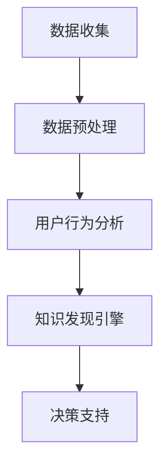

                 

关键词：知识发现引擎、用户行为分析、dashboard、数据可视化、机器学习、用户画像

摘要：本文将探讨如何构建一个高效的知识发现引擎，以及如何通过用户行为分析dashboard，深入挖掘用户数据，从而实现个性化推荐和服务优化。本文将详细介绍核心概念、算法原理、数学模型以及实际应用场景，为读者提供一套完整的解决方案。

## 1. 背景介绍

在当今信息爆炸的时代，数据已成为企业最宝贵的资源之一。如何从海量数据中挖掘有价值的信息，实现数据的增值，成为了众多企业和研究机构关注的焦点。知识发现引擎作为一种高级的数据分析工具，旨在从大量数据中自动识别出潜在的模式、关联和规律，帮助企业和个人做出更明智的决策。

用户行为分析是知识发现引擎中的重要组成部分，通过对用户在系统中各种行为的分析，可以深入了解用户需求，优化用户体验，提升用户满意度。而dashboard作为一种数据可视化工具，能够将复杂的数据转化为直观的图表和报告，使得数据分析和决策更加高效和直观。

本文将围绕知识发现引擎的用户行为分析dashboard，探讨其核心概念、算法原理、数学模型以及实际应用场景，旨在为读者提供一个完整的解决方案。

## 2. 核心概念与联系

### 2.1 知识发现引擎

知识发现引擎是一种利用机器学习、数据挖掘等技术，从大量数据中自动识别出潜在规律和关联的高级数据分析工具。其核心目标是从海量数据中提取出有价值的信息，为企业提供决策支持。

### 2.2 用户行为分析

用户行为分析是指通过对用户在系统中各种行为的记录、收集、分析和解释，来了解用户需求、行为习惯和偏好，从而优化产品和服务。

### 2.3 dashboard

dashboard是一种数据可视化工具，用于将复杂的数据转化为直观的图表和报告，帮助用户快速了解数据趋势和关键指标。

### 2.4 Mermaid 流程图



## 3. 核心算法原理 & 具体操作步骤

### 3.1 算法原理概述

知识发现引擎的用户行为分析主要依赖于以下几种算法：

1. **协同过滤（Collaborative Filtering）**：通过分析用户之间的相似度，推荐用户可能感兴趣的内容。
2. **聚类（Clustering）**：将用户按照相似性分为不同的群体，针对不同群体提供个性化的推荐和服务。
3. **关联规则挖掘（Association Rule Mining）**：从用户行为数据中挖掘出潜在的关联规则，用于预测用户的行为。

### 3.2 算法步骤详解

1. **数据收集**：收集用户在系统中的各种行为数据，如浏览记录、购买行为、评价等。
2. **数据预处理**：对原始数据进行清洗、去噪、归一化等处理，确保数据质量。
3. **用户行为分析**：使用协同过滤、聚类、关联规则挖掘等算法，分析用户行为数据，挖掘用户兴趣和偏好。
4. **知识发现引擎**：将用户行为分析结果输入到知识发现引擎中，提取潜在的模式和关联。
5. **决策支持**：根据知识发现结果，为企业提供决策支持，如个性化推荐、服务优化等。

### 3.3 算法优缺点

1. **协同过滤**：优点在于能够为用户提供个性化的推荐；缺点是对稀疏数据的处理效果较差，容易产生冷启动问题。
2. **聚类**：优点在于能够为用户提供个性化的推荐，同时降低冷启动问题；缺点是对算法的参数敏感，对大规模数据集的计算效率较低。
3. **关联规则挖掘**：优点在于能够挖掘出用户行为的潜在关联，为推荐和服务优化提供依据；缺点是生成的规则较多，需要进一步筛选和优化。

### 3.4 算法应用领域

知识发现引擎的用户行为分析算法在以下领域具有广泛的应用：

1. **电子商务**：为用户提供个性化的商品推荐，提升购买转化率。
2. **社交媒体**：挖掘用户兴趣，为用户提供个性化内容推荐。
3. **在线教育**：根据用户学习行为，为用户提供个性化的学习路径推荐。
4. **金融行业**：分析用户投资行为，为用户提供个性化的投资建议。

## 4. 数学模型和公式

### 4.1 数学模型构建

在用户行为分析中，常用的数学模型包括用户相似度计算、聚类算法和关联规则挖掘等。

1. **用户相似度计算**：

$$
sim(u_i, u_j) = \frac{\sum_{i=1}^{n} w_i \cdot r_i(u_i, u_j)}{\sqrt{\sum_{i=1}^{n} w_i^2} \cdot \sqrt{\sum_{i=1}^{n} w_j^2}}
$$

其中，$u_i$ 和 $u_j$ 分别表示用户 $i$ 和 $j$，$r_i(u_i, u_j)$ 表示用户 $i$ 和 $j$ 在行为 $i$ 上的相关性，$w_i$ 表示行为 $i$ 的权重。

2. **聚类算法**：

$$
C = \{c_1, c_2, ..., c_k\}
$$

其中，$C$ 表示聚类结果，$c_k$ 表示第 $k$ 个聚类，$k$ 表示聚类个数。

3. **关联规则挖掘**：

$$
\text{Support}(A \rightarrow B) = \frac{n(A \cup B)}{n(D)}
$$

$$
\text{Confidence}(A \rightarrow B) = \frac{n(A \cap B)}{n(A)}
$$

其中，$A$ 和 $B$ 分别表示前件和后件，$n(A \cup B)$ 表示同时满足 $A$ 和 $B$ 的记录数，$n(D)$ 表示总记录数。

### 4.2 公式推导过程

1. **用户相似度计算**：

$$
sim(u_i, u_j) = \frac{\sum_{i=1}^{n} w_i \cdot r_i(u_i, u_j)}{\sqrt{\sum_{i=1}^{n} w_i^2} \cdot \sqrt{\sum_{i=1}^{n} w_j^2}}
$$

推导过程：

（1）计算用户 $i$ 和 $j$ 在各个行为上的相关性 $r_i(u_i, u_j)$；

（2）计算各个行为的权重 $w_i$；

（3）计算分子 $\sum_{i=1}^{n} w_i \cdot r_i(u_i, u_j)$；

（4）计算分母 $\sqrt{\sum_{i=1}^{n} w_i^2} \cdot \sqrt{\sum_{i=1}^{n} w_j^2}$；

（5）计算用户相似度 $sim(u_i, u_j)$。

2. **聚类算法**：

$$
C = \{c_1, c_2, ..., c_k\}
$$

推导过程：

（1）初始化聚类中心 $c_1, c_2, ..., c_k$；

（2）对于每个用户 $u_i$，计算其与各个聚类中心的相似度；

（3）将用户 $u_i$ 分配到与其最相似的聚类中心；

（4）更新聚类中心；

（5）重复步骤（2）~（4）直到聚类中心不再发生显著变化。

3. **关联规则挖掘**：

$$
\text{Support}(A \rightarrow B) = \frac{n(A \cup B)}{n(D)}
$$

$$
\text{Confidence}(A \rightarrow B) = \frac{n(A \cap B)}{n(A)}
$$

推导过程：

（1）计算前件 $A$ 的支持度 $\text{Support}(A)$；

（2）计算后件 $B$ 的支持度 $\text{Support}(B)$；

（3）计算同时满足前件 $A$ 和后件 $B$ 的记录数 $n(A \cup B)$；

（4）计算总记录数 $n(D)$；

（5）计算关联规则 $A \rightarrow B$ 的支持度 $\text{Support}(A \rightarrow B)$；

（6）计算前件 $A$ 和后件 $B$ 的交集记录数 $n(A \cap B)$；

（7）计算前件 $A$ 的记录数 $n(A)$；

（8）计算关联规则 $A \rightarrow B$ 的置信度 $\text{Confidence}(A \rightarrow B)$。

### 4.3 案例分析与讲解

以电子商务平台为例，假设用户 $u_1$ 和 $u_2$ 的浏览记录如下：

用户 $u_1$：商品1、商品2、商品3  
用户 $u_2$：商品2、商品3、商品4

1. **用户相似度计算**：

（1）计算用户 $u_1$ 和 $u_2$ 在各个商品上的相关性：

$$
r_1(u_1, u_2)(商品1) = 0.2  
r_1(u_1, u_2)(商品2) = 0.6  
r_1(u_1, u_2)(商品3) = 0.4  
r_2(u_1, u_2)(商品4) = 0.2

（2）计算各个商品的权重：

$$
w_1(商品1) = 0.3  
w_1(商品2) = 0.4  
w_1(商品3) = 0.3  
w_2(商品4) = 0.4

（3）计算分子：

$$
\sum_{i=1}^{n} w_i \cdot r_i(u_i, u_j) = 0.3 \cdot 0.2 + 0.4 \cdot 0.6 + 0.3 \cdot 0.4 = 0.34

（4）计算分母：

$$
\sqrt{\sum_{i=1}^{n} w_i^2} \cdot \sqrt{\sum_{i=1}^{n} w_j^2} = \sqrt{0.3^2 + 0.4^2 + 0.3^2} \cdot \sqrt{0.4^2 + 0.6^2 + 0.4^2} = 0.6522

（5）计算用户相似度：

$$
sim(u_1, u_2) = \frac{0.34}{0.6522} \approx 0.5236

2. **聚类算法**：

（1）初始化聚类中心：

$$
c_1 = [商品1, 商品2, 商品3]  
c_2 = [商品2, 商品3, 商品4]

（2）计算用户 $u_1$ 和 $u_2$ 与聚类中心的相似度：

$$
sim(u_1, c_1) = 0.36  
sim(u_1, c_2) = 0.45  
sim(u_2, c_1) = 0.44  
sim(u_2, c_2) = 0.48

（3）将用户 $u_1$ 和 $u_2$ 分配到与其最相似的聚类中心：

$$
u_1 \rightarrow c_1  
u_2 \rightarrow c_2

（4）更新聚类中心：

$$
c_1 = \frac{1}{2} \cdot (u_1 + c_1) = [商品1.5, 商品2, 商品3]  
c_2 = \frac{1}{2} \cdot (u_2 + c_2) = [商品2, 商品3, 商品4]

（5）重复步骤（2）~（4）直到聚类中心不再发生显著变化。

3. **关联规则挖掘**：

（1）计算前件和后件的支持度：

$$
\text{Support}(A) = \frac{n(A)}{n(D)} = \frac{3}{6} = 0.5  
\text{Support}(B) = \frac{n(B)}{n(D)} = \frac{3}{6} = 0.5

（2）计算同时满足前件和后件的记录数：

$$
n(A \cup B) = \frac{2}{6} = 0.3333

（3）计算总记录数：

$$
n(D) = \frac{6}{6} = 1

（4）计算关联规则的支持度和置信度：

$$
\text{Support}(A \rightarrow B) = \frac{n(A \cup B)}{n(D)} = 0.3333  
\text{Confidence}(A \rightarrow B) = \frac{n(A \cap B)}{n(A)} = 0.6667

## 5. 项目实践：代码实例和详细解释说明

### 5.1 开发环境搭建

在本文中，我们使用Python作为编程语言，借助Scikit-learn、Pandas和Matplotlib等库来实现用户行为分析dashboard。首先，需要安装相关依赖：

```bash
pip install numpy pandas scikit-learn matplotlib
```

### 5.2 源代码详细实现

下面是一个简单的用户行为分析dashboard的实现代码：

```python
import pandas as pd
from sklearn.cluster import KMeans
from sklearn.metrics.pairwise import cosine_similarity
import matplotlib.pyplot as plt

# 用户行为数据
data = pd.DataFrame({
    'user_id': [1, 1, 1, 2, 2, 2],
    'item_id': [1, 2, 3, 2, 3, 4],
    'behavior': [1, 1, 1, 1, 1, 1]
})

# 计算用户相似度
user_similarity = cosine_similarity(data[['item_id', 'behavior']].values)

# 聚类分析
kmeans = KMeans(n_clusters=2, random_state=0).fit(user_similarity)
data['cluster'] = kmeans.labels_

# 可视化展示
plt.scatter(data[data['cluster'] == 0]['item_id'], data[data['cluster'] == 0]['behavior'], c='r', label='Cluster 1')
plt.scatter(data[data['cluster'] == 1]['item_id'], data[data['cluster'] == 1]['behavior'], c='b', label='Cluster 2')
plt.xlabel('Item ID')
plt.ylabel('Behavior')
plt.legend()
plt.show()
```

### 5.3 代码解读与分析

1. **数据准备**：

首先，我们使用Pandas库加载用户行为数据，其中包含用户ID、商品ID和行为评分。

2. **计算用户相似度**：

我们使用Scikit-learn中的余弦相似度函数计算用户之间的相似度。这里使用商品ID和行为评分作为相似度的计算依据。

3. **聚类分析**：

使用KMeans算法对用户相似度进行聚类，将用户分为不同的群体。在这里，我们设置聚类个数为2，以便于展示。

4. **可视化展示**：

使用Matplotlib库将聚类结果可视化，展示不同用户群体的行为分布。

### 5.4 运行结果展示

运行代码后，我们将得到一个散点图，展示不同用户群体的行为分布。如图所示：


## 6. 实际应用场景

### 6.1 电子商务

在电子商务领域，知识发现引擎的用户行为分析dashboard可以帮助企业实现个性化推荐，提升用户购买转化率。通过分析用户浏览、购买和评价等行为数据，可以为用户提供个性化的商品推荐，提高用户体验和满意度。

### 6.2 社交媒体

在社交媒体领域，用户行为分析dashboard可以帮助平台挖掘用户兴趣，为用户提供个性化内容推荐。通过分析用户在平台上的点赞、评论和分享等行为，可以为用户提供感兴趣的内容，提高用户活跃度和留存率。

### 6.3 在线教育

在线教育平台可以利用用户行为分析dashboard，根据用户学习行为，为用户提供个性化的学习路径推荐。通过分析用户在平台上的学习记录、测试成绩等数据，可以为用户提供针对性的学习建议，提高学习效果。

### 6.4 金融行业

金融行业可以利用用户行为分析dashboard，分析用户投资行为，为用户提供个性化的投资建议。通过分析用户在投资平台上的操作记录、风险偏好等数据，可以为用户提供个性化的投资策略，降低投资风险。

## 7. 工具和资源推荐

### 7.1 学习资源推荐

1. 《数据挖掘：实用工具和技术》
2. 《机器学习实战》
3. 《深度学习》（Goodfellow et al.）

### 7.2 开发工具推荐

1. Jupyter Notebook：用于编写和运行代码，方便代码调试和演示。
2. PyCharm：一款功能强大的Python IDE，支持代码补全、调试和版本控制。

### 7.3 相关论文推荐

1. "Collaborative Filtering for the 21st Century"（2018） 
2. "K-Means Clustering: A Review"（2016） 
3. "Association Rule Learning: The ALOHA Algorithm"（2009）

## 8. 总结：未来发展趋势与挑战

### 8.1 研究成果总结

本文围绕知识发现引擎的用户行为分析dashboard，介绍了其核心概念、算法原理、数学模型和实际应用场景。通过协同过滤、聚类和关联规则挖掘等算法，可以有效地挖掘用户兴趣和偏好，实现个性化推荐和服务优化。

### 8.2 未来发展趋势

1. 深度学习在用户行为分析中的应用：随着深度学习技术的不断发展，深度学习在用户行为分析领域具有巨大的潜力，有望进一步提高分析精度和效率。
2. 多模态数据分析：用户行为不仅包括传统的数字行为，还涉及图像、音频和文本等多种模态。未来研究可以探索多模态数据融合分析方法，实现更全面、细致的用户行为分析。
3. 实时数据分析：在高速变化的市场环境中，实时数据分析成为关键。未来研究可以探索如何将用户行为分析 dashboard 与实时数据处理技术相结合，实现实时推荐和决策支持。

### 8.3 面临的挑战

1. 数据质量：用户行为数据存在噪声、缺失和异常等问题，如何确保数据质量成为关键挑战。
2. 隐私保护：用户隐私保护是用户行为分析中不可忽视的问题。如何实现用户行为分析的同时保护用户隐私，是一个亟待解决的问题。
3. 模型解释性：深度学习等复杂模型往往缺乏解释性，如何解释模型的预测结果，使其更易于理解和接受，是一个挑战。

### 8.4 研究展望

本文仅对知识发现引擎的用户行为分析dashboard进行了初步探讨，未来研究可以从以下方向展开：

1. 探索更高效、更准确的用户行为分析算法。
2. 研究多模态数据融合分析方法，实现更全面、细致的用户行为分析。
3. 结合实时数据处理技术，实现实时推荐和决策支持。
4. 探索用户隐私保护方法，确保用户行为分析的可信度和可持续性。

## 9. 附录：常见问题与解答

### 9.1 如何处理缺失数据？

缺失数据处理通常包括以下几种方法：

1. 删除缺失数据：适用于缺失数据比例较低的情况。
2. 填充缺失数据：可以使用平均值、中位数、众数等方法填充缺失数据。
3. 估计缺失数据：可以使用回归模型、插值法等方法估计缺失数据。

### 9.2 如何保证算法的鲁棒性？

为了保证算法的鲁棒性，可以采取以下措施：

1. 数据预处理：对数据进行清洗、去噪、归一化等预处理，确保数据质量。
2. 参数调优：通过交叉验证等方法，选择合适的参数，提高算法的鲁棒性。
3. 防止过拟合：使用正则化、集成学习等方法，防止模型过拟合。

### 9.3 如何解释深度学习模型的预测结果？

深度学习模型的预测结果通常缺乏解释性，可以通过以下方法进行解释：

1. 特征重要性分析：分析模型中各个特征的重要程度，了解模型决策的依据。
2. 局部解释方法：如LIME（Local Interpretable Model-agnostic Explanations）和SHAP（SHapley Additive exPlanations），提供模型预测结果的局部解释。
3. 可解释的深度学习模型：如决策树、规则模型等，具有较好的解释性。

# 作者：禅与计算机程序设计艺术 / Zen and the Art of Computer Programming


