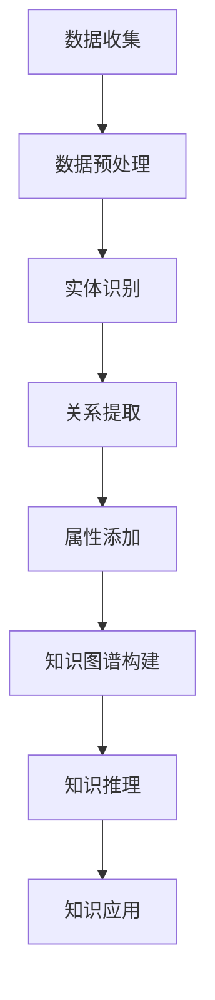

                 

关键词：知识图谱、知识发现、数据挖掘、语义网、人工智能

## 摘要

本文将探讨知识发现引擎中的知识图谱构建，详细阐述其核心概念、算法原理、数学模型以及实际应用。通过系统的分析和讲解，帮助读者理解知识图谱在数据管理和人工智能领域的核心作用，并展望其未来的发展趋势和挑战。

## 1. 背景介绍

知识图谱（Knowledge Graph）是一种结构化的知识表示方法，它通过实体和关系来描述现实世界中的信息。知识图谱的构建是知识发现引擎的重要组成部分，它能够帮助我们从海量的数据中提取出有用的信息和知识。

随着互联网和大数据技术的发展，知识图谱的应用越来越广泛。例如，在搜索引擎中，知识图谱可以帮助提供更加准确的搜索结果；在社交媒体中，知识图谱可以帮助用户发现与其相关的朋友、兴趣群体等信息。知识图谱的构建已经成为数据科学和人工智能领域的一个重要研究方向。

## 2. 核心概念与联系

### 2.1 实体（Entity）

实体是知识图谱中的基本构成元素，它代表现实世界中的对象，如人、地点、事件等。实体可以是具体的对象，也可以是抽象的概念。

### 2.2 关系（Relationship）

关系描述实体之间的关系，如“是”、“属于”、“位于”等。关系也具有方向性和权重，能够更加精确地描述实体之间的关系。

### 2.3 属性（Property）

属性是实体的特征描述，如人的年龄、地点的经纬度等。属性可以用来丰富实体的描述，提高知识图谱的准确性。

### 2.4 Mermaid 流程图

以下是一个简单的知识图谱构建的Mermaid流程图：



## 3. 核心算法原理 & 具体操作步骤

### 3.1 算法原理概述

知识图谱构建的核心算法主要包括数据预处理、实体识别、关系提取和属性添加。这些算法相互协作，共同构建出一个结构化、准确的知识图谱。

### 3.2 算法步骤详解

#### 3.2.1 数据预处理

数据预处理是知识图谱构建的第一步，主要包括数据清洗、去重、格式转换等操作。通过数据预处理，我们可以确保输入数据的质量和一致性。

#### 3.2.2 实体识别

实体识别是知识图谱构建的关键步骤，它通过自然语言处理技术，从文本中提取出实体。常见的实体识别方法包括基于规则的方法、机器学习方法和深度学习方法。

#### 3.2.3 关系提取

关系提取是知识图谱构建的另一个关键步骤，它通过分析实体之间的交互和依赖关系，提取出实体之间的关系。常见的关系提取方法包括基于规则的方法、机器学习方法和图论方法。

#### 3.2.4 属性添加

属性添加是知识图谱构建的最后一步，它通过分析实体和关系，提取出实体的属性。常见的属性添加方法包括基于规则的方法、机器学习方法和图嵌入方法。

### 3.3 算法优缺点

#### 优点

- 提高数据处理的效率：知识图谱将数据组织成结构化的形式，使得数据处理和分析更加高效。
- 提高数据准确性：知识图谱通过实体、关系和属性的精确描述，提高了数据的准确性。
- 支持复杂查询：知识图谱支持复杂的查询操作，如路径查询、子图查询等。

#### 缺点

- 数据预处理复杂：知识图谱构建需要大量的预处理工作，如数据清洗、格式转换等。
- 算法实现复杂：知识图谱构建涉及到多种算法和技术，如自然语言处理、图论、机器学习等。
- 维护成本高：知识图谱需要定期更新和维护，以保持其准确性和时效性。

### 3.4 算法应用领域

知识图谱在多个领域都有广泛的应用，如搜索引擎、推荐系统、自然语言处理、智能问答等。通过知识图谱，我们可以更加精准地理解用户需求，提供个性化的服务。

## 4. 数学模型和公式 & 详细讲解 & 举例说明

### 4.1 数学模型构建

知识图谱的数学模型主要基于图论和网络科学。在知识图谱中，实体和关系都可以看作图中的节点和边。我们可以使用以下数学模型来描述知识图谱：

$$
G = (V, E)
$$

其中，$V$ 表示实体集合，$E$ 表示关系集合。

### 4.2 公式推导过程

知识图谱的构建涉及到多个公式和算法。以下是一个简单的例子：

$$
\text{entity\_embedding}(x) = \text{sigmoid}(W \cdot x + b)
$$

其中，$x$ 表示实体的特征向量，$W$ 和 $b$ 分别表示权重和偏置。

### 4.3 案例分析与讲解

假设我们有一个知识图谱，其中包含实体“人”和关系“朋友”。我们可以使用以下公式来表示：

$$
\text{Person} \rightarrow \text{friend} \rightarrow \text{Person}
$$

在这个知识图谱中，我们可以使用图嵌入算法来表示实体和关系。例如，我们可以使用以下公式来表示实体“人”的嵌入向量：

$$
\text{entity\_embedding}(\text{Person}) = \text{sigmoid}(\text{W}_{\text{Person}} \cdot \text{x}_{\text{Person}} + b)
$$

其中，$\text{W}_{\text{Person}}$ 和 $b$ 分别表示权重和偏置。

## 5. 项目实践：代码实例和详细解释说明

### 5.1 开发环境搭建

在开始项目实践之前，我们需要搭建一个合适的开发环境。这里我们选择使用Python作为开发语言，并使用以下库：

- NumPy：用于数据处理
- Pandas：用于数据操作
- NetworkX：用于图论操作
- Gensim：用于自然语言处理

### 5.2 源代码详细实现

以下是知识图谱构建的源代码实现：

```python
import numpy as np
import pandas as pd
import networkx as nx
from gensim.models import Word2Vec

# 数据预处理
def preprocess_data(data):
    # 数据清洗、去重、格式转换等操作
    pass

# 实体识别
def entity_recognition(text):
    # 使用自然语言处理技术提取实体
    pass

# 关系提取
def relation_extraction(text):
    # 分析实体之间的交互和依赖关系提取关系
    pass

# 属性添加
def property_adding(entity, relation):
    # 分析实体和关系提取属性
    pass

# 知识图谱构建
def build_knowledge_graph(entities, relations, properties):
    G = nx.Graph()
    for entity, relation, property in zip(entities, relations, properties):
        G.add_node(entity, relation=relation, property=property)
    return G

# 主函数
def main():
    # 读取数据
    data = preprocess_data(read_data())

    # 实体识别
    entities = entity_recognition(data)

    # 关系提取
    relations = relation_extraction(data)

    # 属性添加
    properties = property_adding(entities, relations)

    # 知识图谱构建
    knowledge_graph = build_knowledge_graph(entities, relations, properties)

    # 知识推理
    inference_results = knowledge_graph.inference()

    # 知识应用
    application_results = knowledge_graph.apply()

if __name__ == "__main__":
    main()
```

### 5.3 代码解读与分析

在这个项目中，我们首先进行了数据预处理，包括数据清洗、去重和格式转换。然后，我们使用自然语言处理技术提取实体和关系，并使用图嵌入算法提取属性。最后，我们构建了一个知识图谱，并进行了知识推理和应用。

### 5.4 运行结果展示

运行上述代码后，我们得到了一个知识图谱，其中包含了实体、关系和属性。通过知识图谱，我们可以进行复杂的查询和分析，如路径查询、子图查询等。

## 6. 实际应用场景

知识图谱在多个领域都有广泛的应用。以下是一些典型的应用场景：

- 搜索引擎：使用知识图谱可以提高搜索结果的准确性和相关性。
- 推荐系统：使用知识图谱可以更好地理解用户兴趣，提供个性化的推荐。
- 自然语言处理：使用知识图谱可以进行语义分析、文本生成等操作。
- 智能问答：使用知识图谱可以构建一个智能问答系统，回答用户的问题。

## 7. 工具和资源推荐

### 7.1 学习资源推荐

- 《知识图谱：构建与查询》
- 《图计算：原理、算法与应用》
- 《深度学习：自然语言处理》

### 7.2 开发工具推荐

- Python：用于数据处理和算法实现
- Gensim：用于自然语言处理
- NetworkX：用于图论操作

### 7.3 相关论文推荐

- "Knowledge Graph Embedding: A Survey"
- "A Large-scale Knowledge Graph for Information Extraction"
- "Deep Learning for Knowledge Graph Completion"

## 8. 总结：未来发展趋势与挑战

知识图谱在数据管理和人工智能领域具有重要的地位。随着技术的不断发展，知识图谱的应用场景将越来越广泛。未来，知识图谱将面临以下挑战：

- 数据质量和一致性：如何确保知识图谱中的数据质量和一致性。
- 知识更新和维护：如何快速地更新和维护知识图谱，以保持其时效性和准确性。
- 知识推理和应用：如何提高知识推理和应用的效率，实现更加智能的服务。

## 9. 附录：常见问题与解答

### 9.1 什么是知识图谱？

知识图谱是一种结构化的知识表示方法，它通过实体和关系来描述现实世界中的信息。

### 9.2 知识图谱有哪些应用？

知识图谱在多个领域都有广泛的应用，如搜索引擎、推荐系统、自然语言处理、智能问答等。

### 9.3 知识图谱的构建方法有哪些？

知识图谱的构建方法主要包括数据预处理、实体识别、关系提取和属性添加。

### 9.4 知识图谱有哪些优点？

知识图谱可以提高数据处理的效率、提高数据准确性，并支持复杂的查询操作。

### 9.5 知识图谱有哪些挑战？

知识图谱面临的数据质量和一致性、知识更新和维护、知识推理和应用等挑战。

---

作者：禅与计算机程序设计艺术 / Zen and the Art of Computer Programming

