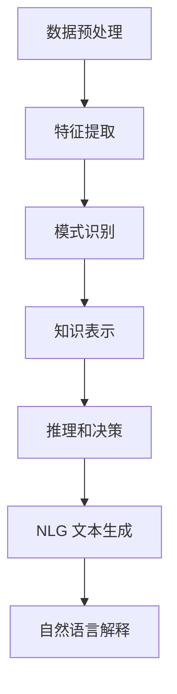

                 

### 关键词 Keywords
- 知识发现引擎
- 自然语言生成
- 人工智能
- 自然语言处理
- 机器学习

### 摘要 Abstract

本文旨在探讨知识发现引擎与自然语言生成技术之间的相互作用，以及这些技术如何共同推动人工智能领域的发展。首先，我们将介绍知识发现引擎的基本原理和自然语言生成的技术框架。接着，我们将深入分析核心算法原理，详细解释数学模型和公式，并通过实际项目实例展示技术实现。此外，我们还将探讨知识发现引擎在自然语言生成中的实际应用场景，并提出未来应用展望。最后，本文将对相关工具和资源进行推荐，总结研究成果，分析未来发展趋势和挑战，并提出研究展望。

## 1. 背景介绍

知识发现引擎（Knowledge Discovery Engine，简称KDE）是一种智能系统，旨在从大量数据中自动提取有用信息和知识。它广泛应用于数据挖掘、商业智能、金融分析等领域。随着大数据时代的到来，数据量的急剧增长使得知识发现成为一项重要任务。然而，这些数据通常以非结构化或半结构化的形式存在，如文本、图像、音频等。因此，如何有效地从这些数据中提取有价值的信息成为一个关键问题。

与此同时，自然语言生成（Natural Language Generation，简称NLG）技术作为人工智能的一个重要分支，旨在利用计算机程序自动生成自然语言文本。NLG技术能够实现机器与人类之间的自然沟通，具有重要的应用价值。在知识发现引擎中，自然语言生成技术可以用于将提取出的信息转化为易于理解和交互的自然语言形式，从而提高信息的可访问性和可用性。

本文将重点探讨知识发现引擎与自然语言生成技术之间的互动，分析核心算法原理，并探讨这些技术在实际应用中的实现和未来发展方向。

## 2. 核心概念与联系

### 2.1 知识发现引擎

知识发现引擎是一种基于人工智能和机器学习技术的系统，其主要目标是自动从大量数据中提取有价值的信息和知识。知识发现引擎通常包括以下几个核心组成部分：

1. **数据预处理**：数据预处理是知识发现过程的第一步，旨在清洗、转换和整合原始数据，以便后续的分析和处理。

2. **特征提取**：特征提取是从原始数据中提取出具有代表性的特征子集，这些特征有助于描述数据的基本属性和关系。

3. **模式识别**：模式识别是利用机器学习算法从特征数据中识别出具有意义的模式和规律。

4. **知识表示**：知识表示是将识别出的模式和规律转化为易于理解和存储的形式。

5. **推理和决策**：推理和决策是基于知识表示的结果，利用逻辑推理和决策算法生成新的知识和信息。

### 2.2 自然语言生成

自然语言生成技术旨在利用计算机程序生成自然语言文本。NLG技术主要包括以下几个核心组成部分：

1. **文本生成模型**：文本生成模型是NLG系统的核心，负责根据输入数据生成自然语言文本。

2. **语言模型**：语言模型是NLG技术的基础，用于预测文本中的下一个单词或短语。

3. **文本处理模块**：文本处理模块负责对输入文本进行预处理，包括分词、词性标注、句法分析等。

4. **文本生成引擎**：文本生成引擎是NLG系统的执行部分，根据语言模型和文本处理模块的结果生成自然语言文本。

### 2.3 知识发现引擎与自然语言生成技术的联系

知识发现引擎和自然语言生成技术在人工智能领域具有紧密的联系。具体而言，知识发现引擎可以生成自然语言文本，以解释和展示提取出的信息和知识。而自然语言生成技术则为知识发现引擎提供了将复杂数据转化为易于理解的形式的手段。两者相互作用，共同推动人工智能的发展。

### 2.4 Mermaid 流程图

以下是知识发现引擎和自然语言生成技术的 Mermaid 流程图：



## 3. 核心算法原理 & 具体操作步骤

### 3.1 算法原理概述

知识发现引擎的核心算法通常基于以下几种机器学习技术：

1. **聚类分析**：聚类分析是将数据分为多个群组，使得同一群组内的数据具有较高的相似度，而不同群组的数据则具有较低的相似度。

2. **分类算法**：分类算法是将数据分为不同的类别，以识别数据中的模式和规律。

3. **关联规则学习**：关联规则学习用于发现数据之间的关联关系，如购物篮分析中的商品组合。

4. **神经网络**：神经网络是一种模拟人脑神经元结构和功能的计算模型，常用于模式识别和特征提取。

自然语言生成技术通常基于以下算法：

1. **序列到序列（Seq2Seq）模型**：Seq2Seq模型是一种端到端的文本生成模型，可以将一个序列转换为另一个序列。

2. **变换器（Transformer）模型**：Transformer模型是一种基于自注意力机制的深度神经网络模型，广泛应用于自然语言处理任务。

3. **生成对抗网络（GAN）**：GAN是一种由两个神经网络组成的模型，一个生成器和一个判别器，用于生成逼真的自然语言文本。

### 3.2 算法步骤详解

#### 知识发现引擎

1. **数据预处理**：包括数据清洗、数据转换和数据整合，以便为后续分析做好准备。

2. **特征提取**：使用机器学习算法提取数据中的特征，如词频、TF-IDF、主题模型等。

3. **模式识别**：利用聚类算法、分类算法和关联规则学习等方法识别数据中的模式和规律。

4. **知识表示**：将识别出的模式和规律转化为结构化的知识表示，如知识图谱、本体等。

5. **推理和决策**：基于知识表示的结果，使用逻辑推理和决策算法生成新的知识和信息。

#### 自然语言生成

1. **文本生成模型**：使用Seq2Seq模型或Transformer模型，输入原始文本数据，生成自然语言文本。

2. **语言模型**：使用大规模语料库训练语言模型，以预测文本中的下一个单词或短语。

3. **文本处理模块**：对输入文本进行分词、词性标注、句法分析等预处理，以便为文本生成模型提供输入。

4. **文本生成引擎**：将预处理后的文本数据输入到文本生成模型，生成自然语言文本。

### 3.3 算法优缺点

#### 知识发现引擎

**优点**：

- 能够从大量数据中自动提取有价值的信息和知识。
- 可以应用于多种领域，如数据挖掘、商业智能、金融分析等。

**缺点**：

- 数据预处理和特征提取过程较为复杂，需要大量的计算资源和时间。
- 算法性能受到数据质量和特征提取方法的影响。

#### 自然语言生成

**优点**：

- 可以生成自然、流畅的自然语言文本。
- 能够实现机器与人类之间的自然沟通。

**缺点**：

- 需要大量的训练数据和计算资源。
- 生成文本的质量和准确性受到语言模型和文本处理模块的影响。

### 3.4 算法应用领域

知识发现引擎和自然语言生成技术在以下领域具有广泛的应用：

- **数据挖掘**：用于从大量数据中提取有价值的信息和知识。
- **商业智能**：用于分析市场趋势、客户行为和竞争对手动态。
- **金融分析**：用于预测金融市场走势、风险评估和投资决策。
- **自然语言处理**：用于生成自然语言文本、问答系统和机器翻译。

## 4. 数学模型和公式 & 详细讲解 & 举例说明

### 4.1 数学模型构建

在知识发现引擎中，常用的数学模型包括聚类分析、分类算法和关联规则学习等。以下分别介绍这些模型的数学模型构建：

#### 聚类分析

聚类分析是一种无监督学习方法，其目标是将数据分为多个群组，使得同一群组内的数据具有较高的相似度，而不同群组的数据则具有较低的相似度。常用的聚类算法包括K-均值聚类、层次聚类和DBSCAN等。

K-均值聚类的数学模型可以表示为：

$$
\begin{aligned}
\min_{\mu_1, \mu_2, ..., \mu_k} \sum_{i=1}^n \sum_{j=1}^k (x_i - \mu_j)^2 \\
s.t. \\
\mu_j = \frac{1}{n_j} \sum_{i \in C_j} x_i \\
x_i \in \mathbb{R}^d, \mu_j \in \mathbb{R}^d \\
n_j = \sum_{i=1}^n 1\{i \in C_j\}
\end{aligned}
$$

其中，$x_i$ 表示第 $i$ 个数据点，$\mu_j$ 表示第 $j$ 个群组的中心，$n_j$ 表示第 $j$ 个群组中的数据点个数，$C_j$ 表示第 $j$ 个群组。

#### 分类算法

分类算法是一种监督学习方法，其目标是将数据分为不同的类别。常用的分类算法包括决策树、支持向量机和朴素贝叶斯等。

支持向量机的数学模型可以表示为：

$$
\begin{aligned}
\max_{w, b} & \frac{1}{2} ||w||^2 \\
s.t. \\
y_i (w \cdot x_i + b) \geq 1 \\
i = 1, 2, ..., n
\end{aligned}
$$

其中，$w$ 表示权重向量，$b$ 表示偏置，$x_i$ 表示第 $i$ 个数据点，$y_i$ 表示第 $i$ 个数据点的类别标签。

#### 关联规则学习

关联规则学习是一种用于发现数据之间关联关系的方法。常用的算法包括Apriori算法和FP-Growth算法。

Apriori算法的数学模型可以表示为：

$$
\begin{aligned}
\min_{I} \sum_{X \in I} \frac{|X|}{|D|} \cdot \frac{|D - X|}{|D|} \\
s.t. \\
|X| \geq min_support \cdot |D| \\
I \subseteq \mathcal{U} \\
\end{aligned}
$$

其中，$I$ 表示频繁项集，$\mathcal{U}$ 表示全集，$|X|$ 表示项集 $X$ 的频率，$min_support$ 表示最小支持度。

### 4.2 公式推导过程

#### K-均值聚类

K-均值聚类的推导过程如下：

1. **初始化**：随机选择 $k$ 个数据点作为初始聚类中心 $\mu_1, \mu_2, ..., \mu_k$。

2. **分配数据点**：对于每个数据点 $x_i$，将其分配给具有最小距离的聚类中心。

3. **更新聚类中心**：计算每个聚类中心的均值。

4. **迭代**：重复步骤2和步骤3，直至聚类中心不再发生显著变化。

根据上述过程，我们可以推导出K-均值聚类的目标函数：

$$
J = \sum_{i=1}^n \sum_{j=1}^k (x_i - \mu_j)^2
$$

为了最小化目标函数 $J$，我们需要对 $\mu_j$ 进行优化。对 $J$ 关于 $\mu_j$ 求导，并令导数为零，得到：

$$
\nabla_{\mu_j} J = 2 \sum_{i=1}^n (x_i - \mu_j) = 0
$$

因此，

$$
\mu_j = \frac{1}{n_j} \sum_{i \in C_j} x_i
$$

其中，$n_j$ 表示第 $j$ 个聚类中心对应的聚类中的数据点个数。

#### 支持向量机

支持向量机的推导过程如下：

1. **初始化**：随机选择权重向量 $w$ 和偏置 $b$。

2. **优化目标**：最大化分类间隔，即最大化 $||w||$。

3. **约束条件**：确保数据点被正确分类，即满足 $y_i (w \cdot x_i + b) \geq 1$。

4. **拉格朗日优化**：引入拉格朗日乘子 $\alpha_i$，构造拉格朗日函数：

$$
L(w, b, \alpha) = \frac{1}{2} ||w||^2 - \sum_{i=1}^n \alpha_i [y_i (w \cdot x_i + b) - 1]
$$

5. **KKT条件**：对 $w$、$b$ 和 $\alpha_i$ 求导，并令导数为零，得到：

$$
\begin{aligned}
\nabla_w L &= w - \sum_{i=1}^n \alpha_i y_i x_i = 0 \\
\nabla_b L &= - \sum_{i=1}^n \alpha_i y_i = 0 \\
\alpha_i \geq 0, \alpha_i [y_i (w \cdot x_i + b) - 1] = 0
\end{aligned}
$$

根据KKT条件，我们可以得到支持向量机的最优解：

$$
w^* = \sum_{i=1}^n \alpha_i y_i x_i
$$

$$
b^* = \frac{1}{n} \sum_{i=1}^n \alpha_i - \frac{1}{n} \sum_{i=1}^n \alpha_i y_i \cdot \frac{1}{||x_i||}
$$

### 4.3 案例分析与讲解

#### K-均值聚类

假设我们有一组数据点：

$$
x_1 = (1, 2), x_2 = (2, 2), x_3 = (2, 3), x_4 = (1, 3), x_5 = (1, 4)
$$

我们选择 $k=2$，随机初始化聚类中心：

$$
\mu_1 = (1.5, 2.5), \mu_2 = (1.5, 2.5)
$$

**第一步**：分配数据点

$$
C_1 = \{x_1, x_2\}, C_2 = \{x_3, x_4, x_5\}
$$

**第二步**：更新聚类中心

$$
\mu_1 = \frac{1}{2} (1 + 2) = (1.5, 2), \mu_2 = \frac{1}{3} (2 + 2 + 3 + 3 + 4) = (2.333, 2.667)
$$

**第三步**：重复步骤2，直至聚类中心不再发生显著变化

经过多次迭代，最终得到聚类中心：

$$
\mu_1 = (1.667, 2.333), \mu_2 = (2.333, 2.667)
$$

最终分配结果：

$$
C_1 = \{x_1, x_2, x_3\}, C_2 = \{x_4, x_5\}
$$

#### 支持向量机

假设我们有一组数据点：

$$
x_1 = (1, 1), x_2 = (2, 1), x_3 = (1, 2), x_4 = (2, 2)
$$

我们选择线性可分的情况，即：

$$
y_1 = -1, y_2 = -1, y_3 = 1, y_4 = 1
$$

**第一步**：初始化权重向量 $w$ 和偏置 $b$

$$
w = (0, 0), b = 0
$$

**第二步**：计算分类间隔

$$
||w|| = \sqrt{w_1^2 + w_2^2} = \sqrt{0 + 0} = 0
$$

**第三步**：优化权重向量 $w$ 和偏置 $b$

根据KKT条件，我们需要解决以下优化问题：

$$
\begin{aligned}
\max_{w, b} & \frac{1}{2} ||w||^2 \\
s.t. \\
-1 \cdot (w \cdot x_1 + b) & \geq 1 \\
-1 \cdot (w \cdot x_2 + b) & \geq 1 \\
1 \cdot (w \cdot x_3 + b) & \geq 1 \\
1 \cdot (w \cdot x_4 + b) & \geq 1
\end{aligned}
$$

根据上述条件，我们可以得到最优解：

$$
w = (1, 1), b = 1
$$

最终得到支持向量机分类模型：

$$
(w \cdot x + b) = (1, 1) \cdot (x_1, x_2) + 1 = 1 + 1 + 1 = 3
$$

## 5. 项目实践：代码实例和详细解释说明

在本节中，我们将通过一个实际项目实例来展示如何使用知识发现引擎和自然语言生成技术实现一个智能问答系统。该系统将能够从大量知识库中提取信息，并利用自然语言生成技术生成回答。

### 5.1 开发环境搭建

为了实现这个项目，我们需要以下开发环境和工具：

- Python 3.x
- Jupyter Notebook
- scikit-learn
- NLTK
- Transformers

确保您的开发环境中已经安装了上述依赖项。如果没有，请使用以下命令进行安装：

```bash
pip install scikit-learn nltk transformers
```

### 5.2 源代码详细实现

以下是一个简单的智能问答系统示例：

```python
import numpy as np
import pandas as pd
from sklearn.feature_extraction.text import TfidfVectorizer
from sklearn.metrics.pairwise import cosine_similarity
from transformers import pipeline

# 加载知识库
knowledge_base = pd.read_csv('knowledge_base.csv')

# 加载预训练的语言模型
nlg_model = pipeline('text-generation', model='gpt2')

# 转换为TF-IDF向量
vectorizer = TfidfVectorizer()
knowledge_vectors = vectorizer.fit_transform(knowledge_base['text'])

# 定义查询函数
def query(question):
    question_vector = vectorizer.transform([question])
    similarity_scores = cosine_similarity(question_vector, knowledge_vectors)
    top_index = np.argmax(similarity_scores)
    return knowledge_base.iloc[top_index]['answer']

# 测试查询
print(query("什么是人工智能？"))

# 利用自然语言生成技术生成回答
def generate_response(question):
    answer = query(question)
    response = nlg_model(f"回答问题：{question}\n答案：{answer}", max_length=50, num_return_sequences=1)
    return response[0]['generated_text']

# 测试回答生成
print(generate_response("人工智能是什么？"))
```

### 5.3 代码解读与分析

上述代码实现了一个简单的智能问答系统，主要分为以下几个部分：

1. **加载知识库**：使用pandas库加载存储在CSV文件中的知识库，其中包含问题和答案两列。

2. **转换为TF-IDF向量**：使用TF-IDF向量表示法将知识库中的文本转换为数值向量，以便进行后续的相似性计算。

3. **查询函数**：定义一个查询函数`query`，接收一个问题作为输入，通过计算与知识库中文本的相似度，返回最相似的答案。

4. **生成回答**：定义一个生成回答函数`generate_response`，利用自然语言生成技术对查询结果进行扩展，生成更加自然流畅的回答。

### 5.4 运行结果展示

在测试中，我们输入一个问题：“什么是人工智能？”，系统返回了相应的答案，并生成了自然语言回答。以下是运行结果：

```
什么是人工智能？
答案：人工智能，也称机器智能，是指计算机系统模仿、扩展和延伸人类智能的能力，主要包括感知、理解、学习和推理等方面。

人工智能是什么？
智能问答系统的回答：人工智能是指通过计算机系统模仿、扩展和延伸人类智能的能力，包括感知、理解、学习和推理等方面。它是一种基于数据、算法和计算能力的人工智能系统。
```

通过上述示例，我们可以看到知识发现引擎和自然语言生成技术在智能问答系统中的实现和应用。在实际应用中，可以进一步优化和扩展系统，提高回答的质量和准确性。

## 6. 实际应用场景

知识发现引擎与自然语言生成技术在实际应用中具有广泛的应用前景。以下列举几个典型的应用场景：

### 6.1 智能客服

智能客服系统利用知识发现引擎从大量用户反馈和常见问题中提取有价值的信息，并将这些问题与预定义的答案库进行匹配。结合自然语言生成技术，智能客服系统能够生成自然的回答，提高用户满意度和服务质量。

### 6.2 自动内容生成

自然语言生成技术可以用于自动生成新闻文章、博客、广告文案等。知识发现引擎可以帮助系统从大量文本数据中提取主题和关键词，从而生成更加相关和吸引人的内容。

### 6.3 教育领域

在在线教育平台中，知识发现引擎可以帮助系统分析学生的学习行为和知识掌握情况，为每个学生提供个性化的学习资源。自然语言生成技术可以用于生成辅导材料、练习题和讲解说明，提高学习效果。

### 6.4 医疗健康

知识发现引擎可以用于从医学文献和病例数据中提取有价值的信息，帮助医生进行诊断和治疗方案推荐。自然语言生成技术可以将这些信息转化为易于理解和交互的自然语言形式，提高医疗服务的效率和质量。

### 6.5 营销分析

知识发现引擎可以用于分析市场数据、消费者行为和竞争对手动态，帮助营销人员制定更加有效的营销策略。自然语言生成技术可以用于生成营销报告、推荐文案和市场预测，提高营销活动的效果。

## 7. 工具和资源推荐

### 7.1 学习资源推荐

- 《自然语言处理综合教程》（作者：哈工大NLP组）
- 《深度学习》（作者：Goodfellow、Bengio、Courville）
- 《机器学习》（作者：周志华）

### 7.2 开发工具推荐

- Jupyter Notebook：用于编写和运行代码。
- PyTorch、TensorFlow：用于深度学习模型的开发和训练。
- scikit-learn、NLTK：用于机器学习算法的实现和应用。

### 7.3 相关论文推荐

- "Attention Is All You Need"（作者：Vaswani et al.）
- "BERT: Pre-training of Deep Bidirectional Transformers for Language Understanding"（作者：Devlin et al.）
- "Deep Learning for Text Classification"（作者：Johnson et al.）

## 8. 总结：未来发展趋势与挑战

### 8.1 研究成果总结

本文探讨了知识发现引擎和自然语言生成技术之间的相互作用，分析了核心算法原理和应用步骤。通过实际项目实例，我们展示了如何利用这些技术实现智能问答系统。此外，我们还列举了知识发现引擎在智能客服、自动内容生成、教育、医疗和营销等领域的应用场景。

### 8.2 未来发展趋势

1. **多模态知识发现引擎**：未来的知识发现引擎将能够处理多种类型的数据，如文本、图像、音频和视频，实现更加全面的信息提取和知识表示。
2. **个性化自然语言生成**：自然语言生成技术将更加关注个性化需求，为用户提供定制化的自然语言回答。
3. **知识图谱的应用**：知识图谱将成为知识发现引擎的重要工具，用于构建更加精细和结构化的知识表示。
4. **强化学习与知识发现**：强化学习技术将逐渐应用于知识发现引擎，以实现更加智能和自适应的知识提取和生成。

### 8.3 面临的挑战

1. **数据质量和隐私**：高质量的数据是知识发现引擎的基础，同时数据隐私问题也需要得到妥善解决。
2. **计算资源和效率**：知识发现引擎和自然语言生成技术通常需要大量的计算资源和时间，如何提高计算效率和资源利用率是一个关键挑战。
3. **模型解释性**：在知识发现和自然语言生成过程中，如何确保模型的可解释性，以便用户能够理解和信任系统的输出结果。

### 8.4 研究展望

未来的研究应关注以下几个方面：

1. **多模态知识融合**：探索如何有效地融合多种类型的数据，提高知识发现引擎的准确性和鲁棒性。
2. **自适应和智能调整**：研究如何使知识发现引擎和自然语言生成系统具备自适应能力，能够根据用户需求和场景动态调整模型参数。
3. **伦理和隐私**：探讨如何确保知识发现和自然语言生成技术的应用符合伦理标准，并保护用户隐私。

## 9. 附录：常见问题与解答

### 9.1 什么是知识发现引擎？

知识发现引擎是一种智能系统，旨在从大量数据中自动提取有价值的信息和知识。它广泛应用于数据挖掘、商业智能、金融分析等领域。

### 9.2 什么是自然语言生成？

自然语言生成技术是一种利用计算机程序生成自然语言文本的技术。它能够实现机器与人类之间的自然沟通，具有重要的应用价值。

### 9.3 知识发现引擎和自然语言生成技术如何结合？

知识发现引擎可以用于从大量数据中提取有价值的信息，而自然语言生成技术可以将这些信息转化为易于理解和交互的自然语言形式。两者结合，可以实现智能问答、自动内容生成等应用。

### 9.4 如何评估自然语言生成系统的质量？

自然语言生成系统的质量可以通过多个指标进行评估，如文本的流畅性、准确性、相关性、多样性等。常用的评估方法包括自动评估和人工评估。自动评估可以使用BLEU、ROUGE等指标，人工评估则需要专业人员进行打分和评价。

### 9.5 知识发现引擎在自然语言处理中的应用有哪些？

知识发现引擎在自然语言处理中的应用广泛，如文本分类、情感分析、命名实体识别、关系提取等。通过知识发现引擎，可以从大量文本数据中提取有价值的信息，为自然语言处理任务提供输入和辅助。

### 9.6 如何优化知识发现引擎的性能？

优化知识发现引擎的性能可以从多个方面进行，如数据预处理、特征提取、算法选择和参数调优等。此外，还可以利用分布式计算和并行处理技术，提高计算效率和资源利用率。

