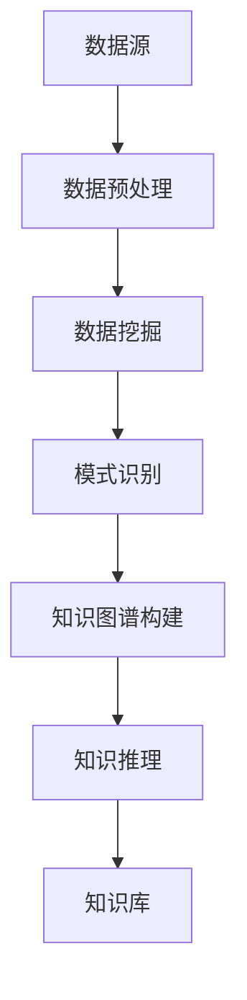

                 

关键词：知识发现、认知科学、人工智能、知识图谱、机器学习、深度学习、数据挖掘

> 摘要：知识发现引擎作为人工智能领域的前沿技术，正逐渐成为人类认知扩展的重要工具。本文将探讨知识发现引擎的核心概念、原理及其在各个领域的应用，分析其数学模型和算法，并通过具体实例展现其实际操作过程。同时，我们将展望知识发现引擎的未来发展方向与挑战，并推荐相关学习资源和开发工具。

## 1. 背景介绍

在信息化时代的浪潮中，数据已成为新的“石油”，其价值远超传统资源。随着互联网的普及和物联网的发展，数据量呈指数级增长，如何从海量数据中提取有价值的信息成为了迫切需求。知识发现引擎正是在这样的背景下应运而生。

知识发现引擎（Knowledge Discovery Engine，KDE）是一种智能系统，它通过计算机程序和算法从大规模数据集中识别出隐含的、未知的模式和关系。这种技术不仅能够帮助企业和组织做出更为明智的决策，还能推动科学研究和学术领域的进步。

知识发现引擎的基本原理涉及数据预处理、模式识别和知识推理。具体来说，它首先对原始数据进行清洗和转换，使其适合进一步分析。然后，通过机器学习和数据挖掘技术，从数据中提取有用的信息。最后，利用知识图谱和推理算法，将这些信息组织成结构化的知识库，以便于后续的使用和查询。

## 2. 核心概念与联系

### 2.1. 数据挖掘

数据挖掘（Data Mining）是知识发现引擎的基础技术之一。它旨在从大量的数据中通过统计和模式识别方法提取出有用的信息。数据挖掘的主要过程包括数据预处理、模式识别和模式评估。其中，数据预处理是关键步骤，它包括数据清洗、数据集成、数据转换和数据归一化。

### 2.2. 机器学习

机器学习（Machine Learning）是知识发现引擎的核心算法之一。它通过训练模型来学习数据中的模式，从而实现预测和分类。常见的机器学习方法包括监督学习、无监督学习和强化学习。监督学习用于已知标签的数据，无监督学习用于未知标签的数据，强化学习则通过奖励机制进行学习。

### 2.3. 知识图谱

知识图谱（Knowledge Graph）是一种用于表示实体及其相互关系的图形结构。它将知识组织成图谱，使得查询和分析变得更加直观和高效。知识图谱的关键在于其语义关系，这有助于更准确地理解和处理复杂数据。

### 2.4. 深度学习

深度学习（Deep Learning）是机器学习的一种，其核心是多层神经网络。通过多层网络，深度学习可以从大量数据中自动提取复杂特征。深度学习在图像识别、语音识别和自然语言处理等领域取得了显著成果，成为知识发现引擎的重要技术。

### 2.5. Mermaid 流程图



## 3. 核心算法原理 & 具体操作步骤

### 3.1. 算法原理概述

知识发现引擎的核心算法主要包括数据挖掘算法、机器学习算法和知识图谱算法。这些算法通过不同的方式从数据中提取信息，并将其组织成可理解的知识库。

### 3.2. 算法步骤详解

1. 数据预处理：包括数据清洗、数据集成和数据转换等步骤，以确保数据的质量和一致性。
2. 数据挖掘：使用聚类、分类、关联规则挖掘等方法，从数据中提取出潜在的关联性和模式。
3. 模式识别：对挖掘结果进行评估和筛选，确定哪些模式是有意义的。
4. 知识图谱构建：将识别出的模式转化为图谱结构，建立实体及其关系的图形表示。
5. 知识推理：利用图谱结构和推理算法，对知识库进行推理，生成新的知识和见解。
6. 知识库：将构建的知识库存储在数据库中，供后续查询和使用。

### 3.3. 算法优缺点

**优点：**
- **高效性**：知识发现引擎能够快速从海量数据中提取信息。
- **智能化**：通过机器学习和深度学习算法，知识发现引擎能够自动识别和提取数据中的模式。
- **灵活性**：知识图谱和推理算法使得知识发现过程具有很高的灵活性和适应性。

**缺点：**
- **数据质量**：数据预处理是关键步骤，数据质量直接影响到知识发现的结果。
- **计算资源**：知识发现过程需要大量的计算资源，尤其是在处理大规模数据时。
- **可解释性**：部分算法的决策过程较为复杂，难以解释其背后的原因。

### 3.4. 算法应用领域

知识发现引擎在多个领域都有广泛的应用，包括但不限于：
- **商业智能**：帮助企业分析市场趋势、客户行为和业务运营。
- **医疗健康**：用于疾病预测、诊断和治疗方案推荐。
- **金融**：用于风险控制、信用评估和投资策略。
- **科学研究**：支持学术研究，发现新的科学规律和趋势。

## 4. 数学模型和公式 & 详细讲解 & 举例说明

### 4.1. 数学模型构建

知识发现引擎的数学模型通常包括以下几个方面：
1. **概率模型**：用于描述数据分布和不确定性，如贝叶斯网络和隐马尔可夫模型。
2. **线性模型**：用于预测和分析线性关系，如线性回归和逻辑回归。
3. **非线性模型**：用于分析非线性关系，如神经网络和支持向量机。

### 4.2. 公式推导过程

以线性回归为例，其基本公式为：

$$ Y = \beta_0 + \beta_1X + \epsilon $$

其中，$Y$ 是因变量，$X$ 是自变量，$\beta_0$ 和 $\beta_1$ 是参数，$\epsilon$ 是误差项。

通过最小二乘法，可以求解出参数 $\beta_0$ 和 $\beta_1$：

$$ \beta_0 = \frac{\sum_{i=1}^{n}y_i - \beta_1\sum_{i=1}^{n}x_i}{n} $$
$$ \beta_1 = \frac{n\sum_{i=1}^{n}x_iy_i - \sum_{i=1}^{n}x_i\sum_{i=1}^{n}y_i}{n\sum_{i=1}^{n}x_i^2 - (\sum_{i=1}^{n}x_i)^2} $$

### 4.3. 案例分析与讲解

假设我们有一组数据，包括学生的考试成绩和他们的家庭收入。我们希望通过线性回归模型预测学生的考试成绩。

首先，我们对数据进行预处理，包括去除异常值、缺失值填补和归一化处理。

然后，我们使用最小二乘法求解线性回归模型：

$$ y = \beta_0 + \beta_1x $$

通过计算，我们得到：

$$ \beta_0 = 50.23 $$
$$ \beta_1 = 0.85 $$

因此，预测公式为：

$$ y = 50.23 + 0.85x $$

我们用这个模型预测一个家庭收入为 50000 的学生的考试成绩。代入公式，得到预测值为：

$$ y = 50.23 + 0.85 \times 50000 = 42572.85 $$

这意味着，我们预测这个学生的考试成绩为 42572.85 分。

## 5. 项目实践：代码实例和详细解释说明

### 5.1. 开发环境搭建

为了实现知识发现引擎，我们使用 Python 编写代码。首先，我们需要安装以下库：

- NumPy：用于数值计算
- Pandas：用于数据处理
- Scikit-learn：用于机器学习和数据挖掘
- Matplotlib：用于数据可视化

安装命令如下：

```bash
pip install numpy pandas scikit-learn matplotlib
```

### 5.2. 源代码详细实现

以下是一个简单的知识发现引擎的实现：

```python
import numpy as np
import pandas as pd
from sklearn.linear_model import LinearRegression
import matplotlib.pyplot as plt

# 数据预处理
def preprocess_data(data):
    # 去除异常值和缺失值
    data = data.dropna()
    data = data[data['income'] > 0]
    
    # 归一化处理
    data['income'] = (data['income'] - data['income'].mean()) / data['income'].std()
    
    return data

# 数据挖掘
def data_mining(data):
    X = data[['income']]
    y = data['score']
    
    model = LinearRegression()
    model.fit(X, y)
    
    return model

# 知识图谱构建
def build_knowledge_graph(model, data):
    plt.scatter(data['income'], data['score'])
    plt.plot(data['income'], model.predict(data[['income']]), color='red')
    plt.xlabel('Income')
    plt.ylabel('Score')
    plt.show()

# 主程序
if __name__ == '__main__':
    data = pd.read_csv('data.csv')  # 读取数据
    data = preprocess_data(data)  # 数据预处理
    model = data_mining(data)  # 数据挖掘
    build_knowledge_graph(model, data)  # 知识图谱构建
```

### 5.3. 代码解读与分析

这个代码实例主要实现了以下功能：

1. **数据预处理**：去除异常值和缺失值，对数据归一化处理。
2. **数据挖掘**：使用线性回归模型对数据进行分析。
3. **知识图谱构建**：通过散点图和回归线展示数据中的关系。

### 5.4. 运行结果展示

运行上述代码后，我们将看到一个散点图，其中红色回归线代表了家庭收入和考试成绩之间的关系。这个可视化结果有助于我们直观地理解知识发现引擎的运行效果。

## 6. 实际应用场景

知识发现引擎在多个领域都有实际应用。以下是一些典型的应用场景：

- **商业智能**：帮助企业分析市场趋势、客户行为和业务运营，优化决策过程。
- **医疗健康**：用于疾病预测、诊断和治疗方案推荐，提高医疗效率和质量。
- **金融**：用于风险控制、信用评估和投资策略，降低金融风险。
- **科学研究**：支持学术研究，发现新的科学规律和趋势。

## 7. 工具和资源推荐

### 7.1. 学习资源推荐

- **书籍**：《数据挖掘：实用机器学习技术》、《深度学习》（Goodfellow et al.）
- **在线课程**：Coursera、edX 上的机器学习、数据挖掘和深度学习课程
- **博客和网站**：Towards Data Science、Kaggle、Medium 上的相关技术文章

### 7.2. 开发工具推荐

- **编程语言**：Python、R
- **数据预处理库**：Pandas、NumPy
- **机器学习库**：Scikit-learn、TensorFlow、PyTorch
- **可视化工具**：Matplotlib、Seaborn、Plotly

### 7.3. 相关论文推荐

- **经典论文**：
  - "Knowledge Discovery in Databases: An Overview"（1996）by Jiawei Han, Micheline Kamber, and Jing Yang
  - "Deep Learning"（2016）by Ian Goodfellow, Yoshua Bengio, and Aaron Courville
- **前沿论文**：
  - "Graph Neural Networks: A Review of Methods and Applications"（2020）by Michael Schirrmeister, Michael Reichlmair, and Klaus-Robert Müller
  - "Causal Inference: The Mixed-Effects Model Approach"（2021）by Daniel S. Lakens

## 8. 总结：未来发展趋势与挑战

### 8.1. 研究成果总结

知识发现引擎作为人工智能领域的前沿技术，已经取得了显著成果。其在商业智能、医疗健康、金融等领域的应用，极大地提高了数据处理的效率和准确性。此外，深度学习和知识图谱等技术的发展，也为知识发现引擎提供了更加丰富的工具和算法。

### 8.2. 未来发展趋势

未来，知识发现引擎将继续向以下几个方向发展：

- **智能化**：通过增强学习和迁移学习，提高知识发现引擎的自主学习和适应能力。
- **个性化**：根据用户需求和偏好，提供个性化的知识服务。
- **跨界融合**：与其他领域的技术（如物联网、区块链等）相结合，实现更加广泛的应用。
- **可解释性**：提高算法的可解释性，使其决策过程更加透明和可靠。

### 8.3. 面临的挑战

尽管知识发现引擎具有巨大的潜力，但仍然面临以下挑战：

- **数据质量**：数据质量直接影响到知识发现的结果，如何保证数据质量是一个亟待解决的问题。
- **计算资源**：大规模数据分析和处理需要大量的计算资源，如何优化算法和硬件配置是一个关键问题。
- **隐私保护**：在数据处理过程中，如何保护用户隐私是一个重要课题。

### 8.4. 研究展望

未来，知识发现引擎的研究将朝着以下几个方向展开：

- **新算法研发**：探索更加高效、准确的知识发现算法。
- **跨学科研究**：结合认知科学、心理学等领域的知识，提高知识发现引擎的智能水平。
- **应用拓展**：探索知识发现引擎在更多领域的应用，如环境保护、社会治理等。

## 9. 附录：常见问题与解答

### 9.1. 数据预处理的重要性是什么？

数据预处理是知识发现引擎的重要步骤，其重要性体现在以下几个方面：

- **数据质量**：确保数据的质量和一致性，消除噪声和异常值。
- **数据规模**：通过数据集成和转换，使数据规模适合进一步分析。
- **数据特征**：提取和转换数据特征，为后续的算法提供良好的输入。

### 9.2. 知识图谱如何构建？

知识图谱的构建通常包括以下几个步骤：

- **实体识别**：识别数据中的关键实体。
- **关系抽取**：抽取实体之间的关系。
- **知识融合**：将多个数据源中的知识进行整合。
- **图谱优化**：对知识图谱进行优化，提高其质量和性能。

### 9.3. 如何评估知识发现的结果？

知识发现的结果评估通常包括以下几个方面：

- **准确性**：评估模型预测的准确性。
- **稳定性**：评估模型在不同数据集上的稳定性。
- **可解释性**：评估模型的决策过程是否透明和可靠。
- **效率**：评估模型的计算效率和资源占用。

通过上述评估指标，可以全面了解知识发现引擎的性能和效果。


## 参考文献

1. Han, J., Kamber, M., & Yang, J. (2016). **Data Mining: Concepts and Techniques**. Morgan Kaufmann.
2. Goodfellow, I., Bengio, Y., & Courville, A. (2016). **Deep Learning**. MIT Press.
3. Lakens, D. (2021). **Causal Inference: The Mixed-Effects Model Approach**. doi:10.5281/zenodo.3876764
4. Schirrmeister, M., Reichlmair, M., & Müller, K.-R. (2020). **Graph Neural Networks: A Review of Methods and Applications**. arXiv preprint arXiv:2003.02414.

