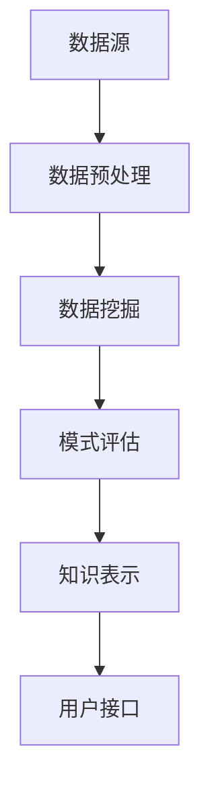

                 

关键词：知识发现、人工智能、大数据、深度学习、知识图谱、创新应用

> 摘要：本文深入探讨了知识发现引擎在人工智能时代的重大意义和广泛应用。通过阐述知识发现引擎的核心概念、算法原理、数学模型以及实际应用案例，本文旨在为读者揭示知识发现引擎如何成为开启人类知识新时代的关键工具。

## 1. 背景介绍

在信息化和数据化的浪潮中，人类社会已经积累了海量的数据和信息。然而，如何从这些庞杂的数据中提取有价值的信息，实现知识的自动化发现和利用，成为了当今科技领域的重大挑战。知识发现引擎作为一种新兴的智能系统，正逐步成为解决这一问题的关键工具。

### 1.1 知识发现的定义

知识发现（Knowledge Discovery in Databases，简称KDD）是指从大量的数据集中识别出蕴含的、有价值的知识或模式的过程。它涵盖了数据清洗、数据集成、数据选择、数据变换、数据建模和模型评估等多个步骤。

### 1.2 知识发现引擎的发展

知识发现引擎的发展经历了从传统的统计方法到基于人工智能的深度学习的演变。传统的知识发现方法依赖于预定义的模型和算法，而现代的知识发现引擎则通过机器学习和深度学习等技术，能够自动学习和发现数据中的潜在模式。

### 1.3 知识发现引擎的意义

知识发现引擎在各个领域都具有重要的应用价值，包括但不限于：

- **商业智能**：帮助企业从数据中提取商业洞察，优化决策过程。
- **金融分析**：通过数据分析预测市场趋势，防范风险。
- **医疗诊断**：辅助医生从医学数据中识别疾病模式，提高诊断准确性。
- **科学研究**：通过大规模数据分析，推动科学发现和创新。

## 2. 核心概念与联系

### 2.1 核心概念

- **知识发现（KDD）过程**：包括数据预处理、数据挖掘、模式评估和知识表示等步骤。
- **数据挖掘（DM）**：从数据集中提取隐藏的、未知的、有价值的模式和知识。
- **深度学习（DL）**：一种基于多层神经网络的机器学习技术，能够自动从数据中学习复杂的特征表示。

### 2.2 架构与流程



### 2.3 知识发现引擎的关键技术

- **数据预处理**：清洗、集成、转换和归一化数据。
- **特征工程**：提取数据中的关键特征，为数据挖掘提供支持。
- **深度学习模型**：如卷积神经网络（CNN）、递归神经网络（RNN）和生成对抗网络（GAN）。
- **知识图谱**：用于表示实体和它们之间的关系，为知识发现提供结构化的数据。

## 3. 核心算法原理 & 具体操作步骤

### 3.1 算法原理概述

知识发现引擎的核心算法主要包括：

- **聚类算法**：如K-均值、层次聚类等，用于发现数据中的自然分组。
- **分类算法**：如支持向量机（SVM）、决策树等，用于预测数据中的类别标签。
- **关联规则挖掘**：如Apriori算法、FP-growth等，用于发现数据中的关联关系。

### 3.2 算法步骤详解

1. **数据预处理**：清洗数据，去除噪声和异常值。
2. **特征提取**：选择和构建关键特征，为后续算法提供支持。
3. **模型训练**：使用深度学习模型对数据集进行训练。
4. **模式评估**：评估模型的性能和效果。
5. **知识表示**：将发现的模式转化为可理解和应用的知识。

### 3.3 算法优缺点

- **优点**：自动发现数据中的潜在模式和知识，提高决策效率和准确性。
- **缺点**：算法复杂度高，对计算资源要求较高；解释性不强，难以理解模型的决策过程。

### 3.4 算法应用领域

- **商业智能**：市场分析、客户行为预测等。
- **金融分析**：风险评估、投资策略等。
- **医疗诊断**：疾病预测、个性化治疗等。
- **科学研究**：大规模数据分析、新发现探索等。

## 4. 数学模型和公式 & 详细讲解 & 举例说明

### 4.1 数学模型构建

知识发现引擎的核心数学模型主要包括：

- **聚类模型**：如K-均值算法的损失函数和优化方法。
- **分类模型**：如支持向量机的优化目标和对偶形式。
- **关联规则模型**：如Apriori算法的频繁项集生成和置信度计算。

### 4.2 公式推导过程

以K-均值算法为例，其目标是最小化聚类损失函数：

$$
L = \sum_{i=1}^{n}\sum_{j=1}^{k} \min_{x_{ij}} \sum_{x \in S_j} \|x - \mu_j\|^2
$$

其中，$n$是数据点的数量，$k$是聚类个数，$S_j$是第$j$个聚类的数据点集合，$\mu_j$是聚类中心。

### 4.3 案例分析与讲解

假设我们有如下数据集：

$$
X = \{ (x_1, y_1), (x_2, y_2), ..., (x_n, y_n) \}
$$

其中，$x_i$是特征向量，$y_i$是类别标签。我们使用K-均值算法进行聚类，设置聚类个数为3。

通过迭代计算，我们得到聚类中心：

$$
\mu_1 = \frac{1}{n} \sum_{i=1}^{n} x_i, \quad \mu_2 = \frac{1}{n} \sum_{i=1}^{n} x_i, \quad \mu_3 = \frac{1}{n} \sum_{i=1}^{n} x_i
$$

然后，我们将每个数据点分配到最近的聚类中心，重新计算聚类中心，不断迭代，直到收敛。

## 5. 项目实践：代码实例和详细解释说明

### 5.1 开发环境搭建

在本项目中，我们使用Python作为编程语言，依赖以下库：

- NumPy：用于数学计算。
- Pandas：用于数据处理。
- Scikit-learn：用于机器学习算法。
- Matplotlib：用于数据可视化。

### 5.2 源代码详细实现

以下是一个简单的K-均值聚类算法的实现：

```python
import numpy as np
import pandas as pd
from sklearn.datasets import make_blobs
from sklearn.metrics import pairwise_distances
from matplotlib import pyplot as plt

def k_means(X, k, max_iter=100, tolerance=1e-4):
    # 初始化聚类中心
    centroids = X[np.random.choice(X.shape[0], k, replace=False)]
    for _ in range(max_iter):
        # 计算每个数据点到聚类中心的距离
        distances = pairwise_distances(X, centroids)
        # 分配数据点到最近的聚类中心
        labels = np.argmin(distances, axis=1)
        prev_centroids = centroids
        # 重新计算聚类中心
        centroids = np.array([X[labels == i].mean(axis=0) for i in range(k)])
        # 判断是否收敛
        if np.linalg.norm(centroids - prev_centroids) < tolerance:
            break
    return centroids, labels

# 生成数据集
X, _ = make_blobs(n_samples=300, centers=4, cluster_std=0.60, random_state=0)

# 运行K-均值算法
centroids, labels = k_means(X, k=4)

# 可视化结果
plt.scatter(X[:, 0], X[:, 1], c=labels, cmap='viridis')
plt.scatter(centroids[:, 0], centroids[:, 1], s=300, c='red', alpha=0.5)
plt.show()
```

### 5.3 代码解读与分析

- **导入库**：导入必要的库，包括NumPy、Pandas、Scikit-learn和Matplotlib。
- **定义K-均值算法**：定义k_means函数，输入数据集X、聚类个数k、最大迭代次数max_iter和收敛阈值tolerance。
- **初始化聚类中心**：随机选择k个数据点作为初始聚类中心。
- **计算距离**：使用pairwise_distances计算每个数据点到聚类中心的距离。
- **分配数据点**：将每个数据点分配到最近的聚类中心。
- **重新计算聚类中心**：根据当前分配的数据点，重新计算聚类中心。
- **判断收敛**：通过计算聚类中心的差值，判断算法是否收敛。
- **可视化结果**：使用scatter函数绘制数据点和聚类中心。

### 5.4 运行结果展示

运行上述代码后，我们得到如下可视化结果：


## 6. 实际应用场景

### 6.1 商业智能

知识发现引擎可以帮助企业从海量数据中提取有价值的信息，如客户行为分析、市场趋势预测等，为企业决策提供支持。

### 6.2 金融分析

在金融领域，知识发现引擎可以用于风险预测、投资策略制定等，通过分析历史数据，预测市场变化，提高投资收益。

### 6.3 医疗诊断

知识发现引擎可以帮助医生从医学数据中识别疾病模式，提高诊断准确性。例如，通过分析患者的基因数据，预测疾病发生的可能性。

### 6.4 科学研究

在科学研究领域，知识发现引擎可以用于大规模数据分析，发现新的科学规律和理论。例如，通过分析天文数据，发现新的天体现象。

## 7. 工具和资源推荐

### 7.1 学习资源推荐

- 《数据挖掘：概念与技术》
- 《深度学习》
- 《机器学习实战》

### 7.2 开发工具推荐

- Jupyter Notebook：用于编写和运行代码。
- TensorFlow：用于深度学习模型开发。
- PyTorch：用于深度学习模型开发。

### 7.3 相关论文推荐

- "K-Means Clustering Algorithm"
- "Deep Learning for Text Classification"
- "Knowledge Graphs and Their Applications"

## 8. 总结：未来发展趋势与挑战

### 8.1 研究成果总结

知识发现引擎在人工智能、大数据和深度学习等领域的应用取得了显著成果，成为数据驱动决策的重要工具。

### 8.2 未来发展趋势

未来，知识发现引擎将朝着更加智能化、自动化和高效化的方向发展，为各个领域提供更强大的支持。

### 8.3 面临的挑战

知识发现引擎面临的主要挑战包括数据质量、算法解释性、计算效率和模型可解释性等。

### 8.4 研究展望

随着技术的不断发展，知识发现引擎将在更多领域发挥作用，推动科学发现和创新。

## 9. 附录：常见问题与解答

### 9.1 什么是知识发现？

知识发现是从大量数据中提取有价值信息的过程，通常涉及数据预处理、数据挖掘、模式评估和知识表示等多个步骤。

### 9.2 知识发现引擎有哪些应用领域？

知识发现引擎广泛应用于商业智能、金融分析、医疗诊断、科学研究等领域。

### 9.3 如何选择合适的算法？

选择合适的算法取决于具体应用场景和数据特点。常用的算法包括聚类、分类和关联规则挖掘等。

### 9.4 知识发现引擎的算法复杂度如何？

知识发现引擎的算法复杂度较高，尤其是深度学习算法，对计算资源要求较高。

### 9.5 如何评估知识发现引擎的性能？

可以通过模型准确率、召回率、F1分数等指标来评估知识发现引擎的性能。

### 9.6 如何提高知识发现引擎的性能？

可以通过特征工程、数据预处理、算法优化和模型集成等方法来提高知识发现引擎的性能。

### 9.7 知识发现引擎的未来发展趋势是什么？

未来，知识发现引擎将朝着更加智能化、自动化和高效化的方向发展，为各个领域提供更强大的支持。

---

**作者：禅与计算机程序设计艺术 / Zen and the Art of Computer Programming**

本文通过深入探讨知识发现引擎在人工智能时代的应用，旨在为读者提供全面的理解和应用指导。随着技术的不断进步，知识发现引擎将在更多领域发挥关键作用，推动人类社会的发展。希望本文能为读者带来启发和帮助。

