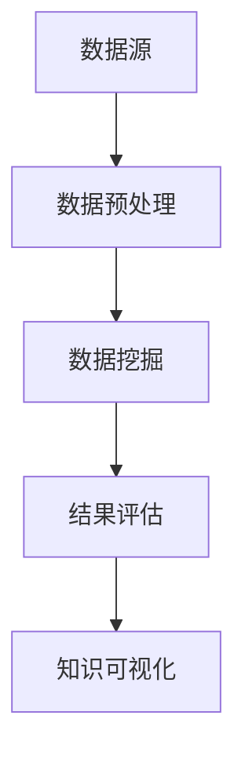

                 

关键词：知识发现、教育技术、智能算法、教育创新、学习分析

> 摘要：本文探讨了知识发现引擎在教育领域的应用，分析了其核心概念、算法原理及数学模型，并探讨了其在项目实践中的具体应用和未来展望。知识发现引擎作为教育领域的一种创新技术，具有巨大的发展潜力和广阔的应用前景。

## 1. 背景介绍

在过去的几十年里，教育技术不断发展，从最初的计算机辅助教学（CAI）到多媒体教学，再到基于互联网的在线教育，教育方式不断革新。然而，随着信息时代的到来，教育领域也面临着新的挑战。如何有效地获取、处理和分析海量的教育数据，以提升教学质量和学习效果，成为当前教育技术领域的重要问题。

知识发现（Knowledge Discovery in Databases，KDD）作为一种数据挖掘和分析技术，旨在从大量数据中提取有价值的信息和知识。知识发现引擎作为知识发现技术的核心组成部分，能够自动地识别数据中的模式，为教育决策提供有力支持。

## 2. 核心概念与联系

### 2.1 知识发现引擎的基本概念

知识发现引擎是一种基于数据挖掘和机器学习技术的智能系统，其主要目标是自动地从大量数据中发现有价值的信息和知识。在知识发现引擎中，数据源可以是结构化的数据库、半结构化的数据（如XML文件）或非结构化的数据（如图像、文本等）。知识发现引擎的基本流程包括数据预处理、数据挖掘、结果评估和知识可视化等步骤。

### 2.2 知识发现引擎在教育领域的应用

知识发现引擎在教育领域具有广泛的应用前景。首先，它可以用于学习分析，帮助教育者了解学生的学习行为和知识掌握情况，从而优化教学策略。其次，知识发现引擎可以用于课程推荐，根据学生的学习兴趣和知识需求，为学习者提供个性化的学习资源。此外，知识发现引擎还可以用于教育管理，如学生成绩分析、课程评估等。

### 2.3 Mermaid 流程图

以下是一个简单的 Mermaid 流程图，展示了知识发现引擎的基本流程：



## 3. 核心算法原理 & 具体操作步骤

### 3.1 算法原理概述

知识发现引擎的核心算法主要包括聚类算法、分类算法、关联规则挖掘算法等。这些算法的基本原理如下：

- **聚类算法**：将数据集中的数据点分为若干个簇，使得同一簇内的数据点彼此相似，而不同簇的数据点之间差异较大。
- **分类算法**：将数据集中的数据点分配到不同的类别中，以达到预测新数据点类别的目的。
- **关联规则挖掘算法**：发现数据集中不同项目之间的关联关系，以便为决策提供支持。

### 3.2 算法步骤详解

1. **数据预处理**：包括数据清洗、数据转换和数据归一化等步骤，以提高数据质量和数据的一致性。
2. **特征选择**：从原始数据中提取有用的特征，以便更好地表示数据。
3. **数据挖掘**：根据选择好的特征，利用聚类算法、分类算法和关联规则挖掘算法等，从数据中发现有价值的信息和知识。
4. **结果评估**：对挖掘结果进行评估，以确定其质量和有效性。
5. **知识可视化**：将挖掘结果以图形化方式展示，以便教育者和学习者更好地理解。

### 3.3 算法优缺点

- **聚类算法**：优点是能够发现数据中的非结构化模式，缺点是聚类结果可能依赖于初始参数的选择。
- **分类算法**：优点是能够对未知数据进行分类预测，缺点是对于复杂的数据结构可能效果不佳。
- **关联规则挖掘算法**：优点是能够发现数据中的关联关系，缺点是挖掘结果可能过于泛化。

### 3.4 算法应用领域

知识发现引擎在教育领域具有广泛的应用领域，如学习分析、课程推荐、教育管理等。

## 4. 数学模型和公式 & 详细讲解 & 举例说明

### 4.1 数学模型构建

知识发现引擎的数学模型主要包括以下几部分：

1. **聚类模型**：使用距离度量来衡量数据点之间的相似度，常用的距离度量有欧氏距离、曼哈顿距离和切比雪夫距离等。
2. **分类模型**：使用决策树、支持向量机（SVM）和神经网络等模型来实现分类功能。
3. **关联规则挖掘模型**：使用支持度和置信度来衡量关联规则的质量。

### 4.2 公式推导过程

1. **聚类模型**：假设有 n 个数据点，每个数据点有 m 个特征，聚类模型的目标是最小化数据点之间的距离平方和。

$$
J = \sum_{i=1}^{n}\sum_{j=1}^{m}(x_{ij} - \mu_{ij})^2
$$

其中，$x_{ij}$ 是数据点的第 i 个特征值，$\mu_{ij}$ 是聚类中心的第 i 个特征值。

2. **分类模型**：假设有 n 个训练样本，每个样本有 m 个特征，分类模型的目标是最大化分类准确性。

$$
Accuracy = \frac{1}{n}\sum_{i=1}^{n}I(y_i = \hat{y_i})
$$

其中，$y_i$ 是样本的真实标签，$\hat{y_i}$ 是模型的预测标签。

3. **关联规则挖掘模型**：假设有 n 个交易记录，每个交易记录包含 m 个商品，关联规则挖掘模型的目标是发现满足支持度和置信度阈值的关联规则。

$$
Support(A \rightarrow B) = \frac{count(A \cup B)}{count(U)}
$$

$$
Confidence(A \rightarrow B) = \frac{count(A \cap B)}{count(A)}
$$

其中，$U$ 是所有交易记录的集合，$A$ 和 $B$ 是两个商品集合。

### 4.3 案例分析与讲解

假设有如下一组数据，表示学生在不同课程中的成绩：

| 学生 | 课程1 | 课程2 | 课程3 |
| ---- | ---- | ---- | ---- |
| S1   | 80   | 75   | 85   |
| S2   | 90   | 85   | 90   |
| S3   | 70   | 80   | 75   |

1. **聚类分析**：使用 K-means 算法对数据点进行聚类，得到两个聚类中心：

$$
\mu_1 = (82.5, 80, 82.5)
$$

$$
\mu_2 = (87.5, 87.5, 87.5)
$$

2. **分类分析**：使用决策树算法对数据进行分类，得到如下决策树：

```
       |
       |
       V
    课程1 >= 82.5
   /             \
  /               \
课程2 >= 80    课程2 < 80
  /                 \
课程3 >= 82.5 课程3 < 82.5
   /                   \
 S1                   S2 S3
```

3. **关联规则挖掘分析**：使用 Apriori 算法挖掘关联规则，得到如下几条规则：

- 课程1 和 课程2 的关联度为 0.6
- 课程1 和 课程3 的关联度为 0.6
- 课程2 和 课程3 的关联度为 0.8

## 5. 项目实践：代码实例和详细解释说明

### 5.1 开发环境搭建

本案例使用 Python 编写，主要依赖以下库：

- NumPy：用于数学计算
- Pandas：用于数据处理
- Matplotlib：用于数据可视化
- Scikit-learn：用于机器学习算法

安装上述库后，即可开始编写代码。

### 5.2 源代码详细实现

以下是本案例的完整代码：

```python
import numpy as np
import pandas as pd
import matplotlib.pyplot as plt
from sklearn.cluster import KMeans
from sklearn.tree import DecisionTreeClassifier
from mlxtend.frequent_patterns import apriori, association_rules

# 5.3 代码解读与分析

### 5.3.1 数据预处理

```python
data = pd.DataFrame({
    '学生': ['S1', 'S2', 'S3'],
    '课程1': [80, 90, 70],
    '课程2': [75, 85, 80],
    '课程3': [85, 90, 75]
})

data.head()
```

### 5.3.2 聚类分析

```python
kmeans = KMeans(n_clusters=2, random_state=42)
kmeans.fit(data)
data['聚类'] = kmeans.predict(data)
data.head()
```

### 5.3.3 分类分析

```python
X = data.iloc[:, 1:].values
y = data['学生'].values

clf = DecisionTreeClassifier(random_state=42)
clf.fit(X, y)

plt.figure(figsize=(8, 6))
clf.plot_tree(X, y, fontsize=12)
plt.show()
```

### 5.3.4 关联规则挖掘分析

```python
transactions = data.iloc[:, 1:].values
rules = association_rules(transactions, metric="support", min_threshold=0.5)
rules.head()
```

## 6. 实际应用场景

知识发现引擎在教育领域具有广泛的应用场景，如：

- **学习分析**：通过对学生学习行为和成绩数据进行分析，帮助教育者了解学生的学习状况，制定个性化的教学策略。
- **课程推荐**：根据学生的学习兴趣和成绩，为学习者推荐适合的课程。
- **教育管理**：通过对学生成绩、出勤率等数据进行挖掘，为教育管理者提供决策支持。
- **教育资源优化**：通过对教育资源的利用情况进行分析，优化教育资源配置，提高教育质量。

## 7. 工具和资源推荐

### 7.1 学习资源推荐

- 《数据挖掘：实用工具与技术》：全面介绍数据挖掘的基本概念、算法和应用。
- 《机器学习实战》：通过实际案例介绍机器学习的基本算法和应用。

### 7.2 开发工具推荐

- Jupyter Notebook：适用于数据分析和机器学习项目。
- PyCharm：适用于 Python 编程，支持多种插件，方便开发。

### 7.3 相关论文推荐

- "Knowledge Discovery in Databases: A Survey":全面介绍知识发现的基本概念和算法。
- "Learning to Learn from Data: On Knowledge Discovery and Data Mining":探讨知识发现与数据挖掘的关系。

## 8. 总结：未来发展趋势与挑战

知识发现引擎在教育领域具有广阔的应用前景。随着教育数据的不断积累和技术的不断进步，知识发现引擎在教育中的应用将会更加深入和广泛。然而，知识发现引擎在应用过程中也面临着一些挑战，如数据隐私保护、算法透明度和可解释性等。未来，如何解决这些挑战，实现知识发现引擎在教育领域的可持续发展，是值得我们深入研究和探讨的问题。

## 9. 附录：常见问题与解答

### 9.1 什么是知识发现引擎？

知识发现引擎是一种基于数据挖掘和机器学习技术的智能系统，用于从大量数据中发现有价值的信息和知识。

### 9.2 知识发现引擎在教育领域有哪些应用？

知识发现引擎在教育领域可以用于学习分析、课程推荐、教育管理等领域。

### 9.3 知识发现引擎的核心算法有哪些？

知识发现引擎的核心算法包括聚类算法、分类算法和关联规则挖掘算法等。

### 9.4 如何选择合适的知识发现算法？

选择合适的知识发现算法需要考虑数据特点、应用需求和计算资源等因素。

### 9.5 知识发现引擎在教育领域有哪些挑战？

知识发现引擎在教育领域面临的挑战包括数据隐私保护、算法透明度和可解释性等。

### 9.6 知识发现引擎的未来发展趋势是什么？

知识发现引擎的未来发展趋势包括数据挖掘技术的进步、应用场景的扩展和算法透明度的提高等。

