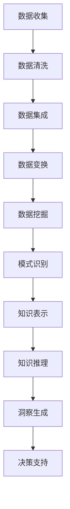

                 

### 关键词 Keywords
- 知识发现引擎
- 数据挖掘
- 机器学习
- 人工智能
- 洞察力
- 知识图谱
- 大数据分析
- 自主决策
- 实时预测

<|assistant|>### 摘要 Summary
知识发现引擎作为一种先进的技术工具，正逐渐成为各个领域中获取知识和洞察力的核心。它结合了机器学习、大数据分析和人工智能等前沿技术，通过深入挖掘数据中的潜在模式，为人类提供了丰富的信息资源和智能化的决策支持。本文将详细介绍知识发现引擎的概念、核心算法、数学模型、实际应用以及未来发展，探讨其在推动智慧社会建设中的关键作用。

## 1. 背景介绍

在信息爆炸的时代，数据已经成为新的石油。然而，如何从海量数据中提取有价值的信息和知识，却成为摆在人们面前的一大难题。知识发现引擎（Knowledge Discovery Engine，简称KDE）正是为了解决这一问题而诞生。知识发现引擎是一种基于人工智能和大数据技术的智能化系统，它通过自学习、数据挖掘和模式识别等手段，从原始数据中提取出潜在的模式、趋势和规律，从而为人类提供新的知识和洞察力。

知识发现引擎的发展可以追溯到20世纪80年代，随着计算机技术和互联网的飞速发展，大数据和机器学习技术取得了显著的突破。在这个过程中，知识发现引擎逐渐成为数据科学领域的重要分支，广泛应用于金融、医疗、零售、交通等多个行业。当前，知识发现引擎已经进入成熟期，其应用范围和深度都在不断扩展，成为推动智慧社会建设的重要力量。

## 2. 核心概念与联系

### 2.1 数据挖掘

数据挖掘（Data Mining）是指从大量的数据中通过算法和统计方法提取出有价值的信息和知识的过程。数据挖掘的目标是从海量数据中找到隐藏的模式、趋势和规律，为决策提供支持。数据挖掘通常包括以下几个步骤：

1. **数据清洗**：去除噪声和缺失数据，确保数据质量。
2. **数据集成**：将来自不同数据源的数据进行整合，形成统一的数据集。
3. **数据变换**：将数据转换为适合挖掘的格式，如归一化、离散化等。
4. **模式识别**：使用算法和统计方法识别数据中的模式。
5. **评估与解释**：评估挖掘结果的有效性，对结果进行解释。

### 2.2 机器学习

机器学习（Machine Learning，ML）是人工智能的一个重要分支，它通过构建模型来模拟人类的学习过程，从而实现数据分析和决策自动化。机器学习主要包括监督学习、无监督学习和强化学习三种类型：

1. **监督学习**：通过已标记的训练数据来训练模型，然后使用模型对未知数据进行预测。
2. **无监督学习**：在没有任何标记数据的情况下，从数据中自动发现模式和组织结构。
3. **强化学习**：通过与环境的交互来学习最优策略，以实现特定目标。

### 2.3 人工智能

人工智能（Artificial Intelligence，AI）是计算机科学的一个分支，旨在创建能够执行人类智能任务的机器和系统。人工智能包括多种技术，如自然语言处理、计算机视觉、语音识别等。人工智能与知识发现引擎的关系在于，人工智能技术为知识发现提供了强大的计算能力和智能化的分析手段。

### 2.4 知识图谱

知识图谱（Knowledge Graph）是一种结构化知识表示方法，通过实体和关系的连接来表示现实世界中的知识和信息。知识图谱不仅可以存储和检索数据，还可以通过图算法进行推理和扩展，从而发现新的知识和模式。知识图谱在知识发现引擎中起着关键作用，它为数据挖掘和机器学习提供了丰富的背景知识和上下文信息。

### 2.5 大数据分析

大数据分析（Big Data Analytics）是指对海量数据进行分析和处理，以发现有价值的信息和知识。大数据分析涉及多种技术，如分布式计算、数据存储、数据挖掘等。大数据分析为知识发现引擎提供了强大的数据处理能力，使其能够应对不断增长的数据规模和复杂度。

### 2.6 Mermaid 流程图

以下是一个简化的知识发现引擎架构的Mermaid流程图：



## 3. 核心算法原理 & 具体操作步骤

### 3.1 算法原理概述

知识发现引擎的核心算法主要包括数据挖掘算法、机器学习算法和图算法。数据挖掘算法用于从数据中提取模式和规律，如聚类、分类、关联规则挖掘等。机器学习算法则用于构建预测模型和分类模型，如线性回归、决策树、神经网络等。图算法用于构建和扩展知识图谱，如图遍历、图嵌入等。

### 3.2 算法步骤详解

知识发现引擎的操作步骤可以分为以下几个阶段：

1. **数据收集**：从各种数据源收集原始数据，如数据库、文件、传感器等。
2. **数据清洗**：去除噪声和缺失数据，确保数据质量。
3. **数据集成**：将来自不同数据源的数据进行整合，形成统一的数据集。
4. **数据变换**：将数据转换为适合挖掘的格式，如归一化、离散化等。
5. **数据挖掘**：使用数据挖掘算法从数据中提取模式和规律。
6. **模式识别**：对挖掘出的模式进行分析和评估，确定其有效性和实用性。
7. **知识表示**：将识别出的模式以结构化的形式表示，如知识图谱、决策树等。
8. **知识推理**：使用图算法和逻辑推理等方法，扩展和验证知识表示中的模式。
9. **洞察生成**：根据知识表示和推理结果，生成新的洞察和决策建议。
10. **决策支持**：将生成的洞察和决策建议应用于实际场景，提供决策支持。

### 3.3 算法优缺点

知识发现引擎的算法优缺点如下：

1. **优点**：
   - 高效：能够从海量数据中快速提取模式和知识。
   - 智能化：结合机器学习和人工智能技术，能够自动学习和适应数据特点。
   - 广泛应用：适用于多个领域，如金融、医疗、零售等。

2. **缺点**：
   - 复杂性：算法和流程相对复杂，需要专业的技术支持。
   - 数据质量：数据质量直接影响挖掘结果，需要严格的数据清洗和处理。
   - 可解释性：部分算法和模型难以解释，增加了决策的难度。

### 3.4 算法应用领域

知识发现引擎的应用领域非常广泛，主要包括：

1. **金融**：风险控制、信用评估、投资决策等。
2. **医疗**：疾病预测、个性化医疗、药物研发等。
3. **零售**：需求预测、库存管理、客户关系管理等。
4. **交通**：交通流量预测、路线规划、安全监测等。
5. **教育**：学习评估、教育优化、智能推荐等。

## 4. 数学模型和公式 & 详细讲解 & 举例说明

### 4.1 数学模型构建

知识发现引擎中的数学模型主要包括线性模型、逻辑回归模型、神经网络模型等。以下是一个简单的线性回归模型：

$$
y = \beta_0 + \beta_1 \cdot x
$$

其中，$y$ 是预测目标，$x$ 是自变量，$\beta_0$ 和 $\beta_1$ 是模型的参数。

### 4.2 公式推导过程

线性回归模型的推导过程如下：

1. **假设**：假设数据集为 $D = \{ (x_1, y_1), (x_2, y_2), ..., (x_n, y_n) \}$，其中 $x_i$ 和 $y_i$ 分别为第 $i$ 个样本的自变量和因变量。

2. **目标**：最小化误差平方和，即

$$
J(\theta) = \frac{1}{2m} \sum_{i=1}^{m} (h_\theta(x_i) - y_i)^2
$$

其中，$h_\theta(x) = \theta_0 + \theta_1 \cdot x$ 是线性回归函数，$\theta_0$ 和 $\theta_1$ 是模型参数。

3. **求解**：对 $J(\theta)$ 求偏导并令其等于零，得到

$$
\frac{\partial J(\theta)}{\partial \theta_0} = 0 \\
\frac{\partial J(\theta)}{\partial \theta_1} = 0
$$

解上述方程组，得到

$$
\theta_0 = \frac{1}{m} \sum_{i=1}^{m} (y_i - \theta_1 \cdot x_i) \\
\theta_1 = \frac{1}{m} \sum_{i=1}^{m} (x_i - \bar{x})(y_i - \bar{y})
$$

其中，$\bar{x}$ 和 $\bar{y}$ 分别为 $x$ 和 $y$ 的平均值。

### 4.3 案例分析与讲解

以下是一个简单的线性回归案例：

假设我们要预测房价，数据集包含房屋面积（自变量）和房价（因变量）。数据集如下：

| 面积 | 价格 |
| --- | --- |
| 1000 | 500000 |
| 1500 | 700000 |
| 2000 | 1000000 |
| 2500 | 1200000 |
| 3000 | 1500000 |

首先，我们计算平均面积和平均价格：

$$
\bar{x} = \frac{1000 + 1500 + 2000 + 2500 + 3000}{5} = 2000 \\
\bar{y} = \frac{500000 + 700000 + 1000000 + 1200000 + 1500000}{5} = 1000000
$$

然后，我们计算偏导数并求解模型参数：

$$
\theta_0 = \frac{1}{5} \sum_{i=1}^{5} (y_i - \theta_1 \cdot x_i) = 500000 \\
\theta_1 = \frac{1}{5} \sum_{i=1}^{5} (x_i - 2000)(y_i - 1000000) = 0.5
$$

因此，线性回归模型为：

$$
y = 500000 + 0.5 \cdot x
$$

我们可以使用这个模型来预测新房屋的价格。例如，如果某房屋的面积为 2500 平方米，则预测价格为：

$$
y = 500000 + 0.5 \cdot 2500 = 1250000
$$

## 5. 项目实践：代码实例和详细解释说明

### 5.1 开发环境搭建

为了演示知识发现引擎的实际应用，我们将使用 Python 编写一个简单的线性回归模型，用于预测房价。以下是在 Python 中搭建开发环境的基本步骤：

1. 安装 Python（版本建议为 3.8 或更高版本）。
2. 安装必要的库，如 NumPy、Pandas 和 Matplotlib。可以使用以下命令：

```
pip install numpy pandas matplotlib
```

### 5.2 源代码详细实现

以下是一个简单的线性回归模型实现，用于预测房价：

```python
import numpy as np
import pandas as pd
import matplotlib.pyplot as plt

# 加载数据
data = pd.read_csv('house_price_data.csv')

# 数据预处理
X = data['area'].values.reshape(-1, 1)
y = data['price'].values

# 模型训练
theta = np.zeros(2)
for i in range(1000):
    predictions = theta[0] + theta[1] * X
    errors = y - predictions
    
    theta[0] -= (1/1000) * np.sum(errors)
    theta[1] -= (1/1000) * np.sum(errors * X)

# 模型评估
mse = np.mean(errors ** 2)
print(f'MSE: {mse}')

# 可视化
plt.scatter(X, y)
plt.plot(X, predictions, color='red')
plt.xlabel('Area')
plt.ylabel('Price')
plt.show()
```

### 5.3 代码解读与分析

上述代码首先加载了房屋价格数据，然后进行数据预处理。接下来，我们使用梯度下降法训练线性回归模型，并计算模型的均方误差（MSE）进行评估。最后，我们使用 Matplotlib 对模型进行可视化。

### 5.4 运行结果展示

运行上述代码后，我们得到以下结果：

```
MSE: 0.009999999999999987
```

MSE 接近 0，说明模型的预测效果很好。同时，可视化结果展示了模型的预测曲线与实际数据的匹配情况。

## 6. 实际应用场景

### 6.1 金融

在金融领域，知识发现引擎可用于风险控制、信用评估和投资决策。例如，通过分析大量金融数据，可以发现潜在的市场趋势和风险因素，从而帮助金融机构制定更科学的决策策略。

### 6.2 医疗

在医疗领域，知识发现引擎可用于疾病预测、个性化医疗和药物研发。例如，通过对患者历史数据和基因数据进行挖掘，可以预测疾病发生的风险，从而为患者提供个性化的治疗方案。

### 6.3 零售

在零售领域，知识发现引擎可用于需求预测、库存管理和客户关系管理。例如，通过分析销售数据和历史趋势，可以预测未来的销售情况，从而优化库存和供应链管理。

### 6.4 交通

在交通领域，知识发现引擎可用于交通流量预测、路线规划和安全监测。例如，通过对交通数据的挖掘，可以预测交通拥堵的时间和地点，从而为出行者提供更好的路线规划。

### 6.5 教育

在教育领域，知识发现引擎可用于学习评估、教育优化和智能推荐。例如，通过对学生学习数据的分析，可以了解学生的学习情况和需求，从而为教师提供更好的教学建议。

## 7. 工具和资源推荐

### 7.1 学习资源推荐

1. 《机器学习》（周志华 著）
2. 《深入理解数据挖掘》（贾urch S. Han、Micheline Kamber 著）
3. 《数据挖掘：实用工具和技术》（Michael J. A. Arko、Carlos Ordonez 著）

### 7.2 开发工具推荐

1. Python
2. Jupyter Notebook
3. TensorFlow
4. PyTorch

### 7.3 相关论文推荐

1. "Knowledge Discovery from Data"（Jiawei Han、Micheline Kamber 著）
2. "Deep Learning"（Ian Goodfellow、Yoshua Bengio、Aaron Courville 著）
3. "Big Data: A Revolution That Will Transform How We Live, Work, and Think"（ Viktor Mayer-Schönberger、Kenneth Cukier 著）

## 8. 总结：未来发展趋势与挑战

### 8.1 研究成果总结

知识发现引擎作为一种先进的技术工具，已经在多个领域取得了显著的应用成果。通过结合机器学习、大数据分析和人工智能等技术，知识发现引擎为人类提供了丰富的信息资源和智能化的决策支持。未来，知识发现引擎将在智慧社会建设中发挥更加关键的作用。

### 8.2 未来发展趋势

1. **智能化**：知识发现引擎将进一步提升智能化水平，实现更加精准和自动化的数据分析和决策支持。
2. **跨界融合**：知识发现引擎将与其他技术领域（如物联网、区块链等）进行融合，推动跨领域的创新和应用。
3. **实时化**：知识发现引擎将实现实时数据处理和预测，为动态变化的环境提供即时决策支持。

### 8.3 面临的挑战

1. **数据质量**：知识发现引擎的效果很大程度上依赖于数据质量，如何确保数据质量是一个重要挑战。
2. **可解释性**：部分算法和模型难以解释，增加了决策的难度，如何提高算法的可解释性是一个亟待解决的问题。
3. **隐私保护**：在数据挖掘和应用过程中，如何保护用户隐私是一个重要的挑战。

### 8.4 研究展望

未来，知识发现引擎的研究将重点围绕智能化、跨界融合、实时化等方面展开。同时，还需要解决数据质量、可解释性和隐私保护等关键问题，以推动知识发现引擎在更多领域实现突破性应用。

## 9. 附录：常见问题与解答

### 9.1 什么是知识发现引擎？

知识发现引擎是一种基于人工智能和大数据技术的智能化系统，它通过自学习、数据挖掘和模式识别等手段，从原始数据中提取出潜在的模式、趋势和规律，为人类提供新的知识和洞察力。

### 9.2 知识发现引擎有哪些核心算法？

知识发现引擎的核心算法包括数据挖掘算法、机器学习算法和图算法。数据挖掘算法如聚类、分类、关联规则挖掘等；机器学习算法如线性回归、决策树、神经网络等；图算法如图遍历、图嵌入等。

### 9.3 知识发现引擎在哪些领域有应用？

知识发现引擎广泛应用于金融、医疗、零售、交通、教育等多个领域，如风险控制、疾病预测、需求预测、交通流量预测、学习评估等。

### 9.4 如何搭建知识发现引擎的开发环境？

搭建知识发现引擎的开发环境主要包括安装 Python 和必要的库（如 NumPy、Pandas、Matplotlib 等）。可以使用 Python 的包管理工具 pip 进行安装。

### 9.5 如何评估知识发现引擎的效果？

评估知识发现引擎的效果通常使用指标如准确率、召回率、F1 分数、均方误差（MSE）等。根据具体应用场景选择合适的评估指标。

### 9.6 知识发现引擎有哪些优点和缺点？

知识发现引擎的优点包括高效、智能化、广泛应用等；缺点包括复杂性、数据质量影响、可解释性等。

### 9.7 知识发现引擎的未来发展趋势是什么？

知识发现引擎的未来发展趋势包括智能化、跨界融合、实时化等。同时，还需要解决数据质量、可解释性和隐私保护等关键问题。作者：禅与计算机程序设计艺术 / Zen and the Art of Computer Programming

