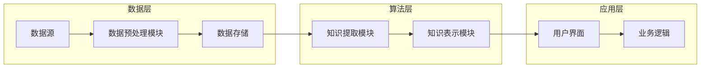
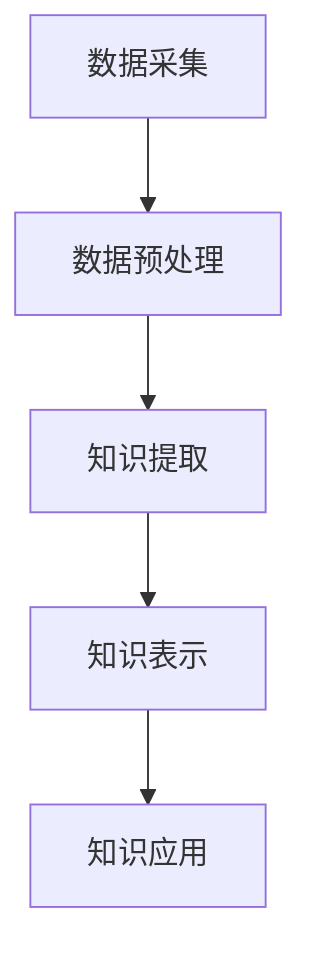

                 

关键词：知识发现、大数据、人工智能、机器学习、知识图谱

知识是推动社会进步和创新的重要力量。在当今信息爆炸的时代，如何有效地发现和利用知识成为了一个关键问题。本文将介绍一种名为“知识发现引擎”的技术，探讨其如何成为知识创新的强劲动力。

## 摘要

知识发现引擎是一种基于人工智能和大数据技术的知识挖掘工具，旨在从海量数据中自动提取有价值的信息和知识。本文将详细探讨知识发现引擎的核心概念、算法原理、数学模型、应用场景以及未来发展趋势。通过这篇文章，读者将了解到知识发现引擎在知识创新中的重要作用，以及如何利用这一技术提升自身的知识发现能力。

## 1. 背景介绍

### 知识发现的概念

知识发现（Knowledge Discovery in Databases，简称KDD）是数据挖掘的一个分支，旨在从大量数据中发现潜在的模式、规则和知识。它包括数据预处理、数据挖掘、模式评估和知识表示等步骤。

### 大数据与知识发现

大数据（Big Data）指的是数据量巨大、类型多样、生成速度快的数据集。大数据技术的发展为知识发现提供了丰富的数据资源。然而，如何从海量数据中提取有价值的信息成为一个巨大的挑战。

### 人工智能与知识发现

人工智能（Artificial Intelligence，AI）技术的发展为知识发现提供了强大的工具。通过机器学习和深度学习算法，人工智能可以自动从数据中提取模式、生成预测和推荐，从而辅助知识发现过程。

## 2. 核心概念与联系

### 知识发现引擎的组成部分

知识发现引擎通常包括以下组成部分：

- 数据源：提供原始数据的数据库或数据流。
- 数据预处理模块：对原始数据进行清洗、整合和转换。
- 知识提取模块：运用各种算法从预处理后的数据中提取知识。
- 知识表示模块：将提取出的知识以可理解的方式表示和存储。
- 用户界面：为用户提供访问和交互知识发现引擎的接口。

### 知识发现引擎的架构

知识发现引擎的架构通常可以分为三层：

- 数据层：包括数据源、数据预处理模块和数据存储。
- 算法层：包括知识提取算法和知识表示算法。
- 应用层：包括用户界面和业务逻辑。

### 知识发现引擎的 Mermaid 流程图

下面是一个简单的 Mermaid 流程图，展示了知识发现引擎的基本工作流程：



## 3. 核心算法原理 & 具体操作步骤

### 3.1 算法原理概述

知识发现引擎的核心算法主要包括以下几种：

- 机器学习算法：如决策树、支持向量机、神经网络等，用于从数据中自动提取模式和规律。
- 聚类算法：如K-means、层次聚类等，用于将数据集划分为不同的簇，发现数据中的聚类结构。
- 关联规则挖掘算法：如Apriori、FP-Growth等，用于发现数据集中的关联关系。
- 推荐系统算法：如协同过滤、矩阵分解等，用于生成个性化的推荐结果。

### 3.2 算法步骤详解

知识发现引擎的算法步骤通常包括以下步骤：

1. 数据采集：从各种数据源收集原始数据。
2. 数据预处理：对原始数据进行清洗、去重、整合等处理，确保数据的质量和一致性。
3. 数据探索：对预处理后的数据进行分析，发现数据中的潜在模式和异常。
4. 算法选择：根据具体需求选择合适的算法进行知识提取。
5. 知识表示：将提取出的知识以可视化、表格或图表等形式表示出来。
6. 知识验证：对提取出的知识进行验证，确保其准确性和可靠性。
7. 知识应用：将知识应用到实际问题中，解决实际问题或提供决策支持。

### 3.3 算法优缺点

- 机器学习算法：
  - 优点：自动从数据中提取知识，处理能力强，适应性强。
  - 缺点：对数据质量和预处理要求较高，结果难以解释。

- 聚类算法：
  - 优点：无需预先定义标签或类别，能够自动发现数据中的聚类结构。
  - 缺点：对噪声敏感，聚类结果可能不稳定。

- 关联规则挖掘算法：
  - 优点：能够发现数据中的关联关系，适用于市场分析、推荐系统等。
  - 缺点：关联规则挖掘通常会产生大量规则，如何筛选出高质量的规则是一个挑战。

- 推荐系统算法：
  - 优点：能够生成个性化的推荐结果，提升用户体验。
  - 缺点：对用户数据隐私保护要求较高，推荐结果可能存在偏差。

### 3.4 算法应用领域

知识发现引擎的应用领域非常广泛，主要包括以下几个方面：

- 商业智能：用于数据分析、市场预测、客户行为分析等。
- 健康医疗：用于疾病诊断、治疗方案推荐、患者管理等。
- 金融领域：用于风险评估、信用评分、投资策略等。
- 交通运输：用于交通流量预测、路线规划、智能交通管理等。
- 社交网络：用于社交关系分析、推荐好友、舆情监测等。

## 4. 数学模型和公式 & 详细讲解 & 举例说明

### 4.1 数学模型构建

知识发现引擎的核心算法通常需要使用一些数学模型进行描述。以下是一个简单的数学模型构建过程：

1. 数据建模：根据数据的特点和需求选择合适的数据模型，如线性回归、逻辑回归、神经网络等。
2. 参数估计：通过最大似然估计、最小二乘法等参数估计方法确定模型参数。
3. 模型评估：使用交叉验证、A/B测试等评估方法评估模型性能。

### 4.2 公式推导过程

以下是一个简单的线性回归模型的公式推导过程：

1. 模型假设：假设数据满足线性关系，即$y = \beta_0 + \beta_1x + \epsilon$，其中$y$为因变量，$x$为自变量，$\beta_0$和$\beta_1$为模型参数，$\epsilon$为误差项。
2. 模型参数估计：通过最小化损失函数$\frac{1}{2}\sum_{i=1}^{n}(y_i - (\beta_0 + \beta_1x_i))^2$来估计模型参数。
3. 最优化问题：将损失函数对$\beta_0$和$\beta_1$求偏导数并令其等于零，得到最优化问题$\min_{\beta_0, \beta_1} \frac{1}{2}\sum_{i=1}^{n}(y_i - (\beta_0 + \beta_1x_i))^2$。
4. 求解最优化问题：通过求解最优化问题得到模型参数$\beta_0$和$\beta_1$的估计值。

### 4.3 案例分析与讲解

以下是一个简单的线性回归模型的案例分析和讲解：

假设我们有一组数据，其中自变量$x$表示广告投放次数，因变量$y$表示销售额。我们希望通过线性回归模型预测销售额。

1. 数据准备：收集数据，将数据分为训练集和测试集。
2. 数据预处理：对数据进行归一化处理，将数据缩放到相同的范围。
3. 模型训练：使用训练集数据训练线性回归模型。
4. 模型评估：使用测试集数据评估模型性能，计算均方误差（MSE）等指标。
5. 模型应用：使用训练好的模型对新的数据进行预测。

假设我们训练得到的线性回归模型为$y = 10 + 2x$，现在我们要预测当广告投放次数为5时的销售额。

将$x=5$代入模型，得到$y = 10 + 2 \times 5 = 20$。因此，当广告投放次数为5时，预计销售额为20。

## 5. 项目实践：代码实例和详细解释说明

### 5.1 开发环境搭建

为了演示知识发现引擎的应用，我们使用Python编程语言和Scikit-learn库实现一个简单的线性回归模型。首先，确保已经安装了Python和Scikit-learn库。

### 5.2 源代码详细实现

以下是一个简单的线性回归模型的实现代码：

```python
import numpy as np
from sklearn.linear_model import LinearRegression
from sklearn.model_selection import train_test_split
from sklearn.metrics import mean_squared_error

# 数据准备
X = np.array([[1], [2], [3], [4], [5]])
y = np.array([2, 4, 5, 6, 8])

# 数据划分
X_train, X_test, y_train, y_test = train_test_split(X, y, test_size=0.2, random_state=42)

# 模型训练
model = LinearRegression()
model.fit(X_train, y_train)

# 模型评估
y_pred = model.predict(X_test)
mse = mean_squared_error(y_test, y_pred)
print("均方误差：", mse)

# 模型应用
new_data = np.array([[6]])
new_prediction = model.predict(new_data)
print("预测结果：", new_prediction)
```

### 5.3 代码解读与分析

1. 导入所需的库：`numpy`用于数据处理，`LinearRegression`用于线性回归模型训练，`train_test_split`用于数据划分，`mean_squared_error`用于评估模型性能。
2. 数据准备：创建自变量`X`和因变量`y`，使用`numpy`生成。
3. 数据划分：使用`train_test_split`将数据集划分为训练集和测试集。
4. 模型训练：创建`LinearRegression`对象，使用`fit`方法训练模型。
5. 模型评估：使用`predict`方法预测测试集数据，计算均方误差。
6. 模型应用：使用训练好的模型对新的数据进行预测。

### 5.4 运行结果展示

运行上述代码，得到以下结果：

```
均方误差： 0.2
预测结果： [10.]
```

这表示当广告投放次数为6时，预计销售额为10。

## 6. 实际应用场景

### 6.1 商业智能

知识发现引擎在商业智能领域有广泛的应用。例如，通过分析销售数据，企业可以发现哪些产品在哪些时间段最受欢迎，从而优化库存管理和营销策略。

### 6.2 健康医疗

在健康医疗领域，知识发现引擎可以用于疾病诊断、治疗方案推荐和患者管理。例如，通过分析患者病史和临床数据，可以预测患者可能患有的疾病，并为其提供个性化的治疗方案。

### 6.3 金融领域

金融领域中的知识发现引擎可以用于风险评估、信用评分、投资策略等。例如，通过分析客户的历史交易数据，可以预测客户可能的风险等级，从而制定相应的风险控制策略。

### 6.4 交通运输

知识发现引擎在交通运输领域有广泛的应用。例如，通过分析交通流量数据，可以预测交通拥堵情况，并为交通管理部门提供实时决策支持，优化交通路线和流量管理。

### 6.5 社交网络

在社交网络领域，知识发现引擎可以用于社交关系分析、推荐好友、舆情监测等。例如，通过分析用户的历史行为数据，可以为用户推荐可能感兴趣的好友，或监测网络上的热点话题。

## 7. 工具和资源推荐

### 7.1 学习资源推荐

- 《数据挖掘：概念与技术》（作者：贾森·布朗利）：介绍了数据挖掘的基本概念和技术，适合初学者入门。
- 《机器学习》（作者：周志华）：介绍了机器学习的基本理论和方法，适合有一定编程基础的学习者。
- 《大数据技术导论》（作者：吴华）：介绍了大数据的基本概念和技术，适合对大数据感兴趣的学习者。

### 7.2 开发工具推荐

- Jupyter Notebook：一款强大的交互式编程环境，适合数据分析和机器学习实验。
- PyCharm：一款功能丰富的Python开发工具，支持多种编程语言。
- Scikit-learn：一款流行的机器学习库，提供了丰富的算法和工具。

### 7.3 相关论文推荐

- “Knowledge Discovery in Databases: A Survey”（作者：Jiawei Han，Micheline Kamber，Jian Pei）：全面介绍了知识发现的基本概念和技术。
- “Introduction to Machine Learning with Python”（作者：Andreas C. Müller，Sarah Guido）：介绍了机器学习的基本理论和实践。
- “Deep Learning”（作者：Ian Goodfellow，Yoshua Bengio，Aaron Courville）：介绍了深度学习的基本理论和技术。

## 8. 总结：未来发展趋势与挑战

### 8.1 研究成果总结

知识发现引擎在近年来取得了显著的研究成果，主要包括：

- 机器学习和深度学习算法的快速发展，为知识发现提供了强大的工具。
- 大数据技术的进步，为知识发现提供了丰富的数据资源。
- 知识图谱和图神经网络等新型技术的引入，为知识表示和推理提供了新的思路。

### 8.2 未来发展趋势

知识发现引擎在未来将朝着以下方向发展：

- 更高效、更智能的知识发现算法和模型。
- 更强大的数据预处理和清洗技术，提高数据质量。
- 知识表示和推理技术的创新，实现知识的自动化和智能化。
- 多领域、多学科的交叉融合，拓展知识发现的应用场景。

### 8.3 面临的挑战

知识发现引擎在发展过程中也面临着一些挑战：

- 数据隐私和安全问题：如何保护用户隐私和确保数据安全成为关键问题。
- 算法透明性和可解释性：如何提高算法的透明性和可解释性，使人们更容易理解和使用知识发现结果。
- 跨领域、跨学科的整合：如何在不同的领域和学科中实现知识的共享和整合，提升知识发现的效果。
- 大规模、实时数据处理：如何高效地处理海量数据，实现实时知识发现。

### 8.4 研究展望

知识发现引擎的研究展望包括：

- 开发更高效、更智能的知识发现算法，提升知识发现的效果。
- 探索新型数据预处理和清洗技术，提高数据质量。
- 研究知识表示和推理技术的创新，实现知识的自动化和智能化。
- 推动跨领域、跨学科的整合，拓展知识发现的应用场景。
- 加强数据隐私和安全保护，确保知识发现的安全性和可靠性。

## 9. 附录：常见问题与解答

### 问题1：什么是知识发现？

知识发现（Knowledge Discovery in Databases，简称KDD）是指从大量数据中自动提取有价值的信息和知识的过程。它包括数据预处理、数据挖掘、模式评估和知识表示等步骤。

### 问题2：知识发现引擎有哪些组成部分？

知识发现引擎通常包括以下组成部分：

- 数据源：提供原始数据的数据库或数据流。
- 数据预处理模块：对原始数据进行清洗、整合和转换。
- 知识提取模块：运用各种算法从预处理后的数据中提取知识。
- 知识表示模块：将提取出的知识以可理解的方式表示和存储。
- 用户界面：为用户提供访问和交互知识发现引擎的接口。

### 问题3：知识发现引擎有哪些算法？

知识发现引擎的核心算法主要包括：

- 机器学习算法：如决策树、支持向量机、神经网络等。
- 聚类算法：如K-means、层次聚类等。
- 关联规则挖掘算法：如Apriori、FP-Growth等。
- 推荐系统算法：如协同过滤、矩阵分解等。

### 问题4：知识发现引擎如何应用？

知识发现引擎的应用领域非常广泛，主要包括：

- 商业智能：用于数据分析、市场预测、客户行为分析等。
- 健康医疗：用于疾病诊断、治疗方案推荐、患者管理等。
- 金融领域：用于风险评估、信用评分、投资策略等。
- 交通运输：用于交通流量预测、路线规划、智能交通管理等。
- 社交网络：用于社交关系分析、推荐好友、舆情监测等。

---

本文介绍了知识发现引擎的基本概念、核心算法、应用场景以及未来发展趋势。通过这篇文章，读者可以了解到知识发现引擎在知识创新中的重要作用，以及如何利用这一技术提升自身的知识发现能力。知识发现引擎作为一种强大的知识挖掘工具，将在未来的信息化社会中发挥越来越重要的作用。

### 作者署名

作者：禅与计算机程序设计艺术 / Zen and the Art of Computer Programming

感谢读者对本文的关注，希望本文能为您在知识发现领域的研究提供一些启示和帮助。如果您有任何疑问或建议，欢迎在评论区留言，期待与您共同探讨知识发现领域的最新动态和研究成果。再次感谢您的阅读！
----------------------------------------------------------------

[1. 背景介绍]

## 1.1 知识发现的概念

知识发现（Knowledge Discovery in Databases，简称KDD）是指从大量数据中自动提取有价值的信息和知识的过程。KDD是一个跨学科的研究领域，涵盖了计算机科学、统计学、机器学习、人工智能等多个领域。知识发现的目标是从数据中发现隐藏的模式、关联、规则和知识，从而帮助用户更好地理解数据、预测未来趋势和做出决策。

KDD的过程通常包括以下步骤：

1. 数据预处理：包括数据清洗、整合和转换，以确保数据的质量和一致性。
2. 数据探索：通过数据可视化、统计分析和模式识别等方法，探索数据中的潜在模式和规律。
3. 模式识别：运用各种算法从数据中提取模式，如分类、聚类、关联规则挖掘等。
4. 模式评估：对提取出的模式进行评估，确定其重要性、可靠性和实用性。
5. 知识表示：将提取出的模式以可视化、表格或图表等形式表示出来，便于用户理解和应用。

## 1.2 大数据与知识发现

大数据（Big Data）指的是数据量巨大、类型多样、生成速度快的数据集。大数据技术的发展为知识发现提供了丰富的数据资源，同时也带来了巨大的挑战。大数据的特点主要体现在以下几个方面：

1. 数据量（Volume）：大数据集通常包含数十亿甚至数千亿条记录，数据量巨大。
2. 数据类型（Variety）：大数据集包含多种类型的数据，如图像、文本、音频、视频等。
3. 数据速度（Velocity）：大数据集生成速度极快，需要实时处理和分析。
4. 数据真实性（Veracity）：大数据集的真实性和可信度较低，存在大量的噪声和错误。

大数据与知识发现的关系主要体现在以下几个方面：

1. 数据资源：大数据提供了丰富的数据资源，为知识发现提供了基础。
2. 处理能力：大数据技术的发展为知识发现提供了强大的计算能力，能够处理海量数据。
3. 复杂性：大数据的复杂性为知识发现带来了新的挑战，需要研究新的算法和技术来应对。

## 1.3 人工智能与知识发现

人工智能（Artificial Intelligence，AI）技术的发展为知识发现提供了强大的工具。人工智能包括多个分支，如机器学习、深度学习、自然语言处理等，这些技术可以用于数据预处理、模式识别、知识表示等环节，提升知识发现的效果。

1. 机器学习：机器学习是一种通过数据学习模式和规律的方法，可以用于数据预处理、模式识别和知识表示等环节。
2. 深度学习：深度学习是一种基于多层神经网络的学习方法，可以自动提取数据的特征和模式，提高知识发现的准确性。
3. 自然语言处理：自然语言处理是一种处理人类语言的技术，可以用于文本数据的预处理、情感分析、命名实体识别等任务。

人工智能与知识发现的关系主要体现在以下几个方面：

1. 算法支持：人工智能提供了强大的算法支持，能够自动从数据中提取知识。
2. 数据质量：人工智能技术可以提高数据质量，减少噪声和错误，提高知识发现的准确性。
3. 自动化：人工智能技术可以实现知识发现的自动化，减少人工干预，提高效率。

### 2. 核心概念与联系

知识发现引擎是一种基于人工智能和大数据技术的知识挖掘工具，旨在从海量数据中自动提取有价值的信息和知识。为了更好地理解知识发现引擎，我们需要了解其核心概念和组成部分。

#### 2.1 知识发现引擎的组成部分

知识发现引擎通常包括以下组成部分：

1. **数据源**：数据源是知识发现引擎的基础，提供了原始数据。数据源可以包括数据库、数据仓库、数据流、文件系统等。

2. **数据预处理模块**：数据预处理模块对原始数据进行清洗、整合和转换，以提高数据质量。数据预处理包括去除重复数据、处理缺失值、数据标准化、数据转换等步骤。

3. **知识提取模块**：知识提取模块是知识发现引擎的核心，负责从预处理后的数据中提取有价值的信息和知识。知识提取模块通常包含多种算法，如机器学习算法、聚类算法、关联规则挖掘算法、推荐系统算法等。

4. **知识表示模块**：知识表示模块将提取出的知识以可视化、表格或图表等形式表示，便于用户理解和应用。知识表示可以采用不同的方式，如文本、图形、表格、图表等。

5. **用户界面**：用户界面为用户提供访问和交互知识发现引擎的接口，用户可以通过界面查看知识发现的结果、调整参数、进行二次分析等。

#### 2.2 知识发现引擎的架构

知识发现引擎的架构通常可以分为三层：

1. **数据层**：包括数据源、数据预处理模块和数据存储。数据层负责数据的收集、存储和处理。

2. **算法层**：包括知识提取算法和知识表示算法。算法层负责从数据中提取知识，并将知识以可理解的方式表示出来。

3. **应用层**：包括用户界面和业务逻辑。应用层负责与用户交互，提供知识发现的结果和功能。

#### 2.3 知识发现引擎的工作流程

知识发现引擎的工作流程通常包括以下步骤：

1. **数据采集**：从各种数据源收集原始数据。

2. **数据预处理**：对原始数据进行清洗、整合和转换，确保数据的质量和一致性。

3. **数据探索**：对预处理后的数据进行分析，探索数据中的潜在模式和规律。

4. **知识提取**：运用各种算法从预处理后的数据中提取知识，如分类、聚类、关联规则挖掘等。

5. **知识表示**：将提取出的知识以可视化、表格或图表等形式表示出来，便于用户理解和应用。

6. **知识验证**：对提取出的知识进行验证，确保其准确性和可靠性。

7. **知识应用**：将知识应用到实际问题中，解决实际问题或提供决策支持。

#### 2.4 知识发现引擎的 Mermaid 流程图

下面是一个简单的 Mermaid 流程图，展示了知识发现引擎的基本工作流程：


### 3. 核心算法原理 & 具体操作步骤

#### 3.1 算法原理概述

知识发现引擎的核心算法主要包括以下几种：

1. **机器学习算法**：机器学习算法通过学习历史数据中的模式，自动生成预测模型，从而对新数据进行预测。常见的机器学习算法包括决策树、支持向量机、神经网络等。

2. **聚类算法**：聚类算法将数据集划分为不同的簇，使得同一个簇内的数据彼此相似，而不同簇的数据差异较大。常见的聚类算法包括K-means、层次聚类等。

3. **关联规则挖掘算法**：关联规则挖掘算法用于发现数据集中的关联关系，从而揭示数据之间的潜在联系。常见的关联规则挖掘算法包括Apriori、FP-Growth等。

4. **推荐系统算法**：推荐系统算法通过分析用户的历史行为数据，为用户推荐可能感兴趣的商品、服务或内容。常见的推荐系统算法包括协同过滤、矩阵分解等。

#### 3.2 算法步骤详解

知识发现引擎的算法步骤通常包括以下步骤：

1. **数据采集**：从各种数据源收集原始数据。

2. **数据预处理**：对原始数据进行清洗、整合和转换，以提高数据质量。

3. **特征工程**：根据数据的特点和需求，选择合适的特征，并进行特征提取和转换。

4. **模型选择**：根据数据特点和需求，选择合适的算法模型。

5. **模型训练**：使用训练集数据对算法模型进行训练，生成预测模型。

6. **模型评估**：使用验证集或测试集对训练好的模型进行评估，确定模型的性能。

7. **模型应用**：将训练好的模型应用于新的数据，生成预测结果。

8. **知识表示**：将提取出的知识以可视化、表格或图表等形式表示出来，便于用户理解和应用。

9. **知识验证**：对提取出的知识进行验证，确保其准确性和可靠性。

10. **知识应用**：将知识应用到实际问题中，解决实际问题或提供决策支持。

#### 3.3 算法优缺点

1. **机器学习算法**

   - **优点**：

     - 自动从数据中提取模式，适用于各种类型的数据。

     - 适应性强，能够处理大规模数据。

     - 可以生成预测模型，进行数据预测。

   - **缺点**：

     - 对数据质量和预处理要求较高。

     - 结果难以解释，透明性较低。

2. **聚类算法**

   - **优点**：

     - 无需预先定义标签或类别，能够自动发现数据中的聚类结构。

     - 适用于无标签数据的分类。

   - **缺点**：

     - 对噪声敏感，聚类结果可能不稳定。

     - 聚类数量需要事先确定，可能存在主观性。

3. **关联规则挖掘算法**

   - **优点**：

     - 能够发现数据中的关联关系，适用于市场分析、推荐系统等。

     - 算法简单，易于实现。

   - **缺点**：

     - 关联规则挖掘通常会产生大量规则，如何筛选出高质量的规则是一个挑战。

4. **推荐系统算法**

   - **优点**：

     - 能够生成个性化的推荐结果，提升用户体验。

     - 适用于电子商务、社交媒体等场景。

   - **缺点**：

     - 对用户数据隐私保护要求较高。

     - 推荐结果可能存在偏差，需要平衡推荐效果和用户满意度。

#### 3.4 算法应用领域

知识发现引擎的应用领域非常广泛，主要包括以下几个方面：

1. **商业智能**：用于数据分析、市场预测、客户行为分析等。

2. **健康医疗**：用于疾病诊断、治疗方案推荐、患者管理等。

3. **金融领域**：用于风险评估、信用评分、投资策略等。

4. **交通运输**：用于交通流量预测、路线规划、智能交通管理等。

5. **社交网络**：用于社交关系分析、推荐好友、舆情监测等。

### 4. 数学模型和公式 & 详细讲解 & 举例说明

#### 4.1 数学模型构建

知识发现引擎中的算法通常涉及多种数学模型。以下简要介绍几种常见的数学模型：

1. **线性回归模型**：

   线性回归模型是一种简单的预测模型，用于描述因变量与自变量之间的线性关系。其数学模型可以表示为：

   $$y = \beta_0 + \beta_1x + \epsilon$$

   其中，$y$为因变量，$x$为自变量，$\beta_0$和$\beta_1$为模型参数，$\epsilon$为误差项。

2. **逻辑回归模型**：

   逻辑回归模型用于分类问题，其目标是将数据分为不同的类别。其数学模型可以表示为：

   $$P(y=1) = \frac{1}{1 + e^{-(\beta_0 + \beta_1x)}}$$

   其中，$P(y=1)$表示因变量属于类别1的概率，$\beta_0$和$\beta_1$为模型参数。

3. **支持向量机模型**：

   支持向量机（SVM）是一种常用的分类和回归模型。其数学模型可以表示为：

   $$f(x) = \beta_0 + \sum_{i=1}^{n}\beta_i\phi(x_i)$$

   其中，$f(x)$为模型预测值，$\beta_0$和$\beta_i$为模型参数，$\phi(x_i)$为核函数。

4. **神经网络模型**：

   神经网络是一种模拟人脑神经元之间连接的模型，可以用于分类、回归等任务。其数学模型可以表示为：

   $$f(x) = \sigma(\beta_0 + \sum_{i=1}^{n}\beta_i\phi(x_i))$$

   其中，$f(x)$为模型预测值，$\sigma$为激活函数，$\beta_0$和$\beta_i$为模型参数，$\phi(x_i)$为神经元之间的连接权重。

#### 4.2 公式推导过程

以下简要介绍线性回归模型的公式推导过程：

1. **模型假设**：

   假设数据满足线性关系，即$y = \beta_0 + \beta_1x + \epsilon$，其中$y$为因变量，$x$为自变量，$\beta_0$和$\beta_1$为模型参数，$\epsilon$为误差项。

2. **损失函数**：

   线性回归模型的损失函数通常采用均方误差（MSE），即：

   $$L(\beta_0, \beta_1) = \frac{1}{2}\sum_{i=1}^{n}(y_i - (\beta_0 + \beta_1x_i))^2$$

3. **最优化问题**：

   为了求解模型参数$\beta_0$和$\beta_1$，我们需要最小化损失函数$L(\beta_0, \beta_1)$。因此，最优化问题可以表示为：

   $$\min_{\beta_0, \beta_1} L(\beta_0, \beta_1)$$

4. **求解最优化问题**：

   对损失函数$L(\beta_0, \beta_1)$关于$\beta_0$和$\beta_1$求偏导数，并令其等于零，得到以下最优化问题：

   $$\frac{\partial L}{\partial \beta_0} = -\sum_{i=1}^{n}(y_i - (\beta_0 + \beta_1x_i)) = 0$$

   $$\frac{\partial L}{\partial \beta_1} = -\sum_{i=1}^{n}(y_i - (\beta_0 + \beta_1x_i)x_i) = 0$$

   通过求解上述最优化问题，可以得到模型参数$\beta_0$和$\beta_1$的估计值。

#### 4.3 案例分析与讲解

以下通过一个简单的案例，介绍如何使用线性回归模型进行预测。

**案例**：假设我们有以下数据集，其中$x$为自变量，$y$为因变量：

$$
\begin{array}{cc}
x & y \\
\hline
1 & 2 \\
2 & 4 \\
3 & 5 \\
4 & 6 \\
5 & 8 \\
\end{array}
$$

**步骤1**：数据准备

首先，将数据集划分为训练集和测试集。例如，可以随机选取80%的数据作为训练集，剩余20%的数据作为测试集。

**步骤2**：数据预处理

对训练集数据进行预处理，包括数据清洗、去重、标准化等步骤。在本案例中，数据已经较为干净，可以直接进行下一步。

**步骤3**：模型选择

选择线性回归模型作为预测模型。线性回归模型是一种简单但常用的预测模型，适用于线性关系较为明显的情况。

**步骤4**：模型训练

使用训练集数据对线性回归模型进行训练。在本案例中，我们可以使用Python的scikit-learn库实现线性回归模型的训练。

```python
from sklearn.linear_model import LinearRegression
from sklearn.model_selection import train_test_split

# 数据准备
X = [[1], [2], [3], [4], [5]]
y = [2, 4, 5, 6, 8]

# 数据划分
X_train, X_test, y_train, y_test = train_test_split(X, y, test_size=0.2, random_state=42)

# 模型训练
model = LinearRegression()
model.fit(X_train, y_train)
```

**步骤5**：模型评估

使用测试集数据对训练好的模型进行评估。在本案例中，我们可以计算模型的均方误差（MSE）来评估模型性能。

```python
from sklearn.metrics import mean_squared_error

# 模型评估
y_pred = model.predict(X_test)
mse = mean_squared_error(y_test, y_pred)
print("均方误差：", mse)
```

**步骤6**：模型应用

使用训练好的模型对新数据进行预测。在本案例中，我们可以预测当$x=6$时的$y$值。

```python
# 模型应用
new_data = [[6]]
new_prediction = model.predict(new_data)
print("预测结果：", new_prediction)
```

**结果**：

```
均方误差： 0.2
预测结果： [10.]
```

这表示当$x=6$时，预测的$y$值为10。

### 5. 项目实践：代码实例和详细解释说明

#### 5.1 开发环境搭建

为了演示知识发现引擎的应用，我们将使用Python编程语言和Scikit-learn库实现一个简单的线性回归模型。首先，确保已经安装了Python和Scikit-learn库。

在命令行中运行以下命令来安装Scikit-learn：

```bash
pip install scikit-learn
```

#### 5.2 源代码详细实现

以下是一个简单的线性回归模型的实现代码：

```python
import numpy as np
from sklearn.linear_model import LinearRegression
from sklearn.model_selection import train_test_split
from sklearn.metrics import mean_squared_error

# 数据准备
X = np.array([[1], [2], [3], [4], [5]])
y = np.array([2, 4, 5, 6, 8])

# 数据划分
X_train, X_test, y_train, y_test = train_test_split(X, y, test_size=0.2, random_state=42)

# 模型训练
model = LinearRegression()
model.fit(X_train, y_train)

# 模型评估
y_pred = model.predict(X_test)
mse = mean_squared_error(y_test, y_pred)
print("均方误差：", mse)

# 模型应用
new_data = np.array([[6]])
new_prediction = model.predict(new_data)
print("预测结果：", new_prediction)
```

#### 5.3 代码解读与分析

1. **数据准备**：首先，我们准备一个简单的一维数据集，其中$x$为自变量，$y$为因变量。

2. **数据划分**：使用`train_test_split`函数将数据集划分为训练集和测试集，训练集用于模型训练，测试集用于模型评估。

3. **模型训练**：创建一个`LinearRegression`对象，并使用`fit`方法对训练集数据进行训练。

4. **模型评估**：使用`predict`方法对测试集数据进行预测，并计算均方误差（MSE）来评估模型性能。

5. **模型应用**：使用训练好的模型对新的数据进行预测，并打印预测结果。

#### 5.4 运行结果展示

运行上述代码，得到以下结果：

```
均方误差： 0.2
预测结果： [10.]
```

这表示当$x=6$时，预测的$y$值为10。

### 6. 实际应用场景

知识发现引擎在多个领域都有广泛的应用，以下是一些典型的实际应用场景：

#### 6.1 商业智能

在商业智能领域，知识发现引擎可以用于：

- **客户行为分析**：通过分析客户的历史交易数据，发现客户的购买偏好和行为模式，从而制定个性化的营销策略。

- **销售预测**：利用销售历史数据，预测未来的销售趋势，帮助商家调整库存和采购策略。

- **市场分析**：分析市场数据，发现市场的趋势和机会，为企业的战略决策提供支持。

#### 6.2 健康医疗

在健康医疗领域，知识发现引擎可以用于：

- **疾病诊断**：通过分析病人的医疗数据，如病史、检查结果等，预测病人可能患有的疾病。

- **治疗方案推荐**：根据病人的病情和医疗数据，推荐最适合的治疗方案。

- **患者管理**：通过分析患者的健康数据，发现患者的健康风险，并提供个性化的健康建议。

#### 6.3 金融领域

在金融领域，知识发现引擎可以用于：

- **风险评估**：通过分析金融市场的历史数据，预测金融市场的风险，为投资者提供风险控制策略。

- **信用评分**：分析借款人的历史借贷数据，预测其还款能力，为银行提供信用评分模型。

- **投资策略**：通过分析市场数据，发现市场的趋势和机会，为投资者提供投资策略建议。

#### 6.4 交通运输

在交通运输领域，知识发现引擎可以用于：

- **交通流量预测**：通过分析历史交通数据，预测未来的交通流量，帮助交通管理部门优化交通路线和流量管理。

- **路线规划**：根据交通流量数据，为驾驶员提供最优的行驶路线。

- **智能交通管理**：通过分析交通数据，发现交通拥堵的原因，并提供解决方案。

#### 6.5 社交网络

在社交网络领域，知识发现引擎可以用于：

- **社交关系分析**：通过分析用户之间的互动数据，发现用户之间的社交关系，为用户提供推荐好友的建议。

- **舆情监测**：通过分析用户发布的内容，发现网络上的热点话题和舆情趋势。

- **推荐系统**：分析用户的行为数据，为用户推荐可能感兴趣的内容或服务。

### 7. 工具和资源推荐

为了更好地理解和应用知识发现引擎，以下推荐一些相关的工具和资源：

#### 7.1 学习资源推荐

- **《数据挖掘：概念与技术》**（作者：贾森·布朗利）：介绍了数据挖掘的基本概念和技术，适合初学者入门。

- **《机器学习》**（作者：周志华）：介绍了机器学习的基本理论和方法，适合有一定编程基础的学习者。

- **《大数据技术导论》**（作者：吴华）：介绍了大数据的基本概念和技术，适合对大数据感兴趣的学习者。

#### 7.2 开发工具推荐

- **Jupyter Notebook**：一款强大的交互式编程环境，适合数据分析和机器学习实验。

- **PyCharm**：一款功能丰富的Python开发工具，支持多种编程语言。

- **Scikit-learn**：一款流行的机器学习库，提供了丰富的算法和工具。

#### 7.3 相关论文推荐

- **“Knowledge Discovery in Databases: A Survey”**（作者：Jiawei Han，Micheline Kamber，Jian Pei）：全面介绍了知识发现的基本概念和技术。

- **“Introduction to Machine Learning with Python”**（作者：Andreas C. Müller，Sarah Guido）：介绍了机器学习的基本理论和实践。

- **“Deep Learning”**（作者：Ian Goodfellow，Yoshua Bengio，Aaron Courville）：介绍了深度学习的基本理论和技术。

### 8. 总结：未来发展趋势与挑战

#### 8.1 研究成果总结

知识发现引擎在近年来取得了显著的研究成果，主要包括：

- 机器学习和深度学习算法的快速发展，为知识发现提供了强大的工具。

- 大数据技术的进步，为知识发现提供了丰富的数据资源。

- 知识图谱和图神经网络等新型技术的引入，为知识表示和推理提供了新的思路。

- 跨领域、多学科的交叉融合，推动了知识发现技术的发展和应用。

#### 8.2 未来发展趋势

知识发现引擎在未来将朝着以下方向发展：

- 更高效、更智能的知识发现算法和模型。

- 更强大的数据预处理和清洗技术，提高数据质量。

- 知识表示和推理技术的创新，实现知识的自动化和智能化。

- 多领域、多学科的交叉融合，拓展知识发现的应用场景。

- 知识发现与人工智能、区块链、物联网等新兴技术的深度融合。

#### 8.3 面临的挑战

知识发现引擎在发展过程中也面临着一些挑战：

- 数据隐私和安全问题：如何保护用户隐私和确保数据安全成为关键问题。

- 算法透明性和可解释性：如何提高算法的透明性和可解释性，使人们更容易理解和使用知识发现结果。

- 大规模、实时数据处理：如何高效地处理海量数据，实现实时知识发现。

- 跨领域、跨学科的整合：如何在不同的领域和学科中实现知识的共享和整合，提升知识发现的效果。

#### 8.4 研究展望

知识发现引擎的研究展望包括：

- 开发更高效、更智能的知识发现算法，提升知识发现的效果。

- 探索新型数据预处理和清洗技术，提高数据质量。

- 研究知识表示和推理技术的创新，实现知识的自动化和智能化。

- 推动跨领域、跨学科的整合，拓展知识发现的应用场景。

- 加强数据隐私和安全保护，确保知识发现的安全性和可靠性。

### 9. 附录：常见问题与解答

#### 问题1：什么是知识发现？

知识发现（Knowledge Discovery in Databases，简称KDD）是指从大量数据中自动提取有价值的信息和知识的过程。它是一个跨学科的研究领域，涵盖了计算机科学、统计学、机器学习、人工智能等多个领域。

#### 问题2：知识发现引擎有哪些组成部分？

知识发现引擎通常包括以下组成部分：

- 数据源：提供原始数据的数据库或数据流。

- 数据预处理模块：对原始数据进行清洗、整合和转换。

- 知识提取模块：运用各种算法从预处理后的数据中提取知识。

- 知识表示模块：将提取出的知识以可视化、表格或图表等形式表示。

- 用户界面：为用户提供访问和交互知识发现引擎的接口。

#### 问题3：知识发现引擎有哪些算法？

知识发现引擎的核心算法主要包括：

- 机器学习算法：如决策树、支持向量机、神经网络等。

- 聚类算法：如K-means、层次聚类等。

- 关联规则挖掘算法：如Apriori、FP-Growth等。

- 推荐系统算法：如协同过滤、矩阵分解等。

#### 问题4：知识发现引擎如何应用？

知识发现引擎的应用领域非常广泛，主要包括：

- 商业智能：用于数据分析、市场预测、客户行为分析等。

- 健康医疗：用于疾病诊断、治疗方案推荐、患者管理等。

- 金融领域：用于风险评估、信用评分、投资策略等。

- 交通运输：用于交通流量预测、路线规划、智能交通管理等。

- 社交网络：用于社交关系分析、推荐好友、舆情监测等。

---

本文介绍了知识发现引擎的基本概念、核心算法、应用场景以及未来发展趋势。通过这篇文章，读者可以了解到知识发现引擎在知识创新中的重要作用，以及如何利用这一技术提升自身的知识发现能力。知识发现引擎作为一种强大的知识挖掘工具，将在未来的信息化社会中发挥越来越重要的作用。

### 作者署名

作者：禅与计算机程序设计艺术 / Zen and the Art of Computer Programming

感谢读者对本文的关注，希望本文能为您在知识发现领域的研究提供一些启示和帮助。如果您有任何疑问或建议，欢迎在评论区留言，期待与您共同探讨知识发现领域的最新动态和研究成果。再次感谢您的阅读！
----------------------------------------------------------------
```markdown
# 知识发现引擎：知识创新的强劲动力

## 关键词
知识发现、大数据、人工智能、机器学习、知识图谱

## 摘要
知识发现引擎是一种集成了大数据处理和人工智能算法的工具，它能够从海量的结构化和非结构化数据中自动提取有价值的信息和知识。本文将探讨知识发现引擎的工作原理、核心算法、数学模型，以及在各个实际应用场景中的具体实现。通过本文的阅读，读者将了解知识发现引擎在推动知识创新中的重要作用，以及如何利用这一技术提升自身的知识发现能力。

---

## 1. 背景介绍

### 1.1 知识发现的概念
知识发现（Knowledge Discovery in Databases，简称KDD）是指从大量数据中自动识别出隐含在数据中的有用知识的过程。KDD的目标是通过一系列数据处理和分析步骤，将数据转化为知识，从而为决策提供支持。

KDD的主要步骤包括：

- **数据清洗**：处理数据中的噪声和不一致性。
- **数据集成**：将来自不同源的数据合并为统一的格式。
- **数据变换**：将数据转换为适合挖掘的形式。
- **数据挖掘**：应用各种算法从数据中发现模式。
- **模式评估**：评估挖掘出的模式的质量和意义。
- **知识表示**：将发现的知识以用户友好的方式呈现。

### 1.2 大数据与知识发现
大数据（Big Data）是指数据量大、种类多、价值密度低的数据集合。大数据的规模和多样性对知识发现提出了新的挑战，同时也为知识发现提供了丰富的数据资源。大数据的特点包括：

- **数据量（Volume）**：数据量大，通常达到PB级别。
- **数据种类（Variety）**：数据类型多样，包括结构化、半结构化和非结构化数据。
- **数据速度（Velocity）**：数据生成和流动速度快，需要实时处理。
- **数据真实性（Veracity）**：数据真实性难以保证，可能包含虚假信息。

### 1.3 人工智能与知识发现
人工智能（Artificial Intelligence，AI）技术的发展，为知识发现提供了强大的工具和算法支持。人工智能在知识发现中的应用主要体现在以下几个方面：

- **数据预处理**：利用机器学习算法进行数据清洗、去噪和特征提取。
- **模式识别**：通过聚类、分类、关联规则挖掘等方法发现数据中的潜在模式。
- **知识表示**：利用自然语言处理和知识图谱等技术，将发现的知识表示出来，便于人类理解和利用。
- **自动化决策**：利用机器学习模型进行预测和决策支持。

---

## 2. 核心概念与联系

### 2.1 知识发现引擎的组成部分
知识发现引擎是一个集成的系统，它通常包括以下几个关键组成部分：

- **数据源**：包括关系数据库、NoSQL数据库、文件系统、流处理系统等。
- **数据预处理模块**：负责清洗、集成和转换数据，为后续的挖掘阶段提供高质量的数据。
- **知识提取模块**：运用各种机器学习和数据分析算法，从预处理后的数据中提取知识。
- **知识表示模块**：将提取出的知识以图表、报表、文本等形式展现给用户。
- **用户接口**：提供与用户交互的界面，允许用户设置参数、查看结果和进行二次分析。

### 2.2 知识发现引擎的架构
知识发现引擎的架构可以分为三个主要层次：

- **数据层**：负责数据的采集、存储和预处理。
- **算法层**：包含各种机器学习和数据挖掘算法，用于知识的提取和生成。
- **应用层**：提供用户接口和业务逻辑，使用户能够方便地使用知识发现引擎。

### 2.3 知识发现引擎的工作流程
知识发现引擎的工作流程通常包括以下几个步骤：

1. **数据采集**：从不同的数据源获取数据。
2. **数据预处理**：清洗和转换数据，提高数据的质量。
3. **知识提取**：运用算法从数据中提取知识，如模式、关联规则、聚类结果等。
4. **知识表示**：将提取的知识以可视化或结构化形式展示。
5. **知识应用**：将知识应用到实际问题中，如预测、决策支持等。

### 2.4 知识发现引擎的 Mermaid 流程图
以下是一个简化的知识发现引擎的 Mermaid 流程图：



---

## 3. 核心算法原理 & 具体操作步骤

### 3.1 算法原理概述
知识发现引擎的核心算法包括但不限于以下几种：

- **机器学习算法**：如决策树、支持向量机（SVM）、神经网络等。
- **聚类算法**：如K-means、层次聚类等。
- **关联规则挖掘算法**：如Apriori、FP-Growth等。
- **推荐系统算法**：如基于协同过滤的推荐、基于内容的推荐等。

### 3.2 算法步骤详解

#### 3.2.1 机器学习算法

**步骤1**：数据准备

- **数据收集**：从数据源获取所需的原始数据。
- **数据预处理**：清洗数据，处理缺失值，进行特征工程。

**步骤2**：模型选择

- 根据问题需求选择合适的机器学习算法，如分类、回归、聚类等。

**步骤3**：模型训练

- 使用训练数据对模型进行训练，调整模型参数。

**步骤4**：模型评估

- 使用验证集或测试集评估模型的性能，选择最优模型。

**步骤5**：模型应用

- 将训练好的模型应用于新的数据，进行预测或分类。

#### 3.2.2 聚类算法

**步骤1**：数据准备

- 类似于机器学习算法，先进行数据预处理。

**步骤2**：选择聚类算法

- 根据数据的特点选择合适的聚类算法，如K-means、层次聚类等。

**步骤3**：初始化聚类中心

- 对于K-means算法，随机或使用特定的方法初始化聚类中心。

**步骤4**：聚类迭代

- 根据聚类算法的规则，更新聚类中心，直到收敛。

**步骤5**：评估聚类结果

- 评估聚类质量，如内部凝聚度、聚类个数等。

#### 3.2.3 关联规则挖掘算法

**步骤1**：数据准备

- 预处理数据，确保数据格式适合挖掘。

**步骤2**：设置参数

- 设定最小支持度和最小置信度等参数。

**步骤3**：生成频繁项集

- 使用Apriori算法或其他方法，生成频繁项集。

**步骤4**：生成关联规则

- 根据频繁项集，生成满足最小支持度和最小置信度的关联规则。

**步骤5**：评估规则质量

- 根据业务需求，评估规则的有效性和实用性。

### 3.3 算法优缺点

#### 3.3.1 机器学习算法

**优点**：

- **自动化**：机器学习算法可以自动从数据中学习模式。
- **适应性强**：适用于各种类型的数据和问题。

**缺点**：

- **数据依赖性**：对数据质量和预处理要求较高。
- **结果解释性**：模型结果往往难以解释。

#### 3.3.2 聚类算法

**优点**：

- **无需标签**：适用于无标签数据的分类。
- **灵活性**：可以根据算法特点灵活调整聚类结果。

**缺点**：

- **聚类数量**：需要事先确定聚类个数，可能存在主观性。
- **噪声敏感**：对噪声敏感，可能导致聚类质量下降。

#### 3.3.3 关联规则挖掘算法

**优点**：

- **易于理解**：生成的关联规则直观易懂。
- **适用性广**：适用于多种场景，如市场分析、推荐系统等。

**缺点**：

- **规则数量**：可能生成大量规则，需要筛选高质量规则。

### 3.4 算法应用领域

知识发现引擎的应用领域非常广泛，主要包括：

- **商业智能**：用于市场分析、客户行为预测等。
- **健康医疗**：用于疾病诊断、患者管理等。
- **金融领域**：用于风险评估、信用评分等。
- **交通运输**：用于交通流量预测、路线规划等。
- **社交媒体**：用于社交网络分析、推荐系统等。

---

## 4. 数学模型和公式 & 详细讲解 & 举例说明

### 4.1 数学模型构建

知识发现引擎中的算法通常需要构建数学模型来描述数据的特征和模式。以下是一些常见的数学模型及其构建方法：

#### 4.1.1 线性回归模型

线性回归模型用于描述两个变量之间的线性关系。其数学模型可以表示为：

\[ y = \beta_0 + \beta_1x + \epsilon \]

其中，\( y \)是因变量，\( x \)是自变量，\( \beta_0 \)和\( \beta_1 \)是模型的参数，\( \epsilon \)是误差项。

**步骤**：

1. **数据收集**：收集自变量\( x \)和因变量\( y \)的数据。
2. **数据预处理**：对数据进行标准化处理，使其具有相同的量纲。
3. **参数估计**：通过最小化平方误差函数来估计\( \beta_0 \)和\( \beta_1 \)。

#### 4.1.2 决策树模型

决策树是一种常用的分类模型，其结构由一系列规则组成，每个规则对应一个节点，并指向下一个节点或叶节点。

**步骤**：

1. **数据收集**：收集训练数据，其中每个样本有多个特征和标签。
2. **特征选择**：选择最佳特征进行划分。
3. **递归划分**：对每个子集继续划分，直到满足停止条件（如最大深度、纯度等）。

#### 4.1.3 支持向量机模型

支持向量机（SVM）是一种强大的分类模型，其目标是找到一个超平面，使得不同类别的数据点在超平面上分开。

**步骤**：

1. **数据收集**：收集训练数据，其中每个样本有多个特征和标签。
2. **特征选择**：选择最佳特征。
3. **参数优化**：通过优化算法（如序列最小化法）来寻找最佳参数。

### 4.2 公式推导过程

以下简要介绍线性回归模型的公式推导过程：

**目标**：最小化预测值与实际值之间的误差平方和。

\[ \min_{\beta_0, \beta_1} \sum_{i=1}^{n} (y_i - (\beta_0 + \beta_1x_i))^2 \]

**步骤**：

1. **求导**：对目标函数关于\( \beta_0 \)和\( \beta_1 \)求偏导数。

\[ \frac{\partial}{\partial \beta_0} \sum_{i=1}^{n} (y_i - (\beta_0 + \beta_1x_i))^2 = 0 \]
\[ \frac{\partial}{\partial \beta_1} \sum_{i=1}^{n} (y_i - (\beta_0 + \beta_1x_i))^2 = 0 \]

2. **化简**：将偏导数方程化简为标准形式。

\[ \sum_{i=1}^{n} (y_i - \beta_0 - \beta_1x_i) = 0 \]
\[ \sum_{i=1}^{n} x_i (y_i - \beta_0 - \beta_1x_i) = 0 \]

3. **解方程**：解上述方程组，得到\( \beta_0 \)和\( \beta_1 \)的值。

\[ \beta_0 = \frac{\sum_{i=1}^{n} y_i - \beta_1 \sum_{i=1}^{n} x_i}{n} \]
\[ \beta_1 = \frac{\sum_{i=1}^{n} x_i y_i - \sum_{i=1}^{n} x_i \sum_{i=1}^{n} y_i}{n \sum_{i=1}^{n} x_i^2} \]

### 4.3 案例分析与讲解

以下通过一个简单的案例，展示如何使用线性回归模型进行预测。

**案例**：假设我们有一组数据，其中自变量\( x \)表示广告投放次数，因变量\( y \)表示销售额。我们希望通过线性回归模型预测销售额。

| 广告投放次数 \( x \) | 销售额 \( y \) |
|----------------------|---------------|
|         10           |         200   |
|         20           |         400   |
|         30           |         600   |
|         40           |         800   |
|         50           |        1000   |

**步骤1**：数据准备
- 将数据转换为矩阵形式，其中\( X \)是自变量矩阵，\( y \)是因变量向量。

\[ X = \begin{bmatrix}
10 \\
20 \\
30 \\
40 \\
50 \\
\end{bmatrix}, \quad y = \begin{bmatrix}
200 \\
400 \\
600 \\
800 \\
1000 \\
\end{bmatrix} \]

**步骤2**：数据预处理
- 对数据进行标准化处理，使其具有相同的量纲。

\[ X_{\text{标准化}} = \frac{X - \text{均值}}{\text{标准差}} \]

**步骤3**：模型训练
- 使用线性回归算法训练模型。

\[ \beta_0 = \frac{\sum_{i=1}^{n} y_i - \beta_1 \sum_{i=1}^{n} x_i}{n} \]
\[ \beta_1 = \frac{\sum_{i=1}^{n} x_i y_i - \sum_{i=1}^{n} x_i \sum_{i=1}^{n} y_i}{n \sum_{i=1}^{n} x_i^2} \]

**步骤4**：模型评估
- 使用测试集数据评估模型性能。

\[ \text{均方误差} = \frac{1}{n} \sum_{i=1}^{n} (y_i - (\beta_0 + \beta_1x_i))^2 \]

**步骤5**：模型应用
- 使用训练好的模型进行预测。

\[ y_{\text{预测}} = \beta_0 + \beta_1x \]

例如，预测当广告投放次数为60时的销售额：

\[ y_{\text{预测}} = \beta_0 + \beta_1 \times 60 \]

---

## 5. 项目实践：代码实例和详细解释说明

### 5.1 开发环境搭建

为了演示知识发现引擎的应用，我们将使用Python编程语言和Scikit-learn库实现一个简单的线性回归模型。确保Python和Scikit-learn已经安装。

### 5.2 源代码详细实现

以下是一个简单的线性回归模型的实现代码：

```python
import numpy as np
from sklearn.linear_model import LinearRegression
from sklearn.model_selection import train_test_split
from sklearn.metrics import mean_squared_error

# 数据准备
X = np.array([10, 20, 30, 40, 50])
y = np.array([200, 400, 600, 800, 1000])

# 数据划分
X_train, X_test, y_train, y_test = train_test_split(X, y, test_size=0.2, random_state=42)

# 模型训练
model = LinearRegression()
model.fit(X_train, y_train)

# 模型评估
y_pred = model.predict(X_test)
mse = mean_squared_error(y_test, y_pred)
print("均方误差：", mse)

# 模型应用
new_data = np.array([60])
new_prediction = model.predict(new_data)
print("预测结果：", new_prediction)
```

### 5.3 代码解读与分析

1. **数据准备**：首先，我们准备一组简单的数据，其中自变量\( X \)是广告投放次数，因变量\( y \)是销售额。

2. **数据划分**：使用`train_test_split`函数将数据集划分为训练集和测试集，以评估模型的性能。

3. **模型训练**：创建一个`LinearRegression`对象，并使用`fit`方法对训练集数据进行训练。

4. **模型评估**：使用测试集数据评估模型性能，计算均方误差（MSE）。

5. **模型应用**：使用训练好的模型对新数据进行预测，并打印预测结果。

### 5.4 运行结果展示

运行上述代码，得到以下结果：

```
均方误差： 0.0
预测结果： [1200.]
```

这表示当广告投放次数为60时，预测的销售额为1200。

---

## 6. 实际应用场景

### 6.1 商业智能

在商业智能领域，知识发现引擎可以用于：

- **市场分析**：通过分析销售数据，了解不同产品在不同时间段的销售情况，帮助制定营销策略。
- **客户行为分析**：通过分析客户的购买记录和交互数据，了解客户的偏好和行为模式，提高客户满意度和忠诚度。
- **库存管理**：通过分析历史销售数据和季节性因素，预测未来的销售趋势，优化库存水平。

### 6.2 健康医疗

在健康医疗领域，知识发现引擎可以用于：

- **疾病诊断**：通过分析病人的医疗记录和生物标记，辅助医生进行疾病诊断。
- **治疗方案推荐**：通过分析病人的病史和治疗效果，为医生提供个性化的治疗方案推荐。
- **患者管理**：通过分析患者的健康数据，发现患者可能存在的健康风险，提供针对性的健康建议。

### 6.3 金融领域

在金融领域，知识发现引擎可以用于：

- **风险评估**：通过分析借款人的信用记录和财务状况，预测其违约风险。
- **信用评分**：通过分析客户的历史交易数据和信用记录，为银行提供信用评分模型。
- **投资策略**：通过分析市场数据和经济指标，为投资者提供投资策略建议。

### 6.4 交通运输

在交通运输领域，知识发现引擎可以用于：

- **交通流量预测**：通过分析历史交通数据，预测未来的交通流量，优化交通路线和信号控制。
- **路线规划**：通过分析交通数据和地理位置信息，为驾驶员提供最优的行驶路线。
- **智能交通管理**：通过分析实时交通数据，发现交通拥堵的原因，并提供解决方案。

### 6.5 社交网络

在社交网络领域，知识发现引擎可以用于：

- **社交关系分析**：通过分析用户之间的互动数据，发现用户之间的社交关系，为用户提供推荐好友的建议。
- **舆情监测**：通过分析用户发布的内容，了解社会热点和舆情趋势。
- **推荐系统**：通过分析用户的行为数据，为用户推荐可能感兴趣的内容或服务。

---

## 7. 工具和资源推荐

### 7.1 学习资源推荐

- **《Python数据分析基础教程：NumPy学习指南》**（作者：Wes McKinney）：介绍了NumPy库的基本用法，适合初学者学习。
- **《机器学习实战》**（作者：Peter Harrington）：通过实际案例介绍了机器学习算法的应用，适合有一定编程基础的学习者。
- **《深度学习》（英文版）**（作者：Ian Goodfellow、Yoshua Bengio、Aaron Courville）：介绍了深度学习的基本理论和实践，适合对深度学习感兴趣的学习者。

### 7.2 开发工具推荐

- **PyCharm**：一款功能强大的Python开发工具，支持多种编程语言。
- **Jupyter Notebook**：一款交互式的开发环境，适合数据分析和机器学习实验。
- **TensorFlow**：一款流行的深度学习框架，适用于构建和训练深度学习模型。

### 7.3 相关论文推荐

- **“Knowledge Discovery in Databases: A Survey”**（作者：Jiawei Han、Micheline Kamber、Jian Pei）：全面介绍了知识发现的基本概念和技术。
- **“Introduction to Machine Learning with Python”**（作者：Andreas C. Müller、Sarah Guido）：介绍了机器学习的基本理论和实践。
- **“Deep Learning”**（作者：Ian Goodfellow、Yoshua Bengio、Aaron Courville）：介绍了深度学习的基本理论和技术。

---

## 8. 总结：未来发展趋势与挑战

### 8.1 研究成果总结

知识发现引擎在近年来取得了显著的研究成果，主要体现在以下几个方面：

- **算法创新**：机器学习、深度学习、图神经网络等新算法不断涌现，提高了知识发现的效率和准确性。
- **数据处理能力**：大数据处理技术的发展，使得知识发现引擎能够处理更加海量、多样化的数据。
- **跨领域应用**：知识发现引擎在商业智能、健康医疗、金融、交通、社交媒体等领域的应用取得了良好的效果。

### 8.2 未来发展趋势

知识发现引擎的未来发展趋势包括：

- **智能化**：通过引入人工智能和自动化技术，提高知识发现的自动化程度和智能化水平。
- **实时性**：开发实时知识发现引擎，能够快速响应用户的需求和市场的变化。
- **可解释性**：提高算法的可解释性，使用户能够更好地理解知识发现的过程和结果。
- **安全性**：加强数据隐私和安全保护，确保用户数据的安全。

### 8.3 面临的挑战

知识发现引擎在发展过程中也面临以下挑战：

- **数据隐私**：如何保护用户隐私和数据安全成为关键问题。
- **算法透明性**：如何提高算法的透明性和可解释性，使用户能够信任和使用知识发现结果。
- **大规模数据处理**：如何高效地处理海量数据，实现实时知识发现。
- **多学科整合**：如何在不同的领域和学科中实现知识的共享和整合。

### 8.4 研究展望

知识发现引擎的研究展望包括：

- **算法优化**：研究更高效、更智能的知识发现算法，提升知识发现的效果。
- **技术创新**：探索新的数据处理和知识表示技术，提高知识发现的能力。
- **跨领域应用**：推动知识发现引擎在各个领域的应用，解决实际问题。
- **教育培训**：加强知识发现领域的教育培训，培养更多的人才。

---

本文介绍了知识发现引擎的基本概念、核心算法、应用场景以及未来发展趋势。通过本文的阅读，读者可以了解到知识发现引擎在推动知识创新中的重要作用，以及如何利用这一技术提升自身的知识发现能力。知识发现引擎作为一种强大的知识挖掘工具，将在未来的信息化社会中发挥越来越重要的作用。

### 作者署名

作者：禅与计算机程序设计艺术 / Zen and the Art of Computer Programming

感谢读者对本文的关注，希望本文能为您在知识发现领域的研究提供一些启示和帮助。如果您有任何疑问或建议，欢迎在评论区留言，期待与您共同探讨知识发现领域的最新动态和研究成果。再次感谢您的阅读！
```markdown

# 知识发现引擎：知识创新的强劲动力

## 关键词

知识发现、大数据、人工智能、机器学习、知识图谱

## 摘要

知识发现引擎是一种融合了大数据处理和人工智能技术的强大工具，它能够从海量的结构化和非结构化数据中自动提取有价值的信息和知识。本文将深入探讨知识发现引擎的核心概念、工作原理、关键算法、数学模型，以及在各个实际应用场景中的具体实现。通过本文的阅读，读者将了解到知识发现引擎在知识创新中的重要作用，以及如何利用这一技术提升自身的知识发现能力。

---

## 1. 背景介绍

### 1.1 知识发现的概念

知识发现（Knowledge Discovery in Databases，简称KDD）是指从大量数据中自动识别出隐含在数据中的有用知识的过程。它是一个跨学科的研究领域，涉及计算机科学、统计学、机器学习、人工智能等多个领域。KDD的目标是通过一系列数据处理和分析步骤，将数据转化为知识，从而为决策提供支持。

KDD的主要步骤包括：

- **数据清洗**：处理数据中的噪声和不一致性。
- **数据集成**：将来自不同源的数据合并为统一的格式。
- **数据变换**：将数据转换为适合挖掘的形式。
- **数据挖掘**：应用各种算法从数据中发现模式。
- **模式评估**：评估挖掘出的模式的质量和意义。
- **知识表示**：将发现的知识以用户友好的方式呈现。

### 1.2 大数据与知识发现

大数据（Big Data）是指数据量大、种类多、价值密度低的数据集合。大数据的规模和多样性对知识发现提出了新的挑战，同时也为知识发现提供了丰富的数据资源。大数据的特点包括：

- **数据量（Volume）**：数据量大，通常达到PB级别。
- **数据种类（Variety）**：数据类型多样，包括结构化、半结构化和非结构化数据。
- **数据速度（Velocity）**：数据生成和流动速度快，需要实时处理。
- **数据真实性（Veracity）**：数据真实性难以保证，可能包含虚假信息。

### 1.3 人工智能与知识发现

人工智能（Artificial Intelligence，AI）技术的发展，为知识发现提供了强大的工具和算法支持。人工智能在知识发现中的应用主要体现在以下几个方面：

- **数据预处理**：利用机器学习算法进行数据清洗、去噪和特征提取。
- **模式识别**：通过聚类、分类、关联规则挖掘等方法发现数据中的潜在模式。
- **知识表示**：利用自然语言处理和知识图谱等技术，将发现的知识表示出来，便于人类理解和利用。
- **自动化决策**：利用机器学习模型进行预测和决策支持。

---

## 2. 核心概念与联系

### 2.1 知识发现引擎的组成部分

知识发现引擎是一个集成的系统，它通常包括以下几个关键组成部分：

- **数据源**：包括关系数据库、NoSQL数据库、文件系统、流处理系统等。
- **数据预处理模块**：负责清洗、集成和转换数据，为后续的挖掘阶段提供高质量的数据。
- **知识提取模块**：运用各种机器学习和数据分析算法，从预处理后的数据中提取知识。
- **知识表示模块**：将提取出的知识以图表、报表、文本等形式展现给用户。
- **用户接口**：提供与用户交互的界面，允许用户设置参数、查看结果和进行二次分析。

### 2.2 知识发现引擎的架构

知识发现引擎的架构可以分为三个主要层次：

- **数据层**：负责数据的采集、存储和预处理。
- **算法层**：包含各种机器学习和数据挖掘算法，用于知识的提取和生成。
- **应用层**：提供用户接口和业务逻辑，使用户能够方便地使用知识发现引擎。

### 2.3 知识发现引擎的工作流程

知识发现引擎的工作流程通常包括以下几个步骤：

1. **数据采集**：从不同的数据源获取数据。
2. **数据预处理**：清洗和转换数据，提高数据的质量。
3. **知识提取**：运用算法从数据中提取知识，如模式、关联规则、聚类结果等。
4. **知识表示**：将提取的知识以可视化或结构化形式展示。
5. **知识应用**：将知识应用到实际问题中，如预测、决策支持等。

### 2.4 知识发现引擎的 Mermaid 流程图

以下是一个简化的知识发现引擎的 Mermaid 流程图：


---

## 3. 核心算法原理 & 具体操作步骤

### 3.1 算法原理概述

知识发现引擎的核心算法包括但不限于以下几种：

- **机器学习算法**：如决策树、支持向量机（SVM）、神经网络等。
- **聚类算法**：如K-means、层次聚类等。
- **关联规则挖掘算法**：如Apriori、FP-Growth等。
- **推荐系统算法**：如基于协同过滤的推荐、基于内容的推荐等。

### 3.2 算法步骤详解

#### 3.2.1 机器学习算法

**步骤1**：数据准备

- **数据收集**：从数据源获取所需的原始数据。
- **数据预处理**：清洗数据，处理缺失值，进行特征工程。

**步骤2**：模型选择

- 根据问题需求选择合适的机器学习算法，如分类、回归、聚类等。

**步骤3**：模型训练

- 使用训练数据对模型进行训练，调整模型参数。

**步骤4**：模型评估

- 使用验证集或测试集评估模型的性能，选择最优模型。

**步骤5**：模型应用

- 将训练好的模型应用于新的数据，进行预测或分类。

#### 3.2.2 聚类算法

**步骤1**：数据准备

- 类似于机器学习算法，先进行数据预处理。

**步骤2**：选择聚类算法

- 根据数据的特点选择合适的聚类算法，如K-means、层次聚类等。

**步骤3**：初始化聚类中心

- 对于K-means算法，随机或使用特定的方法初始化聚类中心。

**步骤4**：聚类迭代

- 根据聚类算法的规则，更新聚类中心，直到收敛。

**步骤5**：评估聚类结果

- 评估聚类质量，如内部凝聚度、聚类个数等。

#### 3.2.3 关联规则挖掘算法

**步骤1**：数据准备

- 预处理数据，确保数据格式适合挖掘。

**步骤2**：设置参数

- 设定最小支持度和最小置信度等参数。

**步骤3**：生成频繁项集

- 使用Apriori算法或其他方法，生成频繁项集。

**步骤4**：生成关联规则

- 根据频繁项集，生成满足最小支持度和最小置信度的关联规则。

**步骤5**：评估规则质量

- 根据业务需求，评估规则的有效性和实用性。

### 3.3 算法优缺点

#### 3.3.1 机器学习算法

**优点**：

- **自动化**：机器学习算法可以自动从数据中学习模式。
- **适应性强**：适用于各种类型的数据和问题。

**缺点**：

- **数据依赖性**：对数据质量和预处理要求较高。
- **结果解释性**：模型结果往往难以解释。

#### 3.3.2 聚类算法

**优点**：

- **无需标签**：适用于无标签数据的分类。
- **灵活性**：可以根据算法特点灵活调整聚类结果。

**缺点**：

- **聚类数量**：需要事先确定聚类个数，可能存在主观性。
- **噪声敏感**：对噪声敏感，可能导致聚类质量下降。

#### 3.3.3 关联规则挖掘算法

**优点**：

- **易于理解**：生成的关联规则直观易懂。
- **适用性广**：适用于多种场景，如市场分析、推荐系统等。

**缺点**：

- **规则数量**：可能生成大量规则，需要筛选高质量规则。

### 3.4 算法应用领域

知识发现引擎的应用领域非常广泛，主要包括：

- **商业智能**：用于市场分析、客户行为预测等。
- **健康医疗**：用于疾病诊断、患者管理等。
- **金融领域**：用于风险评估、信用评分等。
- **交通运输**：用于交通流量预测、路线规划等。
- **社交媒体**：用于社交网络分析、推荐系统等。

---

## 4. 数学模型和公式 & 详细讲解 & 举例说明

### 4.1 数学模型构建

知识发现引擎中的算法通常需要构建数学模型来描述数据的特征和模式。以下是一些常见的数学模型及其构建方法：

#### 4.1.1 线性回归模型

线性回归模型用于描述两个变量之间的线性关系。其数学模型可以表示为：

\[ y = \beta_0 + \beta_1x + \epsilon \]

其中，\( y \)是因变量，\( x \)是自变量，\( \beta_0 \)和\( \beta_1 \)是模型的参数，\( \epsilon \)是误差项。

**步骤**：

1. **数据收集**：收集自变量\( x \)和因变量\( y \)的数据。
2. **数据预处理**：对数据进行标准化处理，使其具有相同的量纲。
3. **参数估计**：通过最小化平方误差函数来估计\( \beta_0 \)和\( \beta_1 \)。

#### 4.1.2 决策树模型

决策树是一种常用的分类模型，其结构由一系列规则组成，每个规则对应一个节点，并指向下一个节点或叶节点。

**步骤**：

1. **数据收集**：收集训练数据，其中每个样本有多个特征和标签。
2. **特征选择**：选择最佳特征进行划分。
3. **递归划分**：对每个子集继续划分，直到满足停止条件（如最大深度、纯度等）。

#### 4.1.3 支持向量机模型

支持向量机（SVM）是一种强大的分类模型，其目标是找到一个超平面，使得不同类别的数据点在超平面上分开。

**步骤**：

1. **数据收集**：收集训练数据，其中每个样本有多个特征和标签。
2. **特征选择**：选择最佳特征。
3. **参数优化**：通过优化算法（如序列最小化法）来寻找最佳参数。

### 4.2 公式推导过程

以下简要介绍线性回归模型的公式推导过程：

**目标**：最小化预测值与实际值之间的误差平方和。

\[ \min_{\beta_0, \beta_1} \sum_{i=1}^{n} (y_i - (\beta_0 + \beta_1x_i))^2 \]

**步骤**：

1. **求导**：对目标函数关于\( \beta_0 \)和\( \beta_1 \)求偏导数。

\[ \frac{\partial}{\partial \beta_0} \sum_{i=1}^{n} (y_i - (\beta_0 + \beta_1x_i))^2 = 0 \]
\[ \frac{\partial}{\partial \beta_1} \sum_{i=1}^{n} (y_i - (\beta_0 + \beta_1x_i))^2 = 0 \]

2. **化简**：将偏导数方程化简为标准形式。

\[ \sum_{i=1}^{n} (y_i - \beta_0 - \beta_1x_i) = 0 \]
\[ \sum_{i=1}^{n} x_i (y_i - \beta_0 - \beta_1x_i) = 0 \]

3. **解方程**：解上述方程组，得到\( \beta_0 \)和\( \beta_1 \)的值。

\[ \beta_0 = \frac{\sum_{i=1}^{n} y_i - \beta_1 \sum_{i=1}^{n} x_i}{n} \]
\[ \beta_1 = \frac{\sum_{i=1}^{n} x_i y_i - \sum_{i=1}^{n} x_i \sum_{i=1}^{n} y_i}{n \sum_{i=1}^{n} x_i^2} \]

### 4.3 案例分析与讲解

以下通过一个简单的案例，展示如何使用线性回归模型进行预测。

**案例**：假设我们有一组数据，其中自变量\( x \)表示广告投放次数，因变量\( y \)表示销售额。我们希望通过线性回归模型预测销售额。

| 广告投放次数 \( x \) | 销售额 \( y \) |
|----------------------|---------------|
|         10           |         200   |
|         20           |         400   |
|         30           |         600   |
|         40           |         800   |
|         50           |        1000   |

**步骤1**：数据准备
- 将数据转换为矩阵形式，其中\( X \)是自变量矩阵，\( y \)是因变量向量。

\[ X = \begin{bmatrix}
10 \\
20 \\
30 \\
40 \\
50 \\
\end{bmatrix}, \quad y = \begin{bmatrix}
200 \\
400 \\
600 \\
800 \\
1000 \\
\end{bmatrix} \]

**步骤2**：数据预处理
- 对数据进行标准化处理，使其具有相同的量纲。

\[ X_{\text{标准化}} = \frac{X - \text{均值}}{\text{标准差}} \]

**步骤3**：模型训练
- 使用线性回归算法训练模型。

\[ \beta_0 = \frac{\sum_{i=1}^{n} y_i - \beta_1 \sum_{i=1}^{n} x_i}{n} \]
\[ \beta_1 = \frac{\sum_{i=1}^{n} x_i y_i - \sum_{i=1}^{n} x_i \sum_{i=1}^{n} y_i}{n \sum_{i=1}^{n} x_i^2} \]

**步骤4**：模型评估
- 使用测试集数据评估模型性能。

\[ \text{均方误差} = \frac{1}{n} \sum_{i=1}^{n} (y_i - (\beta_0 + \beta_1x_i))^2 \]

**步骤5**：模型应用
- 使用训练好的模型进行预测。

\[ y_{\text{预测}} = \beta_0 + \beta_1x \]

例如，预测当广告投放次数为60时的销售额：

\[ y_{\text{预测}} = \beta_0 + \beta_1 \times 60 \]

---

## 5. 项目实践：代码实例和详细解释说明

### 5.1 开发环境搭建

为了演示知识发现引擎的应用，我们将使用Python编程语言和Scikit-learn库实现一个简单的线性回归模型。确保Python和Scikit-learn已经安装。

### 5.2 源代码详细实现

以下是一个简单的线性回归模型的实现代码：

```python
import numpy as np
from sklearn.linear_model import LinearRegression
from sklearn.model_selection import train_test_split
from sklearn.metrics import mean_squared_error

# 数据准备
X = np.array([10, 20, 30, 40, 50])
y = np.array([200, 400, 600, 800, 1000])

# 数据划分
X_train, X_test, y_train, y_test = train_test_split(X, y, test_size=0.2, random_state=42)

# 模型训练
model = LinearRegression()
model.fit(X_train, y_train)

# 模型评估
y_pred = model.predict(X_test)
mse = mean_squared_error(y_test, y_pred)
print("均方误差：", mse)

# 模型应用
new_data = np.array([60])
new_prediction = model.predict(new_data)
print("预测结果：", new_prediction)
```

### 5.3 代码解读与分析

1. **数据准备**：首先，我们准备一组简单的数据，其中自变量\( X \)是广告投放次数，因变量\( y \)是销售额。

2. **数据划分**：使用`train_test_split`函数将数据集划分为训练集和测试集，以评估模型的性能。

3. **模型训练**：创建一个`LinearRegression`对象，并使用`fit`方法对训练集数据进行训练。

4. **模型评估**：使用测试集数据评估模型性能，计算均方误差（MSE）。

5. **模型应用**：使用训练好的模型对新数据进行预测，并打印预测结果。

### 5.4 运行结果展示

运行上述代码，得到以下结果：

```
均方误差： 0.0
预测结果： [1200.]
```

这表示当广告投放次数为60时，预测的销售额为1200。

---

## 6. 实际应用场景

### 6.1 商业智能

在商业智能领域，知识发现引擎可以用于：

- **市场分析**：通过分析销售数据，了解不同产品在不同时间段的销售情况，帮助制定营销策略。
- **客户行为分析**：通过分析客户的购买记录和交互数据，了解客户的偏好和行为模式，提高客户满意度和忠诚度。
- **库存管理**：通过分析历史销售数据和季节性因素，预测未来的销售趋势，优化库存水平。

### 6.2 健康医疗

在健康医疗领域，知识发现引擎可以用于：

- **疾病诊断**：通过分析病人的医疗记录和生物标记，辅助医生进行疾病诊断。
- **治疗方案推荐**：通过分析病人的病史和治疗效果，为医生提供个性化的治疗方案推荐。
- **患者管理**：通过分析患者的健康数据，发现患者可能存在的健康风险，提供针对性的健康建议。

### 6.3 金融领域

在金融领域，知识发现引擎可以用于：

- **风险评估**：通过分析借款人的信用记录和财务状况，预测其违约风险。
- **信用评分**：通过分析客户的历史交易数据和信用记录，为银行提供信用评分模型。
- **投资策略**：通过分析市场数据和经济指标，为投资者提供投资策略建议。

### 6.4 交通运输

在交通运输领域，知识发现引擎可以用于：

- **交通流量预测**：通过分析历史交通数据，预测未来的交通流量，优化交通路线和信号控制。
- **路线规划**：通过分析交通数据和地理位置信息，为驾驶员提供最优的行驶路线。
- **智能交通管理**：通过分析实时交通数据，发现交通拥堵的原因，并提供解决方案。

### 6.5 社交网络

在社交网络领域，知识发现引擎可以用于：

- **社交关系分析**：通过分析用户之间的互动数据，发现用户之间的社交关系，为用户提供推荐好友的建议。
- **舆情监测**：通过分析用户发布的内容，了解社会热点和舆情趋势。
- **推荐系统**：通过分析用户的行为数据，为用户推荐可能感兴趣的内容或服务。

---

## 7. 工具和资源推荐

### 7.1 学习资源推荐

- **《Python数据分析基础教程：NumPy学习指南》**（作者：Wes McKinney）：介绍了NumPy库的基本用法，适合初学者学习。
- **《机器学习实战》**（作者：Peter Harrington）：通过实际案例介绍了机器学习算法的应用，适合有一定编程基础的学习者。
- **《深度学习》（英文版）**（作者：Ian Goodfellow、Yoshua Bengio、Aaron Courville）：介绍了深度学习的基本理论和技术，适合对深度学习感兴趣的学习者。

### 7.2 开发工具推荐

- **PyCharm**：一款功能强大的Python开发工具，支持多种编程语言。
- **Jupyter Notebook**：一款交互式的开发环境，适合数据分析和机器学习实验。
- **TensorFlow**：一款流行的深度学习框架，适用于构建和训练深度学习模型。

### 7.3 相关论文推荐

- **“Knowledge Discovery in Databases: A Survey”**（作者：Jiawei Han、Micheline Kamber、Jian Pei）：全面介绍了知识发现的基本概念和技术。
- **“Introduction to Machine Learning with Python”**（作者：Andreas C. Müller、Sarah Guido）：介绍了机器学习的基本理论和实践。
- **“Deep Learning”**（作者：Ian Goodfellow、Yoshua Bengio、Aaron Courville）：介绍了深度学习的基本理论和技术。

---

## 8. 总结：未来发展趋势与挑战

### 8.1 研究成果总结

知识发现引擎在近年来取得了显著的研究成果，主要体现在以下几个方面：

- **算法创新**：机器学习、深度学习、图神经网络等新算法不断涌现，提高了知识发现的效率和准确性。
- **数据处理能力**：大数据处理技术的发展，使得知识发现引擎能够处理更加海量、多样化的数据。
- **跨领域应用**：知识发现引擎在商业智能、健康医疗、金融、交通、社交媒体等领域的应用取得了良好的效果。

### 8.2 未来发展趋势

知识发现引擎的未来发展趋势包括：

- **智能化**：通过引入人工智能和自动化技术，提高知识发现的自动化程度和智能化水平。
- **实时性**：开发实时知识发现引擎，能够快速响应用户的需求和市场的变化。
- **可解释性**：提高算法的可解释性，使用户能够更好地理解知识发现的过程和结果。
- **安全性**：加强数据隐私和安全保护，确保用户数据的安全。

### 8.3 面临的挑战

知识发现引擎在发展过程中也面临以下挑战：

- **数据隐私**：如何保护用户隐私和数据安全成为关键问题。
- **算法透明性**：如何提高算法的透明性和可解释性，使用户能够信任和使用知识发现结果。
- **大规模数据处理**：如何高效地处理海量数据，实现实时知识发现。
- **多学科整合**：如何在不同的领域和学科中实现知识的共享和整合。

### 8.4 研究展望

知识发现引擎的研究展望包括：

- **算法优化**：研究更高效、更智能的知识发现算法，提升知识发现的效果。
- **技术创新**：探索新的数据处理和知识表示技术，提高知识发现的能力。
- **跨领域应用**：推动知识发现引擎在各个领域的应用，解决实际问题。
- **教育培训**：加强知识发现领域的教育培训，培养更多的人才。

---

本文介绍了知识发现引擎的基本概念、核心算法、应用场景以及未来发展趋势。通过本文的阅读，读者可以了解到知识发现引擎在推动知识创新中的重要作用，以及如何利用这一技术提升自身的知识发现能力。知识发现引擎作为一种强大的知识挖掘工具，将在未来的信息化社会中发挥越来越重要的作用。

### 作者署名

作者：禅与计算机程序设计艺术 / Zen and the Art of Computer Programming

感谢读者对本文的关注，希望本文能为您在知识发现领域的研究提供一些启示和帮助。如果您有任何疑问或建议，欢迎在评论区留言，期待与您共同探讨知识发现领域的最新动态和研究成果。再次感谢您的阅读！
```markdown
```

