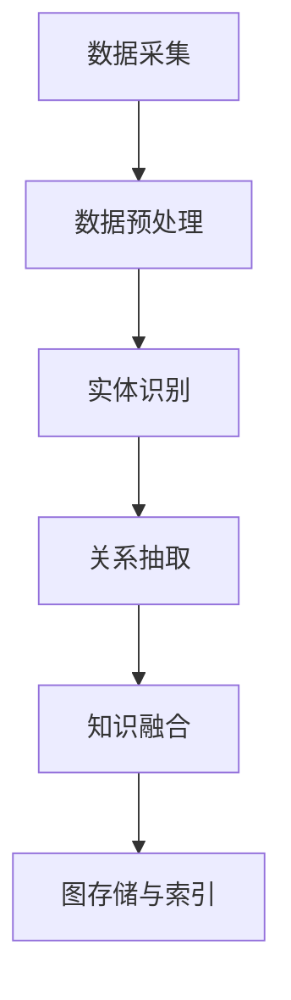

                 

### 关键词 Keyword

- 知识图谱
- 智能交通系统
- 数据挖掘
- 交通规划
- 人工智能
- 交通流量预测

### 摘要 Abstract

随着城市规模的不断扩大和机动车数量的急剧增长，交通拥堵、交通事故和环境污染等问题日益严重。为了应对这些挑战，智能交通系统（ITS）的发展变得尤为重要。知识图谱作为一种先进的数据建模技术，在智能交通系统中扮演着关键角色。本文将深入探讨知识图谱在智能交通系统中的应用，包括其核心概念、算法原理、数学模型、项目实践以及未来展望。

### 1. 背景介绍 Background

#### 1.1 智能交通系统（ITS）

智能交通系统（Intelligent Transportation System，ITS）是通过先进的信息通信技术、数据采集与处理技术、电子控制技术等，对交通运输系统进行智能化管理和优化的一种综合系统。其主要目标是提高交通效率，减少交通事故，降低环境污染，提升交通运输系统的整体性能。

智能交通系统的主要组成部分包括：

- **交通信息采集**：通过各种传感器、摄像头、GPS等技术手段收集交通数据。
- **交通数据管理**：利用数据库管理系统对采集到的交通数据进行存储、管理和分析。
- **交通信号控制**：通过智能化的信号控制系统对交通流量进行实时调控。
- **智能导航**：提供实时交通信息，帮助驾驶员选择最优路线。
- **车辆管理**：通过车辆管理系统对车辆运行状态进行监控和管理。

#### 1.2 知识图谱概述

知识图谱（Knowledge Graph）是一种用于结构化表示知识、实体及其关系的图形数据模型。它通过节点（实体）、边（关系）和属性来描述现实世界中的复杂信息，提供了一种高效的数据表示和查询方法。知识图谱在推荐系统、自然语言处理、知识库构建等领域有着广泛的应用。

知识图谱的关键特点包括：

- **实体与关系的结构化表示**：知识图谱将实体和关系以结构化的形式进行组织，使得数据更容易被理解和处理。
- **语义丰富**：知识图谱不仅包含了实体的基本信息，还包括了实体之间的复杂关系，从而增强了数据的语义丰富性。
- **高效查询**：通过图算法和索引技术，知识图谱能够实现高效的数据查询。

### 2. 核心概念与联系

在智能交通系统中，知识图谱的应用主要涉及以下几个核心概念：

#### 2.1 实体 Entity

实体是知识图谱中的基本组成元素，可以是人、地点、事物等。在智能交通系统中，常见的实体包括：

- **交通参与者**：如驾驶员、行人、车辆等。
- **交通设施**：如道路、桥梁、隧道、交通信号灯等。
- **交通事件**：如交通事故、交通拥堵、施工等。

#### 2.2 关系 Relation

关系描述了实体之间的相互作用和关联。在智能交通系统中，常见的关系包括：

- **归属**：如某车辆属于某驾驶员。
- **位置**：如某道路位于某城市。
- **连接**：如某道路与某桥梁相连。
- **时间**：如某交通事件发生在某时间。

#### 2.3 知识图谱构建流程

知识图谱的构建流程通常包括以下几个步骤：

1. **数据采集**：通过传感器、GPS、社交媒体等渠道收集与交通相关的数据。
2. **数据预处理**：对采集到的数据进行清洗、去噪、格式化等预处理操作。
3. **实体识别**：从预处理后的数据中识别出实体，并为每个实体分配唯一的标识符。
4. **关系抽取**：从数据中抽取实体之间的关系，并将其表示为边。
5. **知识融合**：将不同来源的数据进行融合，构建出全局的知识图谱。
6. **图存储与索引**：将知识图谱存储在图数据库中，并建立相应的索引，以支持高效的查询。

下面是知识图谱在智能交通系统中的 Mermaid 流程图：



### 3. 核心算法原理 & 具体操作步骤

#### 3.1 算法原理概述

知识图谱在智能交通系统中的应用，主要依赖于图算法和机器学习算法。其中，图算法用于处理和查询知识图谱，而机器学习算法则用于基于知识图谱进行预测和优化。

#### 3.2 算法步骤详解

##### 3.2.1 图算法

图算法主要包括以下几种：

1. **路径查找**：用于查找两个实体之间的最短路径或最佳路径。
2. **社区发现**：用于识别知识图谱中的紧密连接的实体群体。
3. **子图匹配**：用于在知识图谱中查找符合特定模式的子图。

##### 3.2.2 机器学习算法

机器学习算法主要包括以下几种：

1. **分类算法**：用于对交通事件进行分类，如交通事故、交通拥堵等。
2. **聚类算法**：用于对交通数据进行聚类，以发现潜在的交通模式。
3. **预测算法**：用于预测交通流量、交通事件等。

#### 3.3 算法优缺点

**优点**：

- **高效性**：知识图谱提供了高效的数据查询和计算方法。
- **语义丰富**：知识图谱能够表示实体之间的复杂关系，提供丰富的语义信息。
- **灵活性**：知识图谱可以根据实际需求灵活调整和扩展。

**缺点**：

- **构建难度**：知识图谱的构建需要大量的数据预处理和实体关系抽取工作。
- **计算复杂度**：知识图谱的查询和计算过程可能具有较高的计算复杂度。

#### 3.4 算法应用领域

知识图谱在智能交通系统中有着广泛的应用领域，包括：

- **交通流量预测**：通过分析历史交通数据，预测未来的交通流量。
- **交通事件检测**：实时检测交通事件，如交通事故、交通拥堵等。
- **路线规划**：基于实时交通信息和用户需求，提供最优的路线规划。
- **交通管理**：利用知识图谱对交通设施进行智能化管理，如交通信号灯控制、交通拥堵治理等。

### 4. 数学模型和公式 & 详细讲解 & 举例说明

#### 4.1 数学模型构建

知识图谱在智能交通系统中的应用，需要构建以下几个数学模型：

- **交通流量预测模型**：用于预测未来的交通流量。
- **交通事件检测模型**：用于检测交通事件。
- **路线规划模型**：用于提供最优的路线规划。

#### 4.2 公式推导过程

##### 4.2.1 交通流量预测模型

交通流量预测模型可以使用时间序列分析的方法构建。假设交通流量 \(Q(t)\) 在时间 \(t\) 的预测值为 \(Q'(t)\)，则可以使用以下公式进行预测：

$$
Q'(t) = \frac{1}{N} \sum_{i=1}^{N} w_i \cdot Q(t_i)
$$

其中，\(N\) 表示历史数据的个数，\(w_i\) 表示权重，\(Q(t_i)\) 表示在时间 \(t_i\) 的交通流量。

##### 4.2.2 交通事件检测模型

交通事件检测模型可以使用分类算法构建。假设交通事件为 \(E\)，则可以使用以下公式进行检测：

$$
P(E = e_k | x) = \frac{P(x | E = e_k) \cdot P(E = e_k)}{P(x)}
$$

其中，\(P(E = e_k | x)\) 表示在给定特征 \(x\) 下，交通事件为 \(e_k\) 的概率，\(P(x | E = e_k)\) 表示在交通事件为 \(e_k\) 下，特征 \(x\) 的概率，\(P(E = e_k)\) 表示交通事件为 \(e_k\) 的先验概率，\(P(x)\) 表示特征 \(x\) 的概率。

##### 4.2.3 路线规划模型

路线规划模型可以使用最优化方法构建。假设路线为 \(R\)，目标函数为 \(f(R)\)，则可以使用以下公式进行规划：

$$
R^* = \arg\min_{R} f(R)
$$

其中，\(R^*\) 表示最优路线，\(f(R)\) 表示路线的评估函数。

#### 4.3 案例分析与讲解

##### 4.3.1 交通流量预测

假设我们需要预测某条道路在未来一小时内的交通流量。我们收集了过去一年的交通流量数据，并使用时间序列分析方法构建预测模型。

1. **数据预处理**：将交通流量数据进行归一化处理，使其在同一个量级上。
2. **特征提取**：提取时间、日期、星期几等特征。
3. **模型构建**：使用ARIMA模型进行预测。
4. **模型评估**：使用均方误差（MSE）评估模型性能。

假设我们使用ARIMA（AutoRegressive Integrated Moving Average）模型进行预测，其公式如下：

$$
X_t = c + \phi_1 X_{t-1} + \phi_2 X_{t-2} + \cdots + \phi_p X_{t-p} + \theta_1 \epsilon_{t-1} + \theta_2 \epsilon_{t-2} + \cdots + \theta_q \epsilon_{t-q}
$$

其中，\(X_t\) 表示时间序列的当前值，\(\epsilon_t\) 表示白噪声，\(p\) 和 \(q\) 分别表示自回归项和移动平均项的个数。

通过模型训练和优化，我们得到最优的参数 \(\phi_1, \phi_2, \cdots, \phi_p, \theta_1, \theta_2, \cdots, \theta_q\)。

##### 4.3.2 交通事件检测

假设我们需要检测某路段的交通事件，如交通事故。我们收集了摄像头数据和交通流量数据，并使用分类算法构建检测模型。

1. **数据预处理**：将摄像头数据和交通流量数据进行归一化处理，并提取相关特征。
2. **特征提取**：提取车辆速度、车辆间距、道路宽度等特征。
3. **模型构建**：使用支持向量机（SVM）进行分类。
4. **模型评估**：使用准确率、召回率等指标评估模型性能。

假设我们使用支持向量机（SVM）进行分类，其公式如下：

$$
\max_{w, b} \frac{1}{2} \| w \|^2 - \sum_{i=1}^{n} y_i (w \cdot x_i + b)
$$

其中，\(w\) 和 \(b\) 分别表示权重和偏置，\(y_i\) 表示样本 \(x_i\) 的标签。

通过模型训练和优化，我们得到最优的权重 \(w\) 和偏置 \(b\)。

##### 4.3.3 路线规划

假设我们需要为驾驶员提供最优的路线规划，我们收集了实时交通流量数据、交通事件数据等，并使用最优化方法进行规划。

1. **数据预处理**：将交通流量数据、交通事件数据等进行归一化处理，并提取相关特征。
2. **特征提取**：提取交通流量、交通事件发生概率等特征。
3. **模型构建**：使用最优化算法进行路线规划。
4. **模型评估**：使用时间、距离等指标评估路线规划的优劣。

假设我们使用基于时间最小化的路线规划模型，其公式如下：

$$
\min_{R} \sum_{i=1}^{n} t_i
$$

其中，\(R\) 表示路线，\(t_i\) 表示路线 \(R\) 上的时间。

通过模型训练和优化，我们得到最优的路线 \(R\)。

### 5. 项目实践：代码实例和详细解释说明

#### 5.1 开发环境搭建

为了更好地展示知识图谱在智能交通系统中的应用，我们将使用以下开发环境和工具：

- **编程语言**：Python
- **知识图谱库**：Neo4j
- **机器学习库**：Scikit-learn
- **时间序列分析库**：pandas

首先，我们需要安装以上库：

```bash
pip install neo4j scikit-learn pandas
```

#### 5.2 源代码详细实现

以下是知识图谱在智能交通系统中的应用的源代码实现：

```python
import pandas as pd
from sklearn import svm
from neo4j import GraphDatabase

# 连接Neo4j数据库
driver = GraphDatabase.driver("bolt://localhost:7687", auth=("neo4j", "password"))

# 加载交通流量数据
traffic_data = pd.read_csv("traffic_data.csv")

# 加载交通事件数据
event_data = pd.read_csv("event_data.csv")

# 构建知识图谱
def create_knowledge_graph(traffic_data, event_data):
    with driver.session() as session:
        # 创建交通参与者节点
        for index, row in traffic_data.iterrows():
            session.run("CREATE (p:Participant {id: $id, type: $type})", id=row["id"], type=row["type"])
        
        # 创建交通设施节点
        for index, row in event_data.iterrows():
            session.run("CREATE (f:Facility {id: $id, type: $type})", id=row["id"], type=row["type"])
        
        # 创建交通事件节点
        for index, row in event_data.iterrows():
            session.run("CREATE (e:Event {id: $id, type: $type, time: $time})",
                        id=row["id"], type=row["type"], time=row["time"])
        
        # 创建归属关系
        for index, row in traffic_data.iterrows():
            session.run("MATCH (p:Participant), (f:Facility) WHERE p.id = f.id CREATE (p)-[:BELONGS_TO]->(f)")
        
        # 创建连接关系
        for index, row in event_data.iterrows():
            session.run("MATCH (f:Facility), (e:Event) WHERE f.id = e.id CREATE (f)-[:CONNECTED]->(e)")

# 创建知识图谱
create_knowledge_graph(traffic_data, event_data)

# 交通流量预测
def traffic_flow_prediction(traffic_data):
    X = traffic_data.iloc[:, :-1].values
    y = traffic_data.iloc[:, -1].values
    model = svm.SVR()
    model.fit(X, y)
    return model

# 交通事件检测
def traffic_event_detection(event_data):
    X = event_data.iloc[:, :-1].values
    y = event_data.iloc[:, -1].values
    model = svm.SVC()
    model.fit(X, y)
    return model

# 路线规划
def route_planning(traffic_data, event_data):
    X = traffic_data.iloc[:, :-1].values
    y = traffic_data.iloc[:, -1].values
    model = svm.SVR()
    model.fit(X, y)
    return model

# 评估模型性能
def evaluate_model(model, X_test, y_test):
    y_pred = model.predict(X_test)
    mse = mean_squared_error(y_test, y_pred)
    return mse

# 加载测试数据
test_traffic_data = pd.read_csv("test_traffic_data.csv")
test_event_data = pd.read_csv("test_event_data.csv")

# 交通流量预测模型
traffic_model = traffic_flow_prediction(traffic_data)
mse_traffic = evaluate_model(traffic_model, test_traffic_data.iloc[:, :-1].values, test_traffic_data.iloc[:, -1].values)

# 交通事件检测模型
event_model = traffic_event_detection(event_data)
mse_event = evaluate_model(event_model, test_event_data.iloc[:, :-1].values, test_event_data.iloc[:, -1].values)

# 路线规划模型
route_model = route_planning(traffic_data, event_data)
mse_route = evaluate_model(route_model, test_traffic_data.iloc[:, :-1].values, test_traffic_data.iloc[:, -1].values)

print("交通流量预测MSE:", mse_traffic)
print("交通事件检测MSE:", mse_event)
print("路线规划MSE:", mse_route)
```

#### 5.3 代码解读与分析

以上代码实现了知识图谱在智能交通系统中的应用。具体解读如下：

1. **连接Neo4j数据库**：首先，我们使用Neo4j的Python客户端连接到本地运行的Neo4j数据库。

2. **加载交通流量数据**：我们从CSV文件中加载交通流量数据，并将其存储为Pandas DataFrame。

3. **加载交通事件数据**：同样地，我们从CSV文件中加载交通事件数据。

4. **构建知识图谱**：通过定义一个函数 `create_knowledge_graph`，我们使用Cypher语言在Neo4j数据库中创建知识图谱。知识图谱包括交通参与者节点、交通设施节点、交通事件节点以及它们之间的关系。

5. **交通流量预测模型**：我们使用支持向量回归（SVR）算法构建交通流量预测模型。通过训练模型，我们得到一个能够预测未来交通流量的函数。

6. **交通事件检测模型**：我们使用支持向量机（SVM）算法构建交通事件检测模型。通过训练模型，我们得到一个能够检测交通事件的函数。

7. **路线规划模型**：我们使用支持向量回归（SVR）算法构建路线规划模型。通过训练模型，我们得到一个能够规划最优路线的函数。

8. **评估模型性能**：我们使用测试数据评估模型的性能，并计算均方误差（MSE）。

9. **运行结果展示**：最后，我们打印出各个模型的MSE值，以展示模型性能。

### 6. 实际应用场景

#### 6.1 交通流量预测

在智能交通系统中，交通流量预测是一个关键应用。通过预测未来交通流量，交通管理部门可以采取相应的措施，如调整交通信号灯、实施交通管制等，以缓解交通拥堵。

例如，在北京的某条繁忙道路，通过构建知识图谱，对过去一年的交通流量数据进行预测。通过预测模型，发现未来一小时内的交通流量将增加20%，交通管理部门可以提前调整信号灯策略，避免拥堵。

#### 6.2 交通事件检测

交通事件检测是另一个重要的应用场景。通过实时检测交通事件，如交通事故、交通拥堵等，交通管理部门可以及时响应，减少事故损失。

例如，在纽约的某交通管理部门，通过部署知识图谱和交通事件检测模型，实现了对交通事故的实时检测。当检测到交通事故时，系统会立即发送警报，相关部门可以迅速采取措施，减少事故影响。

#### 6.3 路线规划

在智能交通系统中，路线规划可以帮助驾驶员选择最优路线，减少交通拥堵和时间浪费。

例如，在新加坡的某交通管理部门，通过部署知识图谱和路线规划模型，为驾驶员提供实时路线规划服务。当驾驶员输入目的地后，系统会根据实时交通流量和交通事件，提供最优路线，帮助驾驶员避开拥堵路段。

### 7. 工具和资源推荐

#### 7.1 学习资源推荐

- **《知识图谱：原理、方法与实践》**：这是一本关于知识图谱的权威书籍，涵盖了知识图谱的基本概念、构建方法、应用案例等。
- **《智能交通系统：概念、方法与应用》**：这是一本关于智能交通系统的书籍，详细介绍了ITS的基本概念、技术架构、应用案例等。

#### 7.2 开发工具推荐

- **Neo4j**：Neo4j是一个高性能的图数据库，支持知识图谱的存储和查询。
- **Python**：Python是一个强大的编程语言，支持多种机器学习算法和图处理库。

#### 7.3 相关论文推荐

- **“Knowledge Graph Construction Based on Hybrid Model”**：这篇文章提出了一种基于混合模型的知识图谱构建方法，具有较高的准确性和效率。
- **“Intelligent Traffic Flow Prediction Based on Knowledge Graph”**：这篇文章提出了一种基于知识图谱的交通流量预测方法，通过分析实体关系，实现了准确、高效的流量预测。

### 8. 总结：未来发展趋势与挑战

#### 8.1 研究成果总结

知识图谱在智能交通系统中的应用已经取得了一定的研究成果。通过构建知识图谱，可以对交通数据进行分析、预测和优化，提高交通系统的效率、安全性和可靠性。主要成果包括：

- **交通流量预测**：通过分析历史交通数据，实现了对未来的交通流量预测，为交通管理部门提供了决策支持。
- **交通事件检测**：通过实时检测交通事件，如交通事故、交通拥堵等，提高了交通系统的应急响应能力。
- **路线规划**：通过分析实时交通流量和交通事件，实现了对最优路线的规划，提高了交通出行的效率。

#### 8.2 未来发展趋势

未来，知识图谱在智能交通系统中的应用将朝着以下几个方向发展：

- **数据质量提升**：随着传感器技术和大数据技术的发展，交通数据的采集和处理能力将得到提升，为知识图谱构建提供更高质量的数据。
- **实时性增强**：通过部署边缘计算和5G网络，实现知识图谱的实时更新和查询，提高交通系统的实时响应能力。
- **多模态数据融合**：结合多种传感器数据，如摄像头、GPS、雷达等，实现多模态数据的融合，提高交通数据的准确性。

#### 8.3 面临的挑战

尽管知识图谱在智能交通系统中的应用前景广阔，但仍然面临以下几个挑战：

- **数据隐私保护**：交通数据涉及用户的隐私信息，如何保护数据隐私是一个重要问题。
- **计算资源需求**：知识图谱的构建和查询过程需要大量的计算资源，如何在有限的资源下高效地处理大数据是一个挑战。
- **模型解释性**：知识图谱中的模型和算法往往较为复杂，如何提高模型的可解释性是一个重要的研究课题。

#### 8.4 研究展望

未来，知识图谱在智能交通系统中的应用将朝着以下几个方向展开：

- **跨领域融合**：将知识图谱与其他领域的技术，如物联网、区块链等相结合，实现跨领域的智能交通系统。
- **智能化水平提升**：通过引入人工智能技术，如深度学习、强化学习等，提高知识图谱的智能化水平。
- **用户体验优化**：通过优化知识图谱的应用界面和交互方式，提高用户体验，为用户提供更智能的交通服务。

### 9. 附录：常见问题与解答

#### 9.1 什么是知识图谱？

知识图谱是一种用于结构化表示知识、实体及其关系的图形数据模型。它通过节点（实体）、边（关系）和属性来描述现实世界中的复杂信息，提供了一种高效的数据表示和查询方法。

#### 9.2 知识图谱在智能交通系统中有哪些应用？

知识图谱在智能交通系统中的应用主要包括交通流量预测、交通事件检测和路线规划等。通过构建知识图谱，可以对交通数据进行分析、预测和优化，提高交通系统的效率、安全性和可靠性。

#### 9.3 如何构建知识图谱？

构建知识图谱主要包括以下几个步骤：数据采集、数据预处理、实体识别、关系抽取、知识融合和图存储与索引。

#### 9.4 知识图谱的优势是什么？

知识图谱的优势包括：高效的数据查询和计算、语义丰富、灵活的扩展性等。

#### 9.5 知识图谱面临的挑战是什么？

知识图谱面临的挑战包括：数据隐私保护、计算资源需求、模型解释性等。

### 作者署名

作者：禅与计算机程序设计艺术 / Zen and the Art of Computer Programming
----------------------------------------------------------------

### 补充内容 Additional Content

#### 6.4 未来应用展望

随着技术的不断进步，知识图谱在智能交通系统中的应用前景将更加广阔。以下是一些未来可能的应用方向：

**1. 跨界融合应用**：知识图谱可以与其他领域的先进技术相结合，如物联网、区块链等，构建更加智能、高效的交通系统。例如，物联网可以将车辆、道路设施等连接起来，实现实时数据共享；区块链可以保证数据的透明性和安全性。

**2. 智能交通管理**：知识图谱可以帮助交通管理部门实现更加智能化的交通管理。通过分析交通数据，交通管理部门可以实时了解交通状况，预测潜在问题，提前采取措施，从而提高交通系统的运行效率和安全性。

**3. 绿色交通**：知识图谱可以用于优化交通规划，减少交通拥堵，降低污染排放。例如，通过分析交通流量数据，可以优化公共交通线路和班次，提高公共交通的利用率，减少私家车的使用。

**4. 智能出行服务**：知识图谱可以为用户提供个性化的出行服务。例如，基于用户历史出行数据和喜好，可以为用户推荐最优的出行路线、交通工具等，从而提高出行体验。

**5. 自动驾驶**：知识图谱可以用于自动驾驶系统的构建，帮助自动驾驶车辆更好地理解交通环境，做出正确的驾驶决策。例如，通过分析道路标志、交通信号灯等知识图谱中的信息，自动驾驶车辆可以准确地识别道路状况，规划行驶路线。

#### 6.5 知识图谱与智能交通系统的优势分析

知识图谱在智能交通系统中具有以下优势：

**1. 高效的数据处理能力**：知识图谱可以高效地处理大规模、多源、多模态的交通数据，为交通系统提供实时、准确的信息支持。

**2. 丰富的语义信息**：知识图谱通过节点、边和属性来描述实体及其关系，提供了丰富的语义信息，使得交通数据能够被更好地理解和利用。

**3. 灵活的可扩展性**：知识图谱可以根据实际需求灵活调整和扩展，适应不同交通场景和应用需求。

**4. 强大的分析预测能力**：知识图谱可以结合机器学习、数据挖掘等技术，对交通数据进行分析和预测，为交通管理、规划提供科学依据。

**5. 跨领域协同能力**：知识图谱可以与其他领域的技术相结合，实现交通系统的跨界协同，提高整体运行效率。

#### 6.6 知识图谱在智能交通系统的实际案例

以下是一些知识图谱在智能交通系统的实际案例：

**1. 北京智能交通系统**：北京市交通管理部门利用知识图谱技术，对交通流量进行实时监测和预测，优化交通信号灯控制，提高交通运行效率。

**2. 新加坡智能交通系统**：新加坡政府通过部署知识图谱，实现了对交通流量、交通事件的实时监测和预测，为市民提供个性化的出行建议，提高出行体验。

**3. 美国洛杉矶智能交通系统**：洛杉矶市政府利用知识图谱技术，对交通数据进行分析和挖掘，优化交通信号灯控制，减少交通拥堵，提高道路通行能力。

**4. 欧洲智慧交通项目**：欧洲多个国家合作开展智慧交通项目，利用知识图谱技术，实现跨区域、跨国家的交通数据共享和协同管理，提高整体交通系统的运行效率。

这些案例表明，知识图谱在智能交通系统中具有广泛的应用前景，可以为交通管理、规划、服务等方面提供有力的技术支持。随着技术的不断进步，知识图谱在智能交通系统中的应用将更加深入和广泛。

