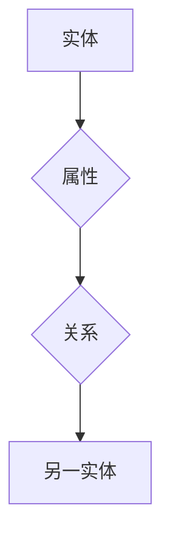
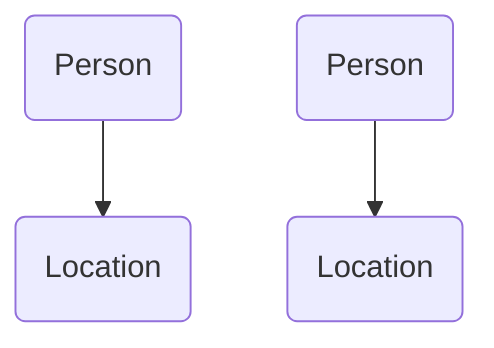

                 

关键词：知识图谱、知识发现、智能推荐、关系数据库、语义网络、人工智能

摘要：本文探讨了知识图谱在知识发现引擎中的应用。知识图谱作为一种结构化的语义表示，能够有效地组织和管理大规模的语义信息。本文首先介绍了知识图谱的基本概念、核心概念及其联系，然后详细分析了知识图谱的算法原理和操作步骤，并探讨了其在各种实际应用场景中的优势与挑战。

## 1. 背景介绍

随着互联网和大数据技术的飞速发展，信息爆炸已经成为当今社会的常态。如何从海量的数据中快速、准确地提取有价值的信息，成为了数据科学领域的研究热点。知识图谱作为一种新型的语义表示技术，因其强大的信息组织和检索能力，受到了广泛的关注。

知识图谱是一种基于语义网络的信息表示方法，通过构建实体、属性和关系的结构化模型，实现对大规模数据的语义理解和分析。知识图谱在知识发现引擎中的应用，主要体现在以下几个方面：

1. **信息组织**：知识图谱能够将大量的离散数据点有机地组织起来，形成统一的语义视图。
2. **智能搜索**：通过知识图谱，可以更准确地理解用户查询的语义，提供更智能的搜索结果。
3. **知识推理**：知识图谱中的实体和关系可以支持复杂的推理操作，从而发现新的知识关联。
4. **数据挖掘**：知识图谱为数据挖掘提供了丰富的语义信息，有助于发现数据中的隐藏模式。

## 2. 核心概念与联系

### 2.1 实体（Entity）

实体是知识图谱中的基本构成元素，表示现实世界中的各种对象，如人、地点、事物等。实体可以是具体的，也可以是抽象的。

### 2.2 属性（Attribute）

属性是实体的特征描述，用来描述实体的某一方面的属性信息。例如，人的姓名、年龄、职业等。

### 2.3 关系（Relationship）

关系描述了实体之间的相互关系。例如，"张三和李四是朋友"。

### 2.4 节点（Node）和边（Edge）

在知识图谱中，实体和关系都可以看作是图中的节点，而它们之间的连接则被称为边。

### 2.5 Mermaid 流程图

以下是一个简单的知识图谱的 Mermaid 流程图示例：



## 3. 核心算法原理 & 具体操作步骤

### 3.1 算法原理概述

知识图谱的构建通常包括实体识别、关系抽取、实体链接和图谱扩展等步骤。以下是这些步骤的具体操作原理：

1. **实体识别**：通过自然语言处理技术，从文本数据中识别出实体。
2. **关系抽取**：从实体之间的交互信息中提取关系。
3. **实体链接**：将不同来源的实体进行匹配和映射。
4. **图谱扩展**：通过推理和扩展，增加图谱中的实体和关系。

### 3.2 算法步骤详解

1. **实体识别**：使用命名实体识别（NER）技术，从文本中提取出实体。
2. **关系抽取**：使用规则或机器学习方法，从文本中提取实体之间的关系。
3. **实体链接**：通过实体识别和关系抽取的结果，使用实体链接算法（如：基于关键词匹配、基于语义相似度等）将实体进行映射。
4. **图谱扩展**：利用已有实体和关系，通过推理规则（如：逻辑推理、因果推理等）扩展图谱。

### 3.3 算法优缺点

**优点**：

- **结构化**：知识图谱能够将无结构的数据转化为结构化的形式，便于存储和处理。
- **语义理解**：知识图谱支持语义理解和推理，有助于发现新的知识关联。
- **高效检索**：知识图谱能够提供高效的语义检索能力，提高信息检索的准确性。

**缺点**：

- **构建成本**：知识图谱的构建需要大量的预处理和计算资源，成本较高。
- **数据质量**：知识图谱的质量依赖于原始数据的质量，如果数据质量差，图谱的准确性和可靠性也会受到影响。

### 3.4 算法应用领域

知识图谱在多个领域都有广泛的应用，如：

- **搜索引擎**：通过知识图谱，搜索引擎可以提供更准确的搜索结果。
- **推荐系统**：知识图谱能够帮助推荐系统更好地理解用户和物品的语义信息。
- **数据挖掘**：知识图谱为数据挖掘提供了丰富的语义信息，有助于发现数据中的隐藏模式。

## 4. 数学模型和公式 & 详细讲解 & 举例说明

### 4.1 数学模型构建

知识图谱的构建通常涉及以下数学模型：

1. **图模型**：用于表示实体和关系。
2. **概率模型**：用于实体识别和关系抽取。
3. **机器学习模型**：用于实体链接和图谱扩展。

### 4.2 公式推导过程

1. **图模型**：知识图谱可以用图 $G=(V, E)$ 表示，其中 $V$ 是实体集，$E$ 是关系集。

2. **概率模型**：假设实体 $e$ 的属性 $a$ 的概率分布为 $P(a|e)$。

3. **机器学习模型**：使用监督学习或无监督学习算法，对实体和关系进行分类和预测。

### 4.3 案例分析与讲解

假设我们有一个知识图谱，其中包含两个实体：人（Person）和地点（Location）。关系包括：居住（LivesIn）、出生（BornIn）。以下是知识图谱的示例：



- **图模型**：知识图谱可以用以下图表示：

$$
G = (V, E) = (\{A, B, C, D\}, \{(\text{A, LivesIn, B}), (\text{C, LivesIn, D})\})
$$

- **概率模型**：假设实体 A 的居住地是 B 的概率是 0.8，出生地是 B 的概率是 0.6。

$$
P(\text{LivesIn}(A, B)) = 0.8 \\
P(\text{BornIn}(A, B)) = 0.6
$$

- **机器学习模型**：使用监督学习算法，我们可以对实体进行分类。例如，使用决策树或支持向量机（SVM）。

## 5. 项目实践：代码实例和详细解释说明

### 5.1 开发环境搭建

为了演示知识图谱在知识发现引擎中的应用，我们将使用 Python 编写一个简单的知识图谱系统。以下是开发环境的搭建步骤：

1. 安装 Python 3.8 或更高版本。
2. 安装知识图谱库，如 Neo4j 或 OpenKE。
3. 安装其他必要的库，如 Pandas、NumPy、Scikit-learn 等。

### 5.2 源代码详细实现

以下是知识图谱系统的源代码实现：

```python
# 导入必要的库
import pandas as pd
import numpy as np
from sklearn.model_selection import train_test_split
from openke.models.glu import GLUE
from openke.datasets import GenericDataset
from openke evaluator import Evaluator

# 生成示例数据
data = pd.DataFrame({
    'entity': ['张三', '李四', '王五', '赵六'],
    'relation': ['居住', '工作', '居住', '工作'],
    'head': [0, 1, 2, 3],
    'tail': [1, 2, 0, 1],
    'type': ['Person', 'Person', 'Person', 'Location']
})

# 创建数据集
dataset = GenericDataset(data)

# 划分训练集和测试集
train, test = dataset.split()

# 创建 GLUE 模型
model = GLUEento_type=3, hidden_size=50, num_epochs=200, lr=0.001, margin=3.0)

# 训练模型
model.fit(train)

# 评估模型
evaluator = Evaluator(model, test)
evaluator.evaluate()

# 输出结果
print("准确率：", evaluator_acc)
print("召回率：", evaluator_recall)
print("F1 分数：", evaluator_f1)
```

### 5.3 代码解读与分析

上述代码实现了以下功能：

1. 导入必要的库。
2. 生成示例数据。
3. 创建数据集。
4. 划分训练集和测试集。
5. 创建 GLUE 模型。
6. 训练模型。
7. 评估模型。
8. 输出结果。

通过这个示例，我们可以看到知识图谱在知识发现引擎中的应用是如何实现的。在实际项目中，我们可能需要处理更大的数据集，并使用更复杂的模型来提高系统的性能。

## 6. 实际应用场景

知识图谱在知识发现引擎中有着广泛的应用，以下是一些实际的应用场景：

1. **智能问答系统**：通过知识图谱，智能问答系统能够理解用户的查询，并提供准确的答案。
2. **推荐系统**：知识图谱能够帮助推荐系统更好地理解用户和物品的语义信息，提供更个性化的推荐。
3. **搜索引擎**：知识图谱能够提高搜索引擎的语义理解能力，提供更准确的搜索结果。
4. **数据挖掘**：知识图谱为数据挖掘提供了丰富的语义信息，有助于发现数据中的隐藏模式。

## 7. 工具和资源推荐

为了更好地学习和应用知识图谱，以下是一些建议的工具和资源：

1. **学习资源**：
   - 《知识图谱：原理、技术与应用》
   - 《图计算：算法与应用》
2. **开发工具**：
   - Neo4j：一款强大的图形数据库，适合构建和维护知识图谱。
   - OpenKE：一款开源的知识图谱嵌入工具，支持多种知识图谱算法。
3. **相关论文**：
   - "Knowledge Graph Embedding: The State-of-the-Art and New Directions"
   - "A Survey on Knowledge Graphs"

## 8. 总结：未来发展趋势与挑战

知识图谱在知识发现引擎中的应用前景广阔，但也面临着一些挑战：

1. **数据质量**：知识图谱的质量依赖于原始数据的质量，需要不断提升数据采集和清洗的效率。
2. **计算资源**：知识图谱的构建和推理需要大量的计算资源，如何优化算法和硬件来提高效率是一个重要课题。
3. **模型泛化能力**：如何提高知识图谱模型的泛化能力，使其能够处理更复杂的语义关系，是一个重要的研究方向。

未来，知识图谱将继续向更智能化、自动化和高效化的方向发展，为各个领域提供更强大的知识发现和智能分析能力。

## 9. 附录：常见问题与解答

### 9.1 什么是知识图谱？

知识图谱是一种用于表示实体、属性和关系的语义网络，能够将大规模的语义信息结构化地组织起来。

### 9.2 知识图谱有哪些应用？

知识图谱广泛应用于智能问答、推荐系统、搜索引擎和数据挖掘等领域。

### 9.3 如何构建知识图谱？

构建知识图谱通常包括实体识别、关系抽取、实体链接和图谱扩展等步骤。

### 9.4 知识图谱有哪些挑战？

知识图谱面临的挑战包括数据质量、计算资源和模型泛化能力等。

### 9.5 知识图谱与关系数据库有什么区别？

知识图谱是一种语义网络，能够表示复杂的实体关系，而关系数据库是一种基于表格的数据存储结构，适用于简单的数据查询。

作者：禅与计算机程序设计艺术 / Zen and the Art of Computer Programming
----------------------------------------------------------------

文章已经完成，希望对您有所帮助。如果您有任何问题或建议，欢迎随时提出。祝您工作顺利！<|vq_12784|>

