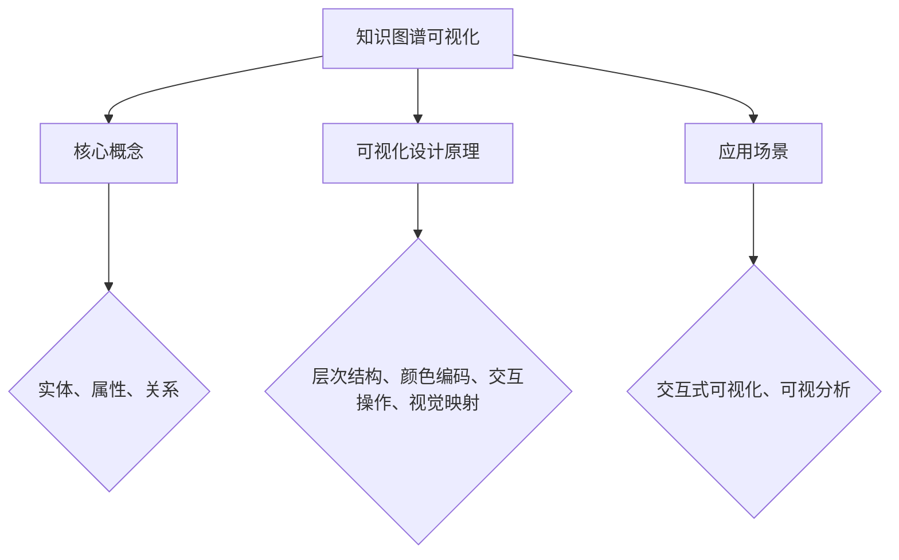

                 

关键词：知识图谱、可视化设计、交互式可视化、可视分析、知识图谱可视化、知识图谱可视化工具

## 摘要

知识图谱作为人工智能的重要工具，其可视化设计对于理解、分析及应用具有重要意义。本文旨在探讨知识图谱的可视化设计，特别是交互式可视化和可视分析技术。文章首先介绍了知识图谱的基本概念和重要性，随后深入探讨了交互式可视化和可视分析的核心原理和方法，最后通过具体案例和实践，展示了知识图谱可视化设计在实际应用中的效果和价值。本文的撰写旨在为业界提供有价值的参考，推动知识图谱可视化技术的发展。

## 1. 背景介绍

### 1.1 知识图谱的概念与重要性

知识图谱（Knowledge Graph）是一种用于表示实体、属性和关系的数据结构，通过将现实世界中的实体及其相互关系抽象为节点和边，构建一个有向无环图（DAG）。知识图谱的出现，源于对大规模复杂数据进行高效处理和利用的需求。它不仅能够整合多源异构数据，还能提供强大的数据关联和分析能力。

知识图谱在多个领域具有重要应用价值，例如：

1. **搜索引擎**：通过知识图谱，搜索引擎可以更好地理解用户查询，提供更精确的结果。
2. **推荐系统**：知识图谱可以帮助推荐系统发现用户潜在的兴趣和需求，提供更个性化的推荐。
3. **自然语言处理**：知识图谱为自然语言处理提供了语义理解的强大支撑，有助于提升文本分析和机器翻译的准确度。
4. **智能问答系统**：知识图谱能够提供丰富的背景知识，支持智能问答系统提供更全面和准确的答案。

### 1.2 可视化设计的重要性

可视化设计在知识图谱的应用中扮演着关键角色。它不仅可以帮助用户直观地理解和分析知识图谱，还能提升系统的交互性和用户体验。具体来说，可视化设计的重要性体现在以下几个方面：

1. **数据理解**：通过可视化，用户可以快速捕捉到数据中的关键模式和关系，提高对知识图谱的理解深度。
2. **知识发现**：可视化技术能够帮助用户发现数据中隐藏的规律和趋势，促进知识的发现和创新。
3. **交互体验**：良好的可视化设计可以提供直观、便捷的交互体验，使用户能够更高效地与系统进行互动。
4. **数据传播**：可视化技术能够将复杂的数据转化为易于传播和理解的信息，有助于知识图谱的推广和应用。

### 1.3 交互式可视化和可视分析的核心概念

交互式可视化（Interactive Visualization）强调用户与可视化界面之间的互动，通过鼠标点击、拖拽、缩放等操作，用户可以动态地探索和操控数据。这种交互性使得用户能够更深入地理解和分析知识图谱。

可视分析（Visual Analytics）则是将可视化技术与数据分析相结合，旨在通过视觉方式增强数据理解、发现和决策过程。它不仅关注数据的展示，还强调数据的处理和分析，通过可视化的手段来揭示数据背后的信息。

交互式可视化和可视分析在知识图谱的可视化设计中起着至关重要的作用，它们共同构成了知识图谱可视化设计的基础。

## 2. 核心概念与联系

### 2.1 知识图谱的基本概念

知识图谱由三个核心元素组成：实体、属性和关系。

- **实体（Entity）**：知识图谱中的基本构成单位，可以是任何具有独立存在意义的事物，如人、地点、组织等。
- **属性（Attribute）**：描述实体的特征或属性，如人的姓名、地点的纬度等。
- **关系（Relationship）**：描述实体之间的关联，如人与人之间的友谊关系、地点与地点之间的距离等。

### 2.2 可视化设计的关键原理

可视化设计的关键在于如何将抽象的知识图谱转化为直观的视觉形式。以下是一些核心原理：

- **层次结构**：通过层次结构，将复杂的知识图谱分解为更易于理解的层次，便于用户浏览和探索。
- **颜色编码**：使用不同的颜色对不同的实体或关系进行区分，提高视觉辨识度。
- **交互操作**：提供丰富的交互操作，如缩放、筛选、过滤等，使用户能够动态地探索数据。
- **视觉映射**：通过将数据值映射到视觉属性，如大小、亮度等，使得数据特征直观地呈现给用户。

### 2.3 交互式可视化和可视分析的应用场景

- **交互式可视化**：在知识图谱的探索和分析过程中，用户可以通过点击、拖拽等交互操作，动态地探索和调整图谱，从而更好地理解图谱中的信息。
- **可视分析**：在知识图谱的应用场景中，如推荐系统、搜索引擎等，通过可视分析技术，可以发现潜在的用户需求、挖掘数据中的价值，从而提升系统的性能和用户体验。

### 2.4 Mermaid 流程图



## 3. 核心算法原理 & 具体操作步骤

### 3.1 算法原理概述

知识图谱可视化设计的核心在于将抽象的图谱数据转化为直观的视觉形式。这一过程涉及到数据预处理、图谱布局、交互设计等多个方面。

- **数据预处理**：通过清洗、整合和规范化数据，为可视化提供高质量的数据源。
- **图谱布局**：选择合适的布局算法，将图谱中的节点和边进行合理排列，使得用户可以清晰地看到图谱的结构和关系。
- **交互设计**：提供丰富的交互操作，如缩放、过滤、选择等，使用户可以动态地探索图谱。

### 3.2 算法步骤详解

1. **数据预处理**：
   - **数据清洗**：去除重复数据、修复错误数据，保证数据的准确性。
   - **数据整合**：将来自不同源的数据进行整合，形成统一的数据结构。
   - **数据规范化**：对数据进行统一格式和命名规范，便于后续处理。

2. **图谱布局**：
   - **选择布局算法**：根据图谱的特点选择合适的布局算法，如Force-directed布局、Fruchterman-Reingold算法等。
   - **节点和边布局**：根据布局算法，对图谱中的节点和边进行排列，形成可视化的图谱结构。

3. **交互设计**：
   - **缩放操作**：提供缩放功能，使用户可以放大或缩小视图，以便更好地观察细节或整体结构。
   - **过滤操作**：提供过滤功能，使用户可以筛选特定的节点或关系，突出关键信息。
   - **选择操作**：提供选择功能，使用户可以选中特定的节点或关系，进行进一步操作。

### 3.3 算法优缺点

**优点**：
- **直观性**：通过可视化，用户可以直观地理解和分析知识图谱。
- **交互性**：丰富的交互操作使用户可以动态地探索和操控图谱。
- **多样性**：多种布局算法和交互设计提供了多样化的可视化方案。

**缺点**：
- **性能问题**：大规模知识图谱的可视化可能面临性能瓶颈。
- **易用性问题**：对于非专业人士，复杂的知识图谱可视化可能难以理解。

### 3.4 算法应用领域

知识图谱可视化算法广泛应用于多个领域：

- **搜索引擎**：通过可视化技术，用户可以更直观地理解搜索结果的相关性。
- **推荐系统**：通过可视化，推荐系统可以发现潜在的用户需求，提供更个性化的推荐。
- **自然语言处理**：知识图谱可视化有助于理解语义关系，提升自然语言处理的效果。
- **智能问答系统**：通过可视化，智能问答系统可以提供更全面和准确的答案。

## 4. 数学模型和公式 & 详细讲解 & 举例说明

### 4.1 数学模型构建

知识图谱可视化涉及多个数学模型，包括图论模型、几何模型和交互模型等。以下是一个简化的数学模型：

- **图论模型**：
  - 节点集合 \( V \)
  - 边集合 \( E \)
  - 节点之间的关系 \( R \)
- **几何模型**：
  - 节点的坐标表示
  - 边的长度和方向
- **交互模型**：
  - 缩放参数
  - 过滤条件
  - 选择状态

### 4.2 公式推导过程

知识图谱可视化中的关键公式包括节点坐标的计算、边长度的计算等。

- **节点坐标计算**：
  $$ x_i = x_c + r \cdot \cos(\theta_i) $$
  $$ y_i = y_c + r \cdot \sin(\theta_i) $$
  其中，\( x_i \) 和 \( y_i \) 分别为节点 \( i \) 的坐标，\( x_c \) 和 \( y_c \) 为中心点坐标，\( r \) 为节点到中心点的距离，\( \theta_i \) 为节点的角度。

- **边长度计算**：
  $$ d = \sqrt{(x_2 - x_1)^2 + (y_2 - y_1)^2} $$
  其中，\( d \) 为边 \( (x_1, y_1) \) 到 \( (x_2, y_2) \) 的长度。

### 4.3 案例分析与讲解

假设我们有一个简单的知识图谱，包含三个节点 \( A \)、\( B \) 和 \( C \)，它们之间的关系为 \( A \rightarrow B \) 和 \( B \rightarrow C \)。

1. **节点坐标计算**：

   假设中心点坐标为 \( (0, 0) \)，节点 \( A \) 的角度为 \( 0 \) 度，节点 \( B \) 的角度为 \( 120 \) 度，节点 \( C \) 的角度为 \( 240 \) 度。

   - \( A \) 的坐标：\( (0, 0) \)
   - \( B \) 的坐标：\( (r \cdot \cos(120), r \cdot \sin(120)) = (-0.5r, 0.866r) \)
   - \( C \) 的坐标：\( (r \cdot \cos(240), r \cdot \sin(240)) = (-0.5r, -0.866r) \)

2. **边长度计算**：

   假设节点间的距离 \( r \) 为 1。

   - \( A \) 到 \( B \) 的长度：\( \sqrt{(-0.5)^2 + (0.866)^2} = \sqrt{0.75} \approx 0.866 \)
   - \( B \) 到 \( C \) 的长度：\( \sqrt{(-0.5 - (-0.5))^2 + (-0.866 - 0)^2} = \sqrt{0.75} \approx 0.866 \)

通过以上计算，我们可以得到一个简单的知识图谱可视化结果，其中节点和边的位置和长度均符合数学模型。

## 5. 项目实践：代码实例和详细解释说明

### 5.1 开发环境搭建

为了实现知识图谱的可视化设计，我们需要搭建一个开发环境。以下是一个基本的开发环境搭建步骤：

1. 安装Python环境
2. 安装可视化库（如Plotly、Matplotlib等）
3. 安装图论库（如NetworkX等）

具体步骤如下：

```bash
# 安装Python环境
python --version

# 安装可视化库
pip install plotly
pip install matplotlib

# 安装图论库
pip install networkx
```

### 5.2 源代码详细实现

以下是一个简单的知识图谱可视化代码实例，使用了NetworkX和Plotly库。

```python
import networkx as nx
import matplotlib.pyplot as plt
import plotly.express as px

# 创建图
G = nx.Graph()

# 添加节点和边
G.add_node("A")
G.add_node("B")
G.add_node("C")
G.add_edge("A", "B")
G.add_edge("B", "C")

# 绘制图谱
nx.draw(G, with_labels=True)

# 保存图像
plt.savefig("graph.png")

# 使用Plotly绘制交互式图谱
fig = px.graph_graph(G)
fig.show()
```

### 5.3 代码解读与分析

上述代码首先导入了必要的库，然后创建了一个Graph对象，并添加了节点和边。接下来，使用matplotlib库绘制了非交互式的图谱图像，并保存为文件。最后，使用Plotly库绘制了一个交互式的图谱，并在网页上展示。

- **NetworkX**：用于创建和操作图结构，提供丰富的图算法和功能。
- **Matplotlib**：用于绘制静态图像，便于保存和打印。
- **Plotly**：提供交互式可视化，用户可以通过缩放、选择等操作动态探索图谱。

### 5.4 运行结果展示

通过运行上述代码，我们可以得到以下结果：

1. **静态图像**：保存为"graph.png"的图像，展示了知识图谱的结构。
2. **交互式图谱**：通过浏览器展示的交互式图谱，用户可以点击、缩放等操作。

## 6. 实际应用场景

知识图谱的可视化设计在多个实际应用场景中具有重要作用，以下是一些典型应用场景：

### 6.1 搜索引擎

搜索引擎通过知识图谱可视化，可以更直观地展示搜索结果的相关性。用户可以通过交互式可视化，了解搜索结果中的实体和关系，从而更好地理解搜索意图。

### 6.2 推荐系统

推荐系统通过知识图谱可视化，可以发现潜在的用户需求，提供更个性化的推荐。例如，通过可视化用户的历史行为和偏好，推荐系统可以发现用户可能感兴趣的新商品或服务。

### 6.3 自然语言处理

自然语言处理领域，知识图谱可视化有助于理解文本中的语义关系。通过可视化，研究人员可以更直观地分析语义结构，提升自然语言处理的准确性和效果。

### 6.4 智能问答系统

智能问答系统通过知识图谱可视化，可以提供更全面和准确的答案。通过交互式可视化，用户可以更清晰地理解问答系统的回答逻辑，提高用户满意度。

## 7. 工具和资源推荐

为了更好地进行知识图谱的可视化设计，以下是一些推荐的工具和资源：

### 7.1 学习资源推荐

- **书籍**：《知识图谱：概念、技术与应用》
- **在线课程**：Coursera上的“知识图谱与数据挖掘”课程
- **博客**：谷歌的官方博客，关于知识图谱的深入探讨

### 7.2 开发工具推荐

- **可视化库**：Plotly、D3.js、D3-Graph
- **图论库**：NetworkX、Graphviz
- **开发框架**：TensorFlow、PyTorch

### 7.3 相关论文推荐

- **“Google Knowledge Graph: Social Benefits and Impact on Search”**
- **“Knowledge Graph Embedding: The Sole Technology Behind Google’s RankBrain”**
- **“A Survey on Knowledge Graph Construction and Applications”**

## 8. 总结：未来发展趋势与挑战

### 8.1 研究成果总结

知识图谱的可视化设计已经取得了显著成果，主要包括：

- **算法优化**：多种布局算法和交互设计不断涌现，提高了知识图谱的可视化效果。
- **应用场景**：知识图谱可视化在搜索引擎、推荐系统、自然语言处理等领域取得了广泛应用。
- **工具和资源**：丰富的可视化库和开发框架为知识图谱可视化提供了强大的技术支持。

### 8.2 未来发展趋势

知识图谱可视化未来的发展趋势主要包括：

- **性能优化**：提高大规模知识图谱可视化的性能，支持实时交互。
- **智能交互**：结合人工智能技术，实现更智能的交互设计，提升用户体验。
- **多模态融合**：将文本、图像、语音等多种数据形式融合到知识图谱中，提供更丰富的可视化体验。

### 8.3 面临的挑战

知识图谱可视化面临的挑战主要包括：

- **性能瓶颈**：大规模知识图谱的可视化可能面临性能瓶颈，需要优化算法和架构。
- **易用性**：对于非专业人士，复杂的知识图谱可视化可能难以理解，需要提高易用性。
- **数据隐私**：知识图谱涉及大量敏感数据，如何保护用户隐私是一个重要挑战。

### 8.4 研究展望

未来，知识图谱可视化的发展将围绕以下几个方面展开：

- **跨学科融合**：结合计算机科学、心理学、认知科学等多学科知识，提高可视化设计的科学性和有效性。
- **智能化**：引入人工智能技术，实现知识图谱可视化的智能化，提升用户体验。
- **个性化**：根据用户需求，提供个性化的知识图谱可视化服务，满足不同场景的需求。

## 9. 附录：常见问题与解答

### 9.1 什么是知识图谱？

知识图谱是一种用于表示实体、属性和关系的数据结构，通过将现实世界中的实体及其相互关系抽象为节点和边，构建一个有向无环图（DAG）。

### 9.2 知识图谱可视化有哪些作用？

知识图谱可视化主要有以下作用：
- 帮助用户直观地理解和分析知识图谱。
- 促进知识发现和创新。
- 提升系统的交互性和用户体验。
- 将复杂的数据转化为易于传播和理解的信息。

### 9.3 知识图谱可视化设计有哪些关键原理？

知识图谱可视化设计的关键原理包括：
- 层次结构：通过层次结构，将复杂的知识图谱分解为更易于理解的层次。
- 颜色编码：使用不同的颜色对不同的实体或关系进行区分。
- 交互操作：提供丰富的交互操作，如缩放、筛选、过滤等。
- 视觉映射：通过将数据值映射到视觉属性，如大小、亮度等。

### 9.4 知识图谱可视化算法有哪些应用领域？

知识图谱可视化算法广泛应用于以下领域：
- 搜索引擎：通过可视化技术，用户可以更直观地理解搜索结果的相关性。
- 推荐系统：通过可视化，推荐系统可以发现潜在的用户需求，提供更个性化的推荐。
- 自然语言处理：知识图谱可视化有助于理解语义关系，提升自然语言处理的效果。
- 智能问答系统：通过可视化，智能问答系统可以提供更全面和准确的答案。

### 9.5 如何选择合适的知识图谱可视化工具？

选择合适的知识图谱可视化工具需要考虑以下几个方面：
- **需求**：根据实际需求，选择适合的工具。
- **性能**：工具需要能够处理大规模数据，并支持实时交互。
- **易用性**：工具应该易于使用，降低开发门槛。
- **社区支持**：选择有活跃社区和支持的工具有助于解决开发过程中的问题。

### 9.6 如何保护知识图谱可视化中的数据隐私？

保护知识图谱可视化中的数据隐私可以从以下几个方面进行：
- **数据加密**：对敏感数据进行加密处理。
- **匿名化**：对用户数据进行匿名化处理，消除个人身份信息。
- **访问控制**：设置严格的访问控制策略，限制数据访问权限。
- **隐私政策**：制定明确的隐私政策，告知用户数据收集和使用的目的。

### 9.7 知识图谱可视化未来的研究方向有哪些？

知识图谱可视化未来的研究方向包括：
- **性能优化**：提高大规模知识图谱可视化的性能，支持实时交互。
- **智能交互**：引入人工智能技术，实现知识图谱可视化的智能化，提升用户体验。
- **多模态融合**：将文本、图像、语音等多种数据形式融合到知识图谱中，提供更丰富的可视化体验。
- **跨学科融合**：结合计算机科学、心理学、认知科学等多学科知识，提高可视化设计的科学性和有效性。

