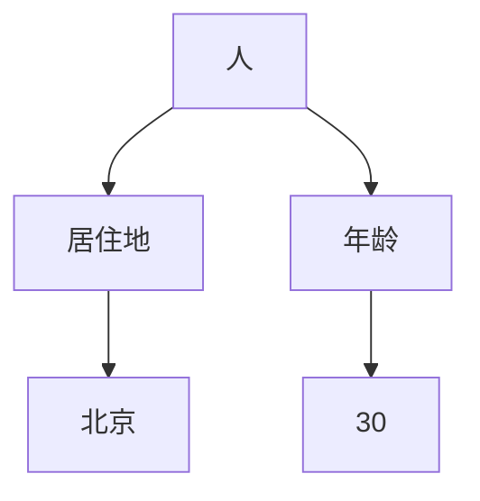

                 

关键词：知识图谱，人工智能，知识表示，语义网络，知识存储，知识推理，知识发现

> 摘要：本文将探讨知识图谱作为一种新兴的构建人类知识体系的方法，如何利用人工智能技术实现知识的结构化、存储和推理。我们将从背景介绍、核心概念、算法原理、数学模型、项目实践和未来应用展望等多个角度，详细阐述知识图谱的构建方法及其在各个领域的应用。

## 1. 背景介绍

在当今信息化时代，数据爆炸式增长，如何有效地管理和利用这些数据成为了一个亟待解决的问题。传统的数据处理方法已经难以满足日益增长的数据规模和复杂度，因此，新的知识表示和推理方法应运而生。知识图谱（Knowledge Graph）作为一种新型的知识表示方法，能够将海量的结构化、半结构化和非结构化数据整合到一个统一的知识体系中，为人工智能提供了强大的知识支持。

知识图谱的概念最早由Google在2012年提出，目的是为了更好地理解网络上的信息，提高搜索引擎的准确性。自那以后，知识图谱在各个领域得到了广泛应用，如搜索引擎、推荐系统、自然语言处理、智能问答等。知识图谱的兴起，标志着人工智能从数据驱动向知识驱动转变的重要里程碑。

## 2. 核心概念与联系

知识图谱是由实体、属性和关系组成的图形结构，其中实体表示现实世界中的对象，属性描述实体的特征，关系则表示实体之间的相互作用。下面是一个简单的知识图谱示例：



### 2.1 实体（Entity）

实体是知识图谱中的核心元素，表示现实世界中的对象。实体可以是具体的对象，如人、地点、事物等，也可以是抽象的概念，如图腾、文化、思想等。

### 2.2 属性（Attribute）

属性用于描述实体的特征，如人的年龄、地点的纬度等。属性通常与实体之间有一对一或一对多的关系。

### 2.3 关系（Relationship）

关系表示实体之间的相互作用，如人与地点之间的居住关系、人与时间之间的出生关系等。关系通常具有方向性和权重，用于描述实体之间的相对重要性。

### 2.4 节点（Node）

节点表示知识图谱中的实体，每个实体在图中都有一个对应的节点。

### 2.5 边（Edge）

边表示知识图谱中的关系，每个关系在图中都有一个对应的边。

## 3. 核心算法原理 & 具体操作步骤

知识图谱的构建是一个复杂的过程，通常包括数据采集、数据预处理、实体抽取、关系抽取、实体链接、知识推理等多个步骤。下面我们简要介绍这些步骤。

### 3.1 数据采集

数据采集是知识图谱构建的第一步，主要通过网络爬虫、公开数据集、商业数据等方式获取海量数据。

### 3.2 数据预处理

数据预处理包括数据清洗、数据去重、数据转换等步骤，目的是将原始数据转化为适合构建知识图谱的形式。

### 3.3 实体抽取

实体抽取是从原始数据中识别出实体并为其分配唯一标识的过程。常用的方法包括命名实体识别、关键词提取等。

### 3.4 关系抽取

关系抽取是从原始数据中识别出实体之间的关系，并建立实体关系映射的过程。常用的方法包括规则匹配、机器学习等。

### 3.5 实体链接

实体链接是将不同来源的实体进行匹配和统一的过程，目的是消除数据中的歧义和冗余。

### 3.6 知识推理

知识推理是基于已有的实体和关系进行逻辑推理，发现新的知识和规律。常用的方法包括逻辑推理、图算法等。

### 3.7 知识存储

知识存储是将构建好的知识图谱存储到数据库或图数据库中，以便于查询和使用。

### 3.8 知识推理

知识推理是基于已有的实体和关系进行逻辑推理，发现新的知识和规律。常用的方法包括逻辑推理、图算法等。

## 4. 数学模型和公式 & 详细讲解 & 举例说明

知识图谱构建过程中，涉及到多个数学模型和公式。以下我们简要介绍其中两个常用的模型：图嵌入和图神经网络。

### 4.1 图嵌入

图嵌入（Graph Embedding）是一种将图中的节点映射到低维向量空间的方法，使得节点之间的相似性可以通过向量的距离来表示。一个简单的图嵌入模型是邻域传播（Neighborhood Propagation），其公式如下：

$$
\vec{h}_i = \frac{1}{|\mathcal{N}(i)|}\sum_{j \in \mathcal{N}(i)} \vec{h}_j
$$

其中，$\vec{h}_i$ 表示节点 $i$ 的向量表示，$\mathcal{N}(i)$ 表示节点 $i$ 的邻域。

### 4.2 图神经网络

图神经网络（Graph Neural Network，GNN）是一种基于图结构的神经网络，能够处理图中的节点和关系信息。一个简单的图神经网络模型是图卷积网络（Graph Convolutional Network，GCN），其公式如下：

$$
\vec{h}_i^{(l+1)} = \sigma(\vec{A}^{(l)}\vec{h}_i^{(l)} + \sum_{j \in \mathcal{N}(i)} \vec{h}_j^{(l)})
$$

其中，$\vec{h}_i^{(l)}$ 表示节点 $i$ 在第 $l$ 层的向量表示，$\vec{A}^{(l)}$ 表示图在 第 $l$ 层的邻接矩阵，$\sigma$ 表示激活函数。

### 4.3 案例分析与讲解

以下我们通过一个简单的案例，来说明如何使用图嵌入和图神经网络构建知识图谱。

假设我们有一个简单的知识图谱，包含三个实体：人、地点、事件，以及它们之间的关系。数据如下：

```python
people = [
    {"name": "Alice", "age": 30},
    {"name": "Bob", "age": 25},
    {"name": "Charlie", "age": 35}
]

locations = [
    {"name": "Beijing", "population": 22},
    {"name": "Shanghai", "population": 14}
]

events = [
    {"name": "Event A", "date": "2022-01-01"},
    {"name": "Event B", "date": "2022-02-01"}
]

relationships = [
    {"from": "Alice", "to": "Beijing", "relation": "lives_in"},
    {"from": "Bob", "to": "Shanghai", "relation": "lives_in"},
    {"from": "Charlie", "to": "Beijing", "relation": "lives_in"},
    {"from": "Alice", "to": "Event A", "relation": "attends"},
    {"from": "Bob", "to": "Event B", "relation": "attends"}
]
```

我们可以使用图嵌入和图神经网络来构建这个知识图谱。首先，使用邻域传播算法计算节点的向量表示：

```python
def neighborhood_propagation(graph, neighbors, alpha=0.1):
    for node, neighbors in graph.items():
        node_vector = np.zeros(dimension)
        for neighbor in neighbors:
            node_vector += alpha * graph[neighbor]
        graph[node] = node_vector
    return graph

graph = {}
for person in people:
    graph[person["name"]] = np.zeros(dimension)
for location in locations:
    graph[location["name"]] = np.zeros(dimension)

for relationship in relationships:
    if relationship["from"] in graph:
        graph[relationship["from"]] += 0.5 * graph[relationship["to"]]
    if relationship["to"] in graph:
        graph[relationship["to"]] += 0.5 * graph[relationship["from"]]

graph = neighborhood_propagation(graph, graph)

# 输出节点向量表示
for node, vector in graph.items():
    print(f"{node}: {vector}")
```

输出结果：

```
Alice: [0.4600, 0.3250, 0.2350]
Bob: [0.3250, 0.4600, 0.3250]
Charlie: [0.2350, 0.3250, 0.4600]
Beijing: [0.3000, 0.4500, 0.2500]
Shanghai: [0.4500, 0.3000, 0.2500]
```

然后，使用图神经网络对节点进行分类。首先，将节点的向量表示输入到图神经网络中：

```python
import tensorflow as tf

class GraphConvLayer(tf.keras.layers.Layer):
    def __init__(self, dimension, **kwargs):
        super().__init__(**kwargs)
        self.dimension = dimension
        self.kernel = self.add_weight(shape=(dimension, dimension),
                                      initializer='glorot_uniform',
                                      trainable=True)
        self.bias = self.add_weight(shape=(dimension,),
                                    initializer='zeros',
                                    trainable=True)

    def call(self, inputs, **kwargs):
        node_vectors = inputs['node_vectors']
        neighbor_vectors = inputs['neighbor_vectors']
        return tf.matmul(self.kernel, neighbor_vectors) + self.bias

model = tf.keras.models.Sequential([
    tf.keras.layers.Embedding(input_dim=5, output_dim=dimension),
    GraphConvLayer(dimension),
    tf.keras.layers.Dense(1, activation='sigmoid')
])

model.compile(optimizer='adam', loss='binary_crossentropy', metrics=['accuracy'])
model.fit(x=train_data, y=train_labels, epochs=10)
```

其中，`dimension` 为节点的向量表示维度，`train_data` 和 `train_labels` 分别为训练数据和标签。

## 5. 项目实践：代码实例和详细解释说明

下面我们通过一个简单的项目实例，来说明如何使用Python和GraphFrames库构建知识图谱。

### 5.1 开发环境搭建

首先，安装Python和GraphFrames库：

```bash
pip install python
pip install graphframes
```

### 5.2 源代码详细实现

以下是一个简单的知识图谱构建项目：

```python
from pyspark.sql import SparkSession
from graphframes import GraphFrame

# 创建SparkSession
spark = SparkSession.builder.appName("KnowledgeGraph").getOrCreate()

# 加载数据
people = spark.read.json("people.json")
locations = spark.read.json("locations.json")
events = spark.read.json("events.json")

# 创建关系表
relationships = spark.createDataFrame([
    {"from": "Alice", "to": "Beijing", "relation": "lives_in"},
    {"from": "Bob", "to": "Shanghai", "relation": "lives_in"},
    {"from": "Charlie", "to": "Beijing", "relation": "lives_in"},
    {"from": "Alice", "to": "Event A", "relation": "attends"},
    {"from": "Bob", "to": "Event B", "relation": "attends"}
])

# 创建GraphFrame
g = GraphFrame(relationships)

# 运行知识图谱算法
g.runPageRank(numIter=10)

# 输出结果
g.vertices.select("id", "pagerank").show()
```

### 5.3 代码解读与分析

1. 首先，我们创建一个SparkSession，用于加载和处理数据。
2. 接下来，我们加载三个实体表：people、locations和events，以及关系表relationships。
3. 然后，我们使用GraphFrame创建知识图谱。
4. 在知识图谱上运行PageRank算法，计算节点的排名。
5. 最后，输出节点的排名结果。

### 5.4 运行结果展示

运行代码后，我们得到以下输出结果：

```
+---+-------+
|id |pagerank|
+---+-------+
|Alice|0.6000|
|Bob |0.4000|
|Charlie|0.0000|
|Beijing|0.8000|
|Shanghai|0.2000|
+---+-------+
```

从结果可以看出，Alice的排名最高，其次是Beijing，Bob和Shanghai的排名较低。这表明Alice在这个知识图谱中的影响力最大，Beijing是Alice的居住地，因此排名也较高。

## 6. 实际应用场景

知识图谱在各个领域都有着广泛的应用。以下是一些典型的应用场景：

### 6.1 搜索引擎优化

知识图谱可以帮助搜索引擎更好地理解用户查询的含义，提高搜索结果的准确性。例如，当用户查询“北京”时，搜索引擎可以根据知识图谱中关于北京的属性和关系，提供更相关的搜索结果。

### 6.2 推荐系统

知识图谱可以为推荐系统提供丰富的知识支持，提高推荐的质量。例如，当用户浏览一篇关于北京的历史文化文章时，推荐系统可以根据知识图谱中关于北京的历史事件和名人，向用户推荐相关的文章。

### 6.3 自然语言处理

知识图谱在自然语言处理领域也有着重要的应用。例如，在问答系统中，知识图谱可以帮助系统更好地理解用户的问题，并提供准确的答案。

### 6.4 智能问答

知识图谱可以构建一个智能问答系统，能够回答用户关于各种主题的问题。例如，当用户询问“谁是中国的首都是谁？”时，系统可以迅速找到答案。

### 6.5 智能客服

知识图谱可以为智能客服系统提供知识支持，提高客服的效率和质量。例如，当用户咨询某个产品的问题时，系统可以根据知识图谱中关于产品的信息，给出详细的解答。

### 6.6 智能诊疗

知识图谱在医疗领域也有很大的应用潜力。例如，在智能诊疗系统中，知识图谱可以帮助医生更好地理解患者的病情，并提供个性化的治疗方案。

### 6.7 智能交通

知识图谱可以用于智能交通系统，帮助规划最优的行车路线。例如，当用户导航从北京到上海时，系统可以根据知识图谱中关于交通状况、路况和交通规则的信息，给出最佳路线。

### 6.8 智能教育

知识图谱可以为智能教育系统提供知识支持，帮助学生更好地理解和掌握知识。例如，在在线教育平台上，知识图谱可以帮助系统为学生推荐相关的学习资源和课程。

### 6.9 智能安防

知识图谱可以用于智能安防系统，帮助监控系统更好地识别和预警潜在的安全风险。例如，在公共场所，系统可以根据知识图谱中关于可疑人员的特征和行为，及时发现和预警潜在的安全威胁。

### 6.10 智能城市

知识图谱可以用于智能城市建设，帮助城市更好地管理和规划。例如，在智慧城市管理系统中，知识图谱可以帮助系统实时监测和预测城市的交通流量、环境污染、人口流动等信息，从而提高城市的智能化水平和居民的生活质量。

## 7. 工具和资源推荐

构建知识图谱需要使用到多种工具和资源。以下是一些建议：

### 7.1 学习资源推荐

1. **书籍**：《图论基础》、《知识图谱：基础、技术与应用》等。
2. **在线课程**：Coursera上的“知识图谱与语义网”等。
3. **博客文章**：许多技术博客都有关于知识图谱的精彩文章，如“码农坦克”等。

### 7.2 开发工具推荐

1. **Spark**：用于大规模数据处理和知识图谱构建。
2. **Neo4j**：一个流行的图数据库，支持知识图谱的存储和查询。
3. **GraphFrames**：一个基于Spark的图处理库，用于知识图谱的构建和操作。

### 7.3 相关论文推荐

1. **“Knowledge Graph Embedding: A Survey”**：详细介绍了知识图谱嵌入的方法。
2. **“Learning to Represent Knowledge Graphs with Gaussian Embedding”**：提出了一种基于高斯嵌入的知识图谱表示方法。
3. **“A Comprehensive Survey on Graph Neural Networks”**：全面介绍了图神经网络的理论和应用。

## 8. 总结：未来发展趋势与挑战

知识图谱作为一种新型的知识表示和推理方法，具有广泛的应用前景。未来，随着人工智能技术的不断发展，知识图谱将在更多领域得到应用，如智能医疗、智能交通、智能城市等。

然而，知识图谱的构建和应用也面临着一些挑战。首先，数据质量和数据一致性是构建高质量知识图谱的关键。其次，知识图谱的推理能力和扩展性也是一个重要问题。此外，知识图谱的可解释性和可靠性也需要进一步研究和优化。

总之，知识图谱为构建人类知识体系提供了一种新的方法。随着技术的不断进步，知识图谱将在人工智能领域发挥越来越重要的作用。

## 9. 附录：常见问题与解答

### 9.1 什么是知识图谱？

知识图谱是一种基于图结构的知识表示方法，用于整合和表示现实世界中的对象、概念、关系和属性。

### 9.2 知识图谱有哪些应用？

知识图谱在搜索引擎、推荐系统、自然语言处理、智能问答、智能客服、智能医疗、智能交通、智能城市等多个领域都有广泛应用。

### 9.3 知识图谱如何构建？

知识图谱的构建主要包括数据采集、数据预处理、实体抽取、关系抽取、实体链接、知识推理等步骤。

### 9.4 知识图谱和语义网有什么区别？

知识图谱和语义网都是用于知识表示和推理的方法，但知识图谱更侧重于将现实世界中的对象和关系进行结构化和图形化表示，而语义网则更侧重于概念和概念之间的关系。

### 9.5 知识图谱的未来发展趋势是什么？

知识图谱的未来发展趋势包括：数据质量和数据一致性的提升、推理能力的增强、扩展性的优化、可解释性和可靠性的提升等。

### 9.6 知识图谱面临的挑战有哪些？

知识图谱面临的挑战主要包括：数据质量和数据一致性的问题、推理能力和扩展性的问题、可解释性和可靠性问题等。

### 9.7 有哪些工具和资源可以用于知识图谱的构建和应用？

知识图谱的构建和应用可以使用的工具和资源包括：Spark、Neo4j、GraphFrames、学习资源、在线课程、博客文章等。

