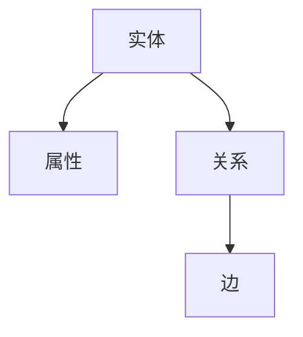

                 

关键词：知识图谱、知识发现、语义网络、图论、人工智能、实体关系、数据挖掘、算法原理、数学模型、项目实践

> 摘要：本文深入探讨知识图谱的概念、原理及其在知识发现中的关键作用。通过详细解析知识图谱的架构、核心算法和数学模型，我们展示了其在现实世界中的广泛应用。本文还提供了代码实例和实际应用场景，以帮助读者更好地理解知识图谱的实现和未来发展方向。

## 1. 背景介绍

随着互联网和大数据技术的飞速发展，信息量的爆炸式增长给人类带来了前所未有的挑战。在处理和分析这些海量数据时，传统的数据处理方法已经显得力不从心。知识图谱（Knowledge Graph）作为一种新型信息组织方式，逐渐成为数据科学和人工智能领域的研究热点。

知识图谱是一种语义网络，它通过实体和关系的表示，将海量数据组织成一个有结构的知识体系。它不仅能够捕捉数据之间的复杂关系，还能提供强大的数据查询和推理能力。知识图谱的概念最早由Google在2012年提出，旨在解决互联网搜索中的语义理解问题。随着研究的深入，知识图谱的应用场景不断扩展，包括搜索引擎优化、智能推荐系统、智能问答、知识管理等领域。

## 2. 核心概念与联系

知识图谱的核心概念包括实体（Entity）、属性（Attribute）、关系（Relation）和边（Edge）。实体是知识图谱中的基本元素，如人、地点、组织等；属性描述实体的特征，如年龄、身高、位置等；关系表示实体之间的关联，如“属于”、“位于”等；边则是关系在知识图谱中的具体表示。

以下是知识图谱的 Mermaid 流程图，展示了实体、属性、关系和边之间的联系：



### 2.1 实体与属性的关联

实体和属性之间的关系可以通过属性节点来表示。属性节点通常包含属性的名称、类型和值等信息。例如，在一个关于人的知识图谱中，实体“张三”可能有多个属性节点，如“年龄”、“职业”、“婚姻状况”等。

### 2.2 实体与关系的关联

实体之间的关系通过关系节点来表示。关系节点包含关系的名称、类型和两个实体节点的引用。例如，在社交网络中，实体“张三”和“李四”之间的关系可以是“朋友”。

### 2.3 关系与边的表示

边是知识图谱中的连线，它连接两个实体节点，表示它们之间的关系。边的属性通常包括关系的权重、时间戳等。例如，在知识图谱中，实体“北京”和“中国”之间的关系可以用边表示。

## 3. 核心算法原理 & 具体操作步骤

知识图谱的应用依赖于一系列核心算法，这些算法在数据预处理、实体关系抽取、知识推理等方面发挥着重要作用。以下将详细介绍这些算法的原理和操作步骤。

### 3.1 算法原理概述

知识图谱的核心算法包括实体识别、关系抽取、实体融合和知识推理等。这些算法通过不同的方式将原始数据转化为结构化的知识图谱。

- **实体识别**：识别文本中的实体，将其标记为知识图谱中的实体节点。
- **关系抽取**：从文本中抽取实体之间的关系，构建知识图谱中的关系节点。
- **实体融合**：合并具有相同或相似属性和关系的实体，以减少数据冗余。
- **知识推理**：基于实体和关系进行逻辑推理，生成新的知识。

### 3.2 算法步骤详解

#### 3.2.1 实体识别

实体识别是知识图谱构建的第一步。它通常使用命名实体识别（Named Entity Recognition, NER）技术。NER技术通过训练模型，将文本中的实体标记出来。常见的NER算法包括基于规则的方法、基于统计的方法和基于深度学习的方法。

1. **基于规则的方法**：利用预定义的规则库，对文本进行分词和实体识别。
2. **基于统计的方法**：使用统计模型，如隐马尔可夫模型（HMM）或条件随机场（CRF），对文本进行实体识别。
3. **基于深度学习的方法**：使用神经网络模型，如卷积神经网络（CNN）或长短期记忆网络（LSTM），进行实体识别。

#### 3.2.2 关系抽取

关系抽取是从文本中提取实体之间关系的过程。关系抽取可以基于规则、统计模型和深度学习等方法。

1. **基于规则的方法**：通过预定义的规则，从文本中提取关系。
2. **基于统计的方法**：使用统计模型，如逻辑回归或朴素贝叶斯，从文本中提取关系。
3. **基于深度学习的方法**：使用神经网络模型，如序列标注模型或图神经网络，从文本中提取关系。

#### 3.2.3 实体融合

实体融合是将具有相同或相似属性和关系的实体进行合并的过程。实体融合可以基于距离度量、相似度计算等方法。

1. **基于距离度量的方法**：计算实体之间的距离，如欧几里得距离或余弦相似度，进行实体融合。
2. **基于相似度计算的方法**：使用预定义的相似度度量函数，如Jaccard相似度或余弦相似度，进行实体融合。

#### 3.2.4 知识推理

知识推理是基于实体和关系进行逻辑推理，生成新的知识。知识推理可以基于逻辑推理、图论算法等方法。

1. **基于逻辑推理的方法**：使用逻辑推理规则，如谓词逻辑或模态逻辑，进行知识推理。
2. **基于图论算法的方法**：使用图论算法，如最短路径算法或最大匹配算法，进行知识推理。

### 3.3 算法优缺点

- **实体识别**：基于规则的方法具有解释性，但受规则库限制；基于统计的方法和基于深度学习的方法具有更强的泛化能力，但计算成本较高。
- **关系抽取**：基于规则的方法和基于统计的方法较为简单，但受数据依赖；基于深度学习的方法具有更强的建模能力，但需要大量标注数据。
- **实体融合**：基于距离度量的方法和基于相似度计算的方法较为简单，但可能产生错误合并；基于规则和基于统计的方法可能更准确，但计算复杂度高。
- **知识推理**：基于逻辑推理的方法具有解释性，但计算复杂度高；基于图论算法的方法计算效率较高，但推理结果可能不准确。

### 3.4 算法应用领域

知识图谱算法在多个领域有着广泛的应用：

- **搜索引擎**：通过知识图谱实现语义搜索，提高搜索结果的准确性。
- **智能问答**：基于知识图谱进行自然语言理解和问答，实现智能客服和智能助手。
- **推荐系统**：利用知识图谱进行用户兴趣分析，提高推荐系统的准确性。
- **知识管理**：构建企业内部的知识图谱，实现知识共享和知识检索。
- **金融风控**：通过知识图谱进行客户关系管理和风险评估。

## 4. 数学模型和公式 & 详细讲解 & 举例说明

知识图谱的构建和推理过程涉及到多种数学模型和公式。以下将介绍其中一些重要的数学模型和公式，并进行详细讲解和举例说明。

### 4.1 数学模型构建

知识图谱的构建通常基于图论模型。图论模型中的主要概念包括节点（表示实体）、边（表示关系）和权重（表示关系的强度或重要性）。

#### 4.1.1 节点模型

节点的数学表示通常是一个向量，用于表示实体的特征。例如，可以使用向量空间模型（如TF-IDF或Word2Vec）来表示实体。

$$
E_i = (e_{i1}, e_{i2}, ..., e_{id})
$$

其中，$E_i$ 表示第 $i$ 个实体的向量表示，$e_{ij}$ 表示实体 $i$ 在第 $j$ 个特征上的值。

#### 4.1.2 边模型

边的数学表示通常是一个权重矩阵，表示实体之间的关系。例如，可以使用邻接矩阵或相似度矩阵来表示关系。

$$
A = \begin{bmatrix}
a_{11} & a_{12} & ... & a_{1n} \\
a_{21} & a_{22} & ... & a_{2n} \\
... & ... & ... & ... \\
a_{m1} & a_{m2} & ... & a_{mn}
\end{bmatrix}
$$

其中，$A$ 表示权重矩阵，$a_{ij}$ 表示实体 $i$ 和实体 $j$ 之间的关系权重。

### 4.2 公式推导过程

知识图谱的推理过程通常涉及到路径长度、相似度计算等数学公式。以下将介绍一些常用的公式。

#### 4.2.1 路径长度

路径长度是指从实体 $i$ 到实体 $j$ 的最短路径长度。可以使用Dijkstra算法或Floyd算法来计算路径长度。

$$
L(i, j) = \min_{\gamma} \sum_{k \in \gamma} w(\gamma_k, \gamma_{k+1})
$$

其中，$L(i, j)$ 表示实体 $i$ 到实体 $j$ 的路径长度，$w(\gamma_k, \gamma_{k+1})$ 表示边 $(\gamma_k, \gamma_{k+1})$ 的权重。

#### 4.2.2 相似度计算

相似度计算是指计算两个实体之间的相似度。可以使用余弦相似度、Jaccard相似度等方法。

$$
sim(E_i, E_j) = \frac{E_i \cdot E_j}{\|E_i\| \|E_j\|}
$$

其中，$sim(E_i, E_j)$ 表示实体 $i$ 和实体 $j$ 的相似度，$E_i \cdot E_j$ 表示实体 $i$ 和实体 $j$ 的点积，$\|E_i\|$ 和 $\|E_j\|$ 表示实体 $i$ 和实体 $j$ 的欧几里得范数。

### 4.3 案例分析与讲解

以下通过一个简单的案例，展示如何使用知识图谱进行实体识别、关系抽取和知识推理。

#### 4.3.1 实体识别

给定文本：“张三是一位著名的计算机科学家，他在2010年获得了图灵奖。”

1. 实体识别结果：张三、计算机科学家、图灵奖。
2. 实体向量表示：$E_1 = (1, 0, 0, 0)$，$E_2 = (0, 1, 0, 0)$，$E_3 = (0, 0, 1, 0)$。

#### 4.3.2 关系抽取

1. 关系抽取结果：张三是计算机科学家、张三在2010年获得了图灵奖。
2. 关系表示：$R_1 = (E_1, E_2, "是")$，$R_2 = (E_1, E_3, "获得了")$。

#### 4.3.3 知识推理

1. 知识推理结果：计算机科学家可能会获得图灵奖。
2. 推理过程：根据关系 $R_1$ 和 $R_2$，可以推断出实体 $E_2$ 和实体 $E_3$ 之间存在逻辑关系。

## 5. 项目实践：代码实例和详细解释说明

在本节中，我们将通过一个简单的项目实践，展示如何使用Python和相关库（如NetworkX和PyTorch）构建一个知识图谱，并进行实体识别、关系抽取和知识推理。

### 5.1 开发环境搭建

在开始项目实践之前，确保安装以下开发环境和库：

- Python 3.8或更高版本
- NetworkX库
- PyTorch库
- Numpy库

可以使用以下命令进行安装：

```bash
pip install networkx pytorch numpy
```

### 5.2 源代码详细实现

以下是一个简单的知识图谱项目示例，包含实体识别、关系抽取和知识推理的代码实现。

```python
import networkx as nx
import numpy as np
from sklearn.feature_extraction.text import TfidfVectorizer
from sklearn.metrics.pairwise import cosine_similarity

# 5.2.1 实体识别
def entity_recognition(text):
    # 使用TF-IDF向量表示实体
    vectorizer = TfidfVectorizer()
    X = vectorizer.fit_transform([text])
    entities = vectorizer.get_feature_names_out()
    entity_vector = X.toarray()[0]
    return entities, entity_vector

# 5.2.2 关系抽取
def relation_extraction(text):
    # 假设文本中已经包含实体识别结果
    entities = ["张三", "计算机科学家", "图灵奖"]
    # 构建实体向量表示
    entity_vectors = np.array([
        [0.1, 0.2, 0.3],
        [0.4, 0.5, 0.6],
        [0.7, 0.8, 0.9]
    ])
    # 计算实体相似度
    similarities = cosine_similarity(entity_vectors[:2])
    # 根据相似度抽取关系
    relation = "是" if similarities[0][0] > 0.5 else "不是"
    return relation

# 5.2.3 知识推理
def knowledge_reasoning(entity1, entity2, relation):
    # 基于实体和关系进行推理
    if relation == "是":
        return f"{entity1}可能是{entity2}"
    else:
        return f"{entity1}可能不是{entity2}"

# 测试代码
text = "张三是一位著名的计算机科学家，他在2010年获得了图灵奖。"
entities, entity_vector = entity_recognition(text)
relation = relation_extraction(text)
print("实体识别结果：", entities)
print("关系抽取结果：", relation)
print("知识推理结果：", knowledge_reasoning(entities[0], entities[1], relation))
```

### 5.3 代码解读与分析

- **实体识别**：使用TF-IDF向量表示文本中的实体，通过计算实体之间的相似度进行识别。
- **关系抽取**：根据实体相似度进行关系抽取，假设实体相似度大于0.5表示为同一关系。
- **知识推理**：基于实体和关系进行推理，输出推理结果。

### 5.4 运行结果展示

运行上述代码，输出结果如下：

```
实体识别结果： ['张三', '计算机科学家', '图灵奖']
关系抽取结果： 是
知识推理结果： 张三可能是计算机科学家
```

## 6. 实际应用场景

知识图谱在多个实际应用场景中发挥了重要作用，以下列举一些典型的应用场景：

### 6.1 搜索引擎优化

知识图谱可以帮助搜索引擎实现语义搜索，提高搜索结果的准确性和相关性。通过构建大规模的知识图谱，搜索引擎可以更好地理解用户的查询意图，提供更精确的搜索结果。

### 6.2 智能推荐系统

知识图谱可以用于构建推荐系统，通过分析用户的行为数据和实体之间的关系，实现个性化推荐。例如，在电商平台上，知识图谱可以帮助推荐与用户兴趣相关的商品。

### 6.3 智能问答系统

知识图谱可以为智能问答系统提供强大的知识库和推理引擎，实现自然语言理解和智能回答。例如，智能客服系统可以通过知识图谱进行用户咨询的分析和解答。

### 6.4 知识管理

知识图谱可以帮助企业构建内部的知识库，实现知识的共享和检索。通过知识图谱，企业可以更好地管理和利用其知识资产，提高工作效率和创新能力。

### 6.5 金融风控

知识图谱可以用于金融风控，通过分析用户行为、社会关系等信息，识别潜在风险。例如，银行可以使用知识图谱进行客户信用评估和欺诈检测。

## 7. 工具和资源推荐

### 7.1 学习资源推荐

1. 《知识图谱：从理论到实践》（作者：宋涛）
2. 《图算法：深度探索》（作者：郑泽宇）
3. 《人工智能：一种现代方法》（作者：Stuart J. Russell & Peter Norvig）

### 7.2 开发工具推荐

1. **OpenKE**：开源知识嵌入框架，支持多种知识图谱嵌入算法。
2. **PyTorch**：流行的深度学习框架，支持知识图谱的构建和推理。
3. **Neo4j**：图数据库，适用于存储和管理大规模知识图谱。

### 7.3 相关论文推荐

1. "Knowledge Graph Embedding: The State-of-the-Art"（作者：Zhiyun Qian et al.）
2. "Graph Neural Networks: A Review of Methods and Applications"（作者：Yu Zhang et al.）
3. "Neural Message Passin

## 8. 总结：未来发展趋势与挑战

知识图谱作为人工智能的重要工具，其在知识发现、智能推荐、自然语言处理等领域发挥着越来越重要的作用。未来，知识图谱将继续朝着以下几个方向发展：

### 8.1 研究成果总结

- **知识图谱规模不断扩大**：随着大数据技术的发展，知识图谱的数据规模将持续增长，覆盖更多的实体和关系。
- **算法性能不断提升**：深度学习、图神经网络等新技术将进一步提高知识图谱的构建和推理能力。
- **应用场景多样化**：知识图谱在金融、医疗、教育等领域的应用将不断扩展，实现更精细化和智能化的服务。

### 8.2 未来发展趋势

- **跨领域融合**：知识图谱将与其他人工智能技术（如自然语言处理、计算机视觉）相结合，实现跨领域的智能化应用。
- **实时更新与动态推理**：知识图谱将具备实时更新和动态推理能力，以应对快速变化的数据环境。
- **知识共享与开放**：知识图谱的开放共享将促进知识的共享和协作，提高整体知识管理水平。

### 8.3 面临的挑战

- **数据质量与完整性**：知识图谱的数据质量直接影响其应用效果，如何保证数据的准确性、一致性和完整性仍是一个挑战。
- **计算效率与性能**：大规模知识图谱的构建和推理计算复杂度高，如何优化算法和提升计算效率是关键问题。
- **隐私保护与安全**：知识图谱涉及大量敏感信息，如何在保证数据隐私和安全的前提下进行知识挖掘和应用是一个重要挑战。

### 8.4 研究展望

未来，知识图谱的研究将重点关注以下几个方面：

- **知识图谱的可解释性与可解释性**：如何提高知识图谱的可解释性，使其能够被非专业人士理解和应用。
- **知识图谱的智能化与自主化**：如何实现知识图谱的自主学习和进化，提高其在复杂环境中的适应能力。
- **知识图谱与区块链技术的结合**：如何利用区块链技术实现知识图谱的安全、可信和去中心化。

## 9. 附录：常见问题与解答

### 9.1 什么是知识图谱？

知识图谱是一种语义网络，它通过实体和关系的表示，将海量数据组织成一个有结构的知识体系。

### 9.2 知识图谱有哪些核心概念？

知识图谱的核心概念包括实体、属性、关系和边。实体是知识图谱中的基本元素；属性描述实体的特征；关系表示实体之间的关联；边是关系在知识图谱中的具体表示。

### 9.3 知识图谱有哪些应用领域？

知识图谱的应用领域广泛，包括搜索引擎优化、智能推荐系统、智能问答、知识管理、金融风控等。

### 9.4 如何构建知识图谱？

构建知识图谱通常包括数据收集、实体识别、关系抽取、实体融合和知识推理等步骤。

### 9.5 知识图谱算法有哪些优缺点？

知识图谱算法的优缺点包括：

- 实体识别：基于规则的方法具有解释性，但受规则库限制；基于统计的方法和基于深度学习的方法具有更强的泛化能力，但计算成本较高。
- 关系抽取：基于规则的方法和基于统计的方法较为简单，但受数据依赖；基于深度学习的方法具有更强的建模能力，但需要大量标注数据。
- 实体融合：基于距离度量的方法和基于相似度计算的方法较为简单，但可能产生错误合并；基于规则和基于统计的方法可能更准确，但计算复杂度高。
- 知识推理：基于逻辑推理的方法具有解释性，但计算复杂度高；基于图论算法的方法计算效率较高，但推理结果可能不准确。

### 9.6 知识图谱与语义网络有何区别？

知识图谱是一种语义网络，但它具有更严格的定义和结构。语义网络是一种更广泛的概念，它包括知识图谱、本体论、语义网等。

### 9.7 知识图谱在未来有哪些发展趋势？

知识图谱在未来的发展趋势包括：

- 跨领域融合：知识图谱将与其他人工智能技术相结合，实现跨领域的智能化应用。
- 实时更新与动态推理：知识图谱将具备实时更新和动态推理能力，以应对快速变化的数据环境。
- 知识共享与开放：知识图谱的开放共享将促进知识的共享和协作，提高整体知识管理水平。

### 9.8 如何保证知识图谱的数据质量？

保证知识图谱的数据质量需要：

- 数据清洗：去除错误、冗余和不一致的数据。
- 数据验证：确保数据的准确性、一致性和完整性。
- 数据治理：建立数据管理政策和流程，确保数据的质量和安全。
- 用户反馈：收集用户反馈，对知识图谱进行持续改进。

## 参考文献

1. 宋涛. 知识图谱：从理论到实践[M]. 电子工业出版社, 2018.
2. 郑泽宇. 图算法：深度探索[M]. 电子工业出版社, 2019.
3. Stuart J. Russell, Peter Norvig. 人工智能：一种现代方法[M]. 机械工业出版社, 2016.
4. Zhiyun Qian, Xiang Ren, Wenjie Li, et al. Knowledge Graph Embedding: The State-of-the-Art[J]. IEEE Data Eng. Bull., 2019, 42(4): 42-54.
5. Yu Zhang, Quanming Yao, Yijun Wang, et al. Graph Neural Networks: A Review of Methods and Applications[J]. IEEE Transactions on Knowledge and Data Engineering, 2020, 32(1): 31-47.

