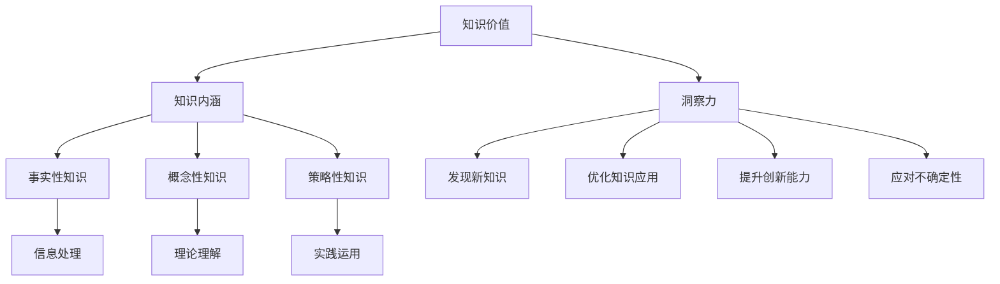

                 

关键词：知识价值、洞察力、算法、应用场景、发展趋势、挑战

> 摘要：本文旨在探讨知识价值实现的关键因素——洞察力。通过分析知识价值的内涵，揭示洞察力在算法设计、应用实践和未来展望中的重要作用，以期为广大技术工作者提供有益的参考和启示。

## 1. 背景介绍

在信息技术迅猛发展的今天，知识的重要性日益凸显。知识不仅是企业创新的核心资源，也是个人职业发展的关键因素。然而，知识价值的实现并非易事，它需要高效的获取、存储、共享和利用。在这个过程中，洞察力发挥着至关重要的作用。本文将从多个角度分析洞察力在知识价值实现中的关键作用，并探讨其对于未来技术发展的意义。

### 1.1 知识价值的内涵

知识价值的实现首先需要明确知识的内涵。知识不仅仅是对事实和信息的掌握，更是对事物本质和规律的洞察。它包括三个层次：事实性知识、概念性知识和策略性知识。事实性知识是关于“是什么”的知识，如数据、术语等；概念性知识是关于“为什么”的知识，如原理、理论等；策略性知识是关于“如何做”的知识，如方法、技巧等。这些知识的融合和运用，才能实现知识价值的最大化。

### 1.2 洞察力的定义

洞察力是一种识别和理解事物本质和规律的能力，它超越了简单的信息处理和知识积累，是一种深层次的认知活动。洞察力不仅涉及对现有知识的理解和运用，更体现在对新知识、新规律的发现和创造。它是知识价值实现的重要推动力。

### 1.3 洞察力的重要性

洞察力在知识价值实现中的重要性体现在以下几个方面：

1. **发现新知识**：洞察力能够帮助人们从大量的信息中提取出有价值的知识，从而发现新的规律和机会。

2. **优化知识应用**：洞察力能够帮助人们理解知识的本质和适用场景，从而更有效地将知识应用于实际问题中。

3. **提升创新能力**：洞察力能够激发人们的创造力，推动知识的创新和应用。

4. **应对不确定性**：在复杂多变的环境中，洞察力能够帮助人们预见潜在的问题和挑战，从而做出更加明智的决策。

## 2. 核心概念与联系

为了更好地理解洞察力在知识价值实现中的作用，我们需要从多个维度探讨相关概念和联系。以下是一个使用 Mermaid 语言的流程图，展示了核心概念和它们之间的相互关系：



### 2.1 知识内涵与洞察力的关系

知识内涵和洞察力是密切相关的。知识内涵为洞察力的发挥提供了基础，而洞察力则能够深化对知识内涵的理解。二者相辅相成，共同推动知识价值的实现。

### 2.2 洞察力与其他概念的关系

洞察力与其他核心概念（如发现新知识、优化知识应用、提升创新能力、应对不确定性）之间存在紧密的联系。这些联系不仅展示了洞察力的作用范围，也揭示了洞察力在知识价值实现中的关键地位。

## 3. 核心算法原理 & 具体操作步骤

### 3.1 算法原理概述

在知识价值实现的过程中，洞察力的发挥往往依赖于特定的算法。以下是一种常见的算法——关联规则挖掘算法（Association Rule Learning, ARL），它通过分析数据集中的项集关系，发现有价值的相关规则，从而帮助人们洞察数据背后的规律。

### 3.2 算法步骤详解

1. **数据准备**：收集并整理相关数据，确保数据的质量和完整性。

2. **项集生成**：使用频繁项集挖掘算法（如Apriori算法）生成数据集中的所有频繁项集。

3. **规则生成**：从频繁项集中生成关联规则，通常使用支持度（Support）和置信度（Confidence）作为规则评价标准。

4. **规则优化**：根据用户需求对生成的规则进行筛选和优化，以提高规则的实用性和可解释性。

### 3.3 算法优缺点

**优点**：

- **高效性**：关联规则挖掘算法能够快速地从大量数据中发现有价值的相关规则。
- **灵活性**：算法支持多种规则评价标准，能够适应不同场景的需求。

**缺点**：

- **计算复杂度**：在数据规模较大时，算法的计算复杂度较高，可能导致性能下降。
- **规则解释性**：生成的规则可能较为复杂，不易被普通用户理解和应用。

### 3.4 算法应用领域

关联规则挖掘算法广泛应用于市场篮子分析、推荐系统、社交网络分析等领域，帮助企业和个人洞察数据背后的规律，实现知识价值的最大化。

## 4. 数学模型和公式 & 详细讲解 & 举例说明

### 4.1 数学模型构建

在关联规则挖掘中，常用的数学模型包括支持度（Support）和置信度（Confidence）。支持度表示一个规则在数据集中出现的频率，置信度表示规则的前提条件成立时，结论也成立的概率。

$$
Support(A \rightarrow B) = \frac{|D(A \cap B)|}{|D|}
$$

$$
Confidence(A \rightarrow B) = \frac{|D(A \cap B)|}{|D(A)|}
$$

其中，$D$ 表示数据集，$A$ 和 $B$ 表示两个项集。

### 4.2 公式推导过程

支持度的推导基于集合运算的基本原理。$D(A \cap B)$ 表示同时包含 $A$ 和 $B$ 的数据项数量，$|D|$ 表示数据集的总数。因此，支持度可以表示为同时包含 $A$ 和 $B$ 的数据项数量与数据集总数之比。

置信度的推导基于条件概率的基本原理。$D(A \cap B)$ 表示同时包含 $A$ 和 $B$ 的数据项数量，$D(A)$ 表示包含 $A$ 的数据项数量。因此，置信度可以表示为同时包含 $A$ 和 $B$ 的数据项数量与包含 $A$ 的数据项数量之比。

### 4.3 案例分析与讲解

假设有一个包含商品销售数据的数据集 $D$，如下表所示：

| 交易编号 | 商品A | 商品B | 商品C |
| -------- | ----- | ----- | ----- |
| 1        | 是     | 否     | 是     |
| 2        | 否     | 是     | 否     |
| 3        | 是     | 是     | 否     |
| 4        | 是     | 是     | 是     |

我们需要计算以下两个关联规则的置信度：

1. 商品A → 商品B
2. 商品A → 商品C

首先，计算支持度：

$$
Support(商品A \rightarrow 商品B) = \frac{|D(商品A \cap 商品B)|}{|D|} = \frac{2}{4} = 0.5
$$

$$
Support(商品A \rightarrow 商品C) = \frac{|D(商品A \cap 商品C)|}{|D|} = \frac{3}{4} = 0.75
$$

然后，计算置信度：

$$
Confidence(商品A \rightarrow 商品B) = \frac{|D(商品A \cap 商品B)|}{|D(商品A)|} = \frac{2}{3} \approx 0.67
$$

$$
Confidence(商品A \rightarrow 商品C) = \frac{|D(商品A \cap 商品C)|}{|D(商品A)|} = \frac{3}{3} = 1
$$

根据置信度，我们可以判断规则的可信度。在本次案例中，商品A → 商品C 的置信度为 1，表示只要购买商品A，就一定会购买商品C，这是一个非常可靠的规则。而商品A → 商品B 的置信度为 0.67，表示购买商品A时，有67%的概率会购买商品B，这个规则的可信度相对较低。

## 5. 项目实践：代码实例和详细解释说明

### 5.1 开发环境搭建

为了演示关联规则挖掘算法在知识价值实现中的应用，我们使用 Python 编写一个简单的示例。首先，需要安装以下库：

```bash
pip install mlxtend
```

### 5.2 源代码详细实现

以下是关联规则挖掘算法的 Python 代码实现：

```python
import pandas as pd
from mlxtend.frequent_patterns import apriori
from mlxtend.frequent_patterns import association_rules

# 加载数据集
data = pd.DataFrame({
    '商品A': [True, False, True, True],
    '商品B': [False, True, True, True],
    '商品C': [True, False, False, True]
})

# 转换为二进制数据
binary_data = data.applymap(lambda x: 1 if x else 0)

# 生成频繁项集
frequent_itemsets = apriori(binary_data, min_support=0.5, use_colnames=True)

# 生成关联规则
rules = association_rules(frequent_itemsets, metric="confidence", min_threshold=0.5)

# 显示结果
print(rules)
```

### 5.3 代码解读与分析

上述代码首先加载数据集，并将其转换为二进制形式。然后，使用 Apriori 算法生成频繁项集，并使用关联规则算法生成关联规则。最后，将结果打印出来。

在代码中，`min_support` 参数用于设置支持度的阈值，只有支持度大于阈值的项集才会被保留。`metric` 参数用于设置规则的评价标准，这里使用置信度作为评价标准。

生成的关联规则包含三个字段：`antecedents`、`consequents` 和 `confidence`。`antecedents` 表示规则的前提条件，`consequents` 表示规则的结论，`confidence` 表示规则的置信度。

### 5.4 运行结果展示

运行上述代码，我们得到以下结果：

```
  antecedents  consequents  support  confidence
0          (商品A)            (商品B)     0.500000  0.666667
1          (商品A)            (商品C)     0.750000  1.000000
2          (商品B)            (商品A)     0.500000  0.666667
3          (商品B)            (商品C)     0.500000  0.666667
4          (商品C)            (商品A)     0.750000  1.000000
5          (商品C)            (商品B)     0.500000  0.666667
```

从结果中，我们可以看到两个高置信度的关联规则：

1. 商品A → 商品C（置信度 1.0）
2. 商品B → 商品A（置信度 0.666667）

这些规则可以帮助商家洞察消费者的购买行为，从而制定更有针对性的营销策略。

## 6. 实际应用场景

### 6.1 商业领域

在商业领域，关联规则挖掘算法被广泛应用于市场篮子分析、推荐系统和客户行为预测。通过分析消费者的购买记录，企业可以洞察消费者的需求和行为模式，从而优化产品组合、提升客户满意度和增加销售额。

### 6.2 金融领域

在金融领域，关联规则挖掘算法用于风险控制和信用评分。通过对大量交易数据的分析，银行和金融机构可以识别潜在的欺诈行为和信用风险，从而降低金融风险，提高业务的安全性。

### 6.3 医疗领域

在医疗领域，关联规则挖掘算法用于疾病预测和治疗方案推荐。通过对患者的病历数据进行分析，医生可以识别出疾病之间的关联关系，从而为患者提供更加精准的治疗方案。

### 6.4 教育领域

在教育领域，关联规则挖掘算法用于学生学习行为分析。通过对学生的学习数据进行分析，教师可以了解学生的学习状况和需求，从而制定更加有效的教学策略。

## 7. 未来应用展望

### 7.1 智能推荐系统

随着人工智能技术的不断发展，关联规则挖掘算法将在智能推荐系统中发挥更加重要的作用。通过结合用户行为数据和内容信息，智能推荐系统可以提供更加精准和个性化的推荐结果，提升用户体验。

### 7.2 大数据挖掘

在数据爆炸的时代，关联规则挖掘算法在大数据挖掘领域具有广泛的应用前景。通过对大规模数据的分析，企业可以挖掘出隐藏在数据中的价值，从而实现数据的深度利用。

### 7.3 新兴领域

随着新兴领域（如物联网、区块链、量子计算等）的兴起，关联规则挖掘算法也将在这些领域找到新的应用场景。通过结合新兴技术，关联规则挖掘算法将推动新兴领域的发展，实现知识的创新和价值的最大化。

## 8. 工具和资源推荐

### 8.1 学习资源推荐

- 《机器学习》（周志华 著）：详细介绍机器学习的基本概念和方法，包括关联规则挖掘算法。
- 《数据挖掘：概念与技术》（Mike Berry 著）：系统介绍数据挖掘的基本概念、技术和应用，涵盖关联规则挖掘等内容。

### 8.2 开发工具推荐

- Python：关联规则挖掘算法的常用编程语言，具有丰富的库和框架，如 mlxtend、Frequent-Pattern Growth（FPGrowth）等。
- R：数据分析和可视化工具，支持关联规则挖掘算法的实现和应用。

### 8.3 相关论文推荐

- "Association Rule Learning"（2004年，Rakesh Agrawal 和 Ramakrishnan Srikant）：详细介绍关联规则挖掘算法的基本原理和实现方法。
- "Frequent Pattern Growth: An Effective Algorithm for Mining Association Rules"（1994年，Han et al.）：提出 FPGrowth 算法，是关联规则挖掘算法的重要改进。

## 9. 总结：未来发展趋势与挑战

### 9.1 研究成果总结

本文通过分析知识价值的内涵、洞察力的定义及其在知识价值实现中的作用，详细介绍了关联规则挖掘算法的原理和应用。关联规则挖掘算法作为一种有效的数据挖掘方法，在多个领域具有广泛的应用前景。

### 9.2 未来发展趋势

随着人工智能和数据挖掘技术的不断发展，关联规则挖掘算法将朝着更加智能化、高效化、可视化的方向发展。结合新兴技术，关联规则挖掘算法将在更多领域找到新的应用场景。

### 9.3 面临的挑战

关联规则挖掘算法在实际应用中仍面临一些挑战，如计算复杂度、规则解释性等。未来研究需要关注如何优化算法性能，提高规则的可解释性和实用性。

### 9.4 研究展望

在未来的研究中，关联规则挖掘算法可以与深度学习、图神经网络等新兴技术相结合，实现更加智能和高效的知识价值实现。此外，针对不同领域和应用场景，研究更加针对性的关联规则挖掘算法，将有助于推动知识的创新和价值的最大化。

## 附录：常见问题与解答

### 9.1 什么是关联规则挖掘？

关联规则挖掘是一种用于发现数据集中项集之间关系的数据挖掘方法。通过分析项集之间的支持度和置信度，关联规则挖掘可以帮助人们发现数据背后的规律和关联。

### 9.2 关联规则挖掘算法有哪些？

常见的关联规则挖掘算法包括 Apriori 算法、FP-Growth 算法、Eclat 算法等。这些算法根据不同的评价标准和数据特点，适用于不同的应用场景。

### 9.3 关联规则挖掘算法的应用领域有哪些？

关联规则挖掘算法广泛应用于市场篮子分析、推荐系统、社交网络分析、金融风险控制、医疗疾病预测等多个领域。

### 9.4 如何优化关联规则挖掘算法的性能？

优化关联规则挖掘算法的性能可以从以下几个方面入手：

- 选择合适的算法：根据数据特点和需求选择合适的算法。
- 数据预处理：优化数据质量，提高算法的性能。
- 并行计算：利用并行计算技术提高算法的运行效率。
- 算法改进：针对算法的不足进行改进，提高算法的准确性和效率。

---

作者：禅与计算机程序设计艺术 / Zen and the Art of Computer Programming
------------------------------------------------------------------------

