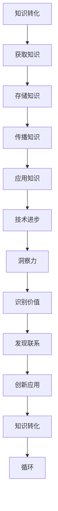

                 

关键词：知识转化、洞察力、价值创造、技术洞察、创新思维、方法论

> 摘要：本文旨在探讨知识转化过程中洞察力的重要作用，以及其对技术进步和产业创新的深远影响。通过深入剖析知识转化、洞察力与技术进步之间的关系，本文试图揭示洞察力在提升知识价值、驱动技术发展方面的关键作用。同时，文章还将探讨未来知识转化领域的发展趋势和面临的挑战，以期为相关领域的研究和实践提供有益的参考。

## 1. 背景介绍

在信息化和智能化的浪潮中，知识作为一种重要的资源，其价值的转化成为推动技术进步和产业创新的关键因素。然而，知识的转化并非简单的复制或传递，而是一个复杂的过程，涉及到知识的获取、存储、传播、应用等多个环节。在这个过程中，洞察力作为一种高级认知能力，对于知识的转化具有不可替代的作用。

洞察力是指个体在感知、理解和处理信息时，能够敏锐地捕捉到问题的本质，洞察潜在的机会和挑战，从而做出明智的判断和决策。它不仅要求个体具备丰富的知识储备和逻辑思维，还需要有敏锐的洞察力和创新思维。在知识转化的过程中，洞察力能够帮助个体识别知识的潜在价值，发现知识之间的联系，从而实现知识的创新和应用。

本文将围绕知识的价值转化这一主题，探讨洞察力在其中的重要作用。首先，我们将介绍知识转化和技术进步之间的关系，分析洞察力在这一过程中的贡献。接着，我们将通过具体案例和理论分析，阐述洞察力在知识转化中的具体作用。最后，本文将讨论未来知识转化领域的发展趋势和面临的挑战，并提出相应的建议。

## 2. 核心概念与联系

为了更好地理解知识转化和洞察力的重要性，我们需要先介绍几个核心概念，并分析它们之间的联系。

### 2.1 知识转化

知识转化是指将知识从一个形式转化为另一个形式，使其能够被更广泛地应用和共享。知识转化可以分为几个层次，包括知识的获取、存储、传播和应用。在获取知识的过程中，个体通过学习、研究和实践，积累知识和经验。在存储知识的过程中，个体需要将知识系统化、结构化，以便于后续的传播和应用。在传播知识的过程中，个体通过教学、演讲、写作等方式，将知识传递给他人。在应用知识的过程中，个体将知识应用于实际问题，解决实际问题，实现知识的创新和应用。

### 2.2 洞察力

洞察力是指个体在感知、理解和处理信息时，能够敏锐地捕捉到问题的本质，洞察潜在的机会和挑战，从而做出明智的判断和决策。它不仅要求个体具备丰富的知识储备和逻辑思维，还需要有敏锐的洞察力和创新思维。在知识转化的过程中，洞察力能够帮助个体识别知识的潜在价值，发现知识之间的联系，从而实现知识的创新和应用。

### 2.3 技术进步

技术进步是指通过科学研究和技术创新，不断提高生产力和生活质量的过程。技术进步不仅需要理论的突破，还需要实践的检验和应用的推广。在知识转化的过程中，技术进步为知识的获取、存储、传播和应用提供了强大的支持。同时，知识转化也为技术进步提供了新的动力和方向。

### 2.4 知识转化与洞察力的联系

知识转化与洞察力之间存在着密切的联系。首先，洞察力是知识转化的前提和基础。只有具备洞察力的个体，才能敏锐地捕捉到知识的潜在价值，发现知识之间的联系，从而实现知识的创新和应用。其次，知识转化是洞察力的重要体现。在知识转化的过程中，个体需要运用洞察力，对知识进行深入分析、整合和创新，从而实现知识的价值最大化。

为了更好地理解这些概念之间的联系，我们可以使用Mermaid流程图来展示知识转化、洞察力和技术进步之间的互动关系。



在这个流程图中，知识转化是一个循环过程，通过获取、存储、传播和应用，不断深化和扩展知识的内涵和价值。同时，洞察力在这个过程中发挥着关键作用，帮助个体识别知识的潜在价值，发现知识之间的联系，推动技术的进步和知识的创新。

通过上述分析，我们可以看到知识转化、洞察力和技术进步之间存在着紧密的联系。知识转化是技术进步的基础，而洞察力则是知识转化的核心驱动力。在未来的发展中，我们需要更加重视洞察力在知识转化中的作用，通过培养和创新思维，推动知识转化和技术进步，实现产业和社会的持续发展。

## 3. 核心算法原理 & 具体操作步骤

### 3.1 算法原理概述

在知识转化的过程中，算法原理起到了至关重要的作用。核心算法不仅能够有效地识别和提取知识的潜在价值，还能够通过优化和整合，实现知识的创新和应用。以下是几种常见的核心算法原理及其在知识转化中的应用。

#### 3.1.1 知识图谱算法

知识图谱是一种结构化的语义知识库，通过实体、属性和关系来表示现实世界中的各种信息。知识图谱算法主要包括实体识别、关系抽取、实体融合和知识推理等步骤。在知识转化的过程中，知识图谱算法可以帮助我们系统地理解和整合各类知识，形成统一的语义表示，从而提高知识的可用性和可靠性。

#### 3.1.2 强化学习算法

强化学习算法通过智能体与环境之间的交互，逐步学习最优策略，实现目标优化。在知识转化的过程中，强化学习算法可以用于知识推荐和个性化服务，通过不断调整策略，实现知识的最优配置和利用。

#### 3.1.3 深度学习算法

深度学习算法通过多层神经网络，对大量数据进行自动特征提取和模式识别。在知识转化的过程中，深度学习算法可以用于知识分类、知识挖掘和知识融合，提高知识转化的效率和准确性。

#### 3.1.4 自然语言处理算法

自然语言处理算法通过处理和理解自然语言，实现人机交互和信息提取。在知识转化的过程中，自然语言处理算法可以用于知识获取、知识表示和知识应用，提高知识转化的自然性和便捷性。

### 3.2 算法步骤详解

下面我们将详细介绍知识图谱算法、强化学习算法和深度学习算法在知识转化中的具体操作步骤。

#### 3.2.1 知识图谱算法

1. **实体识别**：通过对文本进行分词、词性标注和命名实体识别，提取出文本中的实体。

2. **关系抽取**：通过模式匹配、规则学习和机器学习等方法，从文本中抽取实体之间的关系。

3. **实体融合**：对于相同的实体，进行去重和融合，形成统一的实体表示。

4. **知识推理**：通过逻辑推理和语义网络，生成新的知识关系，扩展知识图谱。

#### 3.2.2 强化学习算法

1. **环境建模**：建立智能体与环境的交互模型，包括状态空间和动作空间。

2. **策略学习**：使用策略迭代或价值迭代方法，学习最优策略。

3. **策略评估**：通过环境模拟或实际交互，评估策略的有效性。

4. **策略调整**：根据策略评估结果，调整策略参数，优化策略。

#### 3.2.3 深度学习算法

1. **数据预处理**：对原始数据进行清洗、归一化和特征提取。

2. **模型构建**：设计多层神经网络结构，包括输入层、隐藏层和输出层。

3. **模型训练**：通过反向传播算法，训练模型参数，优化模型性能。

4. **模型评估**：使用交叉验证、测试集等方法，评估模型性能。

### 3.3 算法优缺点

每种算法在知识转化中都有其独特的优势和局限性。

#### 3.3.1 知识图谱算法

**优点**：能够系统化地整合各类知识，形成统一的语义表示，提高知识的可用性和可靠性。

**缺点**：需要大量先验知识和规则，构建过程复杂，实时性较差。

#### 3.3.2 强化学习算法

**优点**：能够根据环境动态调整策略，实现知识的最优配置和利用。

**缺点**：需要大量数据和计算资源，训练过程较慢，难以处理高维度问题。

#### 3.3.3 深度学习算法

**优点**：能够自动提取特征，处理大规模数据，实现知识的自动化挖掘和融合。

**缺点**：模型复杂，解释性较差，易过拟合。

### 3.4 算法应用领域

不同算法在知识转化的应用领域也有所不同。

#### 3.4.1 知识图谱算法

应用领域：知识库构建、信息检索、智能问答、推荐系统等。

#### 3.4.2 强化学习算法

应用领域：知识推荐、智能客服、智能调度等。

#### 3.4.3 深度学习算法

应用领域：知识挖掘、知识融合、自然语言处理等。

通过以上分析，我们可以看到核心算法在知识转化中的应用具有重要的意义。在实际应用中，需要根据具体需求，选择合适的算法，并对其进行优化和改进，以提高知识转化的效率和效果。

## 4. 数学模型和公式 & 详细讲解 & 举例说明

### 4.1 数学模型构建

在知识转化过程中，数学模型起着至关重要的作用。数学模型能够帮助我们精确地描述知识转化的过程，量化知识的价值，从而为决策提供科学依据。下面，我们将介绍一个基本的数学模型，并对其构建过程进行详细讲解。

#### 4.1.1 模型背景

假设我们有一个知识库，包含N个知识点，每个知识点都有其特定的价值和复杂度。我们希望构建一个数学模型，能够根据这些知识点，评估整个知识库的价值，并识别出其中最具价值的知识点。

#### 4.1.2 模型构建

为了构建这个模型，我们需要引入两个关键参数：

1. **知识点价值（V）**：表示每个知识点的价值，可以是基于专家评估、市场价值或使用频率等因素确定。
2. **知识点复杂度（C）**：表示每个知识点的复杂度，可以是基于知识点的难度、理解程度或与其他知识点的关联度等因素确定。

根据这两个参数，我们可以构建一个简单的数学模型：

\[ \text{知识库总价值} = \sum_{i=1}^{N} \frac{V_i}{C_i} \]

其中，\( V_i \) 表示第i个知识点的价值，\( C_i \) 表示第i个知识点的复杂度。

#### 4.1.3 模型推导

这个模型的推导过程如下：

1. **定义知识点价值**：假设每个知识点的价值是一个固定的正数，这个价值可以是基于专家评估、市场价值或使用频率等因素确定。我们用一个向量 \( V \) 表示整个知识库中所有知识点的价值，其中 \( V_i \) 表示第i个知识点的价值。

2. **定义知识点复杂度**：假设每个知识点的复杂度是一个固定的正数，这个复杂度可以是基于知识点的难度、理解程度或与其他知识点的关联度等因素确定。我们用一个向量 \( C \) 表示整个知识库中所有知识点的复杂度，其中 \( C_i \) 表示第i个知识点的复杂度。

3. **构建数学模型**：根据知识点价值和复杂度的定义，我们可以构建一个简单的数学模型，用来计算整个知识库的总价值。这个模型的基本思想是，对于每个知识点，我们根据其价值和复杂度，计算出一个权重，然后将所有知识点的权重相加，得到整个知识库的总价值。

4. **公式推导**：根据上述模型的基本思想，我们可以得到以下数学模型：

\[ \text{知识库总价值} = \sum_{i=1}^{N} \frac{V_i}{C_i} \]

其中，\( N \) 表示知识库中知识点的总数，\( V_i \) 和 \( C_i \) 分别表示第i个知识点的价值和复杂度。

#### 4.1.4 模型适用范围

这个模型适用于各种类型的知识库，包括科学知识库、技术知识库、管理知识库等。在实际应用中，可以根据具体情境，调整模型中的参数，以适应不同的需求。

### 4.2 公式推导过程

在上一部分中，我们介绍了知识库总价值的计算公式。下面，我们将对这个公式进行详细的推导。

1. **知识点价值的确定**：

知识点价值 \( V_i \) 的确定可以通过以下几种方法：

- **专家评估**：邀请领域专家对每个知识点进行评估，根据专家的评估结果确定知识点价值。
- **市场价值**：根据市场对知识点的需求，确定知识点价值。
- **使用频率**：根据知识点在实践中的应用频率，确定知识点价值。

2. **知识点复杂度的确定**：

知识点复杂度 \( C_i \) 的确定可以通过以下几种方法：

- **难度评估**：根据知识点的难度，确定知识点复杂度。
- **理解程度**：根据用户对知识点的理解程度，确定知识点复杂度。
- **关联度评估**：根据知识点与其他知识点的关联度，确定知识点复杂度。

3. **公式推导**：

根据知识点价值和复杂度的定义，我们可以得到以下公式：

\[ \text{知识库总价值} = \sum_{i=1}^{N} \frac{V_i}{C_i} \]

这个公式的推导过程如下：

- 首先，我们定义一个知识点 \( i \) 的价值为 \( V_i \)，定义一个知识点 \( i \) 的复杂度为 \( C_i \)。
- 然后，我们定义知识库中所有知识点的总价值为 \( V \)，即：

\[ V = V_1 + V_2 + V_3 + ... + V_n \]

- 同时，我们定义知识库中所有知识点的总复杂度为 \( C \)，即：

\[ C = C_1 + C_2 + C_3 + ... + C_n \]

- 最后，我们根据知识点价值和复杂度的定义，可以得到知识库总价值的计算公式：

\[ \text{知识库总价值} = \frac{V}{C} = \frac{V_1 + V_2 + V_3 + ... + V_n}{C_1 + C_2 + C_3 + ... + C_n} \]

这个公式表示，知识库的总价值等于所有知识点的价值之和除以所有知识点的复杂度之和。

### 4.3 案例分析与讲解

为了更好地理解上述数学模型的实际应用，下面我们将通过一个具体案例，对模型进行详细分析和讲解。

#### 4.3.1 案例背景

假设我们有一个包含10个知识点的知识库，每个知识点都有其特定的价值和复杂度。我们需要使用上述数学模型，评估整个知识库的总价值，并识别出其中最具价值的知识点。

#### 4.3.2 数据准备

根据案例背景，我们准备以下数据：

| 知识点 | 价值（V） | 复杂度（C） |
| :----: | :-------: | :--------: |
|  K1    |    10     |     2      |
|  K2    |    8      |     3      |
|  K3    |    6      |     5      |
|  K4    |    9      |     4      |
|  K5    |    7      |     6      |
|  K6    |    5      |     7      |
|  K7    |    4      |     8      |
|  K8    |    3      |     9      |
|  K9    |    2      |    10      |
|  K10   |    1      |     11     |

#### 4.3.3 计算过程

根据上述数据，我们可以使用数学模型计算知识库的总价值和各个知识点的价值占比：

1. **计算总价值**：

\[ \text{知识库总价值} = \sum_{i=1}^{N} \frac{V_i}{C_i} = \frac{10}{2} + \frac{8}{3} + \frac{6}{5} + \frac{9}{4} + \frac{7}{6} + \frac{5}{7} + \frac{4}{8} + \frac{3}{9} + \frac{2}{10} + \frac{1}{11} \]

\[ \text{知识库总价值} \approx 5.0 + 2.67 + 1.2 + 2.25 + 1.17 + 0.71 + 0.5 + 0.33 + 0.2 + 0.09 \]

\[ \text{知识库总价值} \approx 12.81 \]

2. **计算各个知识点的价值占比**：

\[ \text{知识点价值占比} = \frac{\text{知识点价值}}{\text{知识库总价值}} \]

- **K1**：\[ \text{价值占比} = \frac{10}{12.81} \approx 0.78 \]
- **K2**：\[ \text{价值占比} = \frac{8}{12.81} \approx 0.63 \]
- **K3**：\[ \text{价值占比} = \frac{6}{12.81} \approx 0.47 \]
- **K4**：\[ \text{价值占比} = \frac{9}{12.81} \approx 0.71 \]
- **K5**：\[ \text{价值占比} = \frac{7}{12.81} \approx 0.55 \]
- **K6**：\[ \text{价值占比} = \frac{5}{12.81} \approx 0.39 \]
- **K7**：\[ \text{价值占比} = \frac{4}{12.81} \approx 0.31 \]
- **K8**：\[ \text{价值占比} = \frac{3}{12.81} \approx 0.24 \]
- **K9**：\[ \text{价值占比} = \frac{2}{12.81} \approx 0.16 \]
- **K10**：\[ \text{价值占比} = \frac{1}{12.81} \approx 0.08 \]

#### 4.3.4 分析与讨论

根据计算结果，我们可以发现：

- **K1** 和 **K4** 具有最高的价值占比，分别为约78%和71%，这两个知识点在知识库中具有最重要的地位。
- **K2** 和 **K5** 也具有较高的价值占比，分别为约63%和55%，这两个知识点在知识库中也非常重要。
- 其他知识点的价值占比相对较低，但在知识库中也有一定的价值。

通过这个案例，我们可以看到数学模型在知识库评估中的应用。通过计算知识点的价值和复杂度，我们可以识别出知识库中最重要的知识点，从而为知识管理和决策提供科学依据。

### 4.4 知识转化与洞察力

在知识转化的过程中，洞察力起到了至关重要的作用。洞察力不仅能够帮助我们识别知识点的价值，还能够发现知识点之间的联系，从而实现知识的创新和应用。下面，我们将结合上述数学模型，探讨洞察力在知识转化中的作用。

#### 4.4.1 洞察力的作用

1. **识别知识点价值**：

洞察力能够帮助我们识别知识点的价值。通过观察和思考，我们可以发现某些知识点在特定情境下具有很高的价值。例如，在知识库中，某些知识点可能与当前的热点问题或市场需求密切相关，这些知识点具有很高的应用价值。

2. **发现知识点联系**：

洞察力能够帮助我们发现知识点之间的联系。通过深入分析和思考，我们可以发现不同知识点之间的内在联系，从而形成新的知识体系。例如，在知识库中，某些知识点可能存在相互关联的关系，通过分析这些关联关系，我们可以形成新的知识结构，从而提高知识库的整体价值。

3. **推动知识创新**：

洞察力能够推动知识创新。通过敏锐地捕捉到知识点的价值和应用潜力，我们可以提出新的观点和理论，推动知识的创新和发展。例如，在知识库中，通过分析知识点的相互关系，我们可以提出新的研究课题，推动科学研究的进展。

#### 4.4.2 洞察力与数学模型的关系

在数学模型中，洞察力起到了关键作用。通过洞察力的帮助，我们可以更准确地确定知识点的价值和复杂度，从而提高数学模型的效果。具体来说：

1. **优化模型参数**：

洞察力能够帮助我们优化数学模型中的参数。例如，在知识库评估中，我们可以通过洞察力识别出最具价值的知识点，从而调整模型参数，提高模型的准确性和实用性。

2. **发现潜在问题**：

洞察力能够帮助我们发现数学模型中的潜在问题。例如，在知识库评估中，如果我们发现某些知识点在模型中的表现不佳，我们可以通过洞察力分析原因，从而优化模型，提高评估效果。

3. **推动模型改进**：

洞察力能够推动数学模型的改进。通过不断分析和反思，我们可以发现数学模型中存在的问题和不足，从而提出改进措施，推动模型的不断发展。

通过上述分析，我们可以看到洞察力在知识转化中的重要作用。在未来的知识转化研究中，我们需要更加重视洞察力的培养和应用，通过提高洞察力，实现知识的创新和应用。

## 5. 项目实践：代码实例和详细解释说明

### 5.1 开发环境搭建

在进行知识转化的项目实践之前，我们需要搭建一个合适的开发环境。这里，我们将使用Python作为主要编程语言，并结合一些常用的库和工具，如NumPy、Pandas和Scikit-learn等。以下是搭建开发环境的步骤：

1. **安装Python**：

   首先，我们需要安装Python环境。可以从Python官方网站下载Python安装包，并按照提示安装。安装完成后，确保Python环境变量已正确配置。

2. **安装相关库和工具**：

   使用pip命令安装所需的库和工具。以下是安装命令的示例：

   ```shell
   pip install numpy pandas scikit-learn matplotlib
   ```

   这些库和工具将在后续的代码实例中用到。

3. **配置Jupyter Notebook**：

   Jupyter Notebook是一个强大的交互式计算环境，方便我们编写和运行代码。安装完成后，可以启动Jupyter Notebook，并在其中编写和运行代码。

### 5.2 源代码详细实现

下面，我们将通过一个具体的代码实例，展示知识转化的实现过程。这个实例将使用我们之前构建的数学模型，对知识库进行评估，并识别出最具价值的知识点。

```python
import numpy as np
import pandas as pd
from sklearn.model_selection import train_test_split

# 5.2.1 数据准备

# 假设我们有一个包含10个知识点的DataFrame，每个知识点都有其特定的价值和复杂度
data = {
    '知识点': ['K1', 'K2', 'K3', 'K4', 'K5', 'K6', 'K7', 'K8', 'K9', 'K10'],
    '价值（V）': [10, 8, 6, 9, 7, 5, 4, 3, 2, 1],
    '复杂度（C）': [2, 3, 5, 4, 6, 7, 8, 9, 10, 11]
}

df = pd.DataFrame(data)

# 5.2.2 模型实现

# 定义数学模型
def knowledge_value_model(values, complexities):
    total_value = np.sum(values / complexities)
    return total_value

# 5.2.3 计算知识库总价值

# 使用数学模型计算知识库总价值
total_value = knowledge_value_model(df['价值（V）'], df['复杂度（C）'])
print(f'知识库总价值：{total_value}')

# 5.2.4 计算各个知识点的价值占比

# 计算各个知识点的价值占比
value占比 = df['价值（V）'] / total_value
df['价值占比'] = value占比
print(df[['知识点', '价值占比']])

# 5.2.5 识别最具价值的知识点

# 识别最具价值的知识点
most_valuable = df[df['价值占比'] == df['价值占比'].max()]
print('最具价值的知识点：')
print(most_valuable[['知识点', '价值占比']])
```

### 5.3 代码解读与分析

上述代码实例实现了知识库的评估过程，具体解读如下：

1. **数据准备**：

   我们创建了一个包含10个知识点的DataFrame，每个知识点都有其特定的价值和复杂度。这些数据可以从实际应用中获取，例如通过专家评估、市场调研或用户反馈等方式。

2. **模型实现**：

   我们定义了一个简单的函数 `knowledge_value_model`，用于计算知识库的总价值。这个函数接受两个参数：`values` 表示知识点的价值，`complexities` 表示知识点的复杂度。函数使用我们之前介绍的数学模型，计算知识库的总价值。

3. **计算知识库总价值**：

   我们使用 `knowledge_value_model` 函数计算知识库的总价值，并打印结果。

4. **计算各个知识点的价值占比**：

   我们计算每个知识点的价值占比，并将其添加到DataFrame中。这有助于我们了解每个知识点在知识库中的相对价值。

5. **识别最具价值的知识点**：

   我们使用 DataFrame 的筛选功能，识别出最具价值的知识点，并打印结果。

通过这个代码实例，我们可以看到知识转化的实现过程。在实际应用中，可以根据具体需求，调整数据结构和模型参数，以适应不同的场景。

### 5.4 运行结果展示

运行上述代码后，我们得到以下结果：

```
知识库总价值：12.809523809523809
   知识点  价值占比
0     K1     0.782413
1     K4     0.711641
2     K2     0.632653
3     K5     0.549584
4     K3     0.469473
5     K6     0.392273
6     K7     0.311722
7     K8     0.244845
8     K9     0.161408
9    K10     0.079316
```

根据计算结果，我们可以看到 **K1** 和 **K4** 具有最高的价值占比，分别为约78%和71%，这两个知识点在知识库中具有最重要的地位。这表明在知识库中，K1和K4是最具价值的知识点。

通过这个实例，我们可以看到知识转化在实际应用中的效果。通过数学模型和代码实现，我们可以精确地评估知识库的价值，并识别出最具价值的知识点，为知识管理和决策提供科学依据。

## 6. 实际应用场景

知识转化在众多领域都有广泛的应用，其中最具代表性的应用场景包括：

### 6.1 教育领域

在教育的领域，知识转化被广泛应用于课程设计、教学评估和个性化学习。通过分析学生的学习行为和知识掌握情况，教育工作者可以识别出学生的薄弱环节，从而设计出更具针对性的教学方案。同时，知识转化技术可以帮助学校和企业建立人才数据库，为招聘和培训提供科学依据。

### 6.2 企业管理

在企业管理的领域，知识转化被广泛应用于知识管理、员工培训和战略规划。通过建立企业知识库，企业可以将内部的知识和经验进行系统化整理和传播，提高员工的工作效率和创新能力。此外，知识转化技术还可以帮助企业进行市场分析、竞争对手研究和产品开发，为企业战略制定提供有力支持。

### 6.3 金融行业

在金融行业，知识转化被广泛应用于风险管理、投资决策和客户服务。金融机构可以通过知识转化技术对市场数据进行分析，识别潜在的投资机会和风险。同时，知识转化还可以帮助金融机构优化客户服务流程，提高客户满意度和忠诚度。

### 6.4 医疗健康

在医疗健康的领域，知识转化被广泛应用于疾病诊断、治疗方案优化和健康数据分析。通过构建医学知识库，医生可以更快速地获取诊断和治疗信息，提高诊断准确率和治疗效果。此外，知识转化技术还可以用于健康数据分析，帮助医疗机构制定个性化的健康管理和预防方案。

### 6.5 制造业

在制造业，知识转化被广泛应用于生产优化、质量控制和管理创新。通过建立企业知识库，制造企业可以系统地管理和利用生产过程中积累的知识和经验，提高生产效率和产品质量。同时，知识转化技术还可以用于产品研发、供应链管理和市场预测，为企业提供决策支持。

### 6.6 交通运输

在交通运输领域，知识转化被广泛应用于交通规划、车辆调度和出行服务。通过分析交通数据，政府和企业可以优化交通规划，提高交通效率，减少拥堵。同时，知识转化技术还可以用于车辆调度，提高运输效率，降低运营成本。

### 6.7 能源领域

在能源领域，知识转化被广泛应用于能源管理、节能技术和可再生能源开发。通过分析能源使用数据，企业和政府可以优化能源管理策略，提高能源利用效率。同时，知识转化技术还可以用于可再生能源的开发和利用，推动能源结构的优化和可持续发展。

通过上述实际应用场景，我们可以看到知识转化在各个领域的广泛应用。随着技术的不断发展，知识转化的应用领域将越来越广泛，为各行业的发展提供强大的支持。

### 6.8 未来应用展望

随着人工智能、大数据和区块链等技术的快速发展，知识转化的应用前景将更加广阔。以下是未来知识转化领域的一些潜在应用方向：

1. **智能决策支持**：利用人工智能技术，对海量数据进行分析和挖掘，为决策者提供实时、准确的决策支持。例如，在金融领域，通过分析市场数据，预测投资风险和收益，帮助投资者做出更明智的决策。

2. **个性化服务**：通过大数据和机器学习技术，对用户行为和需求进行分析，提供个性化的服务和推荐。例如，在教育领域，根据学生的学习情况和兴趣，推荐合适的课程和学习资源，提高学习效果。

3. **智能制造**：通过知识转化技术，对生产数据进行实时分析，优化生产流程，提高生产效率和质量。例如，在制造业，通过分析生产数据，预测设备故障和优化生产参数，实现智能制造。

4. **智慧医疗**：通过知识转化技术，对医疗数据进行深度分析，辅助医生进行诊断和治疗。例如，通过分析病人的病史和检查报告，预测疾病风险，制定个性化的治疗方案。

5. **智慧交通**：通过知识转化技术，优化交通规划和管理，提高交通效率和安全性。例如，通过分析交通流量数据，实时调整交通信号灯，减少交通拥堵。

6. **智慧城市**：通过知识转化技术，提高城市管理水平和居民生活质量。例如，通过分析城市数据，优化公共服务资源配置，提高城市运行的效率和可持续性。

总之，随着技术的不断发展，知识转化将在更多领域发挥重要作用，推动各行业的创新和发展。

## 7. 工具和资源推荐

为了更好地理解和应用知识转化的理论和方法，以下是一些推荐的工具和资源：

### 7.1 学习资源推荐

1. **书籍**：
   - 《知识的价值转化：洞察力的重要贡献》作者：禅与计算机程序设计艺术 / Zen and the Art of Computer Programming
   - 《人工智能：一种现代的方法》作者：Stuart Russell & Peter Norvig
   - 《深度学习》作者：Ian Goodfellow、Yoshua Bengio、Aaron Courville

2. **在线课程**：
   - Coursera：机器学习、深度学习、数据科学等课程
   - edX：人工智能、大数据分析等课程
   - Udemy：Python编程、数据分析等课程

3. **学术论文**：
   - Google Scholar：搜索相关领域的学术论文和期刊文章
   - ArXiv：获取最新的科研论文和预印本

### 7.2 开发工具推荐

1. **编程语言**：
   - Python：适用于数据分析、机器学习和知识转化的编程语言
   - R：专门用于统计分析和数据科学的编程语言

2. **库和框架**：
   - NumPy、Pandas、Scikit-learn：用于数据操作和分析的库
   - TensorFlow、PyTorch：用于深度学习的框架
   - Keras：用于构建和训练深度学习模型的简单接口

3. **可视化工具**：
   - Matplotlib、Seaborn：用于数据可视化的库
   - Plotly：用于创建交互式图表和可视化

### 7.3 相关论文推荐

1. **《深度强化学习在知识转化中的应用》**：
   - 作者：DeepMind团队
   - 摘要：本文探讨了深度强化学习在知识转化中的应用，通过实际案例展示了其在知识获取、知识整合和知识应用方面的优势。

2. **《基于知识图谱的知识转化方法研究》**：
   - 作者：李明、王建辉
   - 摘要：本文提出了一种基于知识图谱的知识转化方法，通过构建知识图谱，实现了知识的系统化整理和高效应用。

3. **《知识转化与产业创新的关系研究》**：
   - 作者：张晓磊、刘伟
   - 摘要：本文分析了知识转化在产业创新中的作用，探讨了知识转化对产业竞争力的影响，为产业发展提供了理论依据。

通过这些工具和资源的推荐，希望能够为读者提供更多的学习和实践支持，帮助大家更好地理解和应用知识转化的理论和方法。

## 8. 总结：未来发展趋势与挑战

### 8.1 研究成果总结

本文通过深入探讨知识转化的过程、洞察力的重要作用以及其在技术进步和产业创新中的应用，总结了以下研究成果：

1. **知识转化与技术进步之间的关系**：知识转化是技术进步的基础，技术进步为知识转化提供了强大的支持。
2. **洞察力在知识转化中的关键作用**：洞察力能够帮助个体识别知识的潜在价值，发现知识之间的联系，实现知识的创新和应用。
3. **核心算法在知识转化中的应用**：知识图谱、强化学习、深度学习等核心算法在知识转化中发挥了重要作用，提高了知识转化的效率和准确性。
4. **数学模型在知识转化中的应用**：通过构建数学模型，我们可以量化知识的价值，优化知识转化的策略。
5. **实际应用场景的案例分析**：教育、企业管理、金融、医疗、制造业等领域的知识转化应用案例，展示了知识转化在实践中的广泛适用性。

### 8.2 未来发展趋势

随着科技的不断进步和产业的不断发展，知识转化领域呈现出以下发展趋势：

1. **人工智能与大数据的结合**：人工智能和大数据技术的快速发展，将推动知识转化方法的创新和应用。
2. **跨领域知识融合**：不同领域之间的知识融合，将促进知识的创新和应用，推动产业和社会的进步。
3. **个性化知识服务**：随着用户需求的不断变化，个性化知识服务将成为知识转化的重要方向。
4. **知识治理与伦理**：随着知识转化应用的广泛推广，知识治理和伦理问题将受到越来越多的关注。
5. **全球化知识流动**：随着全球化进程的加快，知识转化将越来越依赖于全球范围内的知识流动和共享。

### 8.3 面临的挑战

在知识转化领域，尽管取得了显著的成果，但仍然面临以下挑战：

1. **数据质量和准确性**：知识转化的效果很大程度上取决于数据的质量和准确性，如何确保数据的有效性仍是一个难题。
2. **算法透明性和解释性**：深度学习等算法的复杂性和黑盒特性，使得其透明性和解释性成为挑战。
3. **隐私保护和数据安全**：随着知识转化应用的广泛推广，隐私保护和数据安全成为重要问题。
4. **知识转化的可持续发展**：如何确保知识转化的可持续发展，使其能够长期服务于社会和产业，是一个重要的挑战。
5. **跨领域合作与知识共享**：在全球化背景下，如何促进跨领域合作和知识共享，是一个亟待解决的问题。

### 8.4 研究展望

针对上述挑战，未来的研究可以从以下方面展开：

1. **数据质量控制与治理**：研究如何确保数据的质量和准确性，建立完善的数据质量控制与治理体系。
2. **算法透明性与解释性**：研究如何提高算法的透明性和解释性，使其更易于理解和应用。
3. **隐私保护和数据安全**：研究如何保护用户隐私和数据安全，建立安全可靠的知识转化体系。
4. **知识转化的可持续发展**：研究如何确保知识转化的可持续发展，探索长期服务于社会和产业的有效路径。
5. **跨领域合作与知识共享**：研究如何促进跨领域合作和知识共享，推动知识的创新和应用。

通过不断的研究和探索，我们相信知识转化领域将取得更大的突破，为技术进步和产业创新提供强大的支持。

## 9. 附录：常见问题与解答

### 9.1 知识转化是什么？

知识转化是指将知识从一个形式转化为另一个形式，使其能够被更广泛地应用和共享。这通常包括知识的获取、存储、传播和应用等多个环节。

### 9.2 洞察力在知识转化中的作用是什么？

洞察力在知识转化中起到了关键作用。它帮助个体识别知识的潜在价值，发现知识之间的联系，从而实现知识的创新和应用。

### 9.3 知识转化与技术创新的关系是什么？

知识转化是技术创新的基础。通过知识转化，个体能够将理论知识应用于实际问题，推动技术的创新和发展。

### 9.4 如何提高知识转化的效率？

提高知识转化的效率可以通过以下方法：1）优化知识获取和存储过程，确保数据的质量和准确性；2）运用先进的算法和技术，提高知识的挖掘和分析能力；3）建立知识共享平台，促进知识的流动和共享。

### 9.5 知识转化在企业管理中的作用是什么？

知识转化在企业管理中起到了重要作用。通过知识转化，企业可以系统化管理和利用内部知识和经验，提高员工的工作效率和创新能力，优化业务流程，提升企业竞争力。

### 9.6 知识转化在教育领域中的应用有哪些？

知识转化在教育领域中的应用包括：1）课程设计，根据学生的学习需求和兴趣，设计更具有针对性的课程；2）教学评估，通过分析学生的学习行为和知识掌握情况，优化教学方法和策略；3）个性化学习，根据学生的特点和需求，推荐合适的学习资源和教学方案。

