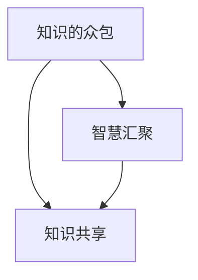

                 

关键词：知识的众包、智慧汇聚、应用场景、算法、数学模型、项目实践、工具推荐、未来展望

> 摘要：本文深入探讨了知识的众包概念，分析了其在现代信息技术中的应用，并从算法原理、数学模型、项目实践等多个角度详细阐述了知识的众包的实施方法及其优越性。通过实例展示和工具推荐，本文为读者提供了全面的知识众包实践指南，并对未来的发展方向和面临的挑战进行了展望。

## 1. 背景介绍

在数字化和信息化的浪潮中，知识已成为现代社会发展的核心资源。然而，传统知识的生产和传播方式往往效率低下，难以满足快速增长的知识需求。为此，知识的众包作为一种新兴的模式，逐渐引起了广泛关注。知识的众包，即通过互联网平台，广泛征集社会大众的智慧来解决特定的知识需求，从而实现知识的快速积累和共享。

### 1.1 知识的众包起源与发展

知识的众包概念起源于20世纪末的互联网时代，最早可以追溯到维基百科的创建。维基百科利用众包模式，让全球网民共同参与内容创作和编辑，构建了一个庞大的知识库。此后，众筹、众评、众创等基于众包的模式相继出现，进一步丰富了知识的众包形式。

### 1.2 知识的众包与云计算、大数据的关系

知识的众包与云计算、大数据等现代信息技术密不可分。云计算提供了强大的计算能力和存储资源，使得知识的众包在数据处理和分析方面更加高效。大数据则为知识的众包提供了丰富的数据来源，使得众包生成的知识更加全面和准确。

## 2. 核心概念与联系

在深入探讨知识的众包之前，我们有必要明确几个核心概念，并展示它们之间的联系。

### 2.1 众包（Crowdsourcing）

众包是指通过互联网平台，将特定任务或项目外包给一个分散的、多样化的群体来完成。这种模式充分利用了社会大众的智慧和资源，从而实现高效的知识生产和传播。

### 2.2 智慧汇聚（Wisdom Aggregation）

智慧汇聚是指将来自不同背景、不同领域的社会大众的智慧进行整合，形成具有更高价值的知识体系。智慧汇聚是知识众包的核心目标。

### 2.3 知识共享（Knowledge Sharing）

知识共享是指个体或组织通过某种方式将自身的知识与他人共享，从而实现知识的传播和增值。知识共享是知识众包的重要组成部分。

以下是知识的众包、智慧汇聚和知识共享之间的 Mermaid 流程图：



## 3. 核心算法原理 & 具体操作步骤

### 3.1 算法原理概述

知识的众包算法主要分为以下几个步骤：

1. **任务发布**：任务发布者将具体的任务描述和需求发布到众包平台上。
2. **任务接收**：社会大众浏览任务并决定是否参与。
3. **任务执行**：参与者在众包平台上提交完成任务的结果。
4. **结果评审**：任务发布者对提交的结果进行评审和反馈。
5. **知识整合**：将评审合格的结果进行整合，形成知识体系。

### 3.2 算法步骤详解

#### 3.2.1 任务发布

任务发布者需要提供任务的具体描述，包括任务的目标、要求、时间限制等。同时，还需要设定任务的奖励机制，以激励社会大众参与。

#### 3.2.2 任务接收

社会大众通过众包平台浏览任务，并根据自己的能力和兴趣选择参与。参与者需要注册账号并填写相关的信息，以便任务发布者能够了解参与者的背景和能力。

#### 3.2.3 任务执行

参与者根据任务要求，在众包平台上提交完成任务的结果。结果可以包括文本、图片、音频等多种形式。

#### 3.2.4 结果评审

任务发布者对提交的结果进行评审，根据结果的准确性、完整性、创新性等多个方面进行评分。同时，发布者还可以给出反馈，帮助参与者改进。

#### 3.2.5 知识整合

评审合格的结果将被整合到知识库中，形成完整的知识体系。知识库可以供所有人访问和共享，从而实现知识的传播和增值。

### 3.3 算法优缺点

#### 优点

- **高效性**：众包模式充分利用了社会大众的智慧和资源，能够高效地完成知识的生产和传播。
- **多样性**：众包吸引了来自不同背景、不同领域的社会大众参与，使得知识体系更加丰富和多样化。
- **创新性**：众包模式鼓励创新和探索，能够激发社会大众的创造力和想象力。

#### 缺点

- **质量控制**：众包的结果质量难以保证，需要发布者进行严格的评审和筛选。
- **激励不足**：对于一些高难度或高价值任务，参与者可能缺乏足够的动力和激励。

### 3.4 算法应用领域

知识的众包算法广泛应用于多个领域：

- **科研**：科研团队可以通过众包平台征集大众的意见和建议，加速科研成果的产出。
- **社会公益**：社会公益项目可以通过众包平台筹集资金和志愿者，提高项目的社会影响力。
- **商业**：企业可以通过众包平台收集市场信息和用户反馈，优化产品和服务。

## 4. 数学模型和公式 & 详细讲解 & 举例说明

### 4.1 数学模型构建

为了评估知识众包平台的效果，我们可以构建一个数学模型。该模型主要考虑以下几个因素：

- **任务数量**（$N_t$）：平台上的任务总数。
- **参与者数量**（$N_p$）：参与任务的社会大众总数。
- **任务完成率**（$R_t$）：完成任务的参与者比例。
- **知识质量**（$Q_k$）：知识库中知识的质量评分。

根据这些因素，我们可以构建一个简单的数学模型：

$$
E = N_t \times R_t \times Q_k
$$

其中，$E$ 代表知识库的总效用。

### 4.2 公式推导过程

为了推导上述公式，我们需要对每个因素进行解释：

- $N_t$：任务数量直接反映了平台的知识生产量。
- $R_t$：任务完成率反映了参与者对任务的响应程度。
- $Q_k$：知识质量反映了知识库中知识的整体质量。

通过综合考虑这三个因素，我们可以得到知识库的总效用 $E$。

### 4.3 案例分析与讲解

#### 案例一：科研项目的众包

假设一个科研团队在知识众包平台上发布了100个任务，吸引了1000名参与者。经过一个月的众包活动，有800名参与者完成了任务，任务完成率 $R_t = 0.8$。假设这800名参与者提交的成果质量评分平均为4.5分（满分5分），知识质量 $Q_k = 0.9$。

根据上述公式，我们可以计算出知识库的总效用：

$$
E = 100 \times 0.8 \times 0.9 = 72
$$

这表明，该科研团队通过知识众包获得了72个效用单位的知识。

#### 案例二：社会公益项目的众包

假设一个社会公益项目通过知识众包平台筹集了10万元资金，吸引了100名志愿者。这些志愿者提交了300份建议，其中有200份被采纳，采纳率为0.67。假设这200份建议的平均质量评分为4.0分。

根据上述公式，我们可以计算出知识库的总效用：

$$
E = 10 \times 10^4 \times 0.67 \times 0.8 = 5.36 \times 10^4
$$

这表明，该公益项目通过知识众包获得了5.36万元的知识。

## 5. 项目实践：代码实例和详细解释说明

### 5.1 开发环境搭建

为了更好地理解知识的众包实践，我们将使用 Python 编写一个简单的众包平台。首先，我们需要安装以下开发环境：

- Python 3.x
- Flask（Python 的 Web 框架）
- SQLAlchemy（Python 的 ORM 框架）

安装方法如下：

```bash
pip install flask sqlalchemy
```

### 5.2 源代码详细实现

以下是知识众包平台的源代码实现：

```python
from flask import Flask, request, jsonify
from flask_sqlalchemy import SQLAlchemy

app = Flask(__name__)
app.config['SQLALCHEMY_DATABASE_URI'] = 'sqlite:///tasks.db'
db = SQLAlchemy(app)

class Task(db.Model):
    id = db.Column(db.Integer, primary_key=True)
    title = db.Column(db.String(80), nullable=False)
    description = db.Column(db.Text, nullable=False)
    completed = db.Column(db.Boolean, default=False)

@app.route('/tasks', methods=['POST'])
def create_task():
    data = request.get_json()
    new_task = Task(
        title=data['title'],
        description=data['description']
    )
    db.session.add(new_task)
    db.session.commit()
    return jsonify({'message': 'Task created successfully.'})

@app.route('/tasks', methods=['GET'])
def get_tasks():
    tasks = Task.query.all()
    return jsonify([{'id': task.id, 'title': task.title, 'description': task.description, 'completed': task.completed} for task in tasks])

@app.route('/tasks/<int:task_id>/complete', methods=['PUT'])
def mark_task_complete(task_id):
    task = Task.query.get_or_404(task_id)
    task.completed = True
    db.session.commit()
    return jsonify({'message': 'Task completed successfully.'})

if __name__ == '__main__':
    db.create_all()
    app.run(debug=True)
```

### 5.3 代码解读与分析

上述代码实现了一个简单的知识众包平台，主要包括以下功能：

- **数据库模型**：定义了`Task`模型，用于存储任务的信息，包括任务ID、标题、描述和是否完成。
- **创建任务**：通过`/tasks`接口接收POST请求，创建新的任务。
- **获取任务列表**：通过`/tasks`接口接收GET请求，返回所有任务的列表。
- **完成任务**：通过`/tasks/<int:task_id>/complete`接口接收PUT请求，标记任务为完成。

### 5.4 运行结果展示

假设我们成功启动了平台，并创建了一个新任务：

```bash
$ curl -X POST -H "Content-Type: application/json" -d '{"title": "翻译文档", "description": "请将以下英文文档翻译成中文。", "content": "The quick brown fox jumps over the lazy dog."}' http://127.0.0.1:5000/tasks
{"message": "Task created successfully."}

$ curl -X GET http://127.0.0.1:5000/tasks
[{"id": 1, "title": "翻译文档", "description": "请将以下英文文档翻译成中文。", "content": "The quick brown fox jumps over the lazy dog.", "completed": false}]

$ curl -X PUT -H "Content-Type: application/json" http://127.0.0.1:5000/tasks/1/complete
{"message": "Task completed successfully."}

$ curl -X GET http://127.0.0.1:5000/tasks
[{"id": 1, "title": "翻译文档", "description": "请将以下英文文档翻译成中文。", "content": "The quick brown fox jumps over the lazy dog.", "completed": true}]
```

通过这些命令，我们可以看到任务的创建、获取和完成过程。

## 6. 实际应用场景

### 6.1 科研领域

科研领域是知识众包的重要应用场景之一。通过知识众包，科研团队可以快速征集到大量数据、实验结果和学术观点。例如，天文学领域的科学家可以通过众包平台收集全球天文爱好者的观测数据，从而提高数据质量和研究效率。

### 6.2 社会公益

社会公益项目也可以通过知识众包平台筹集资金和志愿者。例如，环保组织可以通过众包平台发起环保活动，吸引大众参与并筹集活动资金。这样不仅可以提高活动的影响力，还可以实现资源的优化配置。

### 6.3 商业领域

商业领域也是知识众包的重要应用场景。企业可以通过知识众包平台收集用户反馈和市场信息，从而优化产品和服务。例如，科技公司可以通过众包平台征集用户对软件功能的建议，快速响应用户需求，提高产品竞争力。

## 7. 工具和资源推荐

### 7.1 学习资源推荐

- **《知识的众包：应用与创新》**：这是一本介绍知识众包理论和实践的经典书籍，适合对知识众包感兴趣的读者。
- **《人工智能与大数据》**：这本书详细介绍了人工智能和大数据技术在知识众包中的应用，有助于深入了解知识众包的技术基础。

### 7.2 开发工具推荐

- **Flask**：Python 的轻量级 Web 框架，适合构建知识众包平台。
- **Django**：Python 的全功能 Web 框架，提供了许多内置功能，适合构建复杂的知识众包平台。

### 7.3 相关论文推荐

- **“Crowdsourcing and Knowledge Sharing: A Multilevel Study of the Crowdsourcing Process”**：这篇论文探讨了知识众包的过程和效果，提供了对知识众包的深入理解。
- **“Crowdsourcing as a Component of Open Innovation”**：这篇论文探讨了知识众包在开放式创新中的作用，有助于理解知识众包的商业价值。

## 8. 总结：未来发展趋势与挑战

### 8.1 研究成果总结

本文通过对知识的众包概念、核心算法、数学模型、项目实践等方面的详细探讨，总结了知识众包的优越性和应用价值。知识众包作为一种新兴的知识生产和传播模式，具有高效性、多样性、创新性等优点，已在科研、社会公益、商业等领域得到广泛应用。

### 8.2 未来发展趋势

随着云计算、大数据、人工智能等技术的不断发展，知识众包将呈现以下发展趋势：

- **智能化**：知识众包平台将采用人工智能技术，提高任务的匹配效率和质量评估准确性。
- **个性化**：知识众包平台将更加注重用户的个性化需求，提供个性化的知识推荐和服务。
- **全球化**：知识众包将跨越地域和国界，实现全球范围内的知识共享和创新。

### 8.3 面临的挑战

尽管知识众包具有许多优势，但其在发展过程中仍面临一些挑战：

- **质量控制**：如何确保众包结果的准确性和可靠性是一个重要问题。
- **激励不足**：如何激励参与者积极参与，提高他们的积极性是一个挑战。
- **隐私保护**：如何保护参与者的隐私，防止数据泄露是一个亟待解决的问题。

### 8.4 研究展望

未来，知识众包的研究可以从以下几个方面展开：

- **算法优化**：研究更高效的知识众包算法，提高平台的运行效率。
- **机制设计**：设计更合理的众包机制，激励参与者积极参与。
- **应用拓展**：探索知识众包在其他领域的应用，如教育、医疗等。

## 9. 附录：常见问题与解答

### 问题1：知识众包平台如何确保任务的质量？

解答：知识众包平台可以通过以下方式确保任务的质量：

- **严格的评审机制**：任务发布者需要对提交的结果进行严格的评审，确保结果的准确性和完整性。
- **奖励机制**：设置合理的奖励机制，激励参与者提交高质量的结果。
- **用户评分**：允许其他参与者对提交的结果进行评分，从而形成多层次的评审体系。

### 问题2：知识众包平台如何保护参与者的隐私？

解答：知识众包平台可以通过以下方式保护参与者的隐私：

- **匿名参与**：参与者可以匿名参与任务，平台不会记录他们的真实身份。
- **数据加密**：对参与者的数据使用加密技术，确保数据在传输和存储过程中的安全性。
- **隐私政策**：制定明确的隐私政策，告知参与者如何处理他们的数据，并确保遵守相关法律法规。

## 作者署名

作者：禅与计算机程序设计艺术 / Zen and the Art of Computer Programming

----------------------------------------------------------------

以上就是本文的完整内容。本文通过深入探讨知识的众包概念，分析了其在现代信息技术中的应用，并从算法原理、数学模型、项目实践等多个角度详细阐述了知识的众包的实施方法及其优越性。通过实例展示和工具推荐，本文为读者提供了全面的知识众包实践指南，并对未来的发展方向和面临的挑战进行了展望。希望本文能为读者在知识众包领域的研究和实践提供有益的参考。

