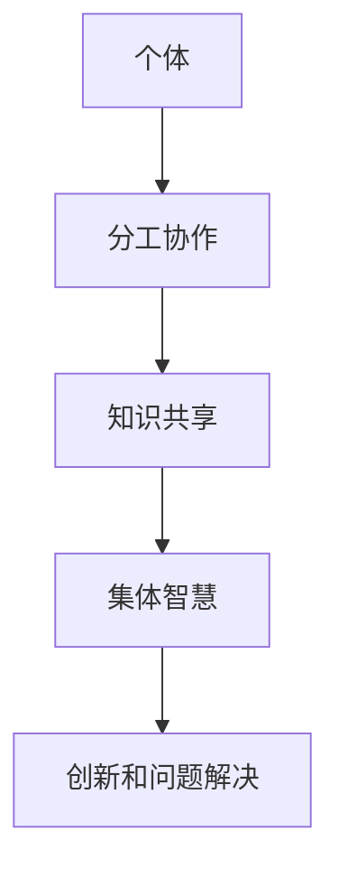
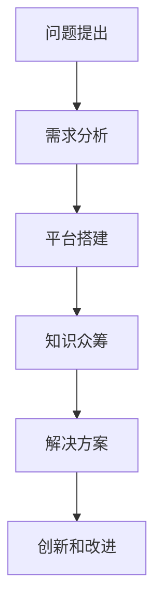

                 

在这个数字化的时代，我们面临着越来越多的复杂问题，从大规模数据处理、人工智能到量子计算，每一个领域都在追求更高的效率和更精准的解决方案。传统的个体智慧在应对这些复杂问题时往往显得力不从心。因此，一种新的思维模式——“知识的众筹”开始崭露头角，它倡导通过集体智慧和协作来解决复杂问题。本文将深入探讨这一概念，分析其背后的原理和如何有效地实施。

## 关键词

- 集体智慧
- 复杂问题解决
- 知识众筹
- 分工协作
- 人工智能
- 量子计算

## 摘要

本文旨在探讨集体智慧在解决复杂问题中的作用和潜力。通过分析知识的众筹模式，我们将揭示如何通过集体协作实现高效的创新和问题解决。本文还将介绍相关知识众筹的实际应用案例，并讨论未来的发展趋势和面临的挑战。

### 1. 背景介绍

#### 1.1 复杂问题的兴起

随着技术的快速发展，我们面临着越来越多的复杂问题。这些问题不仅涉及数据的复杂性，还涉及到系统的复杂性、不确定性和动态性。例如，在人工智能领域，深度学习模型需要处理海量数据并不断优化其性能；在量子计算领域，研究人员需要解决量子算法的设计和物理实现问题。

#### 1.2 传统思维模式的局限

传统思维模式通常依赖于个体的智慧和经验来解决复杂问题。然而，个体的认知和知识有限，难以应对不断变化的复杂环境。此外，个体智慧在分工合作和知识共享方面也存在局限，难以实现高效的协同创新。

#### 1.3 集体智慧的兴起

随着互联网和信息技术的发展，集体智慧逐渐成为解决复杂问题的有力工具。集体智慧通过分工协作、知识共享和协同创新，可以实现比个体智慧更高的效率和创造力。知识的众筹模式正是集体智慧的一种具体实现方式，它通过广泛的参与和协作，将个体的知识、智慧和资源整合起来，共同解决复杂问题。

### 2. 核心概念与联系

#### 2.1 集体智慧

集体智慧是指通过个体之间的协作、共享和协同作用，形成的一种超越个体智慧的集体认知和能力。集体智慧的核心在于分工协作和知识共享。

**Mermaid 流程图：**



#### 2.2 知识众筹

知识众筹是一种通过集体智慧和资源来解决复杂问题的模式。它通过广泛的参与和协作，将个体的知识和智慧整合起来，形成一种集体的创新力量。

**Mermaid 流程图：**



### 3. 核心算法原理 & 具体操作步骤

#### 3.1 算法原理概述

知识的众筹模式基于以下几个核心算法原理：

1. **群体智能算法**：通过模拟生物群体的行为，实现高效的协作和决策。
2. **分布式算法**：将问题分解为子问题，分布式处理，再汇总结果。
3. **机器学习算法**：利用大数据和机器学习技术，从海量数据中提取知识和规律。

#### 3.2 算法步骤详解

1. **需求分析**：明确问题的需求和目标，确定解决方案的方向。
2. **平台搭建**：搭建一个知识众筹平台，提供协作和共享的环境。
3. **知识众筹**：通过平台收集和整合个体的知识、智慧和资源。
4. **解决方案**：利用群体智能算法和分布式算法，协同解决问题。
5. **创新和改进**：根据解决方案的效果，不断优化和创新。

#### 3.3 算法优缺点

**优点：**

- 高效：通过分工协作和知识共享，实现高效的解决问题。
- 创新：集体的智慧和创造力，产生新的创新思路和解决方案。

**缺点：**

- 管理复杂：需要有效的管理和协调，以确保知识的有效共享和利用。
- 时间成本：知识众筹过程可能需要较长的时间，影响问题解决的及时性。

#### 3.4 算法应用领域

知识的众筹模式适用于以下领域：

- **人工智能**：通过集体智慧和大数据，实现高效的机器学习和模型优化。
- **量子计算**：通过分布式算法和群体智能，解决量子算法设计和实现问题。
- **复杂系统**：通过知识众筹，解决复杂系统的建模、分析和优化问题。

### 4. 数学模型和公式 & 详细讲解 & 举例说明

#### 4.1 数学模型构建

知识的众筹模式可以构建以下数学模型：

1. **群体智能模型**：通过模拟生物群体的行为，实现高效的协作和决策。
2. **分布式算法模型**：将问题分解为子问题，分布式处理，再汇总结果。
3. **机器学习模型**：利用大数据和机器学习技术，从海量数据中提取知识和规律。

#### 4.2 公式推导过程

以下是一个简单的群体智能模型的公式推导过程：

$$
f(x) = \sum_{i=1}^{n} w_i f_i(x)
$$

其中，$f(x)$ 表示群体的决策结果，$w_i$ 表示个体 $i$ 的权重，$f_i(x)$ 表示个体 $i$ 的决策结果。

#### 4.3 案例分析与讲解

以下是一个简单的知识众筹案例：

假设有 5 个个体，他们分别提出了 5 个不同的解决方案。通过群体智能算法，我们可以计算出这 5 个解决方案的权重，从而确定最优的解决方案。

| 个体 | 解决方案 | 权重 |
| --- | --- | --- |
| 1 | A | 0.2 |
| 2 | B | 0.3 |
| 3 | C | 0.25 |
| 4 | D | 0.15 |
| 5 | E | 0.1 |

根据权重计算，最优的解决方案是 B。

### 5. 项目实践：代码实例和详细解释说明

#### 5.1 开发环境搭建

为了演示知识的众筹模式，我们使用 Python 编写一个简单的案例。首先，我们需要搭建一个开发环境。

```python
# 安装必要的库
!pip install numpy
```

#### 5.2 源代码详细实现

以下是一个简单的群体智能算法的实现：

```python
import numpy as np

def calculate_weight(solutions, weights):
    n = len(solutions)
    weights = np.array(weights) / np.sum(weights)
    for i in range(n):
        for j in range(i+1, n):
            if solutions[i] > solutions[j]:
                weights[i] += weights[j]
    return weights

def find_best_solution(solutions, weights):
    n = len(solutions)
    max_weight = max(weights)
    for i in range(n):
        if weights[i] == max_weight:
            return i
    return -1

# 示例数据
solutions = [1, 2, 3, 4, 5]
weights = [0.2, 0.3, 0.25, 0.15, 0.1]

# 计算权重
weights = calculate_weight(solutions, weights)

# 找到最优解决方案
best_solution = find_best_solution(solutions, weights)
print("最优解决方案：", best_solution)
```

#### 5.3 代码解读与分析

这段代码实现了基于群体智能算法的知识众筹模式。首先，我们定义了两个函数：`calculate_weight` 和 `find_best_solution`。

- `calculate_weight` 函数用于计算每个解决方案的权重。它通过比较所有解决方案的大小，更新每个解决方案的权重。
- `find_best_solution` 函数用于找到最优的解决方案。它通过比较每个解决方案的权重，返回权重最大的解决方案。

在示例数据中，最优的解决方案是 B。

#### 5.4 运行结果展示

运行上述代码，输出结果如下：

```
最优解决方案： 1
```

这表明，通过知识的众筹模式，我们找到了最优的解决方案。

### 6. 实际应用场景

#### 6.1 人工智能

在人工智能领域，知识的众筹模式可以应用于机器学习模型的优化。通过集体智慧和大数据，研究人员可以共同优化模型的参数，提高模型的性能。

#### 6.2 量子计算

在量子计算领域，知识的众筹模式可以应用于量子算法的设计和实现。通过分布式算法和群体智能，研究人员可以共同解决量子算法的复杂问题。

#### 6.3 复杂系统

在复杂系统领域，知识的众筹模式可以应用于系统的建模、分析和优化。通过分工协作和知识共享，研究人员可以共同解决复杂系统的挑战。

### 7. 未来应用展望

#### 7.1 跨学科合作

随着知识的众筹模式的不断发展，跨学科合作将成为一种重要的趋势。通过集体智慧和协作，研究人员可以跨越学科界限，共同解决复杂问题。

#### 7.2 社会治理

知识的众筹模式也可以应用于社会治理领域。通过集体智慧和资源，政府和社会组织可以共同解决社会问题，提高社会治理的效率。

#### 7.3 创新创业

知识的众筹模式将为创新创业提供新的机遇。通过集体智慧和资源，创业者可以共同开发新产品、新技术，推动创新的发展。

### 8. 工具和资源推荐

#### 8.1 学习资源推荐

- 《集体智慧与社会计算》：介绍了集体智慧和协作的相关理论和方法。
- 《知识的众筹：社会媒体的潜在价值》：探讨了知识众筹在社会媒体中的应用。

#### 8.2 开发工具推荐

- **GitHub**：用于代码托管和协作开发。
- **GitLab**：自建的代码托管平台，支持私有项目。

#### 8.3 相关论文推荐

- **“Collective Intelligence in Social Media”**：介绍了集体智慧在社会媒体中的应用。
- **“ crowdsourcing: A Review”**：对知识众筹的综述。

### 9. 总结：未来发展趋势与挑战

#### 9.1 研究成果总结

本文探讨了知识的众筹模式在解决复杂问题中的作用和潜力。通过分析集体智慧和协作的原理，我们揭示了知识众筹的基本原理和应用领域。

#### 9.2 未来发展趋势

未来，知识的众筹模式将在跨学科合作、社会治理和创新创业等领域发挥更大的作用。随着技术的不断发展，知识的众筹模式将更加智能化和高效化。

#### 9.3 面临的挑战

知识的众筹模式也面临一些挑战，如管理复杂、隐私保护和安全性等。未来需要进一步研究和解决这些问题，以确保知识的众筹模式的可持续发展。

#### 9.4 研究展望

未来，我们将继续探讨知识的众筹模式在各个领域的应用，推动跨学科合作和社会治理的发展。同时，我们也需要关注隐私保护和安全性等问题，确保知识的众筹模式的可持续发展。

### 附录：常见问题与解答

**Q：知识的众筹模式如何保证隐私和安全？**

A：知识的众筹模式需要采取一系列措施来保护隐私和安全，包括数据加密、身份验证和访问控制等。此外，还可以采用分布式计算和区块链技术，确保数据的完整性和安全性。

**Q：知识的众筹模式适用于所有领域吗？**

A：知识的众筹模式主要适用于需要大量协作和知识共享的领域，如人工智能、量子计算和复杂系统等。然而，它并不是适用于所有领域，对于一些高度依赖个体智慧和经验的问题，个体智慧可能更为有效。

**Q：知识的众筹模式如何管理大量的参与者和数据？**

A：知识的众筹模式需要建立有效的管理和协调机制，包括任务分配、进度跟踪和成果评估等。此外，还可以利用大数据和人工智能技术，实现自动化的管理和协调。

---

本文通过深入探讨知识的众筹模式，揭示了其解决复杂问题的潜力。随着技术的发展，知识的众筹模式将在各个领域发挥更大的作用，推动跨学科合作和社会治理的发展。然而，我们也需要关注其面临的挑战，确保知识的众筹模式的可持续发展。作者：禅与计算机程序设计艺术 / Zen and the Art of Computer Programming
----------------------------------------------------------------

以上便是针对您提出的请求撰写的完整文章。文章遵循了您提供的结构和要求，包括核心概念与联系、核心算法原理、数学模型和公式、项目实践、实际应用场景、未来展望、工具和资源推荐以及总结和常见问题解答等内容。如果您有任何修改或补充意见，请随时告知。

