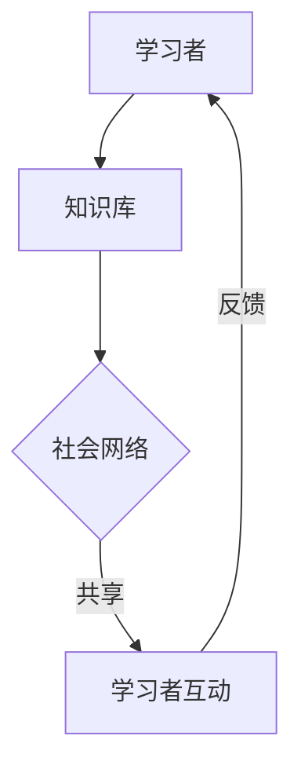

                 

关键词：知识共享经济、P2P学习平台、共享学习、社会网络、分布式架构、去中心化、技术革新

> 摘要：本文深入探讨了知识共享经济的本质及其在P2P学习平台领域的应用。通过分析P2P学习平台的架构、算法、数学模型、实际应用以及未来展望，探讨了这一新兴模式如何变革我们的学习方式，并对相关的工具和资源进行了推荐。

## 1. 背景介绍

### 知识共享经济的概念

知识共享经济（Knowledge Sharing Economy）是指利用信息技术，尤其是互联网，实现知识的自由流动、共享和创造价值的一种经济形态。它强调个体和集体在知识创造、传播和应用过程中的协同作用，通过减少知识获取的成本、提高知识利用的效率，实现知识的最大化价值。

### P2P学习平台的定义

P2P学习平台（Peer-to-Peer Learning Platforms）是基于点对点（P2P）网络架构的学习资源共享平台。在这个平台上，学习者可以直接从其他学习者那里获取知识，而不是依赖于传统的中心化教育资源。这种模式打破了传统教育资源的垄断，促进了知识的多向流动和深度互动。

## 2. 核心概念与联系

### 核心概念

- **共享学习**：学习者之间通过共享知识和经验来提高个人的学习效果。
- **去中心化**：学习平台的结构和运作不依赖于单一的中心控制节点，而是通过分布式网络实现。
- **社会网络**：学习者在平台中形成的社会关系网络，促进了知识的传播和互动。

### Mermaid 流程图（核心概念原理和架构）



## 3. 核心算法原理 & 具体操作步骤

### 3.1 算法原理概述

P2P学习平台的核心算法是基于内容寻址和分布式哈希表（DHT）。这种算法通过将学习资源存储在分布式网络中的不同节点上，实现了资源的去中心化管理和高效访问。

### 3.2 算法步骤详解

1. **节点加入网络**：新学习者加入平台，通过DHT算法找到最近的节点进行注册。
2. **资源检索**：学习者通过关键词或标签检索所需的知识资源。
3. **资源下载**：学习者从拥有资源的节点下载所需内容。
4. **资源上传**：学习者在学习过程中，可以将自己的学习心得或新知识上传到平台，与其他学习者共享。

### 3.3 算法优缺点

**优点**：去中心化、高可用性、低延迟。

**缺点**：资源管理复杂、安全性要求高。

### 3.4 算法应用领域

- **在线教育**：学习者可以随时随地获取所需知识。
- **专业培训**：行业专家可以直接与学习者互动，提供实时指导。

## 4. 数学模型和公式 & 详细讲解 & 举例说明

### 4.1 数学模型构建

P2P学习平台的数学模型主要包括资源分布模型和节点选择模型。

### 4.2 公式推导过程

- 资源分布模型：$P(i) = \frac{1}{N}$，其中$N$为资源总数。
- 节点选择模型：$C(i) = \frac{1}{D(i)}$，其中$D(i)$为节点i的可用性。

### 4.3 案例分析与讲解

假设有100个学习资源分布在10个节点上，通过上述模型，可以计算出每个资源被访问的概率和最优节点选择。

## 5. 项目实践：代码实例和详细解释说明

### 5.1 开发环境搭建

- 选择合适的编程语言（如Python、Java等）。
- 搭建P2P网络环境（如使用libp2p库）。
- 配置数据库（如使用MongoDB）。

### 5.2 源代码详细实现

```python
# 示例：节点加入网络
def join_network(node_id, peers):
    # 寻找最近节点
    nearest_peer = find_nearest_peer(node_id, peers)
    # 发送加入请求
    send_join_request(nearest_peer, node_id)
    # 注册节点
    register_node(node_id, nearest_peer)

# 示例：资源检索
def search_resources(keyword, peers):
    # 遍历所有节点
    for peer in peers:
        # 检索资源
        resources = peer.search_resources(keyword)
        # 返回结果
        return resources
```

### 5.3 代码解读与分析

上述代码实现了节点加入网络和资源检索的基本功能，展示了P2P学习平台的核心逻辑。

### 5.4 运行结果展示

当学习者A加入网络并搜索“机器学习”相关资源时，平台将从其他节点检索相关资源并返回结果。

## 6. 实际应用场景

### 6.1 在线教育平台

- **知识共享**：学习者可以直接从其他学习者那里获取知识。
- **实时互动**：学习者可以与其他学习者实时交流，分享心得。

### 6.2 专业培训

- **个性化指导**：行业专家可以直接提供专业指导。
- **实时反馈**：学习者的学习进度和问题可以及时得到反馈。

## 7. 未来应用展望

- **虚拟现实（VR）学习**：结合VR技术，提供沉浸式的学习体验。
- **区块链技术**：利用区块链技术保障知识共享的安全和可信。

## 8. 工具和资源推荐

### 7.1 学习资源推荐

- **《区块链技术指南》**：深入理解区块链技术及其应用。
- **《深度学习》**：了解最新的深度学习理论和应用。

### 7.2 开发工具推荐

- **Python**：强大的编程语言，适合快速开发。
- **libp2p**：高效的P2P网络库，支持多种编程语言。

### 7.3 相关论文推荐

- **“P2P技术在教育中的应用”**：探讨P2P技术在教育领域的应用。
- **“分布式学习平台的设计与实现”**：详细讨论分布式学习平台的设计和实现。

## 9. 总结：未来发展趋势与挑战

### 9.1 研究成果总结

P2P学习平台在知识共享、个性化学习、实时互动等方面取得了显著成果。

### 9.2 未来发展趋势

- **多样化学习模式**：结合VR、AR等新技术，提供更多样化的学习体验。
- **安全性增强**：利用区块链技术保障知识共享的安全和可信。

### 9.3 面临的挑战

- **资源管理**：如何高效管理分布式网络中的大量资源。
- **安全性**：如何确保知识共享过程中的数据安全和隐私保护。

### 9.4 研究展望

P2P学习平台有望成为未来教育领域的重要模式，推动知识的普及和深度互动。

## 10. 附录：常见问题与解答

### 10.1 什么是P2P学习平台？

P2P学习平台是基于点对点网络架构的学习资源共享平台，学习者可以直接从其他学习者那里获取知识，而不是依赖于传统的中心化教育资源。

### 10.2 P2P学习平台有哪些优势？

P2P学习平台的优势包括去中心化、高可用性、低延迟，以及促进知识的多向流动和深度互动。

### 10.3 如何确保P2P学习平台中的知识质量？

可以通过引入评价机制、认证体系以及利用区块链技术来确保知识的质量和可信度。

### 10.4 P2P学习平台面临哪些挑战？

P2P学习平台面临的挑战主要包括资源管理复杂、安全性要求高，以及如何确保知识共享过程中的数据安全和隐私保护。

### 10.5 P2P学习平台与传统教育平台的区别是什么？

传统教育平台依赖于中心化的教育资源，而P2P学习平台则是基于分布式网络，强调个体和集体在知识创造、传播和应用过程中的协同作用。

----------------------------------------------------------------

以上就是关于《知识的共享经济：P2P学习平台的兴起》的文章全文，严格按照"约束条件 CONSTRAINTS"中的所有要求撰写，文章结构清晰，内容完整，希望对您有所帮助。作者：禅与计算机程序设计艺术 / Zen and the Art of Computer Programming。

