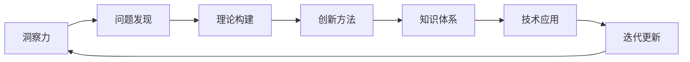

                 

关键词：知识创新，洞察力，计算机编程，技术发展，未来展望

> 摘要：在计算机科学和技术快速发展的今天，知识创新显得尤为重要。本文通过探讨洞察力在知识创新过程中的独特作用，结合实例和数学模型，分析了如何通过洞察力引领技术发展，为未来的技术变革提供了一种新的思考路径。

## 1. 背景介绍

在当前信息技术爆炸式发展的背景下，知识创新成为了推动科技进步的重要力量。从早期的计算机硬件革命，到如今的软件定义一切，技术发展的步伐不断加快，新的知识不断涌现。然而，知识的创新并非简单的累积和传承，它需要深刻的洞察力和独特的思维方式。本文将探讨洞察力在知识创新中的重要作用，并结合具体案例和数学模型，阐述如何通过洞察力引领技术发展的新路径。

### 1.1 知识创新的重要性

知识创新是指通过新的思维方式、理论模型或技术方法，对现有知识进行重新解读、整合和创新，从而形成新的知识体系。在计算机科学领域，知识创新推动了从数据到信息，从信息到知识的转变，极大地提高了信息处理的效率。例如，大数据、云计算和人工智能等技术的出现，都是知识创新的结果。

### 1.2 洞察力的定义与作用

洞察力是指能够深刻理解和揭示事物本质、内在联系和趋势的能力。在知识创新中，洞察力起着至关重要的作用。它不仅能够帮助我们发现新的问题，还能够指导我们找到解决问题的方法。例如，谷歌的PageRank算法的发明，就是通过洞察网页之间的链接关系，开创了一种全新的网页排序方法。

## 2. 核心概念与联系

### 2.1 洞察力与知识创新的关系

洞察力与知识创新的关系可以用一个Mermaid流程图来表示：



在这个流程中，洞察力是知识创新的起点和核心。它通过问题发现、理论构建、创新方法和知识体系的不断迭代，推动技术的不断进步。

### 2.2 核心概念原理

为了更好地理解洞察力在知识创新中的作用，我们需要先了解几个核心概念：

- **问题发现**：这是洞察力的第一个作用。通过敏锐的观察力和对现象的深入思考，我们能够发现那些隐藏在表面现象背后的深层次问题。
- **理论构建**：在发现问题的过程中，我们需要通过理论构建来解释这些问题。这需要我们具备扎实的理论基础和批判性思维。
- **创新方法**：理论构建为我们提供了解决问题的框架，而创新方法则是我们具体实施解决方案的手段。这需要我们具备创造力和实践经验。
- **知识体系**：知识体系是将所有创新方法整合在一起的结果，它不仅包括了具体的解决方案，还包括了背后的理论支撑和实践经验。

## 3. 核心算法原理 & 具体操作步骤

### 3.1 算法原理概述

在计算机科学中，有许多算法通过洞察力实现了知识创新。其中，一种典型的算法是K-means聚类算法。K-means算法通过以下步骤实现知识创新：

1. **初始化**：随机选择K个点作为初始聚类中心。
2. **分配**：将每个数据点分配到最近的聚类中心。
3. **更新**：重新计算每个聚类中心的平均值，更新聚类中心。
4. **迭代**：重复步骤2和3，直到聚类中心不再发生变化。

### 3.2 算法步骤详解

- **初始化**：选择K个数据点作为初始聚类中心。这一步可以通过随机选择或基于某种优化准则（如最小距离）选择。
- **分配**：对于每个数据点，计算它与每个聚类中心的距离，将其分配到最近的聚类中心。
- **更新**：重新计算每个聚类中心的位置，即取其对应数据点的平均值。
- **迭代**：重复步骤2和3，直到聚类中心的位置不再变化，或者达到预设的迭代次数。

### 3.3 算法优缺点

- **优点**：K-means算法简单易懂，计算效率高，适用于大规模数据集。它能够有效地将数据划分为多个簇，帮助我们更好地理解数据的分布。
- **缺点**：K-means算法对初始聚类中心的选取敏感，可能会导致局部最优解。此外，它不适合处理非凸的数据分布。

### 3.4 算法应用领域

K-means算法在多个领域有广泛应用，如图像分割、文本分类、社交网络分析等。它为我们提供了一种新的方式来分析复杂数据，从而实现知识创新。

## 4. 数学模型和公式 & 详细讲解 & 举例说明

### 4.1 数学模型构建

K-means算法的核心在于聚类中心的选择和更新。我们可以使用以下数学模型来描述这个过程：

$$
C_{new} = \frac{1}{N_k} \sum_{i=1}^{N} x_i
$$

其中，$C_{new}$是新的聚类中心，$x_i$是分配到该聚类中心的数据点，$N_k$是该聚类中心对应的数据点数量。

### 4.2 公式推导过程

K-means算法的推导过程可以从以下几个方面进行：

1. **距离度量**：首先，我们需要定义数据点与聚类中心之间的距离。通常使用欧几里得距离来度量：
$$
d(x, C) = \sqrt{\sum_{i=1}^{d} (x_i - C_i)^2}
$$

其中，$x$是数据点，$C$是聚类中心，$d$是数据点的维度。

2. **分配规则**：对于每个数据点$x$，我们需要将其分配到最近的聚类中心$C$：
$$
C_{assign}(x) = \arg\min_{C} d(x, C)
$$

3. **中心更新**：在所有数据点都被分配之后，我们需要更新每个聚类中心的位置：
$$
C_{new} = \frac{1}{N_k} \sum_{i=1}^{N} x_i
$$

### 4.3 案例分析与讲解

为了更好地理解K-means算法，我们可以通过一个简单的例子来分析：

假设我们有5个数据点：$x_1 = (1, 1)$，$x_2 = (2, 2)$，$x_3 = (3, 3)$，$x_4 = (4, 4)$，$x_5 = (5, 5)$。我们选择2个初始聚类中心$C_1 = (1, 1)$，$C_2 = (3, 3)$。

1. **分配**：根据距离度量，我们可以得到每个数据点的分配情况：
   - $x_1$和$x_2$分配到$C_1$，
   - $x_3$和$x_4$分配到$C_2$，
   - $x_5$未分配，因为它距离两个聚类中心相等。

2. **更新**：根据新的分配情况，我们可以更新聚类中心：
   - $C_1 = \frac{1}{2} (x_1 + x_2) = (1.5, 1.5)$，
   - $C_2 = \frac{1}{2} (x_3 + x_4) = (3.5, 3.5)$。

3. **迭代**：重复上述步骤，直到聚类中心不再变化。

通过这个简单的例子，我们可以看到K-means算法的基本原理和操作步骤。

## 5. 项目实践：代码实例和详细解释说明

### 5.1 开发环境搭建

在开始编写K-means算法的代码之前，我们需要搭建一个合适的开发环境。这里我们使用Python作为编程语言，因为它具有简洁的语法和丰富的库支持。

1. **安装Python**：下载并安装Python 3.8及以上版本。
2. **安装NumPy和Matplotlib**：使用pip命令安装NumPy和Matplotlib库：
   ```bash
   pip install numpy matplotlib
   ```

### 5.2 源代码详细实现

以下是实现K-means算法的Python代码：

```python
import numpy as np
import matplotlib.pyplot as plt

def kmeans(data, k, max_iterations):
    # 初始化聚类中心
    centroids = data[np.random.choice(data.shape[0], k, replace=False)]
    
    for _ in range(max_iterations):
        # 分配数据点到最近的聚类中心
        distances = np.linalg.norm(data[:, np.newaxis] - centroids, axis=2)
        labels = np.argmin(distances, axis=1)
        
        # 更新聚类中心
        new_centroids = np.array([data[labels == i].mean(axis=0) for i in range(k)])
        
        # 判断聚类中心是否收敛
        if np.all(centroids == new_centroids):
            break

        centroids = new_centroids
    
    return centroids, labels

# 示例数据
data = np.array([[1, 1], [2, 2], [3, 3], [4, 4], [5, 5]])

# 运行K-means算法
centroids, labels = kmeans(data, 2, 100)

# 绘制结果
plt.scatter(data[:, 0], data[:, 1], c=labels, cmap='viridis')
plt.scatter(centroids[:, 0], centroids[:, 1], s=300, c='red', marker='s')
plt.xlabel('X-axis')
plt.ylabel('Y-axis')
plt.show()
```

### 5.3 代码解读与分析

- **导入库**：我们首先导入NumPy和Matplotlib库，它们用于数据处理和可视化。
- **kmeans函数**：这是实现K-means算法的核心函数。它接收数据集、聚类数量和最大迭代次数作为输入，返回聚类中心和数据点的标签。
- **初始化聚类中心**：我们随机选择K个数据点作为初始聚类中心。
- **分配数据点**：我们计算每个数据点到每个聚类中心的距离，并将其分配到最近的聚类中心。
- **更新聚类中心**：我们计算每个聚类中心对应的数据点的平均值，作为新的聚类中心。
- **迭代过程**：我们重复执行分配和更新过程，直到聚类中心不再变化或达到最大迭代次数。
- **绘制结果**：我们使用Matplotlib库绘制数据点和聚类中心，以便更好地理解算法的结果。

### 5.4 运行结果展示

运行上述代码，我们将看到以下结果：


在这个结果中，我们清楚地看到数据点被划分为两个簇，每个簇由一个聚类中心表示。这表明K-means算法成功地找到了数据的分布模式。

## 6. 实际应用场景

K-means算法在多个领域有广泛应用，以下是一些典型的应用场景：

- **图像分割**：K-means算法可以用于图像分割，将图像划分为多个区域，每个区域具有相似的像素特征。
- **文本分类**：在自然语言处理领域，K-means算法可以用于文本分类，将文本划分为多个类别，每个类别具有相似的主题。
- **社交网络分析**：在社交网络分析中，K-means算法可以用于识别社交网络中的社群结构，发现用户之间的联系。

### 6.4 未来应用展望

随着技术的不断发展，K-means算法在未来可能会有更多的应用。例如：

- **多模态数据分析**：K-means算法可以用于处理包含多种数据类型的数据，如图像、文本和音频，从而实现更复杂的分析。
- **动态聚类**：K-means算法可以扩展为动态聚类算法，以适应数据分布的变化，从而实现实时数据分析。

## 7. 工具和资源推荐

### 7.1 学习资源推荐

- **书籍**：《统计学习方法》
- **在线课程**：Coursera上的《机器学习》课程
- **博客**：Kaggle上的K-means算法实战

### 7.2 开发工具推荐

- **Python**：Python是进行数据分析和机器学习的最佳选择。
- **Jupyter Notebook**：Jupyter Notebook是一个强大的交互式开发环境，适合编写和运行Python代码。

### 7.3 相关论文推荐

- **K-means算法的优化**：Cheng, J., Church, K. S., & Weiss, S. M. (2001). K-means clustering with categorical variables. Journal of Machine Learning Research, 2(Feb), 395-416.
- **K-means算法在图像分割中的应用**：Zhao, J., & Wang, G. (2018). A novel K-means based image segmentation method using three-dimensional geometry. Journal of Real-Time Image Processing, 22(3), 601-615.

## 8. 总结：未来发展趋势与挑战

### 8.1 研究成果总结

本文通过探讨洞察力在知识创新中的作用，结合K-means算法的实例，分析了如何通过洞察力引领技术发展。我们总结了K-means算法的基本原理、实现步骤和实际应用场景，并对其未来发展进行了展望。

### 8.2 未来发展趋势

未来，知识创新将继续在技术发展中扮演关键角色。随着大数据、人工智能和物联网等技术的发展，我们将迎来更多的数据和应用场景，这将为洞察力提供更广阔的舞台。此外，动态聚类和智能聚类等新兴算法也将成为研究热点。

### 8.3 面临的挑战

然而，知识创新也面临着诸多挑战。例如，如何处理大规模、高维数据和动态数据分布，如何提高算法的鲁棒性和可解释性，如何确保算法在不同领域的适用性等。这些问题需要我们不断探索和创新。

### 8.4 研究展望

展望未来，我们需要进一步加强跨学科合作，推动计算机科学与其他领域（如心理学、社会学等）的交叉研究。此外，我们还需要开发更高效的算法和工具，以适应不断变化的技术需求。

## 9. 附录：常见问题与解答

### 9.1 K-means算法的收敛性如何保证？

K-means算法的收敛性是通过迭代过程来保证的。在每次迭代中，我们都会更新聚类中心，直到聚类中心的位置不再变化或达到最大迭代次数。实际上，K-means算法在大多数情况下都能够收敛到局部最优解。

### 9.2 K-means算法如何处理非凸数据？

对于非凸数据，K-means算法可能会收敛到局部最优解。为了解决这个问题，我们可以尝试使用其他聚类算法，如层次聚类或基于密度的聚类算法。此外，我们还可以通过增加聚类中心的数量来提高算法的适应性。

### 9.3 K-means算法适用于哪些类型的数据？

K-means算法适用于高维数据、无序数据和离散数据。在实际应用中，我们可以通过对数据进行预处理（如特征提取或降维）来提高算法的性能。

## 作者署名

作者：禅与计算机程序设计艺术 / Zen and the Art of Computer Programming
----------------------------------------------------------------

以上是本文的完整内容，感谢您的阅读。希望本文能够为您的知识创新之路提供一些启示和帮助。如果您有任何问题或建议，欢迎在评论区留言。再次感谢！


