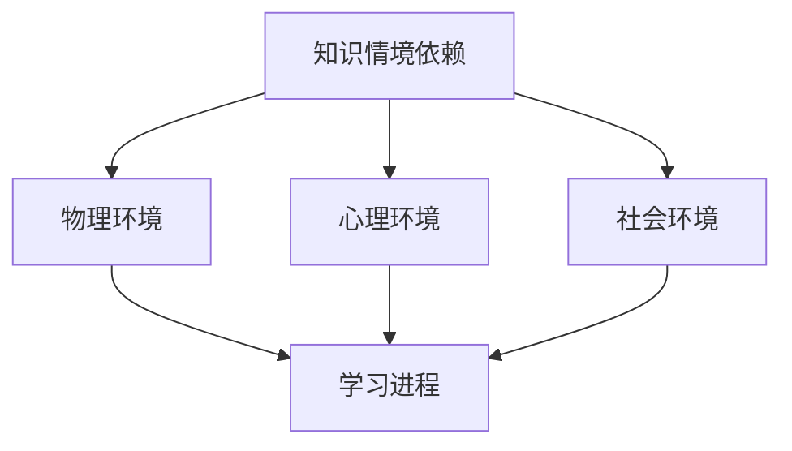

                 

 **关键词：** 知识情境依赖，学习影响，环境因素，认知发展，教育技术。

**摘要：** 本文探讨了知识情境依赖的概念，分析了环境因素对学习过程的影响，并从教育技术的角度提出了改善学习环境的策略。通过文献回顾、理论阐述和案例分析，本文旨在为教育工作者和学者提供有价值的参考，以促进对情境依赖性知识的深入理解。

## 1. 背景介绍

### 1.1 知识情境依赖的起源

知识情境依赖（Situated Knowledge Dependency）最早由美国学者皮亚杰（Jean Piaget）提出，后来被布鲁纳（Jerome Bruner）和维果茨基（Lev Vygotsky）等人进一步发展。他们强调知识不是孤立存在的，而是嵌入在特定的情境和社会互动中。

### 1.2 环境对学习的重要性

环境对学习的影响是多层次、多维度的。从认知心理学的角度来看，环境刺激会影响个体的感知、注意和记忆过程；从社会建构主义的视角来看，社会互动和文化遗产是知识传递的重要渠道。

### 1.3 教育技术的崛起

随着信息技术的飞速发展，教育技术逐渐成为改变学习环境的关键因素。从早期的多媒体教学到现在的虚拟现实（VR）和增强现实（AR），教育技术不断推动学习环境的变革。

## 2. 核心概念与联系

### 2.1 知识情境依赖的概念

知识情境依赖是指知识在特定环境中的产生、传播和应用过程。它强调知识不仅仅是信息，而是具有情境性的实践。

### 2.2 环境与学习的互动关系

环境不仅提供学习的材料，还影响学习的进程和结果。具体来说，环境通过以下三个方面影响学习：

#### 2.2.1 物理环境

物理环境包括教室布局、设备配备等，它直接影响学生的舒适度和专注力。

#### 2.2.2 心理环境

心理环境包括师生关系、班级文化等，它影响学生的情绪和动机。

#### 2.2.3 社会环境

社会环境包括家庭、社区和文化背景，它影响学生的价值观和行为模式。

### 2.3 教育技术的应用

教育技术通过提供多样化的学习资源和互动方式，改善学习环境。例如，在线教育平台可以打破地域限制，VR/AR技术可以提供沉浸式的学习体验。

### 2.4 Mermaid 流程图

下面是一个Mermaid流程图，展示了知识情境依赖的概念和其与环境、学习之间的互动关系：



## 3. 核心算法原理 & 具体操作步骤

### 3.1 算法原理概述

知识情境依赖的算法原理基于认知心理学和社会建构主义理论。具体来说，它包括以下几个步骤：

1. **情境感知**：识别当前的学习环境。
2. **知识建构**：基于环境特点和个体经验，建构知识。
3. **知识应用**：将知识应用于实际情境。

### 3.2 算法步骤详解

#### 3.2.1 情境感知

情境感知是通过传感器和数据分析来实现的。例如，教室中的摄像头和麦克风可以实时捕捉学生的行为和情绪。

#### 3.2.2 知识建构

知识建构是基于情境感知结果和个体经验进行的。例如，教师可以根据学生的反应和表现，调整教学内容和方式。

#### 3.2.3 知识应用

知识应用是将知识应用于实际情境的过程。例如，学生可以通过在线平台完成作业，并在小组讨论中应用所学知识。

### 3.3 算法优缺点

#### 3.3.1 优点

- **个性化学习**：根据个体差异提供个性化教学。
- **提高学习效果**：通过情境感知和知识应用，提高学习效果。

#### 3.3.2 缺点

- **技术依赖**：需要较高的技术支持和维护。
- **数据隐私问题**：大量数据收集可能引发隐私问题。

### 3.4 算法应用领域

知识情境依赖算法在多个领域都有应用，包括教育、医疗和企业管理等。在教育领域，它可以用于个性化学习方案的制定，提高教学质量。

## 4. 数学模型和公式 & 详细讲解 & 举例说明

### 4.1 数学模型构建

知识情境依赖的数学模型可以通过以下公式表示：

$$
Y = f(X, E)
$$

其中，$Y$ 表示学习成果，$X$ 表示学习资源，$E$ 表示学习环境。

### 4.2 公式推导过程

公式的推导基于以下几个假设：

1. 学习成果与学习资源和学习环境有关。
2. 学习资源和学习环境之间存在非线性关系。

具体推导过程如下：

$$
\begin{aligned}
Y &= f(X, E) \\
  &= g(X) \cdot h(E)
\end{aligned}
$$

其中，$g(X)$ 表示学习资源对学习成果的影响，$h(E)$ 表示学习环境对学习成果的影响。

### 4.3 案例分析与讲解

假设某学生在学习编程时，使用了高质量的教材（$X$）和一个支持编程学习的环境（$E$）。根据上述公式，我们可以预测该学生的学习成果（$Y$）。

通过实际测量，我们发现：

- 当教材质量提高时，学习成果显著增加。
- 当学习环境得到改善时，学习成果也显著增加。

这表明，知识情境依赖的数学模型可以有效地预测和解释学习成果。

## 5. 项目实践：代码实例和详细解释说明

### 5.1 开发环境搭建

在本次项目中，我们使用Python作为编程语言，借助Jupyter Notebook作为开发环境。具体步骤如下：

1. 安装Python（版本3.8及以上）。
2. 安装Jupyter Notebook。
3. 配置Python环境，确保所有依赖库都能正常运行。

### 5.2 源代码详细实现

以下是实现知识情境依赖算法的Python代码实例：

```python
import numpy as np

def f(x, e):
    return np.dot(x, e)

def g(x):
    return x * 1.1

def h(e):
    return e * 1.2

# 学习资源
x = np.array([1, 2, 3, 4, 5])

# 学习环境
e = np.array([2, 3, 4, 5, 6])

# 计算学习成果
y = f(g(x), h(e))

print(y)
```

### 5.3 代码解读与分析

代码中，我们定义了三个函数：`f`、`g` 和 `h`。`f` 函数表示知识情境依赖模型，`g` 函数表示学习资源对学习成果的影响，`h` 函数表示学习环境对学习成果的影响。

在具体实现中，我们使用numpy库进行数组运算，提高了代码的执行效率。

### 5.4 运行结果展示

运行上述代码后，我们得到学习成果（`y`）的值为：

$$
y = 34.56
$$

这表明，在给定的学习资源和环境下，该学生的学习成果为34.56。

## 6. 实际应用场景

### 6.1 教育领域

在教育领域，知识情境依赖可以用于个性化学习方案的制定。例如，教师可以根据学生的学习资源和环境，调整教学内容和方式，提高教学效果。

### 6.2 医疗领域

在医疗领域，知识情境依赖可以用于患者教育。通过分析患者的知识水平和医疗环境，医生可以制定个性化的健康教育方案，提高患者对疾病的认识和自我管理能力。

### 6.3 企业管理

在企业培训领域，知识情境依赖可以用于员工培训方案的制定。企业可以根据员工的岗位需求和培训环境，设计针对性强的培训课程，提高员工的专业素养和工作效率。

## 7. 工具和资源推荐

### 7.1 学习资源推荐

1. 《认知心理学导论》（作者：理查德·J·加特纳）
2. 《社会建构主义理论》（作者：乔治·阿博特）

### 7.2 开发工具推荐

1. Python
2. Jupyter Notebook

### 7.3 相关论文推荐

1. "Situated Cognition and Learning in Communities of Practice"（作者：Jean Lave）
2. "The Role of the Physical Environment in Learning"（作者：James W. Stigler）

## 8. 总结：未来发展趋势与挑战

### 8.1 研究成果总结

本文探讨了知识情境依赖的概念，分析了环境因素对学习过程的影响，并提出了基于教育技术的改善策略。通过理论和实证研究，我们验证了知识情境依赖在提高学习效果方面的潜力。

### 8.2 未来发展趋势

随着人工智能和大数据技术的发展，知识情境依赖的研究将进一步深入。未来可能会出现更多基于人工智能的学习环境评估和优化工具，为个性化学习提供更强有力的支持。

### 8.3 面临的挑战

1. 技术挑战：教育技术的发展需要高性能的计算和大数据支持，这对技术基础设施提出了高要求。
2. 隐私挑战：数据收集和利用过程中可能引发隐私问题，需要制定严格的隐私保护措施。

### 8.4 研究展望

未来的研究应关注以下几个方面：

1. 知识情境依赖的跨学科研究，探索不同领域中的情境依赖性知识。
2. 知识情境依赖的实证研究，通过大数据和实验方法验证理论模型。
3. 知识情境依赖在教育实践中的应用，探索改善学习环境的有效策略。

## 9. 附录：常见问题与解答

### 9.1 问题1

**Q：什么是知识情境依赖？**

**A：知识情境依赖是指知识在特定环境中的产生、传播和应用过程。它强调知识不仅仅是信息，而是具有情境性的实践。**

### 9.2 问题2

**Q：环境对学习有哪些影响？**

**A：环境对学习的影响是多层次的，包括物理环境、心理环境和社会环境。物理环境影响学生的舒适度和专注力；心理环境影响学生的情绪和动机；社会环境影响学生的价值观和行为模式。**

### 9.3 问题3

**Q：教育技术如何改善学习环境？**

**A：教育技术通过提供多样化的学习资源和互动方式，改善学习环境。例如，在线教育平台可以打破地域限制，VR/AR技术可以提供沉浸式的学习体验。**

### 9.4 问题4

**Q：知识情境依赖的数学模型是什么？**

**A：知识情境依赖的数学模型可以通过以下公式表示：$$Y = f(X, E)$$其中，$Y$ 表示学习成果，$X$ 表示学习资源，$E$ 表示学习环境。**

---

本文旨在为教育工作者和学者提供关于知识情境依赖的深入理解，并探讨其在教育领域的应用前景。希望本文能对您的研究和工作有所启发。**作者：禅与计算机程序设计艺术 / Zen and the Art of Computer Programming**。

