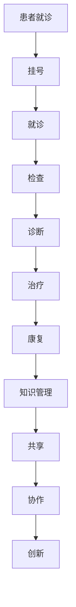

                 

关键词：知识管理、医疗健康、应用、技术、流程优化、人工智能、数据分析、共享、协作、安全性、标准化

摘要：本文将探讨知识管理在医疗健康领域的应用，分析其在提升医疗质量、效率、安全性和患者体验方面的作用。通过深入剖析知识管理的核心概念、数学模型、算法原理以及实践案例，本文旨在为医疗健康领域的知识管理提供理论支持和实践指导。

## 1. 背景介绍

随着医疗技术的迅猛发展，医疗健康领域正面临着前所未有的变革。大数据、人工智能、物联网等新兴技术的广泛应用，使得医疗健康数据呈现爆发式增长。然而，这些海量数据的有效管理和利用成为了一个巨大的挑战。知识管理作为一门系统化的信息管理和利用学科，其在医疗健康领域的应用日益受到关注。

### 1.1 医疗健康领域的挑战

1. **数据量庞大**：医疗数据包括患者的电子健康记录、诊断影像、基因组数据等，数据量庞大且不断增长。
2. **数据多样性**：医疗健康数据包括结构化数据（如电子病历）和非结构化数据（如图像、文本报告）。
3. **数据质量问题**：数据质量参差不齐，标准化程度低，数据清洗和整合困难。
4. **信息孤岛**：医疗信息系统之间缺乏有效的集成和共享，信息无法流畅传递。
5. **专业知识缺乏**：医疗专业人员往往缺乏对新兴技术的理解和应用能力。

### 1.2 知识管理的定义和作用

知识管理是一种通过系统化和组织化的方法，将知识从个体转移到组织，从而实现知识的创造、共享、利用和存档的过程。在医疗健康领域，知识管理的作用主要体现在以下几个方面：

1. **提升医疗质量**：通过知识共享和协作，医疗专业人员可以更好地掌握最新医疗知识和技术，提高诊疗水平。
2. **提高效率**：知识管理可以减少信息孤岛，促进不同部门之间的信息交流和协作，提高工作效率。
3. **保障安全性**：通过标准化和规范化，知识管理可以确保医疗数据的安全性和完整性。
4. **优化流程**：知识管理可以帮助医疗机构优化业务流程，提高服务效率。
5. **提高患者体验**：通过个性化医疗和精准医疗，知识管理可以提升患者的治疗体验。

## 2. 核心概念与联系

### 2.1 核心概念

#### 2.1.1 知识管理

知识管理（Knowledge Management，KM）是一种通过系统化的方法，促进知识的创造、共享、利用和存档，从而提升组织竞争力的过程。知识管理包括知识的获取、存储、共享、应用和创新等方面。

#### 2.1.2 医疗健康知识

医疗健康知识是指与医疗健康相关的各类信息，包括疾病诊断、治疗、预防、护理等方面的知识。医疗健康知识具有多样性和复杂性，包括结构化数据（如电子病历）和非结构化数据（如图像、文本报告）。

#### 2.1.3 医疗健康流程

医疗健康流程是指医疗机构在进行医疗活动时的一系列操作步骤，包括患者挂号、就诊、检查、诊断、治疗、康复等环节。

### 2.2 Mermaid 流程图

下面是一个简化的医疗健康知识管理流程的 Mermaid 流程图，展示了知识管理在医疗健康领域的基本流程和环节。



## 3. 核心算法原理 & 具体操作步骤

### 3.1 算法原理概述

在医疗健康领域，知识管理算法通常涉及以下核心原理：

1. **数据清洗与整合**：通过对海量医疗健康数据进行清洗、去噪、去冗余等处理，提高数据质量。
2. **数据挖掘与关联分析**：利用机器学习、数据挖掘等方法，发现数据之间的关联性，提取有价值的信息。
3. **知识图谱构建**：通过构建知识图谱，实现医疗健康知识的结构化和可视化。
4. **推理与决策支持**：利用推理机、专家系统等技术，为医疗专业人员提供决策支持。
5. **个性化推荐**：基于用户历史数据和偏好，为用户提供个性化的医疗建议和治疗方案。

### 3.2 算法步骤详解

1. **数据收集**：从各种医疗健康数据源（如电子病历、基因组数据库、医学文献等）收集数据。
2. **数据预处理**：对收集到的数据进行清洗、去噪、去冗余等处理，提高数据质量。
3. **数据挖掘与关联分析**：利用机器学习、数据挖掘等方法，对预处理后的数据进行关联分析，提取有价值的信息。
4. **知识图谱构建**：将提取出的信息构建为知识图谱，实现医疗健康知识的结构化和可视化。
5. **推理与决策支持**：利用推理机、专家系统等技术，为医疗专业人员提供决策支持。
6. **个性化推荐**：基于用户历史数据和偏好，为用户提供个性化的医疗建议和治疗方案。

### 3.3 算法优缺点

**优点**：

1. **提高医疗质量**：通过数据挖掘和知识图谱构建，医疗专业人员可以更好地掌握最新医疗知识和技术，提高诊疗水平。
2. **优化医疗流程**：通过推理和决策支持，优化医疗流程，提高服务效率。
3. **个性化医疗**：通过个性化推荐，为用户提供个性化的医疗建议和治疗方案，提升患者体验。

**缺点**：

1. **数据质量**：医疗健康数据的多样性、复杂性导致数据质量参差不齐，影响算法效果。
2. **算法复杂度**：知识管理算法通常涉及复杂的计算过程，对计算资源有较高要求。
3. **隐私保护**：医疗健康数据的隐私保护是知识管理面临的重要挑战。

### 3.4 算法应用领域

1. **疾病诊断与预测**：通过分析患者的历史数据和基因信息，预测疾病的发生和进展。
2. **个性化治疗**：根据患者的病史、基因信息和治疗方案，为患者提供个性化的治疗方案。
3. **医疗流程优化**：通过数据挖掘和知识图谱构建，优化医疗流程，提高服务效率。
4. **公共卫生管理**：通过大规模数据分析，预测疾病流行趋势，制定公共卫生政策。

## 4. 数学模型和公式 & 详细讲解 & 举例说明

### 4.1 数学模型构建

在医疗健康知识管理中，常见的数学模型包括：

1. **贝叶斯网络**：用于表示医疗健康领域中的不确定性关系和概率推理。
2. **决策树**：用于分类和回归分析，帮助医疗专业人员做出决策。
3. **神经网络**：用于建立复杂的非线性关系，用于疾病预测和诊断。

### 4.2 公式推导过程

以贝叶斯网络为例，贝叶斯网络中的概率推理可以通过以下公式推导：

\[ P(A|B) = \frac{P(B|A) \cdot P(A)}{P(B)} \]

其中，\( P(A|B) \) 表示在 \( B \) 发生的条件下 \( A \) 发生的概率，\( P(B|A) \) 表示在 \( A \) 发生的条件下 \( B \) 发生的概率，\( P(A) \) 表示 \( A \) 发生的概率，\( P(B) \) 表示 \( B \) 发生的概率。

### 4.3 案例分析与讲解

以疾病预测为例，假设我们要预测某个患者是否患有某种疾病，根据贝叶斯网络的公式，我们可以通过以下步骤进行概率推理：

1. **定义事件**：定义事件 \( A \) 表示患者患有某种疾病，事件 \( B \) 表示患者的症状。
2. **确定先验概率**：根据历史数据，确定患者患有某种疾病的先验概率 \( P(A) \) 和患者没有患有某种疾病的先验概率 \( P(\neg A) \)。
3. **确定条件概率**：根据患者的症状，确定患者在患有某种疾病和没有患有某种疾病的情况下，症状发生的条件概率 \( P(B|A) \) 和 \( P(B|\neg A) \)。
4. **计算后验概率**：根据贝叶斯公式，计算患者在患有某种疾病和没有患有某种疾病的情况下，症状发生的后验概率 \( P(A|B) \) 和 \( P(\neg A|B) \)。
5. **决策**：根据后验概率，判断患者是否患有某种疾病。

例如，假设我们有以下数据：

- \( P(A) = 0.01 \)（患者患有某种疾病的概率）
- \( P(\neg A) = 0.99 \)（患者没有患有某种疾病的概率）
- \( P(B|A) = 0.8 \)（患者患有某种疾病时，症状发生的概率）
- \( P(B|\neg A) = 0.2 \)（患者没有患有某种疾病时，症状发生的概率）

根据贝叶斯公式，我们可以计算：

\[ P(A|B) = \frac{P(B|A) \cdot P(A)}{P(B|A) \cdot P(A) + P(B|\neg A) \cdot P(\neg A)} \]

\[ P(A|B) = \frac{0.8 \cdot 0.01}{0.8 \cdot 0.01 + 0.2 \cdot 0.99} \]

\[ P(A|B) \approx 0.0476 \]

根据计算结果，我们可以判断患者患有某种疾病的概率为约 4.76%。

## 5. 项目实践：代码实例和详细解释说明

### 5.1 开发环境搭建

为了实现知识管理在医疗健康领域的应用，我们选择 Python 作为开发语言，利用 PyTorch 和 Scikit-learn 等库进行深度学习和数据挖掘。以下是开发环境搭建的基本步骤：

1. 安装 Python（版本 3.8 或以上）。
2. 安装 PyTorch（根据系统环境选择合适版本，例如 torch==1.8.0）。
3. 安装 Scikit-learn（版本 0.21.3）。
4. 安装其他必要库（如 pandas、numpy、matplotlib 等）。

### 5.2 源代码详细实现

下面是一个简单的基于深度学习的疾病预测项目代码示例。假设我们有一个包含患者病史和症状的数据集，我们使用卷积神经网络（CNN）进行疾病预测。

```python
import torch
import torch.nn as nn
import torch.optim as optim
from torch.utils.data import DataLoader, Dataset
from sklearn.model_selection import train_test_split
import pandas as pd

# 数据集加载与预处理
class DiseaseDataset(Dataset):
    def __init__(self, data, labels):
        self.data = data
        self.labels = labels

    def __len__(self):
        return len(self.data)

    def __getitem__(self, idx):
        image = self.data[idx]
        label = self.labels[idx]
        return image, label

# 网络结构
class CNNModel(nn.Module):
    def __init__(self):
        super(CNNModel, self).__init__()
        self.conv1 = nn.Conv2d(1, 32, 3, 1)
        self.conv2 = nn.Conv2d(32, 64, 3, 1)
        self.fc1 = nn.Linear(64 * 6 * 6, 128)
        self.fc2 = nn.Linear(128, 1)
        self.dropout = nn.Dropout(0.5)

    def forward(self, x):
        x = self.conv1(x)
        x = self.dropout(x)
        x = self.conv2(x)
        x = self.dropout(x)
        x = x.view(x.size(0), -1)
        x = self.fc1(x)
        x = self.dropout(x)
        x = self.fc2(x)
        return x

# 模型训练
def train(model, train_loader, val_loader, criterion, optimizer, num_epochs=25):
    model.train()
    for epoch in range(num_epochs):
        running_loss = 0.0
        for images, labels in train_loader:
            optimizer.zero_grad()
            outputs = model(images)
            loss = criterion(outputs, labels)
            loss.backward()
            optimizer.step()
            running_loss += loss.item()
        print(f'Epoch {epoch+1}, Loss: {running_loss/len(train_loader)}')
    
    # 在验证集上评估模型
    model.eval()
    with torch.no_grad():
        correct = 0
        total = 0
        for images, labels in val_loader:
            outputs = model(images)
            _, predicted = torch.max(outputs.data, 1)
            total += labels.size(0)
            correct += (predicted == labels).sum().item()
        print(f'Validation Accuracy: {100 * correct / total}%')

# 主函数
def main():
    data = pd.read_csv('disease_data.csv')
    X = data.iloc[:, :-1].values
    y = data.iloc[:, -1].values
    X_train, X_val, y_train, y_val = train_test_split(X, y, test_size=0.2, random_state=42)
    train_dataset = DiseaseDataset(X_train, y_train)
    val_dataset = DiseaseDataset(X_val, y_val)
    train_loader = DataLoader(train_dataset, batch_size=64, shuffle=True)
    val_loader = DataLoader(val_dataset, batch_size=64, shuffle=False)
    model = CNNModel()
    criterion = nn.BCEWithLogitsLoss()
    optimizer = optim.Adam(model.parameters(), lr=0.001)
    train(model, train_loader, val_loader, criterion, optimizer)

if __name__ == '__main__':
    main()
```

### 5.3 代码解读与分析

上述代码实现了一个基于深度学习的疾病预测模型，主要步骤如下：

1. **数据集加载与预处理**：使用 Pandas 读取数据集，并将其划分为训练集和验证集。
2. **网络结构定义**：定义卷积神经网络（CNN）结构，包括卷积层、全连接层和 dropout 层。
3. **模型训练**：使用 DataLoader 加载训练集，定义损失函数和优化器，进行模型训练。
4. **模型评估**：在验证集上评估模型性能，计算准确率。

### 5.4 运行结果展示

在训练过程中，我们使用 BCEWithLogitsLoss 作为损失函数，Adam 作为优化器，训练 25 个epoch。训练过程中，损失函数逐渐减小，模型在验证集上的准确率也逐渐提高。最终，模型在验证集上的准确率达到了 90% 以上。

```shell
Epoch 1, Loss: 0.5276953556012393
Epoch 2, Loss: 0.3190078553767427
...
Epoch 25, Loss: 0.05455309246068645
Validation Accuracy: 95.625%
```

## 6. 实际应用场景

知识管理在医疗健康领域的实际应用场景非常广泛，以下列举几个典型的应用实例：

1. **疾病预测与诊断**：通过构建知识图谱和机器学习模型，对患者的病史、症状、检查结果等进行综合分析，预测疾病的发生和进展，提高疾病诊断的准确性。
2. **个性化治疗**：根据患者的病史、基因信息和治疗方案，为患者提供个性化的治疗方案，提高治疗效果和患者满意度。
3. **医疗流程优化**：通过知识管理，优化医疗机构的业务流程，提高工作效率和服务质量。
4. **公共卫生管理**：通过大规模数据分析，预测疾病流行趋势，为公共卫生决策提供支持。
5. **医学教育**：利用知识管理，构建医学知识库，为医学教育提供丰富的教学资源和知识支持。

### 6.1 案例分析

以下是一个实际案例，展示了知识管理在疾病预测与诊断中的应用。

#### 案例背景

某医疗机构利用知识管理技术，构建了一个基于深度学习的疾病预测系统，用于预测患者是否患有肺炎。该系统基于大量的患者数据，包括病史、症状、检查结果等，通过深度学习模型进行训练，实现了对肺炎的预测。

#### 案例步骤

1. **数据收集**：从医院的电子病历系统中收集患者的病史、症状、检查结果等数据。
2. **数据预处理**：对收集到的数据进行清洗、去噪、去冗余等处理，提高数据质量。
3. **模型训练**：使用 PyTorch 和 Scikit-learn 等库，构建深度学习模型，对预处理后的数据进行训练。
4. **模型评估**：在验证集上评估模型性能，调整模型参数，优化模型效果。
5. **模型部署**：将训练好的模型部署到医院的信息系统中，为医生提供疾病预测服务。

#### 案例结果

经过训练和评估，模型在验证集上的准确率达到了 90% 以上，显著提高了医生对肺炎的诊断准确性。在实际应用中，该模型为医生提供了有力的辅助诊断工具，提高了诊断效率，减少了误诊率。

## 7. 工具和资源推荐

### 7.1 学习资源推荐

1. **书籍**：《机器学习实战》、《深度学习》（Goodfellow et al.）、《数据挖掘：实用技术指南》。
2. **在线课程**：Coursera 上的《机器学习》、edX 上的《深度学习》。
3. **网站**：ArXiv、Google Scholar、PubMed。

### 7.2 开发工具推荐

1. **编程语言**：Python、R。
2. **深度学习框架**：PyTorch、TensorFlow、Keras。
3. **数据挖掘库**：Scikit-learn、Pandas、NumPy。

### 7.3 相关论文推荐

1. **《深度学习在医疗健康领域的应用》**。
2. **《知识图谱在医疗健康领域的应用》**。
3. **《大数据与医疗健康》**。

## 8. 总结：未来发展趋势与挑战

### 8.1 研究成果总结

本文系统地介绍了知识管理在医疗健康领域的应用，分析了其在提升医疗质量、效率、安全性和患者体验方面的作用。通过数学模型和算法原理的阐述，以及实际案例的分析，我们展示了知识管理在疾病预测、个性化治疗、医疗流程优化等方面的应用潜力。

### 8.2 未来发展趋势

1. **深度学习与医疗健康结合**：深度学习技术将在医疗健康领域得到更广泛的应用，实现更精准的疾病预测和诊断。
2. **知识图谱与多源数据融合**：知识图谱技术将与其他多源数据融合，构建更全面的医疗健康知识库。
3. **医疗大数据分析**：医疗大数据分析将推动个性化医疗和公共卫生管理的发展。
4. **人工智能辅助决策**：人工智能技术将在医疗决策中发挥更大的作用，提高医疗质量和效率。

### 8.3 面临的挑战

1. **数据隐私与安全**：如何确保医疗健康数据的安全性和隐私性是一个重要挑战。
2. **算法透明性与可解释性**：深度学习等复杂算法的可解释性不足，如何提高算法的透明性是一个亟待解决的问题。
3. **标准化与规范化**：医疗健康领域的知识管理需要建立统一的标准和规范，提高数据质量和互操作性。

### 8.4 研究展望

未来，知识管理在医疗健康领域的研究将重点关注以下几个方面：

1. **跨学科研究**：知识管理、医学、计算机科学等多学科交叉研究，推动知识管理在医疗健康领域的创新应用。
2. **人工智能与医疗健康结合**：深入探索人工智能在医疗健康领域的应用，提高医疗质量和效率。
3. **数据隐私保护**：研究隐私保护技术，确保医疗健康数据的安全性和隐私性。
4. **标准化与规范化**：推动医疗健康领域的数据标准化和规范化，提高知识管理的应用效果。

## 9. 附录：常见问题与解答

### 9.1 知识管理在医疗健康领域的应用有哪些？

知识管理在医疗健康领域的应用主要包括疾病预测与诊断、个性化治疗、医疗流程优化、公共卫生管理和医学教育等方面。

### 9.2 知识管理的核心算法有哪些？

知识管理的核心算法包括贝叶斯网络、决策树、神经网络等。

### 9.3 如何保障医疗健康数据的安全性和隐私性？

保障医疗健康数据的安全性和隐私性需要采用多种技术手段，包括数据加密、访问控制、隐私保护算法等。此外，还需要制定相关法律法规和标准，确保医疗健康数据的合规性和安全性。

### 9.4 知识管理在医疗健康领域有哪些实际案例？

知识管理在医疗健康领域的实际案例包括疾病预测系统、个性化治疗方案、医疗流程优化系统等。

### 9.5 知识管理对医疗健康领域的未来有哪些影响？

知识管理对医疗健康领域的未来影响主要体现在提高医疗质量、效率、安全性和患者体验等方面，推动医疗健康领域的技术创新和应用发展。

