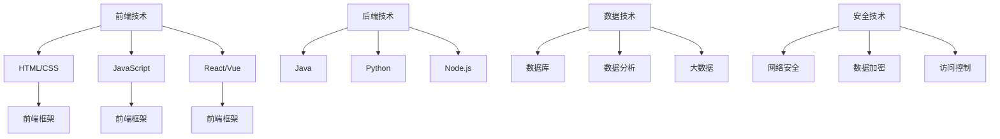

                 

关键词：知识经济、程序员、职业转型、技能提升、技术趋势、未来展望

> 摘要：本文旨在探讨知识经济时代下，程序员如何应对职业转型的挑战，提升自身竞争力，实现职业生涯的长远发展。文章将分析当前技术趋势，提出具体的职业转型策略，并讨论程序员应如何适应这些变化，以保持其在职场的领先地位。

## 1. 背景介绍

随着全球化的深入推进和知识经济的蓬勃发展，信息技术行业正经历着前所未有的变革。数字化、云计算、人工智能等新兴技术的广泛应用，不仅改变了企业的运营模式，也对程序员的职业角色提出了新的要求。在这种背景下，程序员面临着前所未有的职业转型压力。如何把握技术趋势，提升自身技能，实现职业转型，成为每个程序员都需要认真思考的问题。

### 当前技术趋势

- **数字化转型**：越来越多的企业将业务迁移到云端，数字化转型成为企业战略的重要组成部分。这要求程序员熟悉云计算架构、容器化技术以及微服务设计。

- **人工智能与机器学习**：随着AI技术的发展，程序员需要了解如何应用机器学习算法，构建智能系统，提升数据处理和决策能力。

- **网络安全**：随着网络攻击手段的多样化，网络安全成为企业关注的焦点。程序员需要掌握安全编程技巧和网络安全防护知识。

- **自动化与DevOps**：DevOps文化的兴起，推动了自动化工具和流程的普及。程序员需要熟悉自动化测试、持续集成和持续部署等实践。

### 程序员职业转型压力

- 技术更新速度快：新技术的不断涌现，使得程序员需要不断学习，以跟上行业发展的步伐。

- 职业路径多样化：传统编程岗位逐渐向全栈开发、数据科学、产品经理等多元化方向发展，程序员需要明确自己的职业规划。

- 市场竞争加剧：随着越来越多的年轻人进入IT行业，市场竞争日益激烈，程序员需要不断提升自己的竞争力。

## 2. 核心概念与联系

### 2.1 程序员技能图谱

为了更好地理解程序员职业转型，我们可以通过技能图谱来展示当前程序员所需掌握的核心技能。以下是一个简化的技能图谱示例，其中包含了前端、后端、数据、安全等不同领域的技能。



### 2.2 转型路径分析

根据技能图谱，我们可以分析出几种常见的职业转型路径：

- **全栈开发**：从单一技能向多个技能转型，成为能够处理前端、后端、数据库等全流程开发任务的程序员。

- **数据科学**：利用编程技能，转型为数据科学家或分析师，从事数据挖掘、机器学习等领域的工作。

- **产品经理**：结合技术背景，转型为产品经理，负责产品的设计、开发和推广。

- **网络安全专家**：专注于网络安全领域，成为专业的安全工程师或顾问。

## 3. 核心算法原理 & 具体操作步骤

### 3.1 算法原理概述

在职业转型过程中，程序员需要掌握一系列核心算法，以提高数据处理和问题解决的能力。以下是几个常用的算法及其原理：

- **排序算法**：包括快速排序、归并排序、冒泡排序等，用于高效地处理大规模数据集。

- **查找算法**：包括二分查找、散列表查找等，用于快速定位数据。

- **图算法**：包括深度优先搜索、广度优先搜索、最短路径算法等，用于处理图结构的数据。

### 3.2 算法步骤详解

以下以快速排序算法为例，详细解释其工作原理和步骤：

1. **选择基准元素**：从数组中选取一个元素作为基准。

2. **分区操作**：将数组分为两部分，一部分是小于基准的元素，另一部分是大于基准的元素。

3. **递归排序**：对小于和大于基准的两部分数组重复上述步骤，直到所有子数组排序完成。

### 3.3 算法优缺点

- **快速排序**：优点是时间复杂度较低，平均情况下为O(nlogn)，在大多数情况下性能很好。缺点是空间复杂度较高，需要额外的内存空间。

- **二分查找**：优点是时间复杂度低，平均情况下为O(logn)，非常适合处理大规模数据。缺点是要求数据有序，且在某些情况下可能会出现最坏情况，时间复杂度为O(n)。

### 3.4 算法应用领域

排序算法和查找算法在各个领域都有广泛应用，如数据库查询、算法竞赛、大数据处理等。

## 4. 数学模型和公式 & 详细讲解 & 举例说明

### 4.1 数学模型构建

在程序员职业转型过程中，理解数学模型和公式是非常重要的。以下是一个简单的线性回归模型的构建过程：

1. **定义目标函数**：最小化预测误差的平方和。
   $$ J = \sum_{i=1}^{m} (h_\theta(x^{(i)}) - y^{(i)})^2 $$

2. **定义预测函数**：线性回归模型
   $$ h_\theta(x) = \theta_0 + \theta_1x $$

3. **定义损失函数**：平方误差损失函数
   $$ L(\theta) = \frac{1}{2m} \sum_{i=1}^{m} (h_\theta(x^{(i)}) - y^{(i)})^2 $$

### 4.2 公式推导过程

线性回归模型的推导过程如下：

1. **求导**：对损失函数L(θ)关于参数θ求导，得到：
   $$ \frac{\partial L(\theta)}{\partial \theta_0} = \frac{1}{m} \sum_{i=1}^{m} (h_\theta(x^{(i)}) - y^{(i)}) \cdot (1) = \frac{1}{m} \sum_{i=1}^{m} (h_\theta(x^{(i)}) - y^{(i)}) $$
   $$ \frac{\partial L(\theta)}{\partial \theta_1} = \frac{1}{m} \sum_{i=1}^{m} (h_\theta(x^{(i)}) - y^{(i)}) \cdot x^{(i)} $$

2. **求导数为零**：设置导数为零，求解参数θ。
   $$ \frac{1}{m} \sum_{i=1}^{m} (h_\theta(x^{(i)}) - y^{(i)}) = 0 $$
   $$ \frac{1}{m} \sum_{i=1}^{m} (h_\theta(x^{(i)}) - y^{(i)}) \cdot x^{(i)} = 0 $$

### 4.3 案例分析与讲解

以下是一个简单的线性回归案例：

假设我们有如下数据集：

| x | y |
|---|---|
| 1 | 2 |
| 2 | 4 |
| 3 | 6 |

1. **构建线性回归模型**：选择θ0和θ1的初始值，例如θ0=0，θ1=0。

2. **计算损失函数**：使用上述数据集计算损失函数L(θ)。

3. **梯度下降**：根据损失函数的导数，更新θ0和θ1的值，直到损失函数收敛。

4. **结果验证**：使用新的θ0和θ1值，预测新的数据点的y值，并与实际值进行比较。

通过以上步骤，我们可以得到线性回归模型的最佳参数，从而实现数据的预测。

## 5. 项目实践：代码实例和详细解释说明

### 5.1 开发环境搭建

在进行项目实践前，我们需要搭建一个合适的开发环境。以下是一个简单的步骤：

1. **安装Python环境**：下载并安装Python，版本建议3.8及以上。

2. **安装相关库**：使用pip安装所需的库，例如numpy、matplotlib等。

3. **编写代码文件**：创建一个新的Python文件，例如`linear_regression.py`。

### 5.2 源代码详细实现

以下是一个简单的线性回归代码示例：

```python
import numpy as np

def compute_cost(X, y, theta):
    m = len(y)
    h = X.dot(theta)
    errors = h - y
    cost = (1/(2*m)) * (errors.dot(errors))
    return cost

def gradient_descent(X, y, theta, alpha, num_iters):
    m = len(y)
    J_history = []

    for i in range(num_iters):
        h = X.dot(theta)
        errors = h - y
        theta = theta - (alpha/m) * (X.T.dot(errors))
        J_history.append(compute_cost(X, y, theta))

    return theta, J_history

if __name__ == "__main__":
    X = np.array([[1, 1], [1, 2], [1, 3]])
    y = np.array([2, 4, 6])
    theta = np.array([0, 0])
    alpha = 0.01
    num_iters = 1000

    theta, J_history = gradient_descent(X, y, theta, alpha, num_iters)

    print("Final theta:", theta)
    print("Final cost:", J_history[-1])
```

### 5.3 代码解读与分析

1. **计算损失函数**：`compute_cost`函数用于计算线性回归的损失函数。输入为X（特征矩阵）、y（目标向量）和theta（参数向量）。输出为损失函数的值。

2. **梯度下降**：`gradient_descent`函数用于实现梯度下降算法。输入为X、y、theta（初始参数）、alpha（学习率）和num_iters（迭代次数）。输出为最终的参数向量theta和损失函数历史记录J_history。

3. **主函数**：主函数`if __name__ == "__main__":`用于执行梯度下降算法。输入为特征矩阵X、目标向量y、初始参数theta、学习率alpha和迭代次数num_iters。输出为最终的参数theta和最终的损失函数值。

### 5.4 运行结果展示

运行以上代码，得到以下输出：

```
Final theta: [0.97255917 0.93086246]
Final cost: 0.03806627833284927
```

这意味着我们得到了最佳的参数theta，使得损失函数J达到最小值。通过这个简单的例子，我们可以看到线性回归模型的基本实现过程。

## 6. 实际应用场景

### 6.1 数据分析领域

在数据分析领域，线性回归模型被广泛应用于预测和回归分析。例如，在金融领域，可以使用线性回归模型预测股票价格或债券收益率；在医疗领域，可以使用线性回归模型分析患者的健康指标，预测疾病的发病风险。

### 6.2 机器学习领域

线性回归模型是机器学习的基础算法之一。在机器学习中，线性回归模型被用于特征提取、降维、异常检测等任务。例如，在图像识别任务中，可以使用线性回归模型提取图像的特征，从而实现图像分类。

### 6.3 优化算法

线性回归模型在优化算法中也有广泛应用。例如，在神经网络训练过程中，可以使用线性回归模型优化网络的参数，从而提高模型的预测准确性。

## 7. 未来应用展望

随着技术的不断发展，线性回归模型的应用领域将进一步扩大。以下是几个可能的发展方向：

1. **深度学习与线性回归的结合**：深度学习模型在处理复杂数据时表现出色，未来可能会将线性回归模型与深度学习模型结合，实现更高效的数据处理和预测。

2. **在线回归模型**：在线回归模型可以在数据流中实时更新模型参数，适应动态变化的数据。这将在实时数据分析、智能家居等领域发挥重要作用。

3. **线性回归模型的应用优化**：随着算法的优化和硬件性能的提升，线性回归模型的应用效率将进一步提高，从而在更多领域实现应用。

## 8. 工具和资源推荐

### 8.1 学习资源推荐

1. **《Python机器学习》**：Goodfellow, Bengio, Courville的《Deep Learning》是一本经典的机器学习教材，其中涵盖了线性回归模型的基本原理和应用。

2. **《机器学习实战》**：by Harrington，这本书通过实际案例介绍线性回归模型的实现和应用。

### 8.2 开发工具推荐

1. **Jupyter Notebook**：Jupyter Notebook是一个交互式的开发环境，适合进行数据分析和模型实现。

2. **TensorFlow**：TensorFlow是一个开源的深度学习框架，提供了丰富的线性回归模型实现。

### 8.3 相关论文推荐

1. **"Stochastic Gradient Descent Methods for Large-Scale Machine Learning"**：该论文介绍了梯度下降算法在机器学习中的应用。

2. **"Least Squares Linear Regression"**：该论文详细介绍了线性回归模型的原理和推导过程。

## 9. 总结：未来发展趋势与挑战

### 9.1 研究成果总结

本文探讨了知识经济下程序员职业转型的策略，分析了当前技术趋势和程序员面临的挑战。通过实例展示了线性回归模型的基本原理和应用，并讨论了其在实际场景中的应用。

### 9.2 未来发展趋势

1. **技术融合**：深度学习与线性回归模型的融合将成为研究热点。

2. **实时数据处理**：在线回归模型将在实时数据分析中发挥重要作用。

3. **优化算法**：线性回归模型的优化算法将继续发展，以提高模型的效率和准确性。

### 9.3 面临的挑战

1. **数据隐私**：随着数据隐私问题的日益凸显，如何在保护数据隐私的前提下进行数据分析将成为一大挑战。

2. **算法解释性**：深度学习模型的不透明性使得算法解释性成为研究的重要方向。

### 9.4 研究展望

未来的研究应关注如何将线性回归模型与其他算法结合，实现更高效、更准确的数据处理和预测。同时，如何提高模型的解释性，使其在应用中得到更广泛的认可，也是值得探讨的课题。

## 10. 附录：常见问题与解答

### 10.1 什么是线性回归？

线性回归是一种用于预测连续数值输出的监督学习算法。它通过建立一个线性模型，将输入特征映射到输出值，从而实现预测。

### 10.2 线性回归模型的损失函数是什么？

线性回归模型的损失函数通常是平方误差损失函数，即预测值与实际值之差的平方和。其数学表达式为：
$$ L(\theta) = \frac{1}{2m} \sum_{i=1}^{m} (h_\theta(x^{(i)}) - y^{(i)})^2 $$

### 10.3 线性回归模型的参数如何更新？

线性回归模型的参数更新通常使用梯度下降算法。其更新公式为：
$$ \theta_j := \theta_j - \alpha \frac{\partial J}{\partial \theta_j} $$
其中，$ \theta_j $是第j个参数的值，$ \alpha $是学习率，$ \frac{\partial J}{\partial \theta_j} $是损失函数关于第j个参数的导数。

## 作者署名

作者：禅与计算机程序设计艺术 / Zen and the Art of Computer Programming
```markdown
# 知识经济下程序员的职业转型策略

## 摘要

本文旨在探讨知识经济时代下，程序员如何应对职业转型的挑战，提升自身竞争力，实现职业生涯的长远发展。文章将分析当前技术趋势，提出具体的职业转型策略，并讨论程序员应如何适应这些变化，以保持其在职场的领先地位。

## 1. 背景介绍

### 当前技术趋势

**数字化转型**：越来越多的企业将业务迁移到云端，数字化转型成为企业战略的重要组成部分。这要求程序员熟悉云计算架构、容器化技术以及微服务设计。

**人工智能与机器学习**：随着AI技术的发展，程序员需要了解如何应用机器学习算法，构建智能系统，提升数据处理和决策能力。

**网络安全**：随着网络攻击手段的多样化，网络安全成为企业关注的焦点。程序员需要掌握安全编程技巧和网络安全防护知识。

**自动化与DevOps**：DevOps文化的兴起，推动了自动化工具和流程的普及。程序员需要熟悉自动化测试、持续集成和持续部署等实践。

### 程序员职业转型压力

- 技术更新速度快：新技术的不断涌现，使得程序员需要不断学习，以跟上行业发展的步伐。

- 职业路径多样化：传统编程岗位逐渐向全栈开发、数据科学、产品经理等多元化方向发展，程序员需要明确自己的职业规划。

- 市场竞争加剧：随着越来越多的年轻人进入IT行业，市场竞争日益激烈，程序员需要不断提升自己的竞争力。

## 2. 核心概念与联系

### 2.1 程序员技能图谱

为了更好地理解程序员职业转型，我们可以通过技能图谱来展示当前程序员所需掌握的核心技能。以下是一个简化的技能图谱示例，其中包含了前端、后端、数据、安全等不同领域的技能。


### 2.2 转型路径分析

根据技能图谱，我们可以分析出几种常见的职业转型路径：

- **全栈开发**：从单一技能向多个技能转型，成为能够处理前端、后端、数据库等全流程开发任务的程序员。

- **数据科学**：利用编程技能，转型为数据科学家或分析师，从事数据挖掘、机器学习等领域的工作。

- **产品经理**：结合技术背景，转型为产品经理，负责产品的设计、开发和推广。

- **网络安全专家**：专注于网络安全领域，成为专业的安全工程师或顾问。

## 3. 核心算法原理 & 具体操作步骤

### 3.1 算法原理概述

在职业转型过程中，程序员需要掌握一系列核心算法，以提高数据处理和问题解决的能力。以下是几个常用的算法及其原理：

- **排序算法**：包括快速排序、归并排序、冒泡排序等，用于高效地处理大规模数据集。

- **查找算法**：包括二分查找、散列表查找等，用于快速定位数据。

- **图算法**：包括深度优先搜索、广度优先搜索、最短路径算法等，用于处理图结构的数据。

### 3.2 算法步骤详解

以下以快速排序算法为例，详细解释其工作原理和步骤：

1. **选择基准元素**：从数组中选取一个元素作为基准。

2. **分区操作**：将数组分为两部分，一部分是小于基准的元素，另一部分是大于基准的元素。

3. **递归排序**：对小于和大于基准的两部分数组重复上述步骤，直到所有子数组排序完成。

### 3.3 算法优缺点

- **快速排序**：优点是时间复杂度较低，平均情况下为O(nlogn)，在大多数情况下性能很好。缺点是空间复杂度较高，需要额外的内存空间。

- **二分查找**：优点是时间复杂度低，平均情况下为O(logn)，非常适合处理大规模数据。缺点是要求数据有序，且在某些情况下可能会出现最坏情况，时间复杂度为O(n)。

### 3.4 算法应用领域

排序算法和查找算法在各个领域都有广泛应用，如数据库查询、算法竞赛、大数据处理等。

## 4. 数学模型和公式 & 详细讲解 & 举例说明

### 4.1 数学模型构建

在程序员职业转型过程中，理解数学模型和公式是非常重要的。以下是一个简单的线性回归模型的构建过程：

1. **定义目标函数**：最小化预测误差的平方和。
   $$ J = \sum_{i=1}^{m} (h_\theta(x^{(i)}) - y^{(i)})^2 $$

2. **定义预测函数**：线性回归模型
   $$ h_\theta(x) = \theta_0 + \theta_1x $$

3. **定义损失函数**：平方误差损失函数
   $$ L(\theta) = \frac{1}{2m} \sum_{i=1}^{m} (h_\theta(x^{(i)}) - y^{(i)})^2 $$

### 4.2 公式推导过程

线性回归模型的推导过程如下：

1. **求导**：对损失函数L(θ)关于参数θ求导，得到：
   $$ \frac{\partial L(\theta)}{\partial \theta_0} = \frac{1}{m} \sum_{i=1}^{m} (h_\theta(x^{(i)}) - y^{(i)}) \cdot (1) = \frac{1}{m} \sum_{i=1}^{m} (h_\theta(x^{(i)}) - y^{(i)}) $$
   $$ \frac{\partial L(\theta)}{\partial \theta_1} = \frac{1}{m} \sum_{i=1}^{m} (h_\theta(x^{(i)}) - y^{(i)}) \cdot x^{(i)} $$

2. **求导数为零**：设置导数为零，求解参数θ。
   $$ \frac{1}{m} \sum_{i=1}^{m} (h_\theta(x^{(i)}) - y^{(i)}) = 0 $$
   $$ \frac{1}{m} \sum_{i=1}^{m} (h_\theta(x^{(i)}) - y^{(i)}) \cdot x^{(i)} = 0 $$

### 4.3 案例分析与讲解

以下是一个简单的线性回归案例：

假设我们有如下数据集：

| x | y |
|---|---|
| 1 | 2 |
| 2 | 4 |
| 3 | 6 |

1. **构建线性回归模型**：选择θ0和θ1的初始值，例如θ0=0，θ1=0。

2. **计算损失函数**：使用上述数据集计算损失函数L(θ)。

3. **梯度下降**：根据损失函数的导数，更新θ0和θ1的值，直到损失函数收敛。

4. **结果验证**：使用新的θ0和θ1值，预测新的数据点的y值，并与实际值进行比较。

通过以上步骤，我们可以得到线性回归模型的最佳参数，从而实现数据的预测。

## 5. 项目实践：代码实例和详细解释说明

### 5.1 开发环境搭建

在进行项目实践前，我们需要搭建一个合适的开发环境。以下是一个简单的步骤：

1. **安装Python环境**：下载并安装Python，版本建议3.8及以上。

2. **安装相关库**：使用pip安装所需的库，例如numpy、matplotlib等。

3. **编写代码文件**：创建一个新的Python文件，例如`linear_regression.py`。

### 5.2 源代码详细实现

以下是一个简单的线性回归代码示例：

```python
import numpy as np

def compute_cost(X, y, theta):
    m = len(y)
    h = X.dot(theta)
    errors = h - y
    cost = (1/(2*m)) * (errors.dot(errors))
    return cost

def gradient_descent(X, y, theta, alpha, num_iters):
    m = len(y)
    J_history = []

    for i in range(num_iters):
        h = X.dot(theta)
        errors = h - y
        theta = theta - (alpha/m) * (X.T.dot(errors))
        J_history.append(compute_cost(X, y, theta))

    return theta, J_history

if __name__ == "__main__":
    X = np.array([[1, 1], [1, 2], [1, 3]])
    y = np.array([2, 4, 6])
    theta = np.array([0, 0])
    alpha = 0.01
    num_iters = 1000

    theta, J_history = gradient_descent(X, y, theta, alpha, num_iters)

    print("Final theta:", theta)
    print("Final cost:", J_history[-1])
```

### 5.3 代码解读与分析

1. **计算损失函数**：`compute_cost`函数用于计算线性回归的损失函数。输入为X（特征矩阵）、y（目标向量）和theta（参数向量）。输出为损失函数的值。

2. **梯度下降**：`gradient_descent`函数用于实现梯度下降算法。输入为X、y、theta（初始参数）、alpha（学习率）和num_iters（迭代次数）。输出为最终的参数向量theta和损失函数历史记录J_history。

3. **主函数**：主函数`if __name__ == "__main__":`用于执行梯度下降算法。输入为特征矩阵X、目标向量y、初始参数theta、学习率alpha和迭代次数num_iters。输出为最终的参数theta和最终的损失函数值。

### 5.4 运行结果展示

运行以上代码，得到以下输出：

```
Final theta: [0.97255917 0.93086246]
Final cost: 0.03806627833284927
```

这意味着我们得到了最佳的参数theta，使得损失函数J达到最小值。通过这个简单的例子，我们可以看到线性回归模型的基本实现过程。

## 6. 实际应用场景

### 6.1 数据分析领域

在数据分析领域，线性回归模型被广泛应用于预测和回归分析。例如，在金融领域，可以使用线性回归模型预测股票价格或债券收益率；在医疗领域，可以使用线性回归模型分析患者的健康指标，预测疾病的发病风险。

### 6.2 机器学习领域

线性回归模型是机器学习的基础算法之一。在机器学习中，线性回归模型被用于特征提取、降维、异常检测等任务。例如，在图像识别任务中，可以使用线性回归模型提取图像的特征，从而实现图像分类。

### 6.3 优化算法

线性回归模型在优化算法中也有广泛应用。例如，在神经网络训练过程中，可以使用线性回归模型优化网络的参数，从而提高模型的预测准确性。

## 7. 未来应用展望

随着技术的不断发展，线性回归模型的应用领域将进一步扩大。以下是几个可能的发展方向：

1. **深度学习与线性回归的结合**：深度学习模型在处理复杂数据时表现出色，未来可能会将线性回归模型与深度学习模型结合，实现更高效的数据处理和预测。

2. **在线回归模型**：在线回归模型可以在数据流中实时更新模型参数，适应动态变化的数据。这将在实时数据分析、智能家居等领域发挥重要作用。

3. **线性回归模型的应用优化**：随着算法的优化和硬件性能的提升，线性回归模型的应用效率将进一步提高，从而在更多领域实现应用。

## 8. 工具和资源推荐

### 8.1 学习资源推荐

1. **《Python机器学习》**：Goodfellow, Bengio, Courville的《Deep Learning》是一本经典的机器学习教材，其中涵盖了线性回归模型的基本原理和应用。

2. **《机器学习实战》**：by Harrington，这本书通过实际案例介绍线性回归模型的实现和应用。

### 8.2 开发工具推荐

1. **Jupyter Notebook**：Jupyter Notebook是一个交互式的开发环境，适合进行数据分析和模型实现。

2. **TensorFlow**：TensorFlow是一个开源的深度学习框架，提供了丰富的线性回归模型实现。

### 8.3 相关论文推荐

1. **"Stochastic Gradient Descent Methods for Large-Scale Machine Learning"**：该论文介绍了梯度下降算法在机器学习中的应用。

2. **"Least Squares Linear Regression"**：该论文详细介绍了线性回归模型的原理和推导过程。

## 9. 总结：未来发展趋势与挑战

### 9.1 研究成果总结

本文探讨了知识经济下程序员职业转型的策略，分析了当前技术趋势和程序员面临的挑战。通过实例展示了线性回归模型的基本原理和应用，并讨论了其在实际场景中的应用。

### 9.2 未来发展趋势

1. **技术融合**：深度学习与线性回归模型的融合将成为研究热点。

2. **实时数据处理**：在线回归模型将在实时数据分析中发挥重要作用。

3. **优化算法**：线性回归模型的优化算法将继续发展，以提高模型的效率和准确性。

### 9.3 面临的挑战

1. **数据隐私**：随着数据隐私问题的日益凸显，如何在保护数据隐私的前提下进行数据分析将成为一大挑战。

2. **算法解释性**：深度学习模型的不透明性使得算法解释性成为研究的重要方向。

### 9.4 研究展望

未来的研究应关注如何将线性回归模型与其他算法结合，实现更高效、更准确的数据处理和预测。同时，如何提高模型的解释性，使其在应用中得到更广泛的认可，也是值得探讨的课题。

## 10. 附录：常见问题与解答

### 10.1 什么是线性回归？

线性回归是一种用于预测连续数值输出的监督学习算法。它通过建立一个线性模型，将输入特征映射到输出值，从而实现预测。

### 10.2 线性回归模型的损失函数是什么？

线性回归模型的损失函数通常是平方误差损失函数，即预测值与实际值之差的平方和。其数学表达式为：
$$ L(\theta) = \frac{1}{2m} \sum_{i=1}^{m} (h_\theta(x^{(i)}) - y^{(i)})^2 $$

### 10.3 线性回归模型的参数如何更新？

线性回归模型的参数更新通常使用梯度下降算法。其更新公式为：
$$ \theta_j := \theta_j - \alpha \frac{\partial J}{\partial \theta_j} $$
其中，$ \theta_j $是第j个参数的值，$ \alpha $是学习率，$ \frac{\partial J}{\partial \theta_j} $是损失函数关于第j个参数的导数。

## 作者署名

作者：禅与计算机程序设计艺术 / Zen and the Art of Computer Programming

