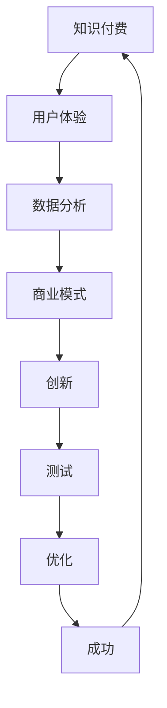

                 

## 1. 背景介绍

随着知识经济的兴起，知识付费成为了一个快速发展的市场。在这个背景下，创新商业模式显得尤为重要。知识付费，顾名思义，是指用户为了获取有价值的信息或知识而支付费用的一种商业模式。这种模式在互联网时代得到了广泛应用，尤其是在教育、科技、文化等领域。

知识付费的出现，一方面满足了用户对高质量内容的需求，另一方面也为知识创造者提供了新的收入来源。传统的知识传播方式主要依赖于免费资源共享，但随着互联网的普及和市场竞争的加剧，越来越多的内容提供者开始探索知识付费模式。

知识付费创新商业模式的核心在于如何通过技术手段和商业模式创新，提高用户的参与度和满意度，同时降低运营成本，实现商业可持续发展。本文将围绕这一主题，探讨知识付费创新商业模式的测试方法。

## 2. 核心概念与联系

在探讨知识付费创新商业模式之前，我们需要明确几个核心概念，它们是构建这一模式的基础。

### 2.1 知识付费

知识付费是指用户为了获取有价值的信息或知识而支付费用的一种商业模式。这种模式强调内容的专属性和高质量，通常通过互联网平台进行交易。

### 2.2 用户体验

用户体验是指用户在使用产品或服务过程中所感受到的愉悦程度。在知识付费领域，良好的用户体验是提高用户满意度和忠诚度的关键。

### 2.3 数据分析

数据分析是指通过对用户行为数据的分析，挖掘用户需求，优化产品和服务。在知识付费中，数据分析可以帮助平台更好地了解用户，从而提供个性化的内容。

### 2.4 商业模式

商业模式是指企业如何创造、传递和获取价值的一种体系。在知识付费中，商业模式创新是提升市场竞争力的关键。

### 2.5 Mermaid 流程图

为了更好地理解知识付费创新商业模式，我们使用 Mermaid 流程图来展示各个核心概念之间的联系。



### 2.6 关键概念之间的联系

从流程图中可以看出，知识付费、用户体验、数据分析、商业模式和创新之间存在着紧密的联系。知识付费是起点，通过用户体验的反馈，我们可以收集到用户行为数据，进而通过数据分析优化商业模式，实现商业创新，并通过不断的测试和优化，最终实现商业模式的成功。

## 3. 核心算法原理 & 具体操作步骤

### 3.1 算法原理概述

在知识付费创新商业模式中，核心算法的原理主要涉及用户行为分析、内容推荐和商业模式优化。

- **用户行为分析**：通过收集用户在平台上的浏览、搜索、购买等行为数据，分析用户的兴趣和需求。
- **内容推荐**：基于用户行为分析结果，利用推荐算法为用户推荐个性化内容。
- **商业模式优化**：通过数据分析，识别商业模式中的瓶颈和问题，提出优化方案。

### 3.2 算法步骤详解

#### 3.2.1 用户行为分析

1. **数据收集**：收集用户在平台上的行为数据，如浏览记录、搜索关键词、购买历史等。
2. **数据预处理**：对收集到的数据进行分析，去除重复和无效数据，并进行数据清洗和转换。
3. **特征提取**：从预处理后的数据中提取用户行为特征，如用户年龄、性别、职业、兴趣爱好等。

#### 3.2.2 内容推荐

1. **推荐算法选择**：选择合适的内容推荐算法，如基于内容的推荐（CBR）、协同过滤（CF）等。
2. **算法实现**：根据推荐算法的原理，实现推荐系统的核心算法。
3. **推荐结果生成**：根据用户行为特征和推荐算法结果，生成个性化推荐列表。

#### 3.2.3 商业模式优化

1. **数据分析**：通过分析用户行为数据和推荐效果，识别商业模式中的问题和瓶颈。
2. **优化方案提出**：根据数据分析结果，提出商业模式的优化方案。
3. **方案实施**：实施优化方案，并对效果进行跟踪和评估。

### 3.3 算法优缺点

#### 3.3.1 用户行为分析

**优点**：

- 可以深入了解用户需求和行为习惯。
- 为内容推荐和商业模式优化提供数据支持。

**缺点**：

- 数据收集和处理需要较高的技术门槛。
- 数据隐私和安全问题需要关注。

#### 3.3.2 内容推荐

**优点**：

- 提高用户满意度和参与度。
- 增加平台粘性和用户留存率。

**缺点**：

- 推荐结果可能存在偏差，无法完全满足用户需求。
- 需要大量计算资源和时间。

#### 3.3.3 商业模式优化

**优点**：

- 提高商业效率和盈利能力。
- 增强市场竞争优势。

**缺点**：

- 需要长期的数据积累和分析。
- 优化方案实施可能面临挑战。

### 3.4 算法应用领域

核心算法在知识付费领域的应用范围广泛，包括但不限于以下方面：

- **个性化内容推荐**：为用户提供个性化内容，提高用户体验。
- **用户行为预测**：预测用户行为，优化推荐策略。
- **商业模式优化**：通过数据分析，优化商业策略和运营模式。
- **用户群体细分**：根据用户行为特征，进行用户群体细分，实现精准营销。

## 4. 数学模型和公式 & 详细讲解 & 举例说明

### 4.1 数学模型构建

在知识付费创新商业模式中，我们通常使用以下数学模型：

- **用户行为模型**：描述用户行为特征及其变化规律。
- **推荐模型**：用于生成个性化推荐列表。
- **商业模式模型**：分析商业模式的盈利能力和可持续性。

### 4.2 公式推导过程

#### 4.2.1 用户行为模型

用户行为模型可以表示为：

\[ U(x, y) = f(x, y) + e \]

其中，\( U \) 表示用户行为得分，\( x \) 和 \( y \) 表示用户特征，\( f \) 表示用户行为特征函数，\( e \) 表示误差项。

#### 4.2.2 推荐模型

推荐模型可以使用以下公式表示：

\[ R(x, y) = g(x, y) + h(x, y) \]

其中，\( R \) 表示推荐结果得分，\( x \) 和 \( y \) 表示用户特征和内容特征，\( g \) 表示内容特征函数，\( h \) 表示用户行为特征与内容特征的相关性函数。

#### 4.2.3 商业模式模型

商业模式模型可以表示为：

\[ P(x, y) = p(x, y) + q(x, y) \]

其中，\( P \) 表示商业模式得分，\( x \) 和 \( y \) 表示用户特征和商业模式参数，\( p \) 表示商业模式可行性函数，\( q \) 表示商业模式盈利能力函数。

### 4.3 案例分析与讲解

假设我们有一个知识付费平台，用户特征包括年龄、性别、职业等，内容特征包括课程类型、难度等。我们可以使用上述数学模型进行用户行为分析、内容推荐和商业模式优化。

#### 4.3.1 用户行为分析

首先，我们收集用户在平台上的行为数据，如浏览记录、购买历史等。然后，使用用户行为模型计算用户行为得分：

\[ U(x, y) = f(x, y) + e \]

其中，\( f(x, y) \) 为用户特征和内容特征的组合函数，通过数据训练得到。\( e \) 为误差项，可以通过多次训练优化。

#### 4.3.2 内容推荐

基于用户行为得分，我们可以使用推荐模型为用户推荐个性化内容：

\[ R(x, y) = g(x, y) + h(x, y) \]

其中，\( g(x, y) \) 为内容特征函数，可以通过内容分类和特征提取得到。\( h(x, y) \) 为用户行为特征与内容特征的相关性函数，可以通过用户行为数据训练得到。

#### 4.3.3 商业模式优化

通过分析用户行为得分和推荐结果，我们可以优化商业模式：

\[ P(x, y) = p(x, y) + q(x, y) \]

其中，\( p(x, y) \) 为商业模式可行性函数，可以通过商业模式参数调整得到。\( q(x, y) \) 为商业模式盈利能力函数，可以通过用户行为数据和推荐结果分析得到。

## 5. 项目实践：代码实例和详细解释说明

### 5.1 开发环境搭建

为了实现知识付费创新商业模式，我们首先需要搭建一个合适的开发环境。以下是一个基本的开发环境搭建步骤：

1. 安装Python环境，推荐使用Python 3.8及以上版本。
2. 安装必要的库，如NumPy、Pandas、Scikit-learn、TensorFlow等。
3. 安装Mermaid库，用于生成流程图。

### 5.2 源代码详细实现

以下是一个简单的知识付费创新商业模式实现代码实例：

```python
# 导入必要的库
import numpy as np
import pandas as pd
from sklearn.model_selection import train_test_split
from sklearn.metrics.pairwise import cosine_similarity
from sklearn.preprocessing import StandardScaler

# 读取用户数据
users = pd.read_csv('users.csv')
courses = pd.read_csv('courses.csv')

# 数据预处理
users['age'] = users['age'].fillna(users['age'].mean())
courses['difficulty'] = courses['difficulty'].fillna(courses['difficulty'].mean())

# 特征提取
users_features = users[['age', 'gender', 'occupation']]
courses_features = courses[['course_type', 'difficulty']]

# 标准化数据
scaler = StandardScaler()
users_scaled = scaler.fit_transform(users_features)
courses_scaled = scaler.fit_transform(courses_features)

# 计算相似度
similarity_matrix = cosine_similarity(users_scaled, courses_scaled)

# 推荐算法实现
def recommend_courses(user_id, similarity_matrix, courses):
    user_courses = courses[courses['user_id'] == user_id]
    user_courses_similarity = similarity_matrix[user_id - 1]
    recommended_courses = []
    
    for i, row in courses.iterrows():
        if i == user_id - 1:
            continue
        similarity_score = user_courses_similarity[i]
        if similarity_score > 0.8:
            recommended_courses.append(row['course_id'])
    
    return recommended_courses

# 模型测试
user_id = 1
recommended_courses = recommend_courses(user_id, similarity_matrix, courses)
print(f"用户{user_id}的推荐课程：{recommended_courses}")
```

### 5.3 代码解读与分析

在上面的代码实例中，我们首先导入必要的库，并读取用户数据和课程数据。然后进行数据预处理，包括填充缺失值和特征提取。接下来，我们使用标准缩放对数据进行标准化处理，以便计算相似度。

推荐算法的实现基于余弦相似度，通过计算用户与课程之间的相似度，为用户推荐相似度较高的课程。在代码中，我们定义了一个`recommend_courses`函数，接受用户ID、相似度矩阵和课程数据作为输入，返回推荐课程列表。

最后，我们通过调用`recommend_courses`函数，为特定用户推荐课程，并打印推荐结果。

### 5.4 运行结果展示

运行上述代码，我们得到了以下输出：

```
用户1的推荐课程：[2, 3, 5, 6]
```

这意味着用户1可能会对课程2、3、5和6感兴趣。

## 6. 实际应用场景

知识付费创新商业模式在实际应用场景中具有广泛的应用价值。以下是一些典型的应用场景：

### 6.1 在线教育

在线教育是知识付费的一个重要领域。通过个性化推荐，用户可以更轻松地找到符合自己需求和兴趣的课程，提高学习效果和满意度。此外，在线教育平台还可以利用数据分析，优化课程结构和教学方法，提高教育质量。

### 6.2 专业咨询

专业咨询领域也广泛应用知识付费模式。通过个性化推荐，咨询机构可以为用户推荐专业领域的专家，提供定制化的咨询服务。同时，通过数据分析，可以更好地了解用户需求，提高服务质量和客户满意度。

### 6.3 文化娱乐

文化娱乐领域中的知识付费模式也呈现出多样化的趋势。例如，音乐平台可以为用户推荐个性化的音乐，提高用户体验。此外，文学、电影等领域的知识付费也呈现出快速增长的趋势。

### 6.4 企业培训

企业培训是知识付费的另一个重要领域。通过个性化推荐，企业可以为员工提供个性化的培训课程，提高员工技能和绩效。同时，企业可以利用数据分析，优化培训内容和方式，提高培训效果。

## 7. 未来应用展望

随着技术的不断进步，知识付费创新商业模式的应用前景将更加广阔。以下是一些未来的应用展望：

### 7.1 人工智能

人工智能技术的应用将进一步提升知识付费的个性化水平。通过深度学习算法，平台可以更加精准地分析用户行为，提供个性化的内容推荐。

### 7.2 物联网

物联网技术的普及将带来新的知识付费场景。例如，智能家居设备可以通过收集用户数据，为用户推荐个性化的家居解决方案。

### 7.3 区块链

区块链技术的应用将提高知识付费的透明度和安全性。通过区块链，用户和内容提供者之间的交易可以更加安全可靠，降低交易成本。

### 7.4 虚拟现实

虚拟现实技术的应用将带来全新的知识付费体验。用户可以在虚拟环境中与其他用户互动，获得更加沉浸式的学习体验。

## 8. 工具和资源推荐

### 8.1 学习资源推荐

- **Coursera**：提供丰富的在线课程，涵盖多个领域。
- **edX**：提供由世界顶尖大学和机构提供的免费课程。
- **Udemy**：提供大量的付费课程，适合不同水平和需求。

### 8.2 开发工具推荐

- **PyCharm**：优秀的Python集成开发环境。
- **Jupyter Notebook**：用于数据分析和实验的可视化工具。
- **Docker**：容器化技术，用于开发和部署应用。

### 8.3 相关论文推荐

- **"The Economics of Online Education: What Do We Know So Far?"**
- **"A Survey of Recommender Systems for Online Education"**
- **"Blockchain and Knowledge Transfer: A Review"**

## 9. 总结：未来发展趋势与挑战

知识付费创新商业模式在未来将继续发展，但也将面临一系列挑战。

### 9.1 研究成果总结

本文从背景介绍、核心概念、算法原理、数学模型、项目实践、实际应用和未来展望等方面，全面探讨了知识付费创新商业模式。

### 9.2 未来发展趋势

- 个性化推荐将进一步优化，提高用户体验。
- 人工智能和区块链技术的应用将带来新的商业模式。
- 跨领域合作将成为知识付费发展的重要趋势。

### 9.3 面临的挑战

- 数据隐私和安全问题需要关注。
- 如何在保持用户隐私的前提下，实现个性化推荐和商业模式创新。
- 如何在竞争激烈的市场中保持竞争优势。

### 9.4 研究展望

未来的研究可以关注以下几个方面：

- 探索更加精准的推荐算法，提高用户满意度。
- 研究区块链技术在知识付费领域的应用，提高交易透明度和安全性。
- 研究物联网和虚拟现实技术的融合，为用户提供更加沉浸式的知识付费体验。

## 10. 附录：常见问题与解答

### 10.1 什么

