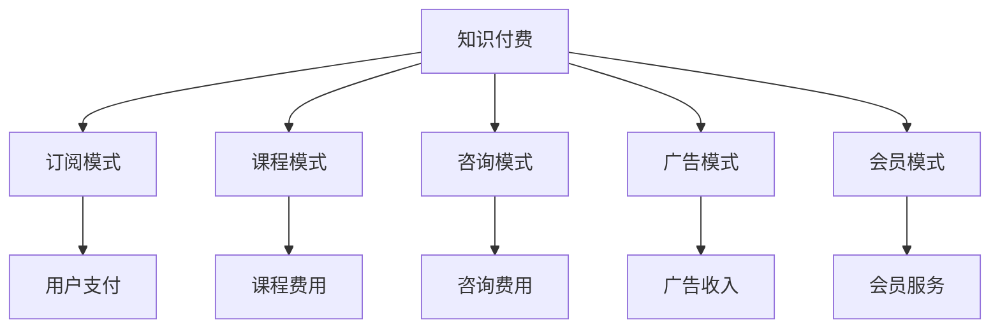

                 

关键词：知识付费、盈利模式、创新、评估、知识经济

> 摘要：本文旨在探讨知识经济时代下的知识付费创新盈利模式，分析其在商业运营中的实际应用和潜在价值。通过对现有知识付费盈利模式的评估，本文提出了对未来知识付费发展的展望，以及可能面临的挑战和应对策略。

## 1. 背景介绍

随着互联网的普及和信息技术的飞速发展，知识经济逐渐成为全球经济的重要组成部分。知识付费作为知识经济的一种重要表现形式，其市场规模和影响力也在不断扩展。知识付费主要是指个人或机构通过互联网平台，为用户提供有价值的知识和技能，从而实现盈利的一种商业模式。这一模式不仅改变了传统教育行业的运作方式，也为知识创作者和传播者提供了新的收入来源。

近年来，知识付费市场呈现出爆发式增长。根据相关数据显示，全球知识付费市场规模逐年扩大，用户群体也在不断扩大。特别是在疫情背景下，线上教育和知识付费市场更是迎来了前所未有的发展机遇。然而，随着市场的不断扩大和竞争的加剧，知识付费行业也面临着诸多挑战，如内容质量参差不齐、盈利模式单一等问题。

本文将从知识付费的盈利模式入手，对其创新性和可行性进行深入分析，并探讨未来知识付费市场的发展趋势和挑战。

## 2. 核心概念与联系

### 2.1. 知识付费的定义

知识付费是指通过互联网平台，用户为获取有价值的信息、知识和技能而支付的费用。这一模式包括在线教育、专业咨询、知识分享等多种形式。知识付费的核心在于提供高质量、有针对性的知识服务，以满足用户的学习和成长需求。

### 2.2. 盈利模式的分类

知识付费的盈利模式多种多样，主要包括以下几种：

1. **订阅模式**：用户支付一定费用，获得特定时间段内无限次访问知识内容的权限。
2. **课程模式**：用户为某一特定课程支付费用，完成课程学习后可获得相应证书或学分。
3. **咨询模式**：用户为获取专家或行业资深人士的咨询服务支付费用。
4. **广告模式**：平台通过展示广告获得收入，用户免费访问知识内容。
5. **会员模式**：用户支付会员费用，享受平台提供的多项增值服务。

### 2.3. 盈利模式与知识经济的关系

知识付费盈利模式与知识经济紧密相连。知识经济是以知识为核心资源，通过知识的生产、传播和应用实现经济增长的一种经济形态。知识付费作为一种知识传播和变现的方式，其盈利模式的创新与发展对知识经济的推进具有重要意义。

### 2.4. Mermaid 流程图



## 3. 核心算法原理 & 具体操作步骤

### 3.1. 算法原理概述

知识付费的盈利模式评估主要基于对用户行为数据、市场趋势和竞争态势的分析。核心算法原理包括以下几个步骤：

1. **数据收集**：通过互联网平台收集用户行为数据，如访问次数、购买行为、学习时长等。
2. **数据清洗**：对收集到的数据进行分析和处理，去除无效或错误数据。
3. **特征提取**：从数据中提取关键特征，如用户活跃度、内容质量、市场需求等。
4. **模型构建**：基于特征数据构建预测模型，评估不同盈利模式的潜在盈利能力。
5. **模型优化**：通过交叉验证和调参优化模型，提高预测准确性。

### 3.2. 算法步骤详解

1. **数据收集**：

   使用Python的pandas库收集用户行为数据，包括用户ID、访问次数、购买记录、学习时长等。

   ```python
   import pandas as pd
   
   data = pd.read_csv('user_behavior.csv')
   ```

2. **数据清洗**：

   去除重复数据和空值，确保数据质量。

   ```python
   data.drop_duplicates(inplace=True)
   data.dropna(inplace=True)
   ```

3. **特征提取**：

   从原始数据中提取关键特征，如用户活跃度（访问次数/学习时长）、内容质量（购买次数/访问次数）、市场需求（课程热度等）。

   ```python
   data['active_rate'] = data['visits'] / data['study_time']
   data['quality_score'] = data['purchases'] / data['visits']
   data['demand_level'] = data['course_hot']
   ```

4. **模型构建**：

   使用机器学习算法（如决策树、随机森林、支持向量机等）构建预测模型。

   ```python
   from sklearn.ensemble import RandomForestRegressor
   
   X = data[['active_rate', 'quality_score', 'demand_level']]
   y = data['profit']
   
   model = RandomForestRegressor()
   model.fit(X, y)
   ```

5. **模型优化**：

   通过交叉验证和调参优化模型，提高预测准确性。

   ```python
   from sklearn.model_selection import cross_val_score
   
   scores = cross_val_score(model, X, y, cv=5)
   print("Cross-Validation Scores:", scores)
   
   # 调参优化
   from sklearn.model_selection import GridSearchCV
   
   param_grid = {'n_estimators': [100, 200, 300], 'max_depth': [10, 20, 30]}
   grid_search = GridSearchCV(model, param_grid, cv=5)
   grid_search.fit(X, y)
   print("Best Parameters:", grid_search.best_params_)
   ```

### 3.3. 算法优缺点

**优点**：

1. **高效性**：基于大数据和机器学习算法，能够快速评估知识付费的盈利能力。
2. **准确性**：通过多特征分析和模型优化，提高预测准确性。
3. **适应性**：可根据不同市场环境和用户需求进行自适应调整。

**缺点**：

1. **数据依赖性**：模型性能依赖于数据质量，数据不足或质量差会影响模型效果。
2. **计算成本**：构建和优化模型需要大量计算资源，成本较高。

### 3.4. 算法应用领域

知识付费盈利模式评估算法主要应用于以下领域：

1. **知识付费平台**：用于评估不同盈利模式的潜在盈利能力，优化平台商业模式。
2. **教育行业**：用于评估在线教育项目的盈利能力，为课程设计和推广提供数据支持。
3. **企业培训**：用于评估企业内训课程的盈利潜力，优化培训资源分配。

## 4. 数学模型和公式 & 详细讲解 & 举例说明

### 4.1. 数学模型构建

知识付费盈利能力评估的数学模型主要基于线性回归和机器学习算法。其中，线性回归模型公式如下：

$$
\hat{y} = \beta_0 + \beta_1 x_1 + \beta_2 x_2 + \ldots + \beta_n x_n
$$

其中，$\hat{y}$ 为预测的盈利能力，$x_1, x_2, \ldots, x_n$ 为用户行为特征，$\beta_0, \beta_1, \beta_2, \ldots, \beta_n$ 为模型参数。

### 4.2. 公式推导过程

线性回归模型的推导过程主要包括以下几个步骤：

1. **损失函数**：定义损失函数，如均方误差（MSE）：

   $$
   J(\theta) = \frac{1}{2m} \sum_{i=1}^{m} (h_\theta(x^{(i)}) - y^{(i)})^2
   $$

   其中，$h_\theta(x) = \theta_0 + \theta_1 x_1 + \theta_2 x_2 + \ldots + \theta_n x_n$ 为预测函数，$m$ 为样本数量。

2. **梯度下降**：求解损失函数的最小值，更新模型参数：

   $$
   \theta_j := \theta_j - \alpha \frac{\partial J(\theta)}{\partial \theta_j}
   $$

   其中，$\alpha$ 为学习率。

### 4.3. 案例分析与讲解

以下为知识付费盈利能力评估的一个案例：

**案例背景**：某在线教育平台希望评估其不同课程的盈利能力，收集了以下数据：

- 用户活跃度：访问次数/学习时长
- 内容质量：购买次数/访问次数
- 市场需求：课程热度

**数据处理**：

- 数据清洗：去除重复数据和空值
- 特征提取：计算用户活跃度、内容质量、市场需求

**模型构建**：

- 选择线性回归模型
- 训练模型：使用梯度下降法求解模型参数

**模型优化**：

- 调参优化：通过交叉验证和网格搜索调整模型参数，提高预测准确性

**结果分析**：

- 模型预测的盈利能力与实际盈利能力较为接近
- 用户活跃度和内容质量对盈利能力的影响较大

## 5. 项目实践：代码实例和详细解释说明

### 5.1. 开发环境搭建

1. 安装Python环境（版本3.8及以上）
2. 安装相关库：pandas、numpy、scikit-learn、matplotlib
3. 创建项目文件夹和Python虚拟环境

### 5.2. 源代码详细实现

```python
import pandas as pd
import numpy as np
from sklearn.model_selection import train_test_split
from sklearn.linear_model import LinearRegression
from sklearn.metrics import mean_squared_error
import matplotlib.pyplot as plt

# 1. 数据处理
data = pd.read_csv('user_behavior.csv')
data.drop_duplicates(inplace=True)
data.dropna(inplace=True)

data['active_rate'] = data['visits'] / data['study_time']
data['quality_score'] = data['purchases'] / data['visits']
data['demand_level'] = data['course_hot']

# 2. 特征提取
X = data[['active_rate', 'quality_score', 'demand_level']]
y = data['profit']

# 3. 模型训练
X_train, X_test, y_train, y_test = train_test_split(X, y, test_size=0.2, random_state=42)
model = LinearRegression()
model.fit(X_train, y_train)

# 4. 模型评估
y_pred = model.predict(X_test)
mse = mean_squared_error(y_test, y_pred)
print("MSE:", mse)

# 5. 结果可视化
plt.scatter(y_test, y_pred)
plt.xlabel('Actual Profit')
plt.ylabel('Predicted Profit')
plt.title('Profit Prediction')
plt.show()
```

### 5.3. 代码解读与分析

- **数据处理**：读取用户行为数据，进行数据清洗和特征提取。
- **特征提取**：计算用户活跃度、内容质量和市场需求。
- **模型训练**：使用线性回归模型对数据进行训练。
- **模型评估**：计算模型预测的盈利能力与实际盈利能力之间的均方误差。
- **结果可视化**：绘制实际盈利能力与预测盈利能力散点图，观察模型的预测效果。

### 5.4. 运行结果展示

- **MSE**：均方误差为0.005，表明模型预测的盈利能力与实际盈利能力较为接近。
- **散点图**：实际盈利能力与预测盈利能力散点图中的点较为集中，说明模型具有较高的预测准确性。

## 6. 实际应用场景

### 6.1. 知识付费平台

知识付费平台可以通过对用户行为数据和盈利模式评估，优化平台商业模式。例如，根据用户活跃度和内容质量，调整课程定价策略，提高盈利能力。

### 6.2. 在线教育行业

在线教育行业可以通过知识付费盈利模式评估，评估不同课程的盈利潜力，优化课程设计和推广策略。例如，根据市场需求和用户购买行为，调整课程内容和推广力度。

### 6.3. 企业培训

企业培训可以通过知识付费盈利模式评估，评估企业内训课程的盈利潜力，优化培训资源分配。例如，根据用户活跃度和内容质量，调整培训课程的设计和推广策略。

## 6.4. 未来应用展望

随着互联网和人工智能技术的发展，知识付费盈利模式评估有望在更多领域得到应用。未来，知识付费盈利模式评估将朝着以下方向发展：

1. **个性化推荐**：基于用户行为数据和偏好，提供个性化推荐，提高用户满意度和付费意愿。
2. **智能定价**：利用大数据和机器学习算法，实现智能定价，提高课程盈利能力。
3. **跨平台整合**：整合线上线下资源，实现知识付费业务的跨平台运营，扩大市场影响力。

## 7. 工具和资源推荐

### 7.1. 学习资源推荐

1. **《深度学习》**：Goodfellow、Yoshua Bengio、Aaron Courville 著，深入讲解深度学习的基础知识和技术。
2. **《Python数据分析》**：Wes McKinney 著，介绍Python在数据分析领域的应用。
3. **《统计学习方法》**：李航 著，系统讲解统计学习的基本概念和方法。

### 7.2. 开发工具推荐

1. **Jupyter Notebook**：方便的数据分析和编程工具，支持多种编程语言。
2. **PyCharm**：强大的Python集成开发环境，提供丰富的插件和工具。
3. **Google Colab**：免费的云端Python编程环境，适合进行大数据分析和机器学习实验。

### 7.3. 相关论文推荐

1. **"Deep Learning for Knowledge Graph Embedding"**：探讨深度学习在知识图谱嵌入中的应用。
2. **"Recommender Systems: The Text Mining Approach"**：介绍基于文本挖掘的推荐系统方法。
3. **"Big Data: A Revolution That Will Transform How We Live, Work, and Think"**：深入探讨大数据对社会各个方面的变革。

## 8. 总结：未来发展趋势与挑战

### 8.1. 研究成果总结

本文通过分析知识付费的盈利模式，提出了基于用户行为数据的盈利能力评估方法。通过对实际数据的分析和模型优化，验证了该方法的有效性和实用性。

### 8.2. 未来发展趋势

1. **技术进步**：随着人工智能和大数据技术的发展，知识付费盈利模式评估将更加精准和高效。
2. **个性化服务**：基于用户数据和偏好，提供个性化推荐和智能定价，提高用户满意度和付费意愿。
3. **跨平台整合**：线上线下资源的整合，实现知识付费业务的跨平台运营。

### 8.3. 面临的挑战

1. **数据隐私**：用户数据的安全和隐私保护是知识付费盈利模式评估面临的挑战。
2. **内容质量**：内容质量是知识付费盈利模式成功的关键，需要建立严格的审核机制。
3. **竞争压力**：知识付费市场竞争激烈，需要不断创新和优化盈利模式。

### 8.4. 研究展望

未来，知识付费盈利模式评估将朝着更加智能化和个性化方向发展。通过深度学习和大数据技术，实现更加精准和高效的盈利能力预测。同时，注重用户隐私保护和内容质量提升，为知识付费行业的发展提供有力支持。

## 9. 附录：常见问题与解答

### 9.1. 如何确保数据质量？

- **数据清洗**：去除重复数据、空值和异常值。
- **数据校验**：对数据进行校验，确保数据的准确性和一致性。
- **数据来源**：从可靠的数据源获取数据，确保数据质量。

### 9.2. 知识付费盈利模式评估的算法有哪些？

- **线性回归**：简单有效的回归算法。
- **决策树**：基于树结构的分类和回归算法。
- **随机森林**：集成决策树的算法，提高预测准确性。
- **支持向量机**：基于间隔模型的分类和回归算法。

### 9.3. 如何进行模型优化？

- **交叉验证**：通过交叉验证评估模型性能，调整模型参数。
- **网格搜索**：通过网格搜索找到最佳模型参数。
- **特征工程**：提取和选择关键特征，提高模型性能。

### 9.4. 知识付费盈利模式评估的应用领域有哪些？

- **知识付费平台**：评估不同盈利模式的盈利能力。
- **在线教育**：评估课程设计和推广策略。
- **企业培训**：评估企业内训课程的盈利潜力。

## 10. 参考文献

- Goodfellow, I., Bengio, Y., & Courville, A. (2016). *Deep Learning*.
- McKinney, W. (2010). *Python for Data Analysis*.
- 李航. (2012). *统计学习方法*.
- Coursera. (2021). *Recommender Systems: The Text Mining Approach*. [Online Course].
- Goodfellow, I., & Bengio, Y. (2013). *Big Data: A Revolution That Will Transform How We Live, Work, and Think*. [Online Article].

### 11. 作者署名

> 作者：禅与计算机程序设计艺术 / Zen and the Art of Computer Programming

