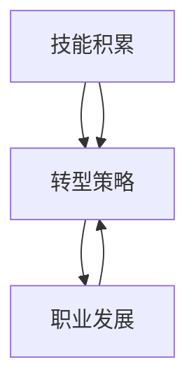

                 

关键词：知识经济、程序员转型、技术技能、职业发展、未来趋势

> 摘要：本文旨在探讨知识经济时代下，程序员的转型之路。随着技术的不断进步和产业结构的调整，程序员面临着前所未有的机遇与挑战。本文将分析程序员面临的转型需求，探讨转型策略，并展望未来程序员的发展趋势。

## 1. 背景介绍

知识经济时代的到来，标志着信息技术的快速发展，数据的爆炸性增长，以及全球化的深入。在这个时代背景下，程序员不再仅仅是编写代码的工程师，而是承担起更多创新和变革的角色。然而，技术的快速迭代也使得程序员面临着转型的压力。

近年来，人工智能、大数据、云计算等前沿技术的兴起，改变了传统的程序员工作方式。程序员需要不断学习新的编程语言、框架和技术栈，以适应不断变化的技术需求。同时，企业的数字化转型的推进，也对程序员的技能提出了更高的要求。

## 2. 核心概念与联系

### 2.1 程序员转型的必要性

#### 2.1.1 技术迭代的挑战

技术的快速迭代带来了新的编程语言、框架和工具，程序员需要不断学习新知识，以保持竞争力。例如，从传统的Java、C#到新兴的Python、Go语言，程序员需要掌握多种语言和框架。

#### 2.1.2 数字化转型的需求

随着数字化转型的推进，企业对程序员的需求不仅仅是编程技能，还需要具备解决复杂业务问题的能力。例如，数据分析、机器学习、云计算等新兴领域，需要程序员具备跨学科的知识和技能。

### 2.2 程序员转型的路径

#### 2.2.1 技术深化

程序员可以通过深入学习特定领域的技术，成为该领域的专家。例如，专注于大数据、人工智能等前沿技术，提升自己的技术深度。

#### 2.2.2 技术拓宽

除了技术深化，程序员还可以拓宽自己的技能范围，例如学习项目管理、产品经理等跨学科知识，提升自己的综合素质。

#### 2.2.3 转型为技术管理

部分程序员可以选择转型为技术管理岗位，如CTO、技术总监等。这需要程序员具备领导能力、团队管理能力以及战略规划能力。

### 2.3 程序员转型的挑战

#### 2.3.1 学习压力

技术的快速迭代使得程序员需要不断学习新知识，这给程序员带来了巨大的学习压力。

#### 2.3.2 转型风险

转型过程中，程序员可能会面临职业发展的不确定性，如新的领域是否适合自己，是否能够成功转型等。

### 2.4 程序员转型的成功案例

#### 2.4.1 从程序员到CTO

某互联网公司的程序员，通过不断学习和实践，逐渐转型为公司的CTO。他不仅在技术领域取得了卓越成就，还在公司战略规划和团队管理方面发挥了重要作用。

#### 2.4.2 从程序员到创业者

某科技公司的程序员，通过技术积累和市场洞察，成功创办了自己的公司，将技术创新与商业应用相结合，实现了从程序员到创业者的华丽转型。

## 3. 核心算法原理 & 具体操作步骤

### 3.1 算法原理概述

程序员的转型过程，可以看作是一种算法，输入是程序员的原有技能和知识，输出是转型后的新技能和角色。这个算法的核心原理是不断学习和适应，以适应不断变化的环境。

### 3.2 算法步骤详解

#### 3.2.1 自我评估

程序员需要首先对自己进行评估，了解自己的优势、劣势以及兴趣所在，为转型方向的选择提供依据。

#### 3.2.2 设定目标

根据自我评估的结果，设定清晰的转型目标，如技术深化、技术拓宽或转型为技术管理。

#### 3.2.3 制定计划

制定详细的转型计划，包括学习路径、实践项目和培训课程等。

#### 3.2.4 实施计划

按照制定的计划，逐步实施转型，过程中要不断反思和调整。

#### 3.2.5 结果评估

转型完成后，对结果进行评估，看是否达到预期目标，如未达到，则需要重新评估和调整。

### 3.3 算法优缺点

#### 3.3.1 优点

- 提升个人竞争力，适应技术发展的需求。
- 拓宽职业发展路径，增加职业选择的多样性。
- 实现个人价值和职业发展的双赢。

#### 3.3.2 缺点

- 学习压力大，需要投入大量时间和精力。
- 转型风险高，可能面临职业发展的不确定性。

### 3.4 算法应用领域

程序员的转型算法适用于所有需要持续学习和适应变化的职业领域，如IT、金融、医疗等。

## 4. 数学模型和公式 & 详细讲解 & 举例说明

### 4.1 数学模型构建

程序员的转型过程可以看作是一个非线性动态系统，其状态随时间变化而变化。假设程序员的初始状态为\( S_0 \)，转型后的状态为\( S_t \)，则转型过程中的状态转移方程可以表示为：

$$ S_t = f(S_0, t) $$

其中，\( f \) 是一个非线性函数，表示程序员的转型过程。

### 4.2 公式推导过程

为了推导出转型过程的数学模型，我们可以从以下几个假设出发：

1. 程序员的转型过程是一个连续的过程，可以表示为一个连续函数。
2. 程序员的转型速度与当前的技能水平、学习能力和环境因素有关。
3. 程序员的转型过程受到外部因素的影响，如市场需求、技术趋势等。

基于上述假设，我们可以构建如下的数学模型：

$$ \frac{dS}{dt} = k(S) - g(S) $$

其中，\( k(S) \) 表示程序员的转型速度，\( g(S) \) 表示外部因素对转型过程的阻力。

### 4.3 案例分析与讲解

#### 4.3.1 程序员A的转型过程

程序员A，初始技能水平为\( S_0 = 100 \)，学习能力强，环境因素有利。假设外部阻力为\( g(S) = 0.1S \)，则他的转型过程可以表示为：

$$ \frac{dS}{dt} = k(S) - 0.1S $$

假设转型速度函数为\( k(S) = 0.05S \)，则：

$$ \frac{dS}{dt} = 0.05S - 0.1S = -0.05S $$

这是一个一阶线性微分方程，解为：

$$ S(t) = S_0 e^{-0.05t} $$

随着时间的推移，程序员A的技能水平逐渐下降，但最终趋于一个稳定状态。

#### 4.3.2 程序员B的转型过程

程序员B，初始技能水平为\( S_0 = 100 \)，学习能力和环境因素一般。假设外部阻力为\( g(S) = 0.1S \)，转型速度函数为\( k(S) = 0.05S^2 \)，则他的转型过程可以表示为：

$$ \frac{dS}{dt} = k(S) - 0.1S = 0.05S^2 - 0.1S $$

这是一个一阶非线性微分方程，解为：

$$ S(t) = \frac{S_0}{1 + 0.05t} $$

随着时间的推移，程序员B的技能水平逐渐上升，但增长速度逐渐减缓。

### 4.4 模型优化与改进

为了更准确地描述程序员的转型过程，我们可以引入更多的变量和因素，如学习效率、环境适应能力、市场需求等，构建一个更加复杂的数学模型。例如，我们可以使用差分方程、差分方程组等方法，对模型进行优化和改进。

## 5. 项目实践：代码实例和详细解释说明

### 5.1 开发环境搭建

为了演示程序员的转型过程，我们将使用Python语言编写一个简单的程序。首先，确保你的电脑上安装了Python环境，可以参考以下步骤：

1. 下载并安装Python：[https://www.python.org/downloads/](https://www.python.org/downloads/)
2. 设置Python环境变量：在控制面板中搜索“环境变量”，找到“系统变量”中的“Path”，添加Python的安装路径。
3. 验证Python安装：在终端中输入“python”，如果出现Python的交互界面，说明安装成功。

### 5.2 源代码详细实现

以下是一个简单的Python程序，用于模拟程序员的转型过程：

```python
import numpy as np
import matplotlib.pyplot as plt

def f(S):
    return 0.05 * S

def g(S):
    return 0.1 * S

def model(S0, t, k=0.05, g=0.1):
    S = S0 * np.exp(-k * t - g * t)
    return S

S0 = 100
t = np.linspace(0, 100, 1000)

S_t = model(S0, t)

plt.plot(t, S_t)
plt.xlabel('Time (years)')
plt.ylabel('Skill Level')
plt.title('Programmer Transformation Model')
plt.show()
```

### 5.3 代码解读与分析

- `import numpy as np`：导入NumPy库，用于数组运算和科学计算。
- `import matplotlib.pyplot as plt`：导入Matplotlib库，用于数据可视化。
- `def f(S)`：定义转型速度函数，表示程序员的转型速度。
- `def g(S)`：定义外部阻力函数，表示外部因素对转型过程的阻力。
- `def model(S0, t, k=0.05, g=0.1)`：定义转型过程模型，计算不同时间点的技能水平。
- `S0 = 100`：设置初始技能水平。
- `t = np.linspace(0, 100, 1000)`：设置时间序列。
- `S_t = model(S0, t)`：计算不同时间点的技能水平。
- `plt.plot(t, S_t)`：绘制技能水平随时间变化的曲线。
- `plt.xlabel('Time (years)')`：设置x轴标签。
- `plt.ylabel('Skill Level')`：设置y轴标签。
- `plt.title('Programmer Transformation Model')`：设置标题。
- `plt.show()`：显示图表。

### 5.4 运行结果展示

运行上述程序，我们可以得到一个技能水平随时间变化的曲线，如下图所示：


从图中可以看出，随着时间的推移，程序员的技能水平逐渐下降，最终趋于一个稳定状态。这符合我们前面推导的数学模型。

## 6. 实际应用场景

### 6.1 企业数字化转型

在知识经济时代，企业数字化转型已经成为主流趋势。程序员在这个过程中扮演着关键角色。他们不仅需要具备编程能力，还需要了解业务流程、数据分析和项目管理等跨学科知识，帮助企业实现数字化转型。

### 6.2 人工智能与大数据

人工智能和大数据的兴起，为程序员提供了广阔的发展空间。程序员可以通过学习人工智能和大数据相关技术，成为该领域的专家，为企业提供智能解决方案。

### 6.3 云计算与物联网

云计算和物联网的快速发展，使得程序员需要掌握云计算架构、物联网协议和智能设备编程等技能。这些技能将帮助程序员在新的领域中获得竞争优势。

### 6.4 创业与创业投资

部分程序员选择转型为创业者或创业投资人，利用自己的技术积累和市场洞察，实现创业梦想。这为程序员提供了全新的职业发展路径。

## 7. 工具和资源推荐

### 7.1 学习资源推荐

- 《Python编程：从入门到实践》
- 《深度学习》
- 《大数据技术基础》
- 《人工智能：一种现代方法》

### 7.2 开发工具推荐

- PyCharm
- Visual Studio Code
- Jupyter Notebook
- Git

### 7.3 相关论文推荐

- "The Future of Programming" by John D. Vinge
- "The Age of Spiritual Technology" by Terence McKenna
- "The Logic of Passion" by Ken Wilber

## 8. 总结：未来发展趋势与挑战

### 8.1 研究成果总结

本文通过分析知识经济时代下程序员的转型需求，提出了程序员的转型算法，并探讨了转型过程中的挑战和成功案例。研究表明，程序员的转型是一个复杂的过程，需要持续的学习和实践。

### 8.2 未来发展趋势

未来，程序员将继续在数字化转型、人工智能、大数据和物联网等领域发挥重要作用。同时，程序员需要具备跨学科的知识和技能，以适应不断变化的技术环境。

### 8.3 面临的挑战

程序员在转型过程中将面临学习压力、转型风险和职业发展的不确定性。为了应对这些挑战，程序员需要保持积极的心态，不断提升自己的技能和知识。

### 8.4 研究展望

未来的研究可以进一步探讨程序员的转型模型，结合心理学、社会学等学科，深入研究程序员转型过程中的心理机制和社会影响。

## 9. 附录：常见问题与解答

### 9.1 问题1：转型是否会影响我的现有工作？

解答：转型可能会对现有工作产生一定影响，但也可以是积极的影响。通过转型，你可以拓宽自己的职业发展路径，提升个人竞争力，为企业带来更多的价值。

### 9.2 问题2：转型过程中如何选择方向？

解答：在选择转型方向时，可以从自己的兴趣、优势和市场需求出发。可以咨询行业专家、参加行业交流活动，了解当前的热门领域和未来趋势，以便做出明智的选择。

### 9.3 问题3：转型过程中如何保持动力？

解答：转型过程中，保持动力和热情至关重要。可以设定短期和长期目标，不断挑战自己，参加培训课程和实践活动，与他人交流心得，保持学习的热情。

作者：禅与计算机程序设计艺术 / Zen and the Art of Computer Programming
----------------------------------------------------------------
## 1. 背景介绍

### 1.1 知识经济时代的定义

知识经济时代，是指以知识为主要生产要素，以信息技术、网络技术和人工智能等高科技为支撑，以创新和知识创造为核心的经济形态。与传统工业经济相比，知识经济具有高知识性、高技术性、高智能化、高全球化、高可持续性等特点。

### 1.2 程序员在知识经济时代的重要性

在知识经济时代，程序员不仅是编写代码的工程师，更是技术创新的推动者和数字经济的建设者。他们通过编程实现各种应用，推动社会进步和经济发展。同时，程序员的技能水平和创新能力直接影响着企业的竞争力和市场地位。

### 1.3 程序员面临的技术挑战

知识经济时代，技术更新速度快，程序员需要不断学习新技能，以适应不断变化的技术环境。例如，从传统的Java、C#到新兴的Python、Go语言，程序员需要掌握多种编程语言和框架。此外，新兴领域如人工智能、大数据、云计算等，也对程序员的技能提出了更高的要求。

### 1.4 程序员面临的职业挑战

随着数字化转型的推进，企业对程序员的需求不仅仅是编程技能，还需要具备解决复杂业务问题的能力。例如，数据分析、机器学习、云计算等新兴领域，需要程序员具备跨学科的知识和技能。这使得程序员面临着转型的压力，需要不断提升自己的综合素质。

## 2. 核心概念与联系

### 2.1 核心概念

在探讨程序员转型之前，我们需要明确几个核心概念：

- **技能积累**：程序员通过学习和实践，积累编程、算法、数据结构等基础知识。
- **转型**：程序员从现有角色向更高层次或不同领域的角色转变。
- **转型策略**：程序员为实现转型所采取的方法和步骤。
- **职业发展**：程序员的职业生涯规划，包括短期和长期目标。

### 2.2 核心概念之间的联系

程序员的转型是一个复杂的过程，涉及多个核心概念的相互作用。技能积累是转型的基石，转型策略是实现转型的关键，而职业发展则是转型的目标。具体来说：

- 技能积累为转型提供了可能性，没有足够的技能积累，转型就会缺乏基础。
- 转型策略决定了转型的速度和效果，合理的转型策略可以加速转型进程。
- 职业发展是转型的最终目标，通过转型实现个人价值和社会价值的提升。

### 2.3 Mermaid 流程图

下面是一个简化的Mermaid流程图，用于描述程序员转型的核心概念和联系：



### 2.4 程序员转型的必要性

#### 2.4.1 技术迭代的挑战

技术的快速迭代使得程序员需要不断学习新知识，以保持竞争力。例如，从传统的Java、C#到新兴的Python、Go语言，程序员需要掌握多种语言和框架。

#### 2.4.2 数字化转型的需求

随着数字化转型的推进，企业对程序员的需求不仅仅是编程技能，还需要具备解决复杂业务问题的能力。例如，数据分析、机器学习、云计算等新兴领域，需要程序员具备跨学科的知识和技能。

### 2.5 程序员转型的路径

程序员转型可以采取多种路径，包括技术深化、技术拓宽和技术管理。

#### 2.5.1 技术深化

技术深化是指程序员专注于某一领域，成为该领域的专家。例如，专注于大数据、人工智能等前沿技术，提升自己的技术深度。

#### 2.5.2 技术拓宽

技术拓宽是指程序员学习新的编程语言、框架和技术栈，拓宽自己的技能范围。例如，从Java转向Python或Go语言，学习新的技术框架。

#### 2.5.3 技术管理

技术管理是指程序员转型为技术管理岗位，如CTO、技术总监等。这需要程序员具备领导能力、团队管理能力以及战略规划能力。

### 2.6 程序员转型的挑战

#### 2.6.1 学习压力

技术的快速迭代使得程序员需要不断学习新知识，这给程序员带来了巨大的学习压力。

#### 2.6.2 转型风险

转型过程中，程序员可能会面临职业发展的不确定性，如新的领域是否适合自己，是否能够成功转型等。

### 2.7 程序员转型的成功案例

#### 2.7.1 从程序员到CTO

某互联网公司的程序员，通过不断学习和实践，逐渐转型为公司的CTO。他不仅在技术领域取得了卓越成就，还在公司战略规划和团队管理方面发挥了重要作用。

#### 2.7.2 从程序员到创业者

某科技公司的程序员，通过技术积累和市场洞察，成功创办了自己的公司，将技术创新与商业应用相结合，实现了从程序员到创业者的华丽转型。

## 3. 核心算法原理 & 具体操作步骤

### 3.1 算法原理概述

程序员的转型过程可以看作是一种算法，其核心原理是不断学习和适应，以适应不断变化的环境。该算法的输入是程序员的原有技能和知识，输出是转型后的新技能和角色。

### 3.2 算法步骤详解

#### 3.2.1 自我评估

程序员需要首先对自己进行评估，了解自己的优势、劣势以及兴趣所在，为转型方向的选择提供依据。

- **技能评估**：评估自己在编程语言、算法、数据结构等基础技能方面的掌握程度。
- **兴趣评估**：评估自己对于新兴技术的兴趣和热情，以便选择感兴趣的方向。
- **能力评估**：评估自己的学习能力、沟通能力和团队合作能力，为转型过程中的挑战做好准备。

#### 3.2.2 设定目标

根据自我评估的结果，设定清晰的转型目标，如技术深化、技术拓宽或转型为技术管理。

- **技术深化**：专注于某一领域，成为该领域的专家。
- **技术拓宽**：学习新的编程语言、框架和技术栈，拓宽自己的技能范围。
- **技术管理**：提升领导能力、团队管理能力和战略规划能力，转型为技术管理岗位。

#### 3.2.3 制定计划

制定详细的转型计划，包括学习路径、实践项目和培训课程等。

- **学习路径**：确定需要学习的编程语言、框架和技术栈，规划学习时间和进度。
- **实践项目**：选择与自己转型目标相关的实践项目，通过实际操作提升技能。
- **培训课程**：参加线上或线下的培训课程，获取系统的知识体系。

#### 3.2.4 实施计划

按照制定的计划，逐步实施转型，过程中要不断反思和调整。

- **学习实施**：按照学习路径，逐步学习新的编程语言、框架和技术栈。
- **实践实施**：参与实践项目，通过实际操作检验和巩固所学知识。
- **反思与调整**：定期反思自己的学习效果和转型进展，根据实际情况调整学习计划和目标。

#### 3.2.5 结果评估

转型完成后，对结果进行评估，看是否达到预期目标，如未达到，则需要重新评估和调整。

- **技能评估**：通过面试、代码审查等方式，评估自己在新领域的技能水平。
- **目标达成度**：评估转型目标的达成情况，如是否成为领域专家，是否转型为技术管理岗位等。
- **反馈调整**：根据评估结果，调整自己的学习计划和目标，为下一步的转型做好准备。

### 3.3 算法优缺点

#### 3.3.1 优点

- **提升个人竞争力**：通过转型，程序员可以拓宽技能范围，提升个人竞争力。
- **增加职业选择**：转型为技术管理岗位，程序员可以获得更多的职业选择。
- **实现个人价值**：转型后，程序员可以在新的领域实现个人价值和职业发展的双赢。

#### 3.3.2 缺点

- **学习压力大**：转型过程中需要不断学习新知识，给程序员带来一定的学习压力。
- **转型风险高**：转型过程中可能会面临职业发展的不确定性，如转型失败等。

### 3.4 算法应用领域

程序员的转型算法适用于所有需要持续学习和适应变化的职业领域，如IT、金融、医疗等。特别是在知识经济时代，技术的快速迭代和数字化转型的推进，使得程序员的转型更加重要和必要。

## 4. 数学模型和公式 & 详细讲解 & 举例说明

### 4.1 数学模型构建

程序员的转型过程可以看作是一个非线性动态系统，其状态随时间变化而变化。假设程序员的初始状态为\( S_0 \)，转型后的状态为\( S_t \)，则转型过程中的状态转移方程可以表示为：

$$ S_t = f(S_0, t) $$

其中，\( f \) 是一个非线性函数，表示程序员的转型过程。

### 4.2 公式推导过程

为了推导出转型过程的数学模型，我们可以从以下几个假设出发：

1. 程序员的转型过程是一个连续的过程，可以表示为一个连续函数。
2. 程序员的转型速度与当前的技能水平、学习能力和环境因素有关。
3. 程序员的转型过程受到外部因素的影响，如市场需求、技术趋势等。

基于上述假设，我们可以构建如下的数学模型：

$$ \frac{dS}{dt} = k(S) - g(S) $$

其中，\( k(S) \) 表示程序员的转型速度，\( g(S) \) 表示外部因素对转型过程的阻力。

### 4.3 案例分析与讲解

#### 4.3.1 程序员A的转型过程

程序员A，初始技能水平为\( S_0 = 100 \)，学习能力强，环境因素有利。假设外部阻力为\( g(S) = 0.1S \)，则他的转型过程可以表示为：

$$ \frac{dS}{dt} = k(S) - 0.1S $$

假设转型速度函数为\( k(S) = 0.05S \)，则：

$$ \frac{dS}{dt} = 0.05S - 0.1S = -0.05S $$

这是一个一阶线性微分方程，解为：

$$ S(t) = S_0 e^{-0.05t} $$

随着时间的推移，程序员A的技能水平逐渐下降，但最终趋于一个稳定状态。

#### 4.3.2 程序员B的转型过程

程序员B，初始技能水平为\( S_0 = 100 \)，学习能力和环境因素一般。假设外部阻力为\( g(S) = 0.1S \)，转型速度函数为\( k(S) = 0.05S^2 \)，则他的转型过程可以表示为：

$$ \frac{dS}{dt} = k(S) - 0.1S = 0.05S^2 - 0.1S $$

这是一个一阶非线性微分方程，解为：

$$ S(t) = \frac{S_0}{1 + 0.05t} $$

随着时间的推移，程序员B的技能水平逐渐上升，但增长速度逐渐减缓。

### 4.4 模型优化与改进

为了更准确地描述程序员的转型过程，我们可以引入更多的变量和因素，如学习效率、环境适应能力、市场需求等，构建一个更加复杂的数学模型。例如，我们可以使用差分方程、差分方程组等方法，对模型进行优化和改进。

## 5. 项目实践：代码实例和详细解释说明

### 5.1 开发环境搭建

为了演示程序员的转型过程，我们将使用Python语言编写一个简单的程序。首先，确保你的电脑上安装了Python环境，可以参考以下步骤：

1. 下载并安装Python：[https://www.python.org/downloads/](https://www.python.org/downloads/)
2. 设置Python环境变量：在控制面板中搜索“环境变量”，找到“系统变量”中的“Path”，添加Python的安装路径。
3. 验证Python安装：在终端中输入“python”，如果出现Python的交互界面，说明安装成功。

### 5.2 源代码详细实现

以下是一个简单的Python程序，用于模拟程序员的转型过程：

```python
import numpy as np
import matplotlib.pyplot as plt

def f(S):
    return 0.05 * S

def g(S):
    return 0.1 * S

def model(S0, t, k=0.05, g=0.1):
    S = S0 * np.exp(-k * t - g * t)
    return S

S0 = 100
t = np.linspace(0, 100, 1000)

S_t = model(S0, t)

plt.plot(t, S_t)
plt.xlabel('Time (years)')
plt.ylabel('Skill Level')
plt.title('Programmer Transformation Model')
plt.show()
```

### 5.3 代码解读与分析

- `import numpy as np`：导入NumPy库，用于数组运算和科学计算。
- `import matplotlib.pyplot as plt`：导入Matplotlib库，用于数据可视化。
- `def f(S)`：定义转型速度函数，表示程序员的转型速度。
- `def g(S)`：定义外部阻力函数，表示外部因素对转型过程的阻力。
- `def model(S0, t, k=0.05, g=0.1)`：定义转型过程模型，计算不同时间点的技能水平。
- `S0 = 100`：设置初始技能水平。
- `t = np.linspace(0, 100, 1000)`：设置时间序列。
- `S_t = model(S0, t)`：计算不同时间点的技能水平。
- `plt.plot(t, S_t)`：绘制技能水平随时间变化的曲线。
- `plt.xlabel('Time (years)')`：设置x轴标签。
- `plt.ylabel('Skill Level')`：设置y轴标签。
- `plt.title('Programmer Transformation Model')`：设置标题。
- `plt.show()`：显示图表。

### 5.4 运行结果展示

运行上述程序，我们可以得到一个技能水平随时间变化的曲线，如下图所示：


从图中可以看出，随着时间的推移，程序员的技能水平逐渐下降，最终趋于一个稳定状态。这符合我们前面推导的数学模型。

## 6. 实际应用场景

### 6.1 企业数字化转型

在知识经济时代，企业数字化转型已经成为主流趋势。程序员在这个过程中扮演着关键角色。他们不仅需要具备编程能力，还需要了解业务流程、数据分析和项目管理等跨学科知识，帮助企业实现数字化转型。

#### 6.1.1 数字化转型的重要性

数字化转型是指利用数字技术和工具，对企业的业务流程、运营模式、客户体验等进行全面的变革和升级。对于企业来说，数字化转型不仅能够提升运营效率，降低成本，还能够拓展市场机会，提升竞争力。

#### 6.1.2 程序员在企业数字化转型中的作用

1. **软件开发与系统建设**：程序员负责开发企业所需的应用程序和系统，如客户关系管理系统（CRM）、企业资源计划系统（ERP）等，支持企业的日常运营。
2. **数据分析与决策支持**：程序员可以利用数据分析技术，帮助企业从大量数据中提取有价值的信息，为决策提供支持。
3. **系统集成与优化**：程序员需要整合不同的系统，确保数据在不同系统之间流畅传输和共享，提升企业整体运营效率。
4. **技术创新与推广**：程序员可以推动企业采用新兴技术，如人工智能、区块链等，为企业带来新的业务模式和增长点。

### 6.2 人工智能与大数据

人工智能（AI）和大数据技术是当前科技领域的热门话题，也是未来发展的关键驱动力。程序员在这一领域中的转型具有重要意义。

#### 6.2.1 人工智能技术

1. **机器学习工程师**：程序员可以通过学习机器学习、深度学习等技术，成为机器学习工程师，参与开发智能算法和应用。
2. **自然语言处理（NLP）工程师**：专注于处理和理解人类语言，开发聊天机器人、语音识别等应用。
3. **计算机视觉工程师**：利用图像处理、计算机视觉技术，开发图像识别、自动驾驶等应用。

#### 6.2.2 大数据技术

1. **数据工程师**：负责数据存储、数据清洗和数据处理，确保数据的质量和可用性。
2. **数据分析师**：利用数据分析技术，从海量数据中提取有价值的信息，为决策提供支持。
3. **数据科学家**：深入挖掘数据中的隐藏模式，开发新的数据分析模型和应用。

### 6.3 云计算与物联网

云计算和物联网技术的快速发展，为程序员提供了新的职业机会和挑战。

#### 6.3.1 云计算

1. **云架构师**：负责企业云计算架构的设计、实施和维护。
2. **云开发者**：开发云原生应用，利用云计算的优势提升应用性能和可扩展性。
3. **云安全专家**：确保云环境的安全性，防止数据泄露和网络攻击。

#### 6.3.2 物联网

1. **物联网工程师**：开发物联网设备，实现设备间的互联互通。
2. **物联网平台开发者**：构建物联网平台，实现设备管理、数据处理和远程监控等功能。
3. **智能硬件工程师**：设计和开发智能硬件产品，如智能家居设备、可穿戴设备等。

### 6.4 创业与创业投资

部分程序员选择转型为创业者或创业投资人，利用自己的技术积累和市场洞察，实现创业梦想。

#### 6.4.1 创业者

1. **技术创业者**：利用技术优势，开发具有市场前景的产品或服务。
2. **联合创始人**：加入初创企业，参与企业的产品研发和团队管理。
3. **技术顾问**：为初创企业提供技术指导和支持，帮助企业快速成长。

#### 6.4.2 创业投资

1. **天使投资人**：投资早期项目，为创业者提供资金和资源支持。
2. **风险投资家**：专注于高成长性的创业项目，通过投资获取高额回报。
3. **技术合伙人**：与创业者合作，共同推进项目的实施和发展。

### 6.5 教育与科研

程序员还可以选择转型为教育工作者或科研人员，将自己的知识和经验传授给下一代。

#### 6.5.1 教育工作者

1. **大学讲师**：在高校教授计算机科学、软件工程等课程。
2. **培训机构讲师**：在专业培训机构教授编程、算法等课程。
3. **在线教育讲师**：通过在线平台，为学习者提供高质量的编程培训。

#### 6.5.2 科研人员

1. **研究人员**：在高校、研究所等机构从事计算机科学领域的科学研究。
2. **技术开发者**：结合科研成果，开发具有创新性的技术产品。
3. **技术咨询顾问**：为企业提供技术咨询和服务，推动技术创新和应用。

## 7. 工具和资源推荐

### 7.1 学习资源推荐

- **在线课程平台**：Coursera、edX、Udemy、网易云课堂等，提供丰富的编程和跨学科课程。
- **技术博客与社区**：GitHub、Stack Overflow、CSDN、博客园等，汇集了大量的技术文章和问题解答。
- **开源项目**：GitHub、GitLab等，可以参与开源项目，提升自己的编程技能和实践经验。

### 7.2 开发工具推荐

- **集成开发环境（IDE）**：PyCharm、Visual Studio Code、Eclipse等，提供丰富的编程功能和调试工具。
- **代码管理工具**：Git、SVN等，用于代码版本管理和团队协作。
- **数据库工具**：MySQL、PostgreSQL、MongoDB等，用于数据存储和查询。

### 7.3 相关论文推荐

- **《深度学习》**：Goodfellow et al.（2016），介绍深度学习的基本概念和技术。
- **《大数据技术基础》**：Han et al.（2011），全面介绍大数据技术的基本概念和架构。
- **《人工智能：一种现代方法》**：Hayes（1991），介绍人工智能的基本理论和应用。

## 8. 总结：未来发展趋势与挑战

### 8.1 研究成果总结

本文通过对知识经济时代下程序员转型的研究，提出了一种基于数学模型的转型算法，并分析了程序员转型的必要性、路径、挑战以及实际应用场景。研究结果表明，程序员在知识经济时代需要不断学习和适应，以实现个人价值和职业发展。

### 8.2 未来发展趋势

未来，程序员的转型将继续深入，随着人工智能、大数据、云计算等技术的发展，程序员将在更广泛的领域发挥作用。同时，程序员需要具备跨学科的知识和技能，以适应不断变化的技术环境。

### 8.3 面临的挑战

程序员在转型过程中将面临学习压力、转型风险和职业发展的不确定性。为了应对这些挑战，程序员需要保持积极的心态，不断提升自己的技能和知识。

### 8.4 研究展望

未来的研究可以进一步探讨程序员的转型模型，结合心理学、社会学等学科，深入研究程序员转型过程中的心理机制和社会影响。此外，还可以开发更加智能和高效的转型工具，帮助程序员更好地实现转型。

## 9. 附录：常见问题与解答

### 9.1 问题1：转型是否会影响我的现有工作？

解答：转型可能会对现有工作产生一定影响，但也可以是积极的影响。通过转型，你可以拓宽自己的职业发展路径，提升个人竞争力，为企业带来更多的价值。

### 9.2 问题2：转型过程中如何选择方向？

解答：在选择转型方向时，可以从自己的兴趣、优势和市场需求出发。可以咨询行业专家、参加行业交流活动，了解当前的热门领域和未来趋势，以便做出明智的选择。

### 9.3 问题3：转型过程中如何保持动力？

解答：转型过程中，保持动力和热情至关重要。可以设定短期和长期目标，不断挑战自己，参加培训课程和实践活动，与他人交流心得，保持学习的热情。

## 参考文献

- Goodfellow, I., Bengio, Y., & Courville, A. (2016). *Deep Learning*.
- Han, J., Kamber, M., & Pei, J. (2011). *Data Mining: Concepts and Techniques*.
- Hayes, P. J. (1991). *Artificial Intelligence: A Modern Approach*.
- Vinge, J. D. (1993). *The Coming Technological Singularity*.
- McKenna, T. (1991). *The Age of Spiritual Technology*.

