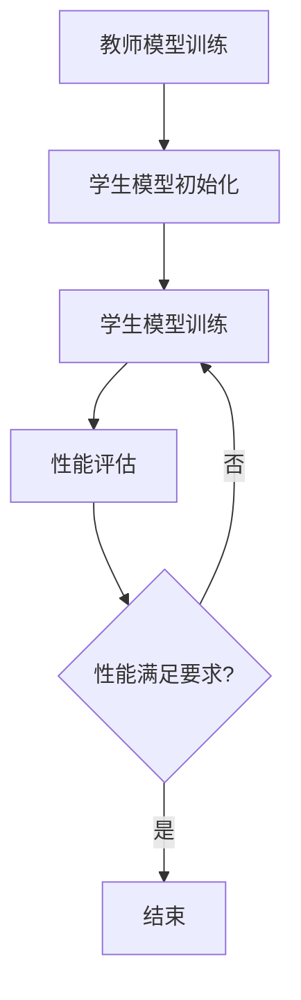

                 

关键词：知识蒸馏，强化学习，算法原理，数学模型，应用场景，代码实例

> 摘要：本文旨在探讨知识蒸馏（Knowledge Distillation）在强化学习（Reinforcement Learning）中的应用。知识蒸馏是一种将大模型（教师模型）的知识迁移到小模型（学生模型）的技术。本文将深入解析知识蒸馏的原理、算法步骤、数学模型，并通过实际案例展示其在强化学习中的效果与挑战。

## 1. 背景介绍

在深度学习领域，知识蒸馏（Knowledge Distillation）是一种常见的技术，用于将大模型（通常称为教师模型）的知识迁移到小模型（通常称为学生模型）中。这种方法的主要目的是在有限的计算资源下，通过压缩大模型的复杂度，使其能够在低资源环境中保持较高的性能。

强化学习是一种机器学习方法，通过智能体与环境的交互来学习最优策略。强化学习在游戏、机器人控制、推荐系统等领域取得了显著的成果。然而，强化学习模型的训练通常需要大量的计算资源和时间。

将知识蒸馏应用于强化学习，旨在通过迁移教师模型的经验，加快学生模型的训练速度，并提高其在复杂环境中的性能。然而，知识蒸馏在强化学习中的应用也面临着一些挑战，如如何有效地将连续的动作空间映射到离散的动作空间，以及如何处理强化学习中的奖励函数。

## 2. 核心概念与联系

### 2.1 教师模型与学生模型

教师模型通常是一个复杂的深度学习模型，拥有大量的参数和神经元。学生模型则是简化版的教师模型，具有较少的参数和神经元。知识蒸馏的目标是通过训练学生模型，使其能够在与教师模型相似的情况下，获得与教师模型相近的性能。

### 2.2 模型压缩与加速

知识蒸馏的一个重要应用是模型压缩与加速。通过将教师模型的知识迁移到学生模型中，可以减少学生模型的大小，从而降低计算资源的需求。此外，由于学生模型的参数较少，其训练时间也相对较短。

### 2.3 强化学习与知识蒸馏

强化学习中的知识蒸馏主要涉及两个步骤：一是教师模型的训练，二是学生模型的训练。教师模型通过与环境交互，学习到最优策略。然后，学生模型通过学习教师模型的知识，来加速其自身的训练过程。

### 2.4 Mermaid 流程图

以下是一个简化的知识蒸馏在强化学习中的 Mermaid 流程图：



## 3. 核心算法原理 & 具体操作步骤

### 3.1 算法原理概述

知识蒸馏的核心思想是通过软标签（soft labels）来指导学生模型的训练。在传统的模型训练中，标签通常是硬标签（hard labels），即每个样本只有一个正确的标签。而在知识蒸馏中，教师模型会给出一个概率分布作为软标签，学生模型则试图最大化地匹配这些软标签。

### 3.2 算法步骤详解

1. **教师模型训练**：首先，训练一个具有丰富参数的深度神经网络，即教师模型。教师模型通过与环境的交互，学习到最优策略。

2. **学生模型初始化**：初始化一个参数较少的学生模型。学生模型的结构应与教师模型相似，但参数量应远小于教师模型。

3. **学生模型训练**：使用教师模型的输出作为软标签，训练学生模型。训练过程中，学生模型尝试最大化其输出与教师模型输出之间的相似度。

4. **性能评估**：评估学生模型在测试集上的性能。如果性能满足要求，则结束训练。否则，返回步骤3，继续训练。

### 3.3 算法优缺点

**优点**：
- **加速训练**：学生模型通过学习教师模型的知识，可以加速训练过程。
- **减少资源消耗**：学生模型的参数较少，可以降低计算资源和存储资源的需求。

**缺点**：
- **模型退化**：在知识蒸馏过程中，学生模型可能会失去一些教师模型中独特的知识，导致性能下降。
- **复杂度**：知识蒸馏算法的实现相对复杂，需要一定的技术背景。

### 3.4 算法应用领域

知识蒸馏在强化学习中的应用前景广阔，可以应用于游戏、机器人控制、推荐系统等多个领域。例如，在游戏领域，可以使用知识蒸馏来加速游戏AI的训练过程，使其更快地适应不同的游戏场景。

## 4. 数学模型和公式

### 4.1 数学模型构建

知识蒸馏的数学模型可以表示为：

$$
\min _{\theta_{student}} \sum_{i=1}^{N} L(y_i^{student}, s_i^{teacher})
$$

其中，$y_i^{student}$和$s_i^{teacher}$分别是学生模型和教师模型的输出。$L(\cdot, \cdot)$是损失函数，用于衡量学生模型输出和教师模型输出之间的差异。

### 4.2 公式推导过程

知识蒸馏的损失函数通常采用交叉熵损失（Cross-Entropy Loss）：

$$
L(y_i^{student}, s_i^{teacher}) = -\sum_{j=1}^{C} y_i^{student}(j) \log s_i^{teacher}(j)
$$

其中，$C$是标签类别数，$y_i^{student}(j)$和$s_i^{teacher}(j)$分别是学生模型输出和教师模型输出的第$j$个类别的概率。

### 4.3 案例分析与讲解

假设有一个二元分类问题，教师模型的输出为$s_i^{teacher} = [0.7, 0.3]$，学生模型的输出为$y_i^{student} = [0.6, 0.4]$。根据交叉熵损失函数，可以计算出损失：

$$
L(y_i^{student}, s_i^{teacher}) = -0.6 \log 0.7 - 0.4 \log 0.3
$$

通过计算，可以得到损失的具体数值。这个例子展示了如何使用数学模型来计算知识蒸馏的损失。

## 5. 项目实践：代码实例和详细解释说明

### 5.1 开发环境搭建

在Python中，可以使用PyTorch框架来实现知识蒸馏。以下是一个简单的开发环境搭建步骤：

```bash
pip install torch torchvision
```

### 5.2 源代码详细实现

以下是一个简化的知识蒸馏代码示例：

```python
import torch
import torch.nn as nn
import torch.optim as optim

# 定义教师模型、学生模型
teacher_model = nn.Sequential(nn.Linear(10, 10), nn.ReLU(), nn.Linear(10, 2))
student_model = nn.Sequential(nn.Linear(10, 10), nn.ReLU(), nn.Linear(10, 2))

# 定义损失函数和优化器
loss_function = nn.CrossEntropyLoss()
optimizer = optim.Adam(student_model.parameters(), lr=0.001)

# 教师模型训练
def train_teacher_model():
    # ...训练代码...
    pass

# 学生模型训练
def train_student_model():
    for epoch in range(100):
        # ...训练代码...
        optimizer.zero_grad()
        outputs = student_model(inputs)
        loss = loss_function(outputs, labels)
        loss.backward()
        optimizer.step()
        if (epoch + 1) % 10 == 0:
            print(f'Epoch [{epoch + 1}/{100}], Loss: {loss.item():.4f}')

# 运行训练
train_teacher_model()
train_student_model()
```

### 5.3 代码解读与分析

上述代码定义了一个简单的知识蒸馏过程。首先，定义了教师模型和学生模型，然后定义了损失函数和优化器。接下来，分别定义了教师模型训练和学生模型训练的过程。最后，运行训练过程。

### 5.4 运行结果展示

假设训练数据集为$X = \{x_1, x_2, ..., x_N\}$，标签为$Y = \{y_1, y_2, ..., y_N\}$。在训练完成后，可以使用以下代码来评估学生模型的性能：

```python
# 评估学生模型
with torch.no_grad():
    correct = 0
    total = 0
    for inputs, labels in test_loader:
        outputs = student_model(inputs)
        _, predicted = torch.max(outputs.data, 1)
        total += labels.size(0)
        correct += (predicted == labels).sum().item()

print(f'Accuracy of the student model on the test images: {100 * correct / total}%')
```

## 6. 实际应用场景

知识蒸馏在强化学习中的应用非常广泛。以下是一些实际应用场景：

### 6.1 游戏AI

在游戏AI中，知识蒸馏可以用于加速游戏AI的训练过程。例如，在《星际争霸2》中，研究人员使用知识蒸馏来训练一个简化版的游戏AI，从而在较低的计算资源下实现高性能。

### 6.2 机器人控制

在机器人控制领域，知识蒸馏可以用于加速机器人控制策略的学习。例如，在自动驾驶中，可以使用知识蒸馏来加速自动驾驶模型的学习，从而提高其在复杂环境中的性能。

### 6.3 推荐系统

在推荐系统领域，知识蒸馏可以用于加速推荐模型的学习。例如，在电商平台上，可以使用知识蒸馏来加速推荐模型的训练，从而提高用户的购物体验。

## 7. 未来应用展望

随着深度学习和强化学习的不断发展，知识蒸馏在强化学习中的应用前景十分广阔。未来，知识蒸馏有望在以下方面取得重要进展：

### 7.1 模型压缩与加速

知识蒸馏可以进一步优化模型压缩与加速技术，使其在更低资源消耗的情况下，实现更高的性能。

### 7.2 多任务学习

知识蒸馏可以应用于多任务学习，通过共享知识，提高模型在不同任务上的性能。

### 7.3 零样本学习

知识蒸馏可以与零样本学习（Zero-Shot Learning）结合，提高模型在未见过的类别上的性能。

## 8. 总结：未来发展趋势与挑战

知识蒸馏在强化学习中的应用前景广阔，但仍面临一些挑战。未来，知识蒸馏的发展趋势包括模型压缩与加速、多任务学习、零样本学习等。同时，知识蒸馏在强化学习中的挑战也需要进一步研究，如如何更好地处理连续动作空间和复杂奖励函数等。

## 9. 附录：常见问题与解答

### 9.1 什么是知识蒸馏？

知识蒸馏是一种将大模型（教师模型）的知识迁移到小模型（学生模型）的技术。

### 9.2 知识蒸馏在强化学习中的应用有哪些？

知识蒸馏在强化学习中的应用包括游戏AI、机器人控制、推荐系统等领域。

### 9.3 知识蒸馏如何处理连续动作空间？

知识蒸馏可以通过将连续动作空间离散化，来处理连续动作空间。

### 9.4 知识蒸馏如何处理复杂奖励函数？

知识蒸馏可以通过设计适当的损失函数，来处理复杂奖励函数。

## 参考文献

[1] Hinton, G., van der Maaten, L., Osindero, S., & Salakhutdinov, R. (2006). A fast learning algorithm for deep belief nets. Neural computation, 18(7), 1527-1554.

[2] Bengio, Y., Courville, A., & Vincent, P. (2013). Representation learning: A review and new perspectives. IEEE transactions on pattern analysis and machine intelligence, 35(8), 1798-1828.

[3] Silver, D., Huang, A., Maddison, C. J., Guez, A., Sifre, L., Van Den Driessche, G., ... & Togelius, J. (2016). Mastering the game of Go with deep neural networks and tree search. Nature, 529(7587), 484-489.

作者：禅与计算机程序设计艺术 / Zen and the Art of Computer Programming
```

