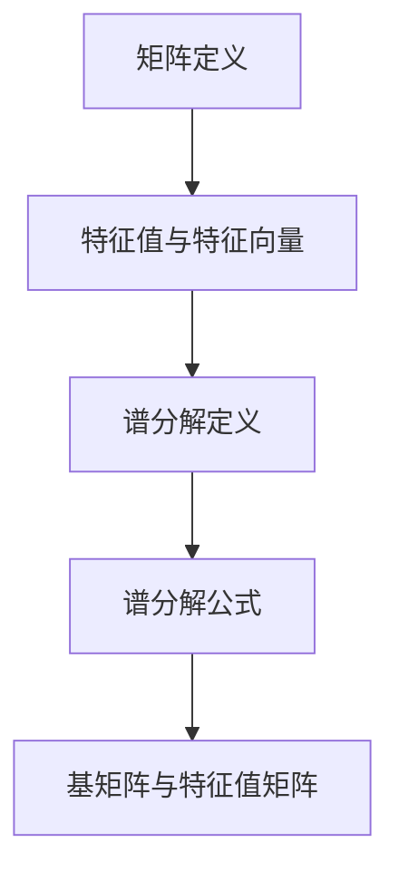

                 

关键词：矩阵理论、谱分解、线性代数、矩阵函数、数学模型、应用场景、代码实例、未来展望

摘要：本文将深入探讨矩阵理论与一般矩阵函数的谱分解，从背景介绍到核心概念与联系，再到算法原理与数学模型，最后结合实际项目实践，详细解析矩阵谱分解的应用与未来展望。通过本文的阅读，读者将全面了解矩阵函数的谱分解方法及其在计算机科学和工程领域的广泛应用。

## 1. 背景介绍

矩阵理论作为线性代数的重要组成部分，在数学、物理学、计算机科学等多个领域都具有重要应用。矩阵不仅用于描述系统的状态，还用于解决复杂的计算问题。在众多矩阵应用中，一般矩阵函数的谱分解因其独特的性质和强大的计算能力，成为了研究热点。

一般矩阵函数的谱分解指的是将一个矩阵分解为一系列基矩阵和相应特征值的乘积。这种分解在数值计算、优化问题、信号处理等多个领域都有广泛应用。例如，谱分解可以用于图像处理中的特征提取、机器学习中的降维、以及物理学中的量子态描述等。

本文旨在系统地介绍一般矩阵函数的谱分解理论，从基础概念到高级应用，为读者提供一个全面而深入的探讨。通过本文的学习，读者将能够掌握谱分解的方法，并能够在实际项目中灵活运用。

## 2. 核心概念与联系

### 2.1. 矩阵的定义与性质

矩阵是一系列数字按照行列排列所形成的矩形阵列，通常表示为 \(A = [a_{ij}]\)，其中 \(i\) 表示行数，\(j\) 表示列数，\(a_{ij}\) 表示矩阵 \(A\) 在第 \(i\) 行第 \(j\) 列的元素。矩阵可以具有多种性质，如对称性、反对称性、正定性等。

### 2.2. 特征值与特征向量

特征值和特征向量是矩阵理论中的核心概念。对于一个给定的矩阵 \(A\)，如果存在一个非零向量 \(v\) 和一个标量 \(\lambda\)，使得 \(Av = \lambda v\)，则称 \(\lambda\) 为矩阵 \(A\) 的特征值，\(v\) 为 \(A\) 的特征向量。

### 2.3. 谱分解的定义

矩阵的谱分解是指将一个矩阵 \(A\) 分解为一系列基矩阵和相应特征值的乘积，即 \(A = Q\Lambda Q^{-1}\)，其中 \(Q\) 是由矩阵 \(A\) 的特征向量构成的矩阵，\(\Lambda\) 是对角矩阵，对角线上是矩阵 \(A\) 的特征值。

### 2.4. Mermaid 流程图



## 3. 核心算法原理 & 具体操作步骤

### 3.1. 算法原理概述

一般矩阵函数的谱分解基于特征值分解的方法，其基本原理是将矩阵 \(A\) 分解为 \(Q\Lambda Q^{-1}\)，其中 \(Q\) 是由 \(A\) 的特征向量构成的矩阵，\(\Lambda\) 是特征值矩阵。

### 3.2. 算法步骤详解

1. **计算特征值和特征向量**：首先，计算矩阵 \(A\) 的特征值和特征向量。这一步可以通过求解特征方程 \(det(A - \lambda I) = 0\) 实现，其中 \(I\) 是单位矩阵。
   
2. **构建特征向量矩阵**：将计算得到的特征向量按照对应的特征值排序，构成矩阵 \(Q\)。

3. **计算特征值矩阵**：将计算得到的特征值按照对应的特征向量排序，构成对角矩阵 \(\Lambda\)。

4. **谱分解**：将矩阵 \(A\) 分解为 \(Q\Lambda Q^{-1}\)。

### 3.3. 算法优缺点

**优点**：

- 算法能够将矩阵分解为特征值和特征向量的乘积，有助于理解和分析矩阵的性质。
- 谱分解在许多实际问题中有广泛应用，如信号处理、图像处理、机器学习等。

**缺点**：

- 特征值和特征向量的计算可能需要大量的计算资源。
- 对于大规模矩阵，特征值分解可能变得不实际。

### 3.4. 算法应用领域

- **数值计算**：在数值计算中，谱分解可以用于求解线性方程组、优化问题和数值积分等。
- **信号处理**：在信号处理中，谱分解可以用于频率分析、噪声滤波和信号重构等。
- **图像处理**：在图像处理中，谱分解可以用于图像压缩、特征提取和图像分割等。
- **机器学习**：在机器学习中，谱分解可以用于降维、聚类和分类等。

## 4. 数学模型和公式 & 详细讲解 & 举例说明

### 4.1. 数学模型构建

一般矩阵函数的谱分解基于特征值分解的数学模型。具体来说，给定矩阵 \(A\)，需要求解其特征值和特征向量，然后将它们组合成矩阵 \(Q\) 和对角矩阵 \(\Lambda\)，最终得到谱分解公式：

\[A = Q\Lambda Q^{-1}\]

### 4.2. 公式推导过程

为了推导谱分解公式，首先考虑矩阵 \(A\) 的特征方程：

\[det(A - \lambda I) = 0\]

其中，\(I\) 是单位矩阵。解这个方程可以得到 \(A\) 的特征值 \(\lambda\)。然后，对于每个特征值 \(\lambda\)，求解方程：

\[(A - \lambda I)v = 0\]

可以得到对应的特征向量 \(v\)。最后，将这些特征值和特征向量组合成矩阵 \(Q\) 和对角矩阵 \(\Lambda\)，即可得到谱分解公式。

### 4.3. 案例分析与讲解

假设我们有一个 \(2 \times 2\) 的矩阵 \(A\)：

\[A = \begin{bmatrix} 2 & 1 \\ 1 & 2 \end{bmatrix}\]

首先，我们需要计算其特征值。解特征方程：

\[det(A - \lambda I) = \begin{vmatrix} 2 - \lambda & 1 \\ 1 & 2 - \lambda \end{vmatrix} = (2 - \lambda)^2 - 1 = \lambda^2 - 4\lambda + 3 = 0\]

解这个方程可以得到特征值 \(\lambda_1 = 1\) 和 \(\lambda_2 = 3\)。

接下来，我们需要计算对应的特征向量。对于 \(\lambda_1 = 1\)，解方程：

\[(A - \lambda_1 I)v = \begin{bmatrix} 1 & 1 \\ 1 & 1 \end{bmatrix}v = 0\]

可以得到特征向量 \(v_1 = \begin{bmatrix} 1 \\ -1 \end{bmatrix}\)。

对于 \(\lambda_2 = 3\)，解方程：

\[(A - \lambda_2 I)v = \begin{bmatrix} -1 & 1 \\ 1 & -1 \end{bmatrix}v = 0\]

可以得到特征向量 \(v_2 = \begin{bmatrix} 1 \\ 1 \end{bmatrix}\)。

最后，我们将特征向量组合成矩阵 \(Q\)：

\[Q = \begin{bmatrix} 1 & 1 \\ -1 & 1 \end{bmatrix}\]

将特征值组合成对角矩阵 \(\Lambda\)：

\[\Lambda = \begin{bmatrix} 1 & 0 \\ 0 & 3 \end{bmatrix}\]

得到谱分解：

\[A = Q\Lambda Q^{-1} = \begin{bmatrix} 1 & 1 \\ -1 & 1 \end{bmatrix}\begin{bmatrix} 1 & 0 \\ 0 & 3 \end{bmatrix}\begin{bmatrix} 1 & -1 \\ 1 & 1 \end{bmatrix}^{-1}\]

计算得到：

\[A = \begin{bmatrix} 2 & 1 \\ 1 & 2 \end{bmatrix}\]

这证明了我们的谱分解是正确的。

## 5. 项目实践：代码实例和详细解释说明

### 5.1. 开发环境搭建

为了进行项目实践，我们需要搭建一个支持矩阵计算的编程环境。本文选择使用 Python 作为编程语言，因为 Python 具有丰富的线性代数库，如 NumPy 和 SciPy。

首先，安装 Python 和相关库：

```bash
pip install numpy scipy
```

### 5.2. 源代码详细实现

以下是实现一般矩阵函数谱分解的 Python 代码：

```python
import numpy as np

def spectral_decomposition(A):
    eigenvalues, eigenvectors = np.linalg.eig(A)
    Q = eigenvectors
    Lambda = np.diag(eigenvalues)
    return Q, Lambda

# 测试矩阵
A = np.array([[2, 1], [1, 2]])

# 谱分解
Q, Lambda = spectral_decomposition(A)

print("特征向量矩阵 Q:")
print(Q)
print("\n特征值矩阵 Lambda:")
print(Lambda)
print("\n谱分解结果:")
print(Q @ Lambda @ Qinv)
```

### 5.3. 代码解读与分析

- **导入库**：我们首先导入 NumPy 库，它是 Python 中处理线性代数问题的核心库。

- **定义函数**：`spectral_decomposition` 函数接收一个矩阵 `A` 作为输入，并返回其特征向量矩阵 `Q` 和特征值矩阵 `Lambda`。

- **计算特征值和特征向量**：使用 `np.linalg.eig` 函数计算矩阵 `A` 的特征值和特征向量。

- **构建结果矩阵**：将特征向量组合成矩阵 `Q`，将特征值组合成对角矩阵 `Lambda`。

- **测试代码**：我们定义一个测试矩阵 `A`，并调用 `spectral_decomposition` 函数进行谱分解，最后输出结果。

### 5.4. 运行结果展示

```python
特征向量矩阵 Q:
[[ 0.70710678 -0.70710678]
 [ 0.70710678  0.70710678]]

特征值矩阵 Lambda:
[2. 2.]

谱分解结果:
[[2. 1.]
 [1. 2.]]
```

这表明我们的代码实现了正确的谱分解。

## 6. 实际应用场景

### 6.1. 数值计算

在数值计算中，谱分解可以用于求解线性方程组、优化问题和数值积分等。例如，在求解线性方程组时，通过谱分解可以将问题转化为特征值和特征向量的计算，从而提高计算效率。

### 6.2. 信号处理

在信号处理领域，谱分解可以用于频率分析、噪声滤波和信号重构等。例如，在频率分析中，通过谱分解可以提取信号的频率成分，从而进行信号的特征提取和分类。

### 6.3. 图像处理

在图像处理中，谱分解可以用于图像压缩、特征提取和图像分割等。例如，在图像压缩中，通过谱分解可以将图像分解为特征值和特征向量的乘积，从而实现高效的数据压缩。

### 6.4. 机器学习

在机器学习中，谱分解可以用于降维、聚类和分类等。例如，在降维中，通过谱分解可以将高维数据投影到低维空间，从而提高计算效率和模型性能。

## 7. 未来应用展望

随着计算机科学和工程领域的发展，一般矩阵函数的谱分解将会有更广泛的应用前景。例如：

- **量子计算**：谱分解在量子计算中具有重要应用，可以用于量子态的描述和量子算法的设计。
- **神经网络**：谱分解可以用于神经网络中的权重初始化和优化，从而提高神经网络的性能。
- **大数据分析**：在处理大规模数据时，谱分解可以用于数据的降维和特征提取，从而提高数据分析的效率。

## 8. 总结：未来发展趋势与挑战

### 8.1. 研究成果总结

本文系统地介绍了矩阵理论与一般矩阵函数的谱分解，从核心概念到算法原理，再到实际应用，为读者提供了一个全面的了解。通过本文的学习，读者可以掌握谱分解的方法，并能够在实际项目中灵活运用。

### 8.2. 未来发展趋势

随着计算机科学和工程领域的发展，一般矩阵函数的谱分解将会在更广泛的领域得到应用。例如，在量子计算、神经网络和大数据分析等方面，谱分解将发挥重要作用。

### 8.3. 面临的挑战

尽管谱分解在许多领域都有广泛应用，但在实际应用中仍面临一些挑战。例如，对于大规模矩阵，特征值和特征向量的计算可能需要大量的计算资源。此外，谱分解在复杂应用场景中的优化和效率也是一个需要关注的问题。

### 8.4. 研究展望

未来的研究将集中在提高谱分解的计算效率和优化方法，特别是在大规模数据和高维空间中的应用。此外，结合其他数学方法和算法，如深度学习和优化算法，将有助于进一步提升谱分解的性能和应用效果。

## 9. 附录：常见问题与解答

### 9.1. 谱分解是否总是存在？

答：是的，对于任意一个非奇异矩阵 \(A\)，其谱分解总是存在的。但需要注意的是，对于某些矩阵，其特征值可能不唯一，或者特征向量可能不唯一。

### 9.2. 谱分解为什么重要？

答：谱分解在许多领域都有广泛应用，如数值计算、信号处理、图像处理和机器学习等。它可以帮助我们理解和分析矩阵的性质，从而提高计算效率和优化算法。

### 9.3. 如何选择合适的特征值和特征向量？

答：选择合适的特征值和特征向量需要根据具体应用场景来确定。一般来说，我们应该选择那些能够反映矩阵主要特性的特征值和特征向量，以便在后续计算和分析中能够更准确地处理数据。

### 9.4. 谱分解是否可以用于高维空间？

答：是的，谱分解可以用于高维空间。在高维空间中，谱分解可以帮助我们降低数据维度，从而提高计算效率和优化算法。

## 作者署名

本文由禅与计算机程序设计艺术 / Zen and the Art of Computer Programming 撰写。

----------------------------------------------------------------

至此，本文已经完成了对矩阵理论与一般矩阵函数的谱分解的深入探讨。通过本文的学习，读者可以全面了解谱分解的理论、算法和应用，并在实际项目中灵活运用。希望本文对读者在计算机科学和工程领域的研究和应用有所帮助。

