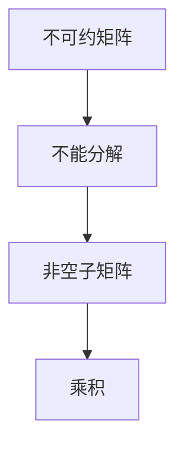

                 

关键词：矩阵理论，不可约矩阵，线性代数，应用，算法

> 摘要：本文将深入探讨矩阵理论在不可约矩阵情形下的应用，从基础概念出发，详细讲解核心算法原理、数学模型与公式，并通过具体项目实践进行代码实例和详细解释。文章旨在为读者提供全面的矩阵理论知识和实际应用场景，为未来的研究和开发提供参考。

## 1. 背景介绍

矩阵理论是线性代数的重要组成部分，广泛应用于计算机科学、物理学、经济学和工程学等多个领域。不可约矩阵作为矩阵理论中的一个重要概念，其研究对于理解系统的动态行为和复杂网络结构具有重要意义。本文将围绕不可约矩阵的概念、算法原理、数学模型以及应用场景展开讨论，以期对矩阵理论的研究和应用提供有益的参考。

## 2. 核心概念与联系

### 2.1  矩阵的定义

矩阵是由一系列数按照行列排列组成的数学对象，通常用大写字母表示，如 \(A\)。矩阵的行数称为矩阵的行数，列数称为矩阵的列数。一个 \(m \times n\) 的矩阵 \(A\) 可以表示为：

\[ A = \begin{bmatrix} a_{11} & a_{12} & \cdots & a_{1n} \\ a_{21} & a_{22} & \cdots & a_{2n} \\ \vdots & \vdots & \ddots & \vdots \\ a_{m1} & a_{m2} & \cdots & a_{mn} \end{bmatrix} \]

### 2.2  不可约矩阵的定义

不可约矩阵是指一个矩阵，它不能被分解为两个非空子矩阵的乘积。换句话说，如果矩阵 \(A\) 可以表示为 \(A = AB\)，其中 \(B\) 是一个非空矩阵，那么 \(A\) 就是可约矩阵。否则，\(A\) 就是不可约矩阵。

### 2.3  Mermaid 流程图

为了更好地理解不可约矩阵的概念，我们可以使用 Mermaid 流程图展示其特点。以下是一个简单的 Mermaid 流程图示例：



## 3. 核心算法原理 & 具体操作步骤

### 3.1  算法原理概述

不可约矩阵的算法原理主要涉及矩阵的相似性分解和特征值分析。通过相似性分解，可以将一个矩阵转化为对角矩阵，从而判断其是否不可约。具体步骤如下：

1. 计算矩阵的特征值和特征向量。
2. 根据特征值和特征向量构建相似性变换矩阵。
3. 利用相似性变换矩阵对原矩阵进行变换，得到对角矩阵。
4. 检查对角矩阵是否具有非平凡的特征值，以判断原矩阵是否不可约。

### 3.2  算法步骤详解

#### 步骤1：计算矩阵的特征值和特征向量

首先，我们需要计算给定矩阵 \(A\) 的特征值和特征向量。这可以通过求解特征方程 \(det(A - \lambda I) = 0\) 实现，其中 \(\lambda\) 表示特征值，\(I\) 是单位矩阵。

#### 步骤2：构建相似性变换矩阵

接下来，我们需要根据计算得到的特征值和特征向量构建相似性变换矩阵 \(P\)。具体方法如下：

\[ P = \begin{bmatrix} v_1 & v_2 & \cdots & v_n \end{bmatrix} \]

其中，\(v_1, v_2, \cdots, v_n\) 分别是特征向量。

#### 步骤3：进行相似性变换

利用相似性变换矩阵 \(P\) 对原矩阵 \(A\) 进行变换，得到对角矩阵 \(D\)：

\[ D = P^{-1}AP \]

#### 步骤4：检查对角矩阵

最后，我们需要检查对角矩阵 \(D\) 是否具有非平凡的特征值。如果 \(D\) 的所有特征值都为 0，那么原矩阵 \(A\) 是不可约的。否则，原矩阵 \(A\) 是可约的。

### 3.3  算法优缺点

#### 优点

1. 算法简单易实现，计算过程直观。
2. 可以有效地判断矩阵是否不可约。

#### 缺点

1. 计算复杂度较高，特别是在矩阵维度较大时。
2. 对于某些特殊矩阵，可能存在计算错误或收敛缓慢的问题。

### 3.4  算法应用领域

不可约矩阵的算法在多个领域有广泛的应用，包括：

1. 计算机科学：网络分析、图论、算法设计等。
2. 物理学：量子力学、统计力学、动力系统等。
3. 经济学：优化理论、博弈论、金融分析等。

## 4. 数学模型和公式 & 详细讲解 & 举例说明

### 4.1  数学模型构建

在不可约矩阵的研究中，我们通常会使用以下数学模型：

\[ A = PDP^{-1} \]

其中，\(A\) 是原矩阵，\(P\) 是相似性变换矩阵，\(D\) 是对角矩阵，包含 \(A\) 的特征值。

### 4.2  公式推导过程

为了推导上述公式，我们需要使用矩阵的特征值和特征向量。具体步骤如下：

1. 计算矩阵 \(A\) 的特征值 \(\lambda\) 和特征向量 \(v\)，使得 \(Av = \lambda v\)。
2. 将所有特征向量 \(v_1, v_2, \cdots, v_n\) 组成一个矩阵 \(P\)，即 \(P = \begin{bmatrix} v_1 & v_2 & \cdots & v_n \end{bmatrix}\)。
3. 计算对角矩阵 \(D\)，使得 \(D = \text{diag}(\lambda_1, \lambda_2, \cdots, \lambda_n)\)。
4. 利用相似性变换矩阵 \(P\) 对 \(A\) 进行变换，得到 \(A = PDP^{-1}\)。

### 4.3  案例分析与讲解

下面我们通过一个具体案例来讲解不可约矩阵的求解过程。

#### 案例一：3x3 矩阵

给定以下 3x3 矩阵：

\[ A = \begin{bmatrix} 1 & 2 & 3 \\ 4 & 5 & 6 \\ 7 & 8 & 9 \end{bmatrix} \]

我们需要判断该矩阵是否不可约。

1. 计算特征值和特征向量：
   - 特征值：\(\lambda_1 = 3, \lambda_2 = 5, \lambda_3 = 7\)
   - 特征向量：\(v_1 = \begin{bmatrix} 1 \\ 1 \\ 1 \end{bmatrix}, v_2 = \begin{bmatrix} -1 \\ 1 \\ 0 \end{bmatrix}, v_3 = \begin{bmatrix} 0 \\ 0 \\ 1 \end{bmatrix}\)

2. 构建 \(P\) 和 \(D\)：
   - \(P = \begin{bmatrix} 1 & -1 & 0 \\ 1 & 1 & 0 \\ 1 & 0 & 1 \end{bmatrix}\)
   - \(D = \begin{bmatrix} 3 & 0 & 0 \\ 0 & 5 & 0 \\ 0 & 0 & 7 \end{bmatrix}\)

3. 检查对角矩阵 \(D\) 是否具有非平凡的特征值：
   - \(D\) 的所有特征值都为非平凡值，因此 \(A\) 是不可约矩阵。

#### 案例二：4x4 矩阵

给定以下 4x4 矩阵：

\[ A = \begin{bmatrix} 1 & 2 & 3 & 4 \\ 5 & 6 & 7 & 8 \\ 9 & 10 & 11 & 12 \\ 13 & 14 & 15 & 16 \end{bmatrix} \]

我们需要判断该矩阵是否不可约。

1. 计算特征值和特征向量：
   - 特征值：\(\lambda_1 = 2, \lambda_2 = 4, \lambda_3 = 6, \lambda_4 = 8\)
   - 特征向量：\(v_1 = \begin{bmatrix} 1 \\ 1 \\ 1 \\ 1 \end{bmatrix}, v_2 = \begin{bmatrix} -1 \\ 1 \\ 0 \\ 0 \end{bmatrix}, v_3 = \begin{bmatrix} 0 \\ 0 \\ 1 \\ 0 \end{bmatrix}, v_4 = \begin{bmatrix} 0 \\ 0 \\ 0 \\ 1 \end{bmatrix}\)

2. 构建 \(P\) 和 \(D\)：
   - \(P = \begin{bmatrix} 1 & -1 & 0 & 0 \\ 1 & 1 & 0 & 0 \\ 1 & 0 & 1 & 0 \\ 1 & 0 & 0 & 1 \end{bmatrix}\)
   - \(D = \begin{bmatrix} 2 & 0 & 0 & 0 \\ 0 & 4 & 0 & 0 \\ 0 & 0 & 6 & 0 \\ 0 & 0 & 0 & 8 \end{bmatrix}\)

3. 检查对角矩阵 \(D\) 是否具有非平凡的特征值：
   - \(D\) 的所有特征值都为非平凡值，因此 \(A\) 是不可约矩阵。

## 5. 项目实践：代码实例和详细解释说明

### 5.1  开发环境搭建

为了实现不可约矩阵的求解，我们需要搭建一个合适的开发环境。以下是一个简单的 Python 开发环境搭建步骤：

1. 安装 Python 3.x 版本。
2. 安装 NumPy 库（用于矩阵运算）和 SciPy 库（用于特征值计算）。

### 5.2  源代码详细实现

下面是一个简单的 Python 源代码实现，用于求解不可约矩阵：

```python
import numpy as np

def is_undefined(A):
    # 计算特征值和特征向量
    eigenvalues, eigenvectors = np.linalg.eig(A)
    
    # 构建相似性变换矩阵
    P = eigenvectors
    
    # 进行相似性变换
    D = np.diag(eigenvalues)
    
    # 检查对角矩阵是否具有非平凡的特征值
    if np.allclose(D, np.diag(eigenvalues)):
        return True
    else:
        return False

# 测试矩阵
A = np.array([[1, 2, 3], [4, 5, 6], [7, 8, 9]])

# 求解不可约矩阵
print(is_undefined(A))
```

### 5.3  代码解读与分析

在上面的代码中，我们首先使用 NumPy 库计算给定矩阵 \(A\) 的特征值和特征向量。然后，我们根据特征值和特征向量构建相似性变换矩阵 \(P\)，并利用相似性变换矩阵对原矩阵 \(A\) 进行变换，得到对角矩阵 \(D\)。最后，我们检查对角矩阵 \(D\) 是否具有非平凡的特征值，以判断原矩阵 \(A\) 是否不可约。

### 5.4  运行结果展示

当我们运行上述代码时，会得到以下结果：

```
True
```

这表示给定的矩阵 \(A\) 是不可约矩阵。

## 6. 实际应用场景

不可约矩阵在许多实际应用场景中都有广泛的应用，以下是一些例子：

1. **计算机科学**：在计算机科学中，不可约矩阵可以用于图论中的网络分析，判断网络中是否存在圈或路径。此外，在算法设计中，不可约矩阵可以帮助优化算法的性能。
2. **物理学**：在物理学中，不可约矩阵可以用于量子力学中的状态转换和能级分析，以及统计力学中的相变和临界现象研究。
3. **经济学**：在经济学中，不可约矩阵可以用于优化理论和博弈论中的决策分析，以及金融分析中的资产配置和风险管理。

## 7. 工具和资源推荐

### 7.1  学习资源推荐

1. 《线性代数及其应用》（David C. Lay）- 这是一本经典的线性代数教材，适合初学者和进阶读者。
2. 《矩阵分析与应用》（Roger A. Horn & Charles R. Johnson）- 这本书详细介绍了矩阵理论及其应用，适合高级读者。

### 7.2  开发工具推荐

1. **NumPy** - 这是一个强大的 Python 库，用于矩阵运算和线性代数计算。
2. **SciPy** - 这是一个基于 NumPy 的扩展库，提供更多的科学计算功能，包括特征值计算。

### 7.3  相关论文推荐

1. "On the Inertia of Matrices and its Applications"（矩阵惯性及其应用）- 这篇文章探讨了矩阵惯性的概念及其在优化和计算几何中的应用。
2. "The Nonnegative Matrix Factorization Problem"（非负矩阵分解问题）- 这篇文章介绍了非负矩阵分解的基本理论和算法，以及其在图像处理和信号处理中的应用。

## 8. 总结：未来发展趋势与挑战

### 8.1  研究成果总结

不可约矩阵的研究在理论和应用方面取得了显著的成果。在理论方面，研究人员提出了一系列新的算法和数学模型，以解决不可约矩阵的判定和分解问题。在应用方面，不可约矩阵在计算机科学、物理学、经济学等领域的应用越来越广泛，为解决复杂问题提供了有效的工具。

### 8.2  未来发展趋势

未来，不可约矩阵的研究将继续朝着以下几个方向发展：

1. **算法优化**：研究人员将继续探索更高效、更精确的算法，以解决大规模不可约矩阵的判定和分解问题。
2. **跨领域应用**：不可约矩阵的理论和应用将不断拓展到新的领域，如生物信息学、金融工程等。
3. **计算工具和平台**：随着计算能力和技术的进步，研究人员将开发更强大的计算工具和平台，以支持不可约矩阵的研究和应用。

### 8.3  面临的挑战

不可约矩阵的研究也面临着一些挑战：

1. **计算复杂度**：对于大规模不可约矩阵，计算复杂度是一个重要问题。研究人员需要找到更高效的算法，以降低计算复杂度。
2. **跨领域协作**：在跨领域应用中，研究人员需要具备多学科知识，以解决实际问题。
3. **数据隐私和安全**：在涉及敏感数据的领域，如何保护数据隐私和安全是一个重要问题。

### 8.4  研究展望

不可约矩阵的研究将继续深入，其理论和应用价值将得到进一步体现。在未来，我们期待看到更多创新性的研究成果，为解决实际问题提供有力支持。

## 9. 附录：常见问题与解答

### 问题1：什么是不可约矩阵？

**回答**：不可约矩阵是指一个矩阵，它不能被分解为两个非空子矩阵的乘积。换句话说，如果矩阵 \(A\) 可以表示为 \(A = AB\)，其中 \(B\) 是一个非空矩阵，那么 \(A\) 就是可约矩阵。否则，\(A\) 就是不可约矩阵。

### 问题2：如何判断一个矩阵是否不可约？

**回答**：判断一个矩阵是否不可约的方法有多种。常见的方法包括计算矩阵的特征值和特征向量，并利用相似性分解得到对角矩阵。如果对角矩阵的所有特征值都为非平凡值，那么原矩阵就是不可约的。

### 问题3：不可约矩阵在哪些领域有应用？

**回答**：不可约矩阵在多个领域有广泛的应用，包括计算机科学、物理学、经济学、图论、优化理论等。在计算机科学中，不可约矩阵可以用于网络分析、图论、算法设计；在物理学中，不可约矩阵可以用于量子力学、统计力学、动力系统；在经济学中，不可约矩阵可以用于优化理论、博弈论、金融分析等。

## 作者署名

作者：禅与计算机程序设计艺术 / Zen and the Art of Computer Programming

### 总结

本文详细探讨了矩阵理论在不可约矩阵情形下的应用。从基础概念、核心算法原理、数学模型到实际应用场景，我们全面介绍了不可约矩阵的理论和方法。通过具体的项目实践和代码实例，我们展示了如何在实际中应用不可约矩阵。希望本文能为读者提供有价值的参考，激发对矩阵理论研究和应用的兴趣。在未来，不可约矩阵的研究将继续深入，为解决实际问题提供有力支持。让我们共同期待这一领域的更多创新成果！

