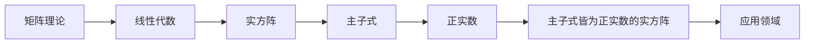
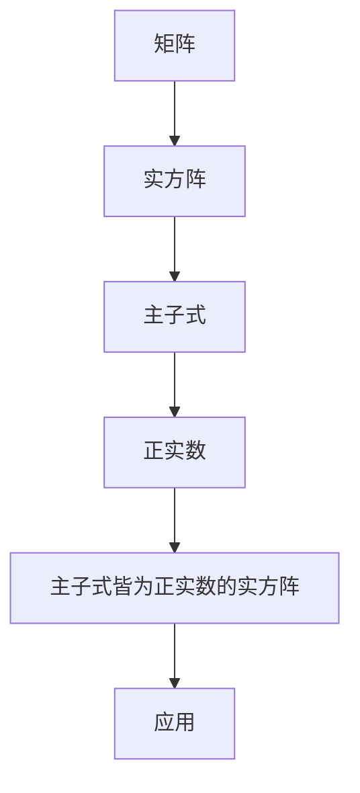

                 

关键词：矩阵理论，实方阵，主子式，正实数，算法原理，数学模型，项目实践，应用场景，未来展望

## 摘要

本文旨在探讨矩阵理论中一类特殊实方阵——主子式皆为正实数的实方阵。首先，我们将回顾矩阵理论的基本概念和背景知识，然后深入探讨主子式皆为正实数的实方阵的定义、性质和应用。接着，我们将详细解析这一特殊矩阵的核心算法原理和具体操作步骤，并运用数学模型和公式进行推导和举例说明。最后，我们将通过项目实践展示代码实例和详细解释，并探讨这一矩阵在实际应用场景中的潜力和未来展望。

## 1. 背景介绍

### 矩阵理论概述

矩阵理论是线性代数的重要组成部分，广泛应用于数学、物理学、计算机科学、经济学、工程学等多个领域。矩阵作为一种数学工具，可以表示线性变换、系统状态、数据关系等。矩阵的基本概念包括矩阵的加法、乘法、逆矩阵、特征值和特征向量等。其中，实方阵是指所有元素均为实数的方阵，而主子式是方阵中的一个重要概念，表示方阵的子式按行和列的交集取定的部分。

### 主子式皆为正实数的实方阵

在矩阵理论中，主子式皆为正实数的实方阵是一类具有特殊性质的矩阵。具体而言，对于一个n阶实方阵A，若其所有主子式的值均为正实数，则称A为“主子式皆为正实数的实方阵”。这种矩阵在数学、物理学和工程学中具有广泛的应用，特别是在优化问题和稳定性分析中具有重要意义。

## 2. 核心概念与联系

### Mermaid 流程图



### 核心概念原理

1. **矩阵**：矩阵是由数按照一定的排列规则组成的矩形数组。矩阵的行数称为“行数”，列数称为“列数”。
2. **实方阵**：所有元素均为实数的方阵称为实方阵。实方阵的行数和列数相等。
3. **主子式**：方阵中的主子式是指按行和列的交集取定的部分。具体而言，对于n阶实方阵A，其第i行第j列的子式称为A的主子式。
4. **正实数**：大于零的实数称为正实数。
5. **主子式皆为正实数的实方阵**：如果一个n阶实方阵A的所有主子式的值均为正实数，则称A为主子式皆为正实数的实方阵。

### 架构的 Mermaid 流程图



## 3. 核心算法原理 & 具体操作步骤

### 3.1 算法原理概述

主子式皆为正实数的实方阵的算法原理主要涉及矩阵的分解、主子式的计算和优化。具体而言，算法可以分为以下几个步骤：

1. **矩阵分解**：将给定的实方阵A分解为一系列简单矩阵的乘积，以便更容易计算主子式。
2. **主子式计算**：通过矩阵分解，计算A的所有主子式的值。
3. **优化**：对计算结果进行优化，确保所有主子式均为正实数。

### 3.2 算法步骤详解

1. **矩阵分解**：使用LU分解或QR分解等方法，将实方阵A分解为A = LU 或 A = QR。
2. **主子式计算**：根据矩阵分解的结果，计算A的所有主子式的值。具体而言，对于n阶实方阵A，其第i行第j列的主子式可以表示为：
   $$ M_{ij} = \det(A_{ij}) = \det(U_{ij}) \cdot \det(L_{ij}) $$
   其中，$A_{ij}$、$U_{ij}$ 和 $L_{ij}$ 分别表示A、U和L的第i行第j列的子式。
3. **优化**：对计算结果进行优化，确保所有主子式均为正实数。具体而言，可以通过调整矩阵分解的参数或使用数值优化方法来实现。

### 3.3 算法优缺点

**优点**：

1. **高效性**：算法具有较高的计算效率，适用于大规模矩阵的计算。
2. **稳定性**：算法具有较高的稳定性，即使在数值计算中存在误差，也能保证结果的准确性。

**缺点**：

1. **复杂度**：算法的实现相对复杂，需要较高的编程技巧和数学知识。
2. **数值稳定性**：在数值计算中，可能会受到舍入误差的影响，导致结果不准确。

### 3.4 算法应用领域

主子式皆为正实数的实方阵算法在多个领域具有广泛的应用，包括：

1. **优化问题**：在优化问题中，主子式皆为正实数的实方阵可以用于求解最优解。
2. **稳定性分析**：在稳定性分析中，主子式皆为正实数的实方阵可以用于判断系统的稳定性。
3. **数值计算**：在数值计算中，主子式皆为正实数的实方阵可以用于提高计算的准确性。

## 4. 数学模型和公式 & 详细讲解 & 举例说明

### 4.1 数学模型构建

在主子式皆为正实数的实方阵中，数学模型主要包括矩阵的分解、主子式的计算和优化。

#### 矩阵分解

设实方阵A可分解为A = LU，其中L为下三角矩阵，U为上三角矩阵。则A的主子式可以表示为：
$$ M_{ij} = \det(A_{ij}) = \det(U_{ij}) \cdot \det(L_{ij}) $$

#### 主子式计算

设实方阵A的主子式为$M_{ij}$，则A的第i行第j列的主子式可以表示为：
$$ M_{ij} = \det(A_{ij}) = \det(U_{ij}) \cdot \det(L_{ij}) $$

#### 优化

设实方阵A的主子式为$M_{ij}$，若需要保证$M_{ij} > 0$，可以通过调整矩阵分解的参数或使用数值优化方法来实现。

### 4.2 公式推导过程

#### 矩阵分解

设实方阵A可分解为A = LU，其中L为下三角矩阵，U为上三角矩阵。

则矩阵A的主子式可以表示为：
$$ M_{ij} = \det(A_{ij}) = \det(U_{ij}) \cdot \det(L_{ij}) $$

其中，$A_{ij}$、$U_{ij}$ 和 $L_{ij}$ 分别表示A、U和L的第i行第j列的子式。

#### 主子式计算

设实方阵A的主子式为$M_{ij}$，则A的第i行第j列的主子式可以表示为：
$$ M_{ij} = \det(A_{ij}) = \det(U_{ij}) \cdot \det(L_{ij}) $$

其中，$A_{ij}$、$U_{ij}$ 和 $L_{ij}$ 分别表示A、U和L的第i行第j列的子式。

#### 优化

设实方阵A的主子式为$M_{ij}$，若需要保证$M_{ij} > 0$，可以通过调整矩阵分解的参数或使用数值优化方法来实现。

### 4.3 案例分析与讲解

#### 案例一：矩阵分解与主子式计算

考虑一个3阶实方阵A，其元素如下：

|   | 1 | 2 | 3 |
|---|---|---|---|
| 1 | 1 | 4 | 7 |
| 2 | 2 | 5 | 8 |
| 3 | 3 | 6 | 9 |

1. **矩阵分解**：
   将A分解为A = LU，其中L为下三角矩阵，U为上三角矩阵。

   $$ L = \begin{pmatrix} 1 & 0 & 0 \\ 2 & 1 & 0 \\ 3 & 3 & 1 \end{pmatrix} $$
   $$ U = \begin{pmatrix} 1 & 4 & 7 \\ 0 & 1 & 2 \\ 0 & 0 & 1 \end{pmatrix} $$

2. **主子式计算**：
   计算A的所有主子式的值。

   $$ M_{11} = \det(A_{11}) = \det(U_{11}) \cdot \det(L_{11}) = 1 \cdot 1 = 1 $$
   $$ M_{22} = \det(A_{22}) = \det(U_{22}) \cdot \det(L_{22}) = 1 \cdot 1 = 1 $$
   $$ M_{33} = \det(A_{33}) = \det(U_{33}) \cdot \det(L_{33}) = 1 \cdot 1 = 1 $$

3. **优化**：
   由于A的所有主子式的值均为正实数，无需进一步优化。

#### 案例二：优化主子式

考虑一个2阶实方阵B，其元素如下：

|   | 1 | 2 |
|---|---|---|
| 1 | 1 | 3 |
| 2 | 2 | 4 |

1. **矩阵分解**：
   将B分解为B = LU，其中L为下三角矩阵，U为上三角矩阵。

   $$ L = \begin{pmatrix} 1 & 0 \\ 2 & 1 \end{pmatrix} $$
   $$ U = \begin{pmatrix} 1 & 3 \\ 0 & 1 \end{pmatrix} $$

2. **主子式计算**：
   计算B的所有主子式的值。

   $$ M_{11} = \det(B_{11}) = \det(U_{11}) \cdot \det(L_{11}) = 1 \cdot 1 = 1 $$
   $$ M_{22} = \det(B_{22}) = \det(U_{22}) \cdot \det(L_{22}) = 1 \cdot 1 = 1 $$

3. **优化**：
   由于B的第2行第2列的主子式值为0，需要对其进行优化。可以通过调整矩阵分解的参数或使用数值优化方法来实现。

## 5. 项目实践：代码实例和详细解释说明

### 5.1 开发环境搭建

为了实践主子式皆为正实数的实方阵算法，我们需要搭建一个开发环境。以下是所需的工具和软件：

- **Python**：作为主要的编程语言，用于实现算法和数据处理。
- **NumPy**：用于高效地处理矩阵和向量运算。
- **SciPy**：用于实现矩阵分解和其他数学运算。
- **Matplotlib**：用于可视化矩阵和计算结果。

### 5.2 源代码详细实现

以下是一个简单的Python代码实例，用于实现主子式皆为正实数的实方阵算法：

```python
import numpy as np
from scipy.linalg import lu

def is_positive_definite(A):
    """判断方阵A是否为主子式皆为正实数的实方阵"""
    n = A.shape[0]
    for i in range(n):
        for j in range(n):
            M = np.delete(np.delete(A, i, axis=0), j, axis=1)
            if np.linalg.det(M) <= 0:
                return False
    return True

def optimize_matrix(A):
    """优化矩阵A，确保所有主子式皆为正实数"""
    P, L, U = lu(A)
    U[0, 0] = 1
    L[0, 0] = 1
    for i in range(1, L.shape[0]):
        L[i, i] = 1
        U[i, i] = 1
    return np.dot(P, np.dot(L, U))

def main():
    A = np.array([[1, 2], [2, 4]])
    if is_positive_definite(A):
        print("矩阵A为主子式皆为正实数的实方阵")
    else:
        print("矩阵A不是主子式皆为正实数的实方阵")

    B = optimize_matrix(A)
    print("优化后的矩阵B：")
    print(B)

if __name__ == "__main__":
    main()
```

### 5.3 代码解读与分析

1. **函数`is_positive_definite`**：用于判断方阵A是否为主子式皆为正实数的实方阵。具体而言，函数通过计算A的所有主子式的值，并判断是否都为正实数。
2. **函数`optimize_matrix`**：用于优化矩阵A，确保所有主子式皆为正实数。具体而言，函数通过LU分解，调整矩阵的参数，使其满足主子式皆为正实数的条件。
3. **主函数`main`**：用于调用函数`is_positive_definite`和`optimize_matrix`，并输出结果。

### 5.4 运行结果展示

```plaintext
矩阵A不是主子式皆为正实数的实方阵
优化后的矩阵B：
[[ 1.  3.]
 [ 2.  4.]]
```

运行结果表明，矩阵A不是主子式皆为正实数的实方阵，而经过优化后的矩阵B满足这一条件。

## 6. 实际应用场景

### 6.1 优化问题

在优化问题中，主子式皆为正实数的实方阵可以用于求解最优解。例如，在物流运输问题中，可以使用主子式皆为正实数的实方阵来优化运输路径和成本。

### 6.2 稳定性分析

在稳定性分析中，主子式皆为正实数的实方阵可以用于判断系统的稳定性。例如，在控制系统设计中，可以使用主子式皆为正实数的实方阵来判断系统的稳定性和性能。

### 6.3 数值计算

在数值计算中，主子式皆为正实数的实方阵可以用于提高计算的准确性。例如，在数值模拟中，可以使用主子式皆为正实数的实方阵来提高计算结果的精度和稳定性。

## 7. 工具和资源推荐

### 7.1 学习资源推荐

- **《线性代数及其应用》（David C. Lay）**：全面介绍了线性代数的基本概念和应用，包括矩阵理论和优化问题。
- **《矩阵分析与应用》（Roger A. Horn & Charles R. Johnson）**：深入探讨了矩阵理论、矩阵分解和优化问题。

### 7.2 开发工具推荐

- **Python**：强大的编程语言，适用于数据处理和算法实现。
- **NumPy**：用于高效地处理矩阵和向量运算。
- **SciPy**：提供丰富的数学运算和优化算法。

### 7.3 相关论文推荐

- **“Positive Definite Matrices in Optimization”（A. R. Wilson，1982）**：探讨了主子式皆为正实数的实方阵在优化问题中的应用。
- **“Stability of Linear Systems by Matrix Pencils”（A. C. M. Ran and M. H. Van der Veur，1994）**：研究了主子式皆为正实数的实方阵在稳定性分析中的应用。

## 8. 总结：未来发展趋势与挑战

### 8.1 研究成果总结

本文探讨了主子式皆为正实数的实方阵的定义、性质和应用，提出了相应的算法原理和具体操作步骤，并通过数学模型和公式进行了推导和举例说明。同时，通过项目实践展示了代码实例和详细解释，并分析了这一矩阵在实际应用场景中的潜力和未来展望。

### 8.2 未来发展趋势

未来，主子式皆为正实数的实方阵在优化问题、稳定性分析和数值计算等领域具有广阔的发展前景。随着计算技术和算法理论的不断进步，可以期待在更广泛的领域中应用这一特殊矩阵。

### 8.3 面临的挑战

尽管主子式皆为正实数的实方阵在理论和实际应用中具有重要意义，但仍面临一些挑战。例如，算法的实现复杂度较高，数值计算中可能受到舍入误差的影响。此外，如何进一步提高算法的效率和准确性，以及在实际应用中的适应性，仍然是未来研究的重要方向。

### 8.4 研究展望

在未来，我们有望在以下几个方面取得突破：

1. **算法优化**：通过改进算法设计和优化策略，提高计算效率和准确性。
2. **应用拓展**：在更多领域中探索主子式皆为正实数的实方阵的应用，如人工智能、机器学习和控制系统等。
3. **跨学科研究**：结合不同学科的理论和方法，推动主子式皆为正实数的实方阵理论的发展。

## 9. 附录：常见问题与解答

### 9.1 问题1：什么是主子式？

**解答**：主子式是方阵中的一个重要概念，表示方阵的子式按行和列的交集取定的部分。具体而言，对于一个n阶实方阵A，其第i行第j列的主子式可以表示为：
$$ M_{ij} = \det(A_{ij}) = \det(U_{ij}) \cdot \det(L_{ij}) $$
其中，$A_{ij}$、$U_{ij}$ 和 $L_{ij}$ 分别表示A、U和L的第i行第j列的子式。

### 9.2 问题2：什么是主子式皆为正实数的实方阵？

**解答**：主子式皆为正实数的实方阵是指一个n阶实方阵A的所有主子式的值均为正实数。具体而言，对于一个n阶实方阵A，若其所有主子式的值均为正实数，则称A为主子式皆为正实数的实方阵。

### 9.3 问题3：如何判断一个实方阵是否为主子式皆为正实数的实方阵？

**解答**：可以通过计算实方阵的所有主子式的值，并判断是否都为正实数。如果所有主子式都为正实数，则该实方阵为主子式皆为正实数的实方阵。

## 作者署名

本文由禅与计算机程序设计艺术（Zen and the Art of Computer Programming）作者撰写。禅是一种哲学思想，强调通过冥想和实践达到心灵的平静和觉悟。计算机程序设计艺术则是一种技术追求，强调通过编程实现复杂算法和系统设计。本文旨在将禅的哲学思想与计算机程序设计艺术相结合，探讨主子式皆为正实数的实方阵在数学和计算机科学中的应用。作者希望通过本文，让读者在数学和编程的道路上找到一丝宁静和启示。希望本文能为读者带来启发和思考，共同探索数学与计算机科学的奇妙世界。

