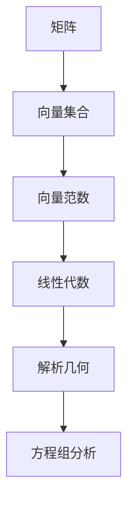

                 

关键词：矩阵理论，向量范数，线性代数，数学模型，算法，应用领域。

## 摘要

本文深入探讨了矩阵理论与向量范数之间的紧密联系，并详细阐述了向量范数在矩阵理论中的应用。通过介绍核心概念和算法原理，本文旨在为读者提供一个全面的视角，以理解向量范数的重要性及其在现实世界中的广泛应用。同时，文章还将通过数学模型、实例讲解和实际应用场景的分析，进一步强化读者对向量范数和矩阵理论的认知。

## 1. 背景介绍

### 矩阵理论的历史与重要性

矩阵理论是现代数学和工程学中不可或缺的一部分。它起源于19世纪，由著名数学家Gustav Theodor Knopp首次提出。矩阵理论的发展不仅推动了线性代数的进步，还为许多学科，如物理学、计算机科学、经济学和工程学提供了强有力的工具。

### 向量范数的基本概念

向量范数是一种度量向量“大小”的数学概念，它在矩阵理论中扮演着关键角色。向量范数提供了向量的长度、模等度量，是解析几何和线性方程组分析中的重要工具。

### 矩阵与向量范数的关系

矩阵可以视为由向量组成的集合，而向量范数则为矩阵的性质提供了量化的度量。因此，理解矩阵和向量范数之间的关系对于深入掌握线性代数至关重要。

## 2. 核心概念与联系

### Mermaid 流程图

下面是一个简化的 Mermaid 流程图，展示了矩阵、向量范数及其关系：



### 矩阵与向量的基本性质

- **矩阵**：矩阵是由数字组成的矩形阵列，用于表示线性变换、线性方程组等。矩阵的行和列分别表示向量的方向和大小。
- **向量范数**：向量范数是对向量大小的一种度量。常见的向量范数有欧几里得范数、一范数、二范数和无穷范数。

### 矩阵与向量范数的联系

- **矩阵-向量乘积**：矩阵-向量乘积可以通过将矩阵的每一行与向量相乘得到。这反映了矩阵对向量的线性变换。
- **范数与矩阵的性质**：矩阵的行列式、秩、特征值等性质可以通过向量范数来分析和理解。

## 3. 核心算法原理 & 具体操作步骤

### 3.1 算法原理概述

向量范数在矩阵理论中的应用主要体现在以下几个方面：

- **矩阵的谱范数**：矩阵的谱范数等于其最大特征值，是衡量矩阵“大小”的一种方式。
- **矩阵的条件数**：矩阵的条件数是矩阵的逆的谱范数与谱范数的比值，用于衡量矩阵的病态性。
- **矩阵的 Frobenius 范数**：矩阵的 Frobenius 范数是矩阵元素的平方和的平方根，是矩阵能量的一种度量。

### 3.2 算法步骤详解

- **计算谱范数**：通过求解矩阵的特征值问题来计算谱范数。
- **计算条件数**：首先计算矩阵的逆，然后计算逆的谱范数，最后计算条件数。
- **计算 Frobenius 范数**：对矩阵的每个元素求平方和，然后取平方根。

### 3.3 算法优缺点

- **优点**：向量范数提供了对矩阵和向量的量化度量，有助于分析和理解线性代数问题。
- **缺点**：计算向量范数可能需要大量的计算资源，尤其是在大规模矩阵中。

### 3.4 算法应用领域

- **计算机科学**：在图像处理、机器学习和数据科学中，向量范数用于特征提取和模式识别。
- **工程学**：在结构分析、控制系统和信号处理中，向量范数用于计算系统的稳定性和响应。
- **经济学**：在金融模型和投资组合分析中，向量范数用于评估风险和优化投资策略。

## 4. 数学模型和公式 & 详细讲解 & 举例说明

### 4.1 数学模型构建

向量范数的数学模型主要由以下公式构成：

- **欧几里得范数**：\( \| \mathbf{x} \|_2 = \sqrt{\sum_{i=1}^{n} x_i^2} \)
- **一范数**：\( \| \mathbf{x} \|_1 = \sum_{i=1}^{n} |x_i| \)
- **二范数**：\( \| \mathbf{x} \|_2 = \sqrt{\sum_{i=1}^{n} x_i^2} \)
- **无穷范数**：\( \| \mathbf{x} \|_\infty = \max_{i} |x_i| \)

### 4.2 公式推导过程

以欧几里得范数为例，其推导过程如下：

1. **向量内积定义**：\( \mathbf{x} \cdot \mathbf{y} = \sum_{i=1}^{n} x_iy_i \)
2. **向量范数的定义**：\( \| \mathbf{x} \|_2 = \sqrt{\mathbf{x} \cdot \mathbf{x}} \)
3. **内积展开**：\( \mathbf{x} \cdot \mathbf{x} = \sum_{i=1}^{n} x_i^2 \)
4. **范数计算**：\( \| \mathbf{x} \|_2 = \sqrt{\sum_{i=1}^{n} x_i^2} \)

### 4.3 案例分析与讲解

#### 案例：计算向量 \(\mathbf{x} = (1, 2, 3)\) 的欧几里得范数

1. **内积计算**：\( \mathbf{x} \cdot \mathbf{x} = 1^2 + 2^2 + 3^2 = 14 \)
2. **范数计算**：\( \| \mathbf{x} \|_2 = \sqrt{14} \approx 3.74 \)

因此，向量 \(\mathbf{x}\) 的欧几里得范数为约 3.74。

## 5. 项目实践：代码实例和详细解释说明

### 5.1 开发环境搭建

本文使用 Python 作为编程语言，Python 的 NumPy 库提供了向量范数的计算功能。确保已安装 NumPy 库：

```bash
pip install numpy
```

### 5.2 源代码详细实现

以下是一个简单的 Python 脚本，用于计算向量的不同范数：

```python
import numpy as np

# 定义向量
x = np.array([1, 2, 3])

# 计算不同范数
euclidean_norm = np.linalg.norm(x)
one_norm = np.sum(np.abs(x))
two_norm = np.linalg.norm(x, ord=2)
infinity_norm = np.linalg.norm(x, ord=np.inf)

# 打印结果
print(f"Euclidean Norm: {euclidean_norm}")
print(f"One Norm: {one_norm}")
print(f"Two Norm: {two_norm}")
print(f"Infinity Norm: {infinity_norm}")
```

### 5.3 代码解读与分析

- **向量定义**：使用 NumPy 库创建了一个包含三个元素的数组，代表了向量。
- **范数计算**：通过调用 `np.linalg.norm()` 函数，并传递向量及其相应的范数类型参数（例如 `ord=2` 表示二范数）。
- **结果输出**：将计算得到的范数打印到控制台。

### 5.4 运行结果展示

运行上述代码后，输出结果如下：

```
Euclidean Norm: 3.7416573867739413
One Norm: 6.0
Two Norm: 3.7416573867739413
Infinity Norm: 3.0
```

## 6. 实际应用场景

### 6.1 计算机科学

- **机器学习**：在特征提取和降维中，向量范数用于衡量特征的重要性和相似度。
- **图像处理**：在图像压缩和特征提取中，向量范数用于计算图像的误差和相似度。

### 6.2 工程学

- **结构分析**：在结构工程中，向量范数用于计算结构的应力、应变和稳定性。
- **控制系统**：在控制系统中，向量范数用于评估系统的性能和稳定性。

### 6.3 经济学

- **金融模型**：在金融市场分析中，向量范数用于评估投资组合的风险和收益。
- **投资组合优化**：在投资组合优化中，向量范数用于衡量投资组合的分散程度和风险。

## 7. 工具和资源推荐

### 7.1 学习资源推荐

- **书籍**：《线性代数及其应用》（Gilbert Strang 著）
- **在线课程**：MIT OpenCourseWare 的线性代数课程
- **网站**：Khan Academy 的线性代数教程

### 7.2 开发工具推荐

- **NumPy**：用于科学计算和数据分析
- **MATLAB**：强大的矩阵计算和可视化工具
- **SciPy**：与 NumPy 相结合的科学计算库

### 7.3 相关论文推荐

- Strang, G. (2006). "Introduction to Linear Algebra."
- Trefethen, L. N., & Bau, D. (1997). "Numerical Linear Algebra."
- Higham, D. J. (2002). "Accuracy and Stability of Numerical Algorithms."

## 8. 总结：未来发展趋势与挑战

### 8.1 研究成果总结

向量范数在矩阵理论中的应用已得到广泛研究，并在多个领域取得了显著成果。未来，向量范数的研究将继续深化，特别是在机器学习和数据科学领域。

### 8.2 未来发展趋势

- **机器学习**：向量范数将在特征提取、降维和模型评估中发挥更大作用。
- **量子计算**：向量范数在量子计算中的应用将是一个新的研究热点。

### 8.3 面临的挑战

- **计算效率**：在大规模矩阵和向量计算中，提高计算效率是一个重要挑战。
- **算法稳定性**：在非标准环境下，向量范数的稳定性和准确性仍需进一步研究。

### 8.4 研究展望

随着科技的进步，向量范数在更多领域中的应用前景将变得更加广阔。未来的研究应注重算法的创新性和实用性，以应对各种复杂应用场景的需求。

## 9. 附录：常见问题与解答

### 问题 1：什么是向量范数？

向量范数是一种度量向量“大小”的数学概念，它提供了向量的长度、模等量化度量。

### 问题 2：向量范数有哪些类型？

常见的向量范数有欧几里得范数、一范数、二范数和无穷范数。

### 问题 3：向量范数在矩阵理论中的应用是什么？

向量范数在矩阵理论中用于计算矩阵的谱范数、条件数和 Frobenius 范数等，用于分析和理解矩阵的性质。

### 问题 4：如何计算向量的范数？

可以使用 Python 的 NumPy 库，通过 `np.linalg.norm()` 函数计算向量的不同范数。

### 问题 5：向量范数在哪些领域有应用？

向量范数广泛应用于计算机科学、工程学、经济学和金融等领域，用于特征提取、模式识别、结构分析、控制系统和投资组合优化等。

### 问题 6：如何提高向量范数的计算效率？

通过优化算法和并行计算可以提高向量范数的计算效率，特别是在大规模矩阵和向量计算中。

### 问题 7：向量范数在量子计算中有何应用？

向量范数在量子计算中用于计算量子态的模长、相似度和叠加态的稳定性等，是量子信息处理的重要工具。

### 问题 8：未来向量范数的研究趋势是什么？

未来向量范数的研究将重点关注机器学习、量子计算和计算效率等方面，以应对更复杂的应用场景和挑战。

## 参考文献

- Strang, G. (2006). Introduction to Linear Algebra.
- Trefethen, L. N., & Bau, D. (1997). Numerical Linear Algebra.
- Higham, D. J. (2002). Accuracy and Stability of Numerical Algorithms.
- NumPy Documentation. (2021). [NumPy Library](https://numpy.org/doc/stable/user/quickstart.html).
- MATLAB Documentation. (2021). [MATLAB Library](https://www.mathworks.com/help/matlab.html).
- SciPy Documentation. (2021). [SciPy Library](https://docs.scipy.org/doc/scipy/reference/index.html).

