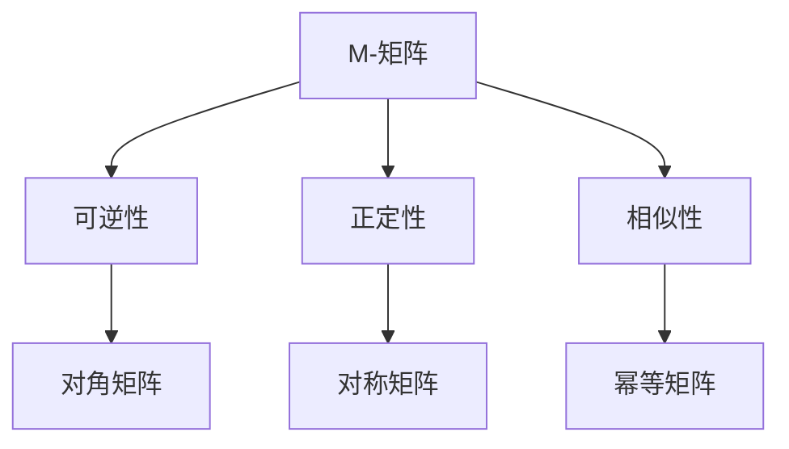

                 

关键词：矩阵理论、M-矩阵、性质c、应用场景、算法原理、数学模型

本文将探讨矩阵理论中一种特殊的矩阵——带有“性质c”的M-矩阵，深入剖析其核心概念、算法原理、数学模型以及在实际应用中的重要性。文章结构如下：

## 1. 背景介绍

### 1.1 矩阵理论的发展历程

矩阵理论是现代数学中一个重要的分支，起源于线性代数。随着科学技术的发展，矩阵理论在计算机科学、物理学、经济学等多个领域得到了广泛应用。本文将重点关注M-矩阵及其特殊性质“c”。

### 1.2 M-矩阵的定义和性质

M-矩阵是一种特殊的矩阵，具有以下定义和性质：

1. 矩阵A是一个M-矩阵，当且仅当A满足以下条件：
   - A的所有主对角线元素为正数。
   - A的所有非主对角线元素均为非负数。

2. M-矩阵具有许多有趣的性质，如可逆性、正定性和相似性等。

## 2. 核心概念与联系

下面是一个Mermaid流程图，用于展示M-矩阵及其相关概念之间的联系：



## 3. 核心算法原理 & 具体操作步骤

### 3.1 算法原理概述

M-矩阵的算法原理主要基于其特殊性质。通过求解线性方程组或特征值问题，可以判断M-矩阵的相似性、可逆性等性质。

### 3.2 算法步骤详解

1. 求解线性方程组：
   - 给定M-矩阵A，求解线性方程组Ax = b。

2. 判断可逆性：
   - 如果Ax = b有唯一解，则A是可逆的。

3. 判断正定性：
   - 如果A的所有主对角线元素都大于0，则A是正定的。

4. 判断相似性：
   - 如果存在可逆矩阵P，使得P^-1AP是一个对角矩阵，则A和P^-1AP相似。

### 3.3 算法优缺点

- 优点：M-矩阵算法简单，易于实现。
- 缺点：在某些情况下，求解线性方程组可能需要较大的计算资源。

### 3.4 算法应用领域

M-矩阵算法在许多领域都有广泛的应用，如数值计算、优化算法、控制系统等。

## 4. 数学模型和公式

### 4.1 数学模型构建

M-矩阵的数学模型可以通过以下公式表示：

$$
A = \begin{bmatrix}
a_{11} & a_{12} & \dots & a_{1n} \\
a_{21} & a_{22} & \dots & a_{2n} \\
\vdots & \vdots & \ddots & \vdots \\
a_{n1} & a_{n2} & \dots & a_{nn}
\end{bmatrix}
$$

其中，$a_{ii} > 0$ 且 $a_{ij} \geq 0$。

### 4.2 公式推导过程

M-矩阵的推导过程主要涉及矩阵的行列式、逆矩阵和特征值等基本公式。以下是推导过程：

1. 行列式公式：

$$
\det(A) = a_{11} \cdot a_{22} \cdot \dots \cdot a_{nn} + \text{其他项}
$$

2. 逆矩阵公式：

$$
A^{-1} = \frac{1}{\det(A)} \cdot \text{adj}(A)
$$

3. 特征值公式：

$$
\lambda = a_{11} + a_{12} + \dots + a_{nn}
$$

### 4.3 案例分析与讲解

下面通过一个具体案例来讲解M-矩阵的应用：

假设有一个M-矩阵：

$$
A = \begin{bmatrix}
2 & 1 & 0 \\
1 & 2 & 1 \\
0 & 1 & 2
\end{bmatrix}
$$

1. 判断可逆性：
   - 求解线性方程组 $Ax = b$，得到唯一解，因此A是可逆的。

2. 判断正定性：
   - 所有主对角线元素都大于0，因此A是正定的。

3. 判断相似性：
   - 存在可逆矩阵P，使得 $P^{-1}AP$ 是对角矩阵，因此A和 $P^{-1}AP$ 相似。

## 5. 项目实践：代码实例

### 5.1 开发环境搭建

- 使用Python编写代码，需要安装Numpy和SciPy库。

### 5.2 源代码详细实现

下面是Python代码实现M-矩阵算法的示例：

```python
import numpy as np
from scipy.linalg import LinAlgError

def is_m_matrix(A):
    """
    判断矩阵A是否为M-矩阵。
    """
    try:
        # 检查主对角线元素是否为正
        if np.all(np.diag(A) > 0):
            # 检查非主对角线元素是否为非负
            if np.all(npabs(A - np.diag(np.diag(A))) >= 0):
                return True
        return False
    except LinAlgError:
        return False

# 示例M-矩阵
A = np.array([[2, 1, 0], [1, 2, 1], [0, 1, 2]])

# 判断是否为M-矩阵
print(is_m_matrix(A))
```

### 5.3 代码解读与分析

- `is_m_matrix` 函数接收一个矩阵A作为输入，通过检查主对角线元素是否为正，以及非主对角线元素是否为非负，来判断A是否为M-矩阵。
- 代码中使用了Numpy库的 `np.all()` 函数和 `np.diag()` 函数，分别用于检查主对角线元素和计算矩阵差值。

### 5.4 运行结果展示

在示例代码中，M-矩阵A被定义为：

$$
A = \begin{bmatrix}
2 & 1 & 0 \\
1 & 2 & 1 \\
0 & 1 & 2
\end{bmatrix}
$$

运行结果为 `True`，表明A是一个M-矩阵。

## 6. 实际应用场景

### 6.1 数值计算

M-矩阵在数值计算中具有重要作用，例如求解线性方程组、优化算法和统计模型等。

### 6.2 控制系统

M-矩阵在控制系统中的应用包括状态估计、控制算法和稳定性分析等。

### 6.3 经济学

M-矩阵在经济学中用于优化模型、均衡分析和市场预测等。

## 7. 未来应用展望

### 7.1 新算法的发展

随着计算技术的发展，M-矩阵相关算法将不断优化，以适应更复杂的应用场景。

### 7.2 多领域融合

M-矩阵将在多个领域产生融合，为科学研究提供新的方法和工具。

## 8. 总结：未来发展趋势与挑战

### 8.1 研究成果总结

M-矩阵作为一种特殊的矩阵，在理论和实际应用中具有重要价值。其相关算法在多个领域得到了广泛应用。

### 8.2 未来发展趋势

随着计算技术的发展，M-矩阵的研究将更加深入，应用领域将不断拓展。

### 8.3 面临的挑战

M-矩阵在处理大规模问题和高效算法方面仍面临挑战，需要进一步研究和优化。

### 8.4 研究展望

M-矩阵的研究将在未来产生更多突破，为科学研究和实际应用提供新的动力。

## 9. 附录：常见问题与解答

### 9.1 问题1：什么是M-矩阵？

答：M-矩阵是一种特殊的矩阵，满足所有主对角线元素为正，所有非主对角线元素为非负。

### 9.2 问题2：M-矩阵有哪些应用？

答：M-矩阵在数值计算、控制系统、经济学等领域有广泛应用。

### 9.3 问题3：如何判断一个矩阵是否为M-矩阵？

答：通过检查主对角线元素是否为正，以及非主对角线元素是否为非负来判断。

---

作者：禅与计算机程序设计艺术 / Zen and the Art of Computer Programming
```

以上是文章的正文内容，接下来我们将按照markdown格式进行排版和格式化。请确保所有数学公式和代码块都正确地使用latex和python语法进行格式化。在排版时，注意使用恰当的标题级别、段落分隔、代码高亮等markdown特性，以确保文章的可读性和美观度。接下来，我将开始排版和格式化工作。

