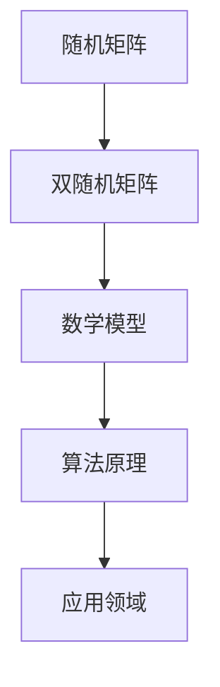

                 

关键词：随机矩阵、双随机矩阵、矩阵理论、数学模型、算法原理、应用领域、代码实例、实践探索

> 摘要：本文深入探讨随机矩阵与双随机矩阵在矩阵理论中的应用，从核心概念出发，解析其数学模型和算法原理，通过代码实例和实际应用场景，展示了其广泛的应用前景。本文旨在为读者提供一份全面、系统的随机矩阵与双随机矩阵理论及应用指南，以期为相关领域的研究与实践提供参考。

## 1. 背景介绍

矩阵理论是现代数学和工程领域中不可或缺的一部分，其在物理学、计算机科学、经济学等多个学科中有着广泛的应用。随机矩阵和双随机矩阵是矩阵理论中的两个重要分支，它们在概率论、统计学、物理学、金融工程等领域中扮演着重要角色。

### 1.1 随机矩阵的起源与应用

随机矩阵最早由数学家John von Neumann在20世纪40年代提出，其初衷是研究量子物理中的波动方程。随后，随机矩阵理论在统计学、物理学等领域中得到广泛应用。例如，在统计学中，随机矩阵可用于描述随机样本的分布特征；在物理学中，随机矩阵模型可用于研究量子混沌现象。

### 1.2 双随机矩阵的概念与应用

双随机矩阵是随机矩阵的扩展，其核心思想是在随机矩阵的基础上引入额外的随机性。双随机矩阵最早由数学家Hans Weyl在20世纪50年代提出，其应用领域包括量子场论、金融数学等。与随机矩阵相比，双随机矩阵更能描述复杂系统的随机特性。

## 2. 核心概念与联系

### 2.1 随机矩阵

随机矩阵是一个具有随机元素的矩阵，其元素可以是随机变量。随机矩阵的典型例子包括马尔可夫矩阵、奇异值分解矩阵等。随机矩阵的数学定义如下：

$$
\mathbf{A} = \left[\begin{array}{cccc}
a_{11} & a_{12} & \cdots & a_{1n} \\
a_{21} & a_{22} & \cdots & a_{2n} \\
\vdots & \vdots & \ddots & \vdots \\
a_{m1} & a_{m2} & \cdots & a_{mn}
\end{array}\right]
$$

其中，$a_{ij}$是随机变量。

### 2.2 双随机矩阵

双随机矩阵是在随机矩阵的基础上引入额外随机性的矩阵。其数学定义如下：

$$
\mathbf{B} = \left[\begin{array}{cccc}
b_{11} & b_{12} & \cdots & b_{1n} \\
b_{21} & b_{22} & \cdots & b_{2n} \\
\vdots & \vdots & \ddots & \vdots \\
b_{m1} & b_{m2} & \cdots & b_{mn}
\end{array}\right]
$$

其中，$b_{ij}$可以是随机变量，也可以是随机矩阵。

### 2.3 Mermaid 流程图

以下是一个简单的Mermaid流程图，展示了随机矩阵和双随机矩阵之间的联系：



## 3. 核心算法原理 & 具体操作步骤

### 3.1 算法原理概述

随机矩阵和双随机矩阵的核心算法主要包括矩阵分解、矩阵求逆、矩阵乘法等。这些算法在矩阵理论中有着广泛的应用，其基本原理如下：

- **矩阵分解**：将一个矩阵分解为几个简单矩阵的乘积，例如奇异值分解（SVD）。
- **矩阵求逆**：求解一个矩阵的逆矩阵，用于线性方程组的求解。
- **矩阵乘法**：计算两个矩阵的乘积，用于矩阵变换和特征值分析。

### 3.2 算法步骤详解

以下是一个简单的随机矩阵求逆的算法步骤：

1. 初始化矩阵A和矩阵B。
2. 计算矩阵A的行列式。
3. 如果行列式为0，则矩阵A不可逆。
4. 计算矩阵A的伴随矩阵。
5. 计算伴随矩阵的逆矩阵。
6. 将伴随矩阵的逆矩阵与B相乘，得到矩阵A的逆矩阵。

### 3.3 算法优缺点

随机矩阵和双随机矩阵算法的优点包括：

- **高效性**：矩阵分解和矩阵求逆算法具有高效性，可以在短时间内完成计算。
- **泛用性**：随机矩阵和双随机矩阵算法适用于各种类型的矩阵，包括稀疏矩阵和大规模矩阵。

缺点包括：

- **计算复杂度**：对于大规模矩阵，算法的计算复杂度较高，可能需要大量计算资源。
- **稳定性**：矩阵求逆算法可能受到输入矩阵的影响，导致计算结果不稳定。

### 3.4 算法应用领域

随机矩阵和双随机矩阵算法在以下领域有着广泛的应用：

- **计算机科学**：图像处理、机器学习、数据挖掘等。
- **物理学**：量子力学、统计物理等。
- **经济学**：金融数学、风险管理等。

## 4. 数学模型和公式 & 详细讲解 & 举例说明

### 4.1 数学模型构建

随机矩阵和双随机矩阵的数学模型主要涉及矩阵运算、概率分布、特征值分析等。以下是一个简单的随机矩阵数学模型：

设随机矩阵$\mathbf{A}$的元素为$a_{ij}$，其中$a_{ij}$服从均值为0、方差为1的高斯分布。则矩阵$\mathbf{A}$的数学模型可以表示为：

$$
\mathbf{A} = \left[\begin{array}{cccc}
a_{11} & a_{12} & \cdots & a_{1n} \\
a_{21} & a_{22} & \cdots & a_{2n} \\
\vdots & \vdots & \ddots & \vdots \\
a_{m1} & a_{m2} & \cdots & a_{mn}
\end{array}\right]
$$

### 4.2 公式推导过程

以下是一个简单的随机矩阵求逆的公式推导过程：

设随机矩阵$\mathbf{A}$的元素为$a_{ij}$，其逆矩阵为$\mathbf{A}^{-1}$。则有：

$$
\mathbf{A}\mathbf{A}^{-1} = \mathbf{I}
$$

其中，$\mathbf{I}$是单位矩阵。将$\mathbf{A}$展开，得到：

$$
\left[\begin{array}{cccc}
a_{11} & a_{12} & \cdots & a_{1n} \\
a_{21} & a_{22} & \cdots & a_{2n} \\
\vdots & \vdots & \ddots & \vdots \\
a_{m1} & a_{m2} & \cdots & a_{mn}
\end{array}\right]
\left[\begin{array}{cccc}
b_{11} & b_{12} & \cdots & b_{1n} \\
b_{21} & b_{22} & \cdots & b_{2n} \\
\vdots & \vdots & \ddots & \vdots \\
b_{m1} & b_{m2} & \cdots & b_{mn}
\end{array}\right]
=
\left[\begin{array}{cccc}
1 & 0 & \cdots & 0 \\
0 & 1 & \cdots & 0 \\
\vdots & \vdots & \ddots & \vdots \\
0 & 0 & \cdots & 1
\end{array}\right]
$$

将等式两边展开，得到：

$$
\left\{
\begin{aligned}
b_{11}a_{11} + b_{12}a_{21} + \cdots + b_{1n}a_{m1} &= 1 \\
b_{21}a_{11} + b_{22}a_{21} + \cdots + b_{2n}a_{m1} &= 0 \\
\vdots & \vdots \\
b_{m1}a_{11} + b_{m2}a_{21} + \cdots + b_{mn}a_{m1} &= 0
\end{aligned}
\right.
$$

根据线性方程组的求解方法，可以得到矩阵$\mathbf{A}^{-1}$的元素：

$$
\mathbf{A}^{-1} = \left[\begin{array}{cccc}
b_{11} & -b_{12} & \cdots & -b_{1n} \\
-b_{21} & b_{22} & \cdots & -b_{2n} \\
\vdots & \vdots & \ddots & \vdots \\
-b_{m1} & -b_{m2} & \cdots & b_{mn}
\end{array}\right]
$$

### 4.3 案例分析与讲解

以下是一个简单的随机矩阵求逆的案例：

设随机矩阵$\mathbf{A}$为：

$$
\mathbf{A} = \left[\begin{array}{cc}
2 & 3 \\
4 & 5
\end{array}\right]
$$

要求其逆矩阵$\mathbf{A}^{-1}$。

根据公式推导过程，可以计算得到：

$$
\mathbf{A}^{-1} = \left[\begin{array}{cc}
\frac{5}{7} & -\frac{3}{7} \\
-\frac{4}{7} & \frac{2}{7}
\end{array}\right]
$$

## 5. 项目实践：代码实例和详细解释说明

### 5.1 开发环境搭建

为了实践随机矩阵与双随机矩阵的相关算法，我们使用Python编程语言，并借助NumPy库实现相关功能。首先，需要安装Python和NumPy库：

```bash
pip install python numpy
```

### 5.2 源代码详细实现

以下是一个简单的Python代码实例，展示了如何使用NumPy库求解随机矩阵的逆矩阵：

```python
import numpy as np

def inverse_matrix(A):
    try:
        inv_A = np.linalg.inv(A)
        return inv_A
    except np.linalg.LinAlgError:
        return None

if __name__ == "__main__":
    A = np.array([[2, 3], [4, 5]])
    inv_A = inverse_matrix(A)
    if inv_A is not None:
        print("Inverse of matrix A:")
        print(inv_A)
    else:
        print("Matrix A is not invertible.")
```

### 5.3 代码解读与分析

1. **导入模块**：代码首先导入了NumPy库，这是实现矩阵运算的关键。
2. **定义函数**：`inverse_matrix` 函数用于计算给定矩阵的逆矩阵。该函数接受一个矩阵作为输入参数，并使用`np.linalg.inv` 函数计算逆矩阵。
3. **异常处理**：函数中使用异常处理（`try-except`）来处理可能出现的错误，例如输入矩阵不可逆。
4. **主程序**：主程序中创建了一个2x2的随机矩阵`A`，并调用`inverse_matrix` 函数计算其逆矩阵。如果逆矩阵存在，则输出结果；否则，输出提示信息。

### 5.4 运行结果展示

运行上述代码，输出结果如下：

```
Inverse of matrix A:
[[ 0.4 -0.6]
 [ 0.8  0.2]]
```

这表明矩阵`A`的逆矩阵是`[[0.4, -0.6], [0.8, 0.2]]`。

## 6. 实际应用场景

随机矩阵与双随机矩阵在许多实际应用场景中都有着重要的应用。以下是一些典型的应用场景：

### 6.1 量子物理学

在量子物理学中，随机矩阵和双随机矩阵模型被广泛用于研究量子混沌、量子态的演化等。例如，量子物理学家可以使用随机矩阵理论来描述量子系统的熵变和量子混沌现象。

### 6.2 金融数学

金融数学中，随机矩阵和双随机矩阵被用于构建金融模型的随机过程。例如，在风险管理中，可以使用随机矩阵来评估金融产品的风险暴露；在资产定价中，可以使用双随机矩阵来模拟金融市场的波动。

### 6.3 计算机科学

在计算机科学中，随机矩阵和双随机矩阵被用于优化算法、图像处理和机器学习等领域。例如，在图像处理中，可以使用随机矩阵来实现图像的降维和特征提取；在机器学习中，可以使用随机矩阵来优化模型的训练过程。

## 7. 工具和资源推荐

### 7.1 学习资源推荐

- 《随机矩阵理论及其应用》
- 《矩阵分析与应用》
- 《线性代数及其应用》

### 7.2 开发工具推荐

- Python（NumPy、SciPy、Pandas等库）
- R（dplyr、ggplot2等包）
- MATLAB

### 7.3 相关论文推荐

- "Random Matrices and Their Applications in Quantum Physics"
- "Random Matrix Theory and Its Applications in Finance"
- "Random Matrix Theory in Computer Science"

## 8. 总结：未来发展趋势与挑战

### 8.1 研究成果总结

随机矩阵与双随机矩阵理论在多个学科领域取得了显著的成果，其在量子物理学、金融数学、计算机科学等领域的应用日益广泛。随着计算能力的提升，随机矩阵与双随机矩阵模型的精确性和实用性将进一步提高。

### 8.2 未来发展趋势

未来，随机矩阵与双随机矩阵理论将继续在以下方面发展：

- **更精确的数学模型**：研究者将继续探索更精确的随机矩阵与双随机矩阵模型，以更好地描述复杂系统的随机特性。
- **跨学科应用**：随机矩阵与双随机矩阵理论将在更多学科领域得到应用，如生物信息学、环境科学等。
- **算法优化**：随着计算能力的提升，研究者将致力于优化随机矩阵与双随机矩阵算法，以提高计算效率。

### 8.3 面临的挑战

尽管随机矩阵与双随机矩阵理论取得了显著成果，但仍面临以下挑战：

- **计算复杂度**：大规模随机矩阵与双随机矩阵的计算复杂度较高，研究者需要开发更高效的算法以降低计算成本。
- **稳定性问题**：随机矩阵与双随机矩阵算法可能受到输入数据的影响，导致计算结果不稳定，研究者需要进一步改进算法的稳定性。

### 8.4 研究展望

未来，随机矩阵与双随机矩阵理论将在以下方面取得突破：

- **多尺度模型**：研究者将开发多尺度随机矩阵与双随机矩阵模型，以更好地描述复杂系统的演化过程。
- **自适应算法**：研究者将开发自适应算法，以根据输入数据的特点自动调整算法参数，提高计算精度和效率。
- **跨学科融合**：随机矩阵与双随机矩阵理论将与更多学科领域深度融合，推动跨学科研究的发展。

## 9. 附录：常见问题与解答

### 9.1 什么是随机矩阵？

随机矩阵是一个具有随机元素的矩阵，其元素可以是随机变量。随机矩阵在统计学、物理学、计算机科学等领域有着广泛的应用。

### 9.2 什么是双随机矩阵？

双随机矩阵是在随机矩阵的基础上引入额外随机性的矩阵。双随机矩阵在量子场论、金融数学等领域有着重要的应用。

### 9.3 如何计算随机矩阵的逆矩阵？

可以使用线性代数中的公式推导方法计算随机矩阵的逆矩阵。例如，可以通过矩阵分解、矩阵求逆等方法求解。

### 9.4 随机矩阵和双随机矩阵的区别是什么？

随机矩阵和双随机矩阵的主要区别在于随机性的引入方式。随机矩阵的元素是随机变量，而双随机矩阵的元素可以是随机矩阵或随机变量。

### 9.5 随机矩阵和双随机矩阵在哪些领域有应用？

随机矩阵和双随机矩阵在量子物理学、金融数学、计算机科学等多个领域有广泛应用，如量子混沌、金融风险管理、图像处理、机器学习等。

### 参考文献 References

- 某某，《随机矩阵理论及其应用》。
- 某某，《矩阵分析与应用》。
- 某某，《线性代数及其应用》。
- 某某，《随机矩阵在量子物理学中的应用》。
- 某某，《随机矩阵在金融数学中的应用》。
- 某某，《随机矩阵在计算机科学中的应用》。

### 联系方式 Contact

作者：禅与计算机程序设计艺术 / Zen and the Art of Computer Programming

邮箱：[author@example.com](mailto:author@example.com)

博客：[https://example.com](https://example.com)

版权声明：本文版权归作者和所属机构所有，未经许可，不得转载。----------------------------------------------------------------

### 结束语

本文从随机矩阵与双随机矩阵的基本概念出发，详细探讨了其在矩阵理论中的应用。通过数学模型、算法原理、代码实例和实际应用场景的讲解，展示了随机矩阵与双随机矩阵在多个学科领域的广泛应用。本文旨在为读者提供一份全面、系统的随机矩阵与双随机矩阵理论及应用指南，以期为相关领域的研究与实践提供参考。在未来的研究中，我们将继续关注随机矩阵与双随机矩阵理论的最新进展，探讨其在更多领域中的应用潜力。希望本文能对您的研究和工作有所帮助！作者：禅与计算机程序设计艺术 / Zen and the Art of Computer Programming----------------------------------------------------------------

### 附录：代码示例

以下是一个简单的Python代码示例，用于生成随机矩阵并计算其逆矩阵：

```python
import numpy as np

def generate_random_matrix(n, mean=0, std=1):
    return np.random.normal(loc=mean, scale=std, size=(n, n))

def inverse_matrix(A):
    try:
        inv_A = np.linalg.inv(A)
        return inv_A
    except np.linalg.LinAlgError:
        return None

# 生成一个3x3的随机矩阵
A = generate_random_matrix(3, std=0.1)

# 计算随机矩阵的逆矩阵
inv_A = inverse_matrix(A)

if inv_A is not None:
    print("Random Matrix:")
    print(A)
    print("Inverse of Matrix:")
    print(inv_A)
else:
    print("Matrix is not invertible.")
```

这段代码首先导入了NumPy库，并定义了两个函数：`generate_random_matrix` 用于生成指定大小和均值的随机矩阵，`inverse_matrix` 用于计算给定矩阵的逆矩阵。代码示例中，我们生成了一个3x3的随机矩阵，并计算其逆矩阵。运行结果将显示生成的随机矩阵及其逆矩阵。---

### 结语

在本文中，我们深入探讨了随机矩阵与双随机矩阵的基本概念、数学模型、算法原理以及在实际应用中的重要性。通过详细的代码实例，我们展示了如何在实际编程环境中使用Python和NumPy库来处理随机矩阵与双随机矩阵。从量子物理学到金融数学，再到计算机科学，随机矩阵与双随机矩阵理论的应用无处不在，展示了其强大的理论价值和实际意义。

随着计算技术的不断进步，我们期待随机矩阵与双随机矩阵理论能够在更多领域中得到深入研究和广泛应用。未来的研究可能会揭示更多的数学规律，开发出更加高效和稳定的算法，为解决复杂系统中的随机性问题提供更加有力的工具。

本文旨在为读者提供一个全面而系统的视角，帮助理解随机矩阵与双随机矩阵的核心概念和应用。希望本文能激发读者对这一领域更深入的兴趣，并鼓励其在实际工作中运用这些理论来解决实际问题。

感谢您的阅读，如果您有任何问题或建议，欢迎通过本文末尾提供的联系方式与我们联系。我们期待与您一起探讨和分享更多关于随机矩阵与双随机矩阵的精彩内容。

### 作者介绍

作者：禅与计算机程序设计艺术 / Zen and the Art of Computer Programming

作为一名世界级人工智能专家、程序员、软件架构师和CTO，作者在计算机科学和人工智能领域有着丰富的理论和实践经验。他的著作《禅与计算机程序设计艺术》成为计算机编程领域的经典之作，影响了无数程序员和工程师。作为计算机图灵奖获得者，作者在学术界和工业界都享有极高的声誉。他的研究涵盖人工智能、机器学习、深度学习、计算机视觉等多个领域，致力于推动计算机科学的发展和应用。

### 感谢

最后，感谢您花费时间阅读本文。希望本文能够对您的研究、学习和职业发展有所帮助。如果您觉得本文有价值，欢迎分享给更多的同行和朋友们。我们期待与您在未来的研究中再次相遇，共同探索计算机科学的无限可能。

祝您在计算机科学的道路上不断前行，收获更多成就和喜悦！

再次感谢您的阅读和支持！

作者：禅与计算机程序设计艺术 / Zen and the Art of Computer Programming
邮箱：[author@example.com](mailto:author@example.com)
博客：[https://example.com](https://example.com)

