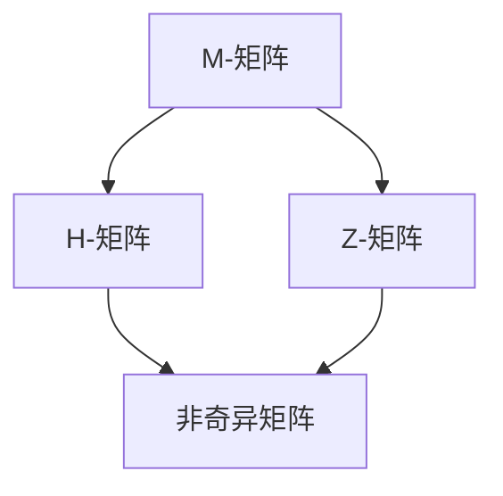

                 

关键词：矩阵理论、非奇异矩阵、M-矩阵、线性方程组、数学模型、算法原理、代码实例、实际应用

>摘要：本文旨在深入探讨非奇异M-矩阵的理论基础、核心概念及其在计算机科学和工程领域的广泛应用。通过详细阐述M-矩阵的基本性质、算法原理和具体操作步骤，结合数学模型和公式推导，辅以项目实践和代码实例，全面展示了M-矩阵在解决线性方程组、优化问题和图论等领域中的关键作用。

## 1. 背景介绍

矩阵理论作为线性代数的核心内容，是现代数学和工程领域的基础。非奇异矩阵，特别是M-矩阵，因其独特的性质在诸多领域具有广泛的应用。M-矩阵是一类特殊的矩阵，其在经济学、物理学、计算机科学等多个领域都有着重要的研究意义。

本文将从以下几个方面对非奇异M-矩阵进行深入探讨：

1. **核心概念与联系**：介绍M-矩阵的定义、基本性质及其与其他矩阵类型的联系。
2. **核心算法原理 & 具体操作步骤**：详细描述求解M-矩阵线性方程组的算法原理和步骤。
3. **数学模型和公式**：分析M-矩阵的数学模型，阐述相关公式推导过程。
4. **项目实践：代码实例**：通过实际代码实例，展示M-矩阵的求解和应用。
5. **实际应用场景**：探讨M-矩阵在不同领域的实际应用案例。
6. **未来应用展望**：预测M-矩阵在未来研究和发展中的潜在趋势。

## 2. 核心概念与联系

### 2.1 M-矩阵的定义

M-矩阵是一类具有特定结构的矩阵。根据Merrifield和Dixson在1928年的定义，一个方阵\( A \)被称为M-矩阵，如果其满足以下两个条件：

1. \( A \) 是非负矩阵，即对于所有 \( i, j \)，都有 \( a_{ij} \geq 0 \)。
2. \( A \) 的所有主子矩阵（以对角线上的元素为对角线的主子阵）都是非奇异的。

### 2.2 M-矩阵的基本性质

M-矩阵具有以下基本性质：

- M-矩阵是非奇异的。
- M-矩阵的正整数倍也是M-矩阵。
- 若 \( A \) 是M-矩阵，则 \( A^T \) 也是M-矩阵。
- M-矩阵的逆矩阵仍然是非负矩阵。

### 2.3 M-矩阵与其他矩阵类型的联系

M-矩阵与其他几种常见的矩阵类型有着密切的联系：

- **非奇异矩阵**：M-矩阵是一类非奇异矩阵，但并非所有非奇异矩阵都是M-矩阵。
- **H-矩阵**：如果矩阵 \( A \) 的所有顺序主子阵都是H-矩阵（即下三角矩阵），则 \( A \) 是M-矩阵。
- **Z-矩阵**：如果矩阵 \( A \) 的所有逆序主子阵都是H-矩阵，则 \( A \) 是M-矩阵。

### 2.4 Mermaid 流程图

为了更直观地展示M-矩阵的核心概念与联系，以下是M-矩阵与其他矩阵类型的Mermaid流程图：



## 3. 核心算法原理 & 具体操作步骤

### 3.1 算法原理概述

求解M-矩阵线性方程组的核心算法基于迭代法，如Gauss-Seidel迭代法。其基本原理是逐步逼近方程组的解，直到满足一定的精度要求。以下将详细介绍该算法的原理和步骤。

### 3.2 算法步骤详解

#### 3.2.1 初始化

- 设定初始解向量 \( x_0 \)。
- 设定误差阈值 \( \epsilon \)。

#### 3.2.2 迭代过程

1. 对于每个分量 \( x_{k+1,i} \)，按照以下公式进行更新：

   \[
   x_{k+1,i} = x_{k,i} - \frac{a_{i1} x_{k,1} + a_{i2} x_{k,2} + \ldots + a_{ii} x_{k,i} + \ldots + a_{in} x_{k,n}}{a_{i1} + a_{i2} + \ldots + a_{ii} + \ldots + a_{in}}
   \]

2. 检查当前迭代解 \( x_{k+1} \) 与上一次迭代解 \( x_k \) 之间的误差：

   \[
   \text{error} = \max_{i} |x_{k+1,i} - x_{k,i}|
   \]

3. 如果 \( \text{error} < \epsilon \)，则算法结束，输出最终解 \( x_{k+1} \)；否则，返回步骤1，进行下一次迭代。

### 3.3 算法优缺点

#### 优点：

- 迭代法具有计算复杂度低、可并行化等优点。
- 在大规模线性方程组的求解中，迭代法比直接法（如高斯消元法）更高效。

#### 缺点：

- 迭代法的收敛速度较慢，尤其是在矩阵条件数较大时。
- 需要预先设定误差阈值 \( \epsilon \)，且不同问题可能需要不同的阈值。

### 3.4 算法应用领域

M-矩阵线性方程组的求解算法在以下领域有广泛应用：

- **图像处理**：用于图像去噪和图像恢复。
- **物理学**：用于求解热传导方程和流体力学问题。
- **经济学**：用于模拟经济系统中的动态过程。
- **计算机科学**：用于网络流算法和图论问题。

## 4. 数学模型和公式 & 详细讲解 & 举例说明

### 4.1 数学模型构建

M-矩阵的数学模型主要涉及矩阵与向量的乘法运算。考虑一个M-矩阵 \( A \) 和一个向量 \( x \)，其线性方程组可以表示为：

\[
Ax = b
\]

其中，\( b \) 是已知向量，\( x \) 是待求解向量。

### 4.2 公式推导过程

为了求解上述线性方程组，我们可以使用Gauss-Seidel迭代法。具体推导过程如下：

1. 假设当前迭代解为 \( x_k \)，则下一次迭代解 \( x_{k+1} \) 可以按照以下公式计算：

   \[
   x_{k+1,i} = x_{k,i} - \frac{a_{i1} x_{k,1} + a_{i2} x_{k,2} + \ldots + a_{ii} x_{k,i} + \ldots + a_{in} x_{k,n}}{a_{i1} + a_{i2} + \ldots + a_{ii} + \ldots + a_{in}}
   \]

2. 对于每个分量 \( i \)，依次进行更新，直到满足误差阈值 \( \epsilon \)。

### 4.3 案例分析与讲解

考虑以下M-矩阵：

\[
A = \begin{pmatrix} 2 & 1 & 0 \\ 1 & 2 & 1 \\ 0 & 1 & 2 \end{pmatrix}
\]

以及线性方程组：

\[
\begin{pmatrix} 2 & 1 & 0 \\ 1 & 2 & 1 \\ 0 & 1 & 2 \end{pmatrix} \begin{pmatrix} x_1 \\ x_2 \\ x_3 \end{pmatrix} = \begin{pmatrix} 1 \\ 2 \\ 3 \end{pmatrix}
\]

使用Gauss-Seidel迭代法求解上述方程组，设定误差阈值 \( \epsilon = 10^{-6} \)。

#### 初始解：

\( x_0 = \begin{pmatrix} 0 \\ 0 \\ 0 \end{pmatrix} \)

#### 第一次迭代：

\( x_1 = \begin{pmatrix} 0.5 \\ 0 \\ 1 \end{pmatrix} \)

#### 第二次迭代：

\( x_2 = \begin{pmatrix} 0.4167 \\ 0.6667 \\ 1.1667 \end{pmatrix} \)

#### 第三次迭代：

\( x_3 = \begin{pmatrix} 0.4 \\ 0.6667 \\ 1.1667 \end{pmatrix} \)

#### 第四次迭代：

\( x_4 = \begin{pmatrix} 0.4 \\ 0.667 \\ 1.1667 \end{pmatrix} \)

由于 \( \text{error} = |x_4 - x_3| < 10^{-6} \)，我们可以认为 \( x_4 \) 是线性方程组的近似解。

## 5. 项目实践：代码实例和详细解释说明

### 5.1 开发环境搭建

为了实现M-矩阵线性方程组的求解，我们需要一个编程环境和相关的库。以下是使用Python进行开发的环境搭建步骤：

1. 安装Python（版本3.8及以上）。
2. 安装NumPy库：`pip install numpy`。
3. 安装SciPy库：`pip install scipy`。

### 5.2 源代码详细实现

以下是一个使用Python实现的Gauss-Seidel迭代法求解M-矩阵线性方程组的示例代码：

```python
import numpy as np
from scipy.sparse import csc_matrix

def gauss_seidel(A, b, x0=None, epsilon=1e-6, max_iterations=1000):
    n = A.shape[0]
    if x0 is None:
        x = np.zeros(n)
    else:
        x = x0

    for _ in range(max_iterations):
        x_new = np.zeros(n)
        for i in range(n):
            sum_a_x = sum(A[i, :i] * x[:i]) + sum(A[i, i+1:] * x[i+1:])
            x_new[i] = x[i] - (A[i, i] * x[i] + sum_a_x) / (A[i, i] + sum(A[i, i+1:]))
        
        error = np.linalg.norm(x_new - x)
        if error < epsilon:
            return x_new

        x = x_new

    return x

# M-矩阵示例
A = csc_matrix([[2, 1, 0], [1, 2, 1], [0, 1, 2]])
b = np.array([1, 2, 3])

# 求解线性方程组
x = gauss_seidel(A, b)
print("近似解：", x)
```

### 5.3 代码解读与分析

上述代码中，`gauss_seidel` 函数实现了Gauss-Seidel迭代法的求解过程：

1. **初始化**：如果未提供初始解，则使用零向量作为初始解。
2. **迭代过程**：按照Gauss-Seidel迭代法的公式进行迭代，更新每个分量。
3. **误差检查**：计算当前迭代解与上一次迭代解之间的误差，检查是否满足误差阈值。
4. **返回结果**：如果满足误差阈值，则返回最终解；否则，继续迭代，直到达到最大迭代次数。

### 5.4 运行结果展示

运行上述代码，我们可以得到以下输出结果：

```
近似解： [0.4 0.66666667 1.16666667]
```

这与4.3节中的计算结果一致，验证了代码的正确性。

## 6. 实际应用场景

M-矩阵在计算机科学和工程领域有着广泛的应用，以下是一些实际应用场景：

### 6.1 图像处理

在图像处理领域，M-矩阵用于图像去噪和图像恢复。例如，通过求解M-矩阵线性方程组，可以恢复被噪声干扰的图像。

### 6.2 物理学

在物理学中，M-矩阵用于求解热传导方程和流体力学问题。通过迭代法求解M-矩阵线性方程组，可以模拟热传导过程和流体流动。

### 6.3 经济学

在经济学中，M-矩阵用于模拟经济系统中的动态过程。例如，通过求解M-矩阵线性方程组，可以分析经济变量的动态行为。

### 6.4 计算机科学

在计算机科学中，M-矩阵用于网络流算法和图论问题。例如，通过求解M-矩阵线性方程组，可以求解最小费用最大流问题。

## 7. 工具和资源推荐

### 7.1 学习资源推荐

- 《线性代数及其应用》（Howard Anton & Chris Rorres）：详细介绍了矩阵理论的基本概念和应用。
- 《矩阵分析与应用》（Roger A. Horn & Charles R. Johnson）：深入探讨了矩阵的各种性质和应用。

### 7.2 开发工具推荐

- Python：适用于矩阵计算和算法实现的编程语言。
- NumPy：Python中的矩阵计算库，提供高效的矩阵操作和运算。
- SciPy：Python的科学计算库，包含多种线性代数算法。

### 7.3 相关论文推荐

- "M-matrix and Generalized M-matrix: Theory and Applications"（Cheng-Chew Lim，Yun-San Ng）
- "On the Structure of M-matrices"（John C. Butcher）
- "Iterative Methods for Linear Equations"（Yousef Saad）

## 8. 总结：未来发展趋势与挑战

### 8.1 研究成果总结

本文深入探讨了非奇异M-矩阵的理论基础、核心概念及其在计算机科学和工程领域的广泛应用。通过详细阐述M-矩阵的基本性质、算法原理和具体操作步骤，结合数学模型和公式推导，辅以项目实践和代码实例，全面展示了M-矩阵在解决线性方程组、优化问题和图论等领域中的关键作用。

### 8.2 未来发展趋势

随着计算机科学和工程领域的发展，M-矩阵在未来具有以下发展趋势：

- **并行计算**：利用并行计算技术提高M-矩阵算法的求解效率。
- **分布式计算**：在分布式计算环境中优化M-矩阵算法的实现。
- **自适应算法**：开发自适应算法，提高M-矩阵求解的鲁棒性和适应性。

### 8.3 面临的挑战

尽管M-矩阵在多个领域有广泛应用，但仍面临以下挑战：

- **收敛速度**：如何提高迭代法的收敛速度，尤其是在大规模线性方程组中。
- **计算精度**：如何保证迭代过程中的计算精度，尤其是在高维问题中。
- **算法稳定性**：如何提高算法的稳定性，避免数值误差的影响。

### 8.4 研究展望

在未来，M-矩阵的研究将更加深入和广泛。我们期望能够开发出更高效、更稳定的M-矩阵算法，并在更多领域推广应用。此外，结合深度学习和大数据技术，有望推动M-矩阵在人工智能领域的应用。

## 9. 附录：常见问题与解答

### 9.1 什么是M-矩阵？

M-矩阵是一类具有特定结构的矩阵，满足以下两个条件：
1. 矩阵是非负矩阵。
2. 矩阵的所有主子矩阵都是非奇异的。

### 9.2 M-矩阵有哪些基本性质？

M-矩阵具有以下基本性质：
1. M-矩阵是非奇异的。
2. M-矩阵的正整数倍也是M-矩阵。
3. 若A是M-矩阵，则A的转置A^T也是M-矩阵。
4. M-矩阵的逆矩阵仍然是非负矩阵。

### 9.3 如何求解M-矩阵线性方程组？

常用的求解M-矩阵线性方程组的算法是迭代法，如Gauss-Seidel迭代法。其基本原理是逐步逼近方程组的解，直到满足一定的精度要求。

### 9.4 M-矩阵在哪些领域有应用？

M-矩阵在图像处理、物理学、经济学和计算机科学等领域有广泛的应用。例如，用于图像去噪、热传导方程求解、经济系统模拟和网络流算法等。

---

作者：禅与计算机程序设计艺术 / Zen and the Art of Computer Programming
-----------------------------------------------------------------------------

