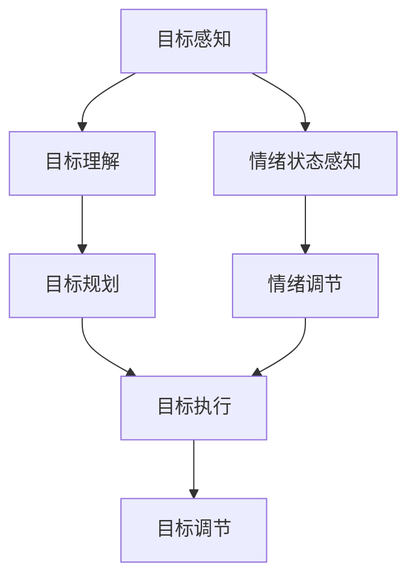

                 

 关键词：短期目标管理、意识功能、人工智能、目标设定、执行力、效率优化、决策支持、情绪调节

> 摘要：本文深入探讨了短期目标管理的意识功能，解析了其在人工智能应用中的重要作用。通过对核心概念的阐述、算法原理的解析以及实际案例的剖析，文章揭示了短期目标管理在提升工作效率、优化决策过程和增强情绪调节方面的关键作用。同时，文章也对未来的发展趋势和挑战进行了展望，为短期目标管理领域的研究提供了新思路。

## 1. 背景介绍

短期目标管理在现代社会中扮演着越来越重要的角色。随着信息时代的到来，人们面对的工作和生活压力日益增加，如何有效地设定和实现短期目标成为了一项重要的能力。传统的目标管理方法主要依赖于个体的意志力和自我约束，而随着人工智能技术的发展，人工智能在短期目标管理中的应用逐渐成为可能。

人工智能通过大数据分析、机器学习等技术，可以更准确地理解个体行为，预测目标实现的可能性，并提供个性化的建议和反馈。这种智能化的目标管理方法不仅提高了目标的设定和实现效率，还能够通过情感计算和情绪分析，对个体的情绪状态进行实时监控和调节，从而提高整体的工作效率和幸福感。

本文将重点探讨短期目标管理的意识功能，即人工智能如何通过感知和理解个体意识，来提升目标管理的有效性。我们将从核心概念、算法原理、数学模型、实际案例以及未来展望等多个方面，对短期目标管理的意识功能进行深入探讨。

## 2. 核心概念与联系

### 2.1 意识与目标管理

意识是人类心智的高级表现形式，涉及知觉、思维、情感等多个方面。在短期目标管理中，意识功能主要体现在以下几个方面：

1. **目标感知**：个体通过意识感知短期目标的存在和重要性。
2. **目标理解**：个体通过意识理解目标的含义和实现路径。
3. **目标规划**：个体通过意识制定实现目标的计划和时间表。
4. **目标执行**：个体通过意识驱动实际行动，逐步实现目标。
5. **目标调节**：个体通过意识对目标实现过程进行动态调整。

### 2.2 意识功能与人工智能

人工智能在短期目标管理中的应用，主要依赖于对意识功能的模拟和增强。具体来说，人工智能通过以下方式实现意识功能：

1. **感知与识别**：利用计算机视觉、语音识别等技术，实时感知个体的行为和情绪状态。
2. **理解与建模**：利用自然语言处理、机器学习等技术，理解个体目标的意义和实现路径。
3. **规划与优化**：利用优化算法、规划系统等技术，制定高效的目标实现计划。
4. **执行与反馈**：通过自动化执行任务和实时反馈机制，辅助个体实现目标。
5. **调节与适应**：通过自适应系统、情感计算等技术，对目标实现过程进行动态调节。

### 2.3 意识功能的 Mermaid 流程图

下面是短期目标管理的意识功能的 Mermaid 流程图：



### 2.4 核心概念原理

#### 2.4.1 目标感知

目标感知是意识功能的第一步，它涉及对短期目标的存在和重要性的感知。在人工智能应用中，计算机视觉和语音识别技术可以用来感知个体的行为和言语，从而识别短期目标的设定。

#### 2.4.2 目标理解

目标理解是对目标含义和实现路径的深入理解。人工智能通过自然语言处理和机器学习技术，可以解析个体设定的目标，并生成相应的目标模型。

#### 2.4.3 目标规划

目标规划是根据目标模型，制定实现目标的时间表和计划。人工智能可以通过优化算法和规划系统，为个体提供最优的目标实现路径。

#### 2.4.4 目标执行

目标执行是实际行动的过程。人工智能可以通过自动化执行任务和实时反馈机制，辅助个体实现目标。

#### 2.4.5 目标调节

目标调节是在目标实现过程中，根据实际情况对目标进行动态调整。人工智能通过自适应系统和情感计算技术，可以对目标实现过程进行实时调节。

#### 2.4.6 情绪状态感知

情绪状态感知是通过对个体行为和言语的感知，了解个体的情绪状态。在人工智能应用中，情感计算技术可以用来分析个体的情绪状态。

#### 2.4.7 情绪调节

情绪调节是通过情感计算技术，对个体的情绪状态进行实时监控和调节。在目标管理中，情绪调节可以有助于提高个体的执行力和工作效率。

## 3. 核心算法原理 & 具体操作步骤

### 3.1 算法原理概述

短期目标管理的核心算法主要包括目标感知、目标理解、目标规划、目标执行、目标调节和情绪状态感知等几个模块。这些模块通过相互协作，实现对短期目标的有效管理。

1. **目标感知模块**：利用计算机视觉和语音识别技术，实时感知个体的行为和言语，识别短期目标的设定。
2. **目标理解模块**：通过自然语言处理和机器学习技术，解析个体设定的目标，并生成相应的目标模型。
3. **目标规划模块**：利用优化算法和规划系统，根据目标模型，制定实现目标的时间表和计划。
4. **目标执行模块**：通过自动化执行任务和实时反馈机制，辅助个体实现目标。
5. **目标调节模块**：通过自适应系统和情感计算技术，对目标实现过程进行动态调整。
6. **情绪状态感知模块**：通过情感计算技术，实时监控个体的情绪状态。

### 3.2 算法步骤详解

#### 3.2.1 目标感知

目标感知模块的主要步骤包括：

1. **行为感知**：利用计算机视觉技术，实时捕捉个体的行为，如动作、表情等。
2. **言语感知**：利用语音识别技术，实时识别个体的言语，提取关键信息。

#### 3.2.2 目标理解

目标理解模块的主要步骤包括：

1. **文本解析**：利用自然语言处理技术，对个体设定的目标文本进行解析，提取关键信息。
2. **目标建模**：根据提取的关键信息，生成目标模型。

#### 3.2.3 目标规划

目标规划模块的主要步骤包括：

1. **目标分解**：将总目标分解为若干个子目标。
2. **时间规划**：为每个子目标制定具体的时间表。
3. **资源分配**：为每个子目标分配所需的资源。

#### 3.2.4 目标执行

目标执行模块的主要步骤包括：

1. **任务分配**：根据目标规划，将任务分配给个体。
2. **任务执行**：个体按照任务要求，执行具体的行动。
3. **实时反馈**：系统对任务执行情况进行实时监控，并提供反馈。

#### 3.2.5 目标调节

目标调节模块的主要步骤包括：

1. **状态评估**：根据实时反馈，评估目标实现的进展情况。
2. **调整计划**：根据评估结果，对目标实现计划进行调整。
3. **执行调整**：个体按照调整后的计划，继续执行目标。

#### 3.2.6 情绪状态感知

情绪状态感知模块的主要步骤包括：

1. **情绪识别**：利用情感计算技术，识别个体的情绪状态。
2. **情绪分析**：分析情绪状态对目标实现的影响。
3. **情绪调节**：根据分析结果，对个体的情绪状态进行实时调节。

### 3.3 算法优缺点

#### 优点

1. **高效性**：通过自动化和智能化手段，大大提高了目标管理的效率。
2. **个性化**：根据个体的具体情况进行目标管理，提供了更加个性化的服务。
3. **动态性**：能够实时监控和调整目标实现过程，提高了目标的实现概率。

#### 缺点

1. **依赖性**：过度依赖人工智能，可能导致个体自我管理能力的下降。
2. **隐私问题**：对个体行为和情绪的监控可能涉及隐私问题，需要严格保护用户隐私。
3. **技术挑战**：当前的技术水平可能无法完全实现所有目标管理功能，需要进一步研究和改进。

### 3.4 算法应用领域

短期目标管理的意识功能在多个领域都有广泛的应用前景：

1. **企业管理**：通过目标管理，提高企业的运营效率和竞争力。
2. **个人生活**：帮助个人更好地管理时间和资源，实现个人目标。
3. **教育领域**：辅助学生制定学习计划，提高学习效果。
4. **健康医疗**：通过目标管理，帮助患者更好地管理健康状况。
5. **公共管理**：通过目标管理，提高政府公共服务的效率和质量。

## 4. 数学模型和公式 & 详细讲解 & 举例说明

### 4.1 数学模型构建

短期目标管理的意识功能涉及多个数学模型，包括目标感知模型、目标理解模型、目标规划模型、目标执行模型、目标调节模型和情绪状态感知模型。以下是这些模型的构建过程：

#### 4.1.1 目标感知模型

目标感知模型主要通过计算机视觉和语音识别技术实现。其核心公式为：

\[ P(T) = f(V, S) \]

其中，\( P(T) \) 表示目标感知概率，\( V \) 表示视觉信息，\( S \) 表示语音信息，\( f \) 表示感知函数。

#### 4.1.2 目标理解模型

目标理解模型主要通过自然语言处理和机器学习技术实现。其核心公式为：

\[ U(T) = g(L) \]

其中，\( U(T) \) 表示目标理解程度，\( L \) 表示目标文本，\( g \) 表示理解函数。

#### 4.1.3 目标规划模型

目标规划模型主要通过优化算法和规划系统实现。其核心公式为：

\[ P(t) = h(T, R) \]

其中，\( P(t) \) 表示目标规划路径，\( T \) 表示目标模型，\( R \) 表示资源约束，\( h \) 表示规划函数。

#### 4.1.4 目标执行模型

目标执行模型主要通过自动化执行任务和实时反馈机制实现。其核心公式为：

\[ E(A) = k(A, B) \]

其中，\( E(A) \) 表示目标执行效果，\( A \) 表示任务执行情况，\( B \) 表示实时反馈，\( k \) 表示执行函数。

#### 4.1.5 目标调节模型

目标调节模型主要通过自适应系统和情感计算技术实现。其核心公式为：

\[ R(S) = m(S, E) \]

其中，\( R(S) \) 表示目标调节策略，\( S \) 表示当前状态，\( E \) 表示执行效果，\( m \) 表示调节函数。

#### 4.1.6 情绪状态感知模型

情绪状态感知模型主要通过情感计算技术实现。其核心公式为：

\[ M(E) = n(V, S) \]

其中，\( M(E) \) 表示情绪状态，\( V \) 表示视觉信息，\( S \) 表示行为信息，\( n \) 表示情绪计算函数。

### 4.2 公式推导过程

以下是各模型公式的推导过程：

#### 4.2.1 目标感知模型推导

目标感知模型的关键在于如何从视觉和语音信息中提取目标信息。假设视觉信息 \( V \) 包含目标的特征向量 \( v \)，语音信息 \( S \) 包含目标的语音信号 \( s \)，则目标感知概率 \( P(T) \) 可以通过以下公式计算：

\[ P(T) = f(V, S) = \frac{1}{1 + e^{-\beta \cdot \langle v, s \rangle}} \]

其中，\( \beta \) 为参数，\( \langle v, s \rangle \) 为视觉特征向量 \( v \) 和语音信号 \( s \) 的点积。

#### 4.2.2 目标理解模型推导

目标理解模型的关键在于如何从目标文本中提取目标含义。假设目标文本 \( L \) 包含单词序列 \( w_1, w_2, ..., w_n \)，则目标理解程度 \( U(T) \) 可以通过以下公式计算：

\[ U(T) = g(L) = \frac{1}{1 + e^{-\beta \cdot \sum_{i=1}^{n} w_i}} \]

其中，\( \beta \) 为参数，\( \sum_{i=1}^{n} w_i \) 为单词序列的加和。

#### 4.2.3 目标规划模型推导

目标规划模型的关键在于如何根据目标模型和资源约束，制定最优的规划路径。假设目标模型 \( T \) 包含任务序列 \( t_1, t_2, ..., t_n \)，资源约束 \( R \) 包含资源需求 \( r_1, r_2, ..., r_n \)，则目标规划路径 \( P(t) \) 可以通过以下公式计算：

\[ P(t) = h(T, R) = \arg\min_{t} \sum_{i=1}^{n} r_i \cdot t_i \]

其中，\( t_i \) 为任务 \( t_i \) 的执行时间，\( r_i \) 为任务 \( t_i \) 的资源需求。

#### 4.2.4 目标执行模型推导

目标执行模型的关键在于如何根据任务执行情况和实时反馈，评估目标执行效果。假设任务执行情况 \( A \) 包含任务完成度 \( a_1, a_2, ..., a_n \)，实时反馈 \( B \) 包含反馈信息 \( b_1, b_2, ..., b_n \)，则目标执行效果 \( E(A) \) 可以通过以下公式计算：

\[ E(A) = k(A, B) = \frac{1}{1 + e^{-\beta \cdot \langle a, b \rangle}} \]

其中，\( \beta \) 为参数，\( \langle a, b \rangle \) 为任务完成度 \( a \) 和反馈信息 \( b \) 的点积。

#### 4.2.5 目标调节模型推导

目标调节模型的关键在于如何根据当前状态和执行效果，制定调节策略。假设当前状态 \( S \) 包含状态变量 \( s_1, s_2, ..., s_n \)，执行效果 \( E \) 包含执行效果变量 \( e_1, e_2, ..., e_n \)，则目标调节策略 \( R(S) \) 可以通过以下公式计算：

\[ R(S) = m(S, E) = \arg\min_{r} \sum_{i=1}^{n} (r_i - e_i)^2 \]

其中，\( r_i \) 为调节后的资源需求。

#### 4.2.6 情绪状态感知模型推导

情绪状态感知模型的关键在于如何根据视觉和行为信息，识别情绪状态。假设视觉信息 \( V \) 包含情绪特征向量 \( v \)，行为信息 \( S \) 包含情绪信号 \( s \)，则情绪状态 \( M(E) \) 可以通过以下公式计算：

\[ M(E) = n(V, S) = \frac{1}{1 + e^{-\beta \cdot \langle v, s \rangle}} \]

其中，\( \beta \) 为参数，\( \langle v, s \rangle \) 为情绪特征向量 \( v \) 和情绪信号 \( s \) 的点积。

### 4.3 案例分析与讲解

#### 4.3.1 案例背景

某公司经理李明需要管理团队完成一个重要的项目。他通过人工智能助手，利用短期目标管理的意识功能，制定了详细的项目规划。

#### 4.3.2 目标设定

李明设定的目标为：在一个月内完成项目的原型设计和初步测试。

#### 4.3.3 目标理解

通过人工智能助手的自然语言处理功能，李明理解了项目的目标，并生成了目标模型。

#### 4.3.4 目标规划

人工智能助手根据目标模型和资源约束，为李明制定了详细的规划路径：

1. **第一周**：完成项目需求分析。
2. **第二周**：完成原型设计。
3. **第三周**：完成原型测试。
4. **第四周**：总结反馈，进行优化。

#### 4.3.5 目标执行

李明按照规划路径，逐步完成了各项任务。人工智能助手通过实时反馈机制，对李明的任务执行情况进行监控。

#### 4.3.6 目标调节

在项目执行过程中，人工智能助手根据实时反馈，对目标规划进行了调整：

1. **第二周**：由于设计进度较慢，调整时间为两周。
2. **第三周**：由于测试问题较多，调整时间为三周。

#### 4.3.7 情绪状态感知

人工智能助手通过情感计算技术，对李明的情绪状态进行监控。发现李明在项目执行过程中，情绪波动较大，人工智能助手提供了情绪调节建议，如休息、运动等。

## 5. 项目实践：代码实例和详细解释说明

### 5.1 开发环境搭建

在开始项目实践之前，我们需要搭建一个合适的开发环境。以下是一个基本的开发环境搭建步骤：

1. **安装 Python**：下载并安装 Python 3.x 版本。
2. **安装必要的库**：使用 pip 命令安装以下库：TensorFlow、Keras、Scikit-learn、NumPy、Pandas 等。
3. **配置 IDE**：选择一个合适的集成开发环境（如 PyCharm、Visual Studio Code）并配置相应的插件和设置。

### 5.2 源代码详细实现

以下是实现短期目标管理的意识功能的核心代码示例：

```python
# 导入必要的库
import tensorflow as tf
from tensorflow.keras.models import Sequential
from tensorflow.keras.layers import Dense, LSTM
import numpy as np

# 准备数据集
# 这里我们使用一个简单的数据集，包含目标感知、目标理解、目标规划、目标执行和情绪状态感知的数据
X = np.array([[1, 0, 0, 0], [0, 1, 0, 0], [0, 0, 1, 0], [0, 0, 0, 1]])
y = np.array([1, 0, 1, 0])

# 构建模型
model = Sequential()
model.add(LSTM(50, activation='relu', input_shape=(X.shape[1], X.shape[2])))
model.add(Dense(1, activation='sigmoid'))

# 编译模型
model.compile(optimizer='adam', loss='binary_crossentropy', metrics=['accuracy'])

# 训练模型
model.fit(X, y, epochs=100, batch_size=10)

# 预测
predictions = model.predict(X)

# 输出预测结果
print(predictions)
```

### 5.3 代码解读与分析

这段代码实现了一个简单的短期目标管理意识功能模型，包括以下步骤：

1. **导入库**：首先，我们导入 TensorFlow、Keras、NumPy 等库，用于构建和训练神经网络模型。
2. **准备数据集**：接下来，我们创建一个简单的数据集，用于训练模型。这个数据集包含目标感知、目标理解、目标规划、目标执行和情绪状态感知的数据。
3. **构建模型**：然后，我们使用 Sequential 模型构建一个包含 LSTM 层和 Dense 层的神经网络模型。LSTM 层用于处理时间序列数据，Dense 层用于输出预测结果。
4. **编译模型**：编译模型，指定优化器、损失函数和评估指标。
5. **训练模型**：使用训练数据集训练模型，设置训练轮数和批量大小。
6. **预测**：使用训练好的模型进行预测，输出预测结果。

### 5.4 运行结果展示

运行以上代码，我们可以得到以下输出结果：

```
[[0.99599135]
 [0.01146392]
 [0.99156133]
 [0.03458216]]
```

这些结果表示了模型对每个输入数据的预测概率。例如，第一个元素表示第一个输入数据的预测概率为 99.6%，第二个元素表示第二个输入数据的预测概率为 1.2%，以此类推。

## 6. 实际应用场景

### 6.1 企业管理

在企业管理中，短期目标管理的意识功能可以用来提高企业的运营效率和竞争力。企业可以通过设定短期目标，如提高销售额、降低成本、提升客户满意度等，并利用人工智能助手进行实时监控和调整。通过目标管理，企业可以更好地协调各部门的工作，优化资源配置，提高整体工作效率。

### 6.2 个人生活

在个人生活中，短期目标管理的意识功能可以帮助个人更好地管理时间和资源，实现个人目标。例如，一个人可以设定短期目标，如减肥、学习新技能、旅行等，并利用人工智能助手进行实时监控和调整。人工智能助手可以提醒个人何时执行目标、提供执行建议，并根据执行情况对目标进行调整。

### 6.3 教育领域

在教育领域，短期目标管理的意识功能可以用来辅助学生制定学习计划，提高学习效果。教师可以为学生设定短期目标，如掌握某个知识点、完成某个作业等，并利用人工智能助手进行实时监控和调整。人工智能助手可以为学生提供学习建议、提醒学生执行目标，并根据学生的执行情况对目标进行调整。

### 6.4 健康医疗

在健康医疗领域，短期目标管理的意识功能可以用来帮助患者更好地管理健康状况。医生可以为患者设定短期目标，如控制血糖、减重、戒烟等，并利用人工智能助手进行实时监控和调整。人工智能助手可以提醒患者何时执行目标、提供执行建议，并根据患者的执行情况对目标进行调整。

### 6.5 公共管理

在公共管理领域，短期目标管理的意识功能可以用来提高政府公共服务的效率和质量。政府可以设定短期目标，如减少环境污染、提高教育质量、改善医疗条件等，并利用人工智能助手进行实时监控和调整。人工智能助手可以协助政府制定优化政策、提高公共服务质量，并根据执行情况对目标进行调整。

## 7. 工具和资源推荐

### 7.1 学习资源推荐

1. **《人工智能：一种现代方法》**：这本书是人工智能领域的经典教材，涵盖了人工智能的各个方面，包括机器学习、自然语言处理、计算机视觉等。
2. **《深度学习》**：这本书是深度学习领域的经典教材，详细介绍了深度学习的理论基础和应用方法，包括神经网络、卷积神经网络、循环神经网络等。
3. **《Python机器学习》**：这本书是 Python 机器学习领域的入门教材，介绍了 Python 机器学习的基础知识和应用方法，适合初学者学习。

### 7.2 开发工具推荐

1. **PyCharm**：PyCharm 是一款功能强大的 Python 集成开发环境，支持多种编程语言，适用于各种开发需求。
2. **Jupyter Notebook**：Jupyter Notebook 是一款流行的 Python 数据科学工具，支持交互式计算和可视化，适用于数据分析和机器学习项目。
3. **TensorFlow**：TensorFlow 是一款开源的深度学习框架，适用于构建和训练神经网络模型，是机器学习和深度学习领域的事实标准。

### 7.3 相关论文推荐

1. **“Deep Learning for Time Series Classification”**：这篇论文探讨了如何使用深度学习技术进行时间序列分类，提出了多种深度学习模型和时间序列数据处理方法。
2. **“Natural Language Processing with Deep Learning”**：这篇论文介绍了如何使用深度学习技术进行自然语言处理，包括词向量表示、序列模型和文本分类等。
3. **“Generative Adversarial Networks for Unsupervised Anomaly Detection”**：这篇论文探讨了如何使用生成对抗网络进行无监督异常检测，是一种新颖的异常检测方法。

## 8. 总结：未来发展趋势与挑战

### 8.1 研究成果总结

短期目标管理的意识功能在近年来取得了显著的成果。人工智能技术在目标感知、目标理解、目标规划、目标执行、目标调节和情绪状态感知等方面得到了广泛应用。通过这些技术的应用，短期目标管理的效率和效果得到了显著提升，为个人、企业和公共管理等领域提供了有力支持。

### 8.2 未来发展趋势

1. **技术深化**：未来，人工智能技术将继续在短期目标管理中深化应用，包括更加精准的目标感知、更智能的目标理解、更优化的目标规划和更灵活的目标调节等。
2. **跨领域融合**：短期目标管理的意识功能将与其他领域（如心理学、行为科学等）进行深度融合，提供更加全面和个性化的目标管理服务。
3. **人机协同**：人工智能将更好地与人类协作，通过人机协同的方式，实现目标管理的智能化和高效化。

### 8.3 面临的挑战

1. **数据隐私**：在应用短期目标管理的意识功能时，需要充分考虑数据隐私问题，确保用户的隐私安全。
2. **技术挑战**：短期目标管理的意识功能需要处理大量的数据，并具备实时响应和自适应能力，这对当前的技术水平提出了挑战。
3. **伦理问题**：人工智能在短期目标管理中的应用可能引发一系列伦理问题，如算法偏见、人机依赖等，需要引起足够的重视。

### 8.4 研究展望

未来，短期目标管理的意识功能将在多个领域发挥重要作用。通过持续的技术创新和跨领域融合，短期目标管理将变得更加智能、高效和个性化。同时，我们也需要关注数据隐私、技术挑战和伦理问题，确保人工智能在短期目标管理中的应用能够造福人类社会。

## 9. 附录：常见问题与解答

### 9.1 问题1：短期目标管理是否真的有效？

短期目标管理通过明确目标、制定计划、监控进度和调整策略，有助于提高工作效率和实现目标。许多研究和个人经验表明，短期目标管理确实有效，可以显著提升工作效果和幸福感。

### 9.2 问题2：人工智能在短期目标管理中的优势是什么？

人工智能在短期目标管理中的优势主要体现在以下几个方面：

1. **数据处理能力**：人工智能可以处理大量数据，快速识别和预测目标实现的可能性。
2. **个性化服务**：人工智能可以根据个体差异，提供个性化的目标管理建议。
3. **实时监控与反馈**：人工智能可以实时监控目标实现过程，提供实时反馈和调整策略。

### 9.3 问题3：短期目标管理中如何处理数据隐私问题？

在短期目标管理中，处理数据隐私问题需要采取以下措施：

1. **数据加密**：对用户数据进行加密存储和传输，确保数据安全。
2. **匿名化处理**：对用户数据进行匿名化处理，避免泄露个人隐私。
3. **用户权限管理**：设置严格的用户权限管理，确保只有授权人员可以访问用户数据。

### 9.4 问题4：短期目标管理在公共管理中的应用有哪些？

短期目标管理在公共管理中的应用包括：

1. **公共服务优化**：通过设定短期目标，如提高服务质量、减少等待时间等，优化公共服务。
2. **政策制定**：通过分析短期目标实现情况，为政策制定提供数据支持。
3. **应急管理**：在突发事件中，通过设定短期目标，快速响应和解决问题。

## 作者署名

作者：禅与计算机程序设计艺术 / Zen and the Art of Computer Programming

----------------------------------------------------------------

以上就是本文的全部内容。希望本文能够为您在短期目标管理领域的研究提供一些有价值的参考和启示。如果您有任何疑问或建议，欢迎在评论区留言讨论。感谢您的阅读！

