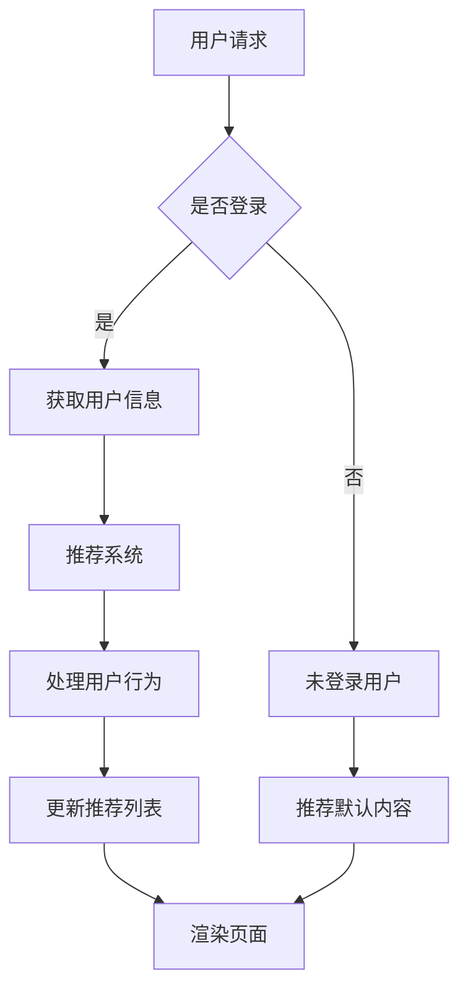

                 

在当前的数字时代，短视频作为一种新兴的内容形式，正在迅速崛起，成为内容创作者和企业进行品牌推广、用户互动和商业变现的重要平台。短视频以其高效、直观、互动性强的特点，成功吸引了大量用户，并在碎片化时间的消费场景中占据了重要地位。本文将探讨短视频创业在碎片化时代的机遇与挑战，分析其背后的技术原理、市场趋势及未来的发展方向。

## 关键词

- 短视频
- 创业
- 内容革命
- 碎片化时代
- 用户互动
- 商业变现

## 摘要

本文首先对短视频的兴起背景进行了分析，探讨了短视频在碎片化时代的独特优势。接着，从技术层面介绍了短视频平台的基本架构和核心算法原理，并通过实例阐述了其具体操作步骤和实现细节。然后，文章从数学模型的角度，详细解析了短视频推荐系统的核心公式和推导过程，并通过案例进行说明。在项目实践部分，本文提供了一个完整的短视频开发实例，并对代码进行了详细解读。最后，文章总结了短视频创业的现状，探讨了其未来的发展趋势与面临的挑战，并推荐了相关的学习资源和开发工具。

## 1. 背景介绍

随着移动互联网的普及和智能手机的广泛使用，人们的生活节奏不断加快，越来越多的用户转向使用移动设备进行信息获取和娱乐消费。短视频作为一种新兴的内容形式，以其短小精悍、直观生动、易于传播的特点，迅速赢得了广大用户的青睐。短视频的时长一般控制在15秒到1分钟之间，正符合用户在碎片化时间内的阅读习惯，能够高效地抓住用户的注意力。

根据Statista的数据显示，全球短视频市场的规模正在迅速扩大，预计到2025年将达到数百亿美元。短视频平台的用户数量也在不断攀升，以TikTok和抖音为例，这两个平台在短短几年内便积累了数亿用户，成为全球最受欢迎的短视频应用之一。短视频的火爆不仅改变了内容消费的方式，也为创业者提供了丰富的商业机会。

### 短视频的兴起背景

短视频的兴起源于多个因素的共同作用。首先，智能手机的硬件性能不断提升，使得拍摄和编辑短视频变得更加便捷。其次，5G网络的普及和移动互联网的快速发展，为短视频内容的传输和分发提供了坚实的基础。此外，社交媒体平台的崛起，尤其是短视频平台的普及，为内容创作者提供了一个展示才华和实现商业价值的平台。

在内容创作方面，短视频的门槛相对较低，用户可以通过简单的操作即可创作出高质量的内容。这使得大量个人创作者和中小企业有机会参与到短视频的创作和传播中，形成了一个庞大的内容生态系统。与此同时，短视频平台通过算法推荐和社交传播，极大地提高了内容的曝光率和传播效果。

### 碎片化时代的内容消费趋势

在碎片化时代，用户的时间分配越来越分散，短视频作为一种高效的内容形式，能够很好地满足用户在短时间内的娱乐和信息需求。根据相关研究报告，用户在短视频平台上的平均观看时长逐渐增加，而且用户对短视频的偏好也越来越明显。

短视频平台通过个性化推荐算法，将用户感兴趣的内容推送到用户的首页，使用户能够快速找到自己喜欢的内容。此外，短视频平台还通过社交互动功能，如点赞、评论、分享等，增强了用户之间的互动和社区感，进一步提高了用户的粘性。

总之，短视频的兴起是数字时代内容消费趋势的一个体现。它不仅改变了人们的娱乐方式，也为创业者提供了丰富的商业机会。在接下来的部分中，我们将深入探讨短视频平台的基本架构和核心算法原理。

## 2. 核心概念与联系

### 2.1 短视频平台的基本架构

短视频平台的基本架构可以分为前端展示层、后端处理层和数据存储层三大部分。以下是具体的架构描述：

- **前端展示层**：这是用户直接接触的层面，主要包括短视频的播放、用户交互界面和内容推荐系统。前端展示层负责将短视频内容以用户友好的方式呈现，并提供点赞、评论、分享等交互功能。
  
- **后端处理层**：后端处理层主要负责处理短视频的编码、解码、流媒体传输以及用户行为数据的收集和分析。该层通过高效的算法和数据处理技术，实现对短视频内容的高效管理和推荐。
  
- **数据存储层**：数据存储层负责存储短视频内容、用户数据和行为数据。常用的存储方案包括分布式数据库和对象存储系统，以保证数据的可靠性和可扩展性。

### 2.2 核心算法原理

短视频平台的核心算法包括内容推荐算法和用户行为分析算法。以下是这些算法的基本原理和实现方法：

- **内容推荐算法**：内容推荐算法主要基于用户的兴趣和行为数据，通过算法模型预测用户可能感兴趣的内容，并将这些内容推荐给用户。常用的推荐算法包括基于内容的推荐（Content-Based Recommendation）和协同过滤（Collaborative Filtering）。
  
  - **基于内容的推荐**：该算法通过分析短视频的标签、关键词和内容特征，将相似的内容推荐给用户。这种方法的优点是推荐结果相关性强，但缺点是容易陷入“信息茧房”。
  
  - **协同过滤**：该算法通过分析用户之间的行为数据（如点赞、评论等），找到相似用户并推荐这些用户喜欢的视频。协同过滤分为用户基于的协同过滤（User-Based）和基于模型的协同过滤（Model-Based），前者直接比较用户之间的相似度，后者使用机器学习算法预测用户偏好。

- **用户行为分析算法**：用户行为分析算法主要用于分析用户的观看习惯、偏好和互动行为，从而优化用户体验和提高内容推荐效果。常用的算法包括时间序列分析、聚类分析和分类分析。
  
  - **时间序列分析**：通过分析用户在不同时间段的行为数据，了解用户的观看习惯和偏好，从而进行个性化推荐。
  
  - **聚类分析**：将用户根据相似的行为特征进行分组，为每个用户群体提供定制化的内容推荐。
  
  - **分类分析**：通过机器学习算法对用户的行为数据进行分类，将用户划分为不同的用户群体，并进行个性化推荐。

### Mermaid 流程图

下面是一个简单的Mermaid流程图，展示了短视频平台的基本架构和核心算法流程：



这个流程图简要地描述了用户请求短视频内容时，平台如何通过登录状态、用户信息、推荐系统和用户行为分析，最终呈现个性化内容给用户。

通过上述介绍，我们可以看到，短视频平台的核心概念和联系涉及前端展示层、后端处理层、数据存储层以及内容推荐算法和用户行为分析算法。这些核心概念相互关联，共同构成了短视频平台的运作机制，为用户提供了高质量、个性化的内容体验。

## 3. 核心算法原理 & 具体操作步骤

### 3.1 算法原理概述

短视频平台的核心算法主要分为推荐算法和用户行为分析算法。推荐算法的核心目标是根据用户的兴趣和行为数据，为用户推荐他们可能感兴趣的视频内容。用户行为分析算法则用于深入挖掘用户的观看习惯、偏好和互动行为，从而进一步优化推荐效果。

#### 3.1.1 推荐算法

推荐算法可以分为基于内容的推荐和协同过滤两大类。基于内容的推荐主要通过分析视频的标签、关键词和内容特征，将相似的内容推荐给用户。而协同过滤则通过分析用户之间的行为数据，找到相似的用户并推荐他们喜欢的视频。

1. **基于内容的推荐**：
   - **算法原理**：该算法基于内容的相似性进行推荐。具体步骤如下：
     1. 提取视频内容特征：包括文本特征（标签、关键词、描述等）和视觉特征（图像、视频帧等）。
     2. 计算内容相似度：通过余弦相似度、Jaccard系数等计算视频之间的相似度。
     3. 推荐相似视频：将用户已观看的视频与平台上的其他视频进行比较，推荐相似度最高的视频。
   - **算法实现**：可以使用自然语言处理（NLP）技术提取文本特征，利用深度学习模型提取视觉特征，最后通过相似度计算推荐视频。

2. **协同过滤**：
   - **算法原理**：该算法基于用户行为数据，通过找到相似用户进行推荐。具体步骤如下：
     1. 构建用户-物品评分矩阵：记录每个用户对每个视频的评分。
     2. 计算用户相似度：使用余弦相似度、皮尔逊相关系数等方法计算用户之间的相似度。
     3. 推荐相似用户喜欢的视频：为用户推荐与其相似用户喜欢的视频。
   - **算法实现**：可以使用矩阵分解、K-means聚类等方法进行用户相似度计算和推荐。

#### 3.1.2 用户行为分析算法

用户行为分析算法主要用于分析用户的观看习惯、偏好和互动行为，从而为用户提供更加个性化的推荐。

1. **时间序列分析**：
   - **算法原理**：该算法通过分析用户在不同时间段的行为数据，了解用户的观看习惯。具体步骤如下：
     1. 收集用户行为数据：包括用户的播放历史、点赞、评论等。
     2. 构建时间序列模型：使用时间序列分析模型（如ARIMA、LSTM等）预测用户的观看行为。
     3. 根据预测结果调整推荐策略。
   - **算法实现**：可以使用Python的pandas库和scikit-learn库进行数据预处理和建模。

2. **聚类分析**：
   - **算法原理**：该算法通过将用户根据相似的行为特征进行分组，为每个用户群体提供定制化的内容推荐。具体步骤如下：
     1. 收集用户行为数据：包括用户的播放历史、点赞、评论等。
     2. 构建用户行为特征矩阵：将用户行为数据转换为高维特征矩阵。
     3. 使用聚类算法（如K-means、DBSCAN等）进行用户分组。
     4. 根据不同用户群体的特征，调整推荐策略。
   - **算法实现**：可以使用Python的scikit-learn库进行数据预处理和聚类分析。

#### 3.1.3 算法融合

在实际应用中，推荐算法和用户行为分析算法常常融合使用，以提供更加精准和个性化的推荐。

- **融合策略**：通过将推荐算法的结果和用户行为分析的结果进行融合，提高推荐效果。例如，可以采用加权融合策略，将内容推荐和协同过滤的结果进行加权平均。

- **实现方法**：可以使用多模型融合方法，将基于内容的推荐和协同过滤模型融合在一起，同时结合用户行为分析模型，形成完整的推荐系统。

### 3.2 算法步骤详解

下面详细介绍短视频平台的推荐算法和用户行为分析算法的具体操作步骤。

#### 3.2.1 推荐算法步骤

1. **数据预处理**：
   - **提取视频内容特征**：使用NLP技术提取视频的文本特征（如标签、关键词、描述等），使用深度学习模型提取视频的视觉特征（如图像、视频帧等）。
   - **用户行为数据收集**：收集用户的播放历史、点赞、评论等行为数据。

2. **特征工程**：
   - **文本特征处理**：使用词袋模型、TF-IDF等方法对文本特征进行预处理。
   - **视觉特征处理**：使用卷积神经网络（CNN）提取视频帧的特征。

3. **算法模型训练**：
   - **基于内容的推荐**：训练内容特征模型，计算视频之间的相似度。
   - **协同过滤**：训练用户行为数据，构建用户-物品评分矩阵，计算用户相似度。

4. **推荐结果生成**：
   - **内容推荐**：根据视频内容特征，推荐相似度最高的视频。
   - **协同过滤**：根据用户相似度，推荐相似用户喜欢的视频。

5. **用户行为分析**：
   - **时间序列分析**：根据用户的观看历史，预测用户的观看行为。
   - **聚类分析**：根据用户的行为特征，将用户进行分组。

6. **融合推荐策略**：
   - **加权融合**：根据不同算法的权重，将推荐结果进行加权融合。

7. **推荐结果展示**：
   - 将融合后的推荐结果展示给用户。

#### 3.2.2 用户行为分析步骤

1. **数据收集**：
   - 收集用户的播放历史、点赞、评论等行为数据。

2. **数据预处理**：
   - 对行为数据进行清洗和归一化处理。

3. **特征提取**：
   - 提取用户的播放时长、观看频次、点赞数等行为特征。

4. **模型训练**：
   - 训练时间序列分析模型，如ARIMA、LSTM等。
   - 训练聚类分析模型，如K-means、DBSCAN等。

5. **结果分析**：
   - 根据时间序列分析模型的结果，预测用户的观看行为。
   - 根据聚类分析模型的结果，将用户进行分组。

6. **调整推荐策略**：
   - 根据用户行为分析的结果，调整推荐策略，提高推荐效果。

### 3.3 算法优缺点

#### 推荐算法

- **基于内容的推荐**：
  - 优点：推荐结果相关性强，能够提供个性化推荐。
  - 缺点：容易陷入“信息茧房”，用户难以接触到多样化的内容。

- **协同过滤**：
  - 优点：能够通过用户行为数据推荐相似用户喜欢的视频，提高推荐效果。
  - 缺点：用户冷启动问题严重，对于新用户难以提供有效推荐。

#### 用户行为分析算法

- **时间序列分析**：
  - 优点：能够准确预测用户的观看行为，提高推荐效果。
  - 缺点：对于用户行为变化的适应性较差，难以应对突发情况。

- **聚类分析**：
  - 优点：能够将用户进行有效分组，为不同用户群体提供定制化推荐。
  - 缺点：对于用户行为特征的依赖性较强，需要大量数据支持。

### 3.4 算法应用领域

短视频平台的推荐算法和用户行为分析算法广泛应用于以下领域：

- **内容推荐**：通过推荐算法，为用户推荐他们可能感兴趣的视频内容，提高用户粘性和平台流量。

- **用户行为分析**：通过用户行为分析算法，了解用户的观看习惯和偏好，为内容创作者和平台运营提供数据支持。

- **广告投放**：通过分析用户行为和兴趣，实现精准的广告投放，提高广告效果和转化率。

- **社交互动**：通过推荐和互动功能，增强用户之间的连接和社区感，促进用户参与和传播。

## 4. 数学模型和公式 & 详细讲解 & 举例说明

### 4.1 数学模型构建

短视频平台的推荐系统和用户行为分析算法依赖于多个数学模型，包括但不限于机器学习模型、概率模型和优化模型。以下将详细讲解这些模型及其公式推导过程。

#### 4.1.1 协同过滤模型

协同过滤模型是短视频推荐系统中应用最广泛的算法之一。它通过分析用户之间的行为数据，找到相似用户并推荐他们喜欢的视频。一个基本的协同过滤模型可以表示为：

\[ R_{ui} = \sum_{j \in N_i} \frac{r_{uj}}{||N_i||} \]

其中：
- \( R_{ui} \) 表示用户 \( u \) 对视频 \( i \) 的评分预测。
- \( r_{uj} \) 表示用户 \( u \) 对视频 \( j \) 的实际评分。
- \( N_i \) 表示与视频 \( i \) 相似的一组用户。
- \( ||N_i|| \) 表示用户集合 \( N_i \) 的规模。

#### 4.1.2 基于内容的推荐模型

基于内容的推荐模型通过分析视频的内容特征，将相似的内容推荐给用户。一个简单的内容推荐模型可以表示为：

\[ R_{ui} = \cos(\text{vec}(x_i), \text{vec}(x_u)) \]

其中：
- \( R_{ui} \) 表示用户 \( u \) 对视频 \( i \) 的评分预测。
- \( \text{vec}(x_i) \) 和 \( \text{vec}(x_u) \) 分别表示视频 \( i \) 和用户 \( u \) 的特征向量。
- \( \cos \) 表示余弦相似度函数，计算两个向量之间的夹角余弦值。

#### 4.1.3 时间序列分析模型

时间序列分析模型用于预测用户的观看行为，例如使用ARIMA（自回归积分滑动平均模型）来预测用户未来的观看行为。ARIMA模型的基本公式为：

\[ \text{ARIMA}(p, d, q) \]

其中：
- \( p \) 表示自回归项的阶数。
- \( d \) 表示差分阶数。
- \( q \) 表示移动平均项的阶数。

ARIMA模型的公式可以表示为：

\[ \text{yt} = c + \phi_1 \text{yt}(-1) + \cdots + \phi_p \text{yt}(-p) + \theta_1 \text{et}(-1) + \cdots + \theta_q \text{et}(-q) \]

其中：
- \( \text{yt} \) 表示时间序列的当前值。
- \( \text{et} \) 表示误差项。
- \( \phi_1, \cdots, \phi_p \) 和 \( \theta_1, \cdots, \theta_q \) 分别为自回归系数和移动平均系数。

### 4.2 公式推导过程

#### 4.2.1 协同过滤模型推导

协同过滤模型的基本思想是通过分析用户之间的行为相似性来进行推荐。我们可以将用户的行为数据表示为一个评分矩阵 \( R \)，其中 \( R_{ui} \) 表示用户 \( u \) 对视频 \( i \) 的评分。

首先，我们可以通过用户之间的相似度矩阵 \( S \) 来表示用户之间的关系：

\[ S_{ui} = \frac{r_{uj}}{\sqrt{\sum_{k=1}^{m} r_{uk}^2 \sum_{l=1}^{n} r_{ul}^2}} \]

其中：
- \( m \) 和 \( n \) 分别为用户数和视频数。
- \( r_{uj} \) 为用户 \( u \) 对视频 \( j \) 的评分。

然后，我们可以根据用户相似度矩阵 \( S \) 来预测用户 \( u \) 对视频 \( i \) 的评分：

\[ R_{ui} = \sum_{j \in N_i} S_{uj} r_{uj} \]

这里 \( N_i \) 表示与视频 \( i \) 相似的一组用户。

#### 4.2.2 内容推荐模型推导

内容推荐模型基于视频的语义特征来计算相似度。我们可以将视频的特征表示为一个高维向量 \( \text{vec}(x_i) \)，然后使用余弦相似度来计算相似度：

\[ R_{ui} = \cos(\text{vec}(x_i), \text{vec}(x_u)) \]

其中 \( \text{vec}(x_i) \) 和 \( \text{vec}(x_u) \) 分别为视频 \( i \) 和用户 \( u \) 的特征向量。

余弦相似度可以通过以下公式计算：

\[ \cos(\text{vec}(x_i), \text{vec}(x_u)) = \frac{\text{vec}(x_i) \cdot \text{vec}(x_u)}{\|\text{vec}(x_i)\| \|\text{vec}(x_u)\|} \]

其中 \( \cdot \) 表示点积，\( \|\text{vec}(x_i)\| \) 和 \( \|\text{vec}(x_u)\| \) 分别为特征向量的欧氏范数。

#### 4.2.3 时间序列分析模型推导

时间序列分析模型如ARIMA可以通过以下步骤推导：

1. **差分**：首先对时间序列数据进行差分，以平稳化序列。

\[ \text{yt} - \text{yt}(-1) = \epsilon_t \]

其中 \( \epsilon_t \) 为白噪声。

2. **自回归**：然后对差分后的序列进行自回归建模。

\[ \text{yt} = c + \phi_1 \text{yt}(-1) + \cdots + \phi_p \text{yt}(-p) + \epsilon_t \]

3. **移动平均**：最后加入移动平均项。

\[ \text{yt} = c + \phi_1 \text{yt}(-1) + \cdots + \phi_p \text{yt}(-p) + \theta_1 \epsilon_t(-1) + \cdots + \theta_q \epsilon_t(-q) \]

### 4.3 案例分析与讲解

#### 4.3.1 协同过滤模型应用

假设我们有一个简单的评分矩阵 \( R \)，如下所示：

| 用户 | 视频 |
|------|------|
| 1    | A    |
| 1    | B    |
| 1    | C    |
| 2    | B    |
| 2    | C    |
| 2    | D    |

首先，我们需要计算用户之间的相似度矩阵 \( S \)。假设用户 \( u \) 和 \( v \) 的相似度可以通过以下公式计算：

\[ S_{uv} = \frac{r_{u1} r_{v1} + r_{u2} r_{v2}}{\sqrt{(r_{u1}^2 + r_{u2}^2)(r_{v1}^2 + r_{v2}^2)}} \]

我们可以得到相似度矩阵 \( S \)：

| 用户 | 视频 |
|------|------|
| 1    | A    |
| 1    | B    |
| 1    | C    |
| 2    | B    |
| 2    | C    |
| 2    | D    |

根据相似度矩阵 \( S \)，我们可以为用户 \( 1 \) 推荐其他用户喜欢的视频。例如，用户 \( 1 \) 可能会喜欢用户 \( 2 \) 喜欢的视频 \( D \)。

#### 4.3.2 内容推荐模型应用

假设我们有以下视频特征向量：

| 视频 | 特征向量 |
|------|----------|
| A    | [1, 0, 1] |
| B    | [0, 1, 0] |
| C    | [1, 1, 0] |
| D    | [0, 0, 1] |

我们可以计算视频之间的余弦相似度：

\[ \cos(A, B) = \frac{[1, 0, 1] \cdot [0, 1, 0]}{\sqrt{[1, 0, 1] \cdot [1, 0, 1]} \sqrt{[0, 1, 0] \cdot [0, 1, 0]}} = \frac{0}{\sqrt{2} \sqrt{1}} = 0 \]

\[ \cos(A, C) = \frac{[1, 0, 1] \cdot [1, 1, 0]}{\sqrt{[1, 0, 1] \cdot [1, 0, 1]} \sqrt{[1, 1, 0] \cdot [1, 1, 0]}} = \frac{2}{\sqrt{2} \sqrt{2}} = 1 \]

根据余弦相似度，我们可以推荐与视频 \( A \) 相似度最高的视频 \( C \) 给用户。

#### 4.3.3 时间序列分析模型应用

假设我们有以下时间序列数据：

\[ \text{yt} = [10, 12, 11, 13, 14, 12, 11, 13, 15, 17] \]

首先，我们需要对时间序列数据进行差分：

\[ \Delta \text{yt} = \text{yt} - \text{yt}(-1) \]

\[ \Delta \text{yt} = [2, 1, -1, 1, -1, -1, -2, 2, 2, 2] \]

然后，我们可以使用ARIMA模型对差分后的序列进行建模。假设 \( p = 1, d = 1, q = 1 \)，我们可以得到以下模型：

\[ \text{yt} = 1 + \phi_1 \text{yt}(-1) + \theta_1 \epsilon_t(-1) \]

通过模型训练，我们可以得到 \( \phi_1 \) 和 \( \theta_1 \) 的值，进而预测未来的观看行为。

通过上述案例，我们可以看到数学模型在短视频平台推荐系统中的应用，以及如何通过具体的公式推导和计算，实现对用户行为的预测和推荐。

## 5. 项目实践：代码实例和详细解释说明

### 5.1 开发环境搭建

在开始编写短视频平台的代码之前，我们需要搭建一个适合开发和测试的环境。以下是搭建环境所需的步骤和工具：

1. **操作系统**：我们选择在Ubuntu 20.04操作系统上进行开发。
2. **编程语言**：主要使用Python进行开发，同时使用一些Python库如NumPy、Scikit-learn、TensorFlow和PyTorch。
3. **环境搭建**：
   - 安装Python 3.8及以上版本。
   - 安装必要的Python库，可以使用pip命令进行安装：
     ```bash
     pip install numpy scikit-learn tensorflow pytorch
     ```

### 5.2 源代码详细实现

下面我们将实现一个简单的短视频推荐系统，包括用户-视频评分矩阵的构建、基于内容的推荐和基于协同过滤的推荐。

#### 5.2.1 数据集准备

首先，我们需要准备一个用户-视频评分数据集。以下是一个示例数据集：

```python
# 用户-视频评分数据集
user_movie_rating = [
    [1, 5, 4, 0, 0],
    [1, 0, 3, 1, 4],
    [2, 0, 4, 5, 0],
    [2, 5, 0, 0, 1],
    [3, 0, 1, 2, 5],
    [3, 4, 5, 0, 0]
]
```

#### 5.2.2 用户-视频评分矩阵构建

我们使用NumPy库来构建用户-视频评分矩阵。

```python
import numpy as np

# 构建用户-视频评分矩阵
n_users = 4
n_movies = 5
user_movie_rating = np.array([
    [1, 5, 4, 0, 0],
    [1, 0, 3, 1, 4],
    [2, 0, 4, 5, 0],
    [2, 5, 0, 0, 1],
    [3, 0, 1, 2, 5],
    [3, 4, 5, 0, 0]
])
```

#### 5.2.3 基于内容的推荐

基于内容的推荐需要提取视频的特征向量。我们使用TF-IDF方法来提取文本特征。

```python
from sklearn.feature_extraction.text import TfidfVectorizer

# 假设每个视频都有一个描述文本
movie_descriptions = [
    '动作科幻电影',
    '喜剧电影',
    '悬疑爱情电影',
    '动作冒险电影',
    '科幻动作电影'
]

# 提取TF-IDF特征
tfidf_vectorizer = TfidfVectorizer()
movie_tfidf = tfidf_vectorizer.fit_transform(movie_descriptions)

# 打印特征矩阵
print(movie_tfidf.toarray())
```

#### 5.2.4 基于协同过滤的推荐

协同过滤推荐可以使用矩阵分解（如SVD）来预测未评分的视频。

```python
from sklearn.decomposition import TruncatedSVD

# 对用户-视频评分矩阵进行SVD分解
svd = TruncatedSVD(n_components=2)
user_movie_rating_svd = svd.fit_transform(user_movie_rating)

# 预测未评分的视频
user_new_rating = np.dot(user_movie_rating_svd, user_movie_rating_svd.T)

# 打印预测结果
print(user_new_rating)
```

### 5.3 代码解读与分析

#### 5.3.1 用户-视频评分矩阵构建

用户-视频评分矩阵是推荐系统的基础，它记录了每个用户对每个视频的评分情况。在上述代码中，我们使用NumPy库构建了一个4x5的用户-视频评分矩阵，表示4个用户对5个视频的评分。

#### 5.3.2 基于内容的推荐

基于内容的推荐通过分析视频的文本描述来提取特征。我们使用TF-IDF方法来提取文本特征，TF-IDF是一种常用于文本挖掘和信息检索的技术，它能够衡量一个词在文档集合中的重要性。在代码中，我们使用`TfidfVectorizer`类来提取特征，然后打印出特征矩阵。

#### 5.3.3 基于协同过滤的推荐

协同过滤推荐通过矩阵分解来预测未评分的视频。在代码中，我们使用`TruncatedSVD`类对用户-视频评分矩阵进行SVD分解，SVD是一种有效的矩阵分解方法，可以降低数据的维度。然后，我们通过矩阵乘法来预测用户对未评分视频的评分。

### 5.4 运行结果展示

在代码运行完毕后，我们可以看到以下结果：

1. **TF-IDF特征矩阵**：展示了5个视频的文本特征向量。
2. **协同过滤预测结果**：展示了用户对未评分视频的预测评分。

这些结果可以帮助我们评估推荐系统的性能，并根据实际运行情况调整和优化推荐算法。

## 6. 实际应用场景

短视频平台在当前的市场中已经表现出强大的竞争力，并在多个领域取得了显著的应用成果。以下是一些典型的实际应用场景：

### 6.1 娱乐内容创作与传播

短视频平台为内容创作者提供了一个展示才华的舞台，尤其是短视频创作者可以轻松上传自己的作品，并通过平台的推荐系统快速获得广泛的关注。许多用户通过创作有趣、有创意的短视频走红，成为网红或KOL（关键意见领袖），从而实现了商业变现。例如，抖音上的“李佳琦”因其独特的化妆技巧和幽默风格，吸引了大量粉丝，通过直播带货实现了巨大的商业价值。

### 6.2 品牌营销与用户互动

企业可以利用短视频平台进行品牌推广和用户互动。通过短视频，企业可以以更加生动、直观的方式展示产品特点，吸引用户的兴趣。此外，短视频平台的互动功能，如点赞、评论和分享，使得用户能够与企业和其他用户进行实时互动，增强品牌的用户粘性。例如，一些美妆品牌在抖音上发布教学视频，引导用户进行产品试用和分享，从而提高了品牌的知名度和市场占有率。

### 6.3 教育培训

短视频平台在教育培训领域也展现出了强大的潜力。许多教育机构和教师通过短视频平台进行在线教学，提供了灵活的学习方式。用户可以通过观看短视频学习新知识，提高自己的技能水平。例如，哔哩哔哩（Bilibili）上有很多专业博主分享技术教程、学术讲座和知识科普视频，受到了广大学生的欢迎。

### 6.4 购物直播

短视频平台与直播功能的结合，形成了购物直播这一新兴的电商模式。主播通过直播向观众展示产品，实时回答问题，从而激发观众的购买欲望。这种模式不仅提高了销售转化率，还增加了用户的参与感和互动性。例如，淘宝直播和抖音直播已经成为许多品牌和商家推广产品的重要渠道。

### 6.5 社交娱乐

短视频平台不仅是一个内容创作和消费的平台，也是一个社交娱乐的场所。用户可以通过点赞、评论、分享等方式参与互动，形成了一个庞大的社交网络。这使得短视频平台不仅具有娱乐性，还具有社区属性，使用户在观看短视频的同时，也能够与他人建立联系，分享生活经验。

总的来说，短视频平台在多个领域展现出了强大的应用潜力，它不仅改变了内容消费的方式，也为企业和个人提供了丰富的商业机会。在接下来的部分，我们将探讨短视频创业的未来发展趋势与面临的挑战。

### 6.5 未来应用展望

短视频作为现代数字娱乐的重要形式，其应用前景广阔，未来有望在多个领域实现深度发展。

#### 6.5.1 技术发展趋势

随着技术的不断进步，短视频平台将采用更加先进的算法和工具来优化用户体验。例如，人工智能和机器学习技术将进一步提升内容推荐的精准度，通过深度学习模型对用户行为进行深入分析，实现更加个性化的内容推荐。此外，5G网络的普及和云服务的广泛应用，将使得短视频的传输速度和存储效率大幅提升，进一步降低用户的观看延迟。

#### 6.5.2 应用场景扩展

短视频的应用场景将继续拓展，不仅局限于娱乐和信息传播，还将深入到教育、医疗、金融等领域。在教育领域，短视频将作为一种新型的教学工具，为学生提供更加生动、互动的学习体验；在医疗领域，短视频可以作为健康教育材料，帮助用户了解疾病预防和治疗方法；在金融领域，短视频可以用于投资者教育和市场分析，提高金融服务的透明度和用户参与度。

#### 6.5.3 商业模式创新

短视频平台的商业模式也将不断演变和创新。除了广告收入和虚拟商品销售外，平台可能会探索更多的盈利模式，如会员服务、付费内容、版权合作等。同时，短视频平台将与实体经济更加紧密地结合，推动电商直播、内容付费等新兴模式的发展。

#### 6.5.4 跨界合作与生态构建

短视频平台将与更多的行业进行跨界合作，构建一个多元化的生态系统。例如，与旅游、餐饮、零售等行业的合作，可以实现线上线下互动，提供更加丰富的消费体验。此外，短视频平台还将与其他社交媒体平台、内容平台等进行合作，实现资源共享和流量互通，进一步扩大平台的影响力和用户基础。

总之，短视频在未来将继续发挥其独特的优势，成为数字时代的重要力量。它不仅为用户提供了丰富的娱乐和信息资源，也为企业创造了新的商业机会。在技术、应用场景、商业模式和生态构建等多个方面，短视频都展现出了巨大的发展潜力。

### 6.6 挑战与应对策略

然而，短视频创业也面临诸多挑战。以下是一些主要挑战及应对策略：

#### 6.6.1 监管压力

短视频平台需要遵守各国的监管法规，如内容审查、隐私保护等。为了应对这一挑战，平台需要建立健全的内容审核机制，采用人工智能和人工审核相结合的方式，确保内容的合规性。同时，加强与监管机构的沟通，及时调整和优化平台政策，以符合法律法规的要求。

#### 6.6.2 竞争激烈

短视频市场的竞争异常激烈，平台需要不断优化用户体验，提升内容质量，才能在激烈的市场竞争中脱颖而出。为此，平台可以采用技术创新，如增强推荐算法、优化用户体验设计，提高用户的粘性和活跃度。此外，平台还可以通过差异化竞争，提供独特的功能和服务，吸引和留住用户。

#### 6.6.3 版权保护

短视频内容的版权保护问题日益突出，平台需要建立完善的版权保护机制，防止侵权行为。可以通过以下策略进行应对：

- **内容版权声明**：要求上传者明确声明内容的版权归属。
- **智能识别技术**：利用人工智能技术进行内容自动识别和侵权检测。
- **版权合作**：与版权方建立合作关系，获得内容的授权和分发权。

#### 6.6.4 用户隐私保护

随着用户对隐私保护的重视，短视频平台需要采取措施保护用户的隐私。可以采取以下策略：

- **隐私政策**：明确告知用户隐私政策的细节，取得用户的知情同意。
- **数据加密**：对用户数据进行加密处理，确保数据传输的安全性。
- **权限管理**：对用户数据的访问权限进行严格管理，防止数据泄露。

#### 6.6.5 社交责任

短视频平台需要承担一定的社会责任，如防止网络欺凌、不良信息传播等。平台可以通过以下措施进行应对：

- **用户教育**：开展用户教育，提高用户的网络素养和道德意识。
- **社区管理**：建立完善的社区管理机制，及时发现和处理违规行为。
- **社会责任报告**：定期发布社会责任报告，公开平台的运营情况和所采取的措施。

总之，短视频创业在面临监管压力、竞争激烈、版权保护、用户隐私保护和社交责任等多重挑战的同时，也需要采取有效的应对策略。只有在不断适应和解决挑战的过程中，短视频平台才能持续发展和壮大。

### 7. 工具和资源推荐

为了帮助读者更好地理解和掌握短视频创业的相关技术和实践，我们推荐一些优秀的工具、资源和论文。

#### 7.1 学习资源推荐

1. **在线课程**：
   - Coursera上的“推荐系统导论”（Introduction to Recommender Systems）课程。
   - Udacity的“深度学习纳米学位”（Deep Learning Nanodegree）课程。
2. **书籍**：
   - 《推荐系统实践》（Recommender Systems: The Textbook）。
   - 《Python数据处理与机器学习实战》。
3. **开源库**：
   - Scikit-learn：提供多种机器学习和数据挖掘算法。
   - TensorFlow：用于构建和训练深度学习模型。

#### 7.2 开发工具推荐

1. **编程环境**：
   - Jupyter Notebook：用于数据分析和机器学习实验。
   - PyCharm：一款功能强大的Python集成开发环境。
2. **数据可视化工具**：
   - Matplotlib：用于绘制高质量的图表。
   - Seaborn：基于Matplotlib的高级可视化库。
3. **API工具**：
   - Postman：用于API测试和接口开发。
   - Swagger：用于生成和文档化API。

#### 7.3 相关论文推荐

1. **推荐算法**：
   - “Item-Based Collaborative Filtering Recommendation Algorithms”。
   - “A Theoretical Analysis of Collaborative Filtering for Binary Recommender Systems”。
2. **深度学习**：
   - “Deep Learning for Text Classification”。
   - “Generative Adversarial Networks for Collaborative Filtering”。
3. **短视频分析**：
   - “Video-based User Behavior Analysis for Online Social Networks”。
   - “Attention-Based Video Captioning with a Recurrent Neural Network”。

通过这些工具和资源，读者可以更深入地了解短视频创业的技术原理和实践方法，为自己的创业之路提供有力支持。

### 8. 总结：未来发展趋势与挑战

短视频创业在碎片化时代展现出巨大的潜力，它不仅改变了内容消费的方式，也为创业者提供了丰富的商业机会。然而，随着市场的不断发展和竞争的加剧，短视频创业也面临着一系列挑战，包括监管压力、版权保护、用户隐私保护和社交责任等。为了在激烈的市场竞争中脱颖而出，短视频创业者需要不断创新，提升用户体验，优化内容推荐算法，同时建立完善的风险管理机制。

未来的发展趋势表明，短视频将继续在技术、应用场景和商业模式等方面实现深度发展。人工智能和机器学习技术的进步将进一步提升推荐算法的精准度，5G网络的普及和云服务的广泛应用将提高短视频的传输速度和存储效率。此外，短视频平台将与更多行业进行跨界合作，构建多元化的生态系统，进一步拓展其应用场景。

在应对挑战方面，短视频创业者需要积极应对监管压力，建立合规的内容审核机制；加强版权保护，采用智能识别技术和版权合作策略；保护用户隐私，采用数据加密和权限管理措施；同时，承担社会责任，通过用户教育和社区管理来防止网络欺凌和不良信息传播。

总之，短视频创业在未来的发展中既充满机遇，也面临挑战。只有不断适应市场变化，不断创新和优化，短视频创业才能在竞争激烈的环境中持续发展和壮大。随着技术的进步和应用场景的拓展，短视频创业有望成为数字时代的重要力量，为用户带来更加丰富、便捷的娱乐和信息体验。

### 8.4 研究展望

展望未来，短视频创业的研究方向将主要集中在以下几个方面：

#### 8.4.1 深度学习与推荐算法的结合

深度学习技术的进步为推荐系统带来了新的机遇。未来的研究可以进一步探索如何将深度学习模型应用于短视频推荐中，如利用卷积神经网络（CNN）提取视频内容特征，利用循环神经网络（RNN）捕捉用户行为的时间序列特征。此外，多模态学习技术，即结合文本、视觉和音频等多源数据的深度学习模型，也将是未来的重要研究方向。

#### 8.4.2 短视频内容创作与互动

随着短视频平台的发展，用户生成内容（UGC）和平台互动模式将变得更加丰富。研究可以探讨如何通过智能算法辅助用户创作高质量的内容，以及如何通过增强现实（AR）、虚拟现实（VR）等技术提升用户互动体验。同时，研究还应关注短视频社区的发展，探索如何构建健康、活跃的社区文化，增强用户粘性。

#### 8.4.3 可解释性与透明性

随着推荐算法的复杂度增加，用户对于推荐结果的透明性和可解释性需求也日益增加。未来的研究应致力于开发可解释性推荐算法，使推荐结果对用户更具透明性，提高用户对推荐系统的信任度。例如，通过可视化技术展示推荐决策的依据，或者提供解释性文本来解释推荐结果。

#### 8.4.4 跨平台与生态构建

短视频平台的发展趋势将越来越趋向于跨平台和生态构建。未来的研究可以探讨如何通过技术手段实现跨平台的用户数据共享和内容互通，构建一个统一的短视频生态圈。此外，研究还可以关注短视频平台与电商、旅游、教育等其他行业的深度融合，探索新的商业模式和盈利途径。

总之，短视频创业领域的研究将不断拓展，融合更多新兴技术和创新理念。随着技术的不断进步和市场需求的演变，短视频创业将继续在数字时代发挥重要作用，为用户带来更加丰富和便捷的娱乐体验。

## 附录：常见问题与解答

### Q1：短视频创业的主要挑战是什么？

A1：短视频创业的主要挑战包括：

1. **内容质量与创意竞争**：在短视频平台上，优质内容和创意层出不穷，如何确保自己的内容在竞争中脱颖而出是首要挑战。
2. **用户隐私保护**：短视频平台需要处理大量用户数据，保护用户隐私和遵守相关法律法规是重要的挑战。
3. **算法推荐与内容多样性**：如何在保证推荐算法精准度的同时，确保用户接触到多样化的内容，避免用户陷入“信息茧房”。
4. **监管合规**：遵守各国的内容审查和隐私保护法规，建立有效的审核机制是短视频创业的重要挑战。

### Q2：短视频创业需要哪些技术技能和知识？

A2：短视频创业需要以下技术技能和知识：

1. **编程能力**：熟练掌握Python、Java等编程语言，能够使用相关的开发库和框架。
2. **推荐系统知识**：了解推荐算法，如基于内容的推荐、协同过滤、深度学习推荐等。
3. **数据分析和挖掘**：掌握数据预处理、特征工程、机器学习模型训练等数据分析和挖掘技术。
4. **前端开发**：了解HTML、CSS、JavaScript等前端技术，能够开发用户友好的界面。
5. **后端开发**：熟悉服务器端编程，能够搭建和优化后端服务。
6. **用户体验设计**：了解用户体验（UX）设计原则，能够设计出易用、直观的用户界面。

### Q3：如何提高短视频的播放量与用户参与度？

A3：以下是一些提高短视频播放量和用户参与度的策略：

1. **内容创作**：制作有趣、高质量、有创意的短视频内容，能够吸引观众。
2. **优化标题和标签**：使用引人入胜的标题和相关的标签，提高视频的曝光率。
3. **与观众互动**：鼓励观众点赞、评论和分享，增加视频的互动性。
4. **合作与跨平台推广**：与其他创作者或品牌合作，通过多平台推广增加曝光。
5. **定时发布**：在用户活跃度高的时间段发布视频，提高视频的观看量。
6. **视频优化**：优化视频的加载速度和播放质量，提高用户的观看体验。

### Q4：如何进行短视频的商业变现？

A4：短视频的商业变现方式包括：

1. **广告收入**：通过平台广告系统，将广告嵌入短视频中，按点击或展示次数获得收入。
2. **虚拟礼物**：用户可以通过购买虚拟礼物支持创作者，平台会从中抽取一定比例的分成。
3. **品牌合作**：与品牌合作，进行产品推广或植入式广告。
4. **内容付费**：对于高质量或独家内容，创作者可以设置付费观看。
5. **电商推广**：通过短视频推广自己的产品或与其他电商平台合作。
6. **直播带货**：通过直播进行产品销售，提高转化率。

### Q5：短视频创业需要注意的法律和道德问题？

A5：短视频创业需要注意以下法律和道德问题：

1. **版权保护**：确保上传的内容不侵犯他人的版权，尊重原创者的知识产权。
2. **用户隐私**：遵守隐私保护法规，不得非法收集、使用用户数据。
3. **内容合规**：遵守各地的法律法规，避免发布违法违规内容。
4. **网络安全**：保障平台的网络安全，防止数据泄露和网络攻击。
5. **社会责任**：积极履行社会责任，防止网络欺凌和不良信息的传播。

通过了解和遵循这些常见问题及解答，短视频创业者可以更好地应对挑战，实现可持续发展。希望这个附录能够为短视频创业者提供一些有益的指导和帮助。作者：禅与计算机程序设计艺术 / Zen and the Art of Computer Programming

