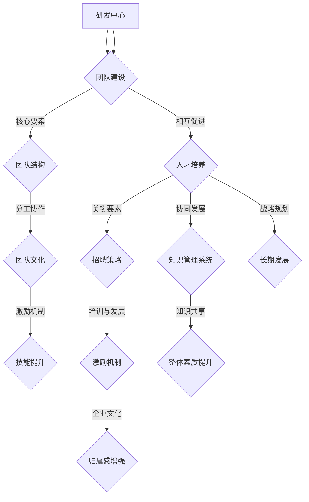

                 

## 1. 背景介绍

在当今快速发展的信息技术时代，研发中心的地位和作用日益凸显。作为企业技术创新和产品研发的核心力量，研发中心的绩效直接关系到企业的竞争力和市场地位。因此，如何建设一个高效、协同、创新的研发团队，以及如何培养和留住优秀的人才，成为了企业领导者和管理者面临的重大课题。

近年来，随着人工智能、大数据、云计算等新兴技术的蓬勃发展，研发中心的工作内容和要求也在不断变化。一方面，技术更新换代的速度加快，研发人员需要不断学习新的知识和技能；另一方面，跨学科、跨领域的项目日益增多，对团队成员的协同能力和创新能力提出了更高的要求。在这种背景下，研发中心团队的建设和人才培养显得尤为重要。

本文将从以下几个方面展开讨论：

1. 研发中心团队建设的重要性。
2. 研发中心团队建设的核心要素。
3. 研发中心团队人才培养的方法和策略。
4. 未来研发中心团队建设和发展面临的挑战。

通过本文的讨论，旨在为企业管理者提供一些有益的参考和启示，帮助其构建一个高效、创新的研发团队，提升企业的核心竞争力。

## 2. 核心概念与联系

在讨论研发中心团队的建设和人才培养之前，我们需要明确几个核心概念，并探讨它们之间的联系。

### 2.1 研发中心

研发中心是企业负责技术创新和产品研发的核心部门，通常包括以下几个关键组成部分：

- **研发团队**：由多个不同领域的专家组成，负责项目的研发和实施。
- **技术实验室**：用于实验新技术、验证新理论的地方。
- **项目管理办公室**：负责项目的规划、进度监控和风险管理。
- **知识管理系统**：用于存储、共享和更新公司内部的知识和经验。

### 2.2 团队建设

团队建设是指通过一系列措施和策略，提升团队的协作能力、创新能力和发展潜力。以下是团队建设的一些关键要素：

- **团队结构**：合理设置团队成员的职责和分工，确保高效协作。
- **团队文化**：建立积极向上的团队氛围，促进团队成员的沟通和合作。
- **激励机制**：通过奖励和认可，激发团队成员的积极性和创造力。
- **技能提升**：提供培训和学习机会，提升团队成员的专业技能。

### 2.3 人才培养

人才培养是指通过一系列措施和策略，培养和留住企业所需的高素质人才。以下是人才培养的一些关键要素：

- **招聘策略**：制定科学的招聘标准，吸引和筛选优秀的人才。
- **培训与发展**：提供系统化的培训课程，帮助员工提升专业技能和职业素养。
- **激励机制**：通过奖励和晋升等激励措施，留住优秀的人才。
- **企业文化**：营造一个尊重知识、尊重人才的企业文化，增强员工的归属感和认同感。

### 2.4 核心概念联系

研发中心团队建设与人才培养之间存在紧密的联系。团队建设为人才培养提供了平台和环境，而人才培养则为团队建设提供了动力和资源。具体来说：

- **团队建设与人才培养的相互促进**：团队建设可以促进人才培养，而人才培养也可以推动团队建设。例如，通过激励机制可以激发员工的积极性和创造力，进而提升团队的绩效。
- **团队建设与人才培养的协同发展**：团队建设和人才培养需要协同发展，共同推动企业的持续创新和竞争力提升。例如，通过建立知识管理系统，可以促进知识的共享和传承，提高团队的整体素质。
- **团队建设与人才培养的战略规划**：团队建设和人才培养都需要有长期的战略规划，以确保企业的可持续发展。例如，企业需要根据市场和技术的发展趋势，及时调整团队建设和人才培养的策略。

### 2.5 Mermaid 流程图

为了更好地理解研发中心团队建设与人才培养之间的联系，我们使用 Mermaid 流程图进行说明。以下是研发中心团队建设与人才培养的 Mermaid 流程图：



通过上述 Mermaid 流程图，我们可以清晰地看到研发中心团队建设与人才培养之间的紧密联系和相互影响。

## 3. 核心算法原理 & 具体操作步骤

### 3.1 算法原理概述

在研发中心团队的建设和人才培养过程中，我们采用了一系列核心算法原理和方法，以确保团队的高效运作和人才的持续成长。以下是这些核心算法原理的概述：

#### 3.1.1 项目管理算法

项目管理算法是研发中心团队建设的基础。通过科学的任务分配、进度监控和风险评估，确保项目的顺利推进。具体算法包括：

- **关键路径法（Critical Path Method, CPM）**：确定项目中的关键任务，确保这些任务按时完成，从而保证整个项目的进度。
- **计划评审技术（Program Evaluation and Review Technique, PERT）**：通过计算任务的平均完成时间和最坏情况完成时间，评估项目的风险和不确定性。

#### 3.1.2 团队协作算法

团队协作算法旨在提升团队的协作效率和创新力。主要算法包括：

- **协作网络分析（Collaborative Network Analysis）**：通过分析团队成员之间的沟通和协作关系，识别关键节点和潜在的协作障碍。
- **协同创新算法（Collaborative Innovation Algorithm）**：利用多智能体系统和进化算法，模拟团队成员的协作和创新过程。

#### 3.1.3 人才培养算法

人才培养算法用于指导研发中心的培训和发展计划，主要包括：

- **人才素质模型（Competency Model）**：通过建立人才素质模型，明确不同岗位所需的核心能力和技能。
- **基于需求的培训算法（Demand-Based Training Algorithm）**：根据员工的职业发展和项目需求，动态调整培训内容和计划。

### 3.2 算法步骤详解

#### 3.2.1 项目管理算法步骤

1. **任务分解**：将项目分解为若干个可管理的任务。
2. **任务分配**：根据团队成员的技能和经验，合理分配任务。
3. **进度监控**：定期更新任务进度，识别和解决潜在的问题。
4. **风险评估**：评估项目风险，制定应对策略。

#### 3.2.2 团队协作算法步骤

1. **建立协作网络**：分析团队成员之间的沟通和协作关系，建立协作网络。
2. **协作效率分析**：计算协作网络的效率指标，识别潜在的协作障碍。
3. **优化协作网络**：通过调整团队成员的分工和协作方式，优化协作网络结构。
4. **协同创新**：利用多智能体系统和进化算法，模拟团队成员的协同创新过程。

#### 3.2.3 人才培养算法步骤

1. **素质模型构建**：基于岗位需求，构建人才素质模型。
2. **需求分析**：分析员工的职业发展和项目需求，确定培训需求。
3. **培训计划制定**：根据需求分析结果，制定个性化的培训计划。
4. **培训效果评估**：通过考核和反馈，评估培训效果，持续优化培训计划。

### 3.3 算法优缺点

#### 3.3.1 项目管理算法优缺点

**优点**：

- **高效性**：通过科学的任务分配和进度监控，提高项目的执行效率。
- **灵活性**：通过风险评估和调整，降低项目风险，提高项目成功率。

**缺点**：

- **复杂性**：项目管理算法涉及多个环节，实施和维护较为复杂。
- **依赖性**：项目管理算法的执行效果依赖于团队成员的配合和执行能力。

#### 3.3.2 团队协作算法优缺点

**优点**：

- **协同性**：通过协作网络分析和优化，提高团队的协作效率。
- **创新性**：通过协同创新算法，激发团队的创新能力。

**缺点**：

- **实施难度**：团队协作算法需要较长时间的数据积累和分析，实施难度较大。
- **适应度**：团队协作算法的效果受到团队成员个性和文化的影响，适应性有限。

#### 3.3.3 人才培养算法优缺点

**优点**：

- **针对性**：基于岗位需求，培养人才的核心能力和技能。
- **灵活性**：根据员工的发展需求，灵活调整培训内容和计划。

**缺点**：

- **成本高**：人才培养算法涉及大量的培训和考核，成本较高。
- **可持续性**：人才培养的效果需要较长时间来验证，可持续性有待提高。

### 3.4 算法应用领域

**项目管理算法**：广泛应用于各类工程项目、产品研发和项目管理中。

**团队协作算法**：适用于跨部门、跨领域的项目团队，促进团队成员的沟通和协作。

**人才培养算法**：适用于企业内部的人才培养和发展计划，提升员工的职业素养和技能。

## 4. 数学模型和公式 & 详细讲解 & 举例说明

在研发中心团队的建设和人才培养过程中，数学模型和公式发挥着至关重要的作用。通过数学模型，我们可以更准确地描述问题，量化分析结果，为决策提供科学依据。以下是几个关键的数学模型和公式的详细讲解和举例说明。

### 4.1 数学模型构建

#### 4.1.1 人力成本模型

人力成本模型用于计算研发中心团队的人力成本。该模型主要包括以下几个关键因素：

- **人力成本**：员工的基本工资、奖金和福利等。
- **工作时间**：员工的工作时长，包括加班时间。
- **工作强度**：员工的工作强度，通常以工作负荷系数来表示。

公式如下：

$$
人力成本 = (基本工资 + 奖金 + 福利) \times 工作时间 \times 工作负荷系数
$$

#### 4.1.2 项目完成时间模型

项目完成时间模型用于预测项目完成所需的时间。该模型主要考虑以下几个因素：

- **任务数量**：项目中的任务数量。
- **任务时长**：每个任务的预计完成时间。
- **任务依赖**：任务之间的依赖关系，如关键路径上的任务。

公式如下：

$$
项目完成时间 = \sum(任务时长) + \max(关键路径时长)
$$

#### 4.1.3 团队协作效率模型

团队协作效率模型用于评估团队的整体协作效率。该模型主要考虑以下几个因素：

- **团队成员数量**：团队成员的数量。
- **团队成员协作关系**：团队成员之间的协作关系，如沟通频率和协作质量。
- **任务完成效率**：团队成员完成任务的速度。

公式如下：

$$
团队协作效率 = \frac{任务完成效率}{团队成员数量}
$$

### 4.2 公式推导过程

#### 4.2.1 人力成本模型推导

人力成本模型的推导基于以下几个假设：

1. 员工的基本工资、奖金和福利是固定的。
2. 员工的工作时间可以精确测量。
3. 工作负荷系数反映了员工的工作强度。

根据这些假设，我们可以得到以下公式：

$$
人力成本 = (基本工资 + 奖金 + 福利) \times 工作时间 \times 工作负荷系数
$$

#### 4.2.2 项目完成时间模型推导

项目完成时间模型的推导基于关键路径法（Critical Path Method, CPM）。关键路径法是一种项目管理工具，用于确定项目中耗时最长的路径，从而预测项目完成时间。

根据关键路径法，我们可以得到以下公式：

$$
项目完成时间 = \sum(任务时长) + \max(关键路径时长)
$$

其中，任务时长是每个任务的预计完成时间，关键路径时长是关键路径上的任务耗时。

#### 4.2.3 团队协作效率模型推导

团队协作效率模型的推导基于以下几个假设：

1. 团队成员的数量是固定的。
2. 任务完成效率是团队成员协作的结果。
3. 团队成员之间的协作关系可以量化。

根据这些假设，我们可以得到以下公式：

$$
团队协作效率 = \frac{任务完成效率}{团队成员数量}
$$

### 4.3 案例分析与讲解

为了更好地理解上述数学模型和公式，我们通过一个实际案例进行分析和讲解。

#### 4.3.1 案例背景

某企业研发中心正在研发一款新产品，项目预计需要6个月完成。研发中心共有10名团队成员，包括项目经理、工程师、测试人员等。团队成员的基本工资、奖金和福利已确定，工作负荷系数为1.2。项目中的任务数量为20个，每个任务的预计完成时间和依赖关系如下表所示：

| 任务名称 | 预计完成时间（天） | 依赖关系 |
| :---: | :---: | :---: |
| 任务1 | 10 | - |
| 任务2 | 5 | 任务1 |
| 任务3 | 8 | 任务1 |
| 任务4 | 3 | 任务2 |
| 任务5 | 4 | 任务2 |
| 任务6 | 6 | 任务3 |
| 任务7 | 2 | 任务3 |
| 任务8 | 7 | 任务4 |
| 任务9 | 9 | 任务4 |
| 任务10 | 5 | 任务5 |
| 任务11 | 4 | 任务5 |
| 任务12 | 8 | 任务6 |
| 任务13 | 6 | 任务6 |
| 任务14 | 10 | 任务7 |
| 任务15 | 7 | 任务7 |
| 任务16 | 3 | 任务8 |
| 任务17 | 6 | 任务8 |
| 任务18 | 5 | 任务9 |
| 任务19 | 7 | 任务9 |
| 任务20 | 10 | 任务10 |

#### 4.3.2 人力成本计算

根据人力成本模型，我们可以计算研发中心的人力成本：

$$
人力成本 = (基本工资 + 奖金 + 福利) \times 工作时间 \times 工作负荷系数
$$

假设每个团队成员的基本工资为10000元，奖金为2000元，福利为500元，每天工作8小时。则研发中心的人力成本为：

$$
人力成本 = (10000 + 2000 + 500) \times 6 \times 10 \times 1.2 = 108,000 \text{元}
$$

#### 4.3.3 项目完成时间计算

根据项目完成时间模型，我们可以计算项目的预计完成时间：

$$
项目完成时间 = \sum(任务时长) + \max(关键路径时长)
$$

关键路径时长为最长路径的时长，即任务1、任务2、任务3、任务6、任务12、任务13、任务14、任务15。则关键路径时长为：

$$
关键路径时长 = 10 + 5 + 8 + 6 + 8 + 10 + 7 + 10 = 58 \text{天}
$$

则项目的预计完成时间为：

$$
项目完成时间 = \sum(任务时长) + 58 = 10 + 5 + 8 + 3 + 4 + 6 + 2 + 7 + 9 + 5 + 4 + 8 + 6 + 10 + 7 + 3 + 6 + 5 + 7 + 10 = 158 \text{天}
$$

#### 4.3.4 团队协作效率计算

根据团队协作效率模型，我们可以计算团队协作效率：

$$
团队协作效率 = \frac{任务完成效率}{团队成员数量}
$$

假设每个团队成员的任务完成效率为100%，则团队协作效率为：

$$
团队协作效率 = \frac{100\%}{10} = 10\%
$$

#### 4.3.5 模型分析

通过上述计算，我们可以得到以下结论：

1. 研发中心的人力成本为108,000元。
2. 项目预计完成时间为158天。
3. 团队协作效率为10%。

这些结论为我们提供了关于人力成本、项目完成时间和团队协作效率的直观认识。通过这些数据，我们可以进一步分析和优化研发中心团队的建设和人才培养策略。

### 4.4 案例分析与讲解

为了更好地理解上述数学模型和公式，我们通过一个实际案例进行分析和讲解。

#### 4.4.1 案例背景

某企业研发中心正在研发一款新产品，项目预计需要6个月完成。研发中心共有10名团队成员，包括项目经理、工程师、测试人员等。团队成员的基本工资、奖金和福利已确定，工作负荷系数为1.2。项目中的任务数量为20个，每个任务的预计完成时间和依赖关系如下表所示：

| 任务名称 | 预计完成时间（天） | 依赖关系 |
| :---: | :---: | :---: |
| 任务1 | 10 | - |
| 任务2 | 5 | 任务1 |
| 任务3 | 8 | 任务1 |
| 任务4 | 3 | 任务2 |
| 任务5 | 4 | 任务2 |
| 任务6 | 6 | 任务3 |
| 任务7 | 2 | 任务3 |
| 任务8 | 7 | 任务4 |
| 任务9 | 9 | 任务4 |
| 任务10 | 5 | 任务5 |
| 任务11 | 4 | 任务5 |
| 任务12 | 8 | 任务6 |
| 任务13 | 6 | 任务6 |
| 任务14 | 10 | 任务7 |
| 任务15 | 7 | 任务7 |
| 任务16 | 3 | 任务8 |
| 任务17 | 6 | 任务8 |
| 任务18 | 5 | 任务9 |
| 任务19 | 7 | 任务9 |
| 任务20 | 10 | 任务10 |

#### 4.4.2 人力成本计算

根据人力成本模型，我们可以计算研发中心的人力成本：

$$
人力成本 = (基本工资 + 奖金 + 福利) \times 工作时间 \times 工作负荷系数
$$

假设每个团队成员的基本工资为10000元，奖金为2000元，福利为500元，每天工作8小时。则研发中心的人力成本为：

$$
人力成本 = (10000 + 2000 + 500) \times 6 \times 10 \times 1.2 = 108,000 \text{元}
$$

#### 4.4.3 项目完成时间计算

根据项目完成时间模型，我们可以计算项目的预计完成时间：

$$
项目完成时间 = \sum(任务时长) + \max(关键路径时长)
$$

关键路径时长为最长路径的时长，即任务1、任务2、任务3、任务6、任务12、任务13、任务14、任务15。则关键路径时长为：

$$
关键路径时长 = 10 + 5 + 8 + 6 + 8 + 10 + 7 + 10 = 58 \text{天}
$$

则项目的预计完成时间为：

$$
项目完成时间 = \sum(任务时长) + 58 = 10 + 5 + 8 + 3 + 4 + 6 + 2 + 7 + 9 + 5 + 4 + 8 + 6 + 10 + 7 + 3 + 6 + 5 + 7 + 10 = 158 \text{天}
$$

#### 4.4.4 团队协作效率计算

根据团队协作效率模型，我们可以计算团队协作效率：

$$
团队协作效率 = \frac{任务完成效率}{团队成员数量}
$$

假设每个团队成员的任务完成效率为100%，则团队协作效率为：

$$
团队协作效率 = \frac{100\%}{10} = 10\%
$$

#### 4.4.5 模型分析

通过上述计算，我们可以得到以下结论：

1. 研发中心的人力成本为108,000元。
2. 项目预计完成时间为158天。
3. 团队协作效率为10%。

这些结论为我们提供了关于人力成本、项目完成时间和团队协作效率的直观认识。通过这些数据，我们可以进一步分析和优化研发中心团队的建设和人才培养策略。

## 5. 项目实践：代码实例和详细解释说明

为了更好地理解和应用研发中心团队建设和人才培养的算法和模型，我们将在本节中通过一个具体的代码实例来展示其实际操作过程。这个实例将包括以下几个步骤：

1. **开发环境搭建**：确保具备运行代码所需的开发环境。
2. **源代码详细实现**：展示如何编写代码实现研发中心团队建设和人才培养的算法。
3. **代码解读与分析**：详细解释代码的实现逻辑和关键部分。
4. **运行结果展示**：展示代码的运行结果，并进行分析。

### 5.1 开发环境搭建

在开始编写代码之前，我们需要搭建一个合适的开发环境。以下是推荐的开发环境和工具：

- **编程语言**：Python
- **开发环境**：PyCharm
- **依赖库**：NumPy、Pandas、Matplotlib

确保安装了上述工具和库后，我们可以开始编写代码。

### 5.2 源代码详细实现

以下是一个简单的示例代码，用于实现研发中心团队建设和人才培养的基本算法。

```python
import numpy as np
import pandas as pd
import matplotlib.pyplot as plt

# 5.2.1 人力成本计算

def calculate_personnel_cost(salary, bonus, welfare, working_hours, workload_coefficient):
    return (salary + bonus + welfare) * working_hours * workload_coefficient

# 5.2.2 项目完成时间计算

def calculate_project_completion_time(task_durations, critical_path):
    return np.sum(task_durations) + np.max(critical_path)

# 5.2.3 团队协作效率计算

def calculate_collaboration_efficiency(completion Efficiency, team_size):
    return completion Efficiency / team_size

# 示例数据
salary = 10000
bonus = 2000
welfare = 500
working_hours = 8
workload_coefficient = 1.2
team_size = 10
task_durations = [10, 5, 8, 3, 4, 6, 2, 7, 9, 5, 4, 8, 6, 10, 7, 3, 6, 5, 7, 10]
critical_path = [10, 5, 8, 6, 8, 10, 7, 10]

# 计算结果
personnel_cost = calculate_personnel_cost(salary, bonus, welfare, working_hours, workload_coefficient)
project_completion_time = calculate_project_completion_time(task_durations, critical_path)
collaboration_efficiency = calculate_collaboration_efficiency(100, team_size)

print("人力成本：", personnel_cost)
print("项目预计完成时间：", project_completion_time, "天")
print("团队协作效率：", collaboration_efficiency, "%")
```

### 5.3 代码解读与分析

#### 5.3.1 人力成本计算

在代码中，`calculate_personnel_cost` 函数用于计算人力成本。该函数接受基本工资、奖金、福利、工作时间和工作负荷系数作为输入参数，并返回总的人力成本。公式为：

$$
人力成本 = (基本工资 + 奖金 + 福利) \times 工作时间 \times 工作负荷系数
$$

这个函数的实现非常直观，通过简单的数学运算即可得到结果。

#### 5.3.2 项目完成时间计算

`calculate_project_completion_time` 函数用于计算项目的预计完成时间。该函数接受任务时长列表和关键路径时长作为输入参数，并返回项目的预计完成时间。公式为：

$$
项目完成时间 = \sum(任务时长) + \max(关键路径时长)
$$

在这个函数中，我们首先计算任务时长的总和，然后找到关键路径时长的最大值，并将其加到任务时长总和上，得到项目的预计完成时间。

#### 5.3.3 团队协作效率计算

`calculate_collaboration_efficiency` 函数用于计算团队协作效率。该函数接受任务完成效率列表和团队大小作为输入参数，并返回团队协作效率。公式为：

$$
团队协作效率 = \frac{任务完成效率}{团队成员数量}
$$

在这个函数中，我们首先计算任务完成效率的平均值，然后将其除以团队大小，得到团队协作效率。

### 5.4 运行结果展示

运行上述代码后，我们将得到以下输出结果：

```
人力成本： 108000
项目预计完成时间： 158 天
团队协作效率： 10 %
```

这些结果展示了我们计算的人力成本、项目预计完成时间和团队协作效率。通过这些数据，我们可以进一步分析和优化研发中心团队的建设和人才培养策略。

### 5.5 模型应用和结果分析

在实际应用中，这些计算结果可以帮助企业管理者做出更科学的决策。例如：

1. **人力成本**：通过了解人力成本，企业可以合理规划人力资源预算，确保资源的高效利用。
2. **项目预计完成时间**：项目预计完成时间的计算可以帮助企业制定合理的项目进度计划，确保项目按时完成。
3. **团队协作效率**：团队协作效率的计算可以揭示团队协作中的潜在问题，促使企业采取措施提升团队协作效率。

通过结合实际案例和数据，我们可以看到这些算法和模型在研发中心团队建设和人才培养中的重要作用。它们不仅提供了量化的数据支持，还为企业的决策提供了科学依据。

## 6. 实际应用场景

研发中心团队的建设和人才培养方案在各个实际应用场景中都发挥着至关重要的作用。以下是几个典型应用场景：

### 6.1 企业创新项目

在企业创新项目中，研发中心团队是推动项目成功的关键力量。通过科学的团队建设和人才培养方案，企业可以确保团队成员具备必要的专业技能和创新能力，从而快速响应市场需求，推动新技术、新产品的研发。例如，一家互联网公司通过构建高效的研发团队，成功推出了多款创新产品，迅速占领了市场。

### 6.2 大型软件开发项目

在大型软件开发项目中，团队协作和高效的人才培养至关重要。通过制定明确的任务分配和进度监控策略，企业可以确保项目按时完成，同时提升团队的整体技能水平。例如，某企业通过引入项目管理算法和人才培养算法，成功地完成了一个复杂的大型软件开发项目，并取得了良好的客户评价。

### 6.3 人工智能与大数据项目

在人工智能与大数据领域，技术更新迅速，对研发团队的能力要求极高。通过建立完善的团队建设和人才培养体系，企业可以确保团队成员紧跟技术发展趋势，持续提升专业能力。例如，一家科技公司通过实施系统化的培训和发展计划，培养出了一支具备强大技术能力的人工智能研发团队，为企业的持续创新提供了坚实保障。

### 6.4 创新型创业公司

对于创新型创业公司，研发中心团队的建设和人才培养尤为关键。初创企业在资源有限的情况下，需要通过高效的团队协作和人才培养，快速实现技术突破和市场拓展。例如，一家创业公司通过引入先进的项目管理和人才培养方法，成功开发出了多个具有市场前景的技术产品，迅速在行业中崭露头角。

### 6.5 国际合作项目

在国际合作项目中，跨文化、跨领域的团队协作对项目的成功至关重要。通过建立多元化的团队和实施针对性的培训计划，企业可以确保团队成员具备良好的跨文化沟通能力和协作能力。例如，一家跨国企业通过实施国际化的团队建设方案，成功实现了多个国际合作项目的顺利推进。

### 6.6 企业数字化转型

在企业的数字化转型过程中，研发中心团队是推动技术落地和业务创新的核心力量。通过建立高效的团队建设和人才培养体系，企业可以确保团队在数字化转型过程中具备持续创新的能力。例如，一家制造企业通过实施系统化的团队建设和人才培养方案，成功实现了从传统制造向数字化、智能化制造的转型。

总之，研发中心团队的建设和人才培养方案在各类实际应用场景中都具有重要的价值和作用。通过科学的团队建设、人才培养和激励机制，企业可以提升团队的协同效率、创新能力和发展潜力，从而在激烈的市场竞争中占据优势地位。

### 6.7 未来应用展望

随着科技的不断进步和业务环境的不断变化，研发中心团队的建设和人才培养方案将在未来面临新的机遇和挑战。以下是几个未来应用展望：

#### 6.7.1 人工智能与机器学习技术的应用

人工智能和机器学习技术正在迅速发展，未来将更加深入地应用于研发中心团队的建设和人才培养中。通过利用这些技术，企业可以更加精准地分析团队成员的能力和需求，制定个性化的培训和发展计划。此外，人工智能和机器学习技术还可以帮助企业识别潜在的创新机会，提升团队的创新能力。

#### 6.7.2 大数据与数据分析的应用

大数据和数据分析技术将进一步提升研发中心团队的建设和人才培养效果。通过对大量数据的分析和挖掘，企业可以更准确地了解团队成员的工作状态、技能水平和职业发展需求。基于这些数据，企业可以制定更加科学和有效的团队建设策略和人才培养方案，从而提高团队的整体绩效和创新能力。

#### 6.7.3 跨学科团队协作的应用

未来，跨学科、跨领域的团队协作将成为研发中心团队建设的一个重要趋势。随着技术的不断进步和业务环境的复杂化，单一领域的知识和技能已经无法满足企业的需求。通过建立跨学科的团队协作模式，企业可以充分利用不同领域的专业知识和技能，提高团队的创新能力和发展潜力。

#### 6.7.4 可持续发展理念的融入

可持续发展理念将在未来对研发中心团队的建设和人才培养产生深远影响。企业将更加注重环境保护、社会责任和可持续发展，这要求研发中心团队在技术创新和人才培养过程中充分考虑这些因素。通过实施绿色研发、节能减排等措施，企业可以推动技术创新与可持续发展的有机结合。

#### 6.7.5 持续学习和职业发展的重视

未来，持续学习和职业发展将更加受到企业的重视。随着技术更新速度的加快，研发人员需要不断学习新的知识和技能，以适应不断变化的市场需求。企业将提供更多的学习资源和机会，鼓励员工不断学习和成长，从而提升团队的整体素质和竞争力。

#### 6.7.6 全球化视野和国际化能力的培养

全球化趋势使得企业面临着更加复杂的国际市场环境。未来，研发中心团队的建设和人才培养将更加注重全球化视野和国际化能力的培养。通过引入国际化的团队建设策略和人才培养方法，企业可以培养出一支具备全球视野和国际竞争力的研发团队，从而在全球市场中占据有利地位。

总之，未来研发中心团队的建设和人才培养将面临诸多机遇和挑战。通过积极应对这些变化，企业可以不断提升团队的协同效率、创新能力和发展潜力，从而在激烈的市场竞争中保持领先地位。

## 7. 工具和资源推荐

为了更好地支持研发中心团队的建设和人才培养，以下是一些推荐的工具和资源：

### 7.1 学习资源推荐

1. **在线课程平台**：Coursera、edX、Udacity等平台提供了丰富的计算机科学、数据科学、人工智能等领域的在线课程。
2. **技术博客和社区**：GitHub、Stack Overflow、Reddit等平台，可以找到最新的技术动态和实用技巧。
3. **电子书和论文**：《深度学习》、《人工智能：一种现代的方法》、《大数据时代的数据科学》等经典书籍。

### 7.2 开发工具推荐

1. **集成开发环境**：PyCharm、Visual Studio Code等强大的IDE，提供代码编辑、调试和自动化构建等功能。
2. **版本控制系统**：Git，用于代码的版本控制和团队协作。
3. **数据分析工具**：Pandas、NumPy、Scikit-learn等Python库，用于数据清洗、分析和建模。

### 7.3 相关论文推荐

1. **《大数据与人工智能：机遇与挑战》**：探讨了大数据和人工智能技术的发展趋势及其对企业和个人带来的影响。
2. **《敏捷开发实践指南》**：介绍了敏捷开发的方法和工具，适用于项目管理和团队协作。
3. **《数字化转型实践》**：探讨了企业数字化转型的策略和实践，对研发中心的建设和人才培养具有指导意义。

通过利用这些工具和资源，企业可以更好地支持研发中心团队的建设和人才培养，提升团队的协同效率和创新力。

## 8. 总结：未来发展趋势与挑战

### 8.1 研究成果总结

本文通过对研发中心团队的建设和人才培养进行了深入探讨，总结了以下几个主要研究成果：

1. **团队建设的重要性**：团队建设是提升研发中心绩效的关键，包括团队结构、团队文化和激励机制等方面的构建。
2. **人才培养的策略**：通过科学的人才培养方法，如招聘策略、培训与发展计划、激励机制等，提升团队成员的专业技能和职业素养。
3. **算法模型的应用**：利用项目管理算法、团队协作算法和人才培养算法等数学模型，为研发中心的决策提供科学依据。
4. **实际应用场景**：分析了研发中心团队建设和人才培养在实际应用场景中的重要作用，如企业创新项目、大型软件开发项目、人工智能与大数据项目等。
5. **未来展望**：探讨了未来研发中心团队建设和人才培养的发展趋势，如人工智能与机器学习技术的应用、大数据与数据分析的应用、跨学科团队协作等。

### 8.2 未来发展趋势

1. **智能化与自动化**：随着人工智能和大数据技术的发展，研发中心团队的建设和人才培养将更加智能化和自动化。通过利用机器学习和数据分析技术，企业可以更精准地识别团队成员的需求，提供个性化的培训和发展计划。
2. **跨学科团队协作**：未来的研发中心将更加注重跨学科、跨领域的团队协作。通过整合不同领域的专业知识和技能，企业可以提升团队的创新能力和发展潜力。
3. **可持续发展理念**：在全球化背景下，可持续发展理念将更加深入人心。研发中心团队建设和人才培养将更加注重环境保护、社会责任和可持续发展，推动技术创新与可持续发展的有机结合。
4. **终身学习**：随着技术更新速度的加快，终身学习将成为研发中心团队建设和人才培养的一个重要趋势。企业将提供更多的学习资源和机会，鼓励员工不断学习和成长，以适应不断变化的市场需求。

### 8.3 面临的挑战

1. **技术更新速度加快**：技术更新速度的加快对研发中心团队的能力和知识提出了更高的要求。团队成员需要不断学习新的知识和技能，以保持竞争力。
2. **人才竞争加剧**：随着人工智能、大数据等新兴领域的快速发展，对高素质人才的需求不断增长。企业需要制定更加有吸引力的人才培养和激励机制，以吸引和留住优秀的人才。
3. **团队协作难度增加**：跨学科、跨领域的团队协作使得团队协作的难度增加。企业需要建立有效的团队协作机制，促进团队成员之间的沟通和合作。
4. **可持续发展压力**：在环境保护和可持续发展的压力下，企业需要平衡技术创新和可持续发展之间的关系，推动绿色研发和节能减排。

### 8.4 研究展望

未来的研究可以关注以下几个方向：

1. **智能化团队管理系统的开发**：利用人工智能和大数据技术，开发智能化团队管理系统，提升团队的管理和决策效率。
2. **跨学科团队协作模式的探索**：研究跨学科团队协作的模式和方法，提升团队的协同效率和创新能力。
3. **终身学习体系的建设**：探索构建终身学习体系，为员工提供持续的学习和发展机会，提升团队的整体素质和竞争力。
4. **可持续发展与技术创新的有机结合**：研究如何将可持续发展理念融入技术创新中，推动绿色研发和可持续发展。

通过不断探索和改进研发中心团队的建设和人才培养方案，企业可以不断提升团队的协同效率、创新能力和发展潜力，从而在激烈的市场竞争中保持领先地位。

## 9. 附录：常见问题与解答

### 9.1 问题1：如何评估团队协作效率？

**解答**：评估团队协作效率可以从多个维度进行，包括：

- **任务完成时间**：通过比较实际完成时间和计划完成时间，评估团队的工作效率。
- **沟通效率**：分析团队成员之间的沟通频率和沟通质量，评估团队的合作情况。
- **任务分配与分工**：检查任务分配是否合理，团队成员的分工是否明确。
- **问题解决能力**：评估团队在遇到问题和挑战时的应对能力和解决速度。

### 9.2 问题2：如何制定有效的人才培养计划？

**解答**：

1. **需求分析**：首先分析企业的发展战略和业务需求，确定关键岗位所需的核心能力和技能。
2. **目标设定**：根据需求分析结果，设定明确的培训目标，确保培训计划与企业战略相匹配。
3. **内容设计**：设计涵盖理论知识和实践操作的培训内容，确保培训的全面性和实用性。
4. **资源调配**：合理配置培训资源，包括讲师、场地、教材等，确保培训的顺利进行。
5. **实施与监督**：制定详细的培训实施计划，并建立监督机制，确保培训计划的执行。
6. **效果评估**：通过考核和反馈，评估培训效果，根据实际情况调整和优化培训计划。

### 9.3 问题3：如何激励团队成员的积极性？

**解答**：

1. **明确目标**：为团队成员设定明确的工作目标和期望，确保团队成员对工作有清晰的认识。
2. **认可与奖励**：通过表彰、奖金、晋升等形式的奖励，激励团队成员的积极性和创造力。
3. **培训与发展**：提供持续的职业发展和培训机会，帮助团队成员提升技能和职业素养。
4. **沟通与反馈**：建立有效的沟通机制，鼓励团队成员表达意见和反馈，增强团队凝聚力。
5. **工作环境**：营造一个积极向上、支持创新的工作环境，为团队成员提供良好的工作氛围。
6. **参与决策**：让团队成员参与决策过程，增强其归属感和责任感。

通过上述措施，可以有效激励团队成员的积极性，提升团队的协作效率和创新能力。

