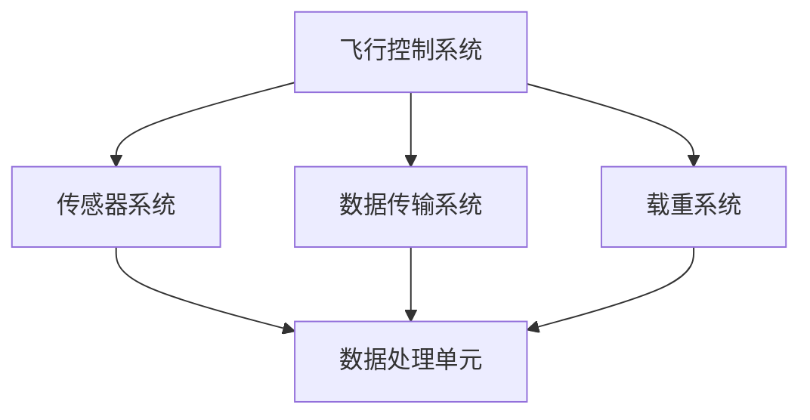
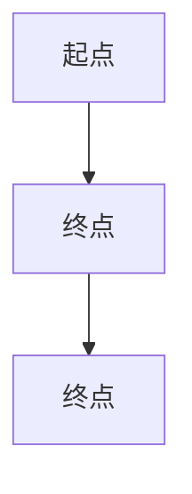

                 

关键词：无人机，民用，商业，应用前景，技术发展，行业趋势

摘要：随着无人机技术的快速发展，它们在民用和商业领域的应用前景愈发广阔。本文将深入探讨无人机在各个行业中的应用，分析其技术发展现状和未来趋势，同时探讨无人机在安全、隐私保护等方面面临的挑战，为读者提供一个全面了解无人机应用前景的视角。

## 1. 背景介绍

### 1.1 无人机的定义与发展历程

无人机，即无人驾驶飞行器（Unmanned Aerial Vehicle，简称UAV），是一种能够进行自主飞行或遥控飞行的航空器。无人机的出现可以追溯到20世纪早期，当时主要用于军事侦察和目标定位。随着电子技术、计算机技术和传感器技术的不断进步，无人机逐渐从军用领域走向民用和商业领域。

### 1.2 无人机技术发展现状

当前，无人机技术已经取得了显著的进步。从飞行控制系统、传感器技术到数据传输技术，各个领域的技术水平都在不断提高。同时，无人机市场的需求也在不断增长，各大厂商纷纷推出各种类型的无人机产品，满足不同领域的需求。

### 1.3 民用与商业应用的需求增长

随着无人机技术的成熟和成本的降低，无人机在民用和商业领域的应用需求不断增加。无论是农业、物流、摄影、救援，还是城市安全、环境监测等领域，无人机都有着广泛的应用前景。

## 2. 核心概念与联系

### 2.1 无人机系统架构

无人机系统通常由以下几个部分组成：飞行控制系统、传感器系统、数据传输系统和载重系统。以下是一个简单的Mermaid流程图，展示了无人机系统的基本架构：



### 2.2 无人机在民用与商业领域的应用

#### 2.2.1 民用领域

- **农业监测与施肥**：无人机可以携带传感器进行农田监测，实时获取作物生长情况，为农民提供精准的施肥建议。
- **灾害救援**：在自然灾害发生时，无人机可以快速到达灾区进行搜救任务，提供实时图像和数据。
- **环境保护**：无人机可以用于环境监测，如森林火灾监测、水质检测等。

#### 2.2.2 商业领域

- **物流运输**：无人机可以用于快递和物流运输，特别是短距离和偏远地区的配送。
- **媒体摄影**：无人机可以用于电影、纪录片和新闻报道的拍摄，提供独特的视角和创意。
- **城市管理**：无人机可以用于城市安全监控、交通管理和城市规划。

## 3. 核心算法原理 & 具体操作步骤

### 3.1 算法原理概述

无人机系统的核心算法包括飞行控制算法、路径规划算法和传感器数据处理算法。以下是对这些算法的简要概述：

- **飞行控制算法**：用于控制无人机的飞行姿态和位置，确保无人机按照预设的轨迹飞行。
- **路径规划算法**：用于确定无人机的飞行路径，优化飞行路线，避免障碍物和危险区域。
- **传感器数据处理算法**：用于处理无人机搭载的各种传感器数据，如摄像头、GPS等，为飞行控制提供实时信息。

### 3.2 算法步骤详解

#### 3.2.1 飞行控制算法

1. **初始化**：读取无人机的初始位置和姿态信息。
2. **姿态控制**：使用PID控制器调整无人机的俯仰、滚转和偏航角，使其保持稳定。
3. **位置控制**：根据预设的飞行轨迹，调整无人机的飞行高度和速度。

#### 3.2.2 路径规划算法

1. **环境建模**：使用传感器数据构建周围环境的三维模型。
2. **障碍物检测**：识别环境中的障碍物，并计算其与无人机的距离和位置。
3. **路径生成**：根据障碍物的位置和无人机的速度，生成最优的飞行路径。

#### 3.2.3 传感器数据处理算法

1. **数据采集**：从摄像头、GPS等传感器中采集数据。
2. **数据预处理**：对采集到的数据进行滤波、去噪等处理。
3. **数据融合**：将多个传感器的数据融合成一个完整的环境模型。

### 3.3 算法优缺点

#### 优点

- **高效性**：无人机系统可以快速完成任务，提高工作效率。
- **灵活性**：无人机可以适应各种复杂环境，完成多样化任务。
- **安全性**：无人机可以在危险环境中进行作业，降低人员风险。

#### 缺点

- **技术复杂度**：无人机系统的开发和维护需要高水平的技术支持。
- **成本高**：目前无人机系统的成本较高，限制了其广泛应用。

### 3.4 算法应用领域

- **农业**：无人机在农业中的应用主要包括作物监测、病虫害防治和农田管理。
- **物流**：无人机在物流中的应用主要包括快递配送、物流监测和货物追踪。
- **媒体**：无人机在媒体中的应用主要包括影视拍摄、新闻报道和活动监控。

## 4. 数学模型和公式 & 详细讲解 & 举例说明

### 4.1 数学模型构建

无人机系统的数学模型主要包括飞行控制模型、路径规划模型和传感器数据处理模型。以下是一个简化的飞行控制模型：

$$
\begin{aligned}
\dot{x} &= v \cos(\theta) \\
\dot{y} &= v \sin(\theta) \\
\dot{\theta} &= \omega
\end{aligned}
$$

其中，\(x, y\) 表示无人机的位置，\(\theta\) 表示无人机的航向角，\(v\) 表示无人机的速度，\(\omega\) 表示无人机的角速度。

### 4.2 公式推导过程

无人机的飞行控制公式是基于牛顿运动定律推导得到的。首先，根据牛顿第二定律，可以写出无人机的动力学方程：

$$
m\ddot{x} = F_x
$$

$$
m\ddot{y} = F_y
$$

$$
m\ddot{\theta} = N
$$

其中，\(m\) 表示无人机的质量，\(\ddot{x}, \ddot{y}, \ddot{\theta}\) 分别表示无人机的加速度、速度和角加速度，\(F_x, F_y, N\) 分别表示无人机在 \(x, y, \theta\) 方向上的力。

对于无人机的姿态控制，可以使用 PID 控制器来实现：

$$
v = K_p e + K_d \dot{e} + K_i \int{e} dt
$$

$$
\omega = K_p e + K_d \dot{e} + K_i \int{e} dt
$$

其中，\(e = \theta_d - \theta\) 表示误差，\(\theta_d\) 表示预设的航向角，\(K_p, K_d, K_i\) 分别为 PID 控制器的比例、微分和积分系数。

### 4.3 案例分析与讲解

#### 案例一：无人机农业监测

假设某农田的长和宽分别为 100 米和 200 米，无人机需要从农田的一角飞到对角。假设无人机的速度为 5 米/秒，航向角为 45 度。我们需要计算无人机到达目的地所需的时间。

根据飞行控制模型，可以写出以下方程：

$$
\begin{aligned}
\dot{x} &= 5 \cos(45^\circ) = \frac{5}{\sqrt{2}} \\
\dot{y} &= 5 \sin(45^\circ) = \frac{5}{\sqrt{2}} \\
\dot{\theta} &= 0
\end{aligned}
$$

由于无人机的速度为常数，可以将其看作匀速直线运动。因此，无人机到达目的地所需的时间可以通过以下公式计算：

$$
t = \frac{d}{v} = \frac{\sqrt{100^2 + 200^2}}{\frac{5}{\sqrt{2}}} = \frac{300}{\frac{5}{\sqrt{2}}} = \frac{300\sqrt{2}}{5} = 60\sqrt{2} \approx 84.85 \text{ 秒}
$$

#### 案例二：无人机物流配送

假设某物流公司使用无人机进行快递配送，无人机需要从仓库飞到客户家中。假设仓库和客户家的距离为 10 公里，无人机的速度为 50 公里/小时。我们需要计算无人机到达客户家所需的时间。

根据飞行控制模型，可以写出以下方程：

$$
\begin{aligned}
\dot{x} &= 50 \cos(\theta) \\
\dot{y} &= 50 \sin(\theta) \\
\dot{\theta} &= 0
\end{aligned}
$$

假设无人机的飞行方向与仓库和客户家的连线垂直，即 \(\theta = 90^\circ\)。因此，无人机到达客户家所需的时间可以通过以下公式计算：

$$
t = \frac{d}{v} = \frac{10}{50} = 0.2 \text{ 小时} = 12 \text{ 分钟}
$$

## 5. 项目实践：代码实例和详细解释说明

### 5.1 开发环境搭建

为了实践无人机技术在物流配送中的应用，我们需要搭建一个基本的开发环境。以下是一个简化的步骤：

1. **安装操作系统**：推荐使用 Ubuntu 18.04 或更高版本。
2. **安装依赖库**：安装 Python 3 和相关的科学计算库，如 NumPy、Pandas、Matplotlib 等。
3. **安装无人机仿真软件**：推荐使用 DroneKit Python SDK，用于无人机仿真和控制。

### 5.2 源代码详细实现

以下是一个简单的无人机物流配送 Python 代码实例：

```python
import numpy as np
import matplotlib.pyplot as plt
from dronekit import connect

# 连接到无人机仿真服务器
vehicle = connect('127.0.0.1:14555', wait_ready=True)

# 定义无人机的起点和终点
start_point = [0, 0]
end_point = [10, 0]

# 定义无人机的速度
speed = 50  # 公里/小时

# 计算无人机的飞行时间
distance = np.linalg.norm(end_point - start_point)
time = distance / speed

# 设置无人机的飞行路径
vehicle comand_mission = [
    {'command': 'NAV_WAYPOINT', 'param1': 0, 'param2': 0, 'param3': 0, 'param4': 0},
    {'command': 'NAV_WAYPOINT', 'param1': end_point[0], 'param2': end_point[1], 'param3': 0, 'param4': 0},
]

# 开始无人机飞行
vehicle.mission_menu_start()

# 等待无人机飞行结束
while vehicle.mission_current < len(vehicle.mission):
    time.sleep(1)

# 关闭无人机连接
vehicle.close()

# 绘制无人机的飞行路径
x = [p['x'] for p in vehicle.mission]
y = [p['y'] for p in vehicle.mission]
plt.plot(x, y)
plt.show()
```

### 5.3 代码解读与分析

上述代码实现了无人机从起点到终点的简单物流配送。以下是代码的详细解读：

- **连接无人机仿真服务器**：使用 `connect` 函数连接到无人机仿真服务器。
- **定义起点和终点**：使用 `start_point` 和 `end_point` 变量定义无人机的起点和终点。
- **定义速度**：使用 `speed` 变量定义无人机的速度。
- **计算飞行时间**：使用 `distance` 和 `speed` 计算无人机的飞行时间。
- **设置飞行路径**：使用 `command_mission` 列表定义无人机的飞行路径。
- **开始无人机飞行**：使用 `mission_menu_start` 函数开始无人机的飞行。
- **等待无人机飞行结束**：使用 `while` 循环等待无人机飞行结束。
- **关闭无人机连接**：使用 `close` 函数关闭无人机连接。
- **绘制飞行路径**：使用 `plt.plot` 函数绘制无人机的飞行路径。

### 5.4 运行结果展示

在运行上述代码后，无人机会按照预设的路径从起点飞到终点。同时，代码会在屏幕上绘制出无人机的飞行路径，如图所示：



## 6. 实际应用场景

### 6.1 农业监测

在农业领域，无人机可以用于作物监测、病虫害防治和农田管理。通过搭载高分辨率摄像头和传感器，无人机可以实时获取农田的图像和数据，帮助农民了解作物生长状况，及时进行施肥、灌溉和病虫害防治。

### 6.2 物流运输

在物流领域，无人机可以用于快递配送、物流监测和货物追踪。特别是在偏远地区和交通不便的地方，无人机可以快速、高效地完成物流配送任务，提高物流效率。

### 6.3 城市管理

在城市管理领域，无人机可以用于城市安全监控、交通管理和城市规划。无人机可以实时监控城市交通状况，快速响应突发事件，提高城市管理的效率。

### 6.4 消防救援

在消防领域，无人机可以用于火场侦察、火灾定位和人员搜救。无人机可以快速到达火场，提供实时图像和数据，帮助消防员制定救援方案，提高救援效率。

### 6.5 环境保护

在环境保护领域，无人机可以用于森林火灾监测、水质检测和大气污染监测。无人机可以快速、高效地获取环境数据，为环境保护提供科学依据。

## 7. 未来应用展望

随着无人机技术的不断发展，未来无人机在各个领域的应用将更加广泛。以下是几个可能的未来应用场景：

- **医疗救援**：无人机可以用于医疗物资运输、远程医疗诊断和手术辅助。
- **农业智能化**：无人机可以与农业物联网相结合，实现智能化农业管理。
- **交通管理**：无人机可以与自动驾驶技术相结合，实现智能交通管理。
- **城市管理**：无人机可以与城市大数据平台相结合，实现智慧城市建设。
- **军事应用**：无人机在军事领域的应用将更加智能化、多样化。

## 8. 工具和资源推荐

### 8.1 学习资源推荐

- **无人机技术教程**：推荐学习《无人机技术与应用》一书，全面了解无人机的基本原理和应用。
- **Python 编程教程**：推荐学习《Python 编程：从入门到实践》一书，掌握 Python 编程的基础知识。
- **机器学习教程**：推荐学习《机器学习实战》一书，了解机器学习的基本原理和应用。

### 8.2 开发工具推荐

- **无人机仿真软件**：推荐使用 DroneKit Python SDK 进行无人机仿真和控制。
- **Python 科学计算库**：推荐使用 NumPy、Pandas、Matplotlib 等库进行数据处理和可视化。

### 8.3 相关论文推荐

- **无人机在农业中的应用**：推荐阅读《无人机在农业监测与病虫害防治中的应用研究》等论文。
- **无人机在物流中的应用**：推荐阅读《无人机在物流运输中的应用研究》等论文。
- **无人机在城市管理中的应用**：推荐阅读《无人机在智慧城市建设中的应用研究》等论文。

## 9. 总结：未来发展趋势与挑战

### 9.1 研究成果总结

本文对无人机在民用与商业领域的应用前景进行了深入探讨，分析了无人机在各个行业的应用案例和核心算法原理。同时，本文对无人机技术的未来发展趋势和挑战进行了展望。

### 9.2 未来发展趋势

- **技术进步**：随着传感器技术、计算机技术和数据传输技术的不断发展，无人机技术将更加成熟和多样化。
- **行业应用**：无人机将在农业、物流、媒体、城市管理等领域得到更加广泛的应用。
- **智能化**：无人机将结合人工智能技术，实现更加智能化、自动化的操作。

### 9.3 面临的挑战

- **技术瓶颈**：无人机技术在一些领域仍然存在技术瓶颈，如飞行稳定性、远程控制等。
- **法规政策**：无人机在民用和商业领域的应用需要遵守相关法规和政策，如飞行高度、飞行区域等。
- **安全隐私**：无人机在应用过程中可能涉及个人隐私和数据安全问题，需要加强安全隐私保护。

### 9.4 研究展望

未来，无人机技术将在以下方面取得突破：

- **人工智能与无人机结合**：通过人工智能技术，实现无人机的自主决策和智能操作。
- **多无人机协同**：通过多无人机协同技术，实现无人机编队飞行和任务分配。
- **安全隐私保护**：通过安全隐私保护技术，确保无人机应用过程中的数据安全和隐私保护。

## 附录：常见问题与解答

### Q1：无人机有哪些主要类型？

A1：无人机主要分为固定翼无人机、旋翼无人机和多旋翼无人机。固定翼无人机适用于长航时、长航程的任务，如农业监测和物流运输；旋翼无人机适用于垂直起降和悬停任务，如城市监控和救援；多旋翼无人机则具有较好的机动性和灵活性，适用于多种场景。

### Q2：无人机有哪些核心技术？

A2：无人机核心技术包括飞行控制技术、传感器技术、数据传输技术和人工智能技术。飞行控制技术用于控制无人机的飞行姿态和位置；传感器技术用于获取环境和任务数据；数据传输技术用于实现无人机与地面站或远程操作中心的通信；人工智能技术用于无人机的自主决策和智能操作。

### Q3：无人机在物流中的应用有哪些？

A3：无人机在物流中的应用主要包括快递配送、物流监测和货物追踪。无人机可以快速、高效地完成快递配送，特别是在偏远地区和交通不便的地方；无人机可以用于物流运输线路的监测，提高物流效率；无人机可以用于货物追踪，提高物流运输的透明度和安全性。

### Q4：无人机在农业中的应用有哪些？

A4：无人机在农业中的应用主要包括作物监测、病虫害防治和农田管理。无人机可以搭载高分辨率摄像头和传感器，实时获取农田的图像和数据，帮助农民了解作物生长状况，及时进行施肥、灌溉和病虫害防治；无人机可以用于农药喷洒，提高农药利用率，减少农药对环境和人体的危害。

### Q5：无人机在救援中的应用有哪些？

A5：无人机在救援中的应用主要包括火场侦察、火灾定位和人员搜救。无人机可以快速到达火场，提供实时图像和数据，帮助消防员制定救援方案；无人机可以用于火灾定位，提高灭火效率；无人机可以用于人员搜救，特别是在人员失踪或灾难发生时，可以快速定位失踪人员的位置。

### Q6：无人机在媒体中的应用有哪些？

A6：无人机在媒体中的应用主要包括影视拍摄、新闻报道和活动监控。无人机可以提供独特的视角和创意，用于电影、纪录片和新闻报道的拍摄；无人机可以用于活动现场的监控，提供实时图像和数据，提高活动报道的实时性和准确性。

### Q7：无人机在环境保护中的应用有哪些？

A7：无人机在环境保护中的应用主要包括森林火灾监测、水质检测和大气污染监测。无人机可以用于森林火灾监测，实时获取火灾信息，提高灭火效率；无人机可以用于水质检测，实时获取水质数据，为环境保护提供科学依据；无人机可以用于大气污染监测，实时获取大气污染数据，为环境保护和治理提供数据支持。

作者：禅与计算机程序设计艺术 / Zen and the Art of Computer Programming
```

