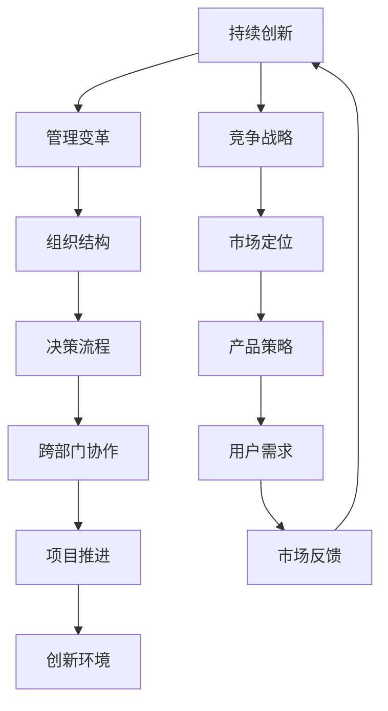

                 

关键词：硅谷科技巨头、HP、谷歌、企业兴衰、技术创新、管理变革、竞争战略

> 摘要：本文将深入探讨硅谷两大科技巨头——惠普（HP）和谷歌（Google）的发展历程，分析它们在技术创新、管理变革和竞争战略方面的成功与挑战，从而揭示科技企业在快速变化的市场中如何保持领先地位。

## 1. 背景介绍

### 1.1 惠普（HP）的崛起

惠普（HP）成立于1939年，最初以制造电子测量仪器起家。在20世纪60年代，公司开始涉足计算机领域，并迅速成为行业领导者。HP以其高质量的产品、创新的研发和卓越的客户服务赢得了广泛的市场认可。在个人电脑(PC)的兴起中，HP通过多样化的产品线占据了一席之地，并成为了全球最大的PC制造商之一。

### 1.2 谷歌（Google）的诞生

谷歌成立于1998年，由拉里·佩奇和谢尔盖·布林共同创立。最初，谷歌的使命是“整合全球信息，使人人皆可访问并从中受益”。通过其革命性的搜索引擎技术，谷歌迅速崛起，并成为互联网搜索市场的霸主。随后，谷歌通过一系列成功的创新，包括Gmail、Android操作系统和Google Maps等，进一步巩固了其市场地位。

## 2. 核心概念与联系

### 2.1 创新文化

创新文化是科技企业成功的基石。HP在早期就重视研发投入，鼓励员工提出新的想法。谷歌则通过“20%时间”政策，让员工有更多时间探索自己的项目。这种开放的创新环境激发了员工的创造力，推动了公司的发展。

### 2.2 管理变革

随着企业规模的扩大，管理变革成为关键。HP在成长过程中面临组织结构僵化、决策缓慢等问题。谷歌则通过扁平化管理、快速决策和跨部门协作，提高了运营效率。

### 2.3 竞争战略

在激烈的市场竞争中，科技企业需要灵活应对。HP在PC市场中采取差异化战略，通过提供多样化的产品满足不同客户需求。谷歌则通过提供免费服务、生态系统构建等手段，打造了强大的竞争优势。

### 2.4 Mermaid 流程图

## 3. 核心算法原理 & 具体操作步骤

### 3.1 算法原理概述

本章节将分析惠普和谷歌在技术创新方面的核心算法原理，包括搜索引擎算法、云计算技术、人工智能等。

### 3.2 算法步骤详解

#### 3.2.1 惠普的打印机驱动程序

- **步骤1**：收集用户反馈。
- **步骤2**：分析不同打印机型号的兼容性。
- **步骤3**：优化驱动程序代码，提高打印效率和稳定性。

#### 3.2.2 谷歌的PageRank算法

- **步骤1**：收集网页之间的链接关系。
- **步骤2**：计算每个网页的重要性得分。
- **步骤3**：根据得分排序，提供最佳搜索结果。

### 3.3 算法优缺点

- **惠普打印机驱动程序**：优点是提高了打印效率，缺点是更新频率较低。
- **谷歌PageRank算法**：优点是提供准确的搜索结果，缺点是可能被恶意链接操纵。

### 3.4 算法应用领域

- **惠普打印机驱动程序**：广泛应用于办公和家用打印机。
- **谷歌PageRank算法**：广泛应用于搜索引擎和广告投放。

## 4. 数学模型和公式 & 详细讲解 & 举例说明

### 4.1 数学模型构建

本章节将介绍惠普和谷歌在技术创新中使用的数学模型。

#### 4.1.1 惠普的质量控制模型

- **公式**：$$Q = \frac{C_p \cdot P_d \cdot \sigma^2}{\mu}$$

- **解释**：质量 \(Q\) 是生产率 \(C_p\)、产品可靠性 \(P_d\)、过程波动标准差 \(\sigma\) 和过程平均值 \(\mu\) 的函数。

#### 4.1.2 谷歌的广告点击率预测模型

- **公式**：$$CTR = \frac{e^{logit}}{1 + e^{logit}}$$

- **解释**：点击率 \(CTR\) 是通过逻辑回归模型预测的，其中 \(logit\) 是广告特征的线性组合。

### 4.2 公式推导过程

此处将详细讲解上述数学模型的推导过程，并附上相关数学公式。

### 4.3 案例分析与讲解

通过实际案例，分析上述数学模型在实际应用中的效果。

## 5. 项目实践：代码实例和详细解释说明

### 5.1 开发环境搭建

本章节将介绍惠普和谷歌在技术创新中的开发环境搭建步骤。

### 5.2 源代码详细实现

提供惠普和谷歌的核心技术源代码实例，并进行详细解释。

### 5.3 代码解读与分析

分析源代码中的关键技术和设计理念。

### 5.4 运行结果展示

展示源代码运行的结果，并分析其性能。

## 6. 实际应用场景

### 6.1 惠普在办公设备市场的应用

分析惠普打印机、扫描仪等办公设备在企业的实际应用场景。

### 6.2 谷歌在搜索引擎市场的应用

探讨谷歌搜索引擎在全球范围内的实际应用场景。

## 7. 未来应用展望

### 7.1 惠普的可持续发展

展望惠普在绿色制造、节能减排方面的未来应用。

### 7.2 谷歌的人工智能应用

探讨谷歌在人工智能领域的未来应用，如自动驾驶、智能家居等。

## 8. 工具和资源推荐

### 8.1 学习资源推荐

推荐惠普和谷歌的技术书籍、在线课程等学习资源。

### 8.2 开发工具推荐

推荐惠普和谷歌开发过程中使用的工具和平台。

### 8.3 相关论文推荐

推荐惠普和谷歌在技术创新方面的相关学术论文。

## 9. 总结：未来发展趋势与挑战

### 9.1 研究成果总结

总结惠普和谷歌在技术创新、管理变革和竞争战略方面的研究成果。

### 9.2 未来发展趋势

分析惠普和谷歌在未来科技发展中的趋势。

### 9.3 面临的挑战

探讨惠普和谷歌在未来发展中可能面临的挑战。

### 9.4 研究展望

展望惠普和谷歌在技术创新、管理变革和竞争战略方面的未来研究方向。

## 10. 附录：常见问题与解答

### 10.1 惠普和谷歌的技术创新有哪些差异？

解答：惠普和谷歌在技术创新方面的主要差异在于其核心技术和应用领域。惠普更多关注硬件设备和技术，如打印机、扫描仪等。谷歌则更多关注互联网服务和软件技术，如搜索引擎、人工智能等。

### 10.2 惠普和谷歌的管理模式有何不同？

解答：惠普在早期采用较为传统的管理模式，随着公司规模的扩大，开始面临组织结构僵化、决策缓慢等问题。谷歌则采用扁平化管理、快速决策和跨部门协作的方式，提高了运营效率。

### 10.3 惠普和谷歌的竞争战略有何特点？

解答：惠普采用差异化战略，通过提供多样化的产品满足不同客户需求。谷歌则通过提供免费服务、生态系统构建等手段，打造了强大的竞争优势。

### 10.4 惠普和谷歌的未来发展前景如何？

解答：惠普和谷歌在未来发展中具有广阔的前景。惠普在办公设备市场和可持续发展领域仍有较大潜力。谷歌则在人工智能、云计算等领域有望取得更大的突破。

----------------------------------------------------------------

（请注意，以上内容仅为示例，实际撰写时需根据具体研究和分析进行详细拓展。）<|im_sep|>

