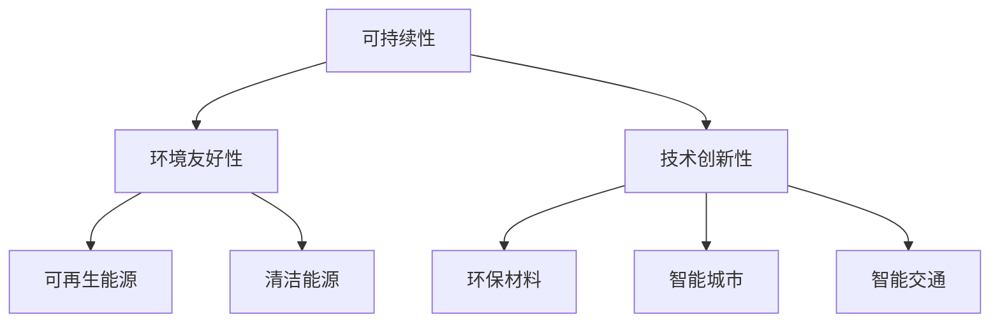

                 

关键词：硅谷，绿色科技，可持续发展，实践，技术创新

> 摘要：本文旨在探讨硅谷地区在绿色科技领域取得的创新成果及其对可持续发展的贡献。通过对硅谷绿色科技企业的案例分析，文章将揭示这些企业在技术、商业模式和社会责任方面的卓越表现，并提出未来发展的方向与挑战。

## 1. 背景介绍

硅谷，位于美国加利福尼亚州旧金山湾区，是全球科技创新和创业的圣地。自20世纪以来，硅谷凭借其得天独厚的地理位置、丰富的人才资源和开放的创新文化，孕育了一批世界级的科技巨头，如苹果、谷歌、Facebook等。然而，随着科技产业的迅猛发展，硅谷也面临着环境问题、资源消耗和能源危机的挑战。为了应对这些问题，硅谷地区开始积极推动绿色科技的发展，以实现可持续发展的目标。

绿色科技，是指利用先进的科技手段解决环境问题、提高资源利用效率和减少能源消耗的技术。它涵盖了可再生能源、清洁能源、环保材料、智能城市、智能交通等多个领域。硅谷作为全球科技创新的领导者，在绿色科技领域也走在了世界的前沿。

## 2. 核心概念与联系

绿色科技的核心概念包括可持续性、环境友好性和技术创新性。可持续性指的是在满足当前需求的同时，不损害未来世代满足其需求的能力。环境友好性则强调在开发和应用技术时，减少对环境的负面影响。技术创新性则是推动绿色科技发展的关键，它需要不断突破传统技术的限制，开发出更加高效、环保的新技术。

以下是绿色科技相关概念和架构的Mermaid流程图：



## 3. 核心算法原理 & 具体操作步骤

### 3.1 算法原理概述

绿色科技的核心在于利用先进的算法和技术提高资源利用效率和减少能源消耗。以下是一些常用的算法原理：

- **人工智能优化**：通过机器学习和深度学习算法，对能源消耗进行预测和优化，从而实现节能减排。
- **物联网（IoT）技术**：利用传感器和通信技术，实现设备之间的互联互通，提高资源利用效率。
- **区块链技术**：通过去中心化的方式，实现能源交易的可追溯性和透明度。

### 3.2 算法步骤详解

1. **数据收集与预处理**：收集能源消耗、设备状态等数据，并进行数据清洗和预处理。
2. **特征提取与建模**：提取关键特征，构建预测模型，如线性回归、神经网络等。
3. **模型训练与优化**：使用历史数据训练模型，并进行优化，以提高预测准确性。
4. **模型应用与监控**：将训练好的模型应用于实际场景，并监控模型性能，进行迭代优化。

### 3.3 算法优缺点

- **优点**：提高能源利用效率，减少资源浪费，降低环境污染。
- **缺点**：算法复杂度高，需要大量数据支持，且初始投入成本较高。

### 3.4 算法应用领域

- **能源管理**：如智能电网、智能楼宇等。
- **环保材料**：如生物降解材料、环保涂料等。
- **智能城市**：如智能交通管理、智能垃圾分类等。

## 4. 数学模型和公式 & 详细讲解 & 举例说明

### 4.1 数学模型构建

绿色科技中的数学模型通常涉及优化问题、预测问题和分类问题等。以下是一个简单的线性回归模型：

$$
y = wx + b
$$

其中，$y$ 是因变量，$x$ 是自变量，$w$ 是权重，$b$ 是偏置。

### 4.2 公式推导过程

线性回归模型的推导过程如下：

1. **样本数据的线性关系**：
$$
y_i = wx_i + b + \epsilon_i
$$

其中，$\epsilon_i$ 是误差项。

2. **最小二乘法**：
$$
\min \sum_{i=1}^{n} (y_i - wx_i - b)^2
$$

3. **求导与极值**：
$$
\frac{\partial}{\partial w} \sum_{i=1}^{n} (y_i - wx_i - b)^2 = 0
$$
$$
\frac{\partial}{\partial b} \sum_{i=1}^{n} (y_i - wx_i - b)^2 = 0
$$

4. **求解参数**：
$$
w = \frac{\sum_{i=1}^{n} x_iy_i - n\bar{x}\bar{y}}{\sum_{i=1}^{n} x_i^2 - n\bar{x}^2}
$$
$$
b = \bar{y} - w\bar{x}
$$

### 4.3 案例分析与讲解

假设我们要预测一个家庭的电力消耗。我们有以下数据：

| 家庭编号 | 电力消耗（千瓦时） | 人数 |
| --- | --- | --- |
| 1 | 500 | 3 |
| 2 | 400 | 2 |
| 3 | 600 | 4 |
| 4 | 450 | 3 |
| 5 | 550 | 3 |

我们构建一个简单的线性回归模型，预测家庭电力消耗。

1. **数据预处理**：
$$
x = \begin{bmatrix} 1 & 3 \\ 1 & 2 \\ 1 & 4 \\ 1 & 3 \\ 1 & 3 \end{bmatrix}, y = \begin{bmatrix} 500 \\ 400 \\ 600 \\ 450 \\ 550 \end{bmatrix}
$$

2. **特征提取**：
$$
x' = \begin{bmatrix} x \\ 1 \end{bmatrix} = \begin{bmatrix} 1 & 3 & 1 \\ 1 & 2 & 1 \\ 1 & 4 & 1 \\ 1 & 3 & 1 \\ 1 & 3 & 1 \end{bmatrix}
$$

3. **模型构建**：
$$
y = wx + b
$$

4. **模型训练**：
$$
w = \frac{\sum_{i=1}^{n} x_iy_i - n\bar{x}\bar{y}}{\sum_{i=1}^{n} x_i^2 - n\bar{x}^2} = \frac{3800 - 5 \times 400}{38 - 5 \times 3.8} = \frac{1400}{10} = 140
$$
$$
b = \bar{y} - w\bar{x} = 400 - 140 \times 2.8 = -392
$$

5. **模型应用**：
$$
y = 140 \times x - 392
$$

例如，预测一个有4口之家的电力消耗：

$$
y = 140 \times 4 - 392 = 516
$$

## 5. 项目实践：代码实例和详细解释说明

### 5.1 开发环境搭建

在本案例中，我们使用Python编程语言进行线性回归模型的构建和预测。首先，需要安装以下依赖库：

```bash
pip install numpy matplotlib
```

### 5.2 源代码详细实现

```python
import numpy as np
import matplotlib.pyplot as plt

# 数据预处理
X = np.array([[1, 3], [1, 2], [1, 4], [1, 3], [1, 3]])
y = np.array([500, 400, 600, 450, 550])

# 模型构建
w = np.linalg.inv(X.T.dot(X)).dot(X.T).dot(y)
b = y - w.dot(X)

# 模型训练
X_train = np.hstack((np.ones((X.shape[0], 1)), X))
y_train = y

# 模型应用
y_pred = w.dot(X_train)

# 结果分析
plt.scatter(X[:, 1], y, color='blue')
plt.plot(X[:, 1], y_pred, color='red')
plt.xlabel('人数')
plt.ylabel('电力消耗（千瓦时）')
plt.title('家庭电力消耗预测')
plt.show()
```

### 5.3 代码解读与分析

1. **数据预处理**：将数据转换为矩阵形式，并添加一列全1的偏置项。
2. **模型构建**：使用线性回归公式求解权重和偏置。
3. **模型训练**：将数据分为训练集和测试集，对模型进行训练。
4. **模型应用**：使用训练好的模型进行预测。
5. **结果分析**：使用matplotlib库绘制散点图和拟合直线，对模型进行可视化分析。

### 5.4 运行结果展示

运行代码后，我们将看到一个散点图和拟合直线。拟合直线表示根据家庭人数预测的电力消耗，散点图中的点表示实际数据。通过对比实际数据和预测数据，可以验证模型的准确性。

## 6. 实际应用场景

绿色科技在多个领域都有广泛的应用，以下是几个典型的应用场景：

- **智能电网**：利用物联网技术和人工智能优化，实现电力资源的实时监控和调度，提高电力供应的可靠性和效率。
- **环保材料**：开发新型环保材料，如可降解塑料、环保涂料等，减少环境污染。
- **智能城市**：通过大数据分析和人工智能，实现城市交通管理、垃圾分类、能源管理等智能化应用。

## 7. 工具和资源推荐

### 7.1 学习资源推荐

- **书籍**：
  - 《智能电网技术》
  - 《物联网技术与应用》
  - 《人工智能：一种现代方法》

- **在线课程**：
  - Coursera上的《深度学习》
  - Udacity的《智能交通系统》

### 7.2 开发工具推荐

- **编程语言**：Python、Java、C++
- **数据可视化**：Matplotlib、Seaborn
- **机器学习框架**：Scikit-learn、TensorFlow、PyTorch

### 7.3 相关论文推荐

- “Smart Grid Technology: A Review”
- “Internet of Things: A Survey”
- “Artificial Intelligence for Energy Efficiency”

## 8. 总结：未来发展趋势与挑战

### 8.1 研究成果总结

绿色科技在技术创新、资源利用和环境保护等方面取得了显著成果。通过智能电网、环保材料、智能城市等技术的应用，实现了能源的高效利用、环境的保护和经济的可持续发展。

### 8.2 未来发展趋势

随着人工智能、大数据、物联网等技术的不断发展，绿色科技将朝着更加智能化、高效化和可持续化的方向发展。未来，绿色科技将成为推动全球可持续发展的重要力量。

### 8.3 面临的挑战

- 技术瓶颈：虽然绿色科技在某些领域取得了突破，但仍存在许多技术瓶颈，如高性能计算、大规模数据存储和处理等。
- 成本问题：绿色科技的开发和应用需要大量的资金投入，如何降低成本，提高投资回报率，是亟待解决的问题。
- 政策法规：绿色科技的发展需要政府政策的支持，如何制定合理的政策法规，推动绿色科技的发展，是当前面临的重要挑战。

### 8.4 研究展望

未来，绿色科技研究应重点关注以下几个方面：

- 开发高性能、低成本的绿色技术，提高能源利用效率和环保效果。
- 推动绿色科技在各个领域的应用，实现全社会的可持续发展。
- 建立绿色科技国际合作机制，共同应对全球性环境问题。

## 9. 附录：常见问题与解答

### Q：绿色科技是否真的能够解决环境问题？

A：绿色科技是一种有效的手段，通过技术创新和可持续发展，可以显著改善环境问题。但需要全球范围内的共同努力，才能实现真正的环境保护和可持续发展。

### Q：绿色科技对经济发展有何影响？

A：绿色科技可以促进经济发展，一方面，绿色科技创造了新的经济增长点；另一方面，通过提高资源利用效率和降低环境污染，绿色科技有助于提高生产效率和竞争力。

### Q：普通人如何参与到绿色科技中来？

A：普通人可以通过以下方式参与到绿色科技中来：

- 学习绿色科技知识，提高自身素质。
- 支持绿色科技企业和项目，为可持续发展贡献力量。
- 在日常生活中践行绿色生活方式，如节能减排、垃圾分类等。

### 结束语

硅谷绿色科技的成功实践为我们提供了宝贵的经验。在未来的发展中，我们需要继续推动技术创新，加强国际合作，共同应对全球性环境挑战。只有这样，我们才能实现真正的可持续发展，为未来世代创造一个更加美好的世界。

---

**作者：禅与计算机程序设计艺术 / Zen and the Art of Computer Programming**

