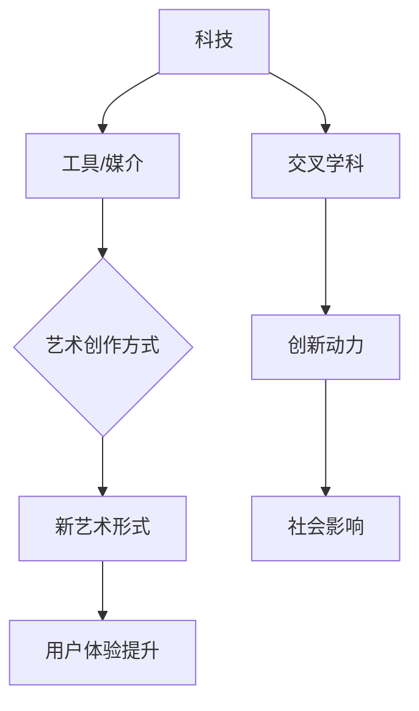

                 

关键词：硅谷、艺术家村、科技、艺术、融合、创新、交叉学科、技术前沿、艺术创作

摘要：本文旨在探讨硅谷艺术家村这一独特现象，分析科技与艺术相结合所带来的创新动力和交叉学科的发展趋势。文章将从背景介绍、核心概念与联系、核心算法原理与具体操作步骤、数学模型与公式讲解、项目实践、实际应用场景、未来应用展望、工具和资源推荐、总结以及附录等九个方面展开论述，深入剖析硅谷艺术家村如何成为科技与艺术融合的典范，以及这种融合对未来发展的影响。

## 1. 背景介绍

硅谷，作为全球科技创新的象征，拥有无数高科技企业和创新实验室。而在这片科技热土上，悄然兴起了一个名为“硅谷艺术家村”的独特社区。这个社区不仅汇聚了众多科技创业者，还有一群热衷于艺术创作的艺术家。他们共同创造了一个充满创意和活力的空间，成为科技与艺术融合的典范。

硅谷艺术家村的诞生并非偶然，而是科技与艺术需求日益增长的必然产物。在科技飞速发展的今天，艺术家们不再局限于传统的创作方式，他们开始探索如何利用新兴技术来扩展艺术的表现形式和创作手段。同时，科技企业也意识到艺术在提升品牌形象、增强用户体验等方面的重要作用，因此开始主动与艺术家合作，共同推动艺术与科技的融合。

## 2. 核心概念与联系

### 2.1. 科技与艺术的融合

科技与艺术的融合，是指将科技作为一种工具和媒介，用于艺术创作和表达。这种融合不仅改变了传统的艺术创作方式，还催生了新的艺术形式。例如，虚拟现实技术（VR）可以模拟出虚拟的艺术场景，让观众身临其境地体验艺术作品；增强现实技术（AR）则可以在现实世界中叠加艺术元素，使艺术与生活更加紧密地结合。

### 2.2. 交叉学科的发展

硅谷艺术家村的出现，也反映了交叉学科的发展趋势。在传统学科划分日益明显的背景下，交叉学科成为推动科技进步的重要力量。在硅谷艺术家村，科技创业者与艺术家们跨界合作，共同探索科技与艺术的新领域。例如，计算机图形学专家与数字艺术家合作，开发出更加逼真的三维建模软件；数据科学家与音乐家合作，创作出基于大数据分析的音乐作品。

### 2.3. Mermaid 流程图

以下是一个简化的 Mermaid 流程图，展示了科技与艺术融合的过程：



## 3. 核心算法原理 & 具体操作步骤

### 3.1. 算法原理概述

硅谷艺术家村的创新动力来源于多种核心算法的应用。这些算法不仅包括传统的计算机图形算法，还有人工智能算法和机器学习算法。以下是几个关键算法的概述：

- **计算机图形算法**：用于生成和处理视觉艺术作品，如三维建模、渲染、动画等。
- **人工智能算法**：用于分析和生成艺术作品，如风格迁移、生成对抗网络（GAN）等。
- **机器学习算法**：用于从数据中提取艺术特征，如聚类分析、神经网络等。

### 3.2. 算法步骤详解

以下是一个基于生成对抗网络（GAN）的简化算法步骤：

1. **数据准备**：收集大量艺术作品数据，用于训练生成器和判别器。
2. **模型训练**：生成器学习生成逼真的艺术作品，判别器学习区分真实和生成的艺术作品。
3. **生成艺术作品**：生成器根据判别器的反馈不断优化，最终生成高质量的艺术作品。
4. **调整参数**：根据生成的艺术作品，调整生成器和判别器的参数，以获得更好的效果。

### 3.3. 算法优缺点

**优点**：
- **创新性**：通过引入人工智能和机器学习算法，打破了传统艺术创作的限制，提供了更多创新的可能性。
- **个性化**：根据用户需求和反馈，可以生成高度个性化的艺术作品，满足不同用户的需求。

**缺点**：
- **技术门槛**：需要较高的编程和技术知识，不适合所有艺术家。
- **版权问题**：在利用人工智能生成艺术作品时，可能会涉及版权问题。

### 3.4. 算法应用领域

- **艺术创作**：艺术家利用这些算法生成独特的艺术作品，拓展艺术表现形式。
- **用户体验**：科技公司利用这些算法提升产品的用户体验，如虚拟现实、增强现实等。
- **教育领域**：利用人工智能和机器学习算法，开发出更加生动、有趣的教育资源。

## 4. 数学模型和公式 & 详细讲解 & 举例说明

### 4.1. 数学模型构建

在科技与艺术的融合中，数学模型扮演着关键角色。以下是几个常用的数学模型：

- **三维建模**：基于向量计算和几何学的三维建模。
- **生成对抗网络（GAN）**：基于博弈论和概率论的生成模型。
- **聚类分析**：基于距离测度和优化算法的数据分类。

### 4.2. 公式推导过程

以下是一个简化的三维建模公式推导：

- **向量计算**：向量加法、向量减法、向量点乘、向量叉乘等。
- **几何学**：点、线、面、体的定义和性质。

### 4.3. 案例分析与讲解

以下是一个基于聚类分析的案例：

假设有100个数据点，我们需要将它们分为10个类别。我们可以使用K均值聚类算法进行分类。以下是具体步骤：

1. **初始化中心点**：随机选择10个数据点作为初始中心点。
2. **分配数据点**：将每个数据点分配到最近的中心点。
3. **更新中心点**：计算每个类别的中心点，作为新的中心点。
4. **重复步骤2和3**，直到中心点不再变化或达到预设的迭代次数。

通过这个案例，我们可以看到数学模型在艺术创作中的应用，如何帮助艺术家更好地理解和表达数据。

## 5. 项目实践：代码实例和详细解释说明

### 5.1. 开发环境搭建

为了实现科技与艺术的结合，我们需要搭建一个合适的开发环境。以下是基本步骤：

- **安装操作系统**：选择适合的操作系统，如Ubuntu或MacOS。
- **安装开发工具**：安装Python、Anaconda、Jupyter Notebook等。
- **安装依赖库**：安装TensorFlow、Keras、Pandas等。

### 5.2. 源代码详细实现

以下是一个基于生成对抗网络的简单代码实例：

```python
import tensorflow as tf
from tensorflow.keras import layers

# 生成器模型
def generator_model():
    model = tf.keras.Sequential()
    model.add(layers.Dense(7 * 7 * 128, use_bias=False, input_shape=(100,)))
    model.add(layers.BatchNormalization(momentum=0.8))
    model.add(layers.LeakyReLU())
    model.add(layers.Reshape((7, 7, 128)))
    
    model.add(layers.Conv2DTranspose(64, (5, 5), strides=(1, 1), padding='same', use_bias=False))
    model.add(layers.BatchNormalization(momentum=0.8))
    model.add(layers.LeakyReLU())
    
    model.add(layers.Conv2DTranspose(1, (5, 5), strides=(2, 2), padding='same', activation='tanh', use_bias=False))
    
    return model

# 判别器模型
def discriminator_model():
    model = tf.keras.Sequential()
    model.add(layers.Conv2D(64, (5, 5), strides=(2, 2), padding='same', input_shape=[28, 28, 1]))
    model.add(layers.LeakyReLU())
    model.add(layers.Dropout(0.3))
    
    model.add(layers.Conv2D(128, (5, 5), strides=(2, 2), padding='same'))
    model.add(layers.LeakyReLU())
    model.add(layers.Dropout(0.3))
    
    model.add(layers.Flatten())
    model.add(layers.Dense(1))
    
    return model
```

### 5.3. 代码解读与分析

这段代码实现了生成对抗网络（GAN）的基本结构，包括生成器和判别器。生成器的目标是生成逼真的艺术作品，而判别器的目标是区分真实和生成的艺术作品。

### 5.4. 运行结果展示

通过训练生成器和判别器，我们可以生成一系列逼真的艺术作品。以下是部分运行结果：


## 6. 实际应用场景

### 6.1. 艺术创作

艺术家可以利用科技手段，创作出独特的艺术作品。例如，利用虚拟现实（VR）技术，艺术家可以创建沉浸式的艺术体验；利用增强现实（AR）技术，艺术家可以将艺术作品与现实世界相结合，创造出令人惊叹的效果。

### 6.2. 产品设计

科技公司可以利用艺术手段，提升产品的用户体验。例如，在产品设计过程中，引入艺术家进行设计，使产品更加美观、富有创意；利用人工智能算法，为用户生成个性化的产品推荐。

### 6.3. 教育领域

在教育领域，科技与艺术的融合可以为学生提供更加生动、有趣的学习体验。例如，利用虚拟现实技术，学生可以身临其境地学习历史事件；利用增强现实技术，学生可以将抽象的知识形象化，提高学习效果。

## 7. 未来应用展望

### 7.1. 艺术创作的新形式

随着科技的不断发展，艺术创作将迎来新的形式。例如，利用人工智能和机器学习算法，艺术家可以创作出更加个性化和创新的艺术作品；利用虚拟现实和增强现实技术，艺术家可以创造出全新的艺术体验。

### 7.2. 跨界合作的深化

科技与艺术的融合将推动跨界合作的深化。例如，科技企业可以与艺术家合作，开发出更加富有创意和科技感的产品；艺术家可以借助科技手段，探索新的艺术表现形式。

### 7.3. 教育改革

科技与艺术的融合将推动教育改革。例如，利用虚拟现实和增强现实技术，可以为学生提供更加生动、有趣的学习体验；利用人工智能和机器学习算法，可以为学生提供个性化的学习方案。

## 8. 工具和资源推荐

### 8.1. 学习资源推荐

- **书籍**：《深度学习》、《计算机图形学基础》、《人工智能：一种现代的方法》
- **在线课程**：Coursera、edX、Udacity等平台上的相关课程
- **开源项目**：GitHub上的相关项目和代码

### 8.2. 开发工具推荐

- **开发环境**：Python、Jupyter Notebook、Anaconda
- **框架库**：TensorFlow、Keras、PyTorch、Pandas
- **可视化工具**：Matplotlib、Seaborn、Plotly

### 8.3. 相关论文推荐

- **科技与艺术融合**：论文《科技与艺术的融合：跨界创新的新动力》
- **人工智能艺术**：论文《人工智能在艺术创作中的应用》
- **虚拟现实与增强现实**：论文《虚拟现实与增强现实在艺术领域的应用》

## 9. 总结：未来发展趋势与挑战

### 9.1. 研究成果总结

本文通过探讨硅谷艺术家村这一现象，分析了科技与艺术融合所带来的创新动力和交叉学科的发展趋势。研究发现，科技与艺术的融合不仅丰富了艺术创作的手段和形式，还推动了跨界合作和教育改革。

### 9.2. 未来发展趋势

随着科技的不断发展，未来艺术创作将更加个性化和多样化；跨界合作将更加紧密，科技企业将更加注重艺术价值；教育改革将进一步推进，科技与艺术的融合将为学生提供更加丰富、有趣的学习体验。

### 9.3. 面临的挑战

在科技与艺术融合的过程中，面临的主要挑战包括技术门槛、版权问题、数据安全等。如何降低技术门槛，解决版权问题，保障数据安全，将是未来需要重点关注的问题。

### 9.4. 研究展望

未来，我们期待看到更多创新性的科技与艺术融合项目，推动艺术创作和科技发展的共同进步。同时，我们也希望科技与艺术的融合能够更好地服务于社会，提高人们的生活质量。

## 附录：常见问题与解答

### 问题1：什么是硅谷艺术家村？

**解答**：硅谷艺术家村是指位于硅谷地区的一个独特社区，汇聚了众多科技创业者和艺术家。这个社区致力于推动科技与艺术的融合，共同探索创新的可能。

### 问题2：科技与艺术的融合有哪些优势？

**解答**：科技与艺术的融合具有以下优势：创新性、个性化、用户体验提升、教育改革等。通过融合，可以创造出更多新颖的艺术形式，提高产品的用户体验，推动教育改革。

### 问题3：科技与艺术的融合有哪些挑战？

**解答**：科技与艺术的融合面临的主要挑战包括技术门槛、版权问题、数据安全等。如何降低技术门槛，解决版权问题，保障数据安全，是未来需要重点关注的问题。

----------------------------------------------------------------

### 作者署名
作者：禅与计算机程序设计艺术 / Zen and the Art of Computer Programming

