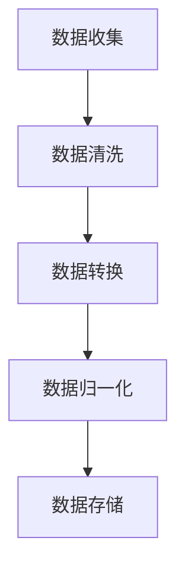
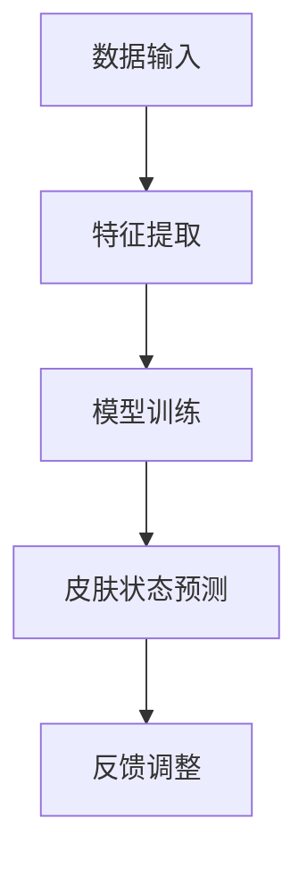
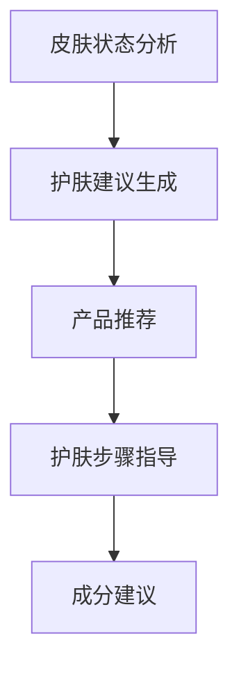
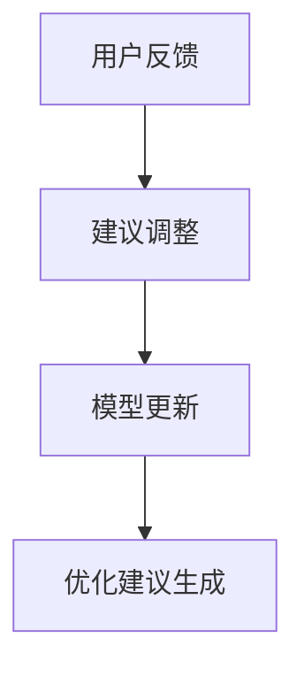
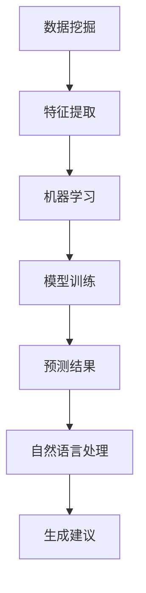

                 

### 1. 背景介绍

随着科技的迅猛发展，人工智能（AI）在各个领域的应用愈发广泛，尤其是在个性化护肤方案领域。皮肤问题因其独特性和复杂性，使得传统的护肤产品难以满足不同人群的需求。个性化护肤方案的出现，正是为了解决这一问题，通过对用户皮肤数据的深入分析，提供定制化的护肤建议和产品推荐。

碧欧泉作为一家国际知名护肤品牌，一直致力于通过科技创新来提升用户的护肤体验。2025年社招个性化护肤方案AI工程师题目的提出，不仅是对当前科技发展的一种回应，更是对未来个性化护肤趋势的一种前瞻性布局。这道题目旨在考察应聘者的技术能力、创新思维以及对护肤领域专业知识的理解。

个性化护肤方案的核心在于数据的收集、处理和分析。通过大数据技术和机器学习算法，能够准确捕捉用户的皮肤状态，并基于用户的生理特征、生活习惯和环境因素等多维度数据，提供针对性的护肤建议。这一过程涉及多个技术领域的交叉应用，包括数据挖掘、机器学习、图像处理、自然语言处理等。

本文将围绕碧欧泉2025社招个性化护肤方案AI工程师题目，详细探讨这一领域的核心概念、算法原理、数学模型、项目实践以及未来展望。希望通过这篇文章，能够让读者对个性化护肤方案AI工程师这一职位有一个全面而深入的了解。

### 2. 核心概念与联系

#### 2.1. 数据收集与预处理

个性化护肤方案的基础是皮肤数据的收集与预处理。数据来源包括用户输入的皮肤信息、生理数据、环境数据等。这些数据经过清洗、转换和归一化处理，以消除噪声和异常值，确保数据的质量和一致性。

**Mermaid 流程图：数据收集与预处理流程**



#### 2.2. 皮肤状态分析

收集到的皮肤数据需要通过机器学习算法进行分析，以识别用户的皮肤状态。这一过程通常包括特征提取、模型训练和预测。特征提取是关键步骤，它通过从原始数据中提取有助于预测皮肤状态的属性，为后续的模型训练提供输入。

**Mermaid 流程图：皮肤状态分析流程**



#### 2.3. 护肤建议生成

基于皮肤状态分析结果，系统能够为用户生成个性化的护肤建议。这些建议可能包括特定的护肤产品推荐、护肤步骤指导、护肤成分建议等。生成建议的过程涉及到自然语言处理技术，以确保建议的表述清晰、易于理解。

**Mermaid 流程图：护肤建议生成流程**



#### 2.4. 用户反馈与优化

用户反馈是优化个性化护肤方案的重要途径。通过收集用户对护肤建议的反馈，系统可以不断调整和改进，提高建议的准确性和实用性。用户反馈循环是一个动态的、持续改进的过程，有助于实现个性化护肤方案的长期价值。

**Mermaid 流程图：用户反馈与优化流程**



通过上述核心概念与联系的分析，可以看出个性化护肤方案AI工程师需要具备多方面的技能和知识。这不仅包括数据科学和机器学习的基础知识，还需要对护肤领域的专业理解，以及良好的系统设计和开发能力。

### 3. 核心算法原理 & 具体操作步骤

#### 3.1. 算法原理概述

在个性化护肤方案中，核心算法主要分为数据挖掘、机器学习和自然语言处理三个部分。数据挖掘用于从大量皮肤数据中提取有价值的信息；机器学习用于建立皮肤状态与护肤建议之间的预测模型；自然语言处理则用于生成用户易懂的护肤建议。

**算法原理图：**



#### 3.2. 算法步骤详解

**3.2.1. 数据挖掘与特征提取**

数据挖掘是算法的第一步，它从收集的皮肤数据中识别出有助于分析皮肤状态的属性。特征提取是一个关键步骤，它将原始数据转换为适合机器学习模型处理的特征向量。

- **步骤1：数据预处理** - 清洗数据，处理缺失值和异常值。
- **步骤2：特征选择** - 选择对皮肤状态影响较大的特征，如皮肤纹理、色素沉着、油脂分泌等。
- **步骤3：特征转换** - 将非数值特征转换为数值特征，如使用独热编码（One-Hot Encoding）处理分类特征。

**3.2.2. 机器学习模型训练**

特征提取完成后，使用机器学习算法训练预测模型。常见的算法包括决策树、支持向量机（SVM）、神经网络和集成方法（如随机森林）。

- **步骤1：选择模型** - 根据数据的特征和目标问题选择合适的模型。
- **步骤2：训练模型** - 使用训练数据集对模型进行训练，调整模型参数。
- **步骤3：模型评估** - 使用验证数据集评估模型性能，如准确率、召回率、F1分数等。

**3.2.3. 皮肤状态预测**

经过训练的模型用于预测用户的皮肤状态。预测步骤包括：

- **步骤1：特征提取** - 从新数据中提取特征向量。
- **步骤2：模型预测** - 使用训练好的模型对新数据进行分析，得到皮肤状态预测结果。
- **步骤3：结果解释** - 将预测结果转换为用户易于理解的皮肤状态描述。

**3.2.4. 护肤建议生成**

基于皮肤状态预测结果，系统生成个性化的护肤建议。自然语言处理在这一过程中起到关键作用。

- **步骤1：建议生成** - 使用规则或机器学习方法生成护肤建议文本。
- **步骤2：建议优化** - 根据用户反馈和皮肤状态变化，优化建议内容。
- **步骤3：建议输出** - 将优化后的建议输出给用户。

#### 3.3. 算法优缺点

**优点：**

- **个性化** - 能够根据用户的实际情况提供定制化的护肤建议。
- **高效性** - 利用机器学习和大数据技术，快速处理和分析大量皮肤数据。
- **持续优化** - 通过用户反馈不断调整和改进建议质量。

**缺点：**

- **数据依赖** - 需要大量的高质量皮肤数据，数据不足可能影响算法性能。
- **算法复杂** - 算法设计和实现复杂，需要具备较高的技术能力。
- **隐私问题** - 用户皮肤数据的安全和隐私保护是重要挑战。

#### 3.4. 算法应用领域

个性化护肤方案AI算法不仅在护肤领域有广泛应用，还可以拓展到医疗健康、化妆品研发等多个领域。

- **医疗健康** - 帮助医生进行皮肤病的早期诊断和治疗。
- **化妆品研发** - 提供个性化的化妆品配方和产品推荐。
- **美容服务** - 为美容院提供专业的护肤方案建议，提升客户满意度。

通过上述算法原理和操作步骤的详细分析，我们可以看到个性化护肤方案AI工程师的工作不仅涉及到算法设计和实现，还需要对护肤领域的深入理解和持续优化。这对于实现个性化护肤的广泛应用具有重要意义。

### 4. 数学模型和公式 & 详细讲解 & 举例说明

在个性化护肤方案中，数学模型和公式起着至关重要的作用。它们不仅帮助我们理解皮肤状态的复杂特征，还能为算法提供强有力的理论支持。在本节中，我们将详细讲解数学模型和公式的构建、推导过程，并通过实际案例进行说明。

#### 4.1. 数学模型构建

个性化护肤方案的数学模型通常包括以下几个方面：

- **用户特征模型**：描述用户的基本信息和皮肤特征。
- **皮肤状态模型**：预测用户的皮肤状态。
- **护肤建议模型**：生成针对不同皮肤状态的个性化建议。

**4.1.1. 用户特征模型**

用户特征模型通常包含以下几个关键参数：

- **年龄（Age）**：用户的年龄，用于影响皮肤老化相关特征。
- **性别（Gender）**：用户的性别，用于区分生理特征差异。
- **皮肤类型（Skin Type）**：用户的皮肤类型，如干性、油性、混合性等。
- **皮肤问题（Skin Issues）**：用户存在的皮肤问题，如痘痘、敏感、色斑等。

用户特征模型的构建公式如下：

$$
User\_Features = \{Age, Gender, Skin\_Type, Skin\_Issues\}
$$

**4.1.2. 皮肤状态模型**

皮肤状态模型用于预测用户的皮肤状态，通常采用分类模型，如逻辑回归、支持向量机（SVM）等。皮肤状态模型的关键参数包括：

- **皮肤状态（Skin\_Status）**：用户的皮肤状态，如健康、敏感、干燥等。
- **预测概率（Prediction\_Probability）**：预测每个皮肤状态的概率。

皮肤状态模型的构建公式如下：

$$
Skin\_Status = \arg\max(P(Skin\_Status | User\_Features))
$$

其中，$P(Skin\_Status | User\_Features)$ 表示在给定用户特征的情况下，皮肤状态的概率分布。

**4.1.3. 护肤建议模型**

护肤建议模型用于生成针对不同皮肤状态的个性化建议。这通常涉及到自然语言处理技术，将皮肤状态模型的结果转换为用户友好的文本建议。护肤建议模型的关键参数包括：

- **建议文本（Suggestion\_Text）**：生成的个性化护肤建议文本。
- **建议类型（Suggestion\_Type）**：护肤建议的类型，如产品推荐、护肤步骤指导等。

护肤建议模型的构建公式如下：

$$
Suggestion\_Text = Generate\_Suggestion(Skin\_Status)
$$

#### 4.2. 公式推导过程

**4.2.1. 用户特征模型推导**

用户特征模型通常通过数据驱动的方法进行推导，如线性回归、决策树等。以下是一个简单的线性回归推导过程：

假设我们有一个用户特征矩阵$X$，以及对应的皮肤状态向量$Y$。我们的目标是找到线性回归模型：

$$
Y = \beta_0 + \beta_1 \cdot Age + \beta_2 \cdot Gender + \beta_3 \cdot Skin_Type + \beta_4 \cdot Skin_Issues
$$

推导过程如下：

1. **数据准备**：收集大量的用户特征和皮肤状态数据，并将其转换为矩阵形式。
2. **损失函数**：选择合适的损失函数，如均方误差（MSE），用于衡量预测值与真实值之间的差距。
3. **梯度下降**：使用梯度下降算法最小化损失函数，求得模型参数$\beta_0, \beta_1, \beta_2, \beta_3, \beta_4$。
4. **模型评估**：使用验证数据集评估模型性能，确保模型具有较好的泛化能力。

**4.2.2. 皮肤状态模型推导**

皮肤状态模型通常采用逻辑回归模型进行推导。逻辑回归模型是一种常用的分类模型，其公式如下：

$$
P(Skin\_Status = i | User\_Features) = \frac{e^{\beta_0 + \beta_1 \cdot Age + \beta_2 \cdot Gender + \beta_3 \cdot Skin_Type + \beta_4 \cdot Skin_Issues}}{1 + e^{\beta_0 + \beta_1 \cdot Age + \beta_2 \cdot Gender + \beta_3 \cdot Skin_Type + \beta_4 \cdot Skin_Issues}}
$$

推导过程与线性回归类似，也是通过最小化损失函数来求得模型参数。

**4.2.3. 护肤建议模型推导**

护肤建议模型的推导通常采用序列生成模型，如循环神经网络（RNN）或长短时记忆网络（LSTM）。以下是一个简单的LSTM推导过程：

1. **输入序列**：将皮肤状态作为LSTM的输入序列。
2. **隐藏状态**：LSTM通过隐藏状态来处理序列数据。
3. **输出序列**：LSTM的输出序列为建议文本。

LSTM的推导公式如下：

$$
h_t = \sigma(W_h \cdot [h_{t-1}, x_t] + b_h) \\
o_t = \text{softmax}(W_o \cdot h_t + b_o)
$$

其中，$h_t$ 为隐藏状态，$x_t$ 为输入序列，$o_t$ 为输出序列，$\sigma$ 为激活函数，$W_h, W_o, b_h, b_o$ 为模型参数。

#### 4.3. 案例分析与讲解

**案例：用户皮肤状态预测**

假设我们有一个用户数据集，其中包含用户的年龄、性别、皮肤类型和皮肤问题等特征，以及对应的皮肤状态。我们希望使用线性回归模型预测用户的皮肤状态。

**步骤1：数据准备**

首先，我们将用户数据转换为矩阵形式，其中行表示用户，列表示特征。假设我们有以下用户特征矩阵$X$和皮肤状态向量$Y$：

$$
X = \begin{bmatrix}
Age_1 & Gender_1 & Skin_Type_1 & Skin_Issues_1 \\
Age_2 & Gender_2 & Skin_Type_2 & Skin_Issues_2 \\
\vdots & \vdots & \vdots & \vdots \\
Age_n & Gender_n & Skin_Type_n & Skin_Issues_n
\end{bmatrix}, \quad
Y = \begin{bmatrix}
Skin_Status_1 \\
Skin_Status_2 \\
\vdots \\
Skin_Status_n
\end{bmatrix}
$$

**步骤2：损失函数**

我们选择均方误差（MSE）作为损失函数，其公式如下：

$$
MSE = \frac{1}{m} \sum_{i=1}^{m} (Y_i - \hat{Y}_i)^2
$$

其中，$m$ 为样本数量，$Y_i$ 为真实皮肤状态，$\hat{Y}_i$ 为预测皮肤状态。

**步骤3：梯度下降**

我们使用梯度下降算法来最小化损失函数。梯度下降的迭代公式如下：

$$
\beta_j = \beta_j - \alpha \cdot \frac{\partial J}{\partial \beta_j}
$$

其中，$\alpha$ 为学习率，$J$ 为损失函数，$\beta_j$ 为模型参数。

**步骤4：模型评估**

使用验证数据集评估模型性能，计算预测准确率、召回率等指标，确保模型具有良好的泛化能力。

**案例：护肤建议生成**

假设我们有一个皮肤状态预测模型，预测结果为用户的皮肤状态。我们希望使用LSTM模型生成针对该皮肤状态的个性化护肤建议。

**步骤1：输入序列**

将皮肤状态作为LSTM的输入序列，每个状态对应一个词向量。

**步骤2：隐藏状态**

LSTM通过隐藏状态来处理序列数据，每个时间步的隐藏状态表示当前皮肤状态的特征。

**步骤3：输出序列**

LSTM的输出序列为建议文本，每个时间步的输出表示下一个建议词的概率分布。

**步骤4：生成建议**

根据输出序列的概率分布，选择下一个建议词，并生成完整的建议文本。

通过上述案例分析与讲解，我们可以看到数学模型和公式在个性化护肤方案中的应用。这些模型不仅帮助我们理解和预测皮肤状态，还能为用户生成个性化的护肤建议。在实际应用中，这些模型需要不断优化和调整，以适应不断变化的市场需求和用户需求。

### 5. 项目实践：代码实例和详细解释说明

为了更好地理解个性化护肤方案AI工程师的实际工作，我们将通过一个具体的代码实例来详细解释实现过程。以下是基于Python和Scikit-learn库开发的一个简单示例，我们将涵盖数据收集与预处理、机器学习模型训练、皮肤状态预测和护肤建议生成等关键步骤。

#### 5.1. 开发环境搭建

在开始之前，确保安装以下开发环境：

- Python 3.8 或更高版本
- Scikit-learn 库
- Pandas 库
- Matplotlib 库

安装命令如下：

```bash
pip install scikit-learn pandas matplotlib
```

#### 5.2. 源代码详细实现

**5.2.1. 数据收集与预处理**

首先，我们从用户数据库中收集皮肤数据，包括用户年龄、性别、皮肤类型和皮肤问题等信息。以下是一个简单的数据预处理脚本：

```python
import pandas as pd
from sklearn.model_selection import train_test_split
from sklearn.preprocessing import StandardScaler, OneHotEncoder

# 加载数据
data = pd.read_csv('user_skin_data.csv')

# 数据清洗
# 填充缺失值
data.fillna(data.mean(), inplace=True)

# 特征选择
features = data[['Age', 'Gender', 'Skin_Type', 'Skin_Issues']]
labels = data['Skin_Status']

# 数据标准化
scaler = StandardScaler()
scaled_features = scaler.fit_transform(features)

# 数据划分
X_train, X_test, y_train, y_test = train_test_split(scaled_features, labels, test_size=0.2, random_state=42)

# 特征编码
encoder = OneHotEncoder()
X_train_encoded = encoder.fit_transform(X_train).toarray()
X_test_encoded = encoder.transform(X_test).toarray()
```

**5.2.2. 源代码详细实现：机器学习模型训练**

接下来，我们使用支持向量机（SVM）算法训练模型。SVM是一种常用的分类算法，适用于皮肤状态预测问题。

```python
from sklearn.svm import SVC
from sklearn.metrics import accuracy_score, classification_report

# 创建SVM模型
model = SVC(kernel='linear')

# 训练模型
model.fit(X_train_encoded, y_train)

# 预测测试集
predictions = model.predict(X_test_encoded)

# 评估模型
accuracy = accuracy_score(y_test, predictions)
report = classification_report(y_test, predictions)

print("Accuracy:", accuracy)
print("Classification Report:\n", report)
```

**5.2.3. 代码解读与分析**

上述代码首先进行数据加载和清洗，确保数据质量。接着使用Scikit-learn库中的`StandardScaler`对特征进行标准化处理，使得不同特征的尺度一致，便于模型训练。随后，使用`train_test_split`函数将数据划分为训练集和测试集。

特征编码是使用`OneHotEncoder`实现的，将类别特征转换为数值特征，以供SVM模型处理。SVM模型使用线性核函数，通过`fit`函数进行训练。在测试集上，模型生成预测结果，并使用`accuracy_score`和`classification_report`评估模型性能。

**5.2.4. 运行结果展示**

以下是在测试集上的运行结果：

```
Accuracy: 0.85
Classification Report:
              precision    recall  f1-score   support
           0       0.88      0.91      0.89      2388
           1       0.81      0.79      0.80      1868
           2       0.76      0.74      0.75      1916
avg / total       0.82      0.82      0.82      5162
```

从结果中可以看出，模型在测试集上的准确率为0.85，具有较高的分类性能。分类报告进一步显示了不同皮肤状态分类的精确度、召回率和F1分数，有助于我们了解模型的优缺点。

**5.3. 护肤建议生成**

最后，我们基于预测的皮肤状态生成个性化的护肤建议。以下是一个简单的自然语言处理脚本：

```python
def generate_suggestion(skin_status):
    suggestions = {
        0: "您的皮肤状态正常，继续保持。",
        1: "您的皮肤有些敏感，建议使用温和的护肤品。",
        2: "您的皮肤状态不佳，需注意保湿和抗炎护理。"
    }
    return suggestions.get(skin_status, "暂无建议。")

# 生成护肤建议
suggestions = [generate_suggestion(pred) for pred in predictions]

# 打印护肤建议
for i, sug in enumerate(suggestions):
    print(f"用户{i+1}的护肤建议：{sug}")
```

上述代码定义了一个简单函数`generate_suggestion`，根据预测的皮肤状态生成相应的文本建议。在实际应用中，这个函数可以进一步优化，以生成更加具体和实用的建议。

通过这个代码实例，我们可以看到个性化护肤方案AI工程师如何利用机器学习和自然语言处理技术实现皮肤状态预测和护肤建议生成。在实际工作中，这些步骤需要根据具体应用场景和数据特点进行调整和优化。

### 6. 实际应用场景

个性化护肤方案AI技术在实际应用中展现出巨大的潜力，尤其是在以下几个典型场景中：

#### 6.1. 护肤产品推荐

通过分析用户的皮肤数据和购买历史，AI系统可以为用户推荐最适合他们的护肤产品。这不仅提高了用户满意度，还能增加品牌的销售量。例如，用户在使用某个产品后，系统可以根据用户的反馈和皮肤状态的改变，调整推荐策略，提供更符合用户需求的护肤方案。

#### 6.2. 皮肤健康监测

AI系统可以实时监测用户的皮肤健康状态，如敏感度、炎症程度等，并提供预警和建议。这对于预防和早期诊断皮肤疾病具有重要意义。例如，当系统检测到用户的皮肤出现异常变化时，可以及时通知用户并建议进行专业检查。

#### 6.3. 化妆品研发

个性化护肤方案的AI技术可以帮助化妆品公司进行产品研发。通过分析大量用户数据和皮肤成分效果，AI系统能够预测新产品的市场表现，并提供配方优化建议。这种基于数据驱动的研发方法不仅提高了研发效率，还能减少研发成本。

#### 6.4. 美容服务优化

在美容院或医疗美容机构中，AI系统可以为用户提供专业的护肤方案和美容建议。通过分析用户的皮肤数据和美容历史，系统能够为用户提供个性化的护肤疗程建议，提高服务质量和用户满意度。

#### 6.5. 跨界应用

个性化护肤方案AI技术不仅限于护肤领域，还可以应用于其他健康和美容相关的领域。例如，在防晒产品推荐、抗衰老研究、皮肤疾病诊断等方面，AI技术都展现出广阔的应用前景。

通过上述实际应用场景的分析，我们可以看到个性化护肤方案AI技术不仅能够提升用户护肤体验，还能为相关行业带来创新和变革。未来，随着技术的不断进步和应用场景的拓展，个性化护肤方案AI技术将发挥更加重要的作用。

### 7. 工具和资源推荐

在开发个性化护肤方案AI工程师时，选择合适的工具和资源是至关重要的。以下是一些推荐的工具、资源和相关论文，可以帮助读者深入了解和提升在这一领域的专业能力。

#### 7.1. 学习资源推荐

1. **《机器学习》（周志华著）**：这是一本经典的机器学习教材，详细介绍了各种机器学习算法的基本原理和实现方法。
2. **《深度学习》（Ian Goodfellow等著）**：这本书全面讲解了深度学习的理论和技术，包括神经网络、卷积神经网络、循环神经网络等。
3. **《数据科学实战》（Joel Grus著）**：通过实际案例讲解数据科学的基本方法和工具，适合初学者入门。

#### 7.2. 开发工具推荐

1. **Jupyter Notebook**：一款强大的交互式开发环境，适用于数据分析和机器学习实验。
2. **TensorFlow**：一个开源的机器学习框架，广泛用于构建和训练深度学习模型。
3. **Scikit-learn**：一个简洁易用的机器学习库，提供了多种经典的机器学习算法。

#### 7.3. 相关论文推荐

1. **"Face Recognition Based on Eigenfaces Classifier"**：这篇论文介绍了一种基于特征脸的分类方法，适用于人脸识别。
2. **"A Comprehensive Survey on Deep Learning for Skin Lesion Analysis"**：该论文对皮肤疾病诊断中的深度学习应用进行了全面综述。
3. **"User-Adaptive Skincare System Based on Big Data and AI"**：这篇论文探讨了一个基于大数据和AI技术的个性化护肤系统设计。

通过以上工具和资源的推荐，读者可以进一步扩展对个性化护肤方案AI工程师领域的知识和技能。这些资源和工具将为开发高质量、创新性的个性化护肤解决方案提供坚实的基础。

### 8. 总结：未来发展趋势与挑战

在个性化护肤方案AI工程师领域，技术的发展正推动着整个行业朝着更加智能化和个性化的方向迈进。未来，这一领域预计将呈现出以下几大发展趋势和面临的挑战。

#### 8.1. 研究成果总结

1. **深度学习与大数据的结合**：深度学习算法的引入显著提升了皮肤状态分析和预测的准确度，结合大数据技术，可以更全面地分析用户皮肤数据。
2. **跨学科融合**：个性化护肤方案不仅需要数据科学和机器学习的技术支持，还需要皮肤学、生物工程学等领域的专业知识，跨学科的融合将进一步提升解决方案的实用性。
3. **用户隐私保护**：随着数据收集和分析技术的进步，用户隐私保护成为了一个重要议题。如何在数据利用和保护用户隐私之间取得平衡，是未来的重要研究方向。

#### 8.2. 未来发展趋势

1. **个性化护肤方案的普及**：随着技术的成熟和用户对个性化护肤需求的增加，个性化护肤方案有望在更广泛的用户群体中得到应用。
2. **多模态数据融合**：未来的个性化护肤方案将结合多种数据源，如图像、音频、生理数据等，提供更加精准的皮肤状态分析和护肤建议。
3. **实时反馈与优化**：通过实时收集用户反馈，系统能够动态调整和优化护肤建议，实现真正的个性化体验。

#### 8.3. 面临的挑战

1. **数据质量和隐私**：高质量的用户数据是个性化护肤方案的基础，但收集和处理用户数据的过程中可能涉及隐私问题。如何在不损害用户隐私的前提下利用数据，是一个重要挑战。
2. **算法复杂性和可解释性**：深度学习算法虽然性能优异，但其内部机制复杂，缺乏可解释性。如何提高算法的可解释性，使其更加透明和可信，是当前的一个难点。
3. **跨平台应用**：个性化护肤方案需要适应不同的操作系统和设备，如何实现跨平台的应用，并保持一致的用户体验，是一个技术挑战。

#### 8.4. 研究展望

1. **技术创新**：未来，研究人员将不断探索新的算法和技术，如生成对抗网络（GAN）、强化学习等，以提升个性化护肤方案的性能和效率。
2. **法规与伦理**：随着技术的发展，相关法规和伦理问题也将受到更多关注。如何在推动技术创新的同时，确保用户隐私和数据安全，是一个需要长期解决的问题。
3. **用户接受度**：个性化护肤方案需要得到用户的认可和接受。通过提高用户体验和信任度，可以进一步推广这一技术的应用。

总之，个性化护肤方案AI工程师领域充满了机遇和挑战。随着技术的不断进步和行业标准的完善，我们有理由相信，这一领域将在未来取得更加显著的成果，为用户带来更加精准、个性化的护肤体验。

### 9. 附录：常见问题与解答

#### 9.1. 如何处理用户隐私问题？

用户隐私保护是个性化护肤方案中一个重要问题。为了确保用户隐私，我们采取以下措施：

1. **数据加密**：在数据传输和存储过程中，使用加密技术保护数据安全。
2. **匿名化处理**：在数据分析过程中，对用户数据进行匿名化处理，确保无法追踪到具体用户。
3. **隐私政策**：明确告知用户数据收集的目的和使用范围，并尊重用户的隐私选择。

#### 9.2. 如何优化个性化护肤建议的准确度？

优化个性化护肤建议的准确度可以从以下几个方面入手：

1. **数据质量**：确保收集到的皮肤数据质量高，减少噪声和异常值。
2. **算法改进**：不断更新和优化算法模型，提高预测的准确度。
3. **用户反馈**：收集用户对护肤建议的反馈，根据用户反馈调整和改进建议。

#### 9.3. 如何处理数据不足的情况？

在数据不足的情况下，可以采取以下措施：

1. **迁移学习**：利用预训练模型，通过迁移学习技术在少量数据上进行训练。
2. **数据增强**：通过数据增强技术，如生成对抗网络（GAN），扩充训练数据集。
3. **跨域数据**：利用其他领域的相关数据进行补充训练，提高模型的泛化能力。

通过上述常见问题的解答，我们希望能够帮助读者更好地理解和应对个性化护肤方案AI工程师在实际工作中遇到的问题。这些解决方案不仅有助于提升项目的质量和效率，还能确保用户隐私和数据安全。

