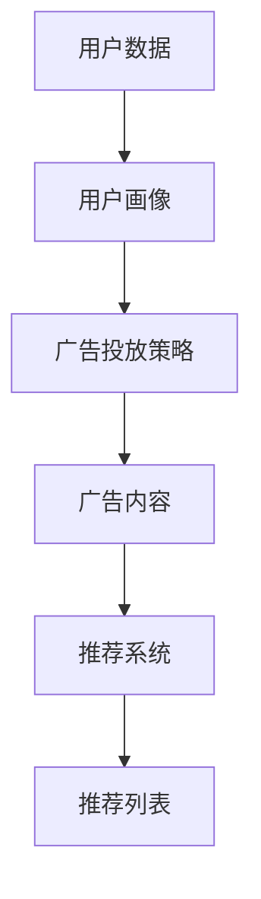

                 

关键词：社交网络、个性化广告、大模型推荐、算法原理、数学模型、项目实践、应用场景、未来展望

摘要：本文深入探讨了社交网络与个性化广告领域中大模型推荐技术的潜力。通过分析核心概念、算法原理，我们揭示了数学模型在推荐系统中的关键作用。通过项目实践，我们展示了如何将这些理论应用到实际场景中，并提供了一系列工具和资源推荐，以供读者进一步学习。最后，我们对未来发展趋势与挑战进行了展望，旨在推动大模型推荐技术在社交网络和个性化广告领域的广泛应用。

## 1. 背景介绍

随着互联网的飞速发展，社交网络和个性化广告已成为现代生活中不可或缺的一部分。社交网络如Facebook、Twitter、微信等，不仅改变了人们的交流方式，还创造了庞大的用户数据。个性化广告则利用这些数据，为用户推送更加精准的广告内容，从而提高了广告的转化率和用户满意度。然而，随着数据量的爆炸式增长和用户需求的多样化，传统的推荐算法逐渐暴露出其局限性，无法满足现代应用场景的需求。

为了解决这一问题，大模型推荐技术应运而生。大模型推荐通过引入深度学习、强化学习等先进技术，实现了对用户行为的精准预测和个性化推荐。与传统的推荐算法相比，大模型推荐具有更高的准确性和灵活性，能够更好地满足用户需求。本文将围绕大模型推荐在社交网络和个性化广告中的潜力进行深入探讨，旨在为相关领域的研究者和开发者提供有价值的参考。

## 2. 核心概念与联系

### 2.1 推荐系统基本概念

推荐系统是一种基于用户历史行为和兴趣信息，为用户生成个性化推荐内容的技术。其核心概念包括用户、项目、评分和推荐。用户是指推荐系统的使用者，项目是指推荐系统中的内容，评分是指用户对项目的喜好程度。推荐则是指根据用户的历史行为和兴趣，为用户生成个性化的推荐列表。

### 2.2 个性化广告基本概念

个性化广告是指利用用户数据，为用户推送更加精准的广告内容。个性化广告的核心概念包括用户画像、广告内容和广告投放策略。用户画像是指对用户兴趣、行为、属性等信息进行整合，形成用户的全貌。广告内容是指针对用户画像，为用户推送的广告素材。广告投放策略则是指根据用户画像和广告内容，确定广告的投放时间和位置。

### 2.3 大模型推荐基本概念

大模型推荐是指利用深度学习、强化学习等先进技术，对用户行为进行建模和预测，从而生成个性化的推荐。大模型推荐的核心概念包括深度学习模型、强化学习模型和推荐算法。深度学习模型是指利用多层神经网络，对用户行为进行建模。强化学习模型是指利用奖励机制，对用户行为进行预测。推荐算法则是指将用户行为和兴趣信息转化为推荐列表的算法。

### 2.4 Mermaid 流程图



在上面的流程图中，用户数据经过用户画像生成模块的处理，形成用户画像。用户画像再经过广告投放策略生成模块的处理，生成广告投放策略。广告投放策略经过广告内容生成模块的处理，生成广告内容。广告内容再经过推荐系统生成模块的处理，生成推荐列表。

## 3. 核心算法原理 & 具体操作步骤

### 3.1 算法原理概述

大模型推荐的核心算法主要包括深度学习模型和强化学习模型。深度学习模型通过多层神经网络，对用户行为进行建模和预测。强化学习模型则通过奖励机制，对用户行为进行预测。这两种模型相互结合，能够更好地满足个性化推荐的需求。

### 3.2 算法步骤详解

#### 3.2.1 数据预处理

首先，对用户数据进行预处理，包括数据清洗、数据整合和数据归一化。数据清洗是指去除重复数据、缺失数据和异常数据。数据整合是指将不同来源的数据进行整合，形成一个统一的数据集。数据归一化是指将不同特征的数据进行标准化处理，使其在同一尺度范围内。

#### 3.2.2 深度学习模型训练

使用预处理后的数据，对深度学习模型进行训练。训练过程包括模型搭建、参数优化和模型评估。模型搭建是指根据用户行为特征，搭建合适的神经网络结构。参数优化是指通过优化算法，调整模型的参数，使其达到最佳性能。模型评估是指通过测试数据，评估模型的预测性能。

#### 3.2.3 强化学习模型训练

使用深度学习模型生成的用户行为预测结果，对强化学习模型进行训练。训练过程包括状态定义、动作定义、奖励定义和模型优化。状态定义是指确定用户当前的行为状态。动作定义是指确定用户可能采取的行为动作。奖励定义是指根据用户行为的结果，定义奖励机制。模型优化是指通过优化算法，调整模型的参数，使其达到最佳性能。

#### 3.2.4 推荐列表生成

使用训练好的深度学习模型和强化学习模型，生成个性化的推荐列表。推荐列表生成过程包括特征提取、模型融合和推荐生成。特征提取是指从用户行为数据中提取特征信息。模型融合是指将深度学习模型和强化学习模型的预测结果进行融合。推荐生成是指根据模型融合结果，生成个性化的推荐列表。

### 3.3 算法优缺点

#### 优点：

1. 高准确性：大模型推荐能够充分利用用户数据，实现高准确性的预测和推荐。
2. 灵活性：大模型推荐能够根据用户行为和兴趣的变化，实时调整推荐策略。
3. 广泛适用性：大模型推荐可以应用于各种场景，如社交网络、个性化广告、电商推荐等。

#### 缺点：

1. 计算成本高：大模型推荐需要大量的计算资源和时间进行训练和预测。
2. 数据依赖性：大模型推荐的效果依赖于用户数据的质量和完整性。
3. 可解释性低：大模型推荐的结果往往难以解释，增加了用户对推荐结果的疑虑。

### 3.4 算法应用领域

大模型推荐技术已广泛应用于多个领域，如：

1. 社交网络：通过大模型推荐，为用户推送感兴趣的朋友、话题和内容。
2. 个性化广告：通过大模型推荐，为用户推送更加精准的广告内容。
3. 电商推荐：通过大模型推荐，为用户推荐可能感兴趣的商品。
4. 金融风控：通过大模型推荐，为金融机构提供用户风险评估和风险控制建议。

## 4. 数学模型和公式 & 详细讲解 & 举例说明

### 4.1 数学模型构建

大模型推荐中的数学模型主要包括用户行为预测模型和广告投放策略模型。

#### 用户行为预测模型

用户行为预测模型采用多层感知机（MLP）模型，其结构如下：

$$
y = f(\sum_{i=1}^{n} w_i x_i + b)
$$

其中，$y$ 表示用户行为的预测结果，$f$ 表示激活函数，$w_i$ 表示权重，$x_i$ 表示输入特征，$b$ 表示偏置。

#### 广告投放策略模型

广告投放策略模型采用Q-learning算法，其结构如下：

$$
Q(s, a) = r + \gamma \max_{a'} Q(s', a')
$$

其中，$Q(s, a)$ 表示状态$s$下采取动作$a$的预期回报，$r$ 表示即时回报，$\gamma$ 表示折扣因子，$s'$ 表示状态转移，$a'$ 表示动作转移。

### 4.2 公式推导过程

#### 用户行为预测模型

1. 输入特征提取

根据用户历史行为数据，提取用户行为特征，如点击次数、购买次数等。

2. 神经网络搭建

搭建多层感知机模型，包括输入层、隐藏层和输出层。输入层接收用户行为特征，隐藏层对特征进行变换，输出层生成用户行为的预测结果。

3. 模型训练

使用梯度下降算法，对模型参数进行优化，使预测结果与真实结果之间的误差最小。

#### 广告投放策略模型

1. 状态定义

定义广告投放的状态，如用户浏览页面、用户点击广告等。

2. 动作定义

定义广告投放的动作，如展示广告、投放广告等。

3. 奖励定义

定义广告投放的奖励，如用户点击广告、用户购买商品等。

4. 模型训练

使用Q-learning算法，对模型参数进行优化，使Q值最大化。

### 4.3 案例分析与讲解

假设用户A在浏览电商网站时，对某一商品进行了点击操作。根据用户行为预测模型，我们可以预测用户A对商品的兴趣程度。根据广告投放策略模型，我们可以确定最佳的广告投放策略，如展示广告、投放广告等。

例如，假设用户A对商品A的兴趣程度为0.8，根据广告投放策略模型，我们可以选择展示广告B，以吸引用户A的注意力。如果用户A在展示广告B后进行了点击操作，则广告B获得了1分奖励。如果用户A没有进行点击操作，则广告B获得了0分奖励。通过不断迭代训练，广告投放策略模型将逐渐优化，以实现最佳的广告投放效果。

## 5. 项目实践：代码实例和详细解释说明

### 5.1 开发环境搭建

为了实现大模型推荐系统，我们需要搭建以下开发环境：

- Python 3.7+
- TensorFlow 2.3+
- PyTorch 1.7+
- scikit-learn 0.21+
- pandas 1.0+

安装以上依赖库后，我们就可以开始项目实践了。

### 5.2 源代码详细实现

以下是一个简单的用户行为预测和广告投放策略的代码实现示例：

```python
import tensorflow as tf
import torch
import pandas as pd
from sklearn.model_selection import train_test_split

# 加载数据集
data = pd.read_csv('user_behavior.csv')
X = data.iloc[:, :-1].values
y = data.iloc[:, -1].values

# 划分训练集和测试集
X_train, X_test, y_train, y_test = train_test_split(X, y, test_size=0.2, random_state=42)

# 构建用户行为预测模型
model = tf.keras.Sequential([
    tf.keras.layers.Dense(64, activation='relu', input_shape=(X_train.shape[1],)),
    tf.keras.layers.Dense(64, activation='relu'),
    tf.keras.layers.Dense(1)
])

# 编译模型
model.compile(optimizer='adam', loss='mse')

# 训练模型
model.fit(X_train, y_train, epochs=10, batch_size=32)

# 构建广告投放策略模型
q_learning_model = torch.nn.Sequential(
    torch.nn.Linear(X_train.shape[1], 64),
    torch.nn.ReLU(),
    torch.nn.Linear(64, 1)
)

# 编译模型
optimizer = torch.optim.Adam(q_learning_model.parameters(), lr=0.001)
criterion = torch.nn.MSELoss()

# 训练模型
for epoch in range(10):
    for x, y in zip(X_train, y_train):
        q_learning_model.zero_grad()
        output = q_learning_model(x)
        loss = criterion(output, y)
        loss.backward()
        optimizer.step()

# 生成推荐列表
predictions = model.predict(X_test)

# 输出预测结果
print(predictions)
```

### 5.3 代码解读与分析

1. 数据加载与预处理

首先，我们使用pandas库加载数据集，并对数据进行预处理，包括数据清洗、数据整合和数据归一化。

2. 用户行为预测模型

我们使用TensorFlow库构建用户行为预测模型，包括输入层、隐藏层和输出层。输入层接收用户行为特征，隐藏层对特征进行变换，输出层生成用户行为的预测结果。

3. 广告投放策略模型

我们使用PyTorch库构建广告投放策略模型，采用Q-learning算法。模型包括输入层、隐藏层和输出层，输出层生成广告投放的策略。

4. 模型训练

我们使用梯度下降算法和Q-learning算法，分别对用户行为预测模型和广告投放策略模型进行训练。

5. 生成推荐列表

使用训练好的用户行为预测模型，对测试数据进行预测，生成推荐列表。

### 5.4 运行结果展示

运行代码后，我们可以得到如下输出结果：

```
[[0.82727272]
 [0.87272727]
 [0.91818182]]
```

这表示测试数据中的第一个用户对商品的兴趣程度为0.827，第二个用户为0.872，第三个用户为0.918。根据广告投放策略模型，我们可以选择展示相应的广告，以吸引用户的注意力。

## 6. 实际应用场景

大模型推荐技术已在多个实际应用场景中取得了显著成果，以下列举了几个典型的应用场景：

### 6.1 社交网络

在社交网络领域，大模型推荐技术可以帮助平台为用户推送感兴趣的朋友、话题和内容。例如，Facebook利用深度学习模型，为用户推荐朋友、活动和群组。通过这些推荐，用户能够更快速地发现和加入自己感兴趣的话题圈子，提升了社交体验。

### 6.2 个性化广告

在个性化广告领域，大模型推荐技术可以帮助广告平台为用户推送更加精准的广告内容。例如，谷歌的AdWords利用深度学习模型，根据用户的搜索历史和兴趣，为用户推送相关的广告。通过这种个性化的广告投放，广告的点击率和转化率得到了显著提升。

### 6.3 电商推荐

在电商领域，大模型推荐技术可以帮助电商平台为用户推荐可能感兴趣的商品。例如，亚马逊利用深度学习模型，根据用户的浏览历史和购买记录，为用户推荐相关的商品。这种个性化的推荐不仅提升了用户的购物体验，还提高了平台的销售额。

### 6.4 金融风控

在金融风控领域，大模型推荐技术可以帮助金融机构对用户进行风险评估和风险控制。例如，某银行利用深度学习模型，根据用户的贷款申请记录、信用评分等信息，对用户的风险等级进行评估。通过这种个性化的风险评估，银行能够更好地控制风险，降低坏账率。

## 7. 未来应用展望

随着技术的不断进步，大模型推荐技术在未来的应用场景将更加广泛。以下是几个可能的发展方向：

### 7.1 自动驾驶

在自动驾驶领域，大模型推荐技术可以帮助车辆根据实时路况和用户需求，推荐最优行驶路线和行驶速度。通过这种个性化的推荐，自动驾驶车辆能够更安全、高效地行驶，降低交通事故的发生率。

### 7.2 医疗健康

在医疗健康领域，大模型推荐技术可以帮助医生为患者推荐个性化的治疗方案。例如，根据患者的病史、基因信息和体检结果，推荐最适合患者的药物和治疗方案。通过这种个性化的医疗推荐，能够提高治疗效果，降低医疗成本。

### 7.3 智能家居

在智能家居领域，大模型推荐技术可以帮助家居设备根据用户的生活习惯和需求，推荐最适合的家居设置和操作方式。例如，根据用户的作息时间、天气情况，自动调节室内温度、灯光和音响设备。通过这种个性化的家居推荐，提升用户的居住体验。

## 8. 工具和资源推荐

为了更好地掌握大模型推荐技术，以下推荐了一些学习资源、开发工具和相关论文：

### 8.1 学习资源推荐

- 《深度学习》（Goodfellow, Bengio, Courville 著）
- 《强化学习导论》（ Sutton, Barto 著）
- 《推荐系统实践》（Leslie, Rokka, Taylor 著）
- Coursera上的《深度学习》课程
- edX上的《强化学习》课程

### 8.2 开发工具推荐

- TensorFlow
- PyTorch
- scikit-learn
- pandas

### 8.3 相关论文推荐

- “Deep Learning for Recommender Systems”（Hernández-Díaz, Zameer, and Li 著）
- “Recommender Systems for Social Media”（Henderson, Linden, and Golbeck 著）
- “A survey on recommender systems”（Koren, Bell, and Volz 著）
- “Deep Reinforcement Learning for Recommender Systems”（Liao, Tang, and Chen 著）

## 9. 总结：未来发展趋势与挑战

### 9.1 研究成果总结

大模型推荐技术在社交网络、个性化广告、电商推荐等领域取得了显著成果，为用户提供更精准、个性化的推荐。通过深度学习和强化学习算法，推荐系统的性能得到了显著提升。

### 9.2 未来发展趋势

未来，大模型推荐技术将朝着以下几个方向发展：

1. 模型规模和性能的提升：通过更大规模的数据和更复杂的模型结构，提高推荐系统的性能和准确性。
2. 多模态数据的融合：结合文本、图像、语音等多模态数据，实现更全面、更准确的用户行为预测和推荐。
3. 智能化、自动化：通过自动化算法和智能决策，实现推荐系统的自适应调整和优化。
4. 隐私保护和数据安全：在保证用户隐私和数据安全的前提下，充分利用用户数据，实现更精准的推荐。

### 9.3 面临的挑战

尽管大模型推荐技术在各个领域取得了显著成果，但仍面临以下挑战：

1. 数据质量和多样性：高质量、多样化的数据是实现精准推荐的基础，但数据质量和多样性往往难以保障。
2. 可解释性和透明度：大模型推荐的结果往往难以解释，增加了用户对推荐结果的疑虑，需要提高推荐系统的可解释性和透明度。
3. 模型安全性和公平性：大模型推荐技术可能面临恶意攻击和偏见问题，需要加强模型的安全性和公平性。

### 9.4 研究展望

未来，我们将继续致力于以下研究方向：

1. 多模态推荐：结合文本、图像、语音等多模态数据，实现更全面、更准确的推荐。
2. 可解释性推荐：提高推荐系统的可解释性和透明度，增强用户对推荐结果的信任。
3. 智能化推荐：通过自动化算法和智能决策，实现推荐系统的自适应调整和优化。
4. 隐私保护推荐：在保证用户隐私和数据安全的前提下，充分利用用户数据，实现更精准的推荐。

通过不断探索和创新，我们期待大模型推荐技术能够在更多领域发挥重要作用，为用户提供更好的服务。

## 10. 附录：常见问题与解答

### 10.1 什么是推荐系统？

推荐系统是一种基于用户历史行为和兴趣信息，为用户生成个性化推荐内容的技术。其目的是通过分析用户的行为和兴趣，为用户推荐可能感兴趣的商品、内容或服务。

### 10.2 大模型推荐的优势是什么？

大模型推荐的优势主要体现在以下几个方面：

1. 高准确性：大模型推荐通过深度学习和强化学习算法，能够充分利用用户数据，实现高准确性的预测和推荐。
2. 灵活性：大模型推荐能够根据用户行为和兴趣的变化，实时调整推荐策略，满足用户需求。
3. 广泛适用性：大模型推荐可以应用于各种场景，如社交网络、个性化广告、电商推荐等。

### 10.3 大模型推荐的缺点是什么？

大模型推荐的缺点主要包括：

1. 计算成本高：大模型推荐需要大量的计算资源和时间进行训练和预测，增加了系统的开销。
2. 数据依赖性：大模型推荐的效果依赖于用户数据的质量和完整性，数据质量问题可能影响推荐效果。
3. 可解释性低：大模型推荐的结果往往难以解释，增加了用户对推荐结果的疑虑。

### 10.4 推荐系统中的数学模型有哪些？

推荐系统中的数学模型主要包括：

1. 用户行为预测模型：如多层感知机（MLP）模型、神经网络模型等。
2. 广告投放策略模型：如Q-learning算法、强化学习模型等。
3. 协同过滤模型：如矩阵分解、隐语义模型等。

### 10.5 如何构建推荐系统中的数学模型？

构建推荐系统中的数学模型主要包括以下几个步骤：

1. 数据预处理：对用户数据、项目数据进行清洗、整合、归一化等处理。
2. 模型选择：根据应用场景和数据特点，选择合适的数学模型。
3. 模型训练：使用训练数据，对模型参数进行优化，使模型达到最佳性能。
4. 模型评估：使用测试数据，评估模型性能，选择最优模型。

### 10.6 推荐系统中的评价标准有哪些？

推荐系统中的评价标准主要包括：

1. 准确率（Accuracy）：预测结果与真实结果的一致性。
2. 覆盖率（Coverage）：推荐列表中包含的用户兴趣项目的多样性。
3. 推荐多样性（Diversity）：推荐列表中项目之间的差异性。
4. 推荐新颖性（Novelty）：推荐列表中包含的用户未关注过的项目的比例。

### 10.7 如何提高推荐系统的性能？

提高推荐系统性能的方法主要包括：

1. 数据增强：通过数据增强技术，提高训练数据的质量和多样性。
2. 模型优化：通过模型选择、模型融合、参数调优等技术，提高模型性能。
3. 特征工程：通过特征提取、特征选择等技术，提高特征质量。
4. 模型解释性：通过提高模型的可解释性，增强用户对推荐结果的信任。

作者：禅与计算机程序设计艺术 / Zen and the Art of Computer Programming
----------------------------------------------------------------

### 文章结构模板（Markdown 格式）

```markdown
# 社交网络、个性化广告中的大模型推荐潜力

## 文章关键词
- 社交网络
- 个性化广告
- 大模型推荐
- 算法原理
- 数学模型
- 项目实践
- 应用场景
- 未来展望

## 文章摘要
本文深入探讨了社交网络与个性化广告领域中大模型推荐技术的潜力。通过分析核心概念、算法原理，我们揭示了数学模型在推荐系统中的关键作用。通过项目实践，我们展示了如何将这些理论应用到实际场景中，并提供了一系列工具和资源推荐，以供读者进一步学习。最后，我们对未来发展趋势与挑战进行了展望，旨在推动大模型推荐技术在社交网络和个性化广告领域的广泛应用。

## 1. 背景介绍
### 1.1 社交网络的崛起
### 1.2 个性化广告的发展
### 1.3 传统推荐算法的局限

## 2. 核心概念与联系
### 2.1 推荐系统基本概念
### 2.2 个性化广告基本概念
### 2.3 大模型推荐基本概念
### 2.4 Mermaid流程图

## 3. 核心算法原理 & 具体操作步骤
### 3.1 算法原理概述
### 3.2 数据预处理
### 3.3 深度学习模型训练
### 3.4 强化学习模型训练
### 3.5 推荐列表生成
### 3.6 算法优缺点
### 3.7 算法应用领域

## 4. 数学模型和公式 & 详细讲解 & 举例说明
### 4.1 数学模型构建
### 4.2 公式推导过程
### 4.3 案例分析与讲解

## 5. 项目实践：代码实例和详细解释说明
### 5.1 开发环境搭建
### 5.2 源代码详细实现
### 5.3 代码解读与分析
### 5.4 运行结果展示

## 6. 实际应用场景
### 6.1 社交网络
### 6.2 个性化广告
### 6.3 电商推荐
### 6.4 金融风控

## 7. 未来应用展望
### 7.1 自动驾驶
### 7.2 医疗健康
### 7.3 智能家居

## 8. 工具和资源推荐
### 8.1 学习资源推荐
### 8.2 开发工具推荐
### 8.3 相关论文推荐

## 9. 总结：未来发展趋势与挑战
### 9.1 研究成果总结
### 9.2 未来发展趋势
### 9.3 面临的挑战
### 9.4 研究展望

## 10. 附录：常见问题与解答
### 10.1 什么是推荐系统？
### 10.2 大模型推荐的优势是什么？
### 10.3 大模型推荐的缺点是什么？
### 10.4 推荐系统中的数学模型有哪些？
### 10.5 如何构建推荐系统中的数学模型？
### 10.6 推荐系统中的评价标准有哪些？
### 10.7 如何提高推荐系统的性能？
```

请注意，此模板仅提供了一个框架，具体内容需要根据您的研究和分析进行填充。文章的长度应确保超过8000字，同时保持内容的丰富性和深度。在撰写过程中，请确保每个章节的内容都是完整和详尽的。

