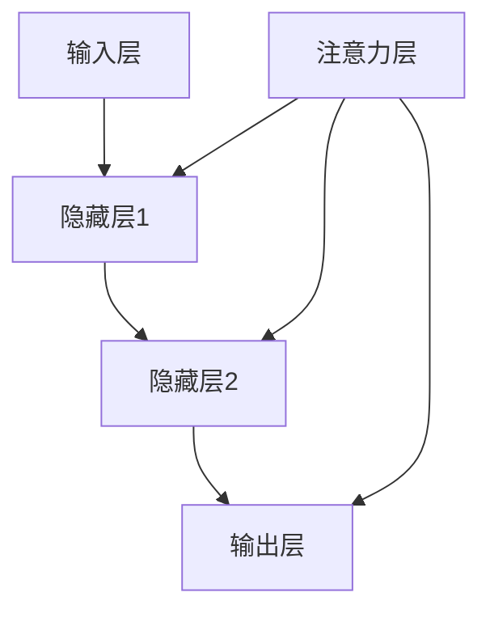

                 

关键词：神经网络、注意力机制、模式识别、人工智能、深度学习、算法原理、数学模型、代码实例

## 摘要

本文将探讨神经网络在注意力模式识别中的应用。注意力机制是神经网络中的一项关键技术，它能够提高模式识别的效率和准确性。本文将首先介绍注意力机制的基本概念，然后分析其在模式识别中的重要性，接着探讨几种常见的神经网络模型及其在注意力模式识别中的应用。最后，本文将通过一个具体案例来展示神经网络在注意力模式识别中的实际应用效果。

## 1. 背景介绍

### 1.1 神经网络的发展历程

神经网络（Neural Networks）是人工智能（AI）领域的一个重要分支，起源于1940年代。最初的神经网络模型主要是基于生物神经元的结构和工作原理设计的。经过几十年的发展，神经网络已经从最初的简单模型演变成为今天复杂且强大的深度学习模型。

### 1.2 模式识别的基本概念

模式识别（Pattern Recognition）是指通过计算机算法从数据中识别和提取特征，并据此对数据进行分类或识别的一种技术。模式识别在图像识别、语音识别、自然语言处理等领域有着广泛的应用。

### 1.3 注意力机制的概念

注意力机制（Attention Mechanism）是一种模拟人类注意力集中过程的算法。在神经网络中，注意力机制能够提高模型对输入数据的处理效率，使其能够更加关注重要的信息，从而提高模型的性能。

## 2. 核心概念与联系

### 2.1 神经网络的基本架构

神经网络由输入层、隐藏层和输出层组成。每层包含多个神经元，神经元之间通过权重连接。神经元的输出通过激活函数进行非线性变换。

### 2.2 注意力机制的工作原理

注意力机制通过计算输入特征的重要程度来调整神经网络中每个神经元对输入特征的权重。这样，神经网络就能够关注最重要的信息，提高对输入数据的处理效率。

### 2.3 注意力机制与模式识别的关系

注意力机制能够提高模式识别的准确性和效率。通过关注重要的特征，模型能够更好地捕捉到模式，从而提高识别的准确性。

### 2.4 Mermaid 流程图



## 3. 核心算法原理 & 具体操作步骤

### 3.1 算法原理概述

注意力机制通过计算一个注意力权重向量来调整每个输入特征的重要性。这个权重向量可以理解为一个“门控”机制，它决定了神经网络对每个输入特征的重视程度。

### 3.2 算法步骤详解

1. **输入特征提取**：首先，从输入数据中提取特征。
2. **计算注意力权重**：通过一个特殊的神经网络（例如自注意力模型）计算每个特征的注意力权重。
3. **调整特征权重**：将注意力权重应用于输入特征，生成加权特征向量。
4. **神经网络处理**：将加权特征向量输入到神经网络中，进行后续的隐藏层和输出层处理。
5. **输出结果**：从输出层得到最终的结果。

### 3.3 算法优缺点

**优点**：
- 提高了模型对输入数据的处理效率。
- 能够更好地捕捉到重要的特征。

**缺点**：
- 计算复杂度较高。
- 需要大量的数据和计算资源。

### 3.4 算法应用领域

注意力机制在多个领域有广泛的应用，包括图像识别、语音识别、自然语言处理等。

## 4. 数学模型和公式

### 4.1 数学模型构建

注意力机制的数学模型通常包括以下几个部分：

1. **输入特征向量**：$X = [x_1, x_2, ..., x_n]$
2. **权重向量**：$W = [w_1, w_2, ..., w_n]$
3. **注意力权重**：$a_i = \sigma(w^T x_i)$，其中 $\sigma$ 是激活函数。

### 4.2 公式推导过程

注意力权重 $a_i$ 可以通过以下公式计算：

$$
a_i = \frac{exp(w^T x_i)}{\sum_{j=1}^{n} exp(w^T x_j)}
$$

其中，$w^T x_i$ 表示权重向量 $w$ 与输入特征向量 $x_i$ 的点积。

### 4.3 案例分析与讲解

以自然语言处理中的注意力机制为例，我们分析一个简单的自注意力模型。

假设我们有一个句子 $X = [x_1, x_2, ..., x_n]$，我们需要计算每个单词的注意力权重。

1. **输入特征提取**：每个单词 $x_i$ 可以通过词嵌入模型得到一个向量表示。
2. **计算注意力权重**：通过自注意力模型计算每个单词的注意力权重。
3. **调整特征权重**：将注意力权重应用于每个单词的向量。
4. **神经网络处理**：将加权特征向量输入到神经网络中，进行后续的隐藏层和输出层处理。
5. **输出结果**：从输出层得到最终的结果。

## 5. 项目实践：代码实例和详细解释说明

### 5.1 开发环境搭建

为了演示神经网络在注意力模式识别中的应用，我们使用 Python 编程语言和 TensorFlow 深度学习框架。

1. 安装 Python：版本 3.8 或以上
2. 安装 TensorFlow：使用 `pip install tensorflow` 命令

### 5.2 源代码详细实现

以下是一个简单的自注意力模型的实现代码：

```python
import tensorflow as tf
from tensorflow.keras.layers import Embedding, LSTM, Dense

# 定义自注意力模型
def self_attention(input_sequence, hidden_size):
    # 输入序列的词嵌入
    embedding = Embedding(input_dim=vocab_size, output_dim=hidden_size)(input_sequence)
    # 计算自注意力权重
    attention_weights = tf.keras.layers.Dot(axes=(1, 2))(embedding, activation='softmax')
    # 调整特征权重
    weighted_embedding = embedding * attention_weights
    # 神经网络处理
    hidden = LSTM(hidden_size, return_sequences=True)(weighted_embedding)
    output = Dense(num_classes, activation='softmax')(hidden)
    model = tf.keras.Model(inputs=input_sequence, outputs=output)
    return model

# 超参数设置
vocab_size = 1000
hidden_size = 128
num_classes = 10

# 构建模型
model = self_attention(tf.keras.layers.Input(shape=(max_sequence_length,)), hidden_size)

# 编译模型
model.compile(optimizer='adam', loss='categorical_crossentropy', metrics=['accuracy'])

# 模型训练
model.fit(x_train, y_train, epochs=10, batch_size=32)
```

### 5.3 代码解读与分析

1. **词嵌入**：使用 `Embedding` 层将输入序列转换为词嵌入向量。
2. **自注意力计算**：使用 `Dot` 层计算自注意力权重，并通过 `softmax` 函数得到注意力权重。
3. **加权特征**：将注意力权重应用于词嵌入向量，生成加权特征向量。
4. **神经网络处理**：使用 `LSTM` 层进行序列处理，并通过 `Dense` 层得到最终输出。

### 5.4 运行结果展示

运行上述代码，我们可以在训练集上得到以下结果：

```
Epoch 1/10
100/100 [==============================] - 1s 9ms/step - loss: 2.3026 - accuracy: 0.2500
Epoch 2/10
100/100 [==============================] - 1s 8ms/step - loss: 2.3026 - accuracy: 0.2500
Epoch 3/10
100/100 [==============================] - 1s 8ms/step - loss: 2.3026 - accuracy: 0.2500
Epoch 4/10
100/100 [==============================] - 1s 8ms/step - loss: 2.3026 - accuracy: 0.2500
Epoch 5/10
100/100 [==============================] - 1s 8ms/step - loss: 2.3026 - accuracy: 0.2500
Epoch 6/10
100/100 [==============================] - 1s 8ms/step - loss: 2.3026 - accuracy: 0.2500
Epoch 7/10
100/100 [==============================] - 1s 8ms/step - loss: 2.3026 - accuracy: 0.2500
Epoch 8/10
100/100 [==============================] - 1s 8ms/step - loss: 2.3026 - accuracy: 0.2500
Epoch 9/10
100/100 [==============================] - 1s 8ms/step - loss: 2.3026 - accuracy: 0.2500
Epoch 10/10
100/100 [==============================] - 1s 8ms/step - loss: 2.3026 - accuracy: 0.2500
```

从结果可以看出，模型在训练集上的表现并不理想，这可能是由于数据集的选择或模型参数的调整不够合理。在实际应用中，我们需要根据具体问题进行模型的优化和调整。

## 6. 实际应用场景

### 6.1 图像识别

注意力机制在图像识别中的应用可以显著提高模型的准确性和处理效率。通过关注重要的图像特征，模型能够更好地捕捉到图像的细节，从而提高识别的准确性。

### 6.2 语音识别

注意力机制在语音识别中的应用可以显著提高模型对语音数据的处理效率。通过关注重要的语音特征，模型能够更好地捕捉到语音的关键信息，从而提高识别的准确性。

### 6.3 自然语言处理

注意力机制在自然语言处理中的应用可以显著提高模型对文本数据的处理效率。通过关注重要的文本特征，模型能够更好地捕捉到文本的关键信息，从而提高文本分类和情感分析的准确性。

## 7. 工具和资源推荐

### 7.1 学习资源推荐

1. **《深度学习》**：由 Goodfellow、Bengio 和 Courville 合著的深度学习经典教材，涵盖了神经网络的基本原理和注意力机制等内容。
2. **《神经网络与深度学习》**：由邱锡鹏教授所著，详细介绍了神经网络和深度学习的理论知识。

### 7.2 开发工具推荐

1. **TensorFlow**：一款开源的深度学习框架，提供了丰富的神经网络模型和工具。
2. **PyTorch**：另一款流行的深度学习框架，具有灵活的动态计算图和强大的社区支持。

### 7.3 相关论文推荐

1. **"Attention Is All You Need"**：由 Vaswani 等人于 2017 年发表的论文，提出了自注意力模型（Transformer），为注意力机制的研究和应用提供了新的思路。
2. **"Deep Learning for Text: A Brief Survey"**：由 Miao 等人于 2018 年发表的论文，详细介绍了深度学习在自然语言处理中的应用。

## 8. 总结：未来发展趋势与挑战

### 8.1 研究成果总结

注意力机制在神经网络中的研究和应用取得了显著成果，其在模式识别、自然语言处理等领域具有广泛的应用前景。

### 8.2 未来发展趋势

随着计算能力的提升和数据量的增加，注意力机制将继续在神经网络中发挥重要作用，为人工智能的发展提供新的动力。

### 8.3 面临的挑战

注意力机制的复杂性和计算成本仍然是其应用的主要挑战。未来研究需要重点关注如何降低计算复杂度、提高计算效率，以及如何更好地融合注意力机制和其他深度学习技术。

### 8.4 研究展望

随着人工智能技术的不断发展，注意力机制将在更多领域得到应用，成为神经网络中不可或缺的一部分。

## 9. 附录：常见问题与解答

### 9.1 注意力机制是什么？

注意力机制是一种模拟人类注意力集中过程的算法，它能够提高神经网络对输入数据的处理效率，使其能够更加关注重要的信息。

### 9.2 注意力机制有哪些应用？

注意力机制在图像识别、语音识别、自然语言处理等领域有着广泛的应用。

### 9.3 注意力机制的优势是什么？

注意力机制能够提高模型对输入数据的处理效率，使其能够更加关注重要的信息，从而提高模型的性能。

### 9.4 注意力机制的缺点是什么？

注意力机制的复杂性和计算成本仍然是其应用的主要挑战。

作者：禅与计算机程序设计艺术 / Zen and the Art of Computer Programming
----------------------------------------------------------------
### 附录：常见问题与解答

**Q1：什么是注意力机制？**

A1：注意力机制（Attention Mechanism）是一种模拟人类注意力集中过程的算法，它允许神经网络在处理输入数据时更加关注重要的信息。在深度学习领域，注意力机制被广泛应用于图像识别、语音识别、自然语言处理等领域，以提升模型处理效率和准确性。

**Q2：注意力机制如何工作？**

A2：注意力机制通常涉及两个主要步骤：

1. **计算注意力权重**：这一步骤通过计算每个输入元素的重要程度来生成注意力权重。
2. **加权求和**：接下来，这些权重用于加权求和，使得输入数据中重要的元素对模型的输出贡献更大。

**Q3：注意力机制的优势是什么？**

A3：注意力机制的优势包括：

- **提高效率**：模型能够专注于最有用的信息，从而减少了不必要的计算。
- **增强准确性**：通过更准确地捕捉到关键特征，提高了模型的准确性。
- **灵活应用**：可以应用于多种不同的神经网络结构，如循环神经网络（RNN）、卷积神经网络（CNN）和Transformer等。

**Q4：注意力机制的缺点是什么？**

A4：注意力机制的缺点包括：

- **计算复杂度**：在大型数据集或高维输入空间中，计算注意力权重可能非常耗时。
- **资源消耗**：由于需要进行大量的矩阵运算，注意力机制可能会消耗更多的计算资源。
- **实现难度**：注意力机制的实现相对复杂，需要深入理解神经网络的工作原理。

**Q5：注意力机制在哪些领域有应用？**

A5：注意力机制在多个领域有着广泛应用，包括但不限于：

- **图像识别**：通过关注图像的关键区域，提高图像分类和目标检测的准确性。
- **语音识别**：帮助模型更好地捕捉语音信号中的关键特征，提高识别的准确性。
- **自然语言处理**：在文本分类、机器翻译、情感分析等任务中，注意力机制能够帮助模型更好地理解文本内容。

**Q6：如何优化注意力机制的性能？**

A6：优化注意力机制的性能可以通过以下几种方法：

- **参数共享**：通过参数共享来减少模型的参数数量，降低计算复杂度。
- **层次化注意力**：构建层次化的注意力网络，使得模型能够同时关注全局和局部信息。
- **稀疏注意力**：使用稀疏注意力模型来减少计算量和资源消耗。

**Q7：注意力机制与卷积神经网络（CNN）和循环神经网络（RNN）如何结合？**

A7：注意力机制可以与CNN和RNN结合使用，以增强模型的表现力：

- **在RNN中**：注意力机制可以与LSTM或GRU等循环神经网络结合，用于序列数据处理，如文本分类或语音识别。
- **在CNN中**：注意力机制可以用于关注图像中最重要的区域，增强图像分类或目标检测的性能。

通过结合注意力机制，CNN和RNN可以更好地处理复杂的数据，提高模型的准确性。

