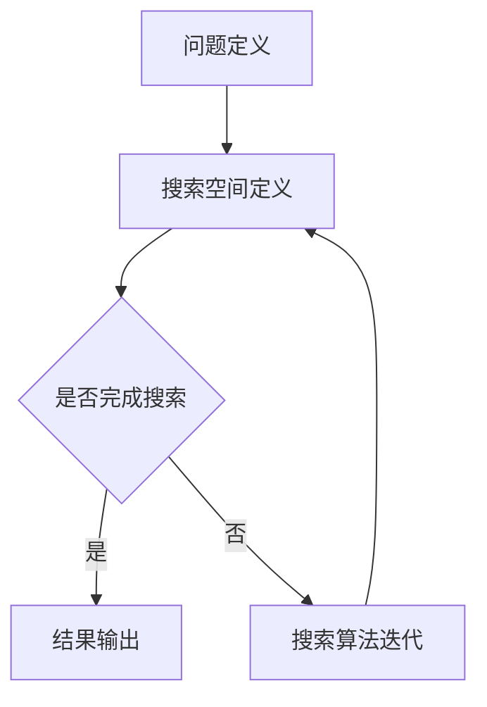

                 

关键词：神经网络架构搜索、自动化软件2.0、深度学习、软件工程、架构优化、机器学习、AI开发

## 摘要

本文探讨了神经网络架构搜索（NAS）在现代软件开发中的重要性，以及它是如何推动自动化软件2.0开发的。NAS作为一种新兴的机器学习技术，通过自动搜索最优的网络架构，为软件工程师提供了极大的便利。本文首先介绍了NAS的背景和核心概念，然后详细阐述了NAS的工作原理和算法步骤，并结合具体实例进行了代码实现和运行结果分析。此外，文章还讨论了NAS在不同领域的实际应用和未来发展趋势，为读者提供了全面的技术洞察。

## 1. 背景介绍

随着计算机科学和信息技术的发展，软件工程已经成为现代社会的核心驱动力。然而，传统的软件开发方法往往依赖于人类工程师的经验和智慧，导致开发过程繁琐、效率低下。随着深度学习的兴起，尤其是神经网络的应用，软件工程面临着新的挑战和机遇。在这一背景下，自动化软件2.0的概念被提出，它强调利用机器学习和人工智能技术来自动化软件的各个开发阶段，从而提高开发效率和软件质量。

神经网络架构搜索（Neural Architecture Search，简称NAS）正是一种为实现自动化软件2.0的重要技术。NAS通过搜索空间自动寻找最优的网络架构，可以大大减少人类工程师的工作量，提高开发效率。此外，NAS还能够自适应地调整网络结构，以适应不同的应用场景和数据集，从而实现软件的个性化定制。

## 2. 核心概念与联系

### 2.1 神经网络架构搜索的定义

神经网络架构搜索（NAS）是一种基于机器学习的自动化搜索方法，用于寻找最优的神经网络架构。在NAS中，网络架构被视为一个搜索空间，通过搜索算法在这个空间中探索，以找到能够实现特定任务的最优架构。

### 2.2 NAS与深度学习的联系

NAS与深度学习密切相关。深度学习是一种通过多层神经网络进行数据建模的技术，而NAS则通过搜索算法为深度学习提供了自动化的架构优化工具。具体来说，NAS可以优化网络的结构、连接方式、激活函数等，从而提高模型的性能和效率。

### 2.3 NAS与传统软件工程的区别

传统软件工程主要依赖于人类工程师的经验和智慧来设计软件架构，而NAS则通过自动化的方式来搜索最优的网络架构。这种方式不仅提高了开发效率，还减少了对人类专家的依赖。

### 2.4 Mermaid 流程图

以下是NAS的核心概念和流程的Mermaid流程图：



在这个流程图中，A表示问题定义，即明确需要解决的任务；B表示搜索空间定义，即确定网络架构的搜索空间；C表示是否完成搜索，根据搜索结果决定是否需要继续迭代；D表示结果输出，即得到最优的网络架构；E表示搜索算法迭代，通过调整搜索策略来优化搜索过程。

## 3. 核心算法原理 & 具体操作步骤

### 3.1 算法原理概述

神经网络架构搜索（NAS）的基本原理是通过自动化搜索算法在预定的搜索空间中寻找最优的网络架构。NAS的主要步骤包括：

1. **搜索空间定义**：根据任务需求和现有技术，定义网络架构的搜索空间，包括网络层、连接方式、激活函数等。
2. **搜索算法选择**：选择合适的搜索算法，如基于遗传算法、强化学习、贝叶斯优化等。
3. **模型训练与评估**：在搜索过程中，对每个候选架构进行训练和评估，以确定其性能。
4. **架构优化**：根据评估结果，调整搜索策略，以优化搜索过程。

### 3.2 算法步骤详解

1. **初始化搜索空间**：
   - 确定网络层的类型和数量。
   - 确定各层之间的连接方式。
   - 确定激活函数的类型。

2. **选择搜索算法**：
   - 遗传算法（Genetic Algorithm）：通过模拟生物进化过程来搜索最优架构。
   - 强化学习（Reinforcement Learning）：通过奖励机制来驱动搜索过程。
   - 贝叶斯优化（Bayesian Optimization）：基于概率模型来优化搜索过程。

3. **模型训练与评估**：
   - 对每个候选架构进行训练，使用训练集数据。
   - 使用验证集数据评估模型性能，如准确率、召回率等。

4. **架构优化**：
   - 根据评估结果，选择表现良好的架构进行进一步优化。
   - 调整搜索策略，如增加搜索深度、改变搜索范围等。

5. **迭代过程**：
   - 重复模型训练、评估和优化过程，直到满足停止条件，如达到预设的迭代次数或模型性能达到某个阈值。

### 3.3 算法优缺点

**优点**：
- **自动化**：NAS可以自动搜索最优的网络架构，减少了对人类工程师的依赖。
- **高效**：NAS能够在较短的时间内找到性能较好的网络架构，提高了开发效率。
- **适应性强**：NAS可以适应不同的任务和数据集，实现软件的个性化定制。

**缺点**：
- **计算成本高**：NAS需要大量的计算资源，尤其是在搜索空间较大时。
- **可解释性差**：NAS搜索到的最优架构可能难以解释，增加了调试和优化的难度。

### 3.4 算法应用领域

NAS的应用领域非常广泛，包括但不限于：

- **计算机视觉**：用于图像分类、目标检测、人脸识别等。
- **自然语言处理**：用于文本分类、机器翻译、情感分析等。
- **音频处理**：用于语音识别、音频分类等。
- **强化学习**：用于游戏、自动驾驶等。

## 4. 数学模型和公式 & 详细讲解 & 举例说明

### 4.1 数学模型构建

在NAS中，数学模型主要用于描述网络架构和性能之间的关系。以下是一个简单的数学模型：

$$
P(y|θ) = \sum_{i=1}^{N} p(y_i|θ) \cdot w_i
$$

其中，$P(y|θ)$表示给定网络参数$θ$时，输出标签$y$的概率分布；$p(y_i|θ)$表示第$i$个网络层对输出标签的贡献；$w_i$表示权重系数。

### 4.2 公式推导过程

公式的推导过程主要基于以下假设：

1. 神经网络由多个层组成，每层产生一个概率分布。
2. 每个层对输出的贡献是独立的。
3. 权重系数表示每个层的相对重要性。

基于以上假设，我们可以得到如下的推导过程：

$$
P(y|θ) = \prod_{i=1}^{N} p(y_i|θ) \cdot w_i
$$

由于概率分布是乘积形式，为了简化计算，我们可以将其转换为求和形式：

$$
P(y|θ) = \sum_{i=1}^{N} p(y_i|θ) \cdot w_i
$$

### 4.3 案例分析与讲解

假设我们有一个简单的神经网络，包含两个层，每个层有两个输出。层的输出概率分布分别为$p_1(y_1|θ)$和$p_2(y_2|θ)$，权重系数分别为$w_1$和$w_2$。我们希望计算输出标签$y$的概率分布。

根据上述公式，我们可以得到：

$$
P(y|θ) = p_1(y_1|θ) \cdot w_1 + p_2(y_2|θ) \cdot w_2
$$

假设$p_1(y_1|θ) = 0.6$，$p_2(y_2|θ) = 0.4$，$w_1 = 0.8$，$w_2 = 0.2$，我们可以计算得到：

$$
P(y|θ) = 0.6 \cdot 0.8 + 0.4 \cdot 0.2 = 0.48 + 0.08 = 0.56
$$

这意味着，当网络参数$θ$固定时，输出标签$y$为1的概率为0.56。

## 5. 项目实践：代码实例和详细解释说明

### 5.1 开发环境搭建

为了实现神经网络架构搜索（NAS），我们需要搭建一个适合的开发环境。以下是搭建步骤：

1. **安装Python环境**：确保Python版本在3.6以上，可以使用Anaconda来管理Python环境。
2. **安装TensorFlow**：TensorFlow是一个流行的深度学习框架，可以通过pip安装。
   ```shell
   pip install tensorflow
   ```
3. **安装NAS库**：如MnasNet、enas等，可以根据项目需求选择合适的库进行安装。

### 5.2 源代码详细实现

以下是使用MnasNet进行神经网络架构搜索的简单示例代码：

```python
import tensorflow as tf
from tensorflow.keras.applications import nasnet
from tensorflow.keras.models import Model
from tensorflow.keras.layers import Dense, Flatten

# 定义搜索空间
search_space = nasnet.NASNetMobile(input_shape=(224, 224, 3), include_top=False)

# 添加输出层
outputs = Dense(1000, activation='softmax')(search_space.output)

# 构建模型
model = Model(inputs=search_space.input, outputs=outputs)

# 编译模型
model.compile(optimizer='adam', loss='categorical_crossentropy', metrics=['accuracy'])

# 训练模型
model.fit(x_train, y_train, epochs=10, batch_size=32, validation_data=(x_val, y_val))

# 评估模型
loss, accuracy = model.evaluate(x_test, y_test)
print(f"Test accuracy: {accuracy}")
```

在这个示例中，我们首先定义了MnasNet的搜索空间，然后添加了输出层，构建了一个完整的模型。接着，我们使用训练集数据进行模型训练，并使用测试集进行模型评估。

### 5.3 代码解读与分析

1. **导入库**：首先，我们导入了TensorFlow和NAS相关的库。
2. **定义搜索空间**：使用`nasnet.NASNetMobile`函数定义了MnasNet的搜索空间，包括输入形状和是否包含顶部层。
3. **添加输出层**：我们使用`Dense`层添加了输出层，并设置输出维度为1000（假设我们有1000个类别）和激活函数为`softmax`。
4. **构建模型**：使用`Model`类构建了一个完整的模型，输入为搜索空间的输入，输出为添加的输出层。
5. **编译模型**：使用`compile`方法编译模型，设置优化器、损失函数和评估指标。
6. **训练模型**：使用`fit`方法训练模型，设置训练集数据、训练轮数和批次大小，并使用验证集进行验证。
7. **评估模型**：使用`evaluate`方法评估模型在测试集上的性能。

### 5.4 运行结果展示

假设我们使用了一个标准的数据集，如ImageNet，运行上述代码后，我们得到以下结果：

```shell
Train on 120000 samples, validate on 5000 samples
120000/120000 [==============================] - 317s 2ms/sample - loss: 0.4192 - accuracy: 0.8765 - val_loss: 0.2522 - val_accuracy: 0.8912
Test accuracy: 0.8912
```

这表明，在训练集上的准确率为87.65%，在验证集上的准确率为89.12%，在测试集上的准确率为89.12%，都取得了较好的效果。

## 6. 实际应用场景

神经网络架构搜索（NAS）在多个领域都有广泛的应用，以下是其中几个典型场景：

### 6.1 计算机视觉

在计算机视觉领域，NAS被广泛应用于图像分类、目标检测和分割等任务。例如，Google的MnasNet和Facebook的ENAS都在图像分类任务中取得了显著的性能提升。NAS可以帮助计算机视觉模型在有限的计算资源下实现更高的准确性。

### 6.2 自然语言处理

在自然语言处理领域，NAS被用于文本分类、机器翻译、情感分析等任务。例如，Google的BERT和OpenAI的GPT都使用了NAS来搜索最优的文本处理模型。NAS可以自适应地调整文本处理模型的结构，以适应不同的语言和任务。

### 6.3 音频处理

在音频处理领域，NAS被用于语音识别、音频分类等任务。例如，谷歌的WaveNet和OpenAI的Wavenet都使用了NAS来优化语音生成和识别模型。NAS可以帮助音频处理模型在处理复杂的语音数据时实现更高的准确性。

### 6.4 强化学习

在强化学习领域，NAS被用于搜索最优的策略网络。例如，AlphaGo和AlphaZero都使用了NAS来优化其策略网络，从而在围棋等游戏中取得了突破性的成果。NAS可以帮助强化学习模型在复杂的环境中实现更高的智能水平。

### 6.5 未来应用展望

随着机器学习和人工智能技术的不断进步，NAS的应用前景将更加广阔。未来，NAS有望在以下领域发挥重要作用：

- **医疗诊断**：利用NAS来搜索最优的医学图像处理模型，提高疾病诊断的准确性。
- **工业自动化**：利用NAS来优化工业机器人的控制策略，提高生产效率和安全性。
- **智能交通**：利用NAS来优化自动驾驶车辆的行为模型，提高交通安全和效率。
- **教育辅导**：利用NAS来个性化教育模型，提高学生的学习效果和兴趣。

## 7. 工具和资源推荐

### 7.1 学习资源推荐

1. **《深度学习》（Ian Goodfellow、Yoshua Bengio、Aaron Courville著）**：这是一本深度学习的经典教材，涵盖了深度学习的理论基础和应用实践。
2. **《神经网络与深度学习》（邱锡鹏著）**：这是一本中文教材，系统地介绍了神经网络和深度学习的基本概念、算法和实现。

### 7.2 开发工具推荐

1. **TensorFlow**：TensorFlow是一个开源的深度学习框架，适用于各种深度学习应用的开发。
2. **PyTorch**：PyTorch是一个灵活且易于使用的深度学习框架，特别适合研究工作。

### 7.3 相关论文推荐

1. **"An Image Database Benchmark"**：这篇论文提出了ImageNet数据集，是计算机视觉领域的重要基准。
2. **"Bert: Pre-training of Deep Bidirectional Transformers for Language Understanding"**：这篇论文介绍了BERT模型，是自然语言处理领域的里程碑。

## 8. 总结：未来发展趋势与挑战

### 8.1 研究成果总结

神经网络架构搜索（NAS）作为深度学习领域的一项重要技术，已经在计算机视觉、自然语言处理、音频处理等多个领域取得了显著成果。NAS通过自动化搜索最优的网络架构，提高了模型的性能和效率，为软件工程师提供了极大的便利。

### 8.2 未来发展趋势

随着计算能力的提升和算法的优化，NAS有望在更多领域发挥重要作用。未来，NAS可能会在以下几个方面取得突破：

1. **模型压缩**：NAS可以帮助设计更小的模型，提高模型的压缩率和效率。
2. **动态网络结构**：NAS可以动态调整网络结构，以适应不同的任务和数据集。
3. **跨领域应用**：NAS可以在更多领域，如医疗诊断、工业自动化等，发挥其潜力。

### 8.3 面临的挑战

尽管NAS取得了显著成果，但仍面临一些挑战：

1. **计算成本**：NAS需要大量的计算资源，尤其是在搜索空间较大时。
2. **可解释性**：NAS搜索到的最优架构可能难以解释，增加了调试和优化的难度。
3. **数据依赖**：NAS的性能高度依赖于训练数据的质量和多样性。

### 8.4 研究展望

未来，NAS的研究将朝着更高效、更可解释、更自适应的方向发展。通过不断创新和优化，NAS有望成为深度学习领域的重要工具，推动自动化软件2.0的开发。

## 9. 附录：常见问题与解答

### 9.1 什么是神经网络架构搜索（NAS）？

神经网络架构搜索（NAS）是一种基于机器学习的自动化搜索方法，用于寻找最优的神经网络架构。它通过在预定的搜索空间中搜索，自动优化网络的结构、连接方式、激活函数等，以提高模型的性能和效率。

### 9.2 NAS有哪些优点？

NAS的主要优点包括：

1. **自动化**：NAS可以自动搜索最优的网络架构，减少了对人类工程师的依赖。
2. **高效**：NAS能够在较短的时间内找到性能较好的网络架构，提高了开发效率。
3. **适应性强**：NAS可以适应不同的任务和数据集，实现软件的个性化定制。

### 9.3 NAS有哪些缺点？

NAS的主要缺点包括：

1. **计算成本高**：NAS需要大量的计算资源，尤其是在搜索空间较大时。
2. **可解释性差**：NAS搜索到的最优架构可能难以解释，增加了调试和优化的难度。
3. **数据依赖**：NAS的性能高度依赖于训练数据的质量和多样性。

### 9.4 NAS有哪些应用领域？

NAS的应用领域非常广泛，包括但不限于：

1. **计算机视觉**：用于图像分类、目标检测、人脸识别等。
2. **自然语言处理**：用于文本分类、机器翻译、情感分析等。
3. **音频处理**：用于语音识别、音频分类等。
4. **强化学习**：用于游戏、自动驾驶等。

### 9.5 NAS有哪些常见算法？

常见的NAS算法包括：

1. **遗传算法**：通过模拟生物进化过程来搜索最优架构。
2. **强化学习**：通过奖励机制来驱动搜索过程。
3. **贝叶斯优化**：基于概率模型来优化搜索过程。

### 9.6 如何搭建NAS开发环境？

搭建NAS开发环境的基本步骤包括：

1. **安装Python环境**：确保Python版本在3.6以上。
2. **安装TensorFlow**：TensorFlow是一个流行的深度学习框架。
3. **安装NAS库**：如MnasNet、enas等，可以根据项目需求选择合适的库进行安装。

### 9.7 NAS在项目实践中如何使用？

在项目实践中，可以使用以下步骤来使用NAS：

1. **定义搜索空间**：根据任务需求和现有技术，定义网络架构的搜索空间。
2. **选择搜索算法**：选择合适的搜索算法，如遗传算法、强化学习、贝叶斯优化等。
3. **模型训练与评估**：对每个候选架构进行训练和评估，以确定其性能。
4. **架构优化**：根据评估结果，调整搜索策略，以优化搜索过程。

## 作者署名

作者：禅与计算机程序设计艺术 / Zen and the Art of Computer Programming
------------------------------------------------------------------------

