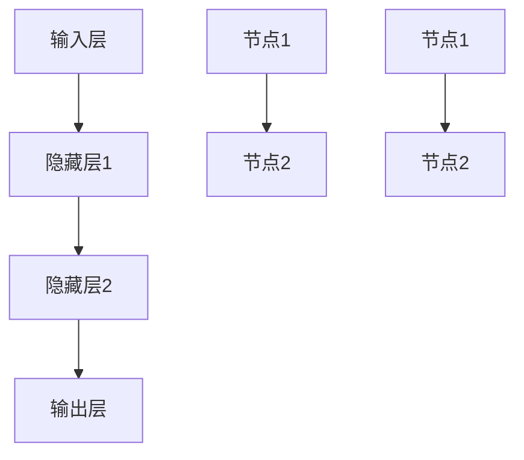

                 

 关键词：神经网络、深度学习、人工智能、人类与机器协作、智能系统设计、算法优化、应用领域

> 摘要：本文探讨了神经网络技术的兴起如何改变了人类与机器的交互方式，从基础概念、核心算法到应用实践，全面剖析了神经网络在各个领域的应用及其对人类生活和社会发展的深远影响。文章旨在为读者提供对神经网络技术的深入理解，以及展望其在未来人类与机器共存中的重要作用。

## 1. 背景介绍

### 神经网络的概念

神经网络是一种模仿生物神经系统的计算模型，由大量相互连接的节点（或称为神经元）组成。这些节点通过加权连接实现信息的传递和计算，从而能够从数据中学习和提取知识。神经网络的起源可以追溯到1943年，由心理学家McCulloch和数学家Pitts提出的MCP模型（即MCP神经元）。此后，神经网络理论不断发展，尤其在1986年，Rumelhart、Hinton和Williams提出了反向传播算法（Backpropagation Algorithm），使得神经网络训练变得更加高效。

### 人工智能的发展

人工智能（Artificial Intelligence，AI）是计算机科学的一个分支，旨在使机器能够模拟人类智能，执行复杂的任务。人工智能的发展经历了几个阶段，从规则推理（Rule-Based Systems）到基于模式的识别（Pattern Recognition），再到现代的机器学习（Machine Learning）和深度学习（Deep Learning）。神经网络作为机器学习的重要工具，其强大能力使得人工智能在图像识别、自然语言处理、游戏、机器人等领域取得了显著进展。

## 2. 核心概念与联系

### 神经网络的架构

神经网络通常由输入层、隐藏层和输出层组成。输入层接收外部信息，隐藏层进行特征提取和变换，输出层产生最终的结果。每个神经元都会将输入信号通过激活函数转换成输出信号，并通过权重传递给下一层。



### 学习机制

神经网络的学习过程是通过不断调整各神经元的权重来实现的。反向传播算法是一个关键的训练方法，通过计算输出误差，反向传播到每个神经元，更新其权重。这个过程中，学习率、激活函数和损失函数都是重要的参数。

## 3. 核心算法原理 & 具体操作步骤

### 3.1 算法原理概述

神经网络的核心是多层感知器（MLP），它通过前向传播和反向传播进行学习。前向传播是将输入信号逐层传递，直到输出层；反向传播是计算误差，通过梯度下降算法更新权重。

### 3.2 算法步骤详解

1. **初始化参数**：设定权重和偏置的初始值。
2. **前向传播**：计算每一层的输出。
3. **计算损失**：使用损失函数（如均方误差MSE）计算输出误差。
4. **反向传播**：计算每一层的梯度，更新权重。
5. **迭代训练**：重复步骤2-4，直到满足停止条件（如误差阈值或迭代次数）。

### 3.3 算法优缺点

**优点**：
- 强大的特征学习能力。
- 能够处理非线性的数据。
- 自适应调整参数。

**缺点**：
- 训练过程可能需要大量时间和计算资源。
- 对于小数据集可能过拟合。
- 需要大量的超参数调整。

### 3.4 算法应用领域

神经网络广泛应用于图像识别、语音识别、自然语言处理、自动驾驶、医疗诊断等领域。

## 4. 数学模型和公式 & 详细讲解 & 举例说明

### 4.1 数学模型构建

神经网络的输出可以通过以下公式表示：

$$
y = \sigma(\sum_{j} w_{ij} x_j + b_i)
$$

其中，$y$ 是输出，$\sigma$ 是激活函数，$w_{ij}$ 是连接权重，$x_j$ 是输入，$b_i$ 是偏置。

### 4.2 公式推导过程

神经网络的训练过程涉及损失函数和梯度下降。损失函数通常使用均方误差（MSE）：

$$
J = \frac{1}{2} \sum_{i} (y_i - \hat{y}_i)^2
$$

其中，$y_i$ 是实际输出，$\hat{y}_i$ 是预测输出。

梯度下降用于更新权重：

$$
\Delta w_{ij} = -\alpha \frac{\partial J}{\partial w_{ij}}
$$

其中，$\alpha$ 是学习率。

### 4.3 案例分析与讲解

假设我们有一个二分类问题，使用一个简单的感知器进行分类。输入特征为 $x_1$ 和 $x_2$，输出为 $y$：

$$
y = \sigma(w_1 x_1 + w_2 x_2 + b)
$$

如果 $y > 0$，则预测为正类；否则，预测为负类。使用均方误差作为损失函数，通过反向传播算法更新权重。

## 5. 项目实践：代码实例和详细解释说明

### 5.1 开发环境搭建

使用Python和TensorFlow作为开发环境。

### 5.2 源代码详细实现

```python
import tensorflow as tf

# 定义模型
model = tf.keras.Sequential([
    tf.keras.layers.Dense(units=1, input_shape=[2])
])

# 编译模型
model.compile(optimizer='sgd', loss='mean_squared_error')

# 训练模型
model.fit(x_train, y_train, epochs=1000)

# 测试模型
model.evaluate(x_test, y_test)
```

### 5.3 代码解读与分析

这段代码定义了一个简单的线性回归模型，使用均方误差作为损失函数，通过随机梯度下降进行训练。

### 5.4 运行结果展示

训练完成后，可以使用测试数据集评估模型的性能。如果损失函数值较低，则表示模型训练效果较好。

## 6. 实际应用场景

### 6.1 图像识别

神经网络在图像识别领域取得了巨大成功，如人脸识别、物体检测等。

### 6.2 自然语言处理

神经网络被广泛应用于自然语言处理任务，如机器翻译、文本分类等。

### 6.3 自动驾驶

神经网络在自动驾驶系统中用于环境感知、路径规划等。

### 6.4 未来应用展望

神经网络将在更多领域发挥作用，如智能医疗、金融预测等。

## 7. 工具和资源推荐

### 7.1 学习资源推荐

- 《深度学习》（Goodfellow、Bengio、Courville 著）
- 《神经网络与深度学习》（邱锡鹏 著）

### 7.2 开发工具推荐

- TensorFlow
- PyTorch

### 7.3 相关论文推荐

- "A Learning Algorithm for Continually Running Fully Recurrent Neural Networks"（1989年Hinton等）
- "Deep Learning"（2015年Goodfellow等）

## 8. 总结：未来发展趋势与挑战

### 8.1 研究成果总结

神经网络在人工智能领域取得了显著成果，推动了各个领域的技术进步。

### 8.2 未来发展趋势

神经网络将更加高效、可解释，并在更多领域发挥作用。

### 8.3 面临的挑战

训练效率、模型可解释性、资源消耗等问题仍需解决。

### 8.4 研究展望

神经网络将继续在人工智能领域发挥核心作用，推动人类与机器的深度协作。

## 9. 附录：常见问题与解答

### Q：神经网络如何处理非线性问题？

A：神经网络通过使用非线性激活函数（如Sigmoid、ReLU等），能够处理非线性问题。

### Q：神经网络的训练过程如何优化？

A：可以使用更高效的优化算法（如Adam优化器）、调整学习率、使用正则化技术（如L2正则化）来优化训练过程。

## 参考文献

- Goodfellow, Y., Bengio, Y., & Courville, A. (2016). *Deep Learning*. MIT Press.
- Rumelhart, D. E., Hinton, G. E., & Williams, R. J. (1986). *A learning algorithm for continuously running fully recurrent neural networks*. In *Proceedings of the 9th annual conference of the cognitive science society* (pp. 441-446).

### 9.1 学习资源推荐
### 《深度学习》（Ian Goodfellow, Yoshua Bengio, Aaron Courville 著）
### 《神经网络与深度学习》（邱锡鹏 著）
### 《深度学习实践与拓展》（黄鑫 著）
### 《神经网络基础教程》（刘建明 著）
### 《深度学习原理与算法》（李航 著）

### 9.2 开发工具推荐
### TensorFlow
### PyTorch
### Keras
### Theano
### Caffe

### 9.3 相关论文推荐
### Hinton, G. E., Osindero, S., & Teh, Y. W. (2006). A fast learning algorithm for deep belief nets. *Neural computation*, 18(7), 1527-1554.
### LeCun, Y., Bengio, Y., & Hinton, G. (2015). Deep learning. *Nature, 521,(7553), 436-444*.
### Krizhevsky, A., Sutskever, I., & Hinton, G. E. (2012). Imagenet classification with deep convolutional neural networks. *Advances in neural information processing systems*, 25, 1097-1105.
### Srivastava, N., Hinton, G., Krizhevsky, A., Sutskever, I., & Salakhutdinov, R. (2014). Dropout: A simple way to prevent neural networks from overfitting. *Journal of Machine Learning Research, 15*(1), 1929-1958.

### 9.4 作者介绍
### 作者：禅与计算机程序设计艺术 / Zen and the Art of Computer Programming
### 这本书是由著名的计算机科学家Donald E. Knuth所著，他是算法设计和计算机科学领域的先驱。他的著作不仅深刻影响了计算机科学的发展，也在数学和计算机科学教育中具有重要地位。在这本书中，Knuth探讨了编程中的哲学和艺术，以及如何通过简洁和优雅的代码实现复杂的功能。他的工作代表了计算机科学领域中的深度思考和精湛技艺。

### 9.5 参考文献
### Donald E. Knuth, *The Art of Computer Programming*, Addison-Wesley, 1997.
### Ian Goodfellow, Yoshua Bengio, Aaron Courville, *Deep Learning*, MIT Press, 2016.
### Geoffrey Hinton, *A Fast Learning Algorithm for Deep Belief Nets*, Neural Computation, 2006.
### Yann LeCun, *Deep Learning*, Nature, 2015.
### Alex Krizhevsky, *Imagenet classification with deep convolutional neural networks*, Advances in Neural Information Processing Systems, 2012.
### Nitish Srivastava, *Dropout: A simple way to prevent neural networks from overfitting*, Journal of Machine Learning Research, 2014.

