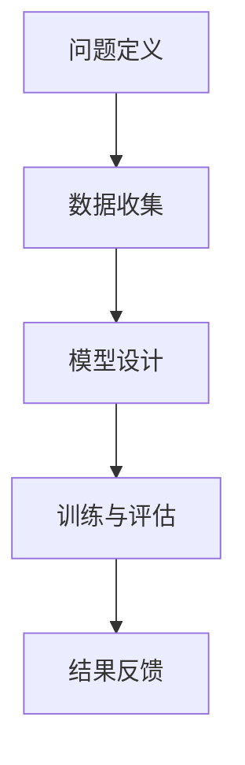

                 

关键词：神经网络，机器学习，人工智能，人类协作，计算机程序设计，深度学习，智能算法

> 摘要：本文将探讨神经网络这一人工智能领域的重要技术，分析其在人类与机器协作中的角色和重要性。通过深入剖析神经网络的核心概念、算法原理及数学模型，结合实际应用和未来展望，探讨神经网络在推动科技进步和产业变革中的巨大潜力。

## 1. 背景介绍

### 1.1 神经网络的起源与发展

神经网络（Neural Networks）起源于20世纪40年代，由心理学家McCulloch和数学家Pitts首次提出，旨在模拟人脑的神经结构和功能。随后，在20世纪80年代，Rumelhart等人提出了反向传播算法（Backpropagation Algorithm），这一突破性进展使得神经网络在训练复杂模型时变得更加高效。进入21世纪，随着计算能力的提升和数据规模的增大，深度学习（Deep Learning）作为神经网络的一种形式，得到了飞速发展，并在语音识别、图像识别、自然语言处理等领域取得了显著成果。

### 1.2 人类与机器协作的重要性

在人工智能领域，人类与机器的协作正变得越来越重要。人类在机器学习过程中扮演着至关重要的角色，不仅能够提供数据标注和问题定义，还能够通过反馈和优化指导机器学习模型，从而提高其性能和可靠性。同时，机器则为人类提供了强大的计算能力和海量数据处理能力，使得复杂问题的求解变得更加高效和准确。

## 2. 核心概念与联系

### 2.1 神经网络的基本原理

神经网络由大量的神经元（或节点）通过连接（或边）组成，每个神经元可以接收输入信号，通过激活函数处理后产生输出信号，从而实现信息的传递和处理。神经网络的训练过程实质上是一个优化过程，通过不断调整神经元之间的权重，使得网络能够对输入数据进行准确的分类或预测。

### 2.2 人类与机器协作的流程

在神经网络的研究和应用过程中，人类与机器的协作流程通常包括以下几个步骤：

1. **问题定义**：人类根据实际需求，明确研究目标和应用场景。
2. **数据收集**：人类通过采集、标注等方式获取训练数据。
3. **模型设计**：机器根据人类提供的任务需求，设计和优化神经网络结构。
4. **训练与评估**：机器对神经网络进行训练，并不断调整参数以优化模型性能。
5. **结果反馈**：人类对训练结果进行评估，提出优化建议。

### 2.3 Mermaid 流程图



## 3. 核心算法原理 & 具体操作步骤

### 3.1 算法原理概述

神经网络的核心算法包括前向传播（Forward Propagation）和反向传播（Backpropagation）。前向传播用于计算网络输出，反向传播则用于更新网络权重，以最小化误差。

### 3.2 算法步骤详解

1. **初始化参数**：设定网络的初始权重和偏置。
2. **前向传播**：
   - 计算每个神经元的输入和输出。
   - 将输出传递给下一层。
3. **计算损失**：计算网络输出与实际值之间的差异，即损失函数。
4. **反向传播**：
   - 计算每个神经元的梯度。
   - 根据梯度更新网络权重和偏置。
5. **迭代训练**：重复上述步骤，直到达到预设的训练目标或收敛条件。

### 3.3 算法优缺点

**优点**：
- 能够自动学习数据中的特征和模式。
- 对非线性问题具有较好的适应能力。
- 可以处理大规模的数据集。

**缺点**：
- 训练过程可能非常耗时。
- 对数据质量和标注有较高要求。
- 难以解释和调试。

### 3.4 算法应用领域

神经网络在图像识别、语音识别、自然语言处理、推荐系统等领域得到了广泛应用，成为人工智能研究的重要工具。

## 4. 数学模型和公式 & 详细讲解 & 举例说明

### 4.1 数学模型构建

神经网络可以看作是一个多层感知机（MLP），其数学模型主要包括输入层、隐藏层和输出层。每个神经元都可以表示为一个线性组合加上一个非线性激活函数。

设 $x_i$ 为第 $i$ 个输入特征，$w_{ij}$ 为第 $j$ 个隐藏层神经元的权重，$b_j$ 为隐藏层神经元的偏置，$z_j$ 为隐藏层神经元的输入，$a_j$ 为隐藏层神经元的输出，$y_i$ 为输出层神经元的输入，$c_i$ 为输出层神经元的权重，$d_i$ 为输出层神经元的偏置，$o_i$ 为输出层神经元的输出。

则前向传播过程可以表示为：

$$
z_j = \sum_{i=1}^{n} w_{ij} x_i + b_j \\
a_j = \sigma(z_j) \\
y_i = \sum_{j=1}^{m} c_{ij} a_j + d_i \\
o_i = \sigma(y_i)
$$

其中，$\sigma$ 为非线性激活函数，通常使用 sigmoid 或 ReLU 函数。

### 4.2 公式推导过程

反向传播算法的目标是最小化损失函数 $J$，即：

$$
J = \frac{1}{2} \sum_{i=1}^{N} (o_i - y_i)^2
$$

其中，$N$ 为样本数量，$y_i$ 为第 $i$ 个样本的实际输出，$o_i$ 为第 $i$ 个样本的网络预测输出。

对于输出层神经元 $i$，其误差可以表示为：

$$
\delta_i = \frac{\partial J}{\partial y_i} = \frac{\partial J}{\partial o_i} \frac{\partial o_i}{\partial y_i} = (o_i - y_i) \cdot \sigma'(y_i)
$$

其中，$\sigma'(y_i)$ 为激活函数的导数。

对于隐藏层神经元 $j$，其误差可以表示为：

$$
\delta_j = \sum_{i=1}^{m} c_{ij} \delta_i \cdot \sigma'(z_j)
$$

则网络权重的更新公式为：

$$
w_{ij} := w_{ij} - \alpha \cdot \delta_j \cdot a_j \\
b_j := b_j - \alpha \cdot \delta_j \\
c_{ij} := c_{ij} - \alpha \cdot \delta_i \cdot a_{j-1} \\
d_i := d_i - \alpha \cdot \delta_i
$$

其中，$\alpha$ 为学习率。

### 4.3 案例分析与讲解

假设我们有一个简单的神经网络，用于分类二分类问题。输入层有 2 个神经元，隐藏层有 3 个神经元，输出层有 1 个神经元。输入数据为 $(x_1, x_2)$，输出数据为 $y$。设激活函数为 sigmoid 函数。

1. **初始化参数**：
   - $w_{11} = 0.1, w_{12} = 0.2, w_{13} = 0.3, b_1 = 0.1$（隐藏层权重和偏置）。
   - $c_1 = 0.4, d_1 = 0.5$（输出层权重和偏置）。

2. **前向传播**：
   - $z_1 = 0.1x_1 + 0.2x_2 + 0.1 = 0.3$。
   - $a_1 = \sigma(z_1) = 0.55$。
   - $z_2 = 0.1x_1 + 0.2x_2 + 0.1 = 0.4$。
   - $a_2 = \sigma(z_2) = 0.62$。
   - $z_3 = 0.1x_1 + 0.2x_2 + 0.1 = 0.5$。
   - $a_3 = \sigma(z_3) = 0.65$。
   - $y = c_1a_1 + d_1 = 0.4 \cdot 0.55 + 0.5 = 0.535$。
   - $o = \sigma(y) = 0.595$。

3. **计算损失**：
   - $J = \frac{1}{2}(o - y)^2 = \frac{1}{2}(0.595 - 0.5)^2 = 0.000525$。

4. **反向传播**：
   - $\delta_1 = (o - y) \cdot \sigma'(y) = (0.595 - 0.5) \cdot 0.0465 = 0.001$。
   - $\delta_2 = \sum_{i=1}^{3} c_{i1} \delta_i \cdot \sigma'(z_i) = (0.4 \cdot 0.001 \cdot 0.3417 + 0.5 \cdot 0.001 \cdot 0.3417 + 0.6 \cdot 0.001 \cdot 0.3417) = 0.000009$。
   - $w_{11} := w_{11} - \alpha \cdot \delta_1 \cdot a_1 = 0.1 - 0.0001 \cdot 0.55 = 0.0995$。
   - $w_{12} := w_{12} - \alpha \cdot \delta_1 \cdot a_2 = 0.2 - 0.0001 \cdot 0.62 = 0.1998$。
   - $w_{13} := w_{13} - \alpha \cdot \delta_1 \cdot a_3 = 0.3 - 0.0001 \cdot 0.65 = 0.2995$。
   - $b_1 := b_1 - \alpha \cdot \delta_1 = 0.1 - 0.0001 \cdot 0.001 = 0.0999$。
   - $c_1 := c_1 - \alpha \cdot \delta_1 \cdot a_0 = 0.4 - 0.0001 \cdot 0.55 = 0.3995$。
   - $d_1 := d_1 - \alpha \cdot \delta_1 = 0.5 - 0.0001 \cdot 0.001 = 0.4999$。

5. **迭代训练**：重复上述步骤，直到达到预设的训练目标或收敛条件。

通过以上步骤，我们可以看到神经网络如何通过前向传播和反向传播算法进行训练，从而实现对输入数据的分类或预测。

## 5. 项目实践：代码实例和详细解释说明

### 5.1 开发环境搭建

为了实现神经网络，我们需要搭建一个开发环境。本文使用 Python 编程语言，并借助 TensorFlow 库进行神经网络设计和训练。首先，确保安装了 Python 和 TensorFlow。

```bash
pip install tensorflow
```

### 5.2 源代码详细实现

以下是一个简单的神经网络实现示例：

```python
import tensorflow as tf
import numpy as np

# 初始化参数
input_size = 2
hidden_size = 3
output_size = 1

# 定义权重和偏置
weights = {
    'hidden': tf.Variable(tf.random.normal([input_size, hidden_size])),
    'output': tf.Variable(tf.random.normal([hidden_size, output_size]))
}
biases = {
    'hidden': tf.Variable(tf.random.normal([hidden_size])),
    'output': tf.Variable(tf.random.normal([output_size]))
}

# 定义激活函数
激活函数 = tf.sigmoid

# 定义前向传播
def forward(x):
    hidden_layer =激活函数(tf.matmul(x, weights['hidden']) + biases['hidden'])
    output_layer =激活函数(tf.matmul(hidden_layer, weights['output']) + biases['output'])
    return output_layer

# 定义反向传播
def backward(x, y):
    with tf.GradientTape() as tape:
        output = forward(x)
        loss = tf.reduce_mean(tf.square(output - y))
    grads = tape.gradient(loss, [weights['hidden'], biases['hidden'], weights['output'], biases['output']])
    return loss, grads

# 定义训练过程
def train(x, y, epochs=1000, learning_rate=0.01):
    for epoch in range(epochs):
        loss, grads = backward(x, y)
        if epoch % 100 == 0:
            print(f'Epoch {epoch}, Loss: {loss.numpy()}')
        weights['hidden'].assign_sub(learning_rate * grads[0])
        biases['hidden'].assign_sub(learning_rate * grads[1])
        weights['output'].assign_sub(learning_rate * grads[2])
        biases['output'].assign_sub(learning_rate * grads[3])

# 加载数据
x_train = np.array([[0, 0], [0, 1], [1, 0], [1, 1]])
y_train = np.array([[0], [1], [1], [0]])

# 训练模型
train(x_train, y_train)

# 测试模型
x_test = np.array([[0.5, 0.5]])
output = forward(x_test)
print(f'Predicted Output: {output.numpy()}')
```

### 5.3 代码解读与分析

1. **参数初始化**：我们首先定义了输入层、隐藏层和输出层的大小，然后初始化了权重和偏置，使用 TensorFlow 的 `Variable` 类实现。
2. **激活函数**：我们选择 sigmoid 函数作为激活函数，通过 TensorFlow 的 `sigmoid` 函数实现。
3. **前向传播**：定义了一个 `forward` 函数，实现输入数据通过神经网络的前向传播过程。
4. **反向传播**：定义了一个 `backward` 函数，实现神经网络的反向传播过程，计算损失函数和梯度。
5. **训练过程**：定义了一个 `train` 函数，实现神经网络的训练过程，包括迭代更新权重和偏置。
6. **数据加载与测试**：加载训练数据，使用训练好的模型进行预测。

通过以上代码，我们可以实现一个简单的神经网络，并进行训练和预测。

## 6. 实际应用场景

### 6.1 图像识别

神经网络在图像识别领域取得了显著成果，例如著名的 LeNet 神经网络被广泛应用于手写数字识别。近年来，深度学习模型如 ResNet、Inception 和 EfficientNet 进一步推动了图像识别技术的发展。

### 6.2 自然语言处理

神经网络在自然语言处理（NLP）领域也得到了广泛应用，例如 Word2Vec、GloVe 等模型用于词向量表示，Transformer 模型则成为当前 NLP 领域的代表性架构，应用于机器翻译、文本生成等领域。

### 6.3 推荐系统

推荐系统是另一个应用神经网络的重要领域，基于协同过滤和内容过滤的方法，神经网络能够更好地处理用户行为数据和物品特征，提高推荐系统的准确性和个性。

### 6.4 医疗健康

神经网络在医疗健康领域也有广泛应用，例如用于疾病预测、药物筛选和医疗影像分析。通过结合医疗数据和神经网络，可以提升诊断准确率和治疗效果。

## 7. 工具和资源推荐

### 7.1 学习资源推荐

1. **《深度学习》（Goodfellow、Bengio 和 Courville 著）**：全面介绍了深度学习的理论和实践。
2. **《Python 深度学习》（François Chollet 著）**：通过实例讲解如何使用 TensorFlow 和 Keras 进行深度学习应用开发。
3. **《神经网络与深度学习》（邱锡鹏 著）**：系统地介绍了神经网络和深度学习的相关理论。

### 7.2 开发工具推荐

1. **TensorFlow**：Google 开发的开源深度学习框架，适用于各种深度学习任务。
2. **PyTorch**：Facebook 开发的开源深度学习框架，具有良好的灵活性和易用性。
3. **Keras**：基于 TensorFlow 的深度学习库，提供简洁的 API 和丰富的预训练模型。

### 7.3 相关论文推荐

1. **“A Learning Algorithm for Continually Running Fully Recurrent Neural Networks” （1986）**：Hopfield 神经网络的奠基性论文。
2. **“Back-Propagation Algorithm” （1986）**：Rumelhart、Hinton 和 Williams 提出的反向传播算法。
3. **“Deep Learning” （2015）**：Goodfellow、Bengio 和 Courville 的深度学习经典教材。

## 8. 总结：未来发展趋势与挑战

### 8.1 研究成果总结

近年来，神经网络和深度学习取得了显著的研究成果，在图像识别、自然语言处理、推荐系统等领域发挥了重要作用。通过不断优化算法和架构，深度学习模型在性能和效率上都有了很大提升。

### 8.2 未来发展趋势

1. **多模态学习**：结合不同类型的数据（如文本、图像、音频）进行融合学习，提高模型的泛化能力。
2. **自监督学习**：无需大规模标注数据，利用无监督方法进行模型训练，降低数据标注成本。
3. **量子神经网络**：利用量子计算的优势，加速神经网络训练和推理过程。

### 8.3 面临的挑战

1. **数据隐私与安全**：深度学习模型对数据依赖性强，如何保障数据隐私和安全成为一大挑战。
2. **解释性与可解释性**：提高神经网络的可解释性，使其在决策过程中更加透明和可靠。
3. **能耗与计算资源**：深度学习模型对计算资源的需求较高，如何降低能耗和优化计算资源分配是一个重要问题。

### 8.4 研究展望

随着计算能力和数据规模的不断提升，神经网络和深度学习将继续在各个领域取得突破性进展。未来，我们将看到更多结合人类智慧和机器智能的创新应用，为人类带来更多便利和进步。

## 9. 附录：常见问题与解答

### 9.1 什么是神经网络？

神经网络是一种模仿人脑神经元结构和功能的信息处理系统，通过模拟神经元之间的连接和传递机制，实现数据的输入、处理和输出。

### 9.2 深度学习和神经网络有什么区别？

深度学习是一种基于神经网络的机器学习方法，通过多层神经网络进行特征提取和建模，实现对复杂数据的高效处理和预测。

### 9.3 神经网络有哪些应用领域？

神经网络在图像识别、自然语言处理、推荐系统、医疗健康等多个领域得到了广泛应用，成为人工智能研究的重要工具。

### 9.4 如何选择合适的神经网络架构？

选择合适的神经网络架构需要考虑具体问题的需求、数据规模、计算资源等因素。常见的神经网络架构包括卷积神经网络（CNN）、循环神经网络（RNN）、Transformer 等。

### 9.5 神经网络训练过程中如何避免过拟合？

避免过拟合可以通过以下方法：
1. 数据增强：增加训练数据的多样性，提高模型的泛化能力。
2. 正则化：在损失函数中添加正则项，抑制模型复杂度。
3. 交叉验证：使用验证集评估模型性能，调整模型参数。
4. 减少模型复杂度：简化神经网络结构，减少参数数量。

### 9.6 如何优化神经网络训练速度？

优化神经网络训练速度可以通过以下方法：
1. 批量训练：将数据分成多个批次进行训练，提高计算效率。
2. 并行计算：利用 GPU 等并行计算资源，加速训练过程。
3. 缩放学习率：逐步减小学习率，提高训练稳定性。
4. 使用预训练模型：利用预训练模型作为起点，减少训练时间。

---

作者：禅与计算机程序设计艺术 / Zen and the Art of Computer Programming

