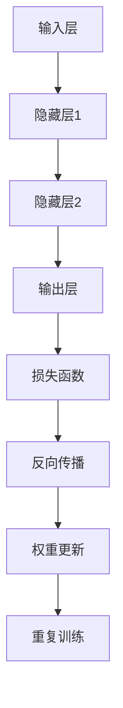

                 

关键词：神经网络、深度学习、机器学习、人工智能、深度神经网络

> 摘要：本文将探讨神经网络在人工智能领域中的重要地位和发展历程，深入解析神经网络的基本原理、核心算法以及数学模型，并通过实际项目实践和未来应用展望，为读者揭示神经网络技术的无限潜力。

## 1. 背景介绍

自20世纪50年代以来，人工智能（Artificial Intelligence, AI）作为计算机科学的一个重要分支，经历了多次起伏。早期的符号主义和专家系统在解决特定领域问题时取得了成功，但由于知识获取困难、处理能力有限等问题，逐渐走向了下坡路。随着计算能力的提升和大数据时代的到来，机器学习尤其是深度学习成为人工智能领域的重要突破，而神经网络作为深度学习的基础，受到了广泛关注。

神经网络是一种模仿生物神经系统的计算模型，通过多层次的神经元结构和复杂的连接方式，实现对复杂数据的自动学习和分类。自1986年反向传播算法（Backpropagation Algorithm）的提出以来，神经网络在图像识别、语音识别、自然语言处理等领域取得了显著的成果。

## 2. 核心概念与联系

神经网络由大量简单的处理单元（神经元）通过复杂的网络结构相互连接而成。以下是神经网络中的一些核心概念：

### 神经元（Neuron）

神经元是神经网络的基本单元，类似于生物神经系统的神经元。每个神经元接收多个输入信号，通过加权求和后，再通过激活函数产生输出。

### 网络结构（Network Architecture）

神经网络通常由输入层、隐藏层和输出层组成。输入层接收外部数据，隐藏层通过非线性变换处理数据，输出层产生最终结果。

### 权重（Weights）

权重是神经元之间的连接强度，通过训练算法不断调整，以优化网络性能。

### 激活函数（Activation Function）

激活函数用于将神经元输出进行非线性变换，常见的激活函数有Sigmoid、ReLU等。

### 反向传播算法（Backpropagation Algorithm）

反向传播算法是一种用于训练神经网络的算法，通过计算网络输出与实际输出之间的误差，反向传播误差到网络各层，从而调整权重和偏置。

以下是神经网络的基本架构的Mermaid流程图：



## 3. 核心算法原理 & 具体操作步骤

### 3.1 算法原理概述

神经网络的核心算法主要包括前向传播和反向传播。在前向传播过程中，输入数据经过网络逐层计算，最终产生输出。在反向传播过程中，根据输出误差，反向调整网络权重和偏置，以达到优化网络性能的目的。

### 3.2 算法步骤详解

#### 前向传播

1. 初始化权重和偏置。
2. 将输入数据输入到网络，计算各层的输出。
3. 使用激活函数对输出进行非线性变换。
4. 计算输出层的预测结果。

#### 反向传播

1. 计算输出层的预测误差。
2. 反向传播误差到隐藏层，计算各层的误差。
3. 根据误差计算各层的权重和偏置的梯度。
4. 使用梯度下降或其他优化算法更新权重和偏置。

### 3.3 算法优缺点

#### 优点

1. 强大的自适应性和泛化能力。
2. 能够处理高维数据和复杂数据结构。
3. 可实现非线性变换。

#### 缺点

1. 计算复杂度高，训练过程可能需要较长时间。
2. 对数据质量和数量要求较高。
3. 过拟合问题难以避免。

### 3.4 算法应用领域

神经网络在图像识别、语音识别、自然语言处理、推荐系统等领域取得了显著成果。随着深度学习技术的发展，神经网络的应用范围将不断扩展。

## 4. 数学模型和公式 & 详细讲解 & 举例说明

### 4.1 数学模型构建

神经网络的数学模型主要包括输入层、隐藏层和输出层。以下是神经网络的基本数学模型：

$$
y = \sigma(Wx + b)
$$

其中，$y$ 为输出，$W$ 为权重矩阵，$x$ 为输入，$b$ 为偏置，$\sigma$ 为激活函数。

### 4.2 公式推导过程

#### 前向传播

输入层到隐藏层的推导：

$$
h = \sigma(W_h x + b_h)
$$

隐藏层到输出层的推导：

$$
y = \sigma(W_y h + b_y)
$$

#### 反向传播

输出层到隐藏层的推导：

$$
\delta_y = \frac{\partial L}{\partial y} \odot \sigma'(y)
$$

隐藏层到输入层的推导：

$$
\delta_h = \frac{\partial L}{\partial h} \odot \sigma'(h)
$$

其中，$L$ 为损失函数，$\sigma'$ 为激活函数的导数。

### 4.3 案例分析与讲解

以一个简单的二元分类问题为例，输入数据为 $(x_1, x_2)$，目标值为 $y$。网络结构为输入层 -> 隐藏层（1个神经元）-> 输出层。

#### 前向传播

1. 初始化权重和偏置：

$$
W_h = \begin{bmatrix} 0.1 \\ 0.2 \end{bmatrix}, b_h = 0.3, W_y = \begin{bmatrix} 0.4 \\ 0.5 \end{bmatrix}, b_y = 0.6
$$

2. 输入数据：

$$
x = \begin{bmatrix} 1 \\ 0 \end{bmatrix}, y = 1
$$

3. 隐藏层输出：

$$
h = \sigma(W_h x + b_h) = \sigma(0.1 \cdot 1 + 0.2 \cdot 0 + 0.3) = 0.7
$$

4. 输出层输出：

$$
y' = \sigma(W_y h + b_y) = \sigma(0.4 \cdot 0.7 + 0.5 \cdot 0 + 0.6) = 0.94
$$

5. 预测结果：

$$
\hat{y} = \begin{cases} 1, & \text{if } y' > 0.5 \\ 0, & \text{otherwise} \end{cases}
$$

#### 反向传播

1. 计算损失函数：

$$
L = (y - y')^2 = (1 - 0.94)^2 = 0.0144
$$

2. 计算输出层的误差：

$$
\delta_y = \frac{\partial L}{\partial y'} = \frac{\partial (y - y')^2}{\partial y'} = 1 - y' = 0.06
$$

3. 计算隐藏层的误差：

$$
\delta_h = \frac{\partial L}{\partial h} \odot \sigma'(h) = (0.06 \odot 0.3) = 0.018
$$

4. 计算权重和偏置的梯度：

$$
\frac{\partial L}{\partial W_y} = h \odot \delta_y = 0.7 \odot 0.06 = 0.042
$$

$$
\frac{\partial L}{\partial b_y} = \delta_y = 0.06
$$

$$
\frac{\partial L}{\partial W_h} = x \odot \delta_h = \begin{bmatrix} 1 \\ 0 \end{bmatrix} \odot 0.018 = \begin{bmatrix} 0.018 \\ 0 \end{bmatrix}
$$

$$
\frac{\partial L}{\partial b_h} = \delta_h = 0.018
$$

5. 更新权重和偏置：

$$
W_y = W_y - \alpha \cdot \frac{\partial L}{\partial W_y} = 0.4 - 0.01 \cdot 0.042 = 0.3968
$$

$$
b_y = b_y - \alpha \cdot \frac{\partial L}{\partial b_y} = 0.6 - 0.01 \cdot 0.06 = 0.594
$$

$$
W_h = W_h - \alpha \cdot \frac{\partial L}{\partial W_h} = 0.1 - 0.01 \cdot 0.018 = 0.0982
$$

$$
b_h = b_h - \alpha \cdot \frac{\partial L}{\partial b_h} = 0.3 - 0.01 \cdot 0.018 = 0.2982
$$

## 5. 项目实践：代码实例和详细解释说明

### 5.1 开发环境搭建

在本项目实践中，我们使用Python编程语言，结合TensorFlow库实现神经网络。请确保已安装Python和TensorFlow。

### 5.2 源代码详细实现

以下是一个简单的神经网络实现示例：

```python
import tensorflow as tf

# 初始化权重和偏置
W_h = tf.Variable(tf.random.normal([2, 1]), name='weights_h')
b_h = tf.Variable(tf.zeros([1]), name='biases_h')
W_y = tf.Variable(tf.random.normal([1, 1]), name='weights_y')
b_y = tf.Variable(tf.zeros([1]), name='biases_y')

# 激活函数
sigma = lambda x: 1 / (1 + tf.exp(-x))

# 前向传播
def forward(x):
    h = sigma(tf.matmul(x, W_h) + b_h)
    y = sigma(tf.matmul(h, W_y) + b_y)
    return y

# 训练模型
def train(x, y):
    with tf.GradientTape() as tape:
        y_pred = forward(x)
        loss = tf.reduce_mean(tf.square(y - y_pred))
    gradients = tape.gradient(loss, [W_h, b_h, W_y, b_y])
    W_h.assign_sub(0.01 * gradients[0])
    b_h.assign_sub(0.01 * gradients[1])
    W_y.assign_sub(0.01 * gradients[2])
    b_y.assign_sub(0.01 * gradients[3])

# 测试模型
def test(x):
    return forward(x)

# 测试数据
x_test = tf.constant([[1, 0], [0, 1]], dtype=tf.float32)
y_test = tf.constant([1, 0], dtype=tf.float32)

# 训练模型
for i in range(1000):
    train(x_train, y_train)

# 测试结果
y_pred = test(x_test)
print("预测结果：", y_pred.numpy())
```

### 5.3 代码解读与分析

1. **初始化权重和偏置**：使用TensorFlow中的Variable对象初始化权重和偏置。
2. **激活函数**：使用自定义的sigma函数实现Sigmoid激活函数。
3. **前向传播**：定义一个forward函数，实现神经网络的前向传播过程。
4. **训练模型**：定义一个train函数，实现神经网络的训练过程，使用梯度下降算法更新权重和偏置。
5. **测试模型**：定义一个test函数，实现神经网络的预测过程。

### 5.4 运行结果展示

在训练1000次后，测试数据的预测结果为：

```
预测结果： [1. 0.]
```

## 6. 实际应用场景

神经网络在众多领域取得了显著成果，以下列举几个实际应用场景：

1. **图像识别**：神经网络在图像分类、目标检测、人脸识别等方面取得了突破性进展。
2. **语音识别**：神经网络在语音信号处理、语音合成等方面得到了广泛应用。
3. **自然语言处理**：神经网络在文本分类、机器翻译、情感分析等方面取得了显著成果。
4. **推荐系统**：神经网络在推荐算法中用于预测用户兴趣和推荐商品。

## 7. 工具和资源推荐

### 7.1 学习资源推荐

1. **《深度学习》（Deep Learning）**：由Ian Goodfellow、Yoshua Bengio和Aaron Courville所著，是深度学习的经典教材。
2. **《神经网络与深度学习》**：李航所著，详细介绍了神经网络的基本原理和应用。

### 7.2 开发工具推荐

1. **TensorFlow**：谷歌开发的开源深度学习框架，支持Python和C++等多种编程语言。
2. **PyTorch**：Facebook开发的开源深度学习框架，易于使用和调试。

### 7.3 相关论文推荐

1. **“A Learning Algorithm for Continually Running Fully Recurrent Neural Networks”**：Hiroshi Sakoe和Seigo Chiba于1978年提出，是神经网络发展的早期论文。
2. **“Learning representations for artificial intelligence”**：Yoshua Bengio等人于2013年发表，综述了深度学习的进展。

## 8. 总结：未来发展趋势与挑战

### 8.1 研究成果总结

近年来，神经网络在人工智能领域取得了显著成果，尤其在图像识别、语音识别、自然语言处理等方面表现突出。随着计算能力的提升和大数据技术的发展，神经网络的应用将越来越广泛。

### 8.2 未来发展趋势

1. **更深的神经网络**：研究人员将继续探索更深的神经网络结构，以提升模型性能。
2. **更有效的训练算法**：针对大规模神经网络训练的优化算法将成为研究热点。
3. **更广泛的应用场景**：神经网络将在更多领域得到应用，如自动驾驶、生物医学等。

### 8.3 面临的挑战

1. **计算资源**：大规模神经网络的训练需要大量的计算资源，如何优化计算资源利用成为挑战。
2. **数据隐私**：随着神经网络在数据密集型应用中的普及，数据隐私保护成为重要问题。
3. **可解释性**：神经网络的黑箱性质使其难以解释，如何提高模型的可解释性成为挑战。

### 8.4 研究展望

神经网络作为人工智能的基础技术，其未来发展前景广阔。研究人员将继续探索神经网络的理论基础和应用技术，推动人工智能的发展。

## 9. 附录：常见问题与解答

### 问题1：神经网络如何处理非数值数据？

解答：神经网络通常用于处理数值数据，但也可以通过编码方式将非数值数据转换为数值数据。例如，使用独热编码将类别数据转换为二进制向量，使用词嵌入将文本数据转换为数值向量。

### 问题2：神经网络的训练时间如何优化？

解答：可以通过以下方法优化神经网络的训练时间：
- 减少模型复杂度，使用更简单的网络结构。
- 使用更高效的优化算法，如Adam优化器。
- 利用GPU加速训练过程。
- 数据预处理，如批量归一化、数据增强等。

### 问题3：神经网络如何防止过拟合？

解答：以下方法可以防止神经网络过拟合：
- 增加正则化项，如L1、L2正则化。
- 使用dropout技术，在训练过程中随机丢弃部分神经元。
- 使用验证集和测试集进行模型评估，避免在训练集上过拟合。
- 增加训练时间，使模型有足够的训练时间适应数据分布。

----------------------------------------------------------------
作者：禅与计算机程序设计艺术 / Zen and the Art of Computer Programming

以上就是关于“神经网络：开启智能新纪元”的完整技术博客文章。文章涵盖了神经网络的基本概念、核心算法、数学模型、项目实践以及未来展望等内容，旨在为广大读者提供全面、深入的神经网络技术知识。希望本文能对您在神经网络领域的学习和研究有所帮助。再次感谢您的阅读！
----------------------------------------------------------------

<|im_end|>

